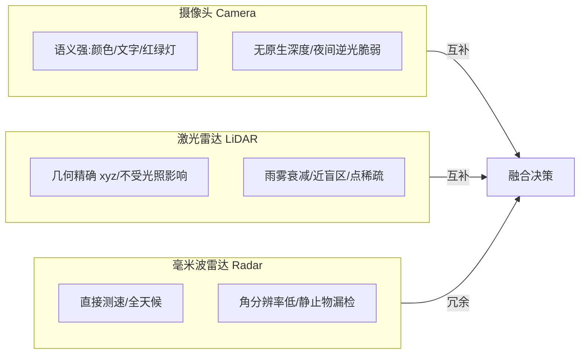

# 一、环境感知：让车"看见"世界的三种眼睛

## 引言：那一晚，纯视觉系统让 AEB 误踩了刹车

那是一次夜间城郊路测。工程师老周坐在副驾，主驾是刚接手项目的年轻同事，车端跑的是一套"纯视觉（camera-only）"感知栈。前方是一段逆光的下坡路，落日把天空烧成一片刺眼的橙红，而坡底站着一位穿黑衣、骑电动车的行人，几乎融进了阴影里。

摄像头的 ISP（Image Signal Processor，图像信号处理器）被强光压得失去细节，神经网络（CNN，Convolutional Neural Network）在后处理里把那团黑影判成了"低置信度的背景"，于是目标列表里压根没有这个行人。问题来了：旁边的护栏在逆光下被误触发了一帧"车辆"检测，再加上一段噪声化的深度估计，AEB（Automatic Emergency Braking，自动紧急制动）触发逻辑误以为有静止车辆逼近，一脚刹车把坐在后排的测试员差点甩出去。

回到实验室复盘，大家达成一个共识：单一传感器在极端场景下一定会"失明"。摄像头有逆光、低纹理、夜间瓶颈；激光雷达（LiDAR，Light Detection And Ranging）有雨雪衰减；毫米波雷达（Radar）有低角分辨率和杂波。真正能上路的系统，靠的是"三种眼睛"的互补与冗余。本章就带你把这三种眼睛拆开看清楚。

## 核心概念：三种眼睛各自是什么、能看多远、怕什么

### 摄像头：最像人眼，也最依赖算法

摄像头本质是被动光学成像。从现实世界到一帧像素，中间要经过镜头投影、CMOS 曝光、ISP 去马赛克/降噪/宽动态（WDR，Wide Dynamic Range）/白平衡，最后才进神经网络。它的强项是语义丰富——颜色、文字、红绿灯状态、车道线拓扑，这些只有图像能给。弱项是：没有原生的深度（depth），夜间与逆光脆弱，且对算力要求高。

### 激光雷达：用光"丈量"三维

激光雷达主动发射近红外脉冲，靠飞行时间（ToF，Time of Flight）测距，输出的是稀疏但带精确 xyz 的点云（point cloud）。它的强项是几何精确、不受光照影响、能直接给 3D 框；弱项是成本高、雨雾雪有衰减、近处盲区、点云稀疏（远处一辆车可能只剩几十个点）。

### 毫米波雷达：多普勒的物理学礼物

雷达发射 77GHz 频段电磁波，靠回波的多普勒频移（Doppler shift）直接得到径向速度，且几乎不受雨雪雾影响。4D 雷达（4D Radar，在距离/方位/速度基础上增加俯仰/高程维度）正在补齐"看高度"的短板。它的最大弱点是角分辨率低、点云噪声大、对静止金属物容易漏检（因多径与 CFAR 门限）。

三类传感器在分辨率、距离、天气上的差异，可以用一张对比框图概括：



## 机制深拆：从原始信号到目标框的几条关键路径

### 摄像头几何基础

针孔相机模型把三维点投影到像素平面。设相机坐标系下的点 $P_c=(X,Y,Z)^T$，其像素坐标为

$$
u = f_x \frac{X}{Z} + c_x, \quad v = f_y \frac{Y}{Z} + c_y
$$

其中 $(f_x,f_y)$ 是焦距以像素计，$(c_x,c_y)$ 是主点。这套内参（intrinsics）和外参（extrinsics，相机到车体）都必须经过标定（calibration），误差一个像素在 50 米外就对应约 0.1 米的横向偏移。

2D 目标检测（object detection）早期是两阶段（R-CNN 族先提候选框再分类），如今量产多用单阶段（single-stage）检测器如 YOLO 思路：把图像划分网格，每个格子直接回归边界框（bounding box）与类别置信度，一次前向（forward）出结果，延迟低、适合车规。车道线与交通灯识别常在检测之上再加结构化解码（如车道参数化曲线、灯色分类头）。语义分割（semantic segmentation）用 FCN（Fully Convolutional Network）或 SegFormer 类 Transformer 给每个像素打标签，得到"可行驶区域""路沿"等稠密掩码。

单目深度估计（monocular depth estimation）有两条路线：几何路线靠已知尺寸/地平线/运动恢复结构（SfM，Structure from Motion）；学习路线（如 MiDaS、Depth Anything）用大模型直接回归相对深度，再经尺度对齐得到公制深度。它的物理含义是：相机没有第二只眼，深度是"猜"出来的，必须靠时序或多目（stereo）约束去消除尺度模糊。

### 激光雷达点云处理

点云是无序、稀疏、非均匀的。检测框架 PointPillars 的巧思是：把地面俯视图（BEV，Bird's Eye View）切成柱子（pillar），用 PointNet 思想提取每根柱子的特征，再上 2D 卷积做检测，兼顾速度与精度。PV-RCNN 则结合体素（voxel）与关键点的两阶段思路，精度更高、算力更贵。

点云分割（segmentation）常按地面拟合（RANSAC 平面拟合）先把地去掉，再做聚类或语义分割。ROI（Region of Interest）提取则限定在自车前方锥形或感兴趣带，降低后续计算量。

### 毫米波雷达测速原理

雷达测量的是目标的径向速度。发射频率 $f_0$，回波因多普勒产生频移 $f_d = \frac{2 v_r}{c} f_0$，其中 $v_r$ 是径向速度，$c$ 是光速。由此可直接解算速度，这是雷达区别于摄像头与激光的最大优势——它天生"自带速度计"。

## 工程实践：一帧点云地面过滤 + 聚类出候选框

下面给一段示意 Python，读一帧点云，做简单的地面平面过滤，再用欧氏距离聚类得到候选目标框。生产里会用 GPU 加速和更稳的地面拟合，但思路一致。

```python
import numpy as np
from sklearn.cluster import DBSCAN

def filter_ground(points, z_thresh=0.3, slope=0.15):
    """极简地面过滤：低于地面高度且起伏小的点视为地面。"""
    # points: (N, 3) 单位米，z 为离地高度
    ground_mask = (np.abs(points[:, 2]) < z_thresh)
    # 也可做 RANSAC 平面拟合得到更精确地面模型
    return points[~ground_mask]

def cluster_objects(points, eps=0.8, min_pts=5):
    """欧氏聚类得到候选目标，返回每个簇的 AABB 框。"""
    # 车规落地坑：DBSCAN 在 CPU 上 N 较大时很慢，需体素下采样或 GPU 实现
    db = DBSCAN(eps=eps, min_samples=min_pts, algorithm='ball_tree').fit(points[:, :2])
    labels = db.labels_
    boxes = []
    for lab in set(labels):
        if lab == -1:
            continue  # 噪声点
        cluster = points[labels == lab]
        xmin, ymin = cluster[:, 0].min(), cluster[:, 1].min()
        xmax, ymax = cluster[:, 0].max(), cluster[:, 1].max()
        zmax = cluster[:, 2].max()
        boxes.append({
            'center': [(xmin + xmax) / 2, (ymin + ymax) / 2],
            'size':   [xmax - xmin, ymax - ymin, zmax],
            'points': len(cluster),
        })
    return boxes

def perception_step(frame_pcd):
    non_ground = filter_ground(frame_pcd)
    candidates = cluster_objects(non_ground)
    # 后续：把候选框送进神经网络分类 / 与雷达 Radar 目标关联
    return candidates
```

车规（automotive-grade）落地坑：点云稀疏导致远处目标点太少、DBSCAN 阈值难调；地面拟合在坡道/路肩失效；时间戳（timestamp）对齐要求微秒级，否则运动畸变（motion distortion）让框歪掉；嵌入式算力下要体素下采样与定点化（quantization）。

## 常见坑（12 条）

1. 坐标系混乱：相机、激光、雷达、车体、导航坐标系混用，忘了绕轴顺序（Roll-Pitch-Yaw 还是 ZYX），结果框"飞"到天上。
2. 时间戳不对齐：不同传感器采样率不同（相机 30Hz、激光 10Hz、雷达 20Hz），不做软同步/硬同步就会引入运动畸变。
3. 标定漂移：振动与温度让外参缓慢变化，长期不重标定，检测框持续偏移。
4. 运动畸变：机械旋转激光在扫描一帧（约 100ms）内车体在动，点云被"拉弯"，不补偿则远处目标错位。
5. 单目深度尺度模糊：没有距离真值，深度网络输出的是相对尺度，必须靠已知目标尺寸或雷达去对齐。
6. 逆光/低纹理：ISP 动态范围不足时，隧道口、夜间车牌、雪地会让检测置信度骤降。
7. 雷达静止物漏检：CFAR 门限把静止护栏当背景滤掉，导致 AEB 对静止车反应迟钝——这是量产大坑。
8. 雨雾衰减：激光在暴雨中有效距离从 200m 跌到 50m，感知距离要随天气动态收缩。
9. 点云稀疏化误检：远处大车只剩十几个点，聚类被拆成多个小目标，需要跨帧跟踪去合并。
10. 类别长尾：罕见目标（遗落轮胎、异形工程车）训练样本极少，开放集（open-set）检测容易彻底漏掉。
11. 红绿灯误识别：把路口装饰灯、尾灯当绿灯，需要结合地图先验与车道朝向过滤。
12. 后处理 NMS 阈值：非极大值抑制（NMS，Non-Maximum Suppression）过严漏检、过松重复框，影响下游跟踪。

## 面试要点（12 题）

1. 摄像头没有深度，怎么得到 3D 框？答：靠单目深度估计 + 几何约束，或多目/激光提供真值尺度。
2. 单阶段 vs 两阶段检测器区别？答：单阶段一次出框更快，两阶段精度高但慢，量产偏单阶段。
3. 激光点云为什么无序？答：扫描顺序不固定且不含像素拓扑，需用 PointNet 等置换不变网络。
4. PointPillars 为什么快？答：把 3D 点转成 BEV 柱子特征，可用 2D 卷积高效处理。
5. 雷达怎么测速？答：多普勒频移 $f_d = 2 v_r f_0 / c$ 直接给径向速度。
6. 为什么雷达容易漏检静止物？答：静态杂波被 CFAR 抑制，需特殊波形/多帧积累处理。
7. ISP 在感知链路里起什么作用？答：去马赛克、降噪、宽动态，决定输入网络的图像质量。
8. 什么是运动畸变？答：扫描期间车体运动导致点云形变，需位姿补偿。
9. 语义分割和检测有什么不同？答：分割给逐像素标签，检测给框级实例，前者稠密后者稀疏。
10. KITTI、nuScenes、Waymo 差异？答：KITTI 单目/双目+激光较小；nuScenes 多模态 360°；Waymo 激光密度高、标注细。
11. 长尾问题怎么缓解？答：难例挖掘、仿真合成、自监督预训练、开放词汇检测。
12. 多传感器为何要冗余？答：单一传感器有失效模式，冗余保证单点失效（SF, Single Point Failure）下仍安全。

## 结语：一页纸回顾与延伸

回顾：感知是自动驾驶的"眼"，三套眼睛各有死穴——相机怕光暗、激光怕雨雪、雷达怕静止物。工程落地的核心不是单点 SOTA，而是"互补 + 冗余 + 时空对齐 + 长尾兜底"。一张图记住分工：相机给语义、激光给几何、雷达给速度。

延伸阅读方向：MMDetection3D 与 OpenPCDet 代码库（动手跑通 PointPillars）；nuScenes 官方 devkit 理解多模态标注；BEV（Bird's Eye View）感知综述（如 BEVFormer）理解前融合趋势；ISO 26262 与 SOTIF（ISO 21448）理解感知失效的功能安全考量。

本章约 3200 字。
