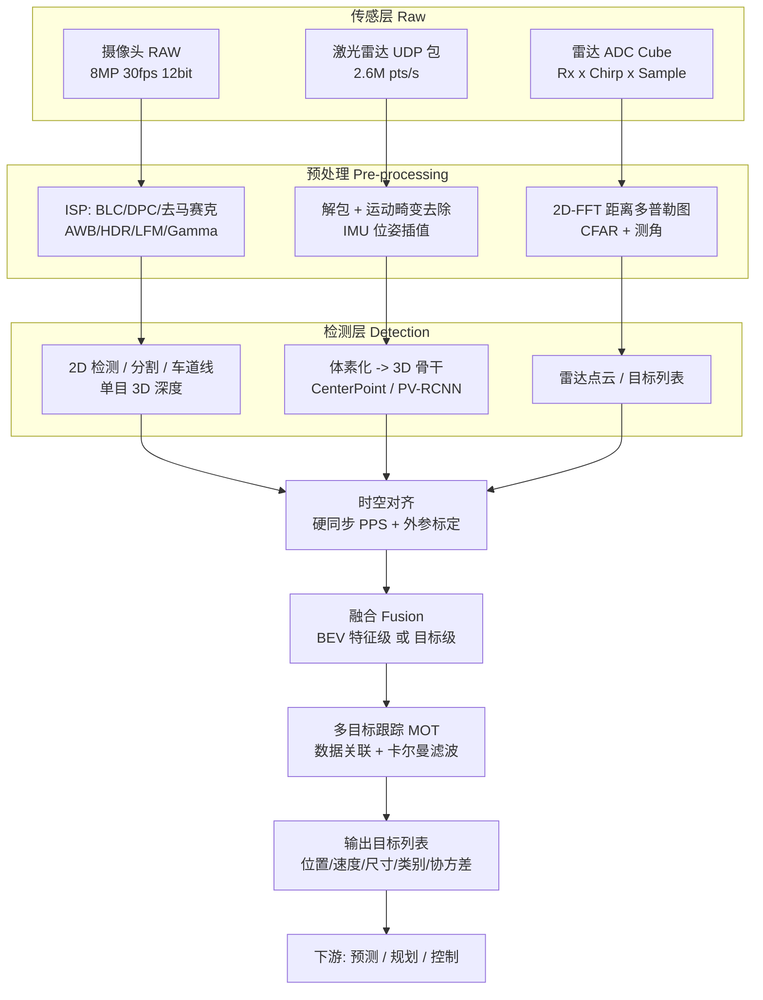
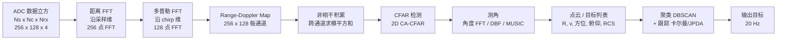

# 一、环境感知：让车"看见"世界的三种眼睛

## 0. 引言：那一晚，纯视觉系统让 AEB 误踩了刹车

那是一次夜间城郊路测，时间大概是晚上七点一刻，太阳刚沉到山脊后面还剩最后一线。工程师老周坐在副驾，膝盖上架着笔记本，屏幕左半边滚动着目标列表，右半边是叠了检测框的实时视频流。主驾是刚接手项目三周的年轻同事小陈，车端跑的是一套"纯视觉（camera-only）"感知栈：前视八百万像素（8 MP，3840×2160）主摄 + 两颗侧视，30 fps，推理跑在一块算力 100 TOPS 的域控上。

那一段路是个逆光的长下坡。落日把整片天空烧成刺眼的橙红，路面反射出一条明晃晃的光带，正好糊在图像下半部分。而坡底、距离本车大约 90 米的地方，站着一位穿深色冲锋衣、推着电动车横穿马路的行人——他整个人几乎融进了路侧行道树的阴影里，在屏幕上就是一团比背景稍微黑一点点的色块。

老周后来复盘时调出了那一帧的 RAW 图。摄像头的 ISP（Image Signal Processor，图像信号处理器）在自动曝光（AE, Auto Exposure）时把测光重心放在了画面中央的高亮天空区域，快门被压到 1/2000 s 以保住天空不过曝，代价是阴影区的信噪比彻底崩了——那团人影所在的 40×90 像素区域，8 bit 量化后灰度值全部落在 6~11 之间，整整 5 个灰阶。神经网络（CNN, Convolutional Neural Network）的检测头给它打了 0.17 的置信度，低于 0.35 的输出门限，于是在目标列表里，这个人**根本不存在**。

更糟的还在后面。左侧波形护栏在逆光下形成了一段规则的亮暗条纹，被检测器误判成一个置信度 0.62 的"车辆"，宽度只有 30 多个像素。单目深度估计模块按"车宽 1.8 m"的先验反推，得出距离 42 m；下一帧条纹换了个位置，反推出 35 m。两帧之间"距离"缩短了 7 m，除以 33 ms 的帧间隔，速度估计直接给出了 −210 km/h 的相对接近速度。AEB（Automatic Emergency Braking，自动紧急制动）的 TTC（Time To Collision，碰撞时间）计算得到 0.6 s，触发全力制动。整车在 60 km/h 下一脚刹到底，后排的测试员额头结结实实撞在前排头枕上，安全带在锁止的一瞬间在他锁骨上勒出一道红印。

而坡底那位真正该被看见的行人，从头到尾没有进入过系统的世界。

回到实验室，白板上写下的结论只有一行字：**单一传感器在极端场景下一定会"失明"，而且它失明的时候，往往不会告诉你它瞎了**。摄像头有逆光、低照度、低纹理三大瓶颈；激光雷达（LiDAR, Light Detection And Ranging）有雨雪雾衰减和点云稀疏；毫米波雷达（Radar, Radio Detection And Ranging）有角分辨率低和静止目标抑制。真正能上路的系统，靠的不是某一路的 SOTA，而是"三种眼睛"在物理原理层面的**互补与冗余**——它们的失效模式必须是**不相关**的。

这一章我们把这三种眼睛从物理层拆到算法层，再拆到评测和工程落地。

---

## 1. 核心概念

### 1.1 感知系统到底要回答哪几个问题

在谈任何传感器之前，先明确感知（perception）模块的输出契约。下游的预测（prediction）与规划（planning）模块向感知要的是这样一张表：

| 输出项 | 英文 | 典型精度要求 | 主要提供者 |
|---|---|---|---|
| 目标存在性 | detection / existence | 召回率 > 99.9%（VRU） | 三者融合 |
| 3D 位置 | position | 纵向 ±0.5 m @50 m | 激光雷达 / 4D 雷达 |
| 3D 尺寸 | dimension | ±0.2 m | 激光雷达 |
| 航向角 | heading / yaw | ±5° | 激光雷达 / 视觉 |
| 速度矢量 | velocity | 径向 ±0.1 m/s | 毫米波雷达 |
| 类别 | classification | top-1 > 95% | 摄像头 |
| 可行驶区域 | free space / drivable area | BEV IoU > 0.9 | 摄像头 + 激光 |
| 车道拓扑 | lane topology | 横向 ±0.1 m @30 m | 摄像头 |
| 交通规则要素 | traffic light / sign | 漏检 < 0.1% | 摄像头（长焦） |

注意这张表里有个隐含结论：**没有任何一种传感器能独立填满所有行**。摄像头填不了速度和精确 3D，激光雷达填不了颜色和文字，雷达填不了类别和车道线。这就是多传感器方案存在的根本原因——不是"堆料"，是**信息维度上的必需**。

### 1.2 摄像头：最像人眼，也最依赖算法

摄像头是**被动光学成像**（passive imaging）设备，它不发射能量，只收集环境光。从现实世界到一帧张量，中间要经过：镜头投影 → CMOS 光电转换与曝光 → ADC 量化 → ISP 处理 → 神经网络推理。

它的强项是**语义密度**：颜色、文字、纹理、红绿灯状态、车道线虚实、路面箭头、施工锥桶的形状——这些信息只有图像能给，而且给得极其廉价（一颗车规 8 MP 模组量产价 200~600 元）。

它的死穴有三个，且都是物理层面的，算法只能缓解不能消除：

1. **没有原生深度**。单目图像是 3D→2D 的投影，深度信息在投影那一刻就丢失了，只能靠先验（物体尺寸）、几何（地平面）或时序（运动视差）"猜"回来。
2. **动态范围有限**。真实道路场景的照度跨度能到 $10^6$：正午柏油路面约 $10^5$ lux，隧道内部约 $10$ lux，隧道口两者同时出现在一帧里就是 140 dB 的动态范围需求。而单次曝光的 CMOS 通常只有 70 dB 左右。
3. **低照度信噪比**。夜间无路灯路段照度可能低到 0.1 lux，光子散粒噪声（shot noise）主导，SNR 随光强开方下降，$\text{SNR} = \sqrt{N_{photon}}$。

### 1.3 激光雷达：用光"丈量"三维

激光雷达**主动发射**近红外脉冲，用飞行时间（ToF, Time of Flight）测距：

$$R = \frac{c \cdot \Delta t}{2}$$

光速 $c \approx 3\times10^8$ m/s，要测到 1 cm 精度，时间分辨率必须达到

$$\Delta t = \frac{2 \times 0.01}{3\times10^8} \approx 67\ \text{ps}$$

67 皮秒——这就是为什么激光雷达的 TDC（Time-to-Digital Converter，时间数字转换器）设计是整机最核心的门槛之一，也解释了它为什么曾经那么贵。

输出是**稀疏但 xyz 精确**的点云（point cloud），典型 128 线产品每秒 150~260 万点。强项是几何真值、不依赖环境光、可直接出 3D 框；弱项是成本、雨雾雪衰减、近场盲区（0.3~0.5 m）、以及远处点云的极度稀疏。

### 1.4 毫米波雷达：多普勒的物理学礼物

车载毫米波雷达工作在 76~81 GHz（波长 $\lambda \approx 3.9$ mm），采用调频连续波（FMCW, Frequency Modulated Continuous Wave）体制。它最独一无二的能力是**在单帧内直接测出径向速度**——这不是估计出来的，是物理规律直接给的：

$$f_d = \frac{2 v_r}{\lambda}$$

其他两种传感器要测速，都得靠"两帧位置作差"，误差会被时间间隔放大；雷达一帧就给，而且精度能到 0.1 m/s。

另一个优势是**全天候**。3.9 mm 波长远大于雨滴（约 1 mm）和雾滴（约 10 μm）的尺度，瑞利散射（Rayleigh scattering）截面正比于 $d^6/\lambda^4$，所以雨雾对毫米波几乎透明。暴雨中激光雷达探测距离从 200 m 掉到 50 m 的时候，雷达可能只掉 10%。

它的弱点同样致命：**角分辨率低**（传统 3D 雷达方位向 4°~15°，在 100 m 处对应 7~26 m 的横向模糊）、**无俯仰维**（分不清路牌和路面障碍）、**静止目标被主动抑制**（详见 4.9 节）。

### 1.5 感知系统的数据流全景

这张图里有一个容易被忽视的关键节点：**时空对齐（SYNC）**。三路传感器的采样率不同（相机 30 Hz、激光 10 Hz、雷达 20 Hz），触发时刻不同，安装位置不同。如果不做微秒级的硬同步和厘米级的外参标定，后面所有的融合算法都是在给错误数据做加权平均。一个数字：车速 108 km/h（30 m/s）时，**10 ms 的时间戳误差等于 30 cm 的位置误差**——已经超过了大多数融合算法的关联门限。

---

## 2. 摄像头：从光子到目标框

### 2.1 针孔模型与内外参

针孔相机模型（pinhole camera model）把相机坐标系下的三维点 $P_c = [X, Y, Z]^\top$ 投影到归一化平面再映射到像素：

$$x = \frac{X}{Z}, \quad y = \frac{Y}{Z}$$

$$u = f_x x + c_x, \quad v = f_y y + c_y$$

写成齐次形式：

$$s \begin{bmatrix} u \\ v \\ 1 \end{bmatrix} = \underbrace{\begin{bmatrix} f_x & \gamma & c_x \\ 0 & f_y & c_y \\ 0 & 0 & 1 \end{bmatrix}}_{K,\ \text{内参 intrinsics}} \underbrace{\begin{bmatrix} R & t \end{bmatrix}}_{\text{外参 extrinsics}} \begin{bmatrix} X_w \\ Y_w \\ Z_w \\ 1 \end{bmatrix}$$

$\gamma$ 是倾斜因子（skew），现代 CMOS 制造精度下恒为 0，可以直接丢掉。

**焦距的像素单位**：$f_x = F / p_x$，$F$ 是物理焦距（mm），$p_x$ 是像元尺寸（mm/pixel）。举个真实数字：一颗 8 MP 前视主摄，像元 2.1 μm，物理焦距 5.8 mm，则 $f_x = 5.8 / 0.0021 \approx 2762$ px；水平 FOV 为 $2\arctan\frac{3840/2}{2762} = 69.5°$。

**外参**描述相机坐标系到车体坐标系（ego frame，通常以后轴中心投影到地面为原点，x 前 y 左 z 上）的刚体变换，6 个自由度。工程上这 6 个数比内参更容易出问题——内参出厂标定后基本稳定，外参会因为振动、温漂、碰撞、洗车而缓慢漂移。

**一个必须刻进 DNA 的数量级**：设相机高度 $h = 1.5$ m，$f_y = 2762$ px，用地平面假设（接地点法）估计距离。地面点在图像上的行坐标满足 $v - c_y = f_y \cdot h / Z$，于是

$$Z = \frac{f_y h}{v - c_y}, \qquad \frac{\partial Z}{\partial v} = -\frac{f_y h}{(v - c_y)^2} = -\frac{Z^2}{f_y h}$$

代入数字：$f_y h = 4143$ px·m。

| 距离 Z | 1 px 行误差 → 深度误差 | 相机俯仰角 0.5° 误差 → 深度误差 |
|---|---|---|
| 10 m | 0.024 m | 0.58 m |
| 30 m | 0.22 m | 5.2 m |
| 50 m | 0.60 m | 14.5 m |
| 80 m | 1.55 m | 37 m |
| 100 m | 2.41 m | 58 m |

**深度误差随距离平方增长**——这是单目视觉最本质的物理限制。俯仰角那一列尤其触目惊心：$\Delta Z = Z^2 \delta / h$，只要外参俯仰漂了 0.5°（相当于满载四人后车尾下沉 3 cm 的量级），50 m 外的距离估计就废了。这也是为什么"在线外参自标定（online extrinsic calibration）"是量产视觉方案的必备模块，而不是加分项。

### 2.2 畸变模型：径向与切向

真实镜头不是理想针孔。畸变（distortion）分两类：

**径向畸变（radial distortion）**，源于透镜曲面对不同入射高度光线的折射差异，越靠边越明显。用偶次多项式建模，$r^2 = x^2 + y^2$：

$$x_{rad} = x(1 + k_1 r^2 + k_2 r^4 + k_3 r^6)$$

$k_1 < 0$ 是桶形畸变（barrel，广角镜头典型），$k_1 > 0$ 是枕形畸变（pincushion，长焦典型）。

**切向畸变（tangential distortion）**，源于镜头光轴与成像面不严格垂直（装配公差）：

$$x_{tan} = 2p_1 xy + p_2(r^2 + 2x^2), \qquad y_{tan} = p_1(r^2 + 2y^2) + 2p_2 xy$$

合起来的完整模型（OpenCV 的 `plumb_bob` 模型）：

$$\begin{aligned}
x_d &= x(1 + k_1 r^2 + k_2 r^4 + k_3 r^6) + 2p_1 xy + p_2(r^2 + 2x^2) \\
y_d &= y(1 + k_1 r^2 + k_2 r^4 + k_3 r^6) + p_1(r^2 + 2y^2) + 2p_2 xy
\end{aligned}$$

对**鱼眼镜头**（环视四颗摄像头，FOV 180°+），多项式模型彻底失效，必须换等距投影族的 Kannala-Brandt 模型：

$$\theta_d = \theta(1 + k_1\theta^2 + k_2\theta^4 + k_3\theta^6 + k_4\theta^8), \qquad r_d = f\,\theta_d$$

其中 $\theta$ 是入射角。注意鱼眼的 $r$ 与 $\theta$ 成正比而非 $\tan\theta$，这是它能塞下 180° 视场的原因。

工程数字：一颗 120° FOV 的前视广角镜头，边缘畸变量可达 60~120 px；若不校正，边缘处的车辆检测框会系统性偏移 3%~5%。但**注意**：现代检测网络并不总是需要先去畸变——去畸变要做双线性插值重采样，会损失边缘锐度并引入约 0.5 ms 的额外延迟，很多量产方案选择**保留畸变图直接送网络**，让网络自己学，只在需要几何计算（IPM、多目三角化）时才用畸变模型做点级校正。

### 2.3 张正友标定法

张正友标定法（Zhang's method, 2000）是内参标定的工业标准，只需要一块平面棋盘格从不同角度拍 15~25 张。它的推导非常优雅：

**第一步：单应矩阵。** 令标定板平面为 $Z_w = 0$，则投影方程退化为

$$s\,\tilde{u} = K[r_1\ r_2\ r_3\ t]\begin{bmatrix}X_w \\ Y_w \\ 0 \\ 1\end{bmatrix} = \underbrace{K[r_1\ r_2\ t]}_{H,\ 3\times3}\begin{bmatrix}X_w \\ Y_w \\ 1\end{bmatrix}$$

$H$ 可以用 ≥4 对角点由 DLT（Direct Linear Transform）线性解出（尺度不定，8 个自由度）。

**第二步：利用旋转矩阵的正交约束。** 记 $H = [h_1\ h_2\ h_3] = \lambda K[r_1\ r_2\ t]$，则 $r_1 = \lambda^{-1}K^{-1}h_1$，$r_2 = \lambda^{-1}K^{-1}h_2$。由 $R \in SO(3)$ 有两条约束：

$$r_1^\top r_2 = 0 \quad\Rightarrow\quad h_1^\top \underbrace{K^{-\top}K^{-1}}_{B} h_2 = 0$$
$$\|r_1\| = \|r_2\| \quad\Rightarrow\quad h_1^\top B h_1 = h_2^\top B h_2$$

$B$ 是 $3\times3$ 对称矩阵，有 6 个独立元素，写成向量 $b = [B_{11}, B_{12}, B_{22}, B_{13}, B_{23}, B_{33}]^\top$。每张图给 2 个线性方程，所以**至少 3 张不同姿态的图**才能解出 $b$（6 未知数，尺度不定实际 5 个）。

**第三步：从 $B$ 反解 $K$。** $B = K^{-\top}K^{-1}$ 是正定的，做 Cholesky 分解再求逆即可，也有闭式公式：

$$c_y = \frac{B_{12}B_{13} - B_{11}B_{23}}{B_{11}B_{22} - B_{12}^2},\quad f_x = \sqrt{\lambda / B_{11}},\ \dots$$

**第四步：非线性精化。** 以上是线性初值，最后用 Levenberg-Marquardt 最小化所有角点的重投影误差（reprojection error），同时把畸变参数 $k_1, k_2, p_1, p_2, k_3$ 一起优化进去：

$$\min_{K, k, \{R_i, t_i\}} \sum_{i=1}^{M}\sum_{j=1}^{N} \big\| m_{ij} - \hat{m}(K, k, R_i, t_i, M_j) \big\|^2$$

**实操要点**：标定板要占据画面 1/3 以上；姿态要覆盖倾斜 ±30°~45°（纯正对拍摄会导致 $f_x, f_y$ 与 $t_z$ 强相关、解病态）；角点要覆盖到画面四角（否则边缘畸变参数无约束）；最终重投影 RMSE 应 < 0.3 px，> 0.5 px 就要重标。

**相机—激光外参标定**则是另一个问题，主流做法是标定板法（同时提取图像角点与点云平面）或无靶标的边缘互信息法（最大化图像梯度与点云深度不连续处的互信息）。量产还要做在线自标定：用车道线的平行性约束 pitch/yaw、用消失点（vanishing point）约束旋转。

### 2.4 ISP 流水线：被严重低估的一环

很多算法工程师把 ISP 当黑盒，这是量产项目里最贵的误解之一。ISP 决定了送进网络的张量长什么样，它的每个模块都会影响检测性能。

典型车载 ISP 流水线（顺序不可随意调换）：

| 阶段 | 模块 | 作用 | 对感知的影响 |
|---|---|---|---|
| 1 | BLC 黑电平校正 | 减去暗电流基底 | 不做则暗部整体抬高，对比度损失 |
| 2 | DPC 坏点校正 | 修复死点/亮点 | 坏点会被小目标检测头当成远处目标 |
| 3 | LSC 镜头阴影校正 | 补偿边缘暗角 $\cos^4$ 衰减 | 边缘目标置信度系统性偏低 |
| 4 | Demosaic 去马赛克 | Bayer RGGB → RGB 三通道 | 劣质插值产生拉链纹（zipper），伤细线检测 |
| 5 | AWB 自动白平衡 | 估计光源色温并归一 | 隧道钠灯下红绿灯颜色判别翻车 |
| 6 | NR 降噪（2D/3D） | 空域 + 时域降噪 | 过度降噪会抹掉远处小目标 |
| 7 | HDR 合成 | 多曝光/分档融合 | 决定隧道口能否同时看清内外 |
| 8 | CCM 色彩校正矩阵 | 传感器色域 → sRGB | 影响颜色相关任务（灯色、车身色） |
| 9 | Tone Mapping / Gamma | 高比特压到 8/10 bit | 压缩曲线选错，暗部信息永久丢失 |
| 10 | Sharpen 锐化 | 边缘增强 | 过锐产生振铃伪影，NMS 出重复框 |

**宽动态（HDR, High Dynamic Range）** 有两条技术路线：

- **多曝光合成（DOL, Digital Overlap）**：一帧内连续拍长/中/短三次曝光再融合，可达 120 dB 以上。缺点是三次曝光有时间差，**运动物体会产生鬼影（ghosting）**——对面来车在 120 km/h 相对速度下，长短曝光间隔 5 ms 就是 17 cm 的位移。
- **分档像素 / LOFIC（Lateral Overflow Integration Capacitor）**：单次曝光，大小像素或大电容分档，天然无鬼影。Sony IMX490（5.4 MP，120 dB）、OmniVision OX08B40（8.3 MP，140 dB）走的都是这条路，也是当前车载主流。

**LED 闪烁抑制（LFM, LED Flicker Mitigation）** 是车载专属需求。交通信号灯和现代车辆的 LED 尾灯为了调光都用 PWM 驱动，频率通常在 90~500 Hz。如果相机曝光时间是 1/2000 s = 0.5 ms，而 LED 的 PWM 占空比是 30%、周期 5 ms（200 Hz），那么有 70% 的概率这 0.5 ms 正好落在"熄灭"区间——**拍出来的红绿灯是黑的**。

后果非常严重：连续几帧拍不到灯色，红绿灯状态机就会输出"未知"，规划模块只能保守减速；更危险的是把红灯拍成灭灯而误判为可通行。LFM 的解法是让感光有效积分时间覆盖至少一个完整 PWM 周期（≥ 11 ms，对应 90 Hz 最低频），同时靠 LOFIC 大电容保证不过曝——这也是为什么车规 sensor 卖得比手机 sensor 贵。

### 2.5 卷帘快门：高速物体的"歪脖子"

绝大多数 CMOS 用**卷帘快门（rolling shutter）**：像素阵列逐行曝光、逐行读出，而不是全阵列同时曝光（那叫全局快门 global shutter，需要每个像素额外一个存储节点，面积和成本都高）。

设总读出时间 $T_{read}$（通常 8~25 ms），图像高 $H$ 行，则第 $n$ 行相对第 0 行的时间偏移：

$$\Delta t(n) = \frac{n}{H} T_{read}$$

对一个横向速度 $v_x$ 的目标，成像上的横向偏移随行号线性增长，形成**倾斜（skew）**：

$$\Delta u(n) = f_x \frac{v_x}{Z}\cdot\frac{n}{H}T_{read}$$

**真实数字**：3840×2160 传感器，$T_{read} = 16$ ms（行时间 7.4 μs）。一辆横穿的车相对速度 15 m/s，距离 20 m，$f_x = 2762$：目标在图像上高约 500 行，则从上到下的时间差 3.7 ms，横向偏移

$$\Delta u = 2762 \times \frac{15}{20} \times 0.0037 = 7.7\ \text{px}$$

7.7 px 的倾斜，对 2D 框影响不大，但**对车道线拟合、对基于图像的 TTC 估计、对多目三角化是实打实的系统误差**。更极端的是自车快速过弯或经过颠簸时的**果冻效应（jello effect）**：整幅图像发生剪切变形，车道线看起来是弯的。

工程对策：
1. 缩短 $T_{read}$（提高 MIPI 通道速率，代价是功耗和 EMI）。
2. 在多传感器融合时，把每一行的时间戳单独建模，用 IMU 位姿做逐行补偿（和激光雷达的运动畸变去除是同一个思路）。
3. 触发同步时，用**曝光中心时刻（center of exposure）**而不是帧起始时刻作为该帧的时间戳。

### 2.6 2D 检测：从 anchor 到 anchor-free

**Anchor-based（以 YOLOv3/v4/v5、RetinaNet、SSD 为代表）**：在特征图每个位置预置 $k$ 个不同长宽比、尺度的先验框（anchor box），网络回归的是相对于 anchor 的偏移量：

$$b_x = \sigma(t_x) + c_x,\quad b_y = \sigma(t_y) + c_y,\quad b_w = p_w e^{t_w},\quad b_h = p_h e^{t_h}$$

其中 $(p_w, p_h)$ 是 anchor 的宽高，$(c_x, c_y)$ 是网格左上角坐标。用指数保证宽高恒正，用 sigmoid 把中心限制在当前格子内。

Anchor 的尺寸靠对训练集的 GT 框做 k-means 聚类得到（YOLOv2 起的做法），距离度量用 $1 - \text{IoU}$ 而非欧氏距离。**这里藏着一个大坑**：自动驾驶数据集的框长宽比分布和 COCO 差异巨大——行人是 1:3 的瘦长框，远处车辆是 20×15 px 的小方块，横向卡车是 5:1 的扁框。直接用 COCO 预置 anchor，远处小目标的正样本匹配率会掉到个位数百分比。

**Anchor-free（FCOS、CenterNet、YOLOX/YOLOv8）**：不预置框，直接在每个位置预测"到四条边的距离" $(l, t, r, b)$，或者预测中心点热图 + 宽高。优势是少了 anchor 超参、正负样本分配更灵活、对极端长宽比更鲁棒；代价是需要更好的**标签分配策略**（label assignment，如 SimOTA、ATSS）来决定哪些位置是正样本。

工业界现状：2020 年后新项目基本都走 anchor-free + 动态标签分配；但存量车型的量产模型仍大量是 anchor-based，因为 anchor 的输出结构更容易做定点量化和 NPU 算子映射。

**FPN（Feature Pyramid Network，特征金字塔）** 解决尺度问题。骨干网络下采样得到 C3(1/8)、C4(1/16)、C5(1/32)，FPN 自顶向下上采样并横向连接：

$$P_i = \text{Conv}_{3\times3}\big(\text{Conv}_{1\times1}(C_i) + \text{Upsample}(P_{i+1})\big)$$

高层语义强但分辨率低（适合大目标），低层分辨率高但语义弱（适合小目标），FPN 让每一层都兼具两者。PANet 又加了自底向上的第二条路径，BiFPN 加了可学习的加权融合——现代检测器基本是 FPN 的各种变体。

**为什么自动驾驶特别依赖高分辨率层？** 算笔账：一个 60 m 外的行人，宽 0.5 m，$f_x = 2762$，在图像上宽 $0.5 \times 2762 / 60 = 23$ px。如果只用 C5（1/32 下采样），它在特征图上只剩 0.7 个像素——彻底消失。所以车载检测器往往要保留 1/4 甚至 1/2 分辨率的浅层特征，这直接推高了算力需求。

**NMS（Non-Maximum Suppression，非极大值抑制）**：按置信度排序，保留最高分框，抑制与它 IoU 超过阈值的所有框，递归执行。

$$s_i = \begin{cases} s_i, & \text{IoU}(M, b_i) < N_t \\ 0, & \text{IoU}(M, b_i) \geq N_t \end{cases}$$

硬 NMS 的问题在密集场景：拥堵路况下前车与旁车重叠、人群中行人互相遮挡，两个真实目标的 IoU 可能就有 0.6，硬 NMS 会直接删掉一个——**漏检**。

**Soft-NMS** 把"删除"改成"降权"：

$$s_i \leftarrow s_i \cdot e^{-\frac{\text{IoU}(M, b_i)^2}{\sigma}}, \qquad \sigma \approx 0.5$$

IoU 越大衰减越狠，但不会归零，给了后续门限一个挽回的机会。在 CrowdHuman 这类密集数据集上，Soft-NMS 通常能提 1~2 个点 AP，且不需要重训。

工程上的阈值经验：$N_t$ 取 0.45~0.65。太严（0.3）在拥堵路口漏检，太松（0.8）会给下游跟踪器送一堆重复框，导致 ID 频繁切换。**更聪明的做法是按类别设不同阈值**：车辆用 0.6（形状规则、重叠少），行人用 0.45（密集但框小），并且对不同距离区间用不同门限。

### 2.7 语义分割：给每个像素打标签

| 方法 | 核心思想 | 感受野扩张手段 | 典型 mIoU (Cityscapes) | 推理代价 |
|---|---|---|---|---|
| FCN (2015) | 全卷积 + 反卷积上采样 | 池化下采样 | ~65% | 低 |
| U-Net | 编解码 + 跳连 | 对称下上采样 | ~70% | 中 |
| DeepLab v3+ | 空洞卷积 + ASPP + 解码器 | 空洞率 6/12/18 | ~82% | 高 |
| PSPNet | 金字塔池化 PPM | 全局池化 1/2/3/6 | ~80% | 高 |
| SegFormer | 分层 Transformer + 轻量 MLP 头 | 自注意力（全局） | ~82% (B4) | 中高 |
| BiSeNet v2 | 双分支：细节 + 语义 | 语义分支快速下采样 | ~73% | 极低（>150 FPS） |

**空洞卷积（dilated / atrous convolution）** 是 DeepLab 的核心。标准 $3\times3$ 卷积感受野是 3，插入空洞率 $r$ 后等效核大小变成

$$k_{eff} = k + (k-1)(r-1) = 2r + 1$$

在**不增加参数量、不降低分辨率**的前提下扩大感受野。ASPP（Atrous Spatial Pyramid Pooling）并联多个不同空洞率的分支（6/12/18）再拼接，同时捕获多尺度上下文。

空洞卷积的著名副作用是**网格效应（gridding artifact）**：连续用相同空洞率时，采样点呈棋盘状分布，相邻像素用到的是完全不相交的输入集合，导致输出出现网格纹理。对策是用互质的空洞率序列（如 1, 2, 5）或混合空洞卷积（HDC）。

**为什么自动驾驶需要分割而不只是检测？** 因为很多东西没有"实例"的概念：可行驶区域（free space）、路沿、积水、坑洼、施工区域、不规则散落物。一个从卡车上掉下来的沙发，检测器的词表里没有"沙发"这一类，但分割能告诉你"这块 2×1.5 m 的区域不是路面"——这对开放集（open-set）安全至关重要。量产方案通常输出一个**通用障碍物（general obstacle）**掩码，和类别无关。

### 2.8 车道线检测：三条技术路线

| 路线 | 代表方法 | 输出形式 | 优势 | 劣势 |
|---|---|---|---|---|
| **分割式** | LaneNet、SCNN | 逐像素二值/实例掩码 | 拓扑灵活，能处理分叉合并 | 需后处理聚类拟合，虚线断裂敏感，慢 |
| **关键点/行锚式** | UFLD、CondLaneNet | 每一行（row anchor）上选一个格子 | 极快（UFLD 300+ FPS），天然连续 | 行数固定，处理近水平线（急弯）差 |
| **曲线参数式** | PolyLaneNet、LSTR、BézierLaneNet | 直接回归多项式/贝塞尔控制点 | 输出即模型，无需后处理，抗遮挡 | 参数回归对远端不稳，曲线族表达受限 |

**分割式（LaneNet）** 用双分支：二值分割分支判断"是不是车道线像素"，嵌入分支（embedding）给每个车道线像素学一个 N 维特征，同一条线的像素特征聚拢、不同线的推开（判别式损失 discriminative loss），再用 mean-shift 聚类分实例。它还配了个 H-Net 学习自适应的透视变换矩阵，在鸟瞰图下做曲线拟合。

**行锚式（UFLD, Ultra Fast Structure-aware Lane Detection）** 的洞见很有意思：车道线在图像里几乎总是近似竖直的，所以可以把问题从"$H\times W$ 像素二分类"降维成"在 $h$ 个预设行上，各做一次 $w+1$ 类分类（$w$ 个格子 + 1 个'无线'）"。计算量从 $O(HW)$ 降到 $O(hw)$，$h$ 通常取 56~72。这就是它能跑到 300+ FPS 的原因。

**曲线参数式**在 BEV 空间做更自然。近年主流的 BEV 车道线方案（如 MapTR、LaneSegNet）直接在 BEV 特征图上用 Transformer 的 query 回归一组有序点，端到端输出矢量化地图元素——这已经跨入"在线建图（online mapping）"范畴。

**工程数字与坑**：车道线横向精度要求在 30 m 处优于 ±10 cm，换算到图像上（$f_x=2762$，$Z=30$）是 $0.1 \times 2762/30 = 9.2$ px——听起来宽松，但夜间雨天路面反光时，标线的图像对比度可能只有 5%，能不能稳定拿到这 9 px 全看 ISP 和网络的鲁棒性。另一个高频坑是**旧标线残留**：施工改道后旧线没铲干净，网络同时看到两组线；2018 年 3 月特斯拉 Model X 在 US-101 与 SR-85 分叉口撞上水泥隔离墩的事故，公开调查报告指出 Autopilot 沿着分叉处磨损/模糊的车道线驶入了缓冲区——这是车道线感知的经典教训。

### 2.9 交通灯与标志：小目标的算力黑洞

交通灯识别是典型的**小目标 + 高召回要求 + 强时序**问题。

先算尺寸。标准机动车信号灯灯头直径 300 mm，安装高度 5.5~7 m。用 $f_x = 2762$ 的主摄：

| 距离 | 灯头像素直径 | 可用性 |
|---|---|---|
| 30 m | 27.6 px | 容易 |
| 60 m | 13.8 px | 尚可 |
| 100 m | 8.3 px | 困难（灯色判别开始不稳） |
| 150 m | 5.5 px | 基本不可用 |

而 80 km/h 的车流从看到灯到停止线需要至少 100 m 的决策距离。所以量产方案几乎必然配**长焦相机**：一颗 28° FOV 的长焦，$f_x = 3855$ px，100 m 处灯头 11.6 px，150 m 处 7.7 px，才勉强够用。特斯拉早期 HW2.5/HW3 的前视三目（120° 广角 + 50° 主视 + 28° 长焦）就是这个逻辑。

其他难点：
- **多灯同框**：一个大路口能同时出现 6~12 个信号灯（含对向、左转、右转、非机动车、公交专用），必须靠高精地图（HD Map）的灯位先验 + 自车所在车道的关联关系筛出"跟我有关"的那一个。纯视觉盲猜的错误率在复杂路口会到百分之几，完全不可接受。
- **LED 频闪**：见 2.4 节 LFM。
- **逆光与灯罩反光**：早晚太阳低角度时，太阳正好在信号灯后方，灯头呈现一片过曝白。对策是长曝光/短曝光双通道 + 灯罩几何先验。
- **黄灯闪烁与倒计时**：需要时序状态机，单帧分类不够。
- **类别混淆**：路口装饰彩灯、前车高位刹车灯、施工警示灯。地图先验 + 位置约束是主要解法。

交通标志（traffic sign）问题类似但稍简单：类别多（中国 GB 5768 标准数百类）但静态、有形状颜色强先验，通常用两阶段——先检测出标志牌区域（小目标检测），再送一个轻量分类头做细类识别。

### 2.10 单目 3D 与深度估计

#### 2.10.1 几何法：IPM 与地平面假设

**逆透视变换（IPM, Inverse Perspective Mapping）** 的数学基础就是 2.3 节的单应矩阵：当所有关注点都在 $Z_w = 0$ 的地平面上时，图像平面与地面之间是一个 $3\times3$ 单应变换：

$$\begin{bmatrix}X_w \\ Y_w \\ 1\end{bmatrix} \sim H^{-1}\begin{bmatrix}u \\ v \\ 1\end{bmatrix}, \qquad H = K[r_1\ r_2\ t]$$

把前视图"拉平"成鸟瞰图（BEV），车道线变成平行线，距离可以直接量。IPM 极其廉价（一次查表 + 双线性插值，1080p 在 GPU 上不到 1 ms），是 L2 级车道保持（LKA）的经典做法。

**它的三个致命假设**：
1. **地面是平的**。上下坡、路拱、减速带一律失效。前面表格算过：俯仰 0.5° 误差在 50 m 处就是 14.5 m 的深度误差。
2. **目标贴地**。任何离地的东西（车顶、路牌、行人上半身）在 IPM 图里都会被"拉成一条向远处延伸的长条"。
3. **外参准确**。悬架动态、载荷变化、加减速导致的车身俯仰实时变化 ±1°，必须用 IMU 或视觉在线补偿。

所以 IPM 的可用范围通常限制在 **30 m 以内**，超出就要换方案。

#### 2.10.2 学习法：自监督光度一致性

不需要深度真值的自监督单目深度（self-supervised monocular depth，以 Monodepth2 为代表）思路：用深度网络预测 $D_t$，用位姿网络预测相邻帧的相对位姿 $T_{t\to t'}$，然后把 $t'$ 帧**warp** 回 $t$ 帧，比较像素差异。

投影关系：

$$p_{t'} \sim K\, T_{t\to t'}\, D_t(p_t)\, K^{-1} p_t$$

光度重投影损失（photometric reprojection loss）：

$$pe(I_a, I_b) = \frac{\alpha}{2}\big(1 - \text{SSIM}(I_a, I_b)\big) + (1-\alpha)\|I_a - I_b\|_1, \qquad \alpha = 0.85$$

$$L_p = \min_{t' \in \{t-1, t+1\}} pe\big(I_t,\ I_{t'\to t}\big)$$

用 **min 而不是 sum** 是 Monodepth2 的关键改进：遮挡区域在某一个相邻帧里不可见，取最小值等于自动选择了"没被遮挡的那一帧"，避免了遮挡边缘的深度错误。

再加两项：

- **自动遮罩（auto-masking）**：$\mu = [\min_{t'} pe(I_t, I_{t'\to t}) < \min_{t'} pe(I_t, I_{t'})]$，把"warp 之后还不如不 warp"的像素（即静止物体、与自车同速的前车、纹理均匀区）直接排除。这解决了自监督深度最恶心的失败模式——**与自车同速的前车会被预测成无穷远**（因为它在图像上不动，网络认为它离得无限远）。
- **边缘感知平滑正则**：$L_s = |\partial_x d^*| e^{-|\partial_x I|} + |\partial_y d^*| e^{-|\partial_y I|}$，让深度在图像平坦处平滑、在图像边缘处允许跳变。

**尺度模糊（scale ambiguity）**：单目自监督只能恢复相对深度，整体尺度是未知的（把世界放大 2 倍、位移放大 2 倍，光度损失完全相同）。解决办法：
1. 用已知相机高度 + 地平面拟合恢复尺度（median scaling 或 ground-plane alignment）。
2. 用雷达/激光的稀疏测距点做在线对齐。
3. 训练时用双目对（stereo pair）作为监督，基线已知，尺度就定了。

#### 2.10.3 有监督单目 3D 检测

主流范式：
- **直接回归式**（M3D-RPN、SMOKE、FCOS3D）：在 2D 检测头基础上加分支，直接回归 3D 中心的图像投影 + 深度 + 尺寸 + 航向。深度回归通常用 $d = \frac{1}{\sigma(x)} - 1$ 这类变换，或者分 bin 分类 + 残差回归（因为深度分布是长尾的）。
- **伪激光雷达（Pseudo-LiDAR）**：先估深度图，反投影成点云，再套用现成的点云 3D 检测器。精度提升明显，证明了"表示形式比网络结构更重要"，但对深度误差极其敏感。
- **BEV 范式**（LSS/BEVDet、BEVFormer、BEVDepth）：把多相机特征通过深度分布"抬升（lift）"到 3D 空间，再"拍扁（splat）"到 BEV 网格上做统一检测。LSS 的核心是为每个像素预测一个**离散深度分布** $\alpha \in \mathbb{R}^{|D|}$（如 1~60 m 分 60 个 bin），特征按分布权重散布到各深度：$c_d = \alpha_d \cdot c$。BEVDepth 进一步用激光点云监督这个深度分布，把 nuScenes NDS 从约 0.47 提到约 0.60。

**残酷的现实数字**：nuScenes 3D 检测榜上，纯视觉方案 NDS 约 0.55~0.65，而激光雷达方案约 0.70，多模态融合约 0.75+。视觉方案的**平均平移误差（mATE）**通常在 0.5~0.7 m，激光方案在 0.25~0.35 m。差距主要就在深度上。

---

## 3. 激光雷达：几何的绝对真值

### 3.1 三种扫描架构

| 维度 | 机械旋转式 | 半固态 MEMS 振镜 | 半固态转镜/棱镜 | Flash 面阵 |
|---|---|---|---|---|
| 原理 | 整个收发模组 360° 旋转 | 微振镜二维偏转光束 | 多面转镜反射，收发固定 | 一次泛光照射，面阵探测器接收 |
| 水平 FOV | 360° | 100°~120° | 120°~140° | 60°~120° |
| 垂直 FOV | 30°~45°（16~128 线） | 25° | 25°~40° | 30° |
| 典型测距 | 200~250 m @10% 反射率 | 150~200 m | 200~300 m | 30~50 m |
| 角分辨率 | 0.1°~0.2°(H) / 0.2°~0.4°(V) | 0.1°×0.1° | 0.1°×0.1° | 0.5°~1° |
| 点频 | 1.3~2.6 M pts/s | 1~2 M pts/s | 1.5~3 M pts/s | 0.2~0.5 M pts/s |
| 可动部件 | 大（轴承、滑环） | 微米级振镜 | 转镜 | 无 |
| 车规可靠性 | 差（寿命/振动） | 中 | 中上（已大批量上车） | 优 |
| 成本区间 | 早期 $75,000（HDL-64E）→ 现 $4,000~8,000 | $400~1,000 | $400~1,500 | $150~500 |
| 典型用途 | Robotaxi 顶部主雷达 | 前向补盲/主雷达 | 乘用车前向主雷达 | 近场补盲（侧向、后向） |

几个真实产品的锚点数字：Velodyne HDL-64E 在 2010 年前后单价 7.5 万美元，是 DARPA 挑战赛时代的标配；禾赛 AT128（转镜式，128 线，200 m @10%，153 万点/秒）在 2022 年后大规模上车，价格进入千美元级；图达通 Falcon 用 1550 nm，宣称 500 m @10% 最远探测；国产补盲激光雷达（如速腾 E1、禾赛 FT120）2024 年起已下探到几百美元。**十年降价两个数量级**，这是激光雷达从科研走向量产的核心变量。

### 3.2 905 nm vs 1550 nm：一场关于眼睛的权衡

| 维度 | 905 nm | 1550 nm |
|---|---|---|
| 激光器 | 半导体 EEL / VCSEL，便宜成熟 | 光纤激光器（掺铒），贵且体积大 |
| 探测器 | Si APD / SiPM / SPAD，成本低 | InGaAs APD，成本高 5~10 倍 |
| 人眼安全（Class 1）允许功率 | 低 | 高约 $10^5 \sim 10^6$ 倍 |
| 物理原因 | 可穿过角膜晶状体聚焦到视网膜，功率密度放大约 $10^5$ 倍 | 被角膜和房水中的水强吸收，到不了视网膜 |
| 可达探测距离 | 200~250 m @10% | 300~500 m @10% |
| 雨雾中衰减 | 较小 | 更大（水在 1550 nm 的吸收系数约高一个数量级） |
| 太阳背景光干扰 | 较大（太阳光谱在 905 nm 仍强） | 较小（大气水汽吸收带，太阳辐照低） |
| 整机成本 | 低 | 高 2~4 倍 |

一句话总结这个权衡：**1550 nm 用"眼睛看不见也伤不到"换来了大功率的许可证，代价是探测器材料从硅换成了铟镓砷，成本直接上一个台阶，而且在雨雾中反而更吃亏**。当前乘用车前装主流仍是 905 nm，1550 nm 主要在追求超远距离的高端车型和干线物流卡车上。

### 3.3 点云稀疏性：距离平方衰减的推导

这是理解激光雷达能力边界的核心。设激光雷达水平角分辨率 $\Delta\theta$、垂直角分辨率 $\Delta\phi$（弧度）。一个宽 $W$、高 $H$ 的目标在距离 $r$ 处，张开的角度是 $W/r$ 和 $H/r$，因此打到它身上的激光束数量为

$$N(r) = \frac{W/r}{\Delta\theta} \times \frac{H/r}{\Delta\phi} = \frac{W H}{\Delta\theta\,\Delta\phi}\cdot\frac{1}{r^2}$$

**点数正比于距离的负二次方。** 代入真实参数：128 线雷达，$\Delta\theta = 0.1° = 1.745\times10^{-3}$ rad，$\Delta\phi = 0.2° = 3.49\times10^{-3}$ rad；一辆侧面朝向本车的轿车 $W = 4.5$ m、$H = 1.5$ m：

| 距离 | 理论点数 | 实际可用点数（含遮挡/反射率/入射角） |
|---|---|---|
| 10 m | 11,080 | 2,000~4,000 |
| 30 m | 1,231 | 250~500 |
| 50 m | 443 | 90~180 |
| 100 m | 111 | 20~45 |
| 150 m | 49 | 8~20 |
| 200 m | 28 | 3~10 |

**150 m 以外一辆车只剩十几个点**——这就是"激光雷达看得远"这句话的真实含义：它能测到那里有个东西，但**分辨不出那是什么、朝向如何**。这也解释了后面第 7 节代码运行结果里，25 m 处那辆车的航向角误差（4.8°）明显大于 12 m 处那辆（1.1°）。

同时，回波功率也在衰减。对于尺寸大于光斑的**朗伯散射面**（extended Lambertian target），接收功率：

$$P_r = \frac{P_t \rho \cos\alpha}{\pi r^2} \cdot A_r \cdot \eta_{atm} \cdot \eta_{sys}$$

其中 $\rho$ 是目标反射率，$A_r$ 是接收孔径面积，$\eta_{atm} = e^{-2\gamma r}$ 是大气双程透过率。注意这里是 $1/r^2$ 而不是雷达方程的 $1/r^4$——因为目标充满了光斑，不是点目标。

行业标准的性能指标写法是"**200 m @10% 反射率**"：10% 对应的是黑色轿车漆面、深色衣物这类最难的目标；如果换成 80% 反射率的白色标定板，同一台设备可能标到 300 m。**看规格书一定要看反射率标注**，这是最常见的营销话术埋点。

暴雨中，$\gamma$ 显著增大：50 mm/h 的暴雨下，905 nm 的双程衰减可达 10~20 dB/km，200 m 处衰减 4~8 dB，加上雨滴本身产生的虚假回波（一颗 2 mm 雨滴在 5 m 处的回波强度可能超过 150 m 外的黑车），有效探测距离掉到 50~80 m 是常态。

### 3.4 运动畸变去除：一圈扫描期间车在动

机械式激光雷达转一圈需要 100 ms（10 Hz）。这 100 ms 里，自车以 30 m/s 行驶，位移 **3 米**。如果把这一圈的点当作"同一时刻"的快照拼在一起，点云会被"拉弯"——直墙变成斜墙，圆柱变成螺旋。

**去畸变（motion compensation / de-skewing）的原理**：每个点 $p_i$ 都带有自己的采集时间戳 $t_i$。选定一个参考时刻 $t_{ref}$（通常取帧结束时刻或帧中点），把每个点从"采集时刻的雷达系"变换到"参考时刻的雷达系"：

$$p_i^{ref} = T_{ref}^{-1} \cdot T_{t_i} \cdot p_i$$

其中 $T_{t_i}$ 是 $t_i$ 时刻雷达在世界系（或帧起始系）下的位姿，由 IMU/轮速/组合导航提供。

**位姿插值**：IMU 通常 100~1000 Hz，激光点是 260 万点/秒，所以必须插值。平移用线性插值，旋转必须用**球面线性插值（slerp）**：

$$t(\tau) = (1-s)\,t_a + s\,t_b, \qquad q(\tau) = \text{slerp}(q_a, q_b, s), \qquad s = \frac{\tau - t_a}{t_b - t_a}$$

**工程要点与坑**：
1. **时间戳必须是硬件级的**。雷达要接 PPS（Pulse Per Second）+ GPRMC 或 PTP（IEEE 1588）做时钟同步，误差控制在微秒级。用软件收包时间戳，抖动几毫秒，去畸变反而会引入新误差。
2. **只补偿自车运动是不够的**。对面来车相对速度 60 m/s，在 100 ms 扫描期内它自己移动了 6 m，这部分是**目标运动畸变**，自车 IMU 补不了。表现为对向车辆的点云被"拉长"，检测框长度虚增 10%~30%。解法是在跟踪阶段用估计的目标速度做二次补偿。
3. **参考时刻的选择要和下游约定死**。取帧头、帧尾还是帧中，会带来最多 100 ms（3 m）的系统性偏移。整条链路必须统一。
4. **静止时不要关掉去畸变**。红绿灯前起步的瞬间加速度大，IMU 积分误差反而更需要处理。

### 3.5 地面分割：RANSAC 与 Patchwork

去掉地面点是点云处理的第一刀，通常能砍掉 50%~70% 的点，直接决定后续算力。

**RANSAC 平面拟合（Random Sample Consensus）**：
1. 随机抽 3 个点确定一个平面 $\mathbf{n}\cdot p + d = 0$；
2. 统计到平面距离 $< \tau$ 的内点数；
3. 重复 $K$ 次，取内点最多的模型；
4. 用全部内点做最小二乘（SVD 取最小奇异向量）精化。

迭代次数的理论下界：设内点比例为 $w$，要求成功概率 $P$，样本数 $s=3$：

$$K = \frac{\log(1-P)}{\log(1 - w^s)}$$

$w = 0.6$、$P = 0.99$ 时，$K = \log(0.01)/\log(1-0.216) = 18.9 \approx 19$ 次。实际会取 100~250 次以对抗噪声。

RANSAC 的**致命弱点是"单平面假设"**：真实道路有纵坡（高速公路最大 4%~6%）、横坡（路拱 1.5%~2%）、路肩、匝道、桥面接缝。一个 60 m×30 m 的区域用单一平面去拟合，边缘处的残差可以达到 0.5 m 以上——要么把路肩当障碍物（虚警），要么把 0.4 m 高的路障当地面（漏检）。

**Patchwork / Patchwork++** 的改进思路：
- **同心圆区域模型（CZM, Concentric Zone Model）**：把地面按距离分成 4 个环带、每个环带再按方位分若干扇区（近处扇区多、远处扇区少，以平衡每块的点数），**每一小块独立拟合一个平面**。这样天然适应曲面。
- **区域 PCA 拟合**：每块内用最低若干点做种子，PCA 求法向。
- **地面似然估计（GLE, Ground Likelihood Estimation）**：用三个判据过滤伪地面——法向与 z 轴夹角（uprightness）、拟合平面的高度合理性（elevation）、点分布的平坦度（flatness）。
- Patchwork++ 加入了自适应地面似然估计和时域一致性，在 CPU 上可跑到 40+ Hz。

其他常用方法：**Ray Ground Filter**（沿每条扫描线按角度增量判断坡度）、**基于高程栅格（elevation grid）**（BEV 网格内取最低点，判断格内高差）、以及**深度学习法**（GndNet 等，把地面高程当作 BEV 回归任务）。

### 3.6 体素化与点云 3D 检测网络

点云是**无序、稀疏、非均匀**的集合，卷积没法直接用。三种主流表征：

1. **点式（point-based）**：PointNet/PointNet++ 直接吃原始点，用 shared MLP + 对称函数（max pooling）保证置换不变性。表达力强，但最近邻查询（ball query / kNN）在 GPU 上访存不友好，慢。
2. **体素式（voxel-based）**：把空间切成 3D 网格，每格内点做特征聚合，再用 3D 稀疏卷积（sparse conv）。KITTI 常用体素 $[0.05, 0.05, 0.1]$ m，nuScenes 常用 $[0.1, 0.1, 0.2]$ m。
3. **柱式（pillar-based）**：z 方向不切分，整根柱子作为一个单元，直接得到 2D BEV 伪图像，用成熟的 2D CNN 处理。柱子尺寸典型 $0.16\times0.16$ m（KITTI）或 $0.2\times0.2$ m（nuScenes）。

| 方法 | 表征 | 阶段 | 关键创新 | KITTI Car 中等 3D AP | 推理延迟（RTX 级 GPU） |
|---|---|---|---|---|---|
| VoxelNet (2018) | 体素 + 稠密 3D 卷积 | 单阶段 | VFE 体素特征编码 | ~65% | ~230 ms |
| SECOND (2018) | 体素 + **稀疏** 3D 卷积 | 单阶段 | 3D 稀疏卷积，速度提升 10× | ~76% | ~40 ms |
| PointPillars (2019) | 柱 + 2D CNN | 单阶段 | 消灭 3D 卷积，纯 2D 骨干 | ~74% | **~16 ms (62 FPS)** |
| PointRCNN (2019) | 点 | 两阶段 | 前景点分割生成提案 | ~76% | ~100 ms |
| PV-RCNN (2020) | 体素 **+** 关键点 | 两阶段 | Voxel Set Abstraction 融合两种表征 | **~81%** | ~80~100 ms |
| CenterPoint (2021) | 体素/柱 + 中心热图 | 单/两阶段 | **anchor-free**，回归中心点 + 属性 | ~80%；nuScenes NDS ~0.65 | ~50~90 ms |
| VoxelNeXt (2023) | 纯稀疏体素 | 单阶段 | 全稀疏、无稠密 BEV 头 | ~80% | ~40 ms |

**PointPillars 为什么快**：它把最贵的 3D 稀疏卷积整条砍掉了。流程是——点云落柱（$P$ 个非空柱，每柱采样 $N$ 个点，每点 9 维特征 $[x,y,z,r,x_c,y_c,z_c,x_p,y_p]$）→ 简化版 PointNet 得到每柱 $C$ 维特征 → scatter 回 BEV 伪图像 $(C, H, W)$ → 2D CNN 骨干 + SSD 检测头。全流程都是 GPU/NPU 上高度优化的稠密 2D 算子，非常适合车规芯片部署。**代价是 z 方向信息被压扁**，对高度敏感的类别（如区分行人和路桩）稍弱。

**CenterPoint 为什么在自动驾驶界流行**：3D 框有航向角，anchor 匹配需要考虑角度，一个物体旋转 90° 后 IoU 骤降，anchor 机制很别扭。CenterPoint 改成预测 BEV 上的**中心点热图**（高斯核 splat），然后在峰值处回归尺寸、航向（用 $[\sin\theta, \cos\theta]$ 避免角度周期性问题）、速度、z 高度。天然 anchor-free，天然支持跨帧速度回归（用两帧点云拼接输入），跟踪只需最近邻匹配，工程链路极简。

### 3.7 点云语义分割

除了检测框，点云还要做**逐点语义分割**（road / sidewalk / building / vegetation / vehicle / pedestrian / …），主要用于可行驶区域和静态环境建模。三条路线：

- **投影式**：把点云投到球面距离图像（range image，$H\times W$，如 64×2048），用 2D CNN 处理（RangeNet++、SalsaNext、CENet）。极快（20~50 ms），但投影会产生"边界模糊"和多点落同一像素的信息丢失。
- **体素式**：3D 稀疏卷积（MinkowskiNet、Cylinder3D）。Cylinder3D 的巧思是用**柱坐标体素**而非笛卡尔体素——因为点云密度随距离衰减，等角度的柱坐标划分能让每个体素的点数更均匀。SemanticKITTI mIoU 可达 67%+。
- **融合式**：多视图/多表征融合（SPVNAS、RPVNet），精度最高但慢。

一个实践细节：点云分割的类别极度不均衡。SemanticKITTI 里 road 占约 30% 的点，而 bicyclist 只占 0.007%——差 4 个数量级。必须用加权交叉熵 + Lovász-Softmax 损失（直接优化 IoU 的可微代理）才能训得动小类。

---

## 4. 毫米波雷达：FMCW 的物理与信号处理

### 4.1 FMCW 波形与拍频

调频连续波雷达发射一个频率随时间线性上升的信号，叫 **chirp**（啁啾）：

$$f_{TX}(t) = f_c + \frac{B}{T_c}t, \qquad 0 \leq t \leq T_c$$

$f_c$ 是起始载频（如 77 GHz），$B$ 是扫频带宽（如 1 GHz 或 4 GHz），$T_c$ 是单个 chirp 时长（如 50 μs）。斜率 $S = B/T_c$（如 20 MHz/μs）。

回波是同一个 chirp 延迟 $\tau$ 后的副本。发射信号与回波在混频器（mixer）里相乘，取低频分量得到**中频/拍频信号（IF, Intermediate Frequency / beat signal）**，其频率就是两者的瞬时频率之差：

$$f_b = f_{TX}(t) - f_{RX}(t) = S\tau$$

**这就是 FMCW 的全部魔法**：把"测皮秒级时延"这个极难的问题，转化成"测几十 kHz 到几 MHz 的拍频"这个用普通 ADC 就能干的问题。

### 4.2 测距公式推导

时延与距离的关系：

$$\tau = \frac{2R}{c}$$

代入拍频公式：

$$f_b = S\tau = \frac{B}{T_c}\cdot\frac{2R}{c}$$

反解得到**距离公式**：

$$\boxed{R = \frac{c\, f_b\, T_c}{2B}}$$

**距离分辨率推导。** 两个目标能被分辨，等价于它们的拍频差能被 FFT 区分开。对时长 $T_c$ 的信号做 FFT，频率分辨率（瑞利判据）是 $\Delta f = 1/T_c$。因此

$$\Delta f_b = \frac{2B}{cT_c}\Delta R > \frac{1}{T_c} \quad\Longrightarrow\quad \boxed{\Delta R > \frac{c}{2B}}$$

**距离分辨率只取决于带宽，与 chirp 时长、载频、天线数都无关。** 这是雷达工程里最重要的一条公式。

| 带宽 B | 距离分辨率 $\Delta R$ | 频段情况 |
|---|---|---|
| 150 MHz | 1.00 m | 24 GHz ISM 窄带（已淘汰） |
| 600 MHz | 0.25 m | 77 GHz 长距模式（LRR） |
| 1 GHz | 0.15 m | 常规 77 GHz |
| 4 GHz | 0.0375 m | 79 GHz 短距高分辨（SRR/成像雷达） |

这也是为什么 79 GHz（77~81 GHz，4 GHz 可用带宽）频段对 4D 成像雷达如此关键——**3.75 cm 的距离分辨率意味着能把一辆车分解成多个散射中心**，而不是一个点，从此雷达也有了"点云"。

**最大不模糊距离**由 ADC 采样率决定：$f_{b,max} = f_s/2$（实采样）或 $f_s$（复采样），

$$R_{max} = \frac{c\,f_s\,T_c}{2B}\quad(\text{复采样})$$

取 $f_s = 10$ MHz，$S = 20$ MHz/μs：$R_{max} = \frac{3\times10^8 \times 10\times10^6}{2\times20\times10^{12}} = 75$ m。想探更远就得降斜率或提采样率。

### 4.3 测速公式推导

单个 chirp 太短（50 μs），期间目标位移仅 $30 \times 50\times10^{-6} = 1.5$ mm，远小于距离分辨率，所以**单 chirp 测不出速度**。但 1.5 mm 相对于波长 3.9 mm 却是显著的——它会造成明显的**相位变化**。

设目标径向速度 $v$，两个相邻 chirp 间隔 $T_c$，则目标位移 $\Delta R = vT_c$，双程光程变化 $2vT_c$，对应相位变化：

$$\Delta\phi = \frac{2\pi \cdot 2vT_c}{\lambda} = \frac{4\pi v T_c}{\lambda}$$

在一帧内发射 $N_c$ 个 chirp（典型 128 或 256 个），对同一距离单元跨 chirp 采样，得到一个相位以恒定速率旋转的序列，其频率就是多普勒频率：

$$f_d = \frac{\Delta\phi}{2\pi T_c} = \frac{2v}{\lambda}$$

反解：

$$\boxed{v = \frac{\lambda f_d}{2}}$$

**速度分辨率推导。** 对 $N_c$ 个 chirp 做第二维 FFT，总观测时长 $T_f = N_c T_c$（帧时间），频率分辨率 $1/T_f$：

$$\Delta v = \frac{\lambda}{2}\cdot\frac{1}{T_f} = \boxed{\frac{\lambda}{2 T_f} = \frac{\lambda}{2 N_c T_c}}$$

**最大不模糊速度。** 相位变化超过 $\pm\pi$ 就会混叠：

$$\frac{4\pi v_{max}T_c}{\lambda} = \pi \quad\Longrightarrow\quad v_{max} = \pm\frac{\lambda}{4T_c}$$

**代入真实数字**（77 GHz，$\lambda = 3.896$ mm，$T_c = 50$ μs，$N_c = 128$）：

- $T_f = 128 \times 50\ \mu s = 6.4$ ms
- $\Delta v = \frac{0.003896}{2\times0.0064} = 0.30$ m/s = 1.10 km/h
- $v_{max} = \frac{0.003896}{4\times50\times10^{-6}} = 19.5$ m/s = 70 km/h

70 km/h 的不模糊速度对高速公路显然不够（对向相对速度可达 240 km/h）。解法：缩短 $T_c$（但会牺牲速度分辨率或距离范围）、或用**多组不同 PRF 的 chirp 做中国剩余定理解模糊**、或 TDM-MIMO 下用相位补偿。这是"分辨率—量程—帧率"三者的经典权衡三角。

### 4.4 角分辨率与天线孔径

角度靠**阵列相位差**测。均匀线阵（ULA, Uniform Linear Array）相邻阵元间距 $d$，来波方向 $\theta$（相对法线），则相邻阵元的波程差 $d\sin\theta$，相位差：

$$\Delta\psi = \frac{2\pi d \sin\theta}{\lambda} \quad\Longrightarrow\quad \theta = \arcsin\left(\frac{\lambda\,\Delta\psi}{2\pi d}\right)$$

取 $d = \lambda/2$（避免栅瓣 grating lobe 的最大间距），则 $\theta = \arcsin(\Delta\psi/\pi)$，$\Delta\psi \in [-\pi, \pi]$ 覆盖 $\theta \in [-90°, 90°]$。

**角分辨率**由阵列孔径 $D = N_{rx}d$ 决定（瑞利判据）：

$$\Delta\theta \approx \frac{\lambda}{D\cos\theta} = \frac{\lambda}{N d\cos\theta} \overset{d=\lambda/2}{=} \frac{2}{N\cos\theta}\ \text{[rad]}$$

| 虚拟通道数 N | 正前方角分辨率 | 100 m 处横向模糊 |
|---|---|---|
| 4 | 28.6° | 51 m |
| 8 | 14.3° | 25 m |
| 12 | 9.5° | 17 m |
| 48 | 2.4° | 4.2 m |
| 192 | 0.60° | 1.05 m |
| 768 | 0.15° | 0.26 m |

**MIMO 虚拟阵列**是提升 N 的关键技巧：$N_{tx}$ 个发射天线 × $N_{rx}$ 个接收天线，通过波形正交（TDM 时分、DDM 多普勒分集、或码分）可以合成 $N_{tx}\times N_{rx}$ 个虚拟通道。传统 3T4R 雷达合成 12 个虚拟通道（9.5° 分辨率）；4D 成像雷达用 12T16R 合成 192 通道，甚至级联四片芯片做到 48T64R = 3072 通道，角分辨率进 0.5° 以内。

**这就是传统雷达"看不清"的根源**：9.5° 的角分辨率意味着 100 m 处横向 17 m 内的所有目标都糊成一团。三条并排车道总宽才 10.5 m——**传统雷达在 100 m 处根本分不清目标在哪条车道上**。这直接决定了它只能做 ACC 的"跟车"而不能做精细的场景理解。

### 4.5 2D-FFT：距离-多普勒图

采集到的原始数据是一个三维立方体（radar data cube）：$[\text{采样点 } N_s] \times [\text{chirp } N_c] \times [\text{通道 } N_{rx}]$。

处理流程：

- **第一维 FFT（Range FFT）**：沿快时间（intra-chirp 采样）方向做 FFT，把拍频转成距离，得到 $N_s$ 个距离单元（range bin）。
- **第二维 FFT（Doppler FFT）**：沿慢时间（chirp 序号）方向做 FFT，把相位旋转速率转成速度，得到 $N_c$ 个速度单元。
- 结果就是 **Range-Doppler Map（RD 图）**，一张 $256\times128$ 的二维能量图。静止目标（相对速度 $= -v_{ego}$）在 RD 图上排成一条**斜线/直线**（同一速度、不同距离），这条线通常被称为"静止杂波脊"。
- **第三维 FFT（Angle FFT）**：对检测出的每个 RD 单元，沿虚拟通道维做 FFT（即数字波束形成 DBF），得到角度。

计算量估算：$256\times128$ 的 2D FFT，每通道约 $N_sN_c(\log_2 N_s + \log_2 N_c)/2 \approx 246$ K 次复数乘加，4 通道约 1 M；20 Hz 帧率下 20 MFLOPs 量级——一颗雷达 MCU 内置的 DSP（如 TI AWR2944 的 C66x + HWA 硬件加速器）就能实时跑完，根本不需要送到域控。**这是雷达"算力需求低"的原因：绝大部分处理在传感器内部完成，出来的是几十个目标的结构化列表，带宽只有几十 KB/s。**

### 4.6 CFAR 恒虚警检测

**恒虚警检测（CFAR, Constant False Alarm Rate）** 要解决的问题是：噪声和杂波的功率随场景剧烈变化（隧道里回波强、空旷路面回波弱），固定门限要么在强杂波下虚警爆炸，要么在弱杂波下漏检。CFAR 的思路是**用被检测单元周围的参考单元实时估计噪声电平，动态设定门限**。

**CA-CFAR（Cell Averaging CFAR）推导：**

平方律检波后，纯噪声单元的功率服从**指数分布**（复高斯噪声的模平方），均值为 $\mu$：

$$p(x) = \frac{1}{\mu}e^{-x/\mu}, \quad x \geq 0$$

取待检单元（CUT, Cell Under Test）两侧各 $N/2$ 个参考单元（中间隔若干**保护单元 guard cell**，防止目标能量泄漏污染估计），噪声估计为：

$$\hat{\mu} = \frac{1}{N}\sum_{i=1}^{N} x_i$$

门限设为 $T = \alpha\hat{\mu}$，$\alpha$ 是**门限因子**。虚警概率是对 $\hat\mu$ 的随机性求期望：

$$P_{fa} = E_{\hat\mu}\big[P(x_{CUT} > \alpha\hat\mu \mid \hat\mu)\big] = E_{\hat\mu}\left[e^{-\alpha\hat\mu/\mu}\right]$$

令 $Z = \sum_{i=1}^N x_i$，它是 $N$ 个独立指数变量之和，服从 Gamma 分布 $\Gamma(N, \mu)$，其矩母函数为 $E[e^{-sZ}] = (1+s\mu)^{-N}$。代入 $\hat\mu = Z/N$，$s = \alpha/(N\mu)$：

$$P_{fa} = \left(1 + \frac{\alpha}{N}\right)^{-N}$$

反解门限因子：

$$\boxed{\alpha = N\left(P_{fa}^{-1/N} - 1\right)}$$

**关键结论：$\alpha$ 只与 $N$ 和 $P_{fa}$ 有关，与真实噪声功率 $\mu$ 无关**——这正是"恒虚警"的含义：无论环境噪声怎么变，虚警率恒定。

代入数字，$P_{fa} = 10^{-6}$：

| 参考单元数 N | $\alpha$ | $\alpha$ (dB) | CFAR 损失 (相对理想门限) |
|---|---|---|---|
| 8 | 42.8 | 16.3 dB | ~3.5 dB |
| 16 | 21.9 | 13.4 dB | ~1.7 dB |
| 32 | 16.4 | 12.1 dB | ~0.9 dB |
| 64 | 14.6 | 11.6 dB | ~0.5 dB |
| $\infty$ | 13.8 | 11.4 dB | 0 dB（已知噪声功率的理想门限） |

参考单元越多，噪声估计越准，**CFAR 损失（CFAR loss）**越小，但对非均匀环境的适应性越差。工程上 $N = 16\sim32$ 是常见折中。

**CFAR 变体对比：**

| 变体 | 噪声估计方式 | 擅长场景 | 弱点 |
|---|---|---|---|
| CA-CFAR | 前后窗算术平均 | 均匀噪声 | 杂波边缘虚警、多目标互相遮蔽 |
| GO-CFAR | 取前后窗**较大**者 | 杂波边缘（隧道口） | 多目标环境漏检更严重 |
| SO-CFAR | 取前后窗**较小**者 | 密集多目标 | 杂波边缘虚警率暴涨 |
| OS-CFAR | 排序后取第 $k$ 个（如 $k=0.75N$） | 多目标 + 杂波边缘，最鲁棒 | 排序计算量大（$O(N\log N)$） |
| CASO/CAGO | 两者组合 | 折中 | 参数更多 |

**多目标遮蔽（masking）** 是 CA-CFAR 最经典的坑：如果参考窗里混进了另一个强目标（比如旁边车道的大卡车，RCS 100 m²），$\hat\mu$ 被严重抬高，门限跟着抬高，真正的弱目标（行人，RCS 0.5 m²）就被"淹没"了。这在拥堵路况和隧道里非常常见，也是 OS-CFAR 存在的理由。

**2D-CFAR**：实际在 RD 图上做二维 CFAR（距离维 + 多普勒维），保护单元和参考单元都是二维窗口。典型配置：保护 $2\times2$，参考 $8\times8$。

### 4.7 角度估计：DBF 与 MUSIC

**DBF（Digital Beam Forming，数字波束形成）**，本质是空间维的 FFT：

$$P(\theta) = \left|\sum_{n=0}^{N-1} x_n\, e^{-j\frac{2\pi n d\sin\theta}{\lambda}}\right|^2$$

优点是快（一次 FFT）、稳、无需先验；缺点是分辨率被瑞利限锁死在 $\lambda/D$，且旁瓣高（矩形窗第一旁瓣 −13 dB，需要加窗，代价是主瓣展宽）。

**MUSIC（MUltiple SIgnal Classification）** 是超分辨（super-resolution）算法。构造阵列协方差矩阵 $R = E[xx^H]$，做特征分解：

$$R = U_s\Lambda_s U_s^H + U_n\Lambda_n U_n^H$$

$K$ 个信源对应 $K$ 个大特征值（信号子空间 $U_s$），剩下 $N-K$ 个小特征值对应**噪声子空间 $U_n$**。关键性质：**信号导向矢量 $a(\theta)$ 与噪声子空间正交**。于是构造伪谱：

$$P_{MUSIC}(\theta) = \frac{1}{a^H(\theta)\,U_n U_n^H\, a(\theta)}$$

在真实角度处分母趋近 0，谱峰极尖锐，分辨率可以突破瑞利限数倍。

**为什么车载雷达不敢广泛用 MUSIC**：
1. 需要**已知信源个数 $K$**（要靠 AIC/MDL 准则估计，容易估错）。
2. 需要**多次快拍（snapshot）** 估计协方差矩阵，但车载场景目标高速变化，可用快拍少；相干信号（多径）还要先做空间平滑，进一步损失有效孔径。
3. 特征分解 $O(N^3)$，$N=192$ 时算不动。
4. 低 SNR 下性能急剧退化，且失败模式是"给出一个自信但错误的角度"——比模糊更危险。

工程折中：主路径用 DBF，只在需要分离近距离多目标时对少数感兴趣单元启用 MUSIC/ESPRIT，或使用压缩感知类方法（IAA、OMP）。

### 4.8 4D 成像雷达：补上高度这一维

传统车载雷达是"3D"的：距离 + 方位 + 速度。**4D 成像雷达（4D imaging radar）**增加了**俯仰（elevation）**维度，靠的是二维稀疏 MIMO 阵列（天线在垂直方向也有分布）。

| 指标 | 传统 3D 雷达（3T4R） | 4D 成像雷达（12T16R） | 级联式 4D（48T64R） |
|---|---|---|---|
| 虚拟通道 | 12 | 192 | 3072 |
| 方位分辨率 | 9°~15° | 1°~1.5° | 0.5°~0.8° |
| 俯仰分辨率 | 无 | 2°~4° | 1°~2° |
| 每帧输出点数 | 32~64 个目标 | 1,000~5,000 点 | 10,000~30,000 点 |
| 探测距离 | 200~250 m | 250~350 m | 300~400 m |
| 数据形态 | 目标列表 | 稀疏点云 | 类激光点云 |
| 成本 | $50~100 | $150~300 | $500~1,000 |

**有了俯仰维，雷达终于能回答那个要命的问题**：前方那个强回波，是路面上的井盖（俯仰角 −2°）、地面上的障碍物（俯仰角 0°），还是头顶 5.5 m 的龙门架/路牌（俯仰角 +5°）？在此之前，这三者在雷达眼里**完全一样**。

4D 雷达的点云还带一个激光雷达没有的维度——**每个点都有径向速度**。这让"运动分割"变得极其简单：把点云速度与自车运动补偿后，非零速度的点就是动态目标。激光雷达要做到这一点需要跨帧配准。

### 4.9 静止目标与金属井盖：AEB 误刹的物理根源

这是毫米波雷达最著名、也最难解决的工程难题，值得单开一节。

**问题的根源**：为了抑制地杂波（ground clutter），传统雷达处理链会做**静态杂波抑制**——在 RD 图上，把相对速度接近 $-v_{ego}$（即地面静止物）的多普勒单元整条滤掉或大幅降权。这一刀下去，护栏、路沿、树木、建筑的杂波干净了，代价是：

**所有静止的真实障碍物也被一起抹掉了。** 静止的抛锚车辆、事故车、施工车、掉落的货物——它们的多普勒特征和一块石头没有任何区别。

**为什么不能不滤？** 因为如果保留静止目标，你会同时得到海量的强回波虚警：
- **井盖**：直径 0.7 m 的铸铁圆盘，平放在路面。当车辆接近时，某些入射角下它的雷达截面积（RCS, Radar Cross Section）可达 1~10 m²，接近一辆摩托车。
- **桥梁伸缩缝、路面金属接缝**：横向长条金属，形成强镜面反射。
- **龙门架、限高架、路牌**：RCS 可达 10~100 m²，比轿车还大。因为没有俯仰维，雷达不知道它们在头顶 5 米。
- **地面上的易拉罐、金属碎片**：RCS 虽小（0.001~0.1 m²），但距离近时信噪比足够高。

这就是一个**无解的二选一**（对传统 3D 雷达而言）：
- **滤掉静止目标** → AEB 对静止车辆失效 → 追尾事故。
- **保留静止目标** → 井盖、路牌频繁触发 → **幽灵刹车（phantom braking）**。

**真实案例：**

1. **2016 年 5 月，特斯拉 Model S 佛罗里达致死事故**。一辆白色半挂车横穿公路，Autopilot 未识别、未制动。公开的 NTSB/NHTSA 调查资料指出，摄像头在明亮天空背景下未能将白色车厢与天空区分；而毫米波雷达即使有回波，也因为该回波在雷达视角下位置偏高（挂车底盘离地约 1.2 m，车身横梁在雷达波束上部），被系统按"头顶标志牌"的规则过滤掉了。**这是"雷达没有俯仰维"直接导致的悲剧。**

2. **静止车辆追尾系列**。多起特斯拉/其他品牌车辆在高速公路上以接近全速撞上停在路边或车道内的消防车、警车、道路作业车的事故被报道。共同特征：静止目标 + 前车突然变道让出视野 + 留给系统的反应时间只有 1~2 秒。这正是静态杂波抑制的直接后果。

3. **幽灵刹车调查**。2022 年美国 NHTSA 对特斯拉约 41.6 万辆车的 Autopilot 幽灵刹车问题开启工程分析（EA22-002），投诉集中在"高速上无明显原因的突然重刹"。桥梁阴影、路面接缝、龙门架都是常见诱因。

4. **2018 年 3 月，Uber ATG 亚利桑那 Tempe 行人致死事故**。NTSB 报告显示，感知系统在碰撞前约 5.6 秒就检测到了目标，但类别在 "vehicle / other / bicycle" 之间反复跳变，每次跳变都会**重置跟踪 ID 与运动历史**，导致轨迹预测始终无法建立，直到 1.2 秒前才判定需要紧急制动——而当时车辆的自动紧急制动功能被厂商禁用了。**这个案例的教训不在传感器，而在"跟踪一致性与类别稳定性"**：检测到了不等于用上了。

**现代解法（组合拳）：**
1. **4D 成像雷达提供俯仰维**：直接区分头顶物、路面物、悬空物。这是最根本的解法。
2. **微多普勒特征（micro-Doppler）**：车辆即使静止，发动机振动、车身共振也会产生微弱的多普勒展宽；行人的四肢摆动有独特的微多普勒签名。可用于区分"真静止车"和"金属板"。
3. **RCS 与多帧一致性**：真实车辆的 RCS 随距离变化有特定规律（多径干涉造成的周期性起伏），井盖则不同。跨帧积累 5~10 帧再决策。
4. **视觉交叉验证**：这是量产 AEB 的主流做法——**雷达报静止目标 + 摄像头确认是车** = 才允许触发重刹。这也解释了为什么 AEB 对"摄像头没见过的怪东西"（侧翻的白色卡车、异形工程车）依然危险。
5. **占用栅格（occupancy grid）替代目标列表**：不再执着于"这是不是一辆车"，只回答"这块空间能不能开过去"。占用网络（occupancy network）是当前的主流趋势。

---

<!--PART3-->

