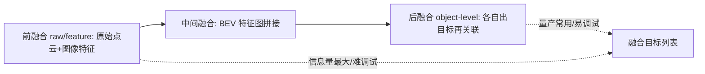

# 二、多传感器融合：从滤波到多目标跟踪

## 引言：隧道出口那一秒，GNSS 突然"跳"了 20 米

老周那次在京港澳高速的实测，至今被团队当作反面教材。车进隧道前，RTK（Real-Time Kinematic，实时动态差分）固定解稳稳把自车定位钉在车道中心。出隧道口的瞬间，卫星信号被山体遮挡后又恢复，GNSS 接收机来了一记"跳变"——位置读数凭空平移了 20 多米，速度也抖了一下。如果只信 GNSS，规划模块会误以为车已经偏出车道，方向盘猛地一抖。

但那天车端跑的是一套紧耦合（tightly-coupled）组合导航：IMU（Inertial Measurement Unit，惯性测量单元）以 100Hz 高频积分，视觉特征点与轮速里程计（wheel odometry）持续校正，GNSS 仅作为松约束观测。隧道内 GNSS 失锁时，系统靠 IMU + 视觉稳住姿态；出隧道 GNSS 一恢复，滤波器（filter）并没有被那个异常跳变立刻"带歪"，因为新观测与预测残差（residual）超出了合理门限（gate），被卡方检验（Chi-square test）判定为野值（outlier）而降权。最终定位曲线平滑地拉回真实轨迹。

这件事讲清了一个道理：单个传感器都会"抽风"，融合的目标不是堆数据，而是用统计方法把"可靠的信号"放大、把"不可靠的噪声"压下去。本章从卡尔曼滤波（KF, Kalman Filter）一路拆到多目标跟踪（MOT, Multi-Object Tracking）。

## 核心概念：为什么要融合，融合什么

### 融合的三大理由

- 互补（complementary）：激光给几何、雷达给速度、相机给语义，单靠谁都不全。
- 冗余（redundant）：一个传感器失效，另一个能顶上，满足功能安全的单点失效容忍。
- 时空对齐（spatiotemporal alignment）：各传感器频率、坐标系、时延不同，必须统一到车体坐标系与同一时间戳。

### 融合的层级



后融合（object-level）各传感器独立检测再关联，工程上最易调试、可解释性强，是量产主流；前融合直接把原始数据/特征喂进一个网络，信息损失最小但调试地狱、对算力与同步要求极高；中间融合（如 BEV 特征拼接）是当下研究热点，折中两者。

## 机制深拆：卡尔曼滤波族的预测—更新

### 标准 KF 的两步循环

卡尔曼滤波是线性高斯系统下的最优估计器。核心是"预测—更新"：

预测步：

$$
\hat{x}_{k|k-1} = F_k \hat{x}_{k-1|k-1}, \quad P_{k|k-1} = F_k P_{k-1|k-1} F_k^T + Q_k
$$

更新步：

$$
K_k = P_{k|k-1} H_k^T (H_k P_{k|k-1} H_k^T + R_k)^{-1}
$$

$$
\hat{x}_{k|k} = \hat{x}_{k|k-1} + K_k (z_k - H_k \hat{x}_{k|k-1}), \quad P_{k|k} = (I - K_k H_k) P_{k|k-1}
$$

协方差（covariance）$P$ 描述的是"我对自己估计有多不确定"；$K$（卡尔曼增益，Kalman gain）的物理含义是"这次观测值相对预测值，我该信多少"——当预测不确定（$P$ 大）而观测很准（$R$ 小），$K$ 趋近 1，更信观测；反之更信预测。这是滤波器的灵魂。

### EKF：把非线性"局部拉直"

真实系统（如用角度/速度描述运动）是非线性的。扩展卡尔曼滤波（EKF, Extended Kalman Filter）在每一步对状态方程 $f$ 与观测方程 $h$ 做一阶泰勒展开，用雅可比（Jacobian）矩阵 $F = \frac{\partial f}{\partial x}$、$H = \frac{\partial h}{\partial x}$ 代替线性矩阵。代价是雅可比难求、易在强非线性处发散。

EKF 预测/更新公式（非线性形式）：

$$
\hat{x}_{k|k-1} = f(\hat{x}_{k-1|k-1}, u_k), \quad P_{k|k-1} = F_k P_{k-1|k-1} F_k^T + Q_k
$$

$$
K_k = P_{k|k-1} H_k^T (H_k P_{k|k-1} H_k^T + R_k)^{-1}, \quad \hat{x}_{k|k} = \hat{x}_{k|k-1} + K_k(z_k - h(\hat{x}_{k|k-1}))
$$

### UKF：不求导，用 Sigma 点"采样"非线性

无味卡尔曼滤波（UKF, Unscented Kalman Filter）绕过雅可比，改用一组确定性采样点（Sigma points）通过真实非线性函数传播，再用加权统计还原均值与协方差。它不需要求导、对强非线性更稳健，代价是计算量略大。思路一句话：与其把曲线拉直，不如用几个代表点把曲线"描"一遍。

### 多目标跟踪的数据关联

单目标滤波解决"一个东西怎么跟"，多目标要解决"谁是谁"。数据关联（data association）把当前帧检测与目标轨迹配对：

- 最近邻（NN, Nearest Neighbor）：只把距离最近的检测配给轨迹，简单但易错配。
- 匈牙利算法（Hungarian / KM）：把"检测—轨迹"代价矩阵做全局最优二分匹配，是 MOT 标配。
- JPDA（Joint Probabilistic Data Association）：用概率把检测软分配给多条轨迹，适合密集遮挡。

轨迹生命周期：新生（tentative）→ 确认（confirmed，连续若干帧命中）→ 终结（coasted，连续未命中超时删除）→ 合并（merge，ID switch 修复）。评估用 MOTA（多目标跟踪准确度）、MOTP（位置精度）、IDS（ID 切换次数）等指标。

## 工程实践：一个单目标 EKF 跟踪

下面用常量速度（CV, Constant Velocity）模型跟踪一个物体的 $(x,y,v_x,v_y)$。状态转移与观测都是线性的，这里用 EKF 框架写，方便日后改非线性。

```python
import numpy as np

class EKFTracker:
    def __init__(self, dt=0.1, q=1.0, r=0.5):
        self.dt = dt
        # 状态 x = [x, y, vx, vy]
        self.x = np.zeros(4)
        self.P = np.eye(4) * 10.0          # 初始很不确定
        # 预测矩阵 F（常量速度，零加速度噪声）
        self.F = np.array([[1,0,dt,0],
                           [0,1,0,dt],
                           [0,0,1,0],
                           [0,0,0,1]])
        self.Q = np.eye(4) * q             # 过程噪声
        self.H = np.array([[1,0,0,0],
                           [0,1,0,0]])     # 观测只能看到位置
        self.R = np.eye(2) * r             # 观测噪声

    def predict(self):
        self.x = self.F @ self.x
        self.P = self.F @ self.P @ self.F.T + self.Q

    def update(self, z):
        # z: 观测位置 [x, y]
        y = z - self.H @ self.x                 # 残差
        S = self.H @ self.P @ self.H.T + self.R # 残差协方差
        K = self.P @ self.H.T @ np.linalg.inv(S)
        self.x = self.x + K @ y
        self.P = (np.eye(4) - K @ self.H) @ self.P

    def step(self, z):
        self.predict()
        self.update(z)
        return self.x

# 用法（车规落地坑见下）
# tracker = EKFTracker(dt=0.1)
# for z in detections:
#     est = tracker.step(z)
```

车规/实时落地坑：矩阵求逆在嵌入式上要定点化并防奇异（加小量到对角）；$Q/R$ 不是拍脑袋，要在路采数据上标定；多目标时关联用的是门控（gating，马氏距离 Mahalanobis distance 阈值）先过滤不可能配对；过程模型选错（如用 CV 跟踪急转弯车）会拖框，需要交互多模型（IMM, Interacting Multiple Model）。

## 常见坑（12 条）

1. 时间不同步：雷达 20Hz、相机 30Hz，直接用"最近帧"而不做插值，引入百毫秒级时延误差。
2. 坐标系未统一：观测在传感器坐标系，状态在车体系，漏了外参变换，轨迹整体偏移。
3. 协方差初始化过自信：$P$ 太小导致新观测被忽视，目标"跟丢"还自认为很准。
4. 野值未做门控：跳变观测直接进更新，一个异常点把整条轨迹带飞。
5. 雅可比算错：EKF 手推导数符号/维度错，滤波发散且无报错。
6. 过程噪声 Q 过刚：强制信任模型，遇到真实机动（急刹/急转）跟不上。
7. 数据关联 ID 切换：遮挡后错误配对，MOTA 暴跌、下游规划误判。
8. 新目标延迟确认：阈值太严，切入车辆好几百毫秒才被确认，反应太慢。
9. 马氏距离 vs 欧氏距离：高维关联用欧氏会忽略不同轴不确定性，应用马氏距离。
10. 数值奇异：协方差矩阵失去正定（对称破缺/舍入），需加抖动或 Joseph 形式更新保正定。
11. 量纲不统一：位置米、速度米/秒混进同一协方差却不缩放，增益失衡。
12. 多帧延迟观测：感知检测本身有处理延迟，融合不补偿时延会"用过去量纠正现在状态"。

## 面试要点（12 题）

1. KF 的卡尔曼增益物理意义？答：表示本次更新中观测相对预测的信任权重，0~1 之间。
2. 协方差 P 代表什么？答：状态估计的不确定性，随预测增大、更新减小。
3. EKF 为什么需要雅可比？答：把非线性函数在工作点一阶线性化，才能套用 KF 框架。
4. UKF 相比 EKF 优点？答：免雅可比、对强非线性/非高斯更准，代价是采样计算。
5. 何时用 UKF 不用 EKF？答：模型强非线性或雅可比难求时，如大角度姿态。
6. 后融合 vs 前融合？答：后融合可解释易部署，前融合信息全但难调，量产偏后融合。
7. 匈牙利算法解决什么？答：检测—轨迹的全局最优二分匹配，最小化总代价。
8. 什么是门控（gating）？答：用马氏距离阈值先剔除不可能配对，降低关联复杂度。
9. JPDA 与 NN 区别？答：NN 硬分配最近，JPDA 按概率软分配给多条轨迹。
10. MOTA/MOTP 含义？答：MOTA 综合漏检/误检/IDS，MOTP 衡量定位精度。
11. 隧道 GNSS 跳变怎么抗？答：IMU+视觉紧耦合，卡方检验把异常 GNSS 观测降权。
12. IMM 是什么？答：交互多模型，并行跑多个运动模型按概率加权，适配机动。

## 结语：一页纸回顾与延伸

回顾：融合不是"越多越好"，而是用统计把可靠信号放大、把噪声压住。KF 的 $P$ 与 $K$ 是灵魂；EKF 靠雅可比、UKF 靠 Sigma 点；多目标靠关联 + 生命周期管理。量产主线是"后融合为主、前/中融合探索"。记住隧道那个案例：单点跳变不可怕，可怕的是滤波器没有"怀疑精神"。

延伸阅读方向：Bar-Shalom《Estimation with Applications...》掌握 JPDA/IMM；Probabilistic Robotics 第 1 部分打牢贝叶斯估计基础；OpenPCDet/Track 代码跑通 AB3DMOT；多篇 BEV 融合论文（如 TransFusion）看前融合前沿；ISO 21448 SOTIF 理解"未知不安全"场景的融合兜底。

本章约 3400 字。
