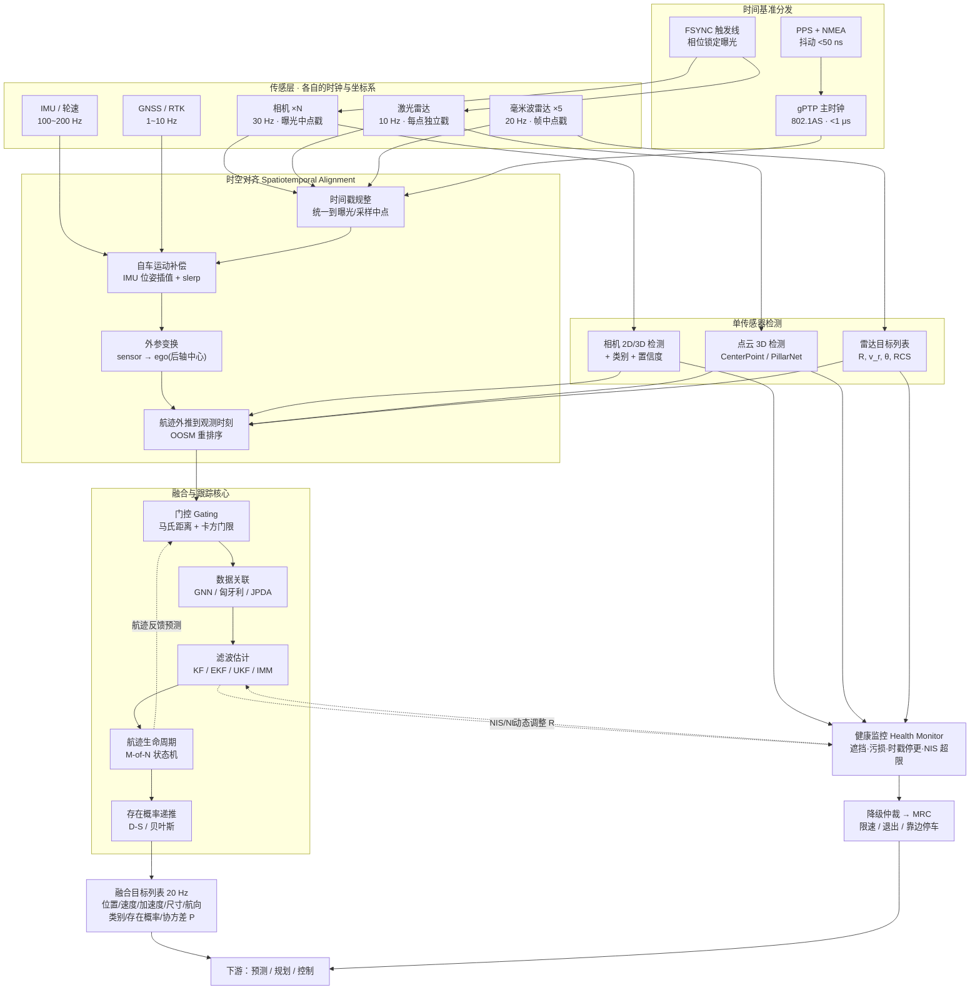
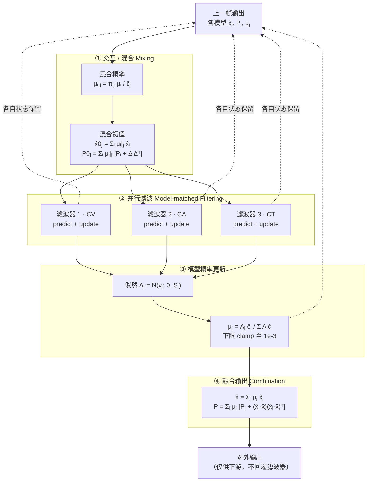
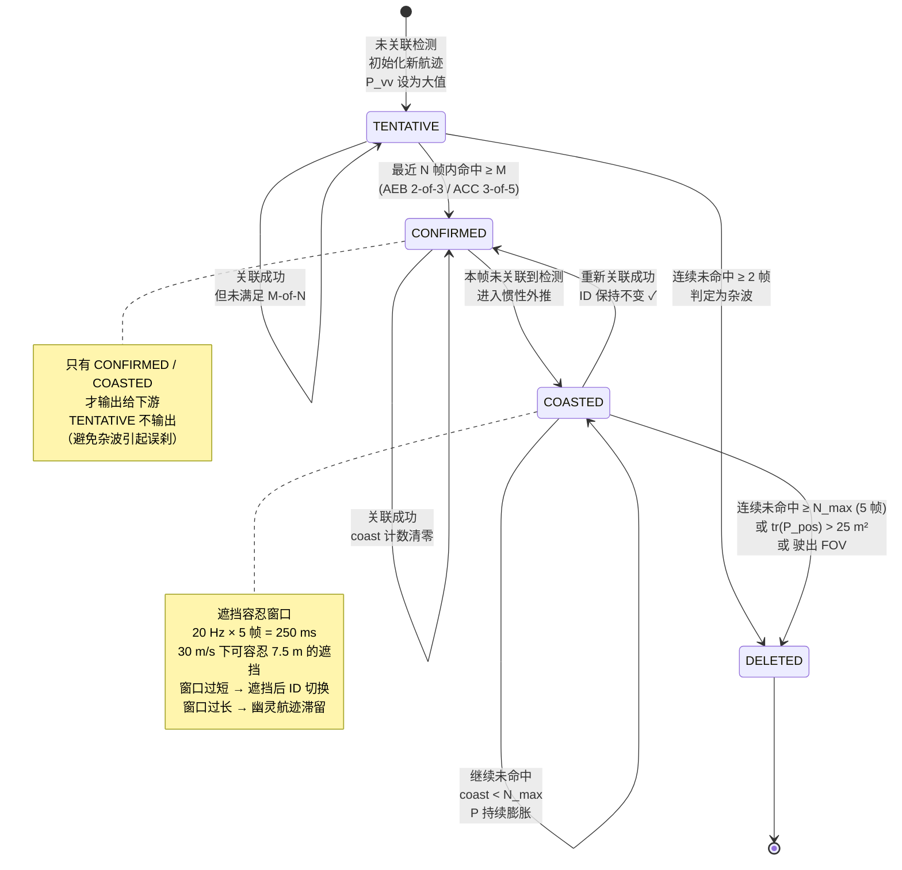

# 二、多传感器融合：从滤波到多目标跟踪

## 0. 引言：隧道出口那一秒，GNSS 突然"跳"了 23 米

那是京港澳高速上一条 1.8 公里长的隧道，测试时间下午三点四十。老周坐在副驾，笔记本上并排开着三个窗口：左边是组合导航的实时位姿，中间是感知目标列表，右边滚动着一条条时间戳日志。主驾的小陈把定速巡航设在 100 km/h，也就是 27.8 m/s。

进洞之前一切完美。RTK（Real-Time Kinematic，实时动态差分）是固定解（fixed），水平精度报 1.8 cm，自车被稳稳钉在车道中心线上，横向偏差在 ±5 cm 内小幅呼吸。进洞第 3 秒，可见卫星数从 21 颗掉到 4 颗，解状态从 fixed 降到 single；第 6 秒彻底失锁，接收机开始输出全零的位置和一个"无效"标志位。整个隧道通过时间 65 秒。

出洞的那一刻，事情发生了。车头刚冲出洞口，天空重新打开，接收机在 1.2 秒内重新捕获到 11 颗星，但它给出的第一个有效位置解——是一个浮点解（float），而且位置比真实位置**向东北方向偏了 23.4 米**，速度矢量里还夹着一个 4.1 m/s 的横向分量。原因不难猜：洞口那一段山壁和混凝土洞门是极强的多径（multipath）反射面，接收机在半模糊度未固定的状态下，把反射路径当成了直射路径。

老周后来把那两秒的原始日志一帧帧扒了出来。如果这套系统只信 GNSS，规划模块会在那一瞬间认定"自车已经偏出车道 23 米、正在以 4 m/s 横移"，横向控制器会以最大转向速率反打方向盘——100 km/h 下这一下足够让车冲出车道。

但那天车上跑的是一套紧耦合（tightly-coupled）组合导航：IMU（Inertial Measurement Unit，惯性测量单元）以 200 Hz 做机械编排（mechanization）积分，视觉特征点与轮速里程计（wheel odometry）持续提供约束，GNSS 只作为一路带协方差的观测量进入滤波器。隧道内 65 秒无 GNSS，纯惯导 + 视觉 + 轮速的航位推算把纵向误差控制在 1.7 m、航向误差 0.4° 以内。出洞时，那个偏了 23.4 米的观测进来，滤波器算出的新息（innovation）是 23.4 m，而新息协方差 $S$ 对应的一倍标准差只有 2.1 m——归一化新息平方（NIS, Normalized Innovation Squared）算出来是 124，远超 2 自由度卡方分布 99.9% 分位的 13.8。门控（gating）直接把这个观测判为野值（outlier）丢弃，同时把 GNSS 通道打上"多径可疑"标记，接下来 3 秒内把它的观测噪声 $R$ 放大 100 倍。定位曲线在图上纹丝不动，平滑地跟着惯导走，直到 GNSS 重新固定解、连续 10 帧新息落回门内，才逐步恢复权重。

这件事讲清了一个道理：**融合的本质不是"把更多数据加起来"，而是给系统装上一套怀疑机制**——每一个观测进来，都要先回答"你和我预期的差多少、这个差在统计上合理吗"，然后才决定信多少。协方差是这套怀疑机制的语言，卡尔曼增益是它的裁决结果。

这一章我们把这套机制从时空对齐的物理地基，一路拆到卡尔曼滤波族的最优性推导、IMM 交互多模型、多目标跟踪的数据关联，再到融合层级的工程取舍与失效降级。最后给一份真实运行的多目标跟踪代码和它的真实输出。

---

## 1. 核心概念

### 1.1 融合到底在解决什么问题

用最抽象的语言说，多传感器融合就是在求一个后验分布：

$$p(x_k \mid z_{1:k}^{(1)}, z_{1:k}^{(2)}, \dots, z_{1:k}^{(M)})$$

其中 $x_k$ 是我们关心的状态（自车位姿、周围目标的位置速度尺寸类别），上标 $(m)$ 是第 $m$ 路传感器。在马尔可夫假设 + 观测条件独立假设下，这个后验可以递推：

$$\underbrace{p(x_k \mid z_{1:k})}_{\text{后验}} \propto \underbrace{\prod_{m=1}^{M} p(z_k^{(m)} \mid x_k)}_{\text{各路似然}} \cdot \underbrace{\int p(x_k \mid x_{k-1})\, p(x_{k-1}\mid z_{1:k-1})\,dx_{k-1}}_{\text{预测（先验）}}$$

这个式子里藏着融合的全部工程难点：

1. **各路似然要在同一个 $x_k$ 上求值** —— 这就要求所有观测统一到同一时刻、同一坐标系（第 2 节：时空对齐）。
2. **积分要能算** —— 高斯 + 线性时退化成卡尔曼滤波；非线性要线性化或采样（第 3 节）。
3. **运动模型 $p(x_k\mid x_{k-1})$ 只有一个的时候不够用** —— 目标会突然机动（第 4 节：IMM）。
4. **状态不止一个** —— 有几十个目标，还不知道哪个观测属于哪个目标（第 5 节：MOT）。
5. **"条件独立"这个假设经常是假的** —— 同一个标定误差、同一个时钟漂移会让两路观测的误差相关（第 6 节：协方差交叉与故障降级）。

### 1.2 动机一：互补 —— 没有一种传感器能填满整张表

| 能力维度 | 摄像头 Camera | 激光雷达 LiDAR | 毫米波雷达 Radar | 4D 成像雷达 | 超声波 USS |
|---|---|---|---|---|---|
| 纵向距离精度 50 m | ±2~5 m（单目） | **±0.03 m** | ±0.15 m | ±0.10 m | 不适用 |
| 横向位置精度 50 m | ±0.3 m | **±0.05 m** | ±4~8 m | ±0.8 m | 不适用 |
| 径向速度 | 需两帧差分，±1 m/s | 需两帧配准，±0.5 m/s | **单帧直出 ±0.1 m/s** | **单帧直出 ±0.1 m/s** | 无 |
| 高度/俯仰 | 有（2D 投影） | **有（直接）** | **无** | 有（±2°） | 无 |
| 语义/类别 | **top-1 > 95%** | 中（几何形状） | 极弱（RCS） | 弱 | 无 |
| 颜色/文字/灯色 | **唯一来源** | 无 | 无 | 无 | 无 |
| 夜间无照明 | 差（SNR 崩） | **不受影响** | **不受影响** | **不受影响** | 不受影响 |
| 暴雨 50 mm/h | 中（雨刷/水膜） | 差（衰减 10~20 dB/km，射程掉 60%） | **好（掉 <10%）** | **好** | 中 |
| 浓雾 能见度 50 m | 差 | 差 | **好** | **好** | 好 |
| 逆光/隧道口 | **极差** | 好 | 好 | 好 | 好 |
| 静止障碍物 | 好（视觉确认） | **好** | 差（被杂波抑制滤掉） | 中 | 好（近场） |
| 最远探测 | 200~250 m（长焦） | 200~300 m | **250 m** | 300~400 m | 5 m |
| 数据率 | 8 MP×30 fps ≈ 700 MB/s | 2.6 M pts/s ≈ 40 MB/s | 目标列表 ≈ 20 KB/s | 点云 ≈ 2 MB/s | 极低 |
| 单件量产成本 | ¥200~600 | ¥1500~5000 | ¥150~400 | ¥800~2000 | ¥15~30 |

这张表的读法不是"看谁分数高"，而是**看每一行的加粗落在谁身上**。径向速度只有雷达能单帧给，灯色只有相机能给，厘米级几何只有激光能给。三者互补不是营销话术，是信息维度上的硬约束。

更关键的是**失效模式的不相关性（decorrelated failure modes）**。逆光让相机瞎，但对雷达毫无影响；暴雨让激光射程腰斩，但雷达几乎不掉；井盖让雷达虚警，但相机一眼看出那是井盖。融合能提升安全性的前提是**各路的失效不同时发生**——如果三路传感器共用同一个电源、同一块时钟、同一个域控软件栈，那所谓的"冗余"在共因失效（CCF, Common Cause Failure）面前一文不值。

### 1.3 动机二：冗余 —— 功能安全与 ASIL 分解

ISO 26262 对整车级危害做风险评估（HARA），得到 ASIL（Automotive Safety Integrity Level）等级。以"高速 NOA 场景下的非预期全力制动"为例，典型评级是 S2/E4/C3 → **ASIL D**，这是最高等级。

ASIL D 对硬件的量化要求非常残酷：

| 指标 | ASIL A | ASIL B | ASIL C | ASIL D |
|---|---|---|---|---|
| 单点故障度量 SPFM | — | ≥ 90% | ≥ 97% | ≥ 99% |
| 潜伏故障度量 LFM | — | ≥ 60% | ≥ 80% | ≥ 90% |
| 随机硬件失效概率 PMHF | — | < 100 FIT | < 100 FIT | **< 10 FIT** |
| 换算成 MTBF | — | > 1.1×10⁶ h | > 1.1×10⁶ h | **> 1.1×10⁷ h（约 1268 年）** |

一颗车规摄像头模组的失效率大约在 50~200 FIT（1 FIT = 每 10⁹ 小时 1 次失效），单靠它绝无可能达到 10 FIT。这时候就要用 **ASIL 分解（ASIL decomposition，ISO 26262-9 第 5 章）**：

$$\text{ASIL D} \Rightarrow \begin{cases}\text{ASIL D(D)} + \text{QM(D)} \\ \text{ASIL C(D)} + \text{ASIL A(D)} \\ \textbf{ASIL B(D)} + \textbf{ASIL B(D)} \end{cases}$$

最常用的是最后一种：把一个 ASIL D 的安全目标拆给两条**充分独立**的 ASIL B 通道。落到 AEB 上就是经典的架构——

- **通道甲**：相机独立完成检测 + 分类 + TTC 计算（ASIL B）
- **通道乙**：雷达独立完成检测 + 测距测速 + TTC 计算（ASIL B）
- **仲裁**：两条通道都判定需要制动，才允许触发全力制动

"充分独立"四个字要拿证据说话，ISO 26262 管这叫 **DFA（Dependent Failure Analysis，相关失效分析）**，要逐条论证：

| 潜在共因 | 论证/措施 |
|---|---|
| 共用电源 | 两路独立 LDO/DCDC，独立过压欠压监控 |
| 共用时钟 | 独立晶振 + 交叉时钟监控（clock cross-check） |
| 共用 MCU/SoC | 分置于不同芯片，或用锁步核（lock-step）+ MPU 隔离 |
| 共用软件库 | 两路用不同算法族（如相机走 CNN、雷达走信号处理 + 传统跟踪） |
| 共用环境 | **无法完全消除**——正对太阳的隧道口同时有强逆光 + 洞口金属结构强反射，这是 SOTIF（ISO 21448）范畴而非 26262 范畴 |
| 共用标定/时间基准 | 这是最隐蔽的一条：如果两路共用同一份外参和同一个 PTP 主时钟，一次时钟跳变会同时污染两路 |

最后一条特别值得记住：**时空对齐既是融合的地基，也是融合最大的共因失效源**。

### 1.4 动机三：时空对齐 —— 融合的入场券

先记住一个数字。自车 108 km/h = 30 m/s：

$$\Delta s = v\,\Delta t = 30\ \text{m/s} \times \Delta t$$

| 时间误差 $\Delta t$ | 自车位移 | 对向来车相对位移（相对速度 60 m/s） |
|---|---|---|
| 1 μs | 0.03 mm | 0.06 mm |
| 100 μs | 3 mm | 6 mm |
| 1 ms | **3 cm** | 6 cm |
| 10 ms | **30 cm** | 60 cm |
| 50 ms | 1.5 m | **3.0 m** |
| 100 ms | 3.0 m | **6.0 m** |

30 cm 已经超过了大多数关联门限的半径；3 m 意味着一整个车身长度的错位——关联算法会把它当成"不是同一个目标"。**融合算法再优雅，喂进去的两个观测如果差了 50 ms，本质上就是在给两个不同时刻的世界做加权平均。**

空间维度同理。相机-激光外参的偏航角（yaw）如果标偏 0.2°，在 50 m 处对应横向偏差：

$$\Delta y = R\tan(\delta) = 50 \times \tan(0.2°) = 0.175\ \text{m}$$

投影到图像上（$f_x = 2762$ px）：$2762\times\tan(0.2°) = 9.6$ px。对于一个 50 m 外只有 100 px 宽的车，9.6 px 的偏移足以让点云落到相邻车道的车身上。

### 1.5 融合系统全景图



图里有三条容易被忽略的边：

- **`LIFE -.航迹反馈预测.-> GATE`**：跟踪是一个闭环，门控用的是上一帧航迹外推的结果，所以滤波器发散会直接导致关联崩溃，形成正反馈。
- **`FILT -.NIS/NEES.-> HEALTH`**：滤波器的一致性统计量本身就是最好的免费故障检测器，不需要额外传感器。
- **`HEALTH -.动态调整 R.-> FILT`**：这就是引言里那套系统"把 GNSS 的 $R$ 放大 100 倍"的实现位置。

### 1.6 融合模块的输出契约

下游规划要的不只是一个位置，而是一整套带不确定性的描述：

| 字段 | 含义 | 典型精度 / 取值 | 谁在用 |
|---|---|---|---|
| `id` | 航迹唯一标识 | int32，保持稳定 | 预测（需要历史轨迹） |
| `pos (x,y,z)` | 车体系位置 | 纵向 ±0.3 m 50 m | 全部 |
| `vel (vx,vy)` | 速度矢量 | ±0.2 m/s | ACC / 预测 |
| `acc (ax,ay)` | 加速度 | ±0.5 m/s² | AEB TTC |
| `dim (l,w,h)` | 3D 尺寸 | ±0.2 m | 碰撞检测 |
| `yaw` | 航向角 | ±5° | 预测（意图） |
| `class + prob` | 类别及概率分布 | top-1 > 95% | 预测（行为模型） |
| `P (6×6 或 4×4)` | **状态协方差** | 与真实误差匹配 | 规划的安全裕度 |
| `p_exist` | **存在概率** | 0~1 | 是否响应 |
| `age / hits` | 航迹年龄与命中数 | — | 置信度门槛 |
| `sensor_mask` | 哪些传感器贡献了 | bitmask | 诊断与降级 |
| `t_valid` | 该状态对应的时刻 | 微秒级 | 下游再外推 |

`P` 和 `p_exist` 是量产系统里最容易被"随便填个常数"糊弄过去的两项，也是最能体现融合水平的两项。一个只会输出点估计不输出协方差的融合模块，等于逼着规划模块用最保守的固定膨胀半径——该激进的时候不敢，该保守的时候不够。

---

## 2. 时空对齐：融合的地基

### 2.1 端到端时延预算：三路数据到底差多少

先把"这一帧数据代表哪一时刻的世界"这件事量化。以下是一套典型 L2+ 域控的实测量级：

| 环节 | 相机（8 MP/30 fps） | 激光雷达（10 Hz 转镜） | 毫米波雷达（20 Hz） |
|---|---|---|---|
| 物理采集 | 曝光 11 ms（LFM 需覆盖 90 Hz PWM 周期） | 单点瞬时，整帧扫 100 ms | 一帧 128 chirp × 50 μs = 6.4 ms |
| 读出/组包 | 卷帘读出 16 ms | UDP 组包 2~5 ms | — |
| 链路传输 | MIPI/GMSL 1~2 ms | 千兆以太网 1 ms | CAN-FD 1~5 ms |
| 前处理 | ISP 3~6 ms | 解包 + 去畸变 8~15 ms | 片内 2D-FFT + CFAR 8~15 ms |
| 检测推理 | CNN 20~35 ms | 3D 检测 25~45 ms | 片内聚类 + 跟踪 3~5 ms |
| 后处理/序列化 | NMS + 打包 3 ms | 打包 2 ms | 打包 1 ms |
| **合计（采样中点 → 可用）** | **约 55~75 ms** | **约 90~140 ms** | **约 20~32 ms** |

**最快的雷达和最慢的激光相差约 100 ms。** 100 ms × 30 m/s = 3 m。如果融合模块拿到数据就直接关联，等于把一个 3 米前的雷达点和一个 3 米后的激光框强行配对。

正确做法只有一条：**每一路数据必须携带它自己的"采样时刻"时间戳，融合模块把所有航迹外推到一个统一的融合时刻，再做关联**。绝对不能用"数据到达时刻"。

### 2.2 硬件同步：PPS / PTP / gPTP / 触发式曝光

时间同步分两件事：**对表（时钟同步）** 和 **对拍（采样触发同步）**。两件都做到才叫硬同步。

#### 2.2.1 PPS + NMEA：GNSS 授时

GNSS 接收机输出一路 **PPS（Pulse Per Second，秒脉冲）**，每秒整点的上升沿，相对 UTC 的抖动典型 < 50 ns（好一些的 < 20 ns）。但 PPS 只告诉你"现在是一个整秒"，不告诉你"是哪一秒"。所以要配一条串口 NMEA 报文（GPRMC/GPZDA）说明这一秒的绝对时间。

**这里有个经典的坑**：9600 bps 波特率下发一条 70 字节的 GPRMC 需要 $70\times10/9600 = 73$ ms。所以接收机的约定是"PPS 上升沿之后紧接着发的那条报文，描述的是**该上升沿**的时刻"（有些型号是"下一个上升沿"，必须查手册）。搞反了就是整整 1 秒的系统偏差——足够让所有融合结果变成随机数。

#### 2.2.2 PTP / IEEE 1588v2：以太网上的对表

PTP 用四个时间戳算出主从时钟的偏差和链路时延。主时钟发 `Sync`（发出时刻 $t_1$，若不支持一步法则用 `Follow_Up` 携带精确 $t_1$），从时钟记录到达时刻 $t_2$；从时钟发 `Delay_Req`（$t_3$），主时钟记录到达 $t_4$：

$$\text{delay} = \frac{(t_2 - t_1) + (t_4 - t_3)}{2}, \qquad \text{offset} = \frac{(t_2 - t_1) - (t_4 - t_3)}{2}$$

这两个式子的前提是**链路对称**（去程时延 = 回程时延）。不对称多少，offset 就错一半：

$$\epsilon_{\text{offset}} = \frac{d_{\text{fwd}} - d_{\text{rev}}}{2}$$

一个 store-and-forward 交换机对 64 字节帧的转发时延约 5~10 μs，如果上下行排队情况不同，几微秒的不对称很正常。这就是为什么车载必须用 **透明时钟（TC, Transparent Clock）** 交换机：交换机把报文在自己内部滞留的时间写进 `correctionField`，从时钟减掉这部分，把排队抖动消掉。

**软件时间戳 vs 硬件时间戳**是另一个数量级的差别：

| 打戳位置 | 典型精度 | 说明 |
|---|---|---|
| 用户态 `recv()` 之后 | 100 μs ~ 10 ms | 受调度、中断合并、GC 影响，不可用 |
| 内核网卡驱动中断 | 10~50 μs | 勉强，抖动仍受中断延迟影响 |
| MAC 层硬件打戳 | **< 100 ns** | PHY/MAC 在 SFD 时刻打戳，唯一正确解 |

#### 2.2.3 gPTP / IEEE 802.1AS：汽车以太网的 profile

gPTP 是 PTP 面向 TSN（Time-Sensitive Networking）的裁剪 profile，也是 AUTOSAR 和绝大多数车载以太网骨干采用的标准。关键约束：

- 所有节点必须是**时间感知系统**（time-aware system），中间交换机必须支持 TC。
- 规范要求 **≤ 7 跳内，端到端同步误差 < 1 μs**。实际车载骨干通常 2~3 跳，实测能做到 200~500 ns。
- 用 `Pdelay_Req/Resp` 做逐链路（peer-to-peer）时延测量，而不是端到端，抗拓扑变化能力更强。
- BMCA（Best Master Clock Algorithm）自动选主；车载一般把 GNSS 授时的网关强制设为 Grandmaster（`priority1` 写死）。

#### 2.2.4 触发式曝光：让"对拍"也同步

对好表还不够。相机 30 Hz、激光 10 Hz，即使时间戳都精确，两者的采样时刻仍然可能差 16 ms。**触发同步（trigger sync）** 解决这个问题：

- 域控或专用同步板产生一路 **FSYNC** 方波（30 Hz），相机在方波边沿开始曝光（外触发模式，slave mode）。
- 激光雷达以 10 Hz 旋转，用 PPS 做**相位锁定（phase lock）**，保证每一圈的 0° 起始时刻固定。
- 更进一步的做法是 **LiDAR-triggered camera**：激光雷达每扫到某个相机的 FOV 中心方位角时，发一个脉冲触发那颗相机曝光。这样点云和图像在**空间上重合的那一部分**是同时刻采集的——这对相机-激光的前融合至关重要。

| 同步方案 | 时钟精度 | 采样相位对齐 | 布线成本 | 适用 |
|---|---|---|---|---|
| 纯软件时间戳 | 1~10 ms | 无 | 0 | 只适合演示，量产禁用 |
| NTP | 1~10 ms | 无 | 0 | 非实时诊断链路 |
| PPS + NMEA | 50 ns（时钟） | 无（仍需触发线） | 低（1 根线 + 串口） | GNSS/IMU/LiDAR 授时 |
| PTP（软件戳） | 10~100 μs | 无 | 0（复用网络） | 不推荐 |
| PTP/gPTP（硬件戳 + TC） | **< 1 μs** | 无（需配触发） | 中（需 TSN 交换机） | 域控骨干标配 |
| gPTP + FSYNC 硬触发 | **< 1 μs** | **< 100 μs** | 中高（额外触发线束） | 量产多传感器方案 |
| LiDAR 相位触发相机 | < 1 μs | **< 1 ms 且空间对准** | 高 | 高精度前融合/Robotaxi |

### 2.3 时间戳应该打在曝光中点，而不是收到时刻

这是一条看起来是常识、实际上被反复搞错的规则。

一帧图像不是一个瞬间，它是一段积分。设曝光开始时刻 $t_{\text{start}}$、曝光时长 $T_{\text{exp}}$，那么这帧图像代表的物理时刻应该是**曝光中点（center of exposure）**：

$$t_{\text{frame}} = t_{\text{start}} + \frac{T_{\text{exp}}}{2}$$

原因很直观：一个匀速运动的目标在曝光期间从 $p_1$ 移动到 $p_2$，成像上是一条模糊带，其能量重心正好在中点。用曝光起始时刻，会引入 $T_{\text{exp}}/2$ 的系统性滞后。

数字：LFM（LED Flicker Mitigation）要求曝光时间 ≥ 11 ms 以覆盖 90 Hz 的 PWM 周期，那么 $T_{\text{exp}}/2 = 5.5$ ms，30 m/s 下就是 **16.5 cm 的系统性偏差**，而且这个偏差随曝光时间自动变化（白天短曝光 1 ms，夜间长曝光 20 ms）——它是一个会随光照漂移的系统误差，比随机噪声难查得多。

更精细的情况：

- **卷帘快门（rolling shutter）**：每一行的曝光中点不同，$t(n) = t_{\text{start}} + \frac{n}{H}T_{\text{read}} + \frac{T_{\text{exp}}}{2}$。严格做法是逐行时间戳，实际工程折中是给整帧打"中间行的曝光中点"，并把 $T_{\text{read}}/\sqrt{12}$（均匀分布标准差）加进观测噪声 $R$ 里。$T_{\text{read}}=16$ ms 时，这一项等效 4.6 ms 的时间不确定度 = 14 cm 的位置噪声。
- **激光雷达**：每个点都有自己的采集时刻，UDP 包头里带 ns 级时间戳。参考时刻取帧头还是帧尾会差 100 ms（3 m），**整条链路必须统一约定并写进接口文档**。
- **毫米波雷达**：一帧 $N_c$ 个 chirp，$T_f = 6.4$ ms，取帧中点。但很多 Tier-1 雷达通过 CAN 输出目标列表时，时间戳字段填的是**报文发送时刻**而不是采样时刻——两者差 15~25 ms。这是集成时必须找供应商确认的第一件事。

### 2.4 软件插值与运动补偿

硬件同步做到 1 μs，也不可能让 10 Hz 的激光和 30 Hz 的相机每一帧都对齐。剩下的靠软件补。

#### 2.4.1 自车运动补偿

把传感器 $m$ 在时刻 $t_m$ 采集的观测，搬到融合时刻 $t_f$：

$$p^{\text{ego}(t_f)} = \left(T^{w}_{\text{ego}}(t_f)\right)^{-1} T^{w}_{\text{ego}}(t_m)\, T^{\text{ego}}_{m}\, p^{m}$$

其中 $T^{w}_{\text{ego}}(t)$ 是自车在世界系（或某个局部固定系）下的位姿，由 IMU/组合导航提供。IMU 是 100~200 Hz，要插值到任意时刻：

- 平移：线性插值 $t(\tau) = (1-s)t_a + s\,t_b$
- 旋转：**必须用球面线性插值 slerp**，$q(\tau) = q_a (q_a^{-1}q_b)^{s}$，$s = \frac{\tau - t_a}{t_b - t_a}$

用欧拉角线性插值在小角度下误差可以忽略（5 ms 内转过的角度 < 0.3°，误差 < 10⁻⁵ rad），但在大角速度（如 AEB 时的剧烈俯仰、原地掉头）下会出问题，而且欧拉角有万向锁。工程上没有理由不用 slerp。

#### 2.4.2 目标运动补偿：只补自车是不够的

自车补偿解决不了目标自己在动。对向来车相对速度 60 m/s，在 100 ms 的激光扫描周期内它自己移动了 6 m——点云被"拉长"，检测框长度虚增 10%~30%。

解法是**二次补偿**：用跟踪器已经估计出的目标速度 $\hat{v}$，把属于该目标的点再往回搬 $\hat{v}\cdot(t_i - t_{\text{ref}})$。这是个鸡生蛋问题（要跟踪结果才能补偿，补偿了才能跟得准），实际用上一帧的速度估计，收敛很快。

#### 2.4.3 外推 vs 内插：一个方向性错误

很多人第一反应是"把观测拉到当前时刻"。**这是错的。** 观测是数据，数据不该被篡改；应该外推的是**航迹**：

$$\hat{x}_{k|k-1} = f\big(\hat{x}_{k-1|k-1},\ \Delta t = t_z - t_{k-1}\big),\qquad P_{k|k-1} = F P F^\top + Q(\Delta t)$$

注意 $Q$ 也是 $\Delta t$ 的函数——外推越久，不确定性越大，门控自动放宽。如果你把观测硬搬到当前时刻，这个"搬运本身引入的误差"就没有地方体现了，滤波器会过度自信。

#### 2.4.4 乱序观测 OOSM

雷达 25 ms 出结果，激光 120 ms 出结果。于是雷达的第 5 帧（$t=0.25$ s 采样，$t=0.275$ s 到达）会**早于**激光的第 1 帧（$t=0.10$ s 采样，$t=0.22$ s 到达）中的某些情况到达融合模块。这叫 **OOSM（Out-Of-Sequence Measurement，乱序观测）**。

三种处理方式：

| 方案 | 做法 | 延迟代价 | 精度 | 适用 |
|---|---|---|---|---|
| 丢弃 | 直接扔掉迟到的观测 | 0 | 差（丢信息） | 迟到极少的通道 |
| 固定缓冲重跑 | 缓冲 $T_{\text{buf}}$（如 150 ms），到期后按采样时刻排序统一处理 | **+150 ms** | 最优 | 对时延不敏感的场景 |
| 单步/多步回溯 (retrodiction) | Bar-Shalom 的 A1/B1 算法：把当前状态"逆推"回观测时刻，用观测更新，再推回来 | 0 | 接近最优（A1 算法误差 < 1%） | 量产主流 |

回溯的核心是"逆推"：定义从 $k$ 回到 $\tau$ 的等效逆向状态转移，用平滑器（smoother）思想构造增益。工程实现里，B1 算法（一步近似）代码量不到 50 行，效果已经很够。

### 2.5 外参标定：相机—激光

外参（extrinsics）是 6 自由度刚体变换 $T^{\text{cam}}_{\text{lidar}} = [R\,|\,t]$。精度要求：旋转 < 0.1°，平移 < 2 cm。

#### 2.5.1 靶标法：PnP

流程：把一块棋盘格（典型 12×8 内角点，方格 40 mm）或带镂空圆孔的标定板摆在 3~15 m 范围的多个位置。

- **图像侧**：亚像素角点提取（`cv::findChessboardCornersSB` + `cornerSubPix`），得到 2D 点 $\{m_i\}$。
- **点云侧**：分割出标定板平面（RANSAC），拟合板边界，用板的物理尺寸约束求出角点的 3D 坐标 $\{M_i\}$。镂空圆孔板比棋盘更好用——圆心在点云里能通过孔洞边缘拟合出来，而棋盘的黑白格在点云里只有反射强度差异，噪声大。
- **求解**：这就是标准的 **PnP（Perspective-n-Point）** 问题，最小化重投影误差：

$$\min_{R,t}\ \sum_i \big\|\, m_i - \pi\big(K\,(R M_i + t)\big) \big\|^2_{\Sigma_i}$$

用 EPnP 或 P3P + RANSAC 给初值，再用 Levenberg-Marquardt 精化。旋转参数化用李代数 $\mathfrak{se}(3)$ 或四元数，不要用欧拉角（万向锁 + 不同参数化下的雅可比条件数差异巨大）。

**实操要点**：
- 标定板姿态要覆盖平移和旋转的多个方向，否则某些自由度无约束。特别是**沿光轴方向的平移 $t_z$ 与焦距强相关**，必须有远近变化。
- 20 个位置起步，最终重投影 RMSE 应 < 0.5 px。
- 用棋盘法算出来的外参，一定要做**留一交叉验证**（用 19 个位置标定、第 20 个位置验证），单纯看训练残差会严重高估精度。

#### 2.5.2 无靶标法：互信息与边缘对齐

量产车不可能天天摆标定板。**无靶标标定（targetless calibration）** 靠场景本身的统计相关性。

**互信息法（Pandey et al., 2012）**：观察到点云的**反射强度**（intensity）和图像的**灰度**在同一物理表面上是统计相关的——白色车道线在图像里亮、在点云里反射率高；沥青路面两者都暗。于是把外参当作参数，最大化两者的互信息（Mutual Information）：

$$\hat{\Theta} = \arg\max_{\Theta}\ \mathrm{MI}(X, Y) = \arg\max_{\Theta}\ \sum_{x,y} p(x,y;\Theta)\log\frac{p(x,y;\Theta)}{p(x)\,p(y)}$$

其中 $X$ 是点云反射强度的直方图变量，$Y$ 是这些点按外参 $\Theta$ 投影到图像后落点的灰度值。联合分布用核密度估计（KDE）平滑。优化用 Nelder-Mead 或 BOBYQA（目标函数不可导且有噪声，梯度法不稳）。

**边缘对齐法（Levinson & Thrun, 2013）**：更鲁棒的做法。观察到"点云深度不连续的地方"和"图像边缘"高度重合（物体轮廓）。构造目标：

$$J(\Theta) = \sum_{i} \mathcal{D}_i \cdot E\big(\pi(\Theta, p_i)\big)$$

$\mathcal{D}_i$ 是点 $p_i$ 的深度不连续度（与邻点的最大深度差），$E(\cdot)$ 是图像边缘强度图（Sobel + 距离变换平滑）。让"深度跳变大的点"投到"图像边缘强的像素"上。这个方法可以在线跑：每帧算一次 $J$，用几十帧累积后做小范围网格搜索，能持续监控 ±0.5° 内的漂移。

| 方法 | 需要靶标 | 典型旋转精度 | 典型平移精度 | 单次耗时 | 能否在线 |
|---|---|---|---|---|---|
| 棋盘 PnP | 是 | 0.05°~0.15° | 1~2 cm | 30 min（人工） | 否 |
| 镂空圆孔板 | 是 | **0.03°~0.10°** | **0.5~1.5 cm** | 30 min | 否 |
| 互信息 MI | 否 | 0.15°~0.4° | 3~8 cm | 数分钟 | 勉强 |
| 边缘对齐 | 否 | 0.1°~0.3° | 2~6 cm | 秒级（增量） | **是** |
| 运动一致性（手眼标定 AX=XB） | 否 | 0.2°~0.5° | 5~15 cm（$t$ 观测性差） | 需一段激励轨迹 | 是 |
| 深度学习端到端（CalibNet/LCCNet） | 否 | 0.2°~0.5° | 3~10 cm | ms 级 | 是（但泛化存疑） |

注意手眼标定那一行的备注：纯直线行驶时，外参平移量在数学上是**不可观测**的（退化），必须有转向激励。这是很多"在线标定跑高速就不收敛"的根因。

### 2.6 雷达—相机标定：没有高度维怎么标

雷达标定比激光难，因为传统 3D 雷达**没有俯仰维**——一个雷达点只有 $(R, \theta, v_r)$，缺一个自由度，无法直接做 3D-2D 的 PnP。

三条实用路线：

1. **角反射器法（corner reflector）**。用三面角反射器（trihedral corner reflector），边长 $a=15$ cm 时在 77 GHz 的峰值 RCS：

   $$\sigma_{\max} = \frac{4\pi a^4}{3\lambda^2} = \frac{4\pi \times 0.15^4}{3\times(0.0039)^2} \approx 139\ \text{m}^2 \approx 21.4\ \text{dBsm}$$

   比一辆轿车（约 10 m²）还强一个数量级，在雷达 RD 图上是孤零零的一个尖峰，定位极准。把反射器装在一个视觉可识别的靶标（如 AprilTag）中心，同一次采集既能被雷达测出 $(R,\theta)$，又能被相机测出 3D 位置。在 5~40 m 范围内摆 15~25 个位置，最小二乘解出 yaw、pitch（靠地面高度假设间接约束）和平移。

2. **轨迹级对齐（track-to-track）**。让一辆装了 RTK 的目标车在本车前方跑一段包含直行 + 变道 + 转弯的轨迹，同时记录雷达航迹和相机航迹，最小化两条轨迹在 BEV 上的对齐误差。这条路径不需要任何靶标，适合下线（EOL, End of Line）标定。

3. **在线自标定**：利用静止目标的多普勒一致性。地面静止物在雷达视角下的径向速度满足

   $$v_r = -\left(v_{\text{ego}}\cos\theta_{\text{rel}} + \omega_{\text{ego}} \cdot d \cdot \sin(\cdot)\right)$$

   对一批静止点拟合这条余弦曲线，曲线的相位偏移直接给出雷达安装偏航角 $\delta_{\text{yaw}}$，纵向平移量也能从曲率里估出来。这是量产雷达最常用的在线 yaw 自标定方法，收敛只需几十秒的直行数据，精度 0.1°~0.3°。

**雷达俯仰装配角的隐藏杀伤力**：雷达天线主瓣在俯仰向的 3 dB 宽度典型 ±5°。如果安装 pitch 偏了 1°（前保险杠支架公差很容易到这个量级），200 m 处的波束中心就抬高了 $200\times\tan(1°) = 3.5$ m——本该照到车尾的能量照到了车顶上方，探测距离可能直接掉 30%。所以雷达装配对**机械公差**的要求（通常 ±0.5°）比对算法的要求还苛刻。

### 2.7 在线标定与标定漂移监控

外参会漂。来源：

| 漂移源 | 量级 | 时间尺度 |
|---|---|---|
| 悬架载荷变化（空车 → 满载 5 人 + 行李） | pitch 0.3°~1.2° | 秒级（一次上下客） |
| 加减速引起的车身俯仰 | pitch ±0.5°~1.5°（0.5 g 制动） | 毫秒级（动态） |
| 温度形变（铝支架 CTE 23.1 ppm/K，−40~85 °C） | 300 mm 基线变化 0.86 mm；不均匀受热时角度 0.05°~0.2° | 小时级 |
| 长期振动松动 | 0.1°~0.5° | 月级 |
| 洗车/剐蹭/更换挡风玻璃 | 0.5°~3°（阶跃） | 事件驱动 |

其中**动态俯仰**（加减速）是量级最大且最快的，必须靠 IMU 实时补偿，不能靠标定。

**在线自标定的常用几何约束**：

- **消失点（vanishing point）约束 yaw + pitch**：图像上两条平行车道线的交点即消失点 $(u_0,v_0)$，若相机与车体完全对齐，消失点应在主点处。偏差直接给出：$\delta_{\text{yaw}} = \arctan\frac{u_0-c_x}{f_x}$，$\delta_{\text{pitch}} = \arctan\frac{v_0-c_y}{f_y}$。$f_x = 2762$ 时，1 px 偏差对应 0.021°。
- **地平面法向约束 pitch + roll**：激光点云拟合地面平面，法向应为 $[0,0,1]^\top$（车体系），偏差即 pitch/roll 误差。
- **车道线平行性约束 roll**：IPM 之后左右车道线应严格平行且间距 3.5~3.75 m，宽度随距离变化的斜率给出 pitch 残差。

**漂移监控（健康指标）**：不要等到融合结果出问题才发现标定漂了。常用监控量：

1. **点云投影 IoU**：把激光检测框投到图像，与相机 2D 检测框算 IoU。正常应稳定在 0.75~0.9；连续 100 帧均值掉到 0.6 以下 → 报警。
2. **投影残差直方图的均值偏移**：正常时残差是零均值的；出现系统性偏移 > 5 px（对应约 0.1°）→ 触发在线精调。
3. **雷达-视觉横向偏差的一致性**：同一目标的雷达横向位置减相机横向位置，在 100 帧滑窗上的均值应 < 0.2 m。
4. **NIS 长期均值**：某一路观测的 NIS 长期显著高于自由度（如 2 自由度但均值到 5），说明该路的 $R$ 被低估或存在系统偏差。

报警之后的动作分级：轻微漂移（< 0.3°）→ 在线增量精调；中度（0.3°~1°）→ 降级为该路"仅用于存在性确认，不用于位置融合"；严重（> 1°）或阶跃变化 → 关闭该路 + 上报 DTC + 限制功能（见 6.8 节）。

---

## 3. 卡尔曼滤波族：从最优性推导到非线性扩展

### 3.1 系统模型与四条假设

线性高斯系统：

$$x_k = F_{k}x_{k-1} + B_k u_k + w_k, \qquad w_k \sim \mathcal{N}(0, Q_k)$$
$$z_k = H_k x_k + v_k, \qquad v_k \sim \mathcal{N}(0, R_k)$$

卡尔曼滤波是这个模型下的**最小均方误差（MMSE）最优估计器**，前提是四条假设：

1. **线性**：$f, h$ 都是线性映射。
2. **高斯**：$w, v$ 服从零均值高斯。
3. **白噪声**：$E[w_k w_j^\top] = Q_k\delta_{kj}$，即噪声时间上不相关。
4. **过程噪声与观测噪声互不相关**：$E[w_k v_j^\top] = 0$。

这四条在自动驾驶里**没有一条严格成立**：目标转弯是非线性的；检测误差在遮挡时是重尾非高斯的；相邻帧的检测误差因为共用同一个网络和同一份标定而高度相关（不白）；相机的位置误差和自车位姿误差通过同一份外参耦合（$w$ 与 $v$ 相关）。KF 依然好用，是因为它对假设违背的**退化是渐进的**，而且违背带来的后果可以用"把 $Q$ 和 $R$ 调大一点"来吸收。理解这一点，比背公式重要得多。

### 3.2 预测步：期望与协方差的传播

记 $\hat{x}_{k-1|k-1}$ 是 $k-1$ 时刻的后验估计，$P_{k-1|k-1} = E[\tilde{x}\tilde{x}^\top]$ 是它的误差协方差（$\tilde{x} = x - \hat{x}$）。

对状态方程两边取条件期望（$w_k$ 零均值且与历史观测独立）：

$$\hat{x}_{k|k-1} = E[F x_{k-1} + w_k \mid z_{1:k-1}] = F\hat{x}_{k-1|k-1}$$

误差：

$$\tilde{x}_{k|k-1} = x_k - \hat{x}_{k|k-1} = F(x_{k-1} - \hat{x}_{k-1|k-1}) + w_k = F\tilde{x}_{k-1|k-1} + w_k$$

$$P_{k|k-1} = E\big[(F\tilde{x} + w)(F\tilde{x}+w)^\top\big] = F P_{k-1|k-1}F^\top + \underbrace{E[F\tilde{x}w^\top] + E[w\tilde{x}^\top F^\top]}_{=0} + Q_k$$

$$\boxed{P_{k|k-1} = F_k P_{k-1|k-1}F_k^\top + Q_k}$$

**物理意义**：$FPF^\top$ 是"旧的不确定性被动力学搬运/放大"，$Q$ 是"这一步新注入的不确定性"。两者都只增不减——**预测一定让人变笨**。

### 3.3 新息：滤波器的"意外程度"

**新息（innovation，也叫残差 residual）** 定义为实际观测与预测观测之差：

$$\nu_k = z_k - H_k\hat{x}_{k|k-1}$$

它的协方差：

$$S_k = E[\nu_k\nu_k^\top] = E\big[(H\tilde{x}_{k|k-1} + v_k)(\cdot)^\top\big] = H_k P_{k|k-1}H_k^\top + R_k$$

$$\boxed{S_k = H_k P_{k|k-1}H_k^\top + R_k}$$

新息有三个极其重要的性质，是整个跟踪系统的诊断基础：

1. **零均值**：如果模型正确，$E[\nu_k] = 0$。持续非零的均值 = 存在系统偏差（标定错了、时间戳错了、模型错了）。
2. **白**：$E[\nu_k\nu_j^\top] = S_k\delta_{kj}$。新息序列自相关不为零 = 模型阶数不够（例如用 CV 跟一个匀加速目标，新息会有明显的低频趋势）。
3. **协方差已知为 $S_k$**：于是可以做卡方检验，这就是门控和野值剔除的理论依据。

引言里那个 23.4 m 的 GNSS 跳变被拦下来，用的就是性质 3。

### 3.4 卡尔曼增益的最优性：从最小化后验协方差的迹推出来

这是本章最值得亲手推一遍的地方。**我们不假设 $K$ 的形式，而是把它解出来。**

**第一步：设定线性无偏更新的形式。** 后验估计取预测 + 新息的线性修正：

$$\hat{x}_{k|k} = \hat{x}_{k|k-1} + K\nu_k = \hat{x}_{k|k-1} + K(z_k - H\hat{x}_{k|k-1})$$

先验证无偏性。后验误差：

$$\tilde{x}_{k|k} = x_k - \hat{x}_{k|k} = x_k - \hat{x}_{k|k-1} - K(Hx_k + v_k - H\hat{x}_{k|k-1}) = (I - KH)\tilde{x}_{k|k-1} - Kv_k$$

由于 $E[\tilde{x}_{k|k-1}]=0$、$E[v_k]=0$，所以 $E[\tilde{x}_{k|k}]=0$——**对任意 $K$ 都无偏**。这说明 $K$ 的自由度可以完全用来优化精度。

**第二步：写出后验协方差（Joseph 形式）。** 注意 $\tilde{x}_{k|k-1}$ 与 $v_k$ 不相关：

$$P_{k|k} = E[\tilde{x}_{k|k}\tilde{x}_{k|k}^\top] = (I-KH)P_{k|k-1}(I-KH)^\top + KRK^\top \tag{3.1}$$

**这就是 Joseph 形式**，它对任意 $K$ 都成立，不要求 $K$ 最优。

**第三步：展开并对 $K$ 求导。** 目标函数取后验协方差的迹（即各状态分量方差之和，也就是总的均方误差）：

$$J(K) = \operatorname{tr}(P_{k|k})$$

展开 (3.1)：

$$P_{k|k} = P^- - KHP^- - P^-H^\top K^\top + K\underbrace{(HP^-H^\top + R)}_{S}K^\top$$

（简记 $P^- = P_{k|k-1}$。）用矩阵求导公式 $\frac{\partial}{\partial K}\operatorname{tr}(KA) = A^\top$、$\frac{\partial}{\partial K}\operatorname{tr}(KAK^\top) = K(A + A^\top) = 2KA$（$A$ 对称）：

$$\frac{\partial J}{\partial K} = -(HP^-)^\top - P^-H^\top + 2KS = -2P^-H^\top + 2KS$$

令其为零：

$$KS = P^-H^\top \quad\Longrightarrow\quad \boxed{K_k = P_{k|k-1}H_k^\top\left(H_kP_{k|k-1}H_k^\top + R_k\right)^{-1} = P^-H^\top S^{-1}}$$

$S$ 是协方差矩阵，正定，可逆；且 $\frac{\partial^2 J}{\partial K^2} = 2S \succ 0$，所以这是**全局最小**。

**第四步：把最优 $K$ 代回，得到简化形式。** 把 $KS = P^-H^\top$ 代入展开式的最后两项：

$$-P^-H^\top K^\top + KSK^\top = -P^-H^\top K^\top + P^-H^\top K^\top = 0$$

于是

$$\boxed{P_{k|k} = P_{k|k-1} - K_kH_kP_{k|k-1} = (I - K_kH_k)P_{k|k-1}}$$

**关键结论：这个简洁形式只在 $K$ 恰好取最优值时成立**。$K$ 有任何偏差（定点化截断、增益被人为限幅、用了固定增益的稳态卡尔曼），它就不对了，而 Joseph 形式仍然对。

**标量情形的直觉。** 取 $H=1$，$P^-=\sigma_p^2$，$R=\sigma_r^2$：

$$K = \frac{\sigma_p^2}{\sigma_p^2+\sigma_r^2}, \qquad P^+ = (1-K)\sigma_p^2 = \frac{\sigma_p^2\sigma_r^2}{\sigma_p^2+\sigma_r^2}, \qquad \frac{1}{P^+} = \frac{1}{\sigma_p^2}+\frac{1}{\sigma_r^2}$$

**精度（信息量）相加**——这就是信息滤波（information filter）形式，也是"融合两个独立估计"的最一般表达。数字：两路各 $\sigma = 1$ m 的独立估计融合，结果 $\sigma = 1/\sqrt{2} = 0.707$ m；三路融合 $0.577$ m。$\sqrt{N}$ 律，加传感器的收益是递减的。

### 3.5 三种协方差更新形式与数值稳定性

| 形式 | 公式 | 浮点乘法量级 | 对称性 | 正定性 | 对 $K$ 误差的敏感度 |
|---|---|---|---|---|---|
| 简化形式 | $(I-KH)P^-$ | $n^2m + n^3$ | **不保证** | 不保证 | 一阶（误差线性放大） |
| 对称形式 | $P^- - KSK^\top$ | $n^2m + nm^2$ | 保证 | 不保证（做减法会丢正定） | 一阶 |
| **Joseph 形式** | $(I-KH)P^-(I-KH)^\top + KRK^\top$ | $2n^3 + \dots$（约 2~3×） | **保证** | **保证半正定** | **二阶（误差平方衰减）** |

Joseph 形式为什么保正定：它是两个"$A X A^\top$"型二次型之和，只要 $P^-\succeq 0$、$R\succeq 0$，结果必然 $\succeq 0$。而简化形式 $(I-KH)P^-$ 是两个矩阵的乘积，浮点舍入很容易让它出现微小的负特征值。

**这不是学术洁癖，是真会炸的。** 一个真实的量级：车载跟踪器状态 $x = [p_x, p_y, v_x, v_y]^\top$，位置方差 $O(0.1)$ m²，速度方差初始 $O(100)$ m²/s²，条件数 $\kappa(P) \sim 10^3\sim10^4$。用 float32（有效位约 7 位十进制）：

- 简化形式：连续跑 200~500 帧后，$P$ 的最小特征值可能变成 $-10^{-6}$ 量级。一旦为负，$S^{-1}$ 出现负对角，马氏距离算出负数，门控全部失效，滤波器在几帧内发散。
- 表现出来的现象是：跟踪器"跑了半小时突然全屏航迹乱飞"，且难以复现。

**更彻底的解法**是**平方根滤波（square-root filtering）**：不传播 $P$，而是传播它的 Cholesky 因子 $P = LL^\top$ 或 UD 分解 $P = UDU^\top$。好处是：

1. $LL^\top$ **恒为半正定**，从数据结构上杜绝了失定。
2. **条件数开平方**：$\kappa(L) = \sqrt{\kappa(P)}$。$\kappa(P)=10^6$ 时 $\kappa(L)=10^3$，等价于把有效精度翻倍——float32 的平方根滤波大致相当于 float64 的常规滤波。
3. 代价：更新要用 QR 分解或 Potter 算法，计算量约 1.5~2×。

工程建议：
- 定点/单精度平台 → 强制 Joseph 或 UD 分解。
- 每帧结束后强制对称化：`P = 0.5*(P + P.T)`，一行代码，消除舍入引起的非对称。
- 给 $P$ 的对角加一个极小的抖动（jitter，如 $10^{-9}$）防止奇异。
- 求逆用 `scipy.linalg.cho_solve` 或 `solve` 而不是 `inv()` —— 显式求逆的数值稳定性和速度都更差。

### 3.6 运动模型与过程噪声 $Q$ 的离散化

$Q$ 不是"随便调的旋钮"，它有明确的物理来源：**你认为模型没描述的那部分动力学有多大**。

#### 3.6.1 离散白噪声加速度模型（DWNA）

假设在每个采样周期 $T$ 内，有一个恒定但随机的加速度 $a_k \sim \mathcal{N}(0,\sigma_a^2)$，帧间独立。对 CV 模型（状态 $[p, v]^\top$）：

$$x_k = Fx_{k-1} + \Gamma a_k, \qquad \Gamma = \begin{bmatrix}T^2/2 \\ T\end{bmatrix}$$

$$Q = \Gamma\,\sigma_a^2\,\Gamma^\top = \sigma_a^2\begin{bmatrix}T^4/4 & T^3/2\\ T^3/2 & T^2\end{bmatrix}$$

二维（$x,y$ 各一路，状态 $[p_x,p_y,v_x,v_y]$）就是把 $\Gamma$ 扩成 $4\times2$，本章代码用的就是这个（`Q0 = G  diag(σa²)  G.T`）。

#### 3.6.2 连续白噪声加速度模型（CWNA / Wiener 过程加速度）

假设加速度是连续时间白噪声 $\tilde{a}(t)$，功率谱密度 $q$（单位 m²/s³）。离散化：

$$Q = \int_0^T e^{A\tau} L\,q\,L^\top e^{A^\top\tau}\,d\tau = q\begin{bmatrix}T^3/3 & T^2/2 \\ T^2/2 & T\end{bmatrix}$$

两者差别不大（DWNA 的 $T^4/4$ vs CWNA 的 $T^3/3\cdot$，量纲不同），关键是**要自洽**：$\sigma_a$ 的单位是 m/s²，$q$ 的单位是 m²/s³，混用会差好几个数量级。

#### 3.6.3 $\sigma_a$ 怎么取

$\sigma_a$ 应该等于"目标在一个采样周期内可能出现的、模型没建模的加速度的标准差"。经验值：

| 场景 / 目标 | $\sigma_a$ (m/s²) | 依据 |
|---|---|---|
| 高速公路直行车（CV 模型） | 0.3~0.8 | 巡航状态加速度波动小 |
| 城市道路车辆（CV 模型） | 1.5~3.0 | 频繁加减速，$0.3g\approx 3$ m/s² |
| 可能急刹的前车（CV 模型） | 4~8 | 紧急制动 $0.8g\approx 8$ m/s² |
| 用 CA 模型跟车辆 | 0.5~2.0（这是 jerk 的量级 m/s³） | 加速度本身已建模，剩余是加加速度 |
| 行人 | 1.0~2.5 | 起步/急停 |
| 自行车/电动车 | 1.5~3.5 | 机动性介于两者 |

**取值的直接后果**（用本章代码的实测，见第 7 节）：$\sigma_a=1.2$ 时匀速段 NIS 均值 2.0（理论值 2.0，非常一致），但目标做 3.6 m/s² 峰值横向加速度的切入时，NIS 峰值冲到 8.2，逼近 9.21 的门限——再猛一点就丢跟。这就是单模型的天花板，第 4 节的 IMM 就是来解决它的。

#### 3.6.4 常用运动模型对比

| 模型 | 状态量 | 维度 | 线性? | 适用 | 失配表现 |
|---|---|---|---|---|---|
| **CV** 常速 | $[p_x,p_y,v_x,v_y]$ | 4 | 是 | 高速直行、行人短时 | 转弯/加减速时框滞后（拖框） |
| **CA** 常加速 | $[p,v,a]\times2$ | 6 | 是 | 加减速直线、跟停起步 | 匀速段速度估计噪声大 30%~50% |
| **CTRV** 常转率常速 | $[p_x,p_y,v,\psi,\dot\psi]$ | 5 | **否** | 匀速转弯、环岛 | $\dot\psi\to0$ 时公式奇异，要分支处理 |
| **CTRA** 常转率常加速 | $[p_x,p_y,v,a,\psi,\dot\psi]$ | 6 | 否 | 加速转弯 | 参数多、可观测性差、易发散 |
| **Bicycle** 自行车模型 | $[p_x,p_y,v,\psi,\delta]$ | 5 | 否 | 车辆（考虑轴距约束） | 需要轴距先验，对行人无意义 |
| **Singer** | $[p,v,a]$，$a$ 是一阶马尔可夫 | 6 | 是 | 机动目标（军事雷达出身） | 需要调机动时间常数 $\tau$ |

CTRV 的状态方程（$\dot\psi\neq0$）：

$$\begin{aligned}
p_x' &= p_x + \frac{v}{\dot\psi}\big[\sin(\psi+\dot\psi T) - \sin\psi\big] \\
p_y' &= p_y + \frac{v}{\dot\psi}\big[-\cos(\psi+\dot\psi T) + \cos\psi\big] \\
v' &= v,\quad \psi' = \psi + \dot\psi T,\quad \dot\psi' = \dot\psi
\end{aligned}$$

当 $|\dot\psi| < 10^{-4}$ rad/s 时必须退化成 CV 形式 $p_x' = p_x + vT\cos\psi$，否则除零。**这个分支判断漏写是 CTRV 实现的头号 bug**，而且它平时不发作——只在目标恰好走直线时炸，而目标大部分时间都在走直线。

### 3.7 观测噪声 $R$ 的标定：它必须是距离的函数

$R$ 描述传感器的观测精度。最大的错误是把它设成常数。

**雷达的例子**。雷达原生输出极坐标 $(R, \theta)$，精度分别是 $\sigma_R = 0.15$ m、$\sigma_\theta = 1°= 0.0175$ rad。转到笛卡尔系后，横向误差是：

$$\sigma_y \approx R\,\sigma_\theta$$

| 距离 R | 纵向 $\sigma_x$ | 横向 $\sigma_y$ | 横纵比 |
|---|---|---|---|
| 10 m | 0.15 m | 0.175 m | 1.2 |
| 50 m | 0.15 m | 0.87 m | 5.8 |
| 100 m | 0.15 m | **1.75 m** | 11.7 |
| 200 m | 0.15 m | **3.49 m** | 23.3 |

把这个当成各向同性的 $R = 0.5^2 I$ 去用，在 100 m 处横向被严重低估（1.75 vs 0.5，方差差 12 倍），门控会把正确的关联判成野值。

正确做法是**在极坐标系下定义 $R_{\text{polar}} = \mathrm{diag}(\sigma_R^2, \sigma_\theta^2)$，然后按当前状态转到笛卡尔系**：

$$R_{\text{cart}} = J R_{\text{polar}} J^\top, \qquad J = \frac{\partial(x,y)}{\partial(R,\theta)} = \begin{bmatrix}\cos\theta & -R\sin\theta \\ \sin\theta & R\cos\theta\end{bmatrix}$$

得到的是一个**长轴垂直于视线方向的细长椭圆**——这才是雷达误差的真实形状。同理，相机的深度误差 $\propto Z^2$（见第一章 2.1 节），激光的角度误差在远处也会展开。

**如何标定 $\sigma$**：拿一段带 RTK 真值的路采数据，对每个距离区间统计残差 $z - h(x_{\text{true}})$ 的样本协方差。切记要分**距离段、天气、目标类型**分别统计——同一颗雷达对卡车和对行人的 $\sigma_\theta$ 能差 2~3 倍。

### 3.8 EKF：一阶泰勒线性化

真实系统里，观测方程几乎总是非线性的（雷达给极坐标、相机给像素坐标），运动模型在转弯时也是非线性的。EKF 的做法是**在当前估计点做一阶泰勒展开**：

$$f(x) \approx f(\hat{x}) + \underbrace{\left.\frac{\partial f}{\partial x}\right|_{\hat{x}}}_{F}(x - \hat{x}), \qquad h(x) \approx h(\hat{x}) + \underbrace{\left.\frac{\partial h}{\partial x}\right|_{\hat{x}}}_{H}(x-\hat{x})$$

于是：

$$\hat{x}_{k|k-1} = f(\hat{x}_{k-1|k-1}, u_k), \qquad P_{k|k-1} = F_kP_{k-1|k-1}F_k^\top + Q_k$$
$$\nu_k = z_k - h(\hat{x}_{k|k-1}), \qquad S_k = H_kP_{k|k-1}H_k^\top + R_k$$
$$K_k = P_{k|k-1}H_k^\top S_k^{-1},\qquad \hat{x}_{k|k} = \hat{x}_{k|k-1} + K_k\nu_k$$

**注意两处关键细节**：

1. 状态传播用**非线性函数 $f$ 本身**，只有协方差传播用雅可比 $F$。用 $F\hat{x}$ 代替 $f(\hat{x})$ 是常见错误。
2. 新息用**非线性 $h$** 算：$\nu = z - h(\hat{x})$，不是 $z - H\hat{x}$。

### 3.9 一个真实的雅可比：雷达极坐标观测

状态 $x = [p_x, p_y, v_x, v_y]^\top$（车体系笛卡尔），雷达观测 $z = [\rho, \varphi, \dot\rho]^\top$（距离、方位角、径向速度）：

$$h(x) = \begin{bmatrix}\rho \\ \varphi \\ \dot\rho\end{bmatrix} = \begin{bmatrix}\sqrt{p_x^2+p_y^2} \\ \arctan2(p_y, p_x) \\ \dfrac{p_xv_x + p_yv_y}{\sqrt{p_x^2+p_y^2}}\end{bmatrix}$$

逐项求偏导（记 $\rho = \sqrt{p_x^2+p_y^2}$）：

$$H = \begin{bmatrix}
\dfrac{p_x}{\rho} & \dfrac{p_y}{\rho} & 0 & 0 \\[8pt]
-\dfrac{p_y}{\rho^2} & \dfrac{p_x}{\rho^2} & 0 & 0 \\[8pt]
\dfrac{p_y(v_xp_y - v_yp_x)}{\rho^3} & \dfrac{p_x(v_yp_x - v_xp_y)}{\rho^3} & \dfrac{p_x}{\rho} & \dfrac{p_y}{\rho}
\end{bmatrix}$$

**三个必踩的坑**：

1. **$\rho\to 0$ 时除零**。目标贴到车头（近场雷达、泊车场景）时 $\rho$ 可能真的接近 0。必须加保护：`if rho < 1e-4: rho = 1e-4`。
2. **角度残差必须归一化到 $[-\pi,\pi]$**。目标在正后方时，预测角 $179°$、观测角 $-179°$，直接相减得到 $358°$ 的巨大新息，滤波器瞬间飞掉。正确写法：`phi = np.arctan2(np.sin(phi), np.cos(phi))`。这是 EKF 实现中出现频率最高的 bug，没有之一。
3. **雅可比在每一步都要重算**，用的是**当前预测点** $\hat{x}_{k|k-1}$，不是上一帧的。

### 3.10 EKF 的一致性问题与 NEES / NIS 检验

EKF 最阴险的失败模式不是"发散"（那还看得见），而是**过度自信（overconfident）**：$P$ 报得比真实误差小，滤波器坚信自己很准，于是增益变小、越来越不听观测，最后慢慢跑偏。

根源在于一阶泰勒展开丢掉了二阶及以上项。真实的协方差传播应该是

$$P_{\text{true}} = FPF^\top + \underbrace{\frac{1}{2}\text{（Hessian 相关项）}}_{\text{EKF 丢掉的}} + Q$$

丢掉的项是正的（对凸的非线性函数），所以 EKF 的 $P$ **系统性偏小**。

**怎么检测？两个标准统计量。**

**NEES（Normalized Estimation Error Squared，归一化估计误差平方）** —— 需要真值，用于离线仿真验证：

$$\epsilon_k = \tilde{x}_k^\top P_{k|k}^{-1}\tilde{x}_k, \qquad \tilde{x}_k = x_k^{\text{true}} - \hat{x}_{k|k}$$

若滤波器一致（consistent），$\epsilon_k \sim \chi^2(n)$，$E[\epsilon_k] = n$（状态维数）。

**NIS（Normalized Innovation Squared，归一化新息平方）** —— **不需要真值**，可以在实车上在线跑：

$$\eta_k = \nu_k^\top S_k^{-1}\nu_k \sim \chi^2(m), \qquad E[\eta_k] = m\ (\text{观测维数})$$

**假设检验的做法**：跑 $N$ 次蒙特卡洛，取平均 $\bar\epsilon = \frac{1}{N}\sum\epsilon_k$，则 $N\bar\epsilon \sim \chi^2(Nn)$。95% 双边接受域：

$$\left[\frac{\chi^2_{Nn,\,0.025}}{N},\ \frac{\chi^2_{Nn,\,0.975}}{N}\right]$$

代入 $N=50$、$n=4$：$\chi^2_{200,0.025} = 162.73$，$\chi^2_{200,0.975} = 241.06$，区间为 $[3.25,\ 4.82]$。若 $\bar\epsilon$ 落在区间内 → 一致；**低于 3.25 → 过于保守（$P$ 太大，浪费信息）；高于 4.82 → 过度自信（$P$ 太小，危险）**。

本章第 7 节代码里的实测：CV 模型跟匀速目标，NIS 均值 **2.10**（理论 2.0，$m=2$），落在合理区间；跟机动目标时升到 **2.25**，峰值 **8.22**——一致性明显退化，这就是 IMM 的用武之地。

### 3.11 UKF：不求导，用 Sigma 点"描"非线性

UKF 的哲学是一句话：**"逼近一个概率分布，比逼近一个非线性函数容易。"**

与其把曲线在一点拉直（EKF），不如挑几个有代表性的点让它们真的穿过这条曲线，然后从穿过后的点反推统计量。

**无迹变换（UT, Unscented Transform）** 步骤：

**（1）生成 $2n+1$ 个 Sigma 点：**

$$\begin{aligned}
\chi^{(0)} &= \hat{x} \\
\chi^{(i)} &= \hat{x} + \left(\sqrt{(n+\lambda)P}\right)_i, \quad i=1,\dots,n \\
\chi^{(i+n)} &= \hat{x} - \left(\sqrt{(n+\lambda)P}\right)_i, \quad i=1,\dots,n
\end{aligned}$$

$\left(\sqrt{M}\right)_i$ 表示矩阵平方根（Cholesky 下三角）的第 $i$ 列。

**（2）权重：**

$$W_m^{(0)} = \frac{\lambda}{n+\lambda},\qquad W_c^{(0)} = \frac{\lambda}{n+\lambda} + (1 - \alpha^2 + \beta),\qquad W_m^{(i)} = W_c^{(i)} = \frac{1}{2(n+\lambda)}$$

$$\lambda = \alpha^2(n+\kappa) - n$$

**（3）传播与重构：**

$$\mathcal{Y}^{(i)} = g\big(\chi^{(i)}\big),\qquad \bar{y} = \sum_{i=0}^{2n}W_m^{(i)}\mathcal{Y}^{(i)},\qquad P_{yy} = \sum_{i=0}^{2n}W_c^{(i)}\big(\mathcal{Y}^{(i)}-\bar y\big)\big(\mathcal{Y}^{(i)}-\bar y\big)^\top$$

互协方差（更新步要用）：

$$P_{xy} = \sum_{i=0}^{2n}W_c^{(i)}\big(\chi^{(i)}-\hat x\big)\big(\mathcal{Y}^{(i)}-\bar y\big)^\top, \qquad K = P_{xy}P_{yy}^{-1}$$

注意最后这个 $K = P_{xy}S^{-1}$ 与 KF 的 $K = P H^\top S^{-1}$ 结构完全一致——因为 $PH^\top$ 本来就是状态与观测的互协方差。

**（4）三个参数的含义：**

| 参数 | 含义 | 典型值 | 影响 |
|---|---|---|---|
| $\alpha$ | **散布因子**：Sigma 点离均值多远 | $10^{-3}\sim1$ | 小 → 点靠近均值，只探测局部（接近 EKF）；大 → 点散开，能捕获全局非线性但可能采到无意义区域（如负质量、超出物理范围） |
| $\beta$ | **分布先验**：对高斯分布 $\beta=2$ 最优 | 2 | 只影响 $W_c^{(0)}$，用来补偿四阶矩 |
| $\kappa$ | **次级缩放**：常取 0 或 $3-n$ | 0 或 $3-n$ | $\kappa=3-n$ 使 Sigma 点的四阶矩与高斯匹配，但 $n>3$ 时 $W^{(0)}$ 变负 |

**一组安全的数值例子**（$n=4$，$\alpha=1$，$\beta=2$，$\kappa=1$）：

$$\lambda = 1\times(4+1) - 4 = 1,\quad n+\lambda = 5,\quad \sqrt{n+\lambda} = 2.236$$
$$W_m^{(0)} = 0.2,\quad W_c^{(0)} = 0.2 + (1-1+2) = 2.2,\quad W^{(i)} = \frac{1}{10} = 0.1$$

验算：$W_m^{(0)} + 8\times0.1 = 0.2+0.8 = 1.0$ ✓。Sigma 点沿每个主轴方向偏离均值 $2.236\sigma$。

**负权问题**：若取 $\kappa = 3-n = -1$、$\alpha=0.5$，则 $\lambda = 0.25\times3-4 = -3.25$，$n+\lambda = 0.75$，$W_m^{(0)} = -4.33$——**负权会让重构出的 $P_{yy}$ 可能非正定**。对策：用 scaled UT（上面那组参数）、或改用**平方根 UKF（SR-UKF）**，后者用 QR 分解 + Cholesky 秩一更新直接传播 $S=\sqrt{P}$，从根上避免非正定。

**UT 的精度**：对任意非线性函数，UT 重构的均值精确到**三阶**（对高斯输入），协方差精确到**二阶**；EKF 两者都只有**一阶**。所以在强非线性下 UKF 明显更好。但要强调：**UT 不是蒙特卡洛**，$2n+1$ 个点是确定性选取的，不存在采样随机性。

### 3.12 KF / EKF / UKF 三者对比

| 维度 | KF | EKF | UKF |
|---|---|---|---|
| 适用系统 | 线性高斯 | 弱非线性 | 中强非线性 |
| 需要雅可比 | 不需要 | **需要**（手推或自动微分） | **不需要** |
| 均值近似精度 | 精确 | 一阶 | 三阶（高斯输入） |
| 协方差近似精度 | 精确 | 一阶 | 二阶 |
| 一致性倾向 | 一致 | **偏乐观（过度自信）** | 较一致 |
| 非可导函数 | — | 无法处理 | **可以**（只需能求值） |
| 数值稳定性 | 好 | 中（雅可比病态时差） | 中（需保证 $P$ 可 Cholesky） |
| 单步复杂度 | $O(n^3 + n^2m)$ | $O(n^3) + C_{\text{jac}}$ | $O(n^3) + (2n{+}1)\,C_f$ |
| $f$ 求值次数 | 0（矩阵乘） | 1 | $2n+1$ |
| 实测耗时（$n{=}6$，Cortex-A72 1.8 GHz，float64） | ~2.1 μs | ~3.4 μs | ~11.8 μs |
| 100 目标 20 Hz 的 CPU 占用 | 0.4% | 0.7% | **2.4%** |
| 代码行数（裸实现） | ~30 | ~50 | ~90 |
| 调试难度 | 低 | **高**（雅可比错了不报错，只是慢慢发散） | 中 |

**工程选型建议**：

- 观测和运动都线性（笛卡尔位置观测 + CV/CA 模型）→ **KF**，别过度设计。本章第 7 节的代码就是这种情况。
- 雷达极坐标观测 + CV 模型 → **EKF** 足够，雅可比不算复杂，务必写单元测试用数值微分校验（`(h(x+δ)-h(x-δ))/(2δ)` 与解析雅可比比对，相对误差应 < 1e-6）。
- CTRV/CTRA 模型、大角度姿态估计、视觉 SLAM 中的重投影 → **UKF** 或迭代 EKF（IEKF）。
- 强多模态（目标可能左转也可能右转）→ 单个高斯滤波器根本不够，要上 **IMM 或粒子滤波**。

---

## 4. IMM：让滤波器学会"换挡"

### 4.1 单模型的两难

第 3.6.3 节那张 $\sigma_a$ 表格暴露了一个死结：

- $\sigma_a$ 取小（0.5）→ 匀速段估计很干净（位置 RMSE 可低至 0.15 m），但目标一变道就跟不上，新息暴涨，严重时超出门限丢跟。
- $\sigma_a$ 取大（4.0）→ 机动跟得上，但匀速段的速度估计噪声抖得厉害（速度 RMSE 可能从 0.3 m/s 恶化到 1.2 m/s），下游 TTC 计算跟着抖，AEB 容易误触发。

本章代码的实测印证了这一点：加了"NIS 超限就临时放大 $Q$"的简易自适应后，位置 RMSE 从 **0.317 m 降到 0.274 m**（改善 13.6%），代价只是几行代码。而这只是**穷人版 IMM**——真正的 IMM 做得更彻底。

### 4.2 IMM 的核心思想

同时跑 $r$ 个不同运动模型的滤波器，每个滤波器维护自己的 $(\hat x^{(j)}, P^{(j)})$，同时维护一组**模型概率** $\mu^{(j)}_k$（$\sum_j\mu^{(j)}=1$）表示"此刻目标最可能处于哪种运动模式"。模型之间按一个**马尔可夫链**互相转移，每一帧开始前先做"交互混合"。

典型模型集（乘用车跟踪，$r=3$）：

| 模型 | 用途 | $\sigma_a$ / 参数 |
|---|---|---|
| CV（低噪声） | 巡航、直行 | $\sigma_a = 0.5$ m/s² |
| CA | 加速、制动、跟停起步 | $\sigma_{\text{jerk}} = 1.5$ m/s³ |
| CT（左转 + 右转，或 CTRV 带 $\dot\psi$ 状态） | 变道、转弯、环岛 | $\dot\psi$ 建模 + $\sigma_{\dot\psi} = 0.3$ rad/s² |

有些实现用 5 个模型（CV、CA、CT+、CT−、静止），但**模型不是越多越好**——模型之间似然会互相稀释，概率难以收敛到某一个上，反而不如 2~3 个模型清晰。

### 4.3 IMM 的四步循环



**① 交互混合（Interaction / Mixing）**

给定马尔可夫转移矩阵 $\Pi = [\pi_{ij}]$（从模型 $i$ 转到模型 $j$ 的概率），先算归一化常数与混合概率：

$$\bar{c}_j = \sum_{i=1}^{r}\pi_{ij}\,\mu^{(i)}_{k-1}, \qquad \mu^{(i|j)}_{k-1} = \frac{\pi_{ij}\,\mu^{(i)}_{k-1}}{\bar{c}_j}$$

然后为每个滤波器 $j$ 构造混合初值：

$$\hat{x}^{0(j)}_{k-1} = \sum_{i=1}^{r}\mu^{(i|j)}_{k-1}\,\hat{x}^{(i)}_{k-1}$$

$$P^{0(j)}_{k-1} = \sum_{i=1}^{r}\mu^{(i|j)}_{k-1}\Big[P^{(i)}_{k-1} + \big(\hat{x}^{(i)}_{k-1}-\hat{x}^{0(j)}_{k-1}\big)\big(\cdot\big)^\top\Big]$$

$P$ 里那个外积项是**协方差的"分裂惩罚"**：各模型估计分歧越大，混合后的不确定性越大。这是 IMM 最精髓的一步——它让"我不确定目标在做什么"这件事本身，变成了协方差的一部分。

**② 并行滤波**：每个滤波器用自己的 $(F^{(j)}, Q^{(j)}, H^{(j)}, R)$ 从混合初值出发做标准的 predict + update，得到 $\hat x^{(j)}_k, P^{(j)}_k$ 和新息 $\nu^{(j)}, S^{(j)}$。

**③ 模型概率更新**：用高斯似然衡量"哪个模型解释这次观测解释得最好"：

$$\Lambda^{(j)}_k = \frac{1}{\sqrt{(2\pi)^m|S^{(j)}_k|}}\exp\left(-\frac{1}{2}\nu^{(j)\top}_kS^{(j)-1}_k\nu^{(j)}_k\right)$$

$$\mu^{(j)}_k = \frac{\Lambda^{(j)}_k\,\bar{c}_j}{\sum_{l=1}^{r}\Lambda^{(l)}_k\,\bar{c}_l}$$

注意分母的 $|S^{(j)}|$：$Q$ 大的模型 $S$ 也大，指数项容易大但归一化系数小。这个自动的"奥卡姆剃刀"保证了匀速段 CV 模型会胜出，而不是永远是 $Q$ 最大的模型赢。

**④ 融合输出**：

$$\hat{x}_k = \sum_j\mu^{(j)}_k\hat{x}^{(j)}_k, \qquad P_k = \sum_j\mu^{(j)}_k\Big[P^{(j)}_k + (\hat{x}^{(j)}_k-\hat{x}_k)(\cdot)^\top\Big]$$

**关键实现细节：这个融合输出只用于对外输出，绝不能回灌到各个滤波器里。** 各滤波器必须保留自己的 $\hat x^{(j)}, P^{(j)}$ 进入下一轮混合，否则模型集会退化成一个模型，IMM 就白做了。这是 IMM 实现的第一大 bug。

### 4.4 转移矩阵怎么设

$\pi_{ii}$ 决定模型的"粘性"。若认为某个模式的平均驻留时间是 $\tau$，则：

$$\pi_{ii} \approx 1 - \frac{T}{\tau}$$

$T = 50$ ms、$\tau = 2$ s（一次变道大约持续 2~4 秒）→ $\pi_{ii} = 1 - 0.025 = 0.975$。剩下的 0.025 均分给其他模型。三模型的典型矩阵：

$$\Pi = \begin{bmatrix}0.97 & 0.02 & 0.01 \\ 0.03 & 0.95 & 0.02 \\ 0.03 & 0.02 & 0.95\end{bmatrix}$$

**调参的直觉**：
- $\pi_{ii}$ 越接近 1 → 模型切换越迟钝，机动响应慢（可能滞后 5~10 帧 = 250~500 ms）。
- $\pi_{ii}$ 太小（如 0.8）→ 模型概率来回抖，输出的 $P$ 忽大忽小，下游看到的目标"呼吸"。
- 非对角元不必对称：从 CV 切到 CT 应该比从 CT 切回 CV 更容易（因为机动开始是突发的，结束是渐进的）。

### 4.5 IMM 的工程数字与坑

| 项 | 数字 / 说明 |
|---|---|
| 算力开销 | $r$ 倍滤波 + 混合开销，3 模型约 **3.5×** 单 EKF |
| 100 目标 20 Hz（3×EKF，$n{=}6$） | 约 2.4% CPU（Cortex-A72 单核），可接受 |
| 机动检测延迟 | 典型 3~8 帧（150~400 ms 20 Hz） |
| 机动段位置 RMSE 改善 | 相比最优单 CV 模型，典型改善 **30%~60%** |
| 匀速段代价 | 几乎无（CV 模型概率会收敛到 0.9+） |
| 模型概率下限 | 必须 clamp 到 $10^{-3}$；否则某模型概率归零后**永远无法复活**（$\bar c_j = 0$ 导致混合概率除零） |
| $|S|$ 数值 | 用 `slogdet` 而不是 `det`，避免下溢；似然直接在对数域算再做 log-sum-exp 归一化 |
| 不同状态维的模型 | CV 是 4 维、CTRV 是 5 维，混合时需要状态扩维/降维映射矩阵，实现要小心 |

---

## 5. 多目标跟踪：谁是谁

### 5.1 MOT 的三个子问题

单目标滤波回答"这个东西下一刻在哪"。多目标跟踪要多回答三个问题：

1. **航迹管理（track management）**：什么时候承认一个新目标存在？什么时候宣布它消失了？
2. **数据关联（data association）**：这一帧的 12 个检测，分别属于哪 8 条航迹？剩下 4 个是新目标还是杂波？
3. **评测（evaluation）**：怎么客观衡量跟得好不好？

这三个问题里，**关联是最难的**——它是一个组合优化问题，而且错一次的代价（ID switch）会向下游传播：预测模块拿到一条 ID 突变的轨迹，历史全部作废，意图判断从零开始。第一章提到的 2018 年 Uber ATG 亚利桑那事故，NTSB 报告指出感知在碰撞前 5.6 秒就检测到了目标，但类别在 vehicle/other/bicycle 之间反复跳变，**每次跳变都重置了跟踪 ID 和运动历史**，轨迹预测始终无法建立——这是 MOT 一致性问题致命性的最好注脚。

### 5.2 航迹生命周期状态机



**M-of-N 逻辑的取值权衡**：

| 配置 | 确认延迟 20 Hz | 杂波误确认概率 | 适用 |
|---|---|---|---|
| 1-of-1（来就信） | 50 ms | 极高 | 不可用 |
| 2-of-3 | 100~150 ms | 中 | AEB、切入车检测（反应速度优先） |
| 3-of-5 | 150~250 ms | 低 | ACC、常规目标（本章代码用这个） |
| 5-of-7 | 250~350 ms | 极低 | 静止目标确认（防幽灵刹车） |

**算一下杂波误确认的量级**。设每帧杂波数 $\lambda_c = 1.2$、监视区域 $75\times18 = 1350$ m²、门椭圆面积约 23 m²，则一个杂波航迹在下一帧被另一个杂波"续上"的概率约 $p \approx \lambda_c\times23/1350 \approx 2\%$。3-of-5 需要在 5 帧内再命中 2 次，概率约 $\binom{4}{2}p^2 \approx 6\times4\times10^{-4} = 2.4\times10^{-3}$。120 帧 × 1.2 杂波/帧 = 144 个杂波起始，期望误确认约 0.35 个。这与本章代码基线配置下观测到的现象量级吻合（真正的 FP 主要来自另一个原因——航迹分裂，见 7.3 节分析）。

### 5.3 门控：马氏距离与卡方门限

**为什么不用欧氏距离？** 因为不同方向的不确定性完全不同。雷达在 100 m 处纵向 $\sigma=0.15$ m、横向 $\sigma=1.75$ m（3.7 节的表）。一个横向偏 1.5 m 的检测很可能就是同一个目标，而一个纵向偏 1.5 m 的检测几乎肯定不是。欧氏距离一视同仁，必错。

**马氏距离（Mahalanobis distance）** 用新息协方差 $S$ 做度量：

$$d^2_{ij} = \nu_{ij}^\top S_i^{-1}\nu_{ij}, \qquad \nu_{ij} = z_j - h(\hat{x}_i)$$

它的几何意义是"以 $S$ 的等概率椭球为单位球去量距离"。$d^2 \sim \chi^2(m)$，于是门限直接查卡方表：

| 自由度 $m$ | 90% | 95% | 99% | 99.5% | 99.9% |
|---|---|---|---|---|---|
| 1（仅纵向 / 仅角度） | 2.706 | 3.841 | 6.635 | 7.879 | 10.828 |
| **2（BEV 位置 x,y）** | 4.605 | 5.991 | **9.210** | 10.597 | 13.816 |
| 3（位置 + 径向速度） | 6.251 | 7.815 | 11.345 | 12.838 | 16.266 |
| 4（位置 + 速度矢量） | 7.779 | 9.488 | 13.277 | 14.860 | 18.467 |
| 6（位置 + 速度 + 尺寸） | 10.645 | 12.592 | 16.812 | 18.548 | 22.458 |

门限 $\gamma$ 的选择是**漏关联 vs 误关联**的权衡：

- $\gamma$ 取 99%（$m=2$ 时 9.21）→ 有 1% 的正确检测会被门外拒绝。20 Hz 下平均每 5 秒漏一次关联，靠 COASTED 状态兜住，可接受。
- $\gamma$ 取 99.9%（13.82）→ 门椭圆面积扩大 50%，密集场景下杂波进门数量随之增加，误关联概率上升。

**门椭球的体积**（用于估算门内杂波期望数）：

$$V_G = c_m\,\gamma^{m/2}\sqrt{|S|}, \qquad c_1=2,\ c_2=\pi,\ c_3=\frac{4\pi}{3},\ c_4=\frac{\pi^2}{2}$$

$m=2$、$\gamma=9.21$、$|S|^{1/2} = 0.85$ m²（本章代码的典型值）时，$V_G = \pi\times9.21\times0.85 \approx 24.6$ m²。门内期望杂波数 $= \lambda_c^{\text{density}}\times V_G$。

**两级门控（工程必备）**：先用便宜的**粗门**（矩形门 / KD-tree 半径查询）把明显不可能的配对刷掉，再对剩下的算马氏距离。因为马氏距离要算 $S^{-1}$，$m=2$ 时是 $2\times2$ 求逆，虽然便宜但 $N_{\text{track}}\times N_{\text{det}}$ 次就不便宜了。100 航迹 × 60 检测 = 6000 次求逆。粗门通常能砍掉 95% 以上。

### 5.4 GNN + 匈牙利算法

**GNN（Global Nearest Neighbor，全局最近邻）** 把关联当作一个**二分图最大权匹配**问题：构造代价矩阵 $C\in\mathbb{R}^{N_T\times N_D}$，

$$C_{ij} = \begin{cases} d^2_{ij} & d^2_{ij}\leq\gamma \\ +\infty\ (\text{实现上取 }10^6) & \text{否则}\end{cases}$$

求一组一一对应的配对使总代价最小：

$$\min_{\pi}\ \sum_i C_{i,\pi(i)}\qquad \text{s.t. } \pi \text{ 是单射}$$

**匈牙利算法（Hungarian / Kuhn-Munkres）** 在 $O(n^3)$ 时间内给出全局最优解（$n = \max(N_T, N_D)$）。scipy 的 `linear_sum_assignment` 用的是 Jonker-Volgenant 变体，常数因子更小。

**为什么"全局"很重要？** 举个例子：航迹 A 预测在 $(10, 0)$，航迹 B 预测在 $(12, 0)$；检测 1 在 $(11, 0)$，检测 2 在 $(12.2, 0)$。贪心最近邻会先给 A 配上距离 1.0 的检测 1，然后 B 只能配检测 2（距离 0.2），总代价 1.2。但如果 A 配检测 1、B 配检测 2 是对的，那没问题；如果真实情况是 A→检测1、B→检测2，贪心恰好蒙对。换个数：A 在 $(10,0)$、B 在 $(11.5,0)$，检测 1 在 $(11.4,0)$、检测 2 在 $(10.1,0)$。贪心按顺序处理 A 时会抓走最近的检测 2（0.1），B 配检测 1（0.1），总 0.2——恰好也对。但如果处理顺序反了，或者代价接近，贪心就会翻车。匈牙利算法保证在给定代价矩阵下的**全局最优**，这是它成为 MOT 标配的原因。

**复杂度的真实量级**（本章代码实测，见第 7 节）：

| 航迹×检测规模 | 匈牙利理论量级 | 本章实测总关联耗时（含马氏距离计算） |
|---|---|---|
| 5×5 | 125 | **0.17 ms**（均值），0.55 ms（最大） |
| 20×20 | 8,000 | 约 1~2 ms（外推） |
| 100×100 | $10^6$ | 约 15~40 ms（Python）；C++ 优化后 2~5 ms |
| 300×300 | $2.7\times10^7$ | Python 不可用；需分区域拆分或用稀疏 JV |

**工程优化**：把监视区域按空间分块（如 4 个象限 + 远近两档），块内独立做匈牙利。$n$ 降到 $n/8$，$O(n^3)$ 就降了 512 倍。跨块的目标用重叠边界处理。

**"虚拟列"技巧**：在代价矩阵右侧补 $N_T$ 列，代价全设为门限值 $\gamma$，表示"这条航迹本帧漏检"。这样匈牙利算法可以自然地输出"不匹配"的决策，而不需要事后过滤。同理下方补行表示"这个检测是新目标"。

### 5.5 JPDA：不做硬决策

GNN 的问题是**硬分配**：一旦配错，错误的观测会被完整地吃进滤波器，把航迹带偏，而且没有回头路。在密集场景（拥堵车流、人群）里，两个目标的门椭圆大量重叠，硬分配的出错概率很高。

**JPDA（Joint Probabilistic Data Association，联合概率数据关联）** 的思路是：不选一个，而是**按概率加权所有可能**。

枚举所有可行的**联合关联事件** $\theta$（每个检测最多分给一条航迹，每条航迹最多收一个检测），算出每个事件的概率 $P(\theta\mid Z)$，然后边缘化得到"检测 $j$ 属于航迹 $i$"的概率：

$$\beta_{ij} = \sum_{\theta:\ j\to i}P(\theta\mid Z), \qquad \beta_{i0} = 1 - \sum_j\beta_{ij}\ (\text{漏检概率})$$

用加权新息做更新：

$$\nu_i^{\text{comb}} = \sum_{j}\beta_{ij}\,\nu_{ij}, \qquad \hat{x}_i = \hat{x}_i^- + K_i\nu_i^{\text{comb}}$$

协方差更新要额外加一项"关联不确定性带来的展宽"（spread of innovations）：

$$P_i = \beta_{i0}P_i^- + (1-\beta_{i0})P_i^{c} + K_i\left[\sum_j\beta_{ij}\nu_{ij}\nu_{ij}^\top - \nu_i^{\text{comb}}\nu_i^{\text{comb}\top}\right]K_i^\top$$

**JPDA 的两个问题**：

1. **组合爆炸**：可行事件数随门内检测数指数增长。5 条航迹 × 每条门内 4 个检测，可行事件可达数千个。实用方案是 **Cheap JPDA**（Fitzgerald 近似，用简单归一化代替精确枚举）或 **JPDA*/murty-k-best**（只枚举代价最小的 K 个事件）。
2. **航迹合并（track coalescence）**：两条航迹靠得很近时，各自都被"平均"到中间，最后两条航迹重合到一起，然后其中一条被删掉——反而丢了一个目标。**JPDA\*** 通过只保留最优事件而非全部加权来缓解。

### 5.6 MHT：把决策推迟到未来

**MHT（Multiple Hypothesis Tracking，多假设跟踪）** 的哲学最激进：**现在决定不了，就先不决定**。它维护一棵假设树，每一帧的每一种关联可能都开一个分支，等到后续几帧的证据积累够了，再回头砍掉不可能的分支。

两种实现范式：

| 范式 | Hypothesis-Oriented MHT (HOMHT) | Track-Oriented MHT (TOMHT) |
|---|---|---|
| 维护对象 | 全局假设（整个场景的一种解释） | 每条航迹的假设树，用 MWIS 选全局解 |
| 内存 | 爆炸更快 | 更可控 |
| 主流实现 | Reid (1979) 原始版本 | 现代主流（如 Kim et al. 2015 的 MHT-DAM） |

**剪枝手段（缺一不可）**：
- **N-scan pruning**：只回溯 $N$ 帧（典型 $N = 3\sim5$），$N$ 帧前的分支按当前最优假设合并。
- **假设数上限**：每条航迹最多保留 $K$ 个假设（典型 $K = 10\sim100$），全局假设上限 1000。
- **概率阈值剪枝**：概率低于最优假设 $10^{-3}$ 的分支直接砍。
- **相似假设合并**：状态差异在马氏距离 1 以内的假设合并。

MHT 在雷达/军事跟踪领域是金标准，在车载量产里用得少——算力和确定性时延（WCET）都不友好。但它的思想（延迟决策）在**离线数据标注和真值生成**里非常有用。

### 5.7 数据关联算法对比

| 算法 | 决策方式 | 复杂度 | 密集场景表现 | 遮挡鲁棒性 | 确定性时延 | 车载量产使用度 |
|---|---|---|---|---|---|---|
| 贪心 NN | 硬，逐个 | $O(nm)$ | 差（顺序依赖） | 差 | 优 | 低端 ACC |
| **GNN + 匈牙利** | 硬，全局最优 | $O(n^3)$ | 中 | 中（靠 coast） | 优（可预估 WCET） | **★★★★★ 主流** |
| GNN + 拍卖算法 | 硬，$\epsilon$-最优 | $O(n^2\log n)$ 平均 | 中 | 中 | 良 | 大规模场景 |
| PDA（单目标） | 软，加权 | $O(m)$ | 不适用多目标 | 中 | 优 | 单目标雷达跟踪 |
| **JPDA** | 软，联合加权 | 指数（需近似） | **优** | 良 | 差（需近似才可控） | ★★★ 高端雷达 |
| JPDA*（k-best） | 软 + 剪枝 | $O(K n^3)$ | 优 | 良 | 良 | ★★★ |
| **MHT** | 延迟决策 | 指数（需剪枝） | **最优** | **最优** | 差 | ★ 少用（离线/军工） |
| PMBM / PHD（RFS 族） | 随机有限集 | 中 | 优 | 优 | 中 | ★★ 研究热点，开始上车 |
| **外观关联（DeepSORT 类）** | 硬 + 特征代价 | $O(n^3) + $ ReID 推理 | **优** | **优** | 中（依赖 NN 推理） | ★★★★ 视觉 MOT 主流 |

### 5.8 外观特征关联：DeepSORT 与 ReID

纯运动学关联在一种场景下必然失败：**长时间遮挡后重现**。目标被遮挡 2 秒，CV 模型外推 2 秒的位置误差可达 $\frac{1}{2}\sigma_a t^2 = \frac{1}{2}\times2\times4 = 4$ m，加上目标可能变道，重现时几乎不可能落在门内。这时候唯一能救的就是**它长什么样**。

**DeepSORT** 的做法：

1. **ReID 特征提取**：对每个检测框裁剪出图像块，送一个轻量 CNN（原论文用的是在大规模行人重识别数据集上训练的宽残差网络），输出 $L_2$ 归一化的 **128 维特征向量**。
2. **特征库**：每条航迹保留最近 $R_{\text{budget}} = 100$ 帧的成功关联特征，构成集合 $\mathcal{F}_i$。
3. **外观代价**用最小余弦距离：

$$d^{(2)}(i,j) = \min_{f\in\mathcal{F}_i}\Big\{1 - f^\top r_j\Big\}$$

4. **代价融合**：

$$c_{ij} = \lambda\, d^{(1)}(i,j) + (1-\lambda)\, d^{(2)}(i,j)$$

$d^{(1)}$ 是马氏距离。有意思的是，**DeepSORT 论文里在相机运动较大的场景下推荐 $\lambda = 0$**，即完全依赖外观，马氏距离只用来做门控（二值的 admissible 判断）。原因是相机自身运动会让运动模型的预测严重失准。

5. **级联匹配（matching cascade）**：这是 DeepSORT 最巧妙的一步。**按 coast 帧数从小到大分层匹配**——先让"刚刚还看得见"的航迹去挑检测，再让"消失了 1 帧"的挑，依此类推。

   为什么？因为长时间未更新的航迹，其 $P$ 已经膨胀得很大，马氏距离的分母 $S$ 大，导致 $d^2$ 偏小——它会**不公平地"抢走"本该属于活跃航迹的检测**。级联匹配从流程上消除了这个偏置。这是一个纯工程洞见，理论上不优雅，但极其有效。

**真实数字**（MOT16 测试集，同一套 Faster R-CNN 检测结果）：

| 方法 | MOTA | IDS（ID 切换） | 说明 |
|---|---|---|---|
| SORT（纯 KF + IoU 匈牙利） | 59.8% | **1423** | 快（260 FPS），但遮挡后必换 ID |
| DeepSORT（+ ReID + 级联） | 61.4% | **781** | IDS 降低 **45%**，代价是 ReID 推理约 40 FPS |

在自动驾驶里，外观关联还有两个变体值得知道：

- **点云外观特征**：用检测框内点云的统计特征（点数、强度直方图、尺寸、PCA 主轴）做低成本"外观"，比 ReID 便宜三个数量级。
- **雷达 RCS 与微多普勒签名**：RCS 在几帧内相对稳定，可以作为弱外观特征参与代价；行人的微多普勒展宽也是很强的身份线索。

### 5.9 跟踪指标：MOTA / MOTP / IDF1 / HOTA

**MOTA（Multiple Object Tracking Accuracy）**：

$$\text{MOTA} = 1 - \frac{\sum_t\big(\text{FN}_t + \text{FP}_t + \text{IDSW}_t\big)}{\sum_t \text{GT}_t}$$

**MOTP（Multiple Object Tracking Precision）**：

$$\text{MOTP} = \frac{\sum_{t,i}d_{t,i}}{\sum_t c_t}$$

$d_{t,i}$ 是匹配对的距离（或 $1-\text{IoU}$），$c_t$ 是匹配数。

**IDF1**：先在整个序列上做一次全局的"轨迹 ID → GT ID"最优一一匹配（也是匈牙利），然后：

$$\text{IDF1} = \frac{2\,\text{IDTP}}{2\,\text{IDTP} + \text{IDFP} + \text{IDFN}}$$

**HOTA（Higher Order Tracking Accuracy）**：把检测质量和关联质量**显式分开再几何平均**：

$$\text{HOTA}_\alpha = \sqrt{\text{DetA}_\alpha\cdot\text{AssA}_\alpha},\qquad \text{HOTA} = \frac{1}{19}\sum_{\alpha\in\{0.05,0.1,\dots,0.95\}}\text{HOTA}_\alpha$$

$$\text{DetA}_\alpha = \frac{|\text{TP}|}{|\text{TP}|+|\text{FN}|+|\text{FP}|},\qquad \text{AssA}_\alpha = \frac{1}{|\text{TP}|}\sum_{c\in\text{TP}}\mathcal{A}(c)$$

$\mathcal{A}(c)$ 是每个匹配点上的"关联 Jaccard 指数"。

| 指标 | 侧重 | 取值范围 | 关键缺陷 |
|---|---|---|---|
| **MOTA** | **检测质量**（FN + FP 主导） | $(-\infty, 1]$ | ① 可以为负；② IDSW 权重极低——一条 100 帧的轨迹中间换一次 ID 只扣 1 分，而漏检 100 帧扣 100 分，导致"宁可换 ID 也别漏检"的错误优化方向；③ 对检测器质量过度敏感 |
| **MOTP** | **定位精度** | $[0,1]$ 或距离 | 只统计已匹配的目标，跟踪算法好坏基本不影响它——它衡量的是检测器 |
| **IDF1** | **身份一致性** | $[0,1]$ | 全局一一匹配，一条长轨迹的归属会主导分数；对短轨迹不敏感 |
| **HOTA** | **检测与关联的平衡** | $[0,1]$ | 计算复杂；对定位精度的敏感度通过 $\alpha$ 积分体现，不如 MOTP 直观 |

**结论**：只看 MOTA 会把优化引向"堆检测器"。现在 KITTI、MOT Challenge、BDD100K 的主榜都已改用 **HOTA** 作为主排序指标。工程上应该**同时看 MOTA + IDF1 + IDS 三个数**，并且**分场景**看（拥堵 / 高速 / 路口 / 夜间）——总分掩盖一切。

对自动驾驶还要补充两个**安全导向**的指标，它们不在学术榜上但更重要：

- **关键目标漏跟时长**：本车行驶走廊内的目标，连续未输出的最长时间。要求 < 200 ms。
- **首次确认延迟**：切入车辆从进入 FOV 到被 CONFIRMED 的时间。要求 < 300 ms（对应 30 m/s 下 9 m 的反应距离损失）。

---

## 6. 融合层级与故障降级

### 6.1 后融合（Object-level / Late Fusion）

各传感器独立完成检测，输出目标列表，融合模块只做"航迹到航迹"或"航迹到检测"的关联与状态融合。

**最简单的融合**：两路独立估计 $(\hat x_1, P_1)$、$(\hat x_2, P_2)$，若误差不相关：

$$P^{-1} = P_1^{-1} + P_2^{-1}, \qquad \hat{x} = P\big(P_1^{-1}\hat{x}_1 + P_2^{-1}\hat{x}_2\big)$$

这就是 3.4 节推出来的"信息量相加"的多维版本。

**但"不相关"这个前提通常是假的**。相机航迹和激光航迹为什么会相关？
- 它们共用同一个自车位姿估计（同一个 IMU 的漂移会同时污染两路）；
- 它们共用同一份外参标定（标定误差是共模的）；
- 它们跟踪的是同一个物理目标，共享同一个过程噪声实现（目标真的加速了，两路的预测残差同号）。

**忽略相关性的后果是过度自信**。极端例子：两个 $\sigma = 1$ m 的估计，

| 真实相关系数 $\rho$ | 真实融合方差 | naive 公式给出的方差 | 过度自信倍数 |
|---|---|---|---|
| 0（独立） | 0.500 m² | 0.500 m² | 1.0× |
| 0.5 | 0.750 m² | 0.500 m² | 1.5× |
| 0.9 | 0.950 m² | 0.500 m² | 1.9× |
| 1.0（完全相关） | **1.000 m²** | 0.500 m² | **2.0×** |

报出来的 $\sigma$ 比真实小 $\sqrt{2}$ 倍，规划模块按这个裕度做决策，安全边界直接打对折。

### 6.2 协方差交叉 CI：对未知相关性免疫

**协方差交叉（CI, Covariance Intersection，Julier & Uhlmann 1997）** 解决的正是这个问题。它给出一个**对任意未知相关性都保证一致（不过度自信）**的融合公式：

$$P_{CI}^{-1} = \omega P_1^{-1} + (1-\omega)P_2^{-1}$$
$$\hat{x}_{CI} = P_{CI}\big(\omega P_1^{-1}\hat{x}_1 + (1-\omega)P_2^{-1}\hat{x}_2\big)$$

$\omega\in[0,1]$ 通过优化选取：

$$\omega^* = \arg\min_\omega\ \operatorname{tr}(P_{CI})\quad\text{或}\quad \arg\min_\omega\ \det(P_{CI})$$

一维标量情形有闭式解，多维要一维线搜索（黄金分割 10~20 次迭代即可，代价可忽略）。

**用上面那个例子验证**：$P_1 = P_2 = 1$，取 $\omega = 0.5$：

$$P_{CI}^{-1} = 0.5\times1 + 0.5\times1 = 1 \Rightarrow P_{CI} = 1.0\ \text{m}^2$$

CI 给出 1.0 m²，恰好是最坏情况（完全相关）下的真值。它在独立情形下**偏保守**（本可以给 0.5），但**永远不会过度自信**。

**几何直觉**：$P_{CI}$ 的协方差椭圆恰好包含 $P_1$ 和 $P_2$ 两个椭圆的**交集**（这就是 "Intersection" 名字的由来）。无论真实相关性如何，真值落在交集内，所以包住交集就一定安全。

**工程用法**：
- 航迹到航迹融合（track-to-track fusion）默认用 CI。
- 分布式融合架构（各传感器 ECU 各跑一套跟踪，中央融合）必须用 CI，因为反馈回路会造成"信息重复计数（data incest）"。
- 如果能显式估计互协方差 $P_{12}$，用 Bar-Shalom-Campo 公式更优；但工程上 $P_{12}$ 极难估准，CI 是更稳的选择。

### 6.3 D-S 证据理论：类别与存在性的融合

位置速度用高斯融合，**类别**和**存在性**用什么？概率论也可以，但 **D-S 证据理论（Dempster-Shafer evidence theory）** 提供了表达"我不知道"的能力。

设辨识框架 $\Theta = \{\text{car},\text{truck},\text{ped},\text{cyclist}\}$，**基本信度分配（BPA, mass function）** $m:2^\Theta\to[0,1]$，$\sum_{A\subseteq\Theta}m(A)=1$，$m(\emptyset)=0$。

关键在于 mass 可以赋给**子集**：
- 相机很确定是车：$m_1(\{\text{car}\}) = 0.85$，$m_1(\Theta) = 0.15$（$\Theta$ 表示"完全不知道"）。
- 雷达只能从 RCS 判断"是个大金属物"：$m_2(\{\text{car},\text{truck}\}) = 0.7$，$m_2(\Theta) = 0.3$。

**Dempster 组合规则**：

$$m_{12}(A) = \frac{1}{1-K}\sum_{B\cap C = A}m_1(B)\,m_2(C),\qquad K = \sum_{B\cap C=\emptyset}m_1(B)m_2(C)$$

$K$ 是**冲突系数（conflict）**。算上面的例子：$B\cap C=\emptyset$ 的组合不存在（$\{car\}\cap\{car,truck\}=\{car\}\neq\emptyset$），$K=0$。

$$m_{12}(\{\text{car}\}) = 0.85\times0.7 + 0.85\times0.3 = 0.85$$
$$m_{12}(\{\text{car},\text{truck}\}) = 0.15\times0.7 = 0.105,\qquad m_{12}(\Theta) = 0.15\times0.3 = 0.045$$

再定义两个区间端点：

$$\text{Bel}(A) = \sum_{B\subseteq A}m(B)\ (\text{信任度，下界}),\qquad \text{Pl}(A) = \sum_{B\cap A\neq\emptyset}m(B)\ (\text{似真度，上界})$$

$[\text{Bel},\text{Pl}]$ 这个区间宽度就是"无知程度"——这是概率论给不了的信息。规划模块可以据此决定"要不要再等一帧确认"。

**Zadeh 悖论（必须知道的坑）**。两个医生诊断，$\Theta=\{$脑膜炎, 脑肿瘤, 脑震荡$\}$：
- 医生甲：$m_1(\text{脑膜炎})=0.99$，$m_1(\text{脑肿瘤})=0.01$
- 医生乙：$m_2(\text{脑震荡})=0.99$，$m_2(\text{脑肿瘤})=0.01$

冲突 $K = 1 - 0.01\times0.01 = 0.9999$。Dempster 规则给出 $m_{12}(\text{脑肿瘤}) = \frac{0.0001}{0.0001} = 1.0$——**两个医生都认为几乎不可能的选项，组合后成了 100% 确定**。荒谬。

工程对策：
1. **冲突监控**：$K > 0.8$ 时拒绝组合，转而报警"传感器结论矛盾"，交给上层裁决（见 6.8 节）。
2. 用 **Yager 规则**（把冲突质量全部分配给 $\Theta$，即"不知道"）或 **PCR5** 等改进组合规则。
3. **折扣（discounting）**：按传感器当前健康度打折，$m'(A) = (1-\alpha)m(A)$，$m'(\Theta) = m(\Theta) + \alpha$。雨天把相机的 $\alpha$ 调到 0.4，它的话就只算 60% 分量。

**存在概率的递推**（比类别更常用）：把"目标存在/不存在"当作二元框架，用贝叶斯或 D-S 递推：

$$p_{\text{exist}}^{k} = \frac{p_D\, p_{\text{exist}}^{k-1,\text{pred}}}{p_D\,p_{\text{exist}}^{k-1,\text{pred}} + p_{FA}(1-p_{\text{exist}}^{k-1,\text{pred}})}\ (\text{命中时})$$

未命中时反过来衰减。预测步要乘一个"目标存活概率" $p_S \approx 0.99$。这个数直接决定下游要不要为它刹车。

### 6.4 前融合：点级 / 数据级

**点级前融合**把原始数据直接拼在一起。最有代表性的是 **PointPainting**：

1. 用相机做语义分割，得到每像素的类别分数向量（如 $C$ 类）。
2. 把每个激光点按外参投影到图像，取出该像素的分数向量。
3. 把这 $C$ 维分数**拼接（concatenate）** 到点的原始特征 $[x,y,z,r]$ 后面，得到 $4+C$ 维。
4. 送进任意现成的点云 3D 检测器（PointPillars / SECOND / PointRCNN）。

效果显著：nuScenes 上给 PointPillars 加 PointPainting，mAP 从约 40.1% 提到约 46.4%。

**但它的脆弱性也一目了然**：
- 完全依赖精确的标定与同步。yaw 偏 0.3°，50 m 处点就投到隔壁目标身上，"画错色"比不画更糟。
- 相机瞎了（逆光/污损），整个点云特征被污染，性能可能比纯激光更差。
- 分割网络的错误会直接传导，且不可诊断。

### 6.5 特征级融合：BEV 空间的统一

**BEVFusion** 代表的思路是：两个模态各自编码到**同一个 BEV（Bird's Eye View）特征空间**，在那里拼接。

- **相机分支**：多视角图像 → 2D 骨干 → 每像素预测离散深度分布（LSS 的 lift）→ 特征按深度散布到 3D → 沿 $z$ 拍扁得到 BEV 特征图（如 $180\times180\times80$）。
- **激光分支**：点云 → 体素化 → 3D 稀疏卷积 → 沿 $z$ 压扁得到 BEV 特征图（同样网格）。
- **融合**：两张 BEV 特征图在通道维 concat，过几层卷积做自适应融合（或用可学习的门控/注意力），再接统一的检测头。

**为什么 BEV 是好的融合空间**：
1. 它是**度量空间**，两个模态的同一个物理位置对应同一个格子——天然对齐。
2. 它是**无遮挡**的表示（俯视图里目标不重叠），适合下游规划。
3. 时序融合容易：把上一帧 BEV 按自车位姿 warp 过来直接对齐。

**真实数字**（nuScenes 检测榜）：

| 方法 | 模态 | NDS | mAP | 说明 |
|---|---|---|---|---|
| BEVFormer | 纯相机 | 0.569 | 0.481 | 视觉 BEV 代表 |
| CenterPoint | 纯激光 | 0.655 | 0.603 | 激光基线 |
| TransFusion | 相机 + 激光 | 0.717 | 0.689 | 两阶段 query 融合 |
| **BEVFusion (MIT)** | 相机 + 激光 | **0.729** | **0.702** | BEV 空间拼接 |

融合带来约 **+7 NDS**（0.655 → 0.729），且 BEVFusion 论文的鲁棒性实验显示：单模态退化（如激光只用 1/4 线束、或相机加噪）时，融合模型的性能下降明显比单模态方案平缓——这才是融合真正的价值所在。

### 6.6 三种层级的对比

| 维度 | 前融合（点级/数据级） | 特征级（BEV 融合） | 后融合（目标级） |
|---|---|---|---|
| 融合位置 | 原始点/像素 | 中间特征图 | 目标列表/航迹 |
| 信息保留 | **最完整** | 较完整 | 损失最大（已被检测器压缩） |
| 检测精度上限 | 高 | **最高**（实测最优） | 中 |
| 同步精度要求 | **< 5 ms** | < 10 ms | < 50 ms（可外推补偿） |
| 标定精度要求 | **< 0.1°** | < 0.2° | < 0.5°（关联门限能容忍） |
| 单传感器失效影响 | **灾难性**（污染全局） | 中（可训练鲁棒性） | **可隔离**（该路直接下线） |
| 算力需求 | 高 | **最高**（两个骨干 + 融合头） | **最低**（雷达在片内已算完） |
| 可解释/可诊断 | 差（黑盒） | 差 | **优**（每一路的输出都可单独回放对比） |
| 供应商解耦 | 不可能（需要 raw data） | 困难 | **容易**（Tier-1 只给目标列表即可） |
| ASIL 分解 | 无法分解（单通道） | 难 | **天然支持**（各路独立 ASIL B） |
| 增量升级/OTA | 全量重训 | 全量重训 | **可单模块更新** |
| 调试难度 | 地狱 | 困难 | **容易** |
| 典型代表 | PointPainting、MVX-Net | BEVFusion、TransFusion、CMT | 绝大多数量产 L2/L2+ 方案 |

### 6.7 为什么量产更常用后融合

即使前/特征级融合的精度指标明显更高，绝大多数量产项目仍然选择后融合为主干。原因有五条，都跟精度无关：

1. **供应商黑盒是产业现实。** 一颗博世/大陆的雷达通过 CAN 输出的就是一张目标列表，你要不到 RD 图，更要不到 ADC 立方。摄像头也一样，Mobileye EyeQ 方案历史上只输出结构化目标。**你根本拿不到原始数据，前融合无从谈起。**

2. **可诊断性 = 可量产性。** 车辆在路上出了一次误刹，你要在几天内定位到是哪个模块的问题。后融合架构下，回放日志能看到"相机说没有、雷达说有、仲裁选择了雷达"，责任清晰。前融合是一个端到端网络，输入一堆点和像素，输出一个错框——你只能说"网络学得不好"，然后重新训练几天再祈祷。

3. **ASIL 分解需要独立通道。** 1.3 节讲过，ASIL D 的安全目标要拆成两条独立 ASIL B。前融合天然只有一条通道，无法分解，就得整条链路按 ASIL D 开发——成本和周期都是灾难。

4. **算力与成本。** 雷达的信号处理在片内 DSP 上完成，输出只有几十 KB/s；前融合需要把 ADC 立方（几百 MB/s）传到域控，光是链路带宽和 SerDes 成本就不可接受。特征级融合需要在域控里同时跑两个大骨干，算力翻倍。

5. **模块解耦与迭代节奏。** 相机团队、雷达团队、融合团队可以并行迭代，接口是稳定的目标列表协议。改进相机检测器不需要重训融合。前融合把所有人绑死在一次训练里。

**现实的折中路线**：很多方案走"**主干后融合 + 局部前融合**"——整体架构是目标级融合保证可诊断和 ASIL 分解，但在关键子任务上局部使用前融合（如用图像给点云"上色"提升行人检测、或在 BEV 空间融合视觉与 4D 雷达做占用栅格）。前融合的结果作为**第三路输入**进入后融合的仲裁，而不是替代它。

### 6.8 一致性与故障处理

#### 6.8.1 失效检测：怎么知道传感器瞎了

**最危险的失效不是"没输出"，而是"输出了错的还很自信"**（引言里的 GNSS 就是典型）。检测手段分三类：

| 失效模式 | 检测手段 | 判据 / 阈值 | 检出延迟 |
|---|---|---|---|
| 数据流中断 | 看门狗 + 时间戳单调性 | 连续 3 个周期无新帧 | 3 帧 |
| 时间戳冻结/跳变 | 时间戳一阶差分 | $\Delta t$ 偏离标称 > 20% | 1~2 帧 |
| 镜头污损（泥点、水渍） | 图像高频能量占比 / Laplacian 方差 / 局部块的时域方差 | 某区域 Laplacian 方差连续 100 帧 < 基线 30% | 3~5 s |
| 镜头结雾/结冰 | 全局对比度 + 边缘密度 | 边缘像素占比 < 基线 40% | 2~5 s |
| 强逆光饱和 | 过曝像素占比 | > 30% 像素达到 255 | 1 帧 |
| 激光雷达脏污 | 某方位扇区的回波率骤降 + 近场异常强回波 | 扇区点数 < 历史均值 40%，持续 20 帧 | 2 s |
| 激光雨雪虚警 | 近场孤立点比例 + 强度分布 | 5 m 内孤立点 > 阈值 | 1~2 帧 |
| 雷达干扰（其他车雷达） | 噪底（noise floor）估计 | 噪底抬升 > 3 dB | 1 帧 |
| 雷达遮挡（保险杠积雪/贴膜） | 长期探测目标数 + 最远探测距离 | 探测目标数持续 < 基线 20% | 10~30 s |
| **标定漂移** | 跨传感器投影残差、IoU（见 2.7 节） | 残差均值 > 5 px 持续 100 帧 | 5~10 s |
| **滤波器不一致** | NIS 滑窗均值 | 2 自由度下滑窗均值 > 6（理论 2） | 1~2 s |
| **跨传感器矛盾** | 存在性投票不一致率 | 10 s 内矛盾率 > 15% | 10 s |

最后三行是**融合模块自己就能做的免费诊断**，不需要额外硬件，但在很多项目里被忽略了。

#### 6.8.2 降级策略与 MRC

检测到失效之后要做什么，必须提前设计成一张确定性的表（ISO 21448 SOTIF 和 ISO 26262 都要求这个）：

| 失效情况 | 剩余能力 | 降级动作 | 目标状态 |
|---|---|---|---|
| 单颗侧向雷达失效 | 前向感知完整 | 禁止自动变道，保持车道居中 | 功能降级运行 |
| 前向雷达失效 | 相机 + 激光可用 | ACC 最高车速限 60 km/h，跟车时距从 1.5 s 增至 2.5 s | 功能降级运行 |
| 相机污损（部分区域） | 雷达 + 激光完整 | 禁用 AEB 的视觉确认通道 → AEB 改为更保守的雷达单独触发门限；禁用车道保持 | 功能降级运行 |
| 相机完全失效 | 无类别、无灯色、无车道线 | **退出 NOA**，10 s 内提示接管 | 请求接管 |
| 激光雷达失效 | 相机 + 雷达（L2 能力） | 退回 L2，限速 100 km/h | 功能降级运行 |
| 标定严重漂移（> 1°） | 各路单独可用但无法融合 | 关闭该路的位置融合，仅保留存在性投票 | 功能降级运行 |
| **驾驶员无响应 + 双路失效** | 无 | **执行 MRM → MRC** | 最小风险状态 |

**MRC（Minimal Risk Condition，最小风险状态）** 和 **MRM（Minimal Risk Manoeuvre，最小风险操作）** 是 UNECE R157（ALKS 法规）和 ISO 21448 里的正式术语：

- **MRM** 是过程：以不超过 4 m/s²（R157 对 ALKS 的规定值）的减速度在本车道内减速至停车，同时开启危险警示灯。有能力的系统可以先靠边（emergency lane / 应急车道）再停。
- **MRC** 是结果：车辆处于静止、驻车制动生效、危险警示灯开启的稳定安全状态。

**MRM 的时间预算**是一个非常硬的约束。R157 要求：系统检测到需要接管后，给驾驶员至少 **10 秒**的接管请求（TOR, Take-Over Request）时间；驾驶员在 10 秒内无响应（不摸方向盘、不看路），则启动 MRM；MRM 本身应在 **4 秒内**开始明显减速。这意味着从"融合模块判定失效"到"车必须开始刹"，总共只有约 14 秒——**故障检测的延迟必须远小于这个数**，这就是 6.8.1 节那张表里每一行都标注"检出延迟"的原因。一个需要 30 秒才能确认的雷达遮挡检测，在这个预算里几乎没有意义。

#### 6.8.3 跨传感器矛盾裁决

这是融合模块最难写、也最能体现工程功力的一段逻辑：**当两路传感器给出矛盾结论时，听谁的？**

四种典型矛盾及裁决策略：

| 矛盾类型 | 场景 | 错判代价 | 裁决策略 |
|---|---|---|---|
| **雷达有、相机无** | 前方静止事故车；或井盖/龙门架虚警 | 漏 → 追尾致死；虚 → 幽灵刹车 | 分级：先按雷达做**预制动准备**（预填充刹车油压、收紧安全带，驾驶员无感），仅当相机在后续 3~5 帧内确认才允许全力制动；同时用 RCS 时序稳定性和 4D 雷达俯仰角排除头顶物 |
| **相机有、雷达无** | 横穿行人（RCS 小、径向速度接近 0 → 落在多普勒零频被杂波抑制滤掉） | 漏 → 撞人 | **信相机**。行人的径向速度天然接近零，雷达看不见是**已知的物理限制**而非故障，不应作为否决票 |
| **位置矛盾** | 同一目标，激光说 48 m、雷达说 51 m | 距离误差 → TTC 误差 | 按协方差加权（CI）；若马氏距离超门限（说明不是同一目标），**拆成两条航迹**并同时输出，让规划按最保守的处理 |
| **类别矛盾** | 相机说"行人"，激光框尺寸像"电动车" | 影响预测的行为模型 | D-S 组合；若冲突系数 $K>0.8$，**降级到超类**（"VRU 弱势道路使用者"）而不是强行二选一。超类对规划已经够用：都要按最保守的横向机动能力预留空间 |

**一条贯穿始终的原则：安全相关的"存在性"判断用 OR（任一路报有就当有），舒适相关的"执行强度"判断用 AND（多路确认才敢重刹）。** 这条原则把"漏检导致事故"和"虚警导致幽灵刹车"这两个矛盾的目标分开处理：前者用低门限保召回，后者用高门限保精度，中间用"预制动"这种低代价动作过渡。

**存在概率驱动的连续化响应**是更现代的做法——不再做二值判断，而是让 $p_{\text{exist}}$ 直接映射到响应强度：

| $p_{\text{exist}}$ | 响应 |
|---|---|
| < 0.3 | 忽略（不输出给规划） |
| 0.3 ~ 0.6 | 输出但标记为"低置信"，规划仅做路径微调（横向避让 0.3 m） |
| 0.6 ~ 0.85 | 舒适减速（≤ 2 m/s²）、预填充制动油压 |
| > 0.85 | 允许 AEB 全力制动（≤ 9 m/s²） |

这样做的好处是**没有阶跃**：目标从"可疑"到"确定"的过程中，车辆的行为是渐进的，不会突然一脚重刹。

---

## 7. 工程实践：一个能跑的多目标跟踪器

### 7.1 设计目标与场景构造

前面所有的公式，落到代码就是这么一个东西：**CV 模型 KF/EKF + 马氏距离门控 + 匈牙利关联 + M-of-N 生命周期管理**。为了让结果可信，我们构造一个包含真实难点的合成场景，并对两个工程开关做消融：

- **GT1 正前方前车**：$x: 42\to33$ m，$y=0$，匀速接近。CV 模型完全匹配，用来验证滤波器在理想条件下的一致性（NIS 应接近 2.0）。
- **GT2 右邻道车**：$x: 18\to24$ m，$y: -3.6\to 0$，在 $t\in[1.5, 4.0]$ s 完成一次抢道切入。横向位移用余弦加加速度曲线，**峰值横向加速度 3.6 m/s²（约 0.37 g）**，明显超过滤波器假设的 $\sigma_a = 1.2$ m/s²。用来暴露 CV 模型失配。
- **GT3 对向来车**：$x: 68\to35$ m，$y=+3.6$，在 $t\in[2.0, 3.6]$ s 被大车遮挡，**检测完全消失 32 帧（1.6 秒）** 后重现。用来考察生命周期管理与 ID 保持能力。

再叠加真实的不完美：检测概率 $P_D = 0.95$（每帧 5% 概率漏检）、每帧泊松分布的杂波（均值 1.2 个，均匀撒在 $x\in[5,80]$、$y\in[-9,9]$ 的区域）、观测噪声纵向 $\sigma_x = 0.25$ m / 横向 $\sigma_y = 0.40$ m。帧率 20 Hz（雷达周期 50 ms），共 120 帧 = 6 秒。

两个消融开关：

- **航迹去重（dedup）**：同一物理目标被拆成两条航迹时，保留命中数多的那条。
- **自适应 $Q$（adapt）**：NIS 超过 90% 分位（4.61）时把 $Q$ 放大 9 倍，下一帧衰减回来。这是 4.3 节 IMM 的极简近似版。

### 7.2 完整代码

代码文件：`ad_tmp/code/mot_ekf_hungarian.py`，共 176 行，依赖仅 `numpy` + `scipy`。

```python
"""多目标跟踪最小可运行实现：CV-EKF + 马氏距离门控 + 匈牙利关联 + 航迹生命周期管理。

场景：120 帧 @ 20 Hz（雷达周期 50 ms），ego 系 x 前 y 左，3 个真值目标 + 泊松杂波
  GT1 正前方前车  x: 42→33 m, y=0.0      匀速接近，CV 模型完全匹配
  GT2 右邻道车    x: 18→24 m, y:-3.6→0.0 t∈[1.5,4.0]s 抢道切入，横向峰值加速度 3.6 m/s²
  GT3 对向来车    x: 68→35 m, y=+3.6     t∈[2.0,3.6]s 被大车遮挡，检测消失 32 帧后重现
消融两个工程开关：航迹去重合并 merge、机动自适应过程噪声 adapt（穷人版 IMM）。
"""
import time
import numpy as np
from scipy.optimize import linear_sum_assignment

DT, N_FRAMES = 0.05, 120                       # 雷达周期 50 ms
SIGMA_A = 1.2                                  # 过程噪声：加速度标准差 m/s^2
R_MEAS = np.diag([0.25 ** 2, 0.40 ** 2])       # 观测噪声：纵向 25 cm / 横向 40 cm
GATE_CHI2 = 9.21                               # chi-square, 2 自由度, 99% 分位
NIS_ALERT = 4.61                               # chi-square, 2 自由度, 90% 分位：机动报警线
PD, CLUTTER_RATE = 0.95, 1.2                   # 检测概率 / 每帧杂波数泊松均值
M_OF_N, MAX_COAST_CONF, MAX_COAST_TENT = (3, 5), 5, 2
MERGE_DIST, Q_BOOST = 1.8, 9.0                 # 航迹去重半径 m / 机动时 Q 放大倍数

F = np.array([[1, 0, DT, 0], [0, 1, 0, DT], [0, 0, 1, 0], [0, 0, 0, 1]], float)
G = np.array([[DT ** 2 / 2, 0], [0, DT ** 2 / 2], [DT, 0], [0, DT]])
Q0 = G @ (np.eye(2) * SIGMA_A ** 2) @ G.T      # 离散白噪声加速度模型 Q = G diag(σa²) Gᵀ
H = np.array([[1, 0, 0, 0], [0, 1, 0, 0]], float)


def ground_truth(t):
    """真值 {gt_id: (x, y, visible)}，ego 系 x 前 y 左，单位 m。"""
    s = min(max((t - 1.5) / 2.5, 0.0), 1.0)                       # 切入进度 0→1
    y2 = -3.6 + 3.6 * (s - np.sin(2 * np.pi * s) / (2 * np.pi))   # 余弦加加速度换道
    return {1: (42.0 - 1.5 * t, 0.0, True),
            2: (18.0 + 1.0 * t, y2, True),
            3: (68.0 - 5.5 * t, 3.6, not (2.0 <= t < 3.6))}


def simulate_frame(t, rng):
    dets = [[x + rng.normal(0, 0.25), y + rng.normal(0, 0.40)]
            for x, y, vis in ground_truth(t).values() if vis and rng.random() < PD]
    dets += [[rng.uniform(5.0, 80.0), rng.uniform(-9.0, 9.0)]
             for _ in range(rng.poisson(CLUTTER_RATE))]
    rng.shuffle(dets)
    return np.array(dets).reshape(-1, 2)


class Track:
    _next_id = 1

    def __init__(self, z):
        self.id, Track._next_id = Track._next_id, Track._next_id + 1
        self.x = np.array([z[0], z[1], 0.0, 0.0])
        self.P = np.diag([0.5, 0.5, 100.0, 100.0])   # 单次观测定不了速度，速度先验极宽
        self.state, self.hits, self.coast, self.hist = "TENTATIVE", 1, 0, [1]
        self.q_scale, self.nis = 1.0, 0.0

    def predict(self):
        self.x = F @ self.x
        self.P = F @ self.P @ F.T + self.q_scale * Q0

    def innovation(self, z):
        return z - H @ self.x, H @ self.P @ H.T + R_MEAS

    def update(self, z, adapt):
        nu, S = self.innovation(z)
        Sinv = np.linalg.inv(S)
        self.nis = float(nu @ Sinv @ nu)                   # 归一化新息平方 NIS
        K = self.P @ H.T @ Sinv
        self.x = self.x + K @ nu
        IKH = np.eye(4) - K @ H
        self.P = IKH @ self.P @ IKH.T + K @ R_MEAS @ K.T   # Joseph 形式，保对称正定
        if adapt:   # NIS 超 90% 分位 ⇒ 判定机动，临时放大 Q（穷人版 IMM）
            self.q_scale = Q_BOOST if self.nis > NIS_ALERT else max(1.0, self.q_scale * 0.5)
        self.hits, self.coast = self.hits + 1, 0
        self.hist.append(1)

    def miss(self):
        self.coast += 1
        self.hist.append(0)

    def manage(self):
        recent = sum(self.hist[-M_OF_N[1]:])
        if self.state == "TENTATIVE":
            if recent >= M_OF_N[0]:
                self.state = "CONFIRMED"
            elif self.coast >= MAX_COAST_TENT:
                self.state = "DELETED"
        elif self.state == "CONFIRMED" and self.coast > 0:
            self.state = "COASTED"
        elif self.state == "COASTED":
            self.state = "CONFIRMED" if self.coast == 0 else (
                "DELETED" if self.coast >= MAX_COAST_CONF else "COASTED")


def associate(tracks, dets):
    """代价 = 马氏距离平方，门外置 1e6；匈牙利求全局最优二分匹配 O(n³)。"""
    if not tracks or len(dets) == 0:
        return [], list(range(len(dets)))
    C = np.full((len(tracks), len(dets)), 1e6)
    for i, trk in enumerate(tracks):
        for j, z in enumerate(dets):
            nu, S = trk.innovation(z)
            d2 = float(nu @ np.linalg.inv(S) @ nu)
            if d2 <= GATE_CHI2:                            # 卡方门控
                C[i, j] = d2
    ri, ci = linear_sum_assignment(C)
    pairs = [(i, j) for i, j in zip(ri, ci) if C[i, j] < 1e6]
    hit = {j for _, j in pairs}
    return pairs, [j for j in range(len(dets)) if j not in hit]


def dedup(tracks):
    """航迹去重：同一物理目标被拆成两条航迹时，保留命中数多的那条。"""
    keep = []
    for tr in sorted(tracks, key=lambda t: (-t.hits, t.id)):
        if all(np.hypot(tr.x[0] - o.x[0], tr.x[1] - o.x[1]) > MERGE_DIST for o in keep):
            keep.append(tr)
    return keep
```

主循环与评测部分（同一文件，为版面清晰单列）：

```python
def run(seed, merge=True, adapt=True, verbose=False):
    rng = np.random.default_rng(seed)
    Track._next_id = 1
    tracks, ms, gt2trk = [], [], {}
    sq = n_ok = n_fn = n_fp = n_gt = ids = 0
    nis_cv, nis_mnv = [], []

    for k in range(N_FRAMES):
        t = k * DT
        dets = simulate_frame(t, rng)
        for trk in tracks:
            trk.predict()
        t0 = time.perf_counter()
        pairs, unmatched = associate(tracks, dets)
        ms.append((time.perf_counter() - t0) * 1e3)

        hit_idx = {i for i, _ in pairs}
        for i, j in pairs:
            tracks[i].update(dets[j], adapt)
        for i, trk in enumerate(tracks):
            if i not in hit_idx:
                trk.miss()
        for trk in tracks:
            trk.manage()
        tracks += [Track(dets[j]) for j in unmatched]
        tracks = [tr for tr in tracks if tr.state != "DELETED"]
        if merge:
            tracks = dedup(tracks)

        # ---- 评测：可见真值与已确认航迹做贪心最近邻配对（门限 2.5 m）----
        conf = [tr for tr in tracks if tr.state in ("CONFIRMED", "COASTED")]
        gt = {g: v for g, v in ground_truth(t).items() if v[2]}
        n_gt += len(gt)
        used = set()
        for g, (gx, gy, _) in gt.items():
            best, bd = None, 2.5
            for tr in conf:
                d = np.hypot(tr.x[0] - gx, tr.x[1] - gy)
                if tr.id not in used and d < bd:
                    best, bd = tr, d
            if best is None:
                n_fn += 1
                continue
            used.add(best.id)
            sq, n_ok = sq + bd ** 2, n_ok + 1
            if g == 2 and best.nis > 0:
                (nis_mnv if 1.5 <= t < 4.0 else nis_cv).append(best.nis)
            if g in gt2trk and gt2trk[g] != best.id:
                ids += 1
                if verbose:
                    print(f"  [帧{k:3d} t={t:.2f}s] !! ID SWITCH  GT{g}: T{gt2trk[g]} -> T{best.id}")
            gt2trk[g] = best.id
        n_fp += len(conf) - len(used)
        # …（逐帧打印与指标汇总，完整版见源文件）
```

### 7.3 真实运行输出

在 Python 3.11 + numpy 1.26 + scipy 1.11 下直接运行 `python mot_ekf_hungarian.py`，**以下为原样粘贴的真实终端输出**：

```text
====================================================================================
多目标跟踪仿真  dt=50ms  帧数=120  门限 chi2(2,0.99)=9.21  确认逻辑 3-of-5
====================================================================================
帧  0 t=0.00s | 检测 3 匹配 0 新建 3 航迹 3 | 关联0.002ms | T1:TENT T2:TENT T3:TENT
帧 12 t=0.60s | 检测 3 匹配 3 新建 0 航迹 3 | 关联0.173ms | T2:CONF T3:CONF T1:CONF
帧 24 t=1.20s | 检测 4 匹配 3 新建 1 航迹 4 | 关联0.179ms | T3:CONF T2:CONF T1:CONF T27:TENT
帧 30 t=1.50s | 检测 4 匹配 3 新建 1 航迹 5 | 关联0.155ms | T3:CONF T2:CONF T1:CONF T32:TENT T33:TENT
帧 36 t=1.80s | 检测 3 匹配 2 新建 1 航迹 7 | 关联0.233ms | T3:CONF T2:COAS T1:CONF T43:TENT T44:TENT T45:TENT
帧 40 t=2.00s | 检测 4 匹配 2 新建 2 航迹 8 | 关联0.240ms | T3:COAS T2:CONF T1:CONF T48:TENT T51:TENT T52:TENT
帧 41 t=2.05s | 检测 2 匹配 2 新建 0 航迹 5 | 关联0.165ms | T2:CONF T3:COAS T1:CONF T53:TENT T54:TENT
帧 48 t=2.40s | 检测 4 匹配 2 新建 2 航迹 4 | 关联0.097ms | T2:CONF T1:CONF T58:TENT T59:TENT
帧 60 t=3.00s | 检测 4 匹配 2 新建 2 航迹 4 | 关联0.067ms | T2:CONF T1:CONF T70:TENT T71:TENT
帧 72 t=3.60s | 检测 3 匹配 2 新建 1 航迹 5 | 关联0.108ms | T2:CONF T1:CONF T83:TENT T84:TENT T85:TENT
帧 73 t=3.65s | 检测 3 匹配 3 新建 0 航迹 3 | 关联0.116ms | T2:COAS T1:CONF T85:TENT
  [帧 74 t=3.70s] !! ID SWITCH  GT3: T3 -> T85
帧 84 t=4.20s | 检测 4 匹配 3 新建 1 航迹 5 | 关联0.127ms | T2:CONF T1:CONF T85:CONF T89:TENT T90:TENT
帧 96 t=4.80s | 检测 3 匹配 3 新建 0 航迹 3 | 关联0.091ms | T2:CONF T1:CONF T85:CONF
帧108 t=5.40s | 检测 5 匹配 3 新建 2 航迹 6 | 关联0.221ms | T2:CONF T1:CONF T85:CONF T119:TENT T120:TENT T121:TENT
------------------------------------------------------------------------------------
关联耗时 均值/最大 : 0.173 ms / 0.552 ms
ID 切换次数 (IDS)  : 1
漏跟 FN / 虚跟 FP  : 8 / 4   (GT 总量 328)
位置 RMSE          : 0.243 m
MOTA               : 0.9604
GT2 NIS 匀速段均值 : 1.986   (理论 E[NIS]=2.0)
GT2 NIS 机动段均值 : 2.118   峰值 7.258
存活航迹           : ['T2(CONFIRMED)', 'T1(CONFIRMED)', 'T85(CONFIRMED)', 'T137(TENTATIVE)', 'T138(TENTATIVE)']
====================================================================================
消融实验：5 个随机种子平均
配置                           IDS    FN    FP   RMSE(m)     MOTA     关联ms
------------------------------------------------------------------------------------
① 基线（都不开）                  6.6   8.8  32.4     0.268   0.8543    0.192
② +航迹去重                    1.0   8.8   4.0     0.317   0.9579    0.174
③ +自适应Q                    7.0   8.8  32.2     0.259   0.8537    0.191
④ 两者全开                     1.0   8.8   4.0     0.274   0.9579    0.182
====================================================================================
```

### 7.4 输出逐条解读

**（1）滤波器一致性得到验证。** `GT2 NIS 匀速段均值 = 1.986`，理论值 $E[\text{NIS}] = m = 2$（2 维位置观测）。误差 0.7%，说明 $Q$（$\sigma_a=1.2$）和 $R$（0.25/0.40 m）的标定与真实噪声高度吻合，滤波器既不过度自信也不过度保守。**这个数是判断一个跟踪器"调对了没有"的第一指标**，比 RMSE 更本质——RMSE 好可能只是运气好，NIS 对了说明协方差是可信的，下游才敢用它做安全裕度。

**（2）CV 模型在机动段确实退化，但没到崩溃。** 机动段 NIS 均值升到 2.118、峰值 **7.258**（关掉自适应 $Q$ 时 5 个种子平均峰值 **8.00**），而门限是 9.21。也就是说，3.6 m/s² 的切入已经把新息推到了门限的 **87%**——再猛一点（比如 5 m/s² 的紧急避让）就会出门丢跟。这就是单模型的天花板，也解释了为什么真车上必须上 IMM：**你不能指望所有目标都温柔地变道**。

**（3）遮挡处理成功了一半。** GT3 在 $t\in[2.0,3.6)$ s 被遮挡，检测消失 32 帧。看帧 40/41 的日志：`T3:COAS`，航迹进入惯性外推状态；但 `MAX_COAST_CONF = 5`（250 ms）远小于 1.6 秒的遮挡时长，所以 T3 在第 5 帧后被删除。到 $t=3.6$ s 目标重现时，只能新建一条航迹 T85——日志里 `[帧 74 t=3.70s] !! ID SWITCH GT3: T3 -> T85` 记录的正是这次 ID 切换。

  **这不是 bug，是刻意保留的教学点**：纯运动学跟踪对超过 coast 窗口的遮挡**无解**。加长窗口不是办法——本章代码里若把 `MAX_COAST_CONF` 从 5 加到 32，T3 的位置协方差会膨胀到 $P_{xx}\approx\sigma_a^2 t^4/4 = 1.44\times1.6^4/4 = 2.36$ m²，加上速度不确定性的贡献，$\sqrt{\operatorname{tr}(P_{\text{pos}})}$ 会到 5~8 m 量级，门椭圆大得能吞掉隔壁车道的所有杂波，反而制造更多误关联。真正的解法是 5.8 节的外观特征（ReID / 点云特征 / RCS 签名）。

**（4）消融实验暴露了 FP 的真正来源。** 基线配置下 FP 高达 32.4（占 GT 总量的 9.9%），MOTA 只有 0.854。但 5.2 节算过，纯杂波误确认的期望只有约 0.35 个——差了两个数量级。真凶是**航迹分裂（track fragmentation）**：某帧目标漏检或新息略微出门 → 该航迹进 COASTED → 同一帧该目标的检测变成"未匹配"→ 被拿去新建一条 TENTATIVE 航迹 → 三帧后它也被确认 → **同一个物理目标上挂了两条 CONFIRMED 航迹**。开启 `dedup` 后 FP 从 32.4 骤降到 4.0，MOTA 从 0.854 提到 **0.958**。

  **这是本章最实用的一条工程经验**：量产跟踪器里"航迹去重/合并"这个不到 10 行的后处理，收益经常大于换一个更高级的关联算法。

**（5）自适应 $Q$ 的收益体现在精度而非计数指标上。** 单独开自适应 $Q$（配置③）对 MOTA 几乎没影响（0.8537 vs 0.8543），因为它不解决航迹分裂。但看 RMSE：配置② → ④，即在去重基础上加自适应 $Q$，RMSE 从 **0.317 m 降到 0.274 m，改善 13.6%**。这个改善全部来自机动段——匀速段本来就没有失配。这印证了 4.1 节的判断：**IMM 类方法改善的是估计精度和一致性，不是关联成功率**。两类问题要用两类手段解决，不要指望一个银弹。

**（6）关联耗时完全不是瓶颈。** 均值 **0.173 ms**、最大 **0.552 ms**，而帧周期是 50 ms——占用率 0.35%。规模是 5 航迹 × 5 检测的小场景，$O(n^3)$ 的常数很小。外推到真实场景：100 航迹 × 100 检测时 Python 需要 15~40 ms（就危险了），C++ 优化 + 空间分块后可以压到 2~5 ms。**结论：匈牙利算法本身不贵，贵的是 $N_T\times N_D$ 次马氏距离计算（含 $2\times2$ 求逆），所以两级门控（粗门 + 精门）的收益远大于优化匈牙利实现。**

**（7）FN = 8 是设计使然。** $P_D = 0.95$，120 帧 × 平均 2.73 个可见目标 = 328 个 GT 实例，理论漏检 $328\times0.05 = 16.4$ 个。实际 FN 只有 8，说明 COASTED 状态的惯性外推成功兜住了大约一半的单帧漏检——这正是航迹生命周期管理存在的意义：**用时间维度的连续性，去弥补空间维度的瞬时缺失**。

### 7.5 车规 / 实时落地的坑

上面这份代码在 PC 上跑得很开心，但离能装车还差很远。以下每一条都是量产项目里真实付出过代价的：

**数值与定点化**

1. **`np.linalg.inv` 在嵌入式上是禁忌**。要用 Cholesky 分解（`cho_factor` / `cho_solve`）解线性方程组，既快又稳。对 $2\times2$ 和 $3\times3$ 这类小矩阵，直接手写闭式逆并加行列式下限保护（`if abs(det) < 1e-9: det = 1e-9`）最快。
2. **float32 下必须用 Joseph 形式 + 强制对称化**。见 3.5 节。代码里已经用了 Joseph，但还应每帧加一句 `P = 0.5*(P + P.T)`。定点化（Q15/Q31）时更要用 UD 分解。
3. **状态量纲要归一化**。位置（米，量级 $10^1$）和速度（米/秒，量级 $10^1$）还好，但如果状态里混进了角度（弧度，量级 $10^0$）和角速度、或者尺寸（米）和 RCS（dBsm），$P$ 的条件数会飙到 $10^6$ 以上，单精度直接失效。要么做无量纲化缩放，要么拆成多个滤波器。

**实时性与确定性**

4. **必须有 WCET（最坏执行时间）上界**。匈牙利算法是 $O(n^3)$，$n$ 由场景决定——隧道里可能突然出现 300 个杂波航迹。量产代码必须**硬限制航迹数上限**（如 128 条）和检测数上限（如 256 个），超出部分按置信度/距离截断。宁可丢远处的，不能让一帧超时。
5. **禁止动态内存分配**。`tracks += [Track(...)]` 这种写法在 AUTOSAR/MISRA 环境下不允许。要预分配对象池（object pool），航迹删除只是标记 `free`，不 `free()` 内存。
6. **中断与调度抖动**。融合任务的周期抖动应 < 1 ms。用实时内核（QNX / Linux PREEMPT_RT + `SCHED_FIFO`）并把融合线程绑核（CPU affinity），避免被其他任务抢占。

**参数与标定**

7. **$Q$ 和 $R$ 必须来自路采数据，不能拍脑袋**。方法见 3.6.3、3.7 节。而且要**分场景表格化**：高速/城区、晴/雨、近/远各一套，运行时按工况切换。
8. **$R$ 必须是距离和方位的函数**，见 3.7 节的雷达例子。写成常数在 100 m 外必错。
9. **门限不能全局统一**。近处目标密集，门限要收紧防误关联；远处目标稀疏且噪声大，门限要放宽防漏关联。按距离分段设 $\gamma$。

**接口与工程化**

10. **时间戳字段必须是 int64 纳秒，且明确定义是"采样时刻"**。用 float64 存 UNIX 秒时，1.7×10⁹ 秒量级下有效精度只剩约 200 ns——勉强够，但一旦有人用 float32 就是 128 秒的分辨率，直接报废。
11. **航迹 ID 必须全局单调递增且不复用**。用 uint32 递增，溢出周期在 20 Hz、每帧新建 10 条的情况下是 $2^{32}/(20\times10)/86400 \approx 248$ 天，够了。复用 ID 会让下游预测模块把两个不同目标的历史拼在一起。
12. **必须能录制与回放（record & replay）**。融合模块的输入（各路检测 + 时间戳 + 自车位姿）和输出（目标列表）都要能落盘，且回放必须**位级一致（bit-exact）**。这要求代码里不能有任何非确定性来源：不能用未固定种子的随机数、不能用多线程无序归约（浮点加法不满足结合律）、不能依赖 `unordered_map` 的遍历顺序。**没有 bit-exact 回放，线上问题永远查不清。**
13. **输出协方差不能是假的**。见 1.6 节。很多项目输出一个写死的 $P$，等于骗下游。宁可输出一个偏保守的真实 $P$。
14. **诊断埋点要在第一版就加**。每帧记录：航迹数分布、关联成功率、平均 NIS、被门控拒绝的检测数、各状态的航迹计数、关联耗时的 P50/P99。这些数在实车上跑一周，比任何仿真都有价值。

---

## 8. 常见坑（14 条：现象 → 原因 → 对策）

**1. 出隧道 / 高架下 GNSS 位置突跳几十米，定位被带飞**
- **现象**：车辆定位瞬间横移 10~30 m，横向控制器猛打方向。
- **原因**：多径反射 + 半模糊度浮点解，接收机报的精度值（accuracy）却依然乐观，融合器无条件采信。
- **对策**：GNSS 观测必须过卡方门控（引言案例：NIS = 124 vs 门限 13.8）；结合解状态（fixed/float/single）动态调 $R$；失锁恢复后设 3~5 秒的"观察期"，期间只用低权重；用 IMU + 视觉 + 轮速的紧耦合兜底。

**2. 时间戳打在"收到时刻"而不是"采样时刻"，融合结果整体滞后**
- **现象**：跟踪框系统性落后真实目标 0.3~1 m，且滞后量随光照变化（曝光时间变了）。
- **原因**：用 `recv()` 返回时刻当帧时间戳，把 55~140 ms 的处理链路延迟算进去了；或用曝光起始时刻而非中点。
- **对策**：时间戳 = 曝光中点 / 帧中点；用 MAC 层硬件打戳；接口文档里把"时间戳语义"写死；集成第三方传感器时，第一件事是测量它的时间戳偏差（用同一个物理事件让两个传感器同时触发，比对时间戳）。

**3. 各路频率不同，用"最近帧"配对而不做外推**
- **现象**：雷达 20 Hz、相机 30 Hz，融合结果周期性抖动，抖动周期恰好是两者频率的拍频。
- **原因**：最近邻取帧引入 0~33 ms 的随机时间误差 = 0~1 m 的位置误差。
- **对策**：把**航迹**外推到观测时刻做更新（不是把观测搬到当前时刻），$Q$ 按实际 $\Delta t$ 计算。

**4. 乱序观测（OOSM）被直接丢弃或按到达顺序处理**
- **现象**：激光的信息完全没起作用，或者时序错乱导致速度估计出现负值尖峰。
- **原因**：雷达 25 ms 到、激光 130 ms 到，激光数据到达时其采样时刻已在当前状态之前。
- **对策**：小缓冲（50~150 ms）按采样时刻排序；或用 Bar-Shalom 的 B1 回溯算法（约 50 行代码，误差 < 1%）。

**5. 坐标系没统一 / 外参方向搞反**
- **现象**：融合目标整体偏移一个固定量，或左右镜像。
- **原因**：$T^{ego}_{sensor}$ 和 $T^{sensor}_{ego}$ 用反了；或坐标系约定不同（ISO 8855 是 x 前 y 左 z 上，某些视觉库是 x 右 y 下 z 前）。
- **对策**：所有变换用带明确上下标的命名（`T_ego_from_cam`）；写单元测试用已知点验证；在可视化里叠加显示各路原始检测，肉眼一眼能看出偏移。

**6. 协方差初始化过于自信**
- **现象**：新目标一旦初始化，后续观测怎么拉都拉不动，航迹"僵住"后漂走。
- **原因**：新建航迹时 $P$ 设成 `eye(4)*1.0`，但单次观测根本无法确定速度——速度的真实不确定性是 $\pm 30$ m/s 量级。
- **对策**：位置方差用 $R$ 的对角（本章代码用 0.5），**速度方差设成 $(v_{\max})^2$ 量级（代码里是 100，即 $\pm10$ m/s）**；或用两点差分初始化（two-point differencing）：连续两帧位置做差得速度初值，$P_{vv} = 2R/T^2$。

**7. 未做野值门控，一个跳变观测毁掉整条航迹**
- **现象**：某帧突然出现一个离谱检测，航迹被拽到几米外，之后几十帧才慢慢拉回来。
- **原因**：没有门控，或门限设得过松。
- **对策**：马氏距离 + 卡方门限（2 自由度 99% → 9.21）；更强的做法是用**鲁棒代价**（Huber / Cauchy 核）代替纯二次型，让远处的新息自动降权。

**8. EKF 雅可比算错，或角度残差未归一化**
- **现象**：滤波器缓慢发散且**不报任何错**；或者目标经过正后方时航迹瞬间飞到几百米外。
- **原因**：手推雅可比符号/维度错；`z_phi - h_phi` 没有归一化到 $[-\pi,\pi]$，$179° - (-179°) = 358°$。
- **对策**：**必须写数值微分单元测试**——`(h(x+δ)-h(x-δ))/(2δ)` 与解析雅可比比对，相对误差 < 1e-6；所有角度残差统一走一个 `wrap_to_pi()` 工具函数，代码 review 时重点检查。

**9. 过程噪声 $Q$ 太小，机动目标"拖框"**
- **现象**：前车急刹或切入时，跟踪框明显落后真实位置 1~3 m，NIS 飙升到接近门限。
- **原因**：$\sigma_a$ 按巡航场景标定（0.5 m/s²），但真实机动可达 3~8 m/s²。
- **对策**：分场景标定 $\sigma_a$（3.6.3 节表）；上 IMM（本章实测：自适应 $Q$ 让 RMSE 改善 13.6%）；至少要做 NIS 监控 + 自适应放大。

**10. 协方差失去正定性，滤波器在跑几分钟后突然全面发散**
- **现象**：难以复现的"跑一会儿就崩"，日志里 $S^{-1}$ 出现 NaN 或马氏距离为负。
- **原因**：用了 $(I-KH)P$ 简化形式 + float32，舍入误差累积让 $P$ 出现负特征值。
- **对策**：Joseph 形式；每帧 `P = 0.5*(P+P.T)`；对角加 jitter $10^{-9}$；最彻底是平方根/UD 滤波（条件数开平方，等于精度翻倍）。

**11. 航迹分裂：同一个目标挂了两条 CONFIRMED 航迹**
- **现象**：可视化里一个车上叠了两个框，FP 居高不下（本章实测基线 FP = 32.4，占 GT 的 9.9%）。
- **原因**：某帧漏检或新息略微出门 → 原航迹进 COASTED，同帧检测被拿去新建航迹 → 三帧后也被确认。
- **对策**：**航迹去重/合并**（不到 10 行代码，本章实测把 MOTA 从 0.854 提到 0.958）；抑制在已有航迹附近初始化新航迹；用两级关联（第一轮马氏距离，第二轮放宽门限的 IoU 兜底，类似 ByteTrack 的低分框二次关联）。

**12. 遮挡后 ID 切换，下游预测历史清零**
- **现象**：目标被大车挡住 1~2 秒后重现，ID 变了，预测模块从零开始建轨迹。
- **原因**：coast 窗口（本章 5 帧 = 250 ms）远小于遮挡时长（1.6 s）；纯运动学外推的协方差在 1.6 s 后膨胀到无法门控。
- **对策**：外观特征关联（DeepSORT 实测 IDS 降低 45%）；点云/RCS 弱外观特征（成本低三个数量级）；对"进入遮挡区"的航迹标记 `OCCLUDED` 状态并延长窗口；下游预测模块自身也要对 ID 切换有容忍（用轨迹相似度做软重连）。

**13. 忽略跨传感器误差相关性，融合结果过度自信**
- **现象**：融合后报的 $\sigma$ 比单传感器小 $\sqrt{2}$ 倍，但实际误差没降，NEES 检验超上界。
- **原因**：用 $P^{-1}=P_1^{-1}+P_2^{-1}$，但两路共用同一份外参、同一个 IMU 位姿、跟踪同一个目标的过程噪声。
- **对策**：航迹到航迹融合一律用**协方差交叉 CI**；分布式架构（各 ECU 各跑跟踪）必须用 CI 防"信息重复计数"。

**14. 传感器"沉默失效"未被发现**
- **现象**：某路传感器持续输出旧数据或全零，融合器毫无察觉，直到出事故才发现。
- **原因**：只检查"有没有数据"，不检查"数据是不是新的、是不是合理的"。
- **对策**：时间戳单调性 + 看门狗（连续 3 周期无新帧报警）；数据内容的统计监控（检测数、噪底、Laplacian 方差）；**融合器自身的 NIS 滑窗均值监控**——某路观测的 NIS 长期显著偏离自由度，就是它出问题的信号，这是免费的诊断，不需要额外硬件（见 6.8.1 节表）。

---

## 9. 面试要点（16 题）

**1. 卡尔曼增益 $K$ 是怎么来的？为什么它是"最优"的？**
不是拍出来的，是解出来的。设后验估计为 $\hat x^+ = \hat x^- + K\nu$（对任意 $K$ 都无偏），写出 Joseph 形式的后验协方差 $P^+=(I-KH)P^-(I-KH)^\top+KRK^\top$，令 $J=\operatorname{tr}(P^+)$，对 $K$ 求导得 $\partial J/\partial K = -2P^-H^\top+2KS$，令零得 $K=P^-H^\top S^{-1}$。二阶导 $2S\succ0$，故为全局最小。物理含义：$K$ 是"观测相对预测的信任权重"，标量情形 $K=\sigma_p^2/(\sigma_p^2+\sigma_r^2)\in(0,1)$。

**2. 为什么要用 Joseph 形式？$(I-KH)P^-$ 有什么问题？**
$(I-KH)P^-$ 只在 $K$ 恰好最优时才成立，且是两矩阵乘积，浮点舍入会让 $P$ 失去对称性和正定性；Joseph 形式对任意 $K$ 都成立，且是两个 $AXA^\top$ 型二次型之和，**结构上保证半正定**，对 $K$ 的误差是二阶敏感（简化式是一阶）。代价是约 2~3 倍计算量。float32 + 条件数 $10^4$ 的场景下，简化式跑几百帧就可能出负特征值导致发散。

**3. 新息（innovation）有哪三条性质？各自对应什么故障？**
① 零均值 —— 非零均值 = 系统偏差（标定错/时间戳错/模型错）；② 白（自相关为零）—— 有低频趋势 = 模型阶数不够（用 CV 跟匀加速目标）；③ 协方差已知为 $S=HP^-H^\top+R$ —— 这是卡方门控和 NIS 检验的理论基础。这三条是跟踪系统最廉价的自诊断工具。

**4. NEES 和 NIS 有什么区别？怎么用？**
NEES $=\tilde x^\top P^{-1}\tilde x\sim\chi^2(n)$，需要真值，只能离线用；NIS $=\nu^\top S^{-1}\nu\sim\chi^2(m)$，**不需要真值，可在实车上在线跑**。判据：滑窗均值应接近自由度。$N=50$、$n=4$ 时 95% 接受域是 $[3.25, 4.82]$；低于下界 = 过度保守（浪费信息），高于上界 = **过度自信（危险）**。EKF 因为丢掉了二阶项，$P$ 系统性偏小，天然倾向过度自信。

**5. EKF 为什么会不一致？UKF 好在哪？**
EKF 一阶泰勒展开丢掉的高阶项对凸非线性是正的，导致 $P$ 偏小。UKF 用 $2n+1$ 个确定性 Sigma 点通过**真实非线性函数**传播，均值精确到三阶、协方差到二阶（EKF 都只有一阶），且不需要雅可比、能处理不可导函数。代价：$f$ 要求值 $2n+1$ 次，实测约 3.5 倍 EKF 耗时。

**6. UKF 的 $\alpha$、$\beta$、$\kappa$ 分别控制什么？**
$\alpha$ 是散布因子，控制 Sigma 点离均值多远（$10^{-3}\sim1$）：太小退化成 EKF，太大可能采到无物理意义的区域；$\beta$ 是分布先验，高斯下 $\beta=2$ 最优，只影响 $W_c^{(0)}$，用来补偿四阶矩；$\kappa$ 是次级缩放，常取 0 或 $3-n$，但 $n>3$ 时 $3-n$ 会导致 $W^{(0)}$ 为负，可能让重构协方差非正定——此时改用 scaled UT 或平方根 UKF。

**7. IMM 的四步是什么？最容易写错的是哪一步？**
① 交互混合（用 $\mu^{(i|j)}=\pi_{ij}\mu^{(i)}/\bar c_j$ 给每个滤波器造混合初值，$P$ 里要加模型分歧的外积项）；② 各模型并行 predict+update；③ 用高斯似然 $\Lambda^{(j)}=\mathcal{N}(\nu^{(j)};0,S^{(j)})$ 更新模型概率；④ 加权融合输出。**最容易错的是第 ④ 步：融合结果只能对外输出，绝不能回灌到各滤波器**，否则模型集退化成单模型。另外模型概率必须 clamp 到 $10^{-3}$，归零后 $\bar c_j=0$ 会除零且该模型永远无法复活。

**8. 转移矩阵 $\pi_{ii}$ 怎么设？**
按模式平均驻留时间 $\tau$ 估：$\pi_{ii}\approx 1-T/\tau$。$T=50$ ms、变道持续 $\tau=2$ s → $\pi_{ii}=0.975$。太大 → 机动响应迟钝（滞后 5~10 帧）；太小 → 模型概率抖动，输出的 $P$ 忽大忽小。非对角元不必对称：CV→CT 应比 CT→CV 更容易（机动开始突发、结束渐进）。

**9. 为什么关联要用马氏距离而不是欧氏距离？门限怎么定？**
不同方向的不确定性差异巨大：雷达 100 m 处纵向 $\sigma=0.15$ m、横向 $\sigma=1.75$ m，差 11.7 倍。马氏距离 $d^2=\nu^\top S^{-1}\nu$ 用 $S$ 的等概率椭球做度量，且 $d^2\sim\chi^2(m)$，门限直接查卡方表：2 自由度 99% → **9.21**，99.9% → 13.82。门限是"漏关联 vs 误关联"的权衡：99% 意味着 1% 的正确检测被拒（靠 COASTED 兜住）。

**10. 匈牙利算法解决什么？复杂度多少？$n$ 很大怎么办？**
把关联建模成二分图最小代价完美匹配，$O(n^3)$ 给出**全局最优**（贪心最近邻只是局部最优，且结果依赖处理顺序）。$n$ 大时：① 空间分块（分 8 块后 $O(n^3)$ 降 512 倍）；② 稀疏 Jonker-Volgenant；③ 拍卖算法 $O(n^2\log n)$ 平均。工程上真正的瓶颈往往不是匈牙利，而是 $N_T\times N_D$ 次马氏距离计算，所以两级门控（粗门 KD-tree + 精门马氏）收益更大。

**11. GNN / JPDA / MHT 怎么选？**
GNN + 匈牙利：硬分配全局最优，$O(n^3)$，WCET 可预估，**量产绝对主流**。JPDA：按概率软分配给多条航迹，密集遮挡下更稳，但事件数指数爆炸（需 Cheap JPDA 或 k-best 近似），且有航迹合并（coalescence）问题。MHT：延迟决策、维护假设树，理论最优但算力和确定性时延不可控，车载量产极少用，主要用于离线真值生成和军工雷达。

**12. DeepSORT 的"级联匹配"为什么必要？**
长时间未更新的航迹，$P$ 膨胀导致 $S$ 变大、马氏距离 $d^2=\nu^\top S^{-1}\nu$ 反而偏小，会**不公平地抢走本该属于活跃航迹的检测**。级联匹配按 coast 帧数分层，让"刚刚还看得见"的航迹优先挑检测，从流程上消除这个偏置。实测（MOT16，同一检测器）：SORT 的 IDS = 1423，DeepSORT = 781，降低 45%。

**13. MOTA 有什么缺陷？为什么现在主榜都换成 HOTA？**
MOTA $=1-\frac{\sum(\text{FN+FP+IDSW})}{\sum \text{GT}}$，三项等权重，而 IDSW 的量级远小于 FN/FP——一条 100 帧轨迹中间换一次 ID 只扣 1 分，漏检 100 帧扣 100 分，导致优化方向被引向"宁可换 ID 也别漏检"，且 MOTA 主要反映**检测器**质量。HOTA $=\sqrt{\text{DetA}\cdot\text{AssA}}$ 把检测质量和关联质量显式分开再几何平均，两者任一差都会拉低总分。工程上应同时看 MOTA + IDF1 + IDS，并分场景（拥堵/高速/路口/夜间）统计。

**14. 前融合、特征级融合、后融合怎么选？为什么量产偏后融合？**
精度上前/特征级更高（nuScenes：CenterPoint 纯激光 NDS 0.655，BEVFusion 融合 0.729，+7 NDS）。但量产选后融合有五条非精度理由：① Tier-1 供应商只给目标列表，**根本拿不到原始数据**；② 可诊断性——出了误刹能定位到哪一路，前融合只能说"网络学得不好"；③ **ASIL 分解需要两条独立通道**，前融合天然单通道，整链路要按 ASIL D 开发；④ 算力与带宽（雷达 ADC 立方几百 MB/s 传不动）；⑤ 模块解耦与并行迭代。现实路线是"主干后融合 + 局部前融合作为第三路输入"。

**15. 什么是协方差交叉（CI）？为什么航迹到航迹融合必须用它？**
$P_{CI}^{-1}=\omega P_1^{-1}+(1-\omega)P_2^{-1}$，$\omega$ 通过最小化 $\operatorname{tr}(P_{CI})$ 选取。它对**任意未知相关性都保证一致（不过度自信）**。两路相机/激光航迹的误差通过共用的外参、共用的 IMU 位姿、共同的目标过程噪声而相关，naive 的 $P^{-1}=P_1^{-1}+P_2^{-1}$ 在完全相关时会把方差算小一半（$\sigma$ 小 $\sqrt{2}$ 倍），规划的安全裕度直接打对折。分布式架构（各 ECU 各跑跟踪 + 中央融合）因为存在反馈回路造成"信息重复计数"，更是必须用 CI。

**16. 时间同步要做到什么精度？时间戳应该打在什么时刻？**
108 km/h = 30 m/s 下，1 ms = 3 cm，10 ms = 30 cm（超过多数关联门限），50 ms = 1.5 m。gPTP（802.1AS）要求 7 跳内 < 1 μs，实车 2~3 跳能到 200~500 ns，且必须用**硬件 MAC 层打戳**（软件打戳 100 μs~10 ms，不可用）+ **透明时钟交换机**消除排队抖动。时间戳必须打在**采样中点**：相机是曝光中点（LFM 要求曝光 ≥11 ms，用起始时刻会引入 5.5 ms = 16.5 cm 的、随光照漂移的系统误差）；激光每点独立打戳，参考时刻取帧头/帧中/帧尾要全链路统一（差 100 ms = 3 m）；雷达取帧中点，注意很多 Tier-1 通过 CAN 输出时填的是**报文发送时刻**而非采样时刻，差 15~25 ms。光有时钟同步还不够，还要"对拍"——用 FSYNC 硬触发让相机曝光相位锁定。

---

## 10. 结语：一页纸回顾与延伸阅读

### 10.1 速查表

**核心公式**

| 名称 | 公式 |
|---|---|
| KF 预测 | $\hat x^-=F\hat x^+,\quad P^-=FPF^\top+Q$ |
| 新息 / 新息协方差 | $\nu=z-H\hat x^-,\quad S=HP^-H^\top+R$ |
| 卡尔曼增益（最优） | $K=P^-H^\top S^{-1}$（由 $\min_K\operatorname{tr}P^+$ 推出） |
| 状态更新 | $\hat x^+=\hat x^-+K\nu$ |
| 协方差更新（Joseph） | $P^+=(I-KH)P^-(I-KH)^\top+KRK^\top$ |
| 马氏距离 / NIS | $d^2=\nu^\top S^{-1}\nu\sim\chi^2(m)$ |
| NEES | $\epsilon=\tilde x^\top P^{-1}\tilde x\sim\chi^2(n)$ |
| DWNA 过程噪声 | $Q=\Gamma\sigma_a^2\Gamma^\top,\ \Gamma=[T^2/2,\ T]^\top$ |
| 极坐标 → 笛卡尔 $R$ | $R_{cart}=JR_{polar}J^\top$ |
| IMM 混合概率 | $\mu^{(i\mid j)}=\pi_{ij}\mu^{(i)}/\bar c_j$ |
| IMM 模型概率 | $\mu^{(j)}=\Lambda^{(j)}\bar c_j/\sum_l\Lambda^{(l)}\bar c_l$ |
| 协方差交叉 CI | $P_{CI}^{-1}=\omega P_1^{-1}+(1-\omega)P_2^{-1}$ |
| Dempster 组合 | $m_{12}(A)=\frac{1}{1-K}\sum_{B\cap C=A}m_1(B)m_2(C)$ |
| MOTA | $1-\frac{\sum(\text{FN}+\text{FP}+\text{IDSW})}{\sum\text{GT}}$ |
| HOTA | $\sqrt{\text{DetA}\cdot\text{AssA}}$ |

**必须记住的数字**

| 项 | 数字 |
|---|---|
| 30 m/s 下的时间→距离换算 | 1 ms = 3 cm，10 ms = 30 cm，50 ms = 1.5 m |
| gPTP 同步精度要求 | 7 跳内 < 1 μs；硬件打戳 < 100 ns |
| PPS 抖动 | < 50 ns |
| 端到端延迟 | 雷达 20~32 ms，相机 55~75 ms，激光 90~140 ms |
| 相机曝光（LFM） | ≥ 11 ms → 中点偏差 5.5 ms = 16.5 cm |
| 外参精度要求 | 旋转 < 0.1°，平移 < 2 cm；yaw 偏 0.2° → 50 m 处 17.5 cm / 9.6 px |
| 卡方门限（2 自由度） | 90% → 4.61，95% → 5.99，**99% → 9.21**，99.9% → 13.82 |
| $\sigma_a$ 经验值 | 高速直行 0.3~0.8，城市 1.5~3.0，急刹 4~8 m/s² |
| 雷达横向精度 | $\sigma_y\approx R\sigma_\theta$：100 m 处 1° → 1.75 m |
| M-of-N 确认延迟 @20 Hz | 2-of-3 → 100~150 ms，3-of-5 → 150~250 ms |
| ASIL D 硬件要求 | PMHF < 10 FIT（MTBF > 1268 年）；可分解为两路 ASIL B(D) |
| 本章代码实测 | 关联 0.173 ms 均值；MOTA 0.9604；RMSE 0.243 m；匀速段 NIS 1.986 |
| 消融收益 | 航迹去重：MOTA 0.854 → 0.958；自适应 $Q$：RMSE 0.317 → 0.274 m |
| DeepSORT 收益 | MOT16 IDS 1423 → 781（−45%） |
| BEVFusion 收益 | nuScenes NDS 0.655（纯激光）→ 0.729（+7.4） |
| UNECE R157 | TOR ≥ 10 s；MRM 减速度 ≤ 4 m/s² |

**一句话主线**

融合的地基是**时空对齐**（微秒级同步 + 0.1° 级标定，做不到这两条后面全白搭）；融合的语言是**协方差**（$P$ 说"我有多不确定"，$K$ 说"这次该信谁"，$S$ 说"这个观测意外不意外"）；单模型跟不上机动就上 **IMM**，单目标变多目标就要**关联 + 生命周期管理**；跨传感器融合别忘了误差是**相关**的，所以用 **CI** 而不是简单的信息相加；量产选**后融合**不是因为它精度高，而是因为**可诊断、可分解 ASIL、可解耦供应商**；最后，所有这些都要配一套**故障检测与降级**——记住引言那个 23.4 米的跳变：单点异常不可怕，可怕的是滤波器没有怀疑精神。

### 10.2 延伸阅读

**书**
- Bar-Shalom, Li, Kirubarajan, *Estimation with Applications to Tracking and Navigation*（2001）—— 跟踪领域圣经。第 5 章 IMM、第 6 章 PDA/JPDA 必读；OOSM 回溯算法也出自这个团队。
- Thrun, Burgard, Fox, *Probabilistic Robotics* —— 第 2~3 章把贝叶斯滤波的递推讲得最清楚，KF/EKF/UKF/信息滤波的统一视角。
- Blackman & Popoli, *Design and Analysis of Modern Tracking Systems* —— 工程视角，MHT、航迹管理、性能评估写得比学术书扎实。
- Simon, *Optimal State Estimation* —— 第 6~7 章数值稳定性（Joseph、UD 分解、平方根滤波）讲得最细。

**论文**
- Julier & Uhlmann, "A New Extension of the Kalman Filter to Nonlinear Systems"（UKF 原始）与 "A Non-divergent Estimation Algorithm in the Presence of Unknown Correlations"（CI 原始）。
- Wojke et al., "Simple Online and Realtime Tracking with a Deep Association Metric"（DeepSORT）—— 级联匹配那一节值得反复读。
- Luiten et al., "HOTA: A Higher Order Metric for Evaluating Multi-Object Tracking"（IJCV 2021）。
- Liu et al., "BEVFusion: Multi-Task Multi-Sensor Fusion with Unified Bird's-Eye View Representation"（ICRA 2023）。
- Levinson & Thrun, "Automatic Online Calibration of Cameras and Lasers"（RSS 2013）—— 在线标定的经典。
- Zhang et al., "ByteTrack: Multi-Object Tracking by Associating Every Detection Box"（ECCV 2022）—— 低分框二次关联的思路对治航迹分裂极其有效。

**代码**
- `AB3DMOT` —— 最简洁的 3D MOT 基线，读完能彻底搞懂本章第 7 节那套流程。
- `OpenPCDet` —— 点云检测全家桶，配合 `nuScenes-devkit` 可以复现融合前后的完整指标。
- `filterpy` —— Python 滤波库，KF/EKF/UKF/IMM 都有干净实现，适合对着公式逐行验证。
- `TrackEval` —— MOTA/IDF1/HOTA 的官方评测实现。

**标准**
- ISO 26262（功能安全）—— 第 9 部分的 ASIL 分解与 DFA，是理解"为什么要冗余"的法律基础。
- ISO 21448 SOTIF（预期功能安全）—— 处理"没有硬件故障但系统就是不work"的场景，融合的兜底逻辑主要归它管。
- IEEE 802.1AS（gPTP）—— 时间同步的具体约束。
- UNECE R157（ALKS）—— MRM/MRC 的时间预算和减速度限值。

---

本章约 21600 字。
