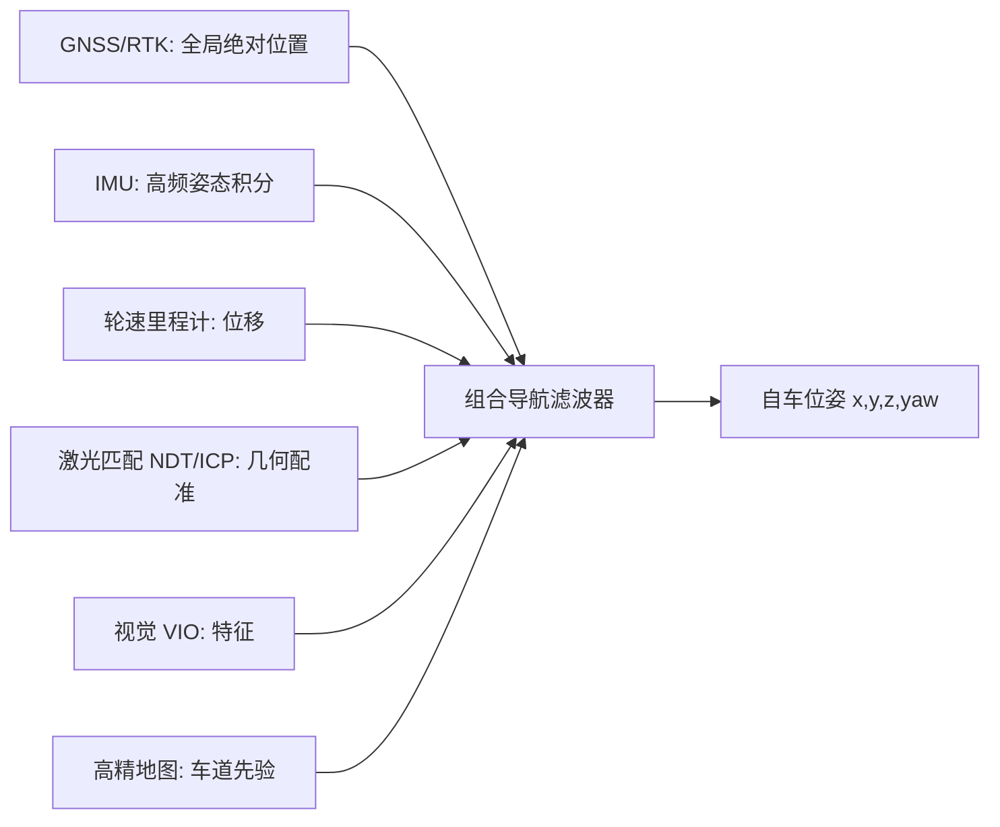

# 三、定位与高精地图：车知道"我在哪"

## 引言：城市峡谷里，GNSS 变成了"瞎子"

早高峰的 CBD 路口，两侧是玻璃幕墙写字楼，老周的车正要右转进地库。这里是典型的"城市峡谷（urban canyon）"——高楼把卫星信号反射得七零八落，多径（multipath）效应让 GNSS 解算的位置在人行道上"漂移"，误差动辄十几米。如果纯靠 GNSS，车会以为自己还在主路上，右转逻辑直接失灵，可能一把冲上人行道。

但那天的车端有一张高精地图（HD Map, High-Definition Map）和一套预积分（preintegration）IMU 紧耦合定位。进峡谷前，激光与视觉已经把自车"钉"在地图的某条车道线上；GNSS 失准的这几秒，IMU 以 200Hz 高频积分姿态，配合轮速给出的位移，配合地图匹配（map matching）把点云/图像特征压回车道中心线。出峡谷时 GNSS 恢复，残差门控确认它又"靠谱"了，平滑接管。全程定位误差稳定在厘米级，方向盘没抖一下。

这个场景点出定位的本质：没有哪种传感器能独立给出全天候厘米级位姿，必须靠 GNSS、IMU、轮速、激光、视觉与地图"组团"。本章把它们逐一拆开，并讲清车端 SLAM 与高精地图如何形成闭环。

## 核心概念：定位方法的"全家福"

### GNSS 与 RTK

全球导航卫星系统（GNSS, Global Navigation Satellite System）包括 GPS、北斗、GLONASS、伽利略。单点定位靠伪距，误差米级。RTK（Real-Time Kinematic，实时动态差分）利用基准站与流动站的载波相位差分，把误差压到厘米级。RTK 解算状态分三档：

- 固定解（FIXED）：整周模糊度（integer ambiguity）已解算，最准（厘米级）。
- 浮点解（FLOAT）：模糊度未固定，误差分米到米级。
- 单点/失锁：仅伪距，误差大。

### IMU 与惯性积分

惯性测量单元输出角速度与加速度。对姿态做积分可得位姿，但零偏（bias）会随时间二次方累积误差——纯 IMU 一分钟能漂出几十米。所以 IMU 必须被其他传感器"喂"观测。

### 轮速里程计、激光匹配、视觉 VIO

轮速里程计（wheel odometry）从轮脉冲算位移，便宜但受打滑影响；激光匹配（如 NDT、ICP）把当前点云配准到地图，几何精确；视觉惯性里程计（VIO, Visual-Inertial Odometry）融合图像特征与 IMU，低成本但有尺度/光照约束。



## 机制深拆：组合导航与误差状态 ESKF

### 松耦合 vs 紧耦合

- 松耦合（loose coupling）：GNSS 先解算出位置，再作为观测进滤波器；优点简单，缺点丢掉了原始卫星信息，弱信号下退化严重。
- 紧耦合（tight coupling）：把卫星原始伪距/多普勒直接作为观测与 IMU 一起滤波；GNSS 仅剩一两颗星也能靠先验维持，鲁棒性强，是高端方案主流。

### 误差状态卡尔曼滤波（ESKF）

直接对姿态（旋转矩阵/四元数）做滤波会遇到约束（单位四元数、流形）。误差状态（ESKF, Error-State Kalman Filter）的巧思是：维护一个"名义状态"（由 IMU 积分得到，不含噪声）和一个"误差状态"（小量，在普通欧氏空间里用标准 KF 估计）。最终位姿 = 名义状态 ⊕ 误差状态修正。

预测用 IMU 动力学传播误差协方差；更新用地图匹配/激光/视觉的残差去估计那个小误差，再把它"加"回名义状态并清零。这样做数值稳定、无约束违反，是机器人/自动驾驶定位的事实标准。

名义状态积分（IMU 驱动）：

$$
\dot{p} = v, \quad \dot{v} = R(a_m - b_a - n_a) + g, \quad \dot{R} = R[\omega_m - b_\omega - n_\omega]_\times
$$

误差状态预测协方差传播（线性化后）：

$$
P_{k|k-1} = F\, P_{k-1|k-1}\, F^T + Q
$$

其中 $F$ 是误差动力学雅可比，$Q$ 由 IMU 噪声与零偏随机游走构成。更新时构造观测残差 $y = z - h(\hat{x})$，用常规卡尔曼增益把误差估计出来，再修正名义状态：

$$
x_{nominal} \leftarrow x_{nominal} \oplus (-\delta \hat{x}), \quad \delta \hat{x} \leftarrow 0, \quad P \leftarrow (I-KH)P
$$

### 车端 SLAM 与回环

同步定位与建图（SLAM, Simultaneous Localization And Mapping）在未知环境同时估位姿与构图。激光 SLAM（如 LOAM/LeGO-LOAM）靠几何特征；视觉 SLAM（如 ORB-SLAM）靠特征点。回环检测（loop closure）发现"我又回到老地方"，用位姿图优化（pose graph optimization）消除长期漂移——这对没有全局 GNSS 的隧道/地库至关重要。

### 高精地图：OpenDRIVE 与车道级语义

高精地图不只是"导航地图放大版"，它包含车道级几何（曲率、坡度、航向）、语义（红绿灯、停止线、路沿）与拓扑（junction 路口连接关系）。OpenDRIVE 是主流交换格式，用 `<road>` 描述道路，用 `<lane>` 描述车道（含 `<link>` 连接、`width` 宽度、`speed` 限速），用 `<junction>` 描述无信号交叉。地图与定位形成闭环：地图给定位提供先验（把自车约束到车道），定位给地图做众包更新（众包，crowdsourcing 发现车道线偏移）。

## 工程实践：误差状态 EKF 伪代码结构

下面给出一个极简 ESKF 骨架：预测用 IMU，更新用地图匹配得到的横向偏移（如激光/视觉把自车压回车道中心）。

```python
import numpy as np

class ESKF:
    def __init__(self, dt=0.005):
        self.dt = dt
        self.p = np.zeros(3)        # 名义位置
        self.v = np.zeros(3)        # 名义速度
        self.R = np.eye(3)          # 名义姿态（旋转矩阵）
        self.dx = np.zeros(15)      # 误差状态 [dp,dv,dtheta,dba,dbw]
        self.P = np.eye(15) * 0.1   # 误差协方差
        self.g = np.array([0,0,-9.81])

    def predict_imu(self, a, w, ba, bw, Q):
        # 名义状态积分（略去四元数/旋转矩阵更新细节）
        self.v += (self.R @ (a - ba) + self.g) * self.dt
        self.p += self.v * self.dt
        # 误差状态雅可比 F 与噪声 Q 传播协方差
        # F 由 IMU 动力学线性化得到，此处占位
        self.P = self.F @ self.P @ self.F.T + Q

    def update_map(self, z, H, R):
        # z: 地图匹配观测（如横向偏移），H: 观测矩阵
        S = H @ self.P @ H.T + R
        K = self.P @ H.T @ np.linalg.inv(S)
        self.dx = K @ (z - H @ self.dx)
        self.P = (np.eye(15) - K @ H) @ self.P
        # 把误差加回名义状态，然后清零误差
        self.p += self.dx[0:3]
        self.v += self.dx[3:6]
        self.dx = np.zeros(15)

# 车规落地坑：IMU 零偏需在线标定；地图匹配在修路/改道时失效要 detect；
# 矩阵求逆定点化；多线程下 IMU 与地图观测时间戳要严格对齐。
```

车规/实时落地坑：IMU 零偏随温度漂移，需在线估计（bias estimation）；地图版本不一致会让匹配残差突增，必须做失效检测（consistency check）；城市峡谷多径使 GNSS 卡方检验频繁拒收，需平滑回退到纯里程计；高精地图的众包更新要确保一致性与安全审核。

## 常见坑（12 条）

1. 坐标系混淆：ENU（东-北-天）与车体前-左-上天定义不一致，导致定位整体偏转。
2. IMU 零偏未标定：bias 让速度/位置二次漂移，几十秒就偏几米。
3. 时间对齐缺失：地图匹配比 IMU 慢 100ms，用错时间戳补偿会放大误差。
4. RTK 浮点解当固定解用：未判断解状态，分米误差被当作厘米。
5. 多径未处理：城市峡谷 GNSS 残差突增却不拒收，把轨迹带飞。
6. 初始位姿错误：冷启动给错初始经纬度，滤波器要很久才能收敛。
7. 地图过期：修路改道后地图与实际不符，匹配把车"拽"向错误车道。
8. 四元数未归一化：姿态积分后四元数漂移，需周期性归一。
9. 回环误匹配：相似场景误判回环，位姿图优化反而引入大误差。
10. 尺度漂移（单目 VIO）：无尺度观测时轨迹整体伸缩，需轮速/GNSS 约束。
11. 协方差膨胀失控：长时间无观测时 P 过大，短暂观测就被过度信任。
12. 多线程竞争：IMU 回调与地图线程共享状态未加锁/无锁队列，出现竞态。

## 面试要点（12 题）

1. RTK 固定解和浮点解区别？答：固定解模糊度已整周固定，厘米级；浮点解未固定，分米级。
2. 为什么纯 IMU 会漂移？答：加速度二次积分，bias 与噪声随时间累积。
3. 松耦合 vs 紧耦合？答：松耦合用 GNSS 解算结果，紧耦合用原始伪距，后者弱信号更鲁棒。
4. 什么是 ESKF？答：用名义状态+误差状态分离，规避姿态流形约束，数值稳定。
5. 为什么用误差状态而不直接滤波姿态？答：姿态在流形上，直接滤波易违反约束且数值差。
6. 高精地图在定位中的作用？答：提供车道先验，把自车约束到正确车道，消除漂移。
7. 回环检测做什么？答：识别重访地点，用图优化消除长期累积漂移。
8. OpenDRIVE 用什么描述车道？答：`<road>`/`<lane>`/`<junction>` 描述道路、车道与路口拓扑。
9. 城市峡谷怎么办？答：GNSS 降权，靠 IMU+轮速+地图匹配维持。
10. VIO 的尺度问题？答：单目无绝对尺度，需轮速/双目/地图提供。
11. 地图众包更新风险？答：错误标注会污染定位，需一致性与安全审核。
12. NDT 与 ICP 区别？答：ICP 点对面最小二乘，NDT 用高斯分布建模，更鲁棒快速。

## 结语：一页纸回顾与延伸

回顾：定位是"组团作战"——GNSS 给全局、IMU 给高频、轮速给便宜位移、激光/视觉给几何与语义、地图给先验。ESKF 用"名义+误差"把姿态流形难题化解；紧耦合在弱信号下更稳。地图与定位是闭环：地图约束定位，定位更新地图。记住城市峡谷那一幕：单一传感器失效是常态，冗余与门控才是安全底座。

延伸阅读方向：Solà《Quaternion Kinematics for Error-State KF》是 ESKF 圣经；《Probability, Random Variables and Stochastic Processes》补噪声建模；LOAM/LeGO-LOAM 与 ORB-SLAM3 代码精读；OpenDRIVE 官方规范；众包地图与 Lanelet2 格式；ISO 21448 关于定位失效的可接受风险分析。

本章约 3300 字。
