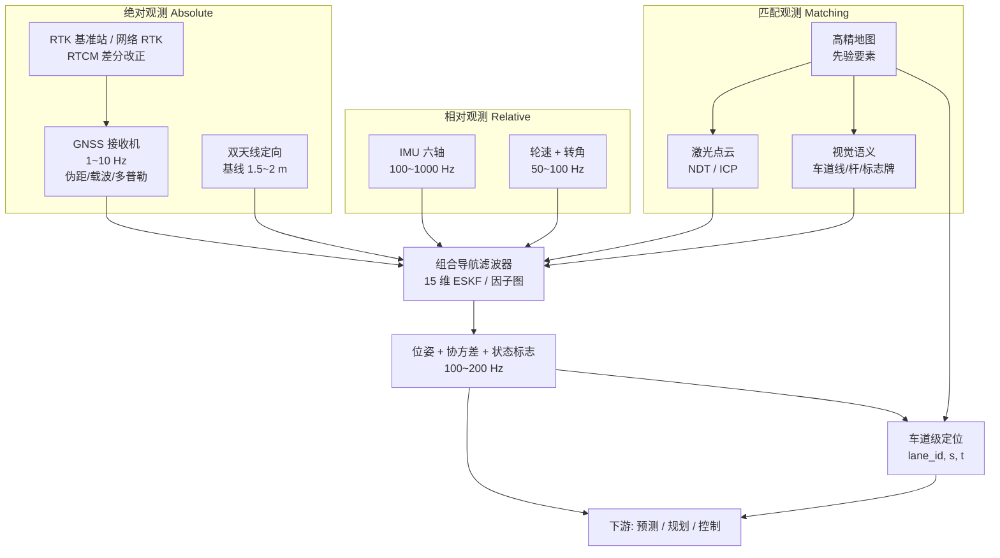
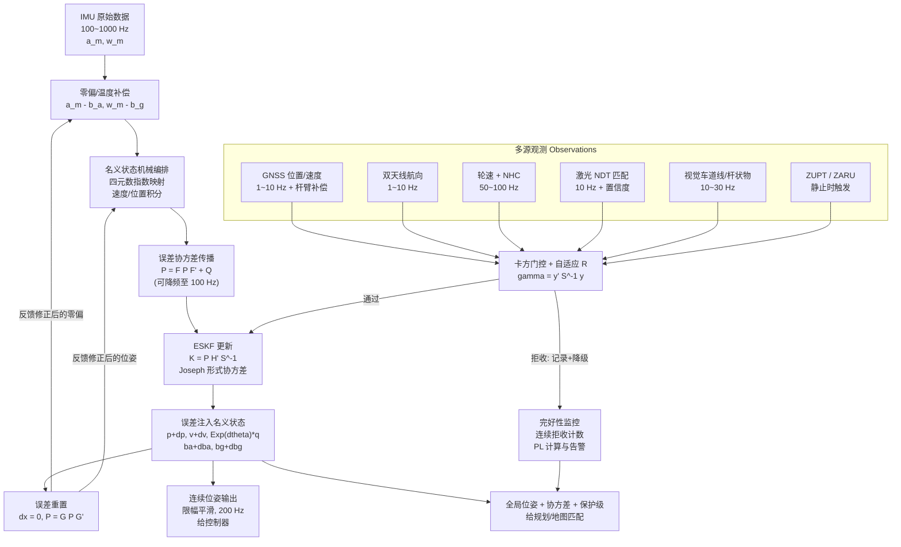
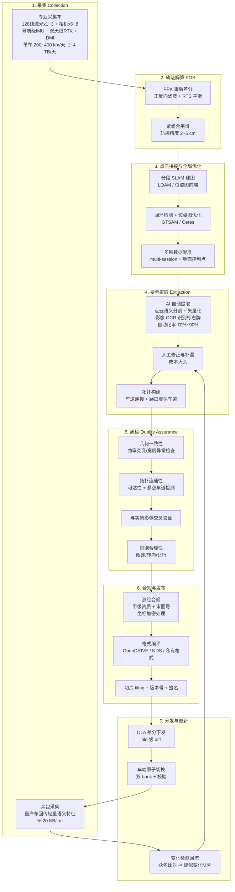

# 三、定位与高精地图：车知道"我在哪"

## 0. 引言：城市峡谷里，GNSS 变成了"瞎子"

早高峰七点五十，CBD 主干道，双向八车道。左侧是一整排 200 米高的玻璃幕墙写字楼，右侧是在建工地的绿色围挡和一台正在回转的塔吊。老周的测试车在最内侧车道上以 32 km/h 缓慢挪动，准备在前方 180 米处右转三次并道，然后钻进那栋楼的地库入口。

副驾屏幕上开着一个调试面板，左边一列是卫星状态。进入这条街之前，可见星 27 颗、参与解算 21 颗、RTK 状态 `FIXED`、水平估计精度 0.018 m。车头刚驶过第一栋楼的转角，数字开始塌方：可见星掉到 11 颗，参与解算 6 颗，状态从 `FIXED` 跳到 `FLOAT`，再跳到 `SINGLE`。HDOP 从 0.9 一路窜到 16.6。屏幕上那个代表"卫星定位点"的绿色圆点，先是慢慢往右挪，越过实线、越过人行道沿石，最后稳稳地停在了写字楼大堂的旋转门里——离车的真实位置 23 米。

这不是信号变弱了。信号很强，甚至更强——只不过来的路不对。老周后来把那段原始观测拉出来分析：有三颗卫星的直射路径被楼体完全挡死，接收机收到的是从对面玻璃幕墙反射过来的信号，也就是 **NLOS（Non-Line-Of-Sight，非视距）** 观测。反射意味着走了更长的路，伪距被系统性地拉长，而且**永远只朝一个方向错**——全部偏正。这一点特别恶毒：如果误差有正有负，最小二乘残差会变大，RAIM 能把坏星揪出来；可当四五颗星一起朝同一方向说谎时，残差看起来非常"干净"，解算器会自信地给你一个精度报告 0.4 米、实际错了 23 米的位置。**说谎且自洽，比不说话危险得多。**

还有两颗星更微妙：直射信号能收到，但同时混进了从工地铁皮围挡反射回来的副本，两路信号在相关器里叠加，把相关峰拽偏了。C/A 码一个码片长 293 米，多径把峰值拉偏 0.05 个码片，就是 15 米的伪距误差。

如果车信了它，右转逻辑会认为自己已经在人行道上，转向请求直接取消，或者更糟——按"我在辅路"的假设生成一条冲上路沿的轨迹。

但那天车没有信它。屏幕右边一列同时在跑：IMU 200 Hz 在积分，两个非驱动轮的轮速在给纵向位移，128 线激光雷达在把当前扫描的路灯杆、路沿和地面反射率纹理往先验点云地图上贴，前视相机在把识别到的车道线和地图里的车道边界做匹配。组合导航滤波器对 GNSS 那几帧做了卡方检验，残差 $\gamma$ 值飙到 400 以上（3 自由度 99% 门限是 11.34），连续 148 帧被判为"不可信"直接拒收。整整 47 秒，全局绝对观测等于不存在，滤波器纯靠 IMU + 轮速 + 激光地图匹配活着。出峡谷时 GNSS 恢复 `FIXED`，残差降到 0.03 m 量级，门控放行，位置被平滑地拉回去，横向修正量只有 6 厘米。方向盘全程没有抖过一下。

这一幕点出了定位问题的全部本质：

1. **没有任何单一传感器能全天候给出厘米级位姿。** GNSS 有绝对基准但会被遮挡和欺骗；IMU 永不失效但会发散；轮速便宜但会打滑；激光/视觉几何精确但需要一张事先存在的地图，而且会在长隧道里退化。
2. **定位的难点不在"精度"，在"知道自己什么时候不准"。** 一个 95% 时间 3 cm、5% 时间 20 m 且不自知的系统，远不如一个恒定 30 cm 但协方差诚实的系统。
3. **地图不是导航地图放大版，它是"超视距的先验"。** 传感器看 200 米，地图看 2 公里。但先验一旦过期，它就从最大的帮手变成最大的风险源。

这一章把 GNSS、IMU、轮速、组合导航滤波、激光/视觉匹配、高精地图从物理层拆到算法层，再拆到量产工程和产业路线。

---

## 1. 核心概念

### 1.1 定位模块的输出契约

和感知一样，先明确定位（localization）模块交给下游的到底是什么。它不是"一个经纬度"，而是这样一组东西：

| 输出项 | 英文 | 含义 | 典型要求 |
|---|---|---|---|
| 位置 | position | 地图坐标系下 $(x, y, z)$ | 横向 1σ < 0.1 m |
| 姿态 | attitude / orientation | 四元数或欧拉角 (roll, pitch, yaw) | yaw 1σ < 0.1° |
| 速度 | velocity | 世界系或车体系三轴速度 | < 0.05 m/s |
| 角速度 / 加速度 | angular rate / acceleration | 已补偿零偏的干净惯性量 | 供控制器前馈 |
| **协方差** | covariance | 15×15 或至少 6×6 位姿协方差 | 必须"诚实" |
| **状态标志** | status flag | RTK 固定/浮点/单点、匹配置信度、退化方向 | 供降级决策 |
| **保护级** | protection level | 给定完好性风险下的误差上界 | L3 以上必需 |
| 时间戳 | timestamp | 与感知/规控同一时钟域 | 微秒级对齐 |
| 车道定位结果 | lane-level localization | 自车在地图哪条车道、沿车道的 s 值、横向偏移 t | 车道 ID 错误率 < $10^{-6}$ |

后四行才是把 demo 和量产分开的东西。一个能跑 90 分的定位算法很容易写，一个**在自己不行的时候会举手**的定位模块极难。

### 1.2 精度需求分级：不是越准越好，是"够用且知道边界"

| 等级 | 横向精度 (95%) | 纵向精度 (95%) | 航向 | 支撑的功能 | 主流技术组合 |
|---|---|---|---|---|---|
| **道路级** road-level | 5 ~ 10 m | 10 ~ 50 m | 5° | 语音导航、路径规划、ETA、限速提示 | 单点 GNSS + SD 地图路网匹配 |
| **车道级** lane-level | 0.5 ~ 1.5 m | 2 ~ 5 m | 2° | 车道级导航、变道建议、ADASIS 电子地平线、匝道预告 | GNSS + 航迹推算 + 轻地图 |
| **车道内** in-lane | 0.2 ~ 0.3 m | 1 ~ 2 m | 0.5° | LKA / LCC 车道居中、自动变道 ALC、高速 NOA | 视觉车道线**相对定位** + 组合导航 |
| **厘米级** centimeter | 0.03 ~ 0.10 m | 0.05 ~ 0.30 m | 0.1° | 高速 L3 脱手脱眼、无保护左转、窄路会车、AVP 自主代客泊车 | RTK + 战术级 IMU + 激光/视觉地图匹配 |
| **相对亚厘米** | 0.01 ~ 0.03 m | — | 0.05° | 编队行驶、自动充电对接、精准靠站 | RTK + 视觉伺服 / 纯局部相对定位 |

这张表里藏着四个非常反直觉、但极其重要的结论。

**结论一：横向要求比纵向严一个数量级。** 标准城市车道宽 3.5 m（高速 3.75 m），乘用车宽约 1.9 m（含后视镜 2.1 m），左右余量各约 0.8 m。要保证不压线，横向误差 $3\sigma < 0.3$ m，即 $\sigma < 0.1$ m。而纵向偏 1 m，绝大多数时候什么都不影响。

**结论二：纵向要求会在若干"点位"上突然变严。** 停止线前停车 ±0.5 m；匝道分流点若纵向差 5 m 可能错过出口（120 km/h 下 5 m 只有 0.15 s）；AVP 停车位对齐 ±0.10 m；闸机/充电桩对接 ±0.03 m。所以纵向精度指标不能只给一个全局数，要按场景分。

**结论三：L2 车道居中根本不需要 RTK。** LKA 需要的是"我相对当前车道中心线横向偏了多少"——这是一个**相对量**，前视相机直接就能给，精度 5 cm，成本几百块，还完全不依赖卫星。这就是为什么全球几千万辆装了 LCC 的车里，装 RTK 的连 1% 都不到。**绝对定位的价值只在需要"超视距先验"和"跨传感器一致语义"的时候才体现出来。**

**结论四：可用性（availability）与完好性（integrity）比精度更难。** 航空领域已经用了三十年的一套概念正在被搬进车载：

- **告警限 AL（Alert Limit）**：本功能所能容忍的最大定位误差，例如车道内保持 AL = 0.5 m。
- **保护级 PL（Protection Level）**：定位系统基于当前观测质量实时算出的误差上界，满足 $P(\text{真实误差} > PL) < \text{完好性风险}$。
- **完好性风险 IR（Integrity Risk）**：可接受的"误差超 PL 且未告警"的概率，车载常取 $10^{-7}$/h 量级。
- 当 $PL > AL$ 时，系统必须在几百毫秒内告警并降级——这叫**不可用（unavailable）**，是安全的；如果 $PL$ 算小了、真实误差却超了 $AL$，那叫**误导信息（HMI, Hazardously Misleading Information）**，是要出人命的。

引言里那 23 米的偏差之所以危险，不是因为它大，而是因为那一刻接收机报的 PL 只有 0.4 m。

### 1.3 三条定位路径：绝对 / 相对 / 语义

| 路径 | 观测的是什么 | 误差特性 | 代表技术 | 失效模式 |
|---|---|---|---|---|
| **绝对定位** absolute | 与地球固连基准的关系 | 误差**不随时间累积**，但可能突然跳变 | GNSS 单点 / DGPS / RTK / PPP | 遮挡、多径、NLOS、干扰、欺骗 |
| **相对定位 / 航迹推算** relative / DR | 相对上一时刻的位姿增量 | 误差**随时间/里程单调累积**，但连续光滑 | IMU 机械编排、轮速里程计、激光/视觉里程计 | 发散；打滑；退化 |
| **语义/匹配定位** map matching | 与地图中已知要素的关系 | 误差**不累积**，取决于地图精度与匹配质量 | NDT/ICP 点云匹配、反射率栅格匹配、车道线/杆状物语义匹配 | 地图过期、场景退化、要素被遮挡 |

**任何量产定位方案都是这三条路径的加权融合。** 绝对定位提供"锚"，相对定位提供"连续性和高频率"，匹配定位提供"厘米级且与地图自洽"。三者的失效模式几乎完全不相关——这正是融合有效的根本原因，和第一章讲的三种传感器互补是同一个逻辑。

### 1.4 坐标系全家桶

这是定位工程里出 bug 最多的地方，没有之一。

| 坐标系 | 类型 | 定义要点 | 主要用途 |
|---|---|---|---|
| **WGS84** | 地心大地坐标 | GPS 基准椭球，$a = 6378137$ m，$1/f = 298.257223563$ | GNSS 原始输出 |
| **CGCS2000** | 地心大地坐标 | 中国 2000 国家大地坐标系，$1/f = 298.257222101$，2000.0 历元 | 中国法定测绘基准 |
| **ITRF** | 地心地固参考框架 | 国际地球参考框架，带历元（ITRF2014/2020） | 精密定位、基准站坐标 |
| **GCJ-02** | 加密坐标 | 对 WGS84 做非线性偏移 50~500 m（"火星坐标"） | 中国境内公开地图 |
| **BD-09** | 加密坐标 | 在 GCJ-02 上再叠一层偏移 | 百度地图 |
| **ECEF** | 地心地固直角 | $X$ 指向本初子午线与赤道交点，$Z$ 指北极 | GNSS 解算内部 |
| **UTM** | 投影平面 | 横轴墨卡托，6° 分带，中央经线尺度 0.9996，东偏 500000 m | 建图与局部 metric 计算 |
| **高斯-克吕格** | 投影平面 | 中国常用，3° 或 6° 分带，中央经线尺度 1.0，带号作前缀 | 国内测绘成果 |
| **ENU** | 局部切平面 | 以某点为原点，$x$ 东 $y$ 北 $z$ 天，右手系 | 组合导航滤波状态空间 |
| **NED** | 局部切平面 | $x$ 北 $y$ 东 $z$ 地，右手系 | 航空/传统惯导教材 |
| **车体系** base_link | 载体固连 | ROS REP-103：$x$ 前、$y$ 左、$z$ 上，原点常取后轴中心地面投影 | 感知/规划/控制 |
| **相机光学系** | 载体固连 | $z$ 前、$x$ 右、$y$ 下 | 视觉几何 |
| **地图系** map | 局部 metric | 图商定义的工程坐标（UTM 或自定义局部原点） | 匹配定位与规划 |

**七个高频转换错误，每一个我都见过真实事故单：**

1. **经纬度顺序颠倒。** GeoJSON / WKT / PostGIS 的标准顺序是 `(lon, lat)`；NMEA、多数导航 API、以及人类口头习惯是 `(lat, lon)`。在北京 `(39.9, 116.4)` 搞反成 `(116.4, 39.9)`，会得到南印度洋上的一个点——**而且整条链路不会报任何错**，因为两个数都在合法范围内。

2. **大地高 vs 海拔高。** GNSS 直接给的是**大地高 $h$**（ellipsoidal height，相对椭球面）；地图、路牌、人类习惯用的是**正高/海拔 $H$**（orthometric height，相对大地水准面 geoid）。二者相差**大地水准面差距 $N$**（geoid undulation）：

   $$H = h - N$$

   中国境内 $N$ 从东部沿海的约 $-10$ m 变化到西部高原的约 $-40$ m，个别区域绝对值超过 50 m。混用会直接带来几十米高程误差——在**判断自车在高架桥上层还是下层**时，这是决定性的。NMEA `$GPGGA` 语句第 9 个字段是海拔高、第 11 个字段是 geoid separation，只取第 9 个当大地高用是极常见的实现 bug。

3. **UTM 跨带跳变。** 中国横跨 UTM 49~53 带。车从 114°E 开到 120°E 会跨带，东坐标瞬间跳几十万米，滤波器直接飞掉。对策：整个作业域固定一个投影带（超出带边界带来的尺度误差在几十公里内可接受），或者用自定义中央经线的横轴墨卡托。

4. **投影尺度因子被误当成轮径误差。** UTM 中央经线尺度 0.9996，意味着地面上真实的 1000 m 在 UTM 平面上只有 999.6 m——**0.04% 的系统性缩短，1 km 就是 40 cm**。做轮速标定时如果参考真值是 UTM 平面距离，就会把这 0.04% 错误地补进轮径系数里，换个投影带后误差又变了。高斯-克吕格 3° 带尺度为 1.0，无此问题。

5. **历元与板块运动。** 欧亚板块相对 ITRF 的运动约 **3~4 cm/年**，中国大陆内部还有区域性形变。CGCS2000 冻结在 2000.0 历元，到 2026 年已累积 **80 cm 以上**。做厘米级绝对定位时，RTK 基准站坐标、高精地图基准、车端解算必须**同历元**，否则会出现"每一环都是厘米级、拼起来差一米"的荒诞结果。

6. **加密坐标混进定位链路。** GCJ-02 的偏移是非线性的、逐点不同的，而且官方算法不公开。任何把 GCJ-02 坐标喂进滤波器或用来做地图匹配的行为，等价于往系统里注入一个 50~500 m 的未知偏差场。合规发布用 GCJ-02，**内部解算必须全程 CGCS2000/局部 metric**，转换只在最后展示层做。

7. **变换符号约定不统一。** $T_A^B$ 到底表示"把 $A$ 系下的点变到 $B$ 系"还是"$A$ 在 $B$ 中的位姿"？在标定杆臂时如果符号反了，得到的不是 0 误差而是 **2 倍杆臂**的误差。团队必须在第一天就把约定写进代码规范，并在每个变换的变量名里体现（如 `T_base_cam` 明确表示 cam→base）。

### 1.5 定位系统全景



注意 `M1 → L1 / V1` 这两条边：**匹配定位是"观测"与"地图"共同产生的**，地图不是滤波器的一路独立输入，而是把原始点云/图像转化为位姿观测的必要条件。地图错了，产生的不是"没有观测"，而是"一个错误但看起来置信度很高的观测"——这个区别决定了整个失效检测的设计。

---

## 2. GNSS 深拆：从伪距方程到厘米级 RTK

### 2.1 伪距定位方程

接收机测的不是距离，是**信号传播时间**——而且用的是自己那块几十块钱的晶振记的时。设第 $i$ 颗卫星位置 $p_s^{(i)}$（ECEF，由星历算得），接收机位置 $p_r$，接收机钟差 $\delta t_r$，卫星钟差 $\delta t^{(i)}$，则观测到的**伪距（pseudorange）**为

$$\rho^{(i)} = \|p_s^{(i)} - p_r\| + c\,(\delta t_r - \delta t^{(i)}) + I^{(i)} + T^{(i)} + \varepsilon^{(i)}$$

其中 $I$ 是电离层延迟，$T$ 是对流层延迟，$\varepsilon$ 包含多径与接收机噪声。"伪"字就来自那个 $c\,\delta t_r$：接收机钟差 1 微秒对应 **300 米**的距离偏差，所以钟差绝不能忽略，只能当成未知数一起解。

卫星钟差 $\delta t^{(i)}$ 可以用广播星历里的二次多项式系数 $(a_{f0}, a_{f1}, a_{f2})$ 改正到亚米级，再加上相对论周期项改正：

$$\delta t^{(i)} = a_{f0} + a_{f1}(t - t_{oc}) + a_{f2}(t-t_{oc})^2 - \frac{2\sqrt{\mu}}{c^2}e\sqrt{A}\sin E_k$$

最后那一项是**相对论改正**（轨道偏心率引起的周期性引力红移差），量级约 ±10 ns ≈ ±3 m，必须加。此外还有**萨格纳克效应（Sagnac effect）**：信号飞行的 67 ms 里地球转了一点点，改正量在中纬度可达 30 m 量级。

改正完这些，剩下四个未知数：$p_r = (x, y, z)$ 和 $c\,\delta t_r$。**四个未知数，所以至少需要四颗卫星**——这就是"四星定位"的由来。注意如果接收机装了原子钟、钟差已知，三颗星就够了；如果同时用多个星座，每个星座还要多加一个**系统间时差（ISB, Inter-System Bias）**未知数，四星座就是 7 个未知数、需要至少 7 颗星。

### 2.2 线性化、最小二乘与 GDOP

方程对 $p_r$ 是非线性的（有个模长），标准做法是在近似位置 $p_0$（可以是上一历元的解，冷启动时用地心或粗略位置）处泰勒展开。定义**从接收机指向卫星的单位视线矢量（LOS, Line Of Sight）**：

$$e^{(i)} = \frac{p_s^{(i)} - p_0}{\|p_s^{(i)} - p_0\|}$$

由于 $\dfrac{\partial \|p_s - p_r\|}{\partial p_r} = -e^{(i)\top}$，线性化后：

$$\Delta\rho^{(i)} = \rho^{(i)} - \rho_0^{(i)} = -e^{(i)\top}\Delta p + c\,\Delta\delta t_r + \varepsilon^{(i)}$$

写成矩阵形式，$n$ 颗卫星：

$$\Delta\boldsymbol{\rho} = G\,\Delta x, \qquad
G = \begin{bmatrix} -e^{(1)\top} & 1 \\ -e^{(2)\top} & 1 \\ \vdots & \vdots \\ -e^{(n)\top} & 1\end{bmatrix} \in \mathbb{R}^{n\times4},
\qquad \Delta x = \begin{bmatrix}\Delta p \\ c\,\Delta\delta t_r\end{bmatrix}$$

$G$ 叫**几何矩阵（geometry matrix）**。最小二乘解：

$$\widehat{\Delta x} = (G^\top G)^{-1}G^\top \Delta\boldsymbol{\rho}$$

迭代 3~5 次即收敛到毫米级（对线性化残差而言）。

**误差传播与 DOP 的推导。** 假设各卫星伪距误差独立同分布，方差 $\sigma_{\text{UERE}}^2$（UERE, User Equivalent Range Error，用户等效距离误差），则

$$\mathrm{Cov}(\widehat{\Delta x}) = \sigma_{\text{UERE}}^2\,(G^\top G)^{-1} \triangleq \sigma_{\text{UERE}}^2\, Q$$

把 $Q$ 转到 ENU 局部系（$G$ 用 ENU 的视线矢量构造即可直接得到），记对角元为 $q_{EE}, q_{NN}, q_{UU}, q_{tt}$，定义**精度衰减因子（DOP, Dilution Of Precision）**：

$$\text{GDOP} = \sqrt{q_{EE}+q_{NN}+q_{UU}+q_{tt}},\quad
\text{PDOP} = \sqrt{q_{EE}+q_{NN}+q_{UU}}$$
$$\text{HDOP} = \sqrt{q_{EE}+q_{NN}},\quad
\text{VDOP} = \sqrt{q_{UU}},\quad
\text{TDOP} = \sqrt{q_{tt}}$$

于是有那条最实用的经验公式：

$$\boxed{\sigma_{\text{水平}} = \text{HDOP}\times\sigma_{\text{UERE}}}$$

**DOP 的几何直观**：$\text{GDOP}$ 反比于 $n$ 个单位视线矢量端点在单位球面上张成的多面体体积。卫星散得开（一颗天顶、其余均匀分布在各方位低仰角），体积大，DOP 小；卫星挤在天空同一小片区域，多面体扁塌，DOP 爆炸。

**用真实几何算一遍**（实际计算结果）：

| 场景 | 卫星配置 | GDOP | PDOP | HDOP | VDOP | TDOP |
|---|---|---|---|---|---|---|
| 开阔天空 | 8 颗，方位均匀、仰角 15°~80° | **2.29** | 1.96 | **1.11** | 1.61 | 1.20 |
| 城市峡谷 | 仅剩天顶窄条带内 4 颗（方位 350°~15°） | **39.26** | 28.61 | **16.61** | 23.30 | 26.89 |
| 峡谷 + 补 2 颗低仰角 | 上面 4 颗 + 南向 2 颗低仰角 | **6.07** | 5.69 | **4.84** | 2.99 | 2.13 |

取 $\sigma_{\text{UERE}} = 4$ m：开阔天空水平误差 $\approx 4.4$ m，城市峡谷 $\approx 66$ m。**而且这还没算多径和 NLOS——真实峡谷里的误差是 DOP 恶化和观测量本身变坏的乘积。** 第三行也说明了多星座的价值：仅仅多了两颗低仰角卫星，HDOP 就从 16.6 降到 4.8，改善 3.5 倍。这就是为什么"能看到南边一条缝"和"完全被围死"是两个世界。

工程门限：HDOP > 5 时定位结果基本不可用于任何自动驾驶功能；HDOP > 2.5 建议大幅降权。

### 2.3 误差源分解：每一米都来自哪里

| 误差源 | 物理机理 | 未改正量级 (1σ) | 广播模型改正后 | 短基线差分后 |
|---|---|---|---|---|
| 卫星星历误差 | 广播轨道与真实轨道之差 | 1 ~ 3 m（径向约 1 m） | 0.8 ~ 2 m | **< 0.01 m** |
| 卫星钟差 | 星载原子钟与系统时之差 | 数微秒（数百米） | 0.3 ~ 1.9 m | **< 0.01 m** |
| 电离层延迟 | 50~1000 km 自由电子色散，正比 $\text{TEC}/f^2$ | 天顶 2 ~ 10 m，仰角 5° 可达 30 m；太阳活动峰年更大 | Klobuchar 改正约 50%~60%，残余 1 ~ 5 m | **1 ~ 2 ppm × 基线**（10 km → 1~2 cm） |
| 对流层延迟 | 中性大气折射，与温压湿有关 | 天顶干分量 2.3 m + 湿分量 0.1~0.4 m；仰角 5° 放大约 10 倍 → 20~25 m | Saastamoinen + GMF 映射，残余 0.1 ~ 0.3 m | **0.1 ~ 0.5 ppm × 基线** |
| **多径 (multipath)** | 反射信号与直射信号叠加，相关峰畸变 | 伪距：开阔 0.3~1 m，城市 5~50 m（理论上限 1.5 码片 ≈ 440 m）<br/>载波：< $\lambda/4 \approx 4.8$ cm | 无法建模改正 | **不抵消，反而可能翻倍** |
| **NLOS** | 直射被挡，只收到反射 | 15 ~ 100 m，**恒为正** | 无法改正 | **不抵消** |
| 接收机噪声 | 热噪声 + 量化 | 伪距 0.25~0.5 m（窄相关器 0.1 m）<br/>载波 1~3 mm | — | $\sqrt{2}$ 倍放大 |
| 天线相位中心 | PCO/PCV，随仰角方位变化 | 1 ~ 10 cm | 用天线检定文件改正 | 同型天线可抵消 |
| 相对论 + Sagnac | 引力红移 + 地球自转 | 3 ~ 30 m | 公式改正至 mm 级 | — |

把改正后的各项独立求和（RSS）得到 $\sigma_\text{UERE}$：

$$\sigma_{\text{UERE}} = \sqrt{1.5^2 + 1.0^2 + 3.0^2 + 0.2^2 + 0.6^2 + 0.3^2} \approx 3.6\ \text{m}$$

配上 HDOP 1.2，开阔天空单点定位水平精度 $\approx 4.3$ m（1σ），95% 约 9 m。这和实测数据吻合得很好，也解释了手机导航为什么在立交桥上分不清主路辅路。

**注意表格里最后两行的关键差异：** 差分技术能干掉的是**空间相关误差**（星历、钟差、电离层、对流层）——因为基准站和流动站看到的是同一颗星、穿过几乎相同的大气。差分**完全干不掉**的是**站点局部误差**（多径、NLOS、接收机噪声），而这恰恰是城市峡谷里的主要误差源。**这就是为什么 RTK 在开阔地是神器，在 CBD 是废物。**

### 2.4 差分 GNSS（DGPS）

原理极简单：在一个**坐标已精确测定**的基准站上架一台接收机，它算出"我测到第 $i$ 颗星的伪距"与"按已知坐标该是多少"之差，这个差就是伪距改正数（PRC, Pseudorange Correction）：

$$\text{PRC}^{(i)} = \|p_s^{(i)} - p_{\text{base,true}}\| - \rho_{\text{base}}^{(i)} + c\,\delta t_{\text{base}}$$

播发给流动站，流动站直接加上。等价于做站间单差，把空间相关误差消掉。

- **精度**：水平 0.5 ~ 2 m（基线 < 100 km），随基线增长退化约 **1 m / 150 km**。
- **播发方式**：海事无线电信标（RTCM SC-104）、SBAS（星基增强：美国 WAAS、欧洲 EGNOS、中国 BDSBAS、日本 MSAS）。SBAS 是免费的、通过 GEO 卫星广播，精度约 1~3 m。
- **对自动驾驶而言，DGPS 只够到"车道级"的边缘，不够"车道内"。** 它的真正价值是作为 RTK 失锁时的降级档位。

### 2.5 RTK：载波相位与整周模糊度

要突破米级，必须从**码相位**转向**载波相位**。原因是分辨率：C/A 码一个码片 293 m，即使相关器能分到 1% 码片也才 3 m；而 L1 载波波长 $\lambda_{L1} = c/1575.42\text{ MHz} = 19.03$ cm，锁相环能分到 1% 周即 **1.9 mm**。整整差了三个数量级。

代价是**整周模糊度（integer ambiguity）**。接收机只能测出载波相位的小数部分和从锁定那一刻起累计的整周数，但"锁定瞬间已经过去了多少个整周"是未知的：

$$\Phi = \lambda\varphi = \|p_s - p_r\| + c(\delta t_r - \delta t^s) - I + T + \lambda N + \varepsilon_\varphi$$

注意**电离层项符号是负的**（码延迟、相位超前，这是色散介质的特性，也是双频组合能消电离层的基础）。$N \in \mathbb{Z}$ 就是整周模糊度。

**双差（double difference）消除误差。** 设基准站 $b$、流动站 $r$，卫星 $i$、$j$：

- **站间单差**（同一卫星，两站相减）：消掉卫星钟差 $\delta t^s$，大幅削弱星历、电离层、对流层（空间相关）。
- **再做星间单差**（两颗卫星，同一站相减）：消掉接收机钟差 $\delta t_r$。

$$\nabla\Delta\Phi^{ij}_{rb} = \nabla\Delta\|p_s - p_r\| + \lambda\,\nabla\Delta N^{ij}_{rb} + \nabla\Delta\varepsilon$$

剩下的 $\nabla\Delta N^{ij}_{rb}$ **仍然是整数**（整数的线性组合还是整数）——这是 RTK 全部魔法的支点。

**为什么固定解才有厘米级？** 这是理解 RTK 的关键。

- **浮点解（FLOAT）**：把 $\nabla\Delta N$ 当实数和位置一起最小二乘估计。此时 $N$ 与位置**强相关**（把位置沿视线方向挪 19 cm，等价于 $N$ 变 1，观测方程几乎同样满足），所以协方差矩阵条件数极差，位置精度被 $N$ 的不确定性拖累到**分米甚至米级**。需要长时间（十几分钟）观测让卫星几何变化把两者解耦。
- **固定解（FIXED）**：一旦把 $N$ 正确固定为整数并代回方程，$\lambda N$ 就从"未知数"变成"已知常数"，方程里只剩位置未知，而观测噪声只有毫米级载波噪声。位置精度立刻跳到 **1 cm + 1 ppm**。

$$\underbrace{\sigma_{\text{FLOAT}} \sim 0.2\text{–}1\ \text{m}}_{N\ \text{是自由参数}} \quad\xrightarrow{\ N\ \text{固定为整数}\ }\quad \underbrace{\sigma_{\text{FIXED}} \sim 0.01\text{–}0.02\ \text{m}}_{N\ \text{是已知常数}}$$

**如何固定：LAMBDA 方法。** 直接对浮点解 $\hat N$ 做四舍五入是行不通的——各分量高度相关，取整会跳到错误格点。LAMBDA（Least-squares AMBiguity Decorrelation Adjustment，Teunissen 1993）分两步：

1. **降相关**：找一个么模整数变换矩阵 $Z$（$\det Z = \pm1$，元素为整数，保证 $Z\hat N$ 仍是整数格），使变换后的协方差 $Z Q_{\hat N} Z^\top$ 接近对角、各分量方差接近。这把一个又长又斜的搜索椭球变成近似的球。
2. **整数最小二乘搜索**：在椭球 $(\check N - \hat N)^\top Q_{\hat N}^{-1}(\check N - \hat N) \le \chi^2$ 内枚举整数点，取最小者。降相关后候选点数从天文数字降到几十个。

**固定解校验**：常用 **ratio test**——次优解残差与最优解残差之比 $> 2.0\sim3.0$ 才接受。这个门限是 RTK 工程调参的核心：门限低了容易**错误固定（wrong fix）**，错误固定的后果是给出一个**厘米级置信度、分米到米级偏差**的位置，比浮点解危险得多；门限高了则固定率低、经常掉回浮点。

**关键工程数字：**

| 指标 | 典型值 |
|---|---|
| 固定解水平精度 | 8 mm + 1 ppm × 基线 |
| 固定解垂直精度 | 15 mm + 1 ppm × 基线 |
| 浮点解水平精度 | 0.2 ~ 1.0 m（随收敛时间改善） |
| 首次固定时间 TTFF-fix（多频多星座） | 5 ~ 30 s |
| 首次固定时间（单频单星座） | 数分钟，城市中常常固定不了 |
| 失锁后重新固定（RTK re-fix） | 1 ~ 10 s（有惯导辅助可到 < 1 s） |
| 最大可用基线（单基站） | 10 ~ 30 km（网络 RTK 可到 70 km 站间距） |
| 差分数据率 | RTCM 3.x，1 Hz，约 1~5 kbps |
| 差分延迟容忍 | < 2 s（超过后改正数外推误差增大） |

**网络 RTK（VRS / FKP / MAC）**：单基站方案受基线限制，网络 RTK 用一片 CORS（Continuously Operating Reference Stations）基准站网建立区域大气模型，为流动站生成一个就在身边的**虚拟参考站（VRS, Virtual Reference Station）**。中国的千寻位置、六分科技等运营着数千个基准站，全国覆盖，这是国内量产 RTK 方案的基础设施。**代价是需要一路移动网络回传自身概略位置并接收改正数（NTRIP 协议）**——隧道里网络和卫星一起没，是双重打击。

### 2.6 PPP 与 PPP-RTK

**精密单点定位（PPP, Precise Point Positioning）** 走的是另一条路：不用基准站，而是用全球播发的**精密轨道与钟差产品**（IGS 事后产品轨道 2.5 cm、钟差 20 ps；实时产品轨道 5 cm、钟差 0.1 ns），配合双频**无电离层组合（ionosphere-free combination）**：

$$\rho_{IF} = \frac{f_1^2\rho_1 - f_2^2\rho_2}{f_1^2 - f_2^2}$$

对 GPS L1/L2（$f_1 = 1575.42$, $f_2 = 1227.60$ MHz），系数为 $2.546$ 和 $-1.546$，噪声放大因子 $\sqrt{2.546^2+1.546^2} = 2.98$——**消掉电离层的代价是噪声放大约 3 倍**。对流层湿分量则作为待估参数随位置一起解。

| 维度 | RTK | PPP | PPP-RTK / PPP-AR |
|---|---|---|---|
| 基础设施 | 需要 10~30 km 内的基准站（或 CORS 网） | 只需全球轨道钟差产品 | 全球产品 + 区域大气改正 |
| 播发链路 | 移动网络 NTRIP（上行需回传位置） | 卫星 L-band 或网络，**纯广播** | 卫星或网络广播 |
| 收敛时间 | 5 ~ 30 s | **15 ~ 30 min**（浮点收敛） | 30 s ~ 5 min |
| 稳态精度 | 1 ~ 2 cm | 5 ~ 10 cm（水平） | 3 ~ 6 cm |
| 覆盖 | 受基准站网限制 | 全球（含海洋、沙漠） | 有大气模型的区域 |
| 用户容量 | 双向，受服务器并发限制 | **广播，无限用户** | 广播，无限用户 |
| 中断后恢复 | 快 | 慢（需重新收敛） | 中 |
| 车载适用性 | 主流，成熟 | 收敛慢，单独用不适合 | **正在成为量产主流** |

**为什么车载最终倒向 PPP-RTK**：一是广播模式对上千万辆车的规模化友好（RTK 双向连接的服务器成本与并发是实打实的问题）；二是不需要上行链路，隐私和合规压力小；三是收敛时间已经压到分钟级，配合惯导辅助可接受。北斗三号的 **PPP-B2b** 服务通过 3 颗 GEO 卫星在中国及周边免费广播精密改正，标称水平 0.3 m / 垂直 0.6 m（收敛后），是国内一个重要变量。

### 2.7 多星座：从 8 颗到 30 颗

| 系统 | 归属 | 在轨可用（约） | 轨道高度/倾角 | 主要民用频点 | 特点 |
|---|---|---|---|---|---|
| **GPS** | 美国 | 31 | 20200 km / 55° | L1 C/A, L2C, L5 | 最成熟，全球生态 |
| **北斗 BDS-3** | 中国 | 30（24 MEO + 3 IGSO + 3 GEO） | 21500 km / 55° | B1I, B1C, B2a, B3I | 混合星座，亚太可见星数最多；独有短报文与 PPP-B2b 广播 |
| **GLONASS** | 俄罗斯 | 24 | 19100 km / 64.8° | L1OF, L2OF（FDMA） | 高倾角，高纬度好；FDMA 带来站间偏差处理麻烦 |
| **Galileo** | 欧盟 | 28+ | 23222 km / 56° | E1, E5a, E5b, E6 | 信号质量最好；E6 提供 HAS 高精度免费服务 |
| **QZSS** | 日本 | 5（IGSO+GEO） | — | 与 GPS 兼容 | 日本上空天顶补星 |
| **NavIC** | 印度 | 7 | — | L5, S | 区域 |

**多星座的实际收益**（北京城区实测量级）：

| 配置 | 开阔天空可见星 | 城市峡谷可见星 | 峡谷 HDOP | 峡谷 RTK 固定率 |
|---|---|---|---|---|
| 仅 GPS 单频 | 8 ~ 11 | 3 ~ 6 | 4 ~ 20 | < 10% |
| GPS + BDS 双频 | 18 ~ 24 | 7 ~ 12 | 2 ~ 8 | 30% ~ 55% |
| 四星座三频 | 28 ~ 38 | 12 ~ 20 | 1.5 ~ 5 | 50% ~ 75% |

**北斗的 IGSO 星座在中国境内是实打实的优势**：3 颗 IGSO 卫星长期停留在东经 118° 附近的"8 字"轨迹上、仰角很高，在城市峡谷这种"只能看到头顶一条缝"的场景里，高仰角卫星是唯一还能收到的。同时多频（B1I/B1C/B2a/B3I）让宽巷组合成为可能：

$$\lambda_{WL} = \frac{c}{f_1 - f_2}$$

对 GPS L1/L2，$\lambda_{WL} = 86.2$ cm——波长长了 4.5 倍，模糊度**极易固定**。先固定宽巷、再逐级固定窄巷（TCAR/CAR 级联法），是多频接收机快速固定的标准套路。

### 2.8 GNSS 拒止环境

| 场景 | 物理机理 | 典型误差/时长 | 应对 |
|---|---|---|---|
| **城市峡谷** | 高楼遮挡 + 玻璃幕墙镜面反射（NLOS） + 多径 | 单点误差 20~50 m（P95），RTK 固定率掉到 30%~60%，NLOS 误差恒为正 | 仰角掩蔽角 15~25°、C/N₀ 门控、双极化天线、3D 城市模型辅助（3DMA）、紧耦合 + 惯导 |
| **隧道** | 完全屏蔽 | 1 km 隧道 @60 km/h = 60 s 完全无观测；国内最长公路隧道秦岭终南山 18 km，@80 km/h 需 **13.5 分钟** | 纯惯导 + 轮速 + 激光/视觉匹配；隧道内布设的反光标记/RFID/漏泄电缆 |
| **高架桥下 / 林荫道** | 周期性遮挡与重捕获 | RTK 反复丢固定解，每次重固定 1~10 s；期间掉浮点，误差 0.2~1 m 抖动 | 惯导辅助 re-fix、状态跳变限幅 |
| **立体交叉 / 多层高架** | 高程模糊 + 上下层同经纬度 | 分不清主辅路、上下层 | 用气压计/高程约束 + 地图高程层 + 上匝道运动模式识别 |
| **地下车库** | 完全无信号且无网络 | AVP 全程无 GNSS | 纯视觉/激光 SLAM + 预建图；UWB/蓝牙信标 |
| **有意干扰 (jamming)** | 大功率噪声压制 | 一个网购的"车载 GPS 屏蔽器"可在数十米内让接收机彻底失锁 | 自适应调零天线、干扰检测告警、快速降级 |
| **欺骗 (spoofing)** | 伪造卫星信号引导到错误位置 | 位置被缓慢牵引，接收机毫无察觉 | 多星座交叉校验、与惯导/地图一致性检验、载噪比异常检测、双天线方位交叉验证 |

**多径的定量分析值得单独说清楚。** 接收机靠码相关器跟踪信号，多径信号（延迟 $\delta$、幅度比 $\alpha$、相位差 $\theta$）会使相关函数畸变，跟踪点偏移。对标准 1 码片间隔相关器，伪距误差上界约为

$$\varepsilon_{MP,\max} \approx \frac{\alpha\,\delta}{1+\alpha}\quad(\delta < 1\ \text{码片})$$

C/A 码片长 293 m，取 $\alpha = 0.5$、$\delta = 0.1$ 码片（约 30 m 额外路程，对应对面 15 m 处的一面墙），伪距误差约 10 m。**窄相关器（narrow correlator，间隔 0.1 码片）能把这个上界压低约一个数量级**，是所有现代接收机的标配；更高级的有 Strobe correlator、MEDLL、Vision correlator。

而 **NLOS 是另一回事**：直射被完全挡住，接收机跟踪的就是那条反射路径，误差等于额外路程，无论多好的相关器都救不了。识别 NLOS 的实用办法是**载噪比 $C/N_0$ 门控**（反射会损失能量，通常低 5~10 dB-Hz）和**双极化天线**（GNSS 信号是右旋圆极化 RHCP，单次镜面反射会翻转成左旋 LHCP，用 LHCP 通道能量高来判定反射）。

---

## 3. 惯性导航与航迹推算：永不失效，但会发散

### 3.1 IMU 误差模型

一个六轴 IMU 输出三轴比力（specific force）和三轴角速度。**注意加速度计测的不是加速度，是比力**——静止时它输出的是 $+g$ 方向的支撑力（约 9.81 m/s² 向上），自由落体时输出 0。这是所有惯导初学者的第一个坑。

完整误差模型：

$$\tilde{a}^b = (I + S_a + M_a)\,a^b + b_a(t) + n_a$$
$$\tilde{\omega}^b = (I + S_g + M_g)\,\omega^b + b_g(t) + G_g\,a^b + n_g$$

各项含义：

| 符号 | 名称 | 物理来源 | 车规 MEMS 典型量级 |
|---|---|---|---|
| $S$ | 比例因子误差 (scale factor) | 敏感元件增益偏差 | 500 ~ 5000 ppm（0.05% ~ 0.5%） |
| $M$ | 交叉耦合/非正交 (misalignment) | 三轴安装不严格正交 | 0.05° ~ 0.5° |
| $b(t)$ | 零偏 (bias) | 见下 | 加计 1~10 mg，陀螺 0.1~1 °/s（上电值） |
| $n$ | 白噪声 | 热噪声、机械布朗运动 | 加计 100~200 μg/√Hz，陀螺 0.005~0.01 °/s/√Hz |
| $G_g$ | 陀螺 g 敏感度 | 质量不平衡导致加速度串扰到角速度 | 0.005 ~ 0.05 °/s/g |

**零偏必须再拆三层**，混为一谈是新手最常犯的错：

$$b(t) = \underbrace{b_0}_{\text{上电零偏}} + \underbrace{b_T(T)}_{\text{温度相关}} + \underbrace{\int_0^t n_{bw}\,d\tau}_{\text{零偏随机游走}}$$

- **上电零偏（turn-on bias / bias repeatability）**：每次上电都不同，但一次上电期间基本固定。这是**可以也必须被滤波器在线估计出来**的部分。车规 MEMS 陀螺可达 0.1~1 °/s（360~3600 °/h），比零偏稳定性大两三个数量级。
- **温度零偏（bias vs temperature）**：$-40$°C 到 $+85$°C 全温区，未补偿的 MEMS 陀螺零偏可漂 5~20 °/s。出厂做全温标定并存表，车端按内置温度传感器实时补偿；补偿后残余 0.01~0.1 °/s。**注意冷启动升温阶段温度梯度大，补偿表基于稳态标定，此时误差最大**——这就是为什么很多车"刚启动几分钟定位不太稳"。
- **零偏不稳定性（in-run bias stability）**：Allan 方差曲线谷底，闪烁噪声（flicker noise）主导，是器件的"品质"指标，也是数据手册上被拿来分档的那个数（°/h）。这部分**估计不掉**，只能靠外部观测持续压制。

### 3.2 Allan 方差：一张图读懂一个器件

Allan 方差（Allan variance）是把 IMU 长时间静置采样，按不同平均时间 $\tau$ 分段，计算相邻段均值的二阶差分的统计量。对角速度序列积分成角度 $\theta_k$ 后：

$$\sigma^2(\tau) = \frac{1}{2\tau^2\,(N-2m)}\sum_{k=1}^{N-2m}\left(\theta_{k+2m} - 2\theta_{k+m} + \theta_k\right)^2,\qquad \tau = m\,\Delta t$$

各类噪声对 Allan 方差的贡献可以解析叠加：

$$\sigma^2(\tau) = \underbrace{\frac{3Q^2}{\tau^2}}_{\text{量化}} + \underbrace{\frac{N^2}{\tau}}_{\text{ARW}} + \underbrace{\frac{2B^2\ln 2}{\pi}}_{\text{零偏不稳定性}} + \underbrace{\frac{K^2\tau}{3}}_{\text{RRW}} + \underbrace{\frac{R^2\tau^2}{2}}_{\text{速率斜坡}}$$

在 $\log\sigma$–$\log\tau$ 图上，各段呈现不同斜率：

| 斜率 | 噪声类型 | 英文 | 物理来源 | 读取方法 | 对导航的影响 |
|---|---|---|---|---|---|
| $-1$ | 量化噪声 | Quantization Noise $Q$ | ADC 有限字长 | $\tau=\sqrt3$ 处读值 $/\sqrt3$ | 高频抖动，几乎无害 |
| $-1/2$ | **角度随机游走** | ARW $N$（陀螺）<br/>VRW（加计） | 白噪声积分 | $\tau=1$ s 处读值 | **决定姿态角的随机游走**，单位 °/√h |
| $0$（谷底） | **零偏不稳定性** | Bias Instability $B$ | 1/f 闪烁噪声 | 谷底最小值 $/\,0.664$ | **器件分级的核心指标**，单位 °/h |
| $+1/2$ | 速率随机游走 | RRW $K$ | 零偏本身的布朗游走 | $\tau=3$ s 处读值 $\times\sqrt3$ | 长时间纯惯导的主导项 |
| $+1$ | 速率斜坡 | Rate Ramp $R$ | 温漂、老化的确定性趋势 | $\tau=\sqrt2$ 处 $\times\sqrt2$ | 应通过温补消除 |

**实测要点**：静置至少 **3~5 小时**（要看清谷底，$\tau$ 需覆盖到 100~1000 s）；环境温度必须恒定（否则温漂会伪装成速率斜坡）；避免任何振动（地铁经过都会污染数据）；采样率至少 100 Hz。

**从 ARW 反推姿态误差**：ARW = $N$ [°/√h] 意味着纯积分 $t$ 小时后姿态角标准差为 $N\sqrt{t}$。一颗 $N = 0.2$ °/√h 的车规陀螺，积分 60 s（$= 1/60$ h）后姿态随机误差 $= 0.2/\sqrt{60} = 0.026°$。**这个数很小——说明 60 秒尺度上，随机噪声不是主要矛盾，零偏才是。**

### 3.3 IMU 等级对比：一分钱一分货，而且是指数关系

| 等级 | 陀螺零偏稳定性 | 陀螺 ARW | 加计零偏稳定性 | 加计 VRW | 典型技术 | 单价（量产） | 60 s 纯惯导位置漂移 |
|---|---|---|---|---|---|---|---|
| **消费级** | 100 ~ 1000 °/h | 0.5 ~ 3 °/√h | 1 ~ 10 mg | 0.3 ~ 1 m/s/√h | 手机 MEMS | ¥5 ~ 50 | **数百米 ~ 数公里** |
| **车规/工业级** | 1 ~ 10 °/h | 0.1 ~ 0.3 °/√h | 0.02 ~ 0.1 mg | 0.03 ~ 0.1 m/s/√h | 汽车级 MEMS（Bosch SMI230、ADI ADIS16505、村田 SCHA63T） | ¥300 ~ 3000 | **5 ~ 60 m** |
| **战术级** | 0.1 ~ 1 °/h | 0.02 ~ 0.1 °/√h | 0.01 ~ 0.05 mg | 0.01 ~ 0.03 m/s/√h | 高端 MEMS / 小型 FOG（光纤陀螺） | ¥1.5 万 ~ 15 万 | **0.5 ~ 5 m** |
| **导航级** | 0.001 ~ 0.01 °/h | 0.001 ~ 0.005 °/√h | 1 ~ 10 μg | < 0.01 m/s/√h | RLG（激光陀螺）/ 高精度 FOG | ¥30 万 ~ 200 万 | **< 0.1 m**（1 海里/小时） |
| **战略级** | < 0.001 °/h | — | < 1 μg | — | ESG / 高端 RLG | 军品 | — |

最后一列不是拍脑袋的，下一节给出推导。

**产业现实**：量产乘用车用不起战术级以上。主流 L2+/L3 方案是**车规 MEMS（1~5 °/h）+ RTK + 视觉/激光匹配**，靠融合把 MEMS 的漂移压住，而不是靠堆器件。**Robotaxi 因为单车成本容忍度高，会用到战术级 FOG 甚至光纤组合导航（如 NovAtel PwrPak7、Applanix POS LV），单价数万到二十万元。地图采集车必须用导航级**——因为它产出的是"真值"，自己不准整张图就废了。

### 3.4 机械编排与姿态更新

**惯导机械编排（INS mechanization）** 是把 IMU 原始量积分成位姿的完整流程。在导航系（$n$ 系，取当地 ENU）下：

$$\dot{p}^n = v^n$$
$$\dot{v}^n = C^n_b\,f^b - \underbrace{(2\omega^n_{ie} + \omega^n_{en})\times v^n}_{\text{哥氏 + 向心}} + g^n$$
$$\dot{C}^n_b = C^n_b\,[\omega^b_{nb}]_\times$$

其中 $\omega_{ie} = 7.292115\times10^{-5}$ rad/s 是地球自转角速度，$\omega_{en}$ 是载体在地表移动带来的导航系旋转（与曲率半径有关）。

**这两项该不该要？算一下就知道：** 车速 30 m/s、纬度 40°，哥氏加速度约

$$2\omega_{ie}v\sin\phi \approx 2\times7.29\times10^{-5}\times30\times0.64 = 2.8\times10^{-3}\ \text{m/s}^2$$

30 秒纯惯导积分下来是 $\frac12\times2.8\times10^{-3}\times900 = 1.26$ m 的位置误差。**对车道内定位（0.3 m）是致命的，对车道级（1.5 m）勉强能忍。** 结论：厘米级方案必须补偿地球自转；很多简化的车载实现忽略了它，然后把这部分误差错误地吸收进加计零偏，导致零偏估计随纬度和航向变化——一个非常隐蔽的 bug。

**四元数微分方程。** 旋转矩阵有 9 个元素 6 个约束，积分后要做正交化，代价高。工程上用单位四元数 $q = [q_w, q_x, q_y, q_z]^\top$，$\|q\| = 1$：

$$\dot{q} = \frac{1}{2}\,q \otimes \begin{bmatrix}0\\ \omega^b\end{bmatrix} = \frac{1}{2}\,\Omega(\omega^b)\,q$$

$$\Omega(\omega) = \begin{bmatrix} 0 & -\omega_x & -\omega_y & -\omega_z\\ \omega_x & 0 & \omega_z & -\omega_y\\ \omega_y & -\omega_z & 0 & \omega_x\\ \omega_z & \omega_y & -\omega_x & 0\end{bmatrix}$$

**推导**：设 $t$ 到 $t+\Delta t$ 的增量旋转为绕轴 $u$ 转 $\|\omega\|\Delta t$，对应四元数 $\Delta q = \left[\cos\frac{\|\omega\|\Delta t}{2},\ u\sin\frac{\|\omega\|\Delta t}{2}\right]$。当 $\Delta t \to 0$：

$$\Delta q \approx \left[1,\ \frac{\omega\Delta t}{2}\right],\qquad \dot q = \lim_{\Delta t\to0}\frac{q\otimes\Delta q - q}{\Delta t} = \frac12 q\otimes[0, \omega]$$

**离散更新**用指数映射，避免一阶欧拉带来的模长漂移：

$$q_{k+1} = q_k \otimes \begin{bmatrix}\cos\left(\frac{\|\omega\|\Delta t}{2}\right)\\[4pt] \dfrac{\omega}{\|\omega\|}\sin\left(\frac{\|\omega\|\Delta t}{2}\right)\end{bmatrix}$$

$\|\omega\|\to0$ 时用泰勒展开避免除零。即便如此，浮点累积仍会让 $\|q\|$ 缓慢偏离 1，**每若干步强制归一化 $q \leftarrow q/\|q\|$** 是必需的（1000 Hz 下每秒一次足够）。

**圆锥误差与划桨误差。** 当角速度矢量方向本身在旋转时（如车辆同时有 roll 和 yaw 振动），简单地把角增量相加是错的，这叫**圆锥效应（coning）**。二子样补偿：

$$\phi = \Delta\theta_1 + \Delta\theta_2 + \frac{2}{3}\,\Delta\theta_1\times\Delta\theta_2$$

对应地，速度积分中有**划桨效应（sculling）**补偿。车载场景振动不如飞行器剧烈，但在颠簸路面和高频发动机振动下，不做补偿会带来 0.01~0.1 °/s 的等效零偏——已经和车规 MEMS 的零偏稳定性同量级了。**这也是为什么高质量的惯导要求 IMU 输出角增量/速度增量（$\Delta\theta$、$\Delta v$）而不是瞬时率**：前者已经在硬件里做了积分，不会丢失采样间的信息。

### 3.5 纯惯导为什么按 $t^3$ 发散

这是本章最重要的一条推导，它解释了"为什么 IMU 必须被别人喂观测"。

**（1）加速度计零偏的贡献。** 常值零偏 $b_a$ 直接进入加速度，两次积分：

$$\delta v(t) = b_a\,t,\qquad \boxed{\delta p_a(t) = \tfrac{1}{2}b_a t^2}$$

**二次方发散。**

**（2）陀螺零偏的贡献——这才是主角。** 常值角速度零偏 $b_g$ 使姿态角误差线性增长：

$$\delta\theta(t) = b_g\,t$$

关键在于：**姿态错了，重力就会被错误地分解。** 惯导要从比力中减去重力才能得到运动加速度。姿态倾斜 $\delta\theta$ 时，本该完全垂直的重力矢量会有一个水平分量泄漏到水平通道：

$$\delta a_{\text{horiz}}(t) = g\sin(\delta\theta) \approx g\,\delta\theta = g\,b_g\,t$$

再积分两次：

$$\delta v(t) = \int_0^t g\,b_g\,\tau\,d\tau = \tfrac{1}{2}g\,b_g\,t^2$$

$$\boxed{\delta p_g(t) = \int_0^t \tfrac{1}{2}g\,b_g\,\tau^2\,d\tau = \tfrac{1}{6}\,g\,b_g\,t^3}$$

**三次方发散。** 陀螺零偏通过"倾斜 → 重力泄漏 → 加速度误差 → 双积分"这条链路，比加计零偏多吃了一次积分。

**（3）代入真实器件数字**（$g = 9.81$ m/s²）：

| 器件等级 | 陀螺零偏 $b_g$ | 加计零偏 $b_a$ | $t=10$ s | $t=30$ s | $t=60$ s | $t=300$ s（5 min 隧道） |
|---|---|---|---|---|---|---|
| 消费级 | 100 °/h = $4.85\times10^{-4}$ rad/s | 5 mg = 0.049 m/s² | 3.2 m | 43 m | 260 m | 22 km |
| 车规 MEMS | 5 °/h = $2.42\times10^{-5}$ rad/s | 0.05 mg = $4.9\times10^{-4}$ m/s² | 0.06 m | 0.62 m | 9.4 m | 1.09 km |
| 战术级 | 0.5 °/h = $2.42\times10^{-6}$ rad/s | 0.02 mg = $2.0\times10^{-4}$ m/s² | 0.011 m | 0.10 m | 1.21 m | 0.117 km |
| 导航级 | 0.005 °/h = $2.42\times10^{-8}$ rad/s | 1 μg = $9.8\times10^{-6}$ m/s² | 0.0005 m | 0.0046 m | 0.026 m | 0.55 m |

（表中为 $\frac16 g b_g t^3 + \frac12 b_a t^2$ 的合计，取同号最坏情况。）

**读这张表要抓住三点：**

1. **一条 1 km 隧道（60 km/h，60 s）**：车规 MEMS 裸奔会漂 9 米——已经跨了两条车道。这就是为什么隧道里必须有轮速/激光/视觉补上。
2. **秦岭终南山隧道 18 km @ 80 km/h = 810 s**：即便战术级也会漂到公里级。**没有任何等级的 IMU 能独自穿过长隧道**，必须靠地图匹配。
3. **降一个器件等级，误差降一到两个数量级，成本涨一到两个数量级。** 但**融合能用几乎零成本换来同等效果**：第 7 节的代码里，车规 MEMS 在 30 秒 GNSS 失锁下最大误差只有 0.35 m——比表格里的 0.62 m（30 s）还好，因为零偏已经被在线估计掉了。**这就是组合导航的全部价值。**

**（4）舒勒周期修正。** 上面的 $t^3$ 律只在短时间成立。地球是球体，惯导的水平误差实际上会在**舒勒周期（Schuler period）**上振荡而非无限增长：

$$T_S = 2\pi\sqrt{\frac{R_e}{g}} = 2\pi\sqrt{\frac{6371000}{9.81}} = 5064\ \text{s} = 84.4\ \text{min}$$

$t^3$ 近似在 $t \ll T_S/2\pi \approx 806$ s 时有效——覆盖了所有车载场景（最长隧道 810 s 刚好在边界上）。航海/航空的长航时惯导才需要认真对待舒勒振荡。

### 3.6 零速修正与非完整性约束：不花钱的观测

即使完全没有 GNSS，车辆本身的运动学也能提供"免费观测"，这在隧道和地库里是救命稻草。

**ZUPT（Zero Velocity Update，零速修正）**：检测到车辆静止时（轮速为 0、IMU 方差低于阈值持续 0.5 s 以上），注入一个"速度 = 0"的观测：

$$z = \mathbf{0}_{3\times1},\quad H = \begin{bmatrix}0 & I_3 & 0 & 0 & 0\end{bmatrix},\quad R = \sigma_{ZUPT}^2 I_3,\ \sigma_{ZUPT}\approx0.01\ \text{m/s}$$

**ZUPT 的威力被严重低估**：静止时速度误差全部来自零偏积分，一次 ZUPT 等于直接观测到了"零偏 × 时间"，能在几秒内把加计零偏估计精度提高一个数量级。红灯路口每次停车都是一次免费标定。

**ZARU（Zero Angular Rate Update）**：静止时角速度也应为 0，直接观测陀螺零偏。

**NHC（Non-Holonomic Constraint，非完整性约束）**：轮式车辆在不打滑时，**车体系的侧向速度和垂向速度应该接近 0**（只能沿车头方向走）：

$$z = \begin{bmatrix}v^b_y \\ v^b_z\end{bmatrix} = \mathbf{0},\qquad v^b = C^b_n v^n$$

这是一个 2 维观测，**在车辆运动的每一刻都成立**，完全不需要任何外部传感器。它约束的是"速度方向必须与车头一致"，间接强约束了航向角误差。工程实测：加了 NHC 之后，隧道里纯惯导 + 轮速的位置漂移能减小 **40%~70%**。

$\sigma_{NHC}$ 的选取要小心：正常行驶取 0.05~0.1 m/s；急转弯、湿滑路面、大侧向加速度（> 0.3 g）时侧滑角可达 2~5°，此时应显著放大 $R$ 或直接关闭 NHC，否则会把真实的侧滑当成航向误差，把姿态"拧"歪。

---

## 4. 轮速里程计与航迹推算

### 4.1 脉冲计数与分辨率

量产车的轮速来自 ABS 系统的**霍尔/磁阻传感器 + 齿圈**。典型配置：每个车轮 **48 齿**（部分车型 44、96），电子编码 ABS 传感器还能给方向和更高分辨率。

**分辨率计算**（以 205/55R16 轮胎为例）：

- 轮辋直径 $16'' = 406.4$ mm，胎侧高 $205\times0.55 = 112.75$ mm
- 轮胎外径 $= 406.4 + 2\times112.75 = 631.9$ mm，滚动半径约 $R = 0.305$ m（负载下略小于几何半径）
- 滚动周长 $C = 2\pi R = 1.916$ m
- **每脉冲位移** $= 1.916 / 48 = 39.9$ mm（若上下沿都计数则 20.0 mm）

**这里有个必须理解的工程陷阱：低速下不能"数脉冲"，高速下不能"测周期"。**

在 20 m/s 时脉冲频率 $= 20/0.0399 = 501$ Hz。若以 100 Hz 采样窗口计数，每窗口只有 5 个脉冲，$\pm1$ 个脉冲的量化误差就是 $\pm20\%$——完全不能用。所以现代 ABS 控制器用的是**测周期法**：测量相邻脉冲的时间间隔 $\Delta T$，速度 $v = 0.0399/\Delta T$。在 20 m/s 时 $\Delta T = 2$ ms，用 1 μs 分辨率的定时器测量，相对误差 0.05%，即 0.01 m/s。但车速降到 0.4 m/s 时 $\Delta T = 100$ ms，更新率只有 10 Hz，而且**完全停车时永远等不到下一个脉冲**——这就是为什么很多车在 3~5 km/h 以下轮速信号会变得不可靠甚至归零。低速段（泊车、AVP）必须靠视觉里程计或 IMU 补上。

CAN 总线上的轮速报文典型规格：分辨率 0.01~0.05 km/h，周期 10~20 ms。

### 4.2 轮径误差与打滑：里程计的两个天敌

**轮径误差（尺度因子）** 是系统性的，会随里程线性累积：

| 因素 | 半径变化 | 相对误差 | 1 km 里程误差 |
|---|---|---|---|
| 胎压从 2.5 bar 降到 2.2 bar | $-1$ ~ $-2$ mm | 0.3% ~ 0.7% | 3 ~ 7 m |
| 花纹从新胎 8 mm 磨到 1.6 mm | $-6.4$ mm | **2.1%** | **21 m** |
| 空载 → 满载 5 人 + 行李 | $-2$ ~ $-4$ mm | 0.7% ~ 1.3% | 7 ~ 13 m |
| 温度 $-10$°C → $+40$°C（胎压变化） | $+0.5$ ~ $+1$ mm | 0.2% ~ 0.3% | 2 ~ 3 m |
| 换了不同品牌同规格轮胎 | $\pm3$ mm | 1% | 10 m |

**结论：轮径尺度因子必须在线估计**，作为滤波器状态之一（$k_{wheel}$，初值 1.0，过程噪声取很小的随机游走）。有 GNSS 时几十秒就能收敛到 0.1% 以内，然后在隧道里"存着用"。

**打滑（slip）** 是随机且突发的：

| 工况 | 滑移率 | 说明 |
|---|---|---|
| 正常行驶 | < 2% | 轮胎正常形变，可忽略 |
| 中等加速 | 3% ~ 8% | 驱动轮明显 |
| 全力起步 / TCS 介入 | 10% ~ 30% | 驱动轮严重打滑 |
| ABS 制动 | 10% ~ 30% | 所有轮 |
| 冰雪路面 | > 50% | 里程计完全失效 |
| 过减速带 / 坑洼 | 瞬时跳变 | 轮子短暂离地，脉冲乱跳 |

**工程对策：**
1. **优先用非驱动轮**。前驱车用后轮，后驱车用前轮，四驱车只能靠其他手段。
2. **取左右轮的较小值或中位数**（打滑通常使轮速偏大）。
3. **监听 CAN 上的 ABS/TCS/ESP 激活标志**，激活期间直接把轮速观测的 $R$ 放大 100 倍或丢弃。
4. **与 IMU 纵向加速度做一致性检验**：轮速微分与 $a_x$（去除重力分量后）偏差超过 1.5 m/s² 就判为打滑。
5. **坡道上要注意**：加速度计测的是比力，上坡时 $a_x$ 里含有 $-g\sin(\text{pitch})$ 的分量，如果 pitch 估计不准，一致性检验会误判。这也反过来说明：**轮速 + 加计的组合本身就是 pitch 角的一个观测**（Deng 等人的做法），可以用来在线估计俯仰。

### 4.3 阿克曼模型与航迹推算

**自行车模型（bicycle model）** 把四轮简化为前后各一个轮子，参考点取后轴中心：

$$\dot{x} = v\cos\theta,\qquad \dot{y} = v\sin\theta,\qquad \dot{\theta} = \frac{v}{L}\tan\delta$$

$L$ 是轴距（乘用车 2.6~3.0 m），$\delta$ 是前轮转角（由方向盘转角除以转向比得到，转向比 14~18）。

**从左右轮差速推航向角速率**（后轴左右轮速 $v_L, v_R$，轮距 $b$）：

$$v = \frac{v_L + v_R}{2},\qquad \omega = \frac{v_R - v_L}{b}$$

**但这个式子在车载上基本不能用于航向。** 算一下：轮距 $b = 1.55$ m，轮速分辨率 0.01 m/s（CAN 上典型值），则

$$\Delta\omega_{\min} = \frac{0.01}{1.55} = 6.5\times10^{-3}\ \text{rad/s} = 0.37\ °/\text{s} = 1340\ °/\text{h}$$

**比最便宜的消费级 MEMS 陀螺还差。** 更致命的是尺度误差：如果左右轮半径差 0.1%（新旧胎、单侧磨损、胎压不等，非常常见），直行 100 m 就会产生

$$\delta\theta = \frac{\Delta S}{b} = \frac{100\times0.001}{1.55} = 0.065\ \text{rad} = 3.7°$$

**直着开 100 米，"算出"转了 3.7 度。** 所以工程结论非常明确：**航向必须由陀螺提供，差速只能作为低速时的辅助和一致性校验；左右轮半径比必须在线标定。**

**离散航迹推算的正确积分方式。** 简单欧拉法在转弯时误差大，应该用**恒定曲率弧段积分**（假设 $\Delta t$ 内 $v$、$\omega$ 恒定）：

$$\theta_{k+1} = \theta_k + \omega\,\Delta t$$
$$x_{k+1} = x_k + \frac{v}{\omega}\left(\sin\theta_{k+1} - \sin\theta_k\right)$$
$$y_{k+1} = y_k - \frac{v}{\omega}\left(\cos\theta_{k+1} - \cos\theta_k\right)$$

**推导**：$\dot x = v\cos(\theta_k + \omega\tau)$，对 $\tau$ 从 0 积到 $\Delta t$ 即得。当 $|\omega| < 10^{-6}$ 时退化为直线 $x_{k+1} = x_k + v\Delta t\cos\theta_k$（必须做这个保护，否则除零）。

**误差对比**（$v=15$ m/s，$\omega = 0.3$ rad/s 即急转弯，$\Delta t = 0.02$ s，转 90° 共 5.24 s）：欧拉法累积位置误差约 **0.24 m**，弧段积分约 **0.001 m**。在 50 Hz 下这个差别就足以吃掉整个车道内精度预算。

---

## 5. 组合导航：耦合方式与误差状态卡尔曼滤波

### 5.1 松耦合 / 紧耦合 / 深耦合

| 维度 | 松耦合 loose coupling | 紧耦合 tight coupling | 深耦合 deep / ultra-tight |
|---|---|---|---|
| GNSS 接口 | 接收机输出的位置/速度解 | 原始伪距、载波相位、多普勒观测 | INS 反馈进接收机基带跟踪环路（NCO 控制） |
| 最少可用卫星 | **≥ 4**（少于 4 颗完全无输出） | **1 颗即有约束** | 1 颗，且能帮助维持跟踪 |
| 滤波状态维度 | 15 | 15 + 钟差 + 钟漂 + 每星模糊度（$17 + n$） | 紧耦合 + 环路状态 |
| 抗遮挡 | 差 | **好**（峡谷里可见星常在 2~5 颗） | 最好 |
| 抗干扰/抗欺骗 | 差 | 中 | **好**（惯导辅助可把等效环路带宽压到 1~2 Hz，抗干扰提升 10~20 dB） |
| 动态性能 | 一般 | 好 | 最好（高动态下不失锁） |
| 实现复杂度 | 低 | 中高（周跳探测、模糊度管理、多星座 ISB） | 极高，需接收机基带开放 |
| 供应商可得性 | 任何板卡 | 需输出 RINEX/原始观测（大部分工业板卡支持） | 需与接收机厂商深度定制 |
| **隐藏陷阱** | **接收机内部通常自带 KF，输出已被平滑，历元间强时间相关，违反"白噪声观测"假设 → 滤波器过度自信** | 需要正确处理周跳（cycle slip）与半周模糊 | 成本与闭源 |
| 典型应用 | L2/L2+ 量产、成本敏感项目 | L3、Robotaxi、地图采集车 | 军用、抗干扰特种场景 |

**松耦合那条"隐藏陷阱"值得展开。** 很多工程师直接把 GNSS 板卡输出的位置塞进 EKF，$R$ 用板卡报的精度。问题是板卡内部跑了一个卡尔曼滤波器，输出的连续几帧位置误差是高度相关的（相关时间可达数秒）。外层滤波器假设它们独立，等于把同一个信息重复用了很多次，导致 $P$ 迅速收缩到远小于真实误差——**滤波器变得极度自信，然后拒绝所有后续修正，直到彻底跑飞**。对策：（a）把板卡设为"每历元独立最小二乘"输出模式；（b）人为把 $R$ 放大 3~10 倍；（c）降低 GNSS 观测使用频率（10 Hz 降到 1 Hz）；（d）在状态里加一个 GNSS 位置偏差的一阶马尔可夫过程建模其时间相关性。

### 5.2 为什么必须用"误差状态"

直接对全状态（位置、速度、四元数、零偏）做 EKF 是可以的（叫 TSKF, Total State KF），但 ESKF 有五个压倒性优势：

1. **姿态的自由度与参数个数匹配。** 单位四元数用 4 个数表达 3 个自由度，多出的那个自由度被 $\|q\|=1$ 约束住。如果把 4 个四元数分量放进状态向量，协方差矩阵 $P$ 在"沿 $q$ 方向"必须为 0，$P$ 是**奇异**的——数值上必然病态，几步之后就会失去正定性。误差状态用 3 维旋转矢量 $\delta\theta$ 表达姿态误差，**15 维状态对应 15 个真实自由度，$P$ 满秩、良态**。

2. **线性化误差极小。** EKF 的主要误差来源是在非线性点处的一阶截断。名义状态可能包含 180° 的大角度，对它线性化误差巨大；而误差状态永远是**小量**（毫弧度级，且每次更新后被清零），$\sin\delta\theta \approx \delta\theta$、$\exp([\delta\theta]_\times)\approx I + [\delta\theta]_\times$ 的二阶残差可以忽略。**这是精度上的本质提升，不是数值技巧。**

3. **无奇异、无约束。** 欧拉角有万向锁（pitch = ±90° 时 roll/yaw 退化），旋转矩阵要正交化，四元数要归一化。误差状态是无约束的 $\mathbb{R}^3$ 向量，大角度全部由名义四元数承担。

4. **计算效率。** 误差状态的动力学几乎恒为零（它被不断重置），所以它的雅可比变化缓慢，$F$ 矩阵可以低频更新甚至用常数近似；而名义状态的高频积分（1000 Hz）是纯前向计算，不涉及 15×15 矩阵乘法。**协方差传播可以降到 100 Hz 甚至只在观测到来时做一次批量传播**，算力节省一个数量级。这对车规 MCU（几百 MHz、无 FPU 向量指令）是决定性的。

5. **与流形优化统一。** 误差状态本质上是李群 $SE(3)$ 或 $SO(3)\times\mathbb{R}^6$ 上的切空间扰动。这套形式和图优化（Ceres/GTSAM 的 LocalParameterization / Manifold）完全一致，滤波和优化两条技术路线的雅可比可以复用。

### 5.3 15 维状态定义

**名义状态（nominal state）**，共 16 个参数、15 个自由度：

$$x = \left(p^n,\ v^n,\ q^n_b,\ b_a,\ b_g\right) \in \mathbb{R}^3\times\mathbb{R}^3\times S^3\times\mathbb{R}^3\times\mathbb{R}^3$$

**误差状态（error state）**，15 维：

$$\delta x = \begin{bmatrix}\delta p^\top & \delta v^\top & \delta\theta^\top & \delta b_a^\top & \delta b_g^\top\end{bmatrix}^\top \in \mathbb{R}^{15}$$

**真值 = 名义 ⊕ 误差**（这里采用全局/左扰动约定）：

$$p_{true} = p + \delta p,\quad v_{true} = v + \delta v,\quad q_{true} = \delta q \otimes q,\ \ \delta q \approx \begin{bmatrix}1 \\ \tfrac12\delta\theta\end{bmatrix}$$
$$b_{a,true} = b_a + \delta b_a,\quad b_{g,true} = b_g + \delta b_g$$

工程上常扩展到 18~21 维：加轮速尺度因子 $k_w$（1 维）、GNSS 天线杆臂 $l^b$（3 维）、IMU 安装角（3 维）、GNSS 位置偏差马尔可夫过程（3 维）。紧耦合还要加接收机钟差、钟漂和各星模糊度。

### 5.4 预测：名义积分 + 误差协方差传播

**第一步：名义状态用 IMU 机械编排前向积分**（不加任何噪声，因为噪声的均值是 0）：

$$q \leftarrow q \otimes \mathrm{Exp}\!\left((\omega_m - b_g)\Delta t\right)$$
$$v \leftarrow v + \left[R(q)(a_m - b_a) + g\right]\Delta t$$
$$p \leftarrow p + v\,\Delta t + \tfrac12\left[R(q)(a_m - b_a)+g\right]\Delta t^2$$

（更精确的做法用中点法：姿态先更新一半，用中间时刻的 $R$ 算加速度。）

**第二步：误差动力学。** 对上式做扰动分析（$R_{true} = (I + [\delta\theta]_\times)R$）：

$$\dot{\delta p} = \delta v$$
$$\dot{\delta v} = -R\,[\,a_m - b_a\,]_\times\,\delta\theta - R\,\delta b_a - R\,n_a$$
$$\dot{\delta\theta} = -R\,\delta b_g - R\,n_g$$
$$\dot{\delta b_a} = n_{ba},\qquad \dot{\delta b_g} = n_{bg}$$

**第二式的推导**是最关键的一步：真实加速度 $= R_{true}(a_m - b_{a,true}) = (I+[\delta\theta]_\times)R(a_m - b_a - \delta b_a - n_a)$。展开并丢掉二阶小量：

$$\approx R(a_m - b_a) + [\delta\theta]_\times R(a_m - b_a) - R\delta b_a - Rn_a$$

用 $[u]_\times w = -[w]_\times u$，得 $[\delta\theta]_\times R(a_m-b_a) = -[R(a_m-b_a)]_\times\delta\theta$。故 $\dot{\delta v} = -[R(a_m-b_a)]_\times\delta\theta - R\delta b_a - Rn_a$。（写成 $-R[a_m-b_a]_\times\delta\theta$ 是采用体轴角误差约定时的形式，两者等价，只差 $\delta\theta$ 的参考系。）

**这一项的物理意义就是 3.5 节的"重力泄漏"**：姿态误差 $\delta\theta$ 通过与比力的叉乘直接注入速度误差通道，而静止时比力 $\approx -g$，于是 $\dot{\delta v} \approx [g]_\times\delta\theta$——姿态倾斜 1 毫弧度，速度以 9.81 mm/s² 的速率出错。

**第三步：离散化。**

$$F = I_{15} + A\Delta t,\qquad
A = \begin{bmatrix}
0 & I & 0 & 0 & 0\\
0 & 0 & -[R(a_m - b_a)]_\times & -R & 0\\
0 & 0 & 0 & 0 & -R\\
0 & 0 & 0 & 0 & 0\\
0 & 0 & 0 & 0 & 0
\end{bmatrix}$$

$$Q = \mathrm{diag}\left(0_3,\ \sigma_a^2\Delta t\, I_3,\ \sigma_g^2\Delta t\, I_3,\ \sigma_{ba}^2\Delta t\, I_3,\ \sigma_{bg}^2\Delta t\, I_3\right)$$

$$P \leftarrow F\,P\,F^\top + Q$$

其中 $\sigma_a$ [m/s²/√Hz]、$\sigma_g$ [rad/s/√Hz] 是噪声密度（可由 Allan 方差的 VRW/ARW 换算），$\sigma_{ba}, \sigma_{bg}$ 是零偏随机游走强度。

**注意 $Q$ 与 $\Delta t$ 的关系**：白噪声离散化后方差是 $\sigma^2 \Delta t$（不是 $\sigma^2\Delta t^2$，也不是 $\sigma^2$）。这个因子搞错是最常见的调参灾难——把 IMU 频率从 100 Hz 改到 200 Hz，如果 $Q$ 没跟着改，滤波器行为会完全变样。

### 5.5 更新：多源观测

**GNSS 位置观测（含杆臂）：**

$$z_{gnss} = p + R\,l^b + n,\qquad H = \begin{bmatrix}I_3 & 0 & -[R\,l^b]_\times & 0 & 0\end{bmatrix}$$

$l^b$ 是 GNSS 天线相对状态参考点（后轴中心）的**杆臂（lever arm）**。**这一项绝对不能忽略**：天线通常装在车顶后部，杆臂可达 $[-1.0,\ 0,\ +1.5]$ m。转弯时（$\omega = 0.3$ rad/s）忽略杆臂会引入一个幅值约 1.8 m 的正弦位置扰动，而且这个扰动与转向强相关，滤波器会试图用零偏去解释它，**污染零偏估计**。杆臂必须标定到 2 cm 以内（卷尺 + 车身坐标系图纸，或用绕圈跑数据在线估计）。

杆臂还会带来速度项：$v_{gnss} = v + R[\omega]_\times l^b$。

**GNSS 速度观测**（由多普勒得到，精度 0.02~0.05 m/s，且**不受多径影响那么严重**）：往往比位置观测更值得信任，尤其在城市里。$H = [0\ \ I_3\ \ -[R[\omega]_\times l^b]_\times\ \ 0\ \ 0]$。

**双天线航向观测**：基线 $L$（1.5~2 m）的两天线载波相位定向，航向精度 $\approx 0.2°\cdot(2\text{m}/L)$。$H$ 只作用于 $\delta\theta$ 的 yaw 分量。这是静止和低速时唯一能观测航向的手段。

**地图匹配观测**：激光/视觉给出的位姿 $(p_{map}, q_{map})$，或者更常用的**横向偏移 + 航向偏差**（对车道线匹配而言，纵向本来就弱，不要硬给）：

$$z = \begin{bmatrix}d_{lat} \\ \psi_{err}\end{bmatrix},\qquad R = \mathrm{diag}(\sigma_{lat}^2,\ \sigma_\psi^2)$$

**$\sigma$ 必须由匹配模块自适应输出**（见 6.6 节的 Hessian 特征值），而不是写死一个常数。

**通用更新方程**（Joseph 形式，保证 $P$ 对称正定）：

$$S = HPH^\top + R,\qquad K = PH^\top S^{-1}$$
$$\delta\hat{x} = K\,(z - h(x))$$
$$P \leftarrow (I - KH)P(I-KH)^\top + KRK^\top$$

**卡方门控**：先算 $\gamma = y^\top S^{-1}y$，$y = z - h(x)$。$\gamma \sim \chi^2_m$，$m$ 为观测维度。

| 观测维度 $m$ | 95% 门限 | 99% 门限 | 99.9% 门限 |
|---|---|---|---|
| 1 | 3.84 | 6.63 | 10.83 |
| 2 | 5.99 | **9.21** | 13.82 |
| 3 | 7.81 | **11.34** | 16.27 |
| 6 | 12.59 | 16.81 | 22.46 |

超过门限就拒收。引言里那 148 帧被拒的 GNSS，$\gamma$ 都在 400 以上。

### 5.6 误差注入与重置

更新算出的 $\delta\hat x$ 要"注入"名义状态：

$$p \leftarrow p + \delta\hat p,\quad v \leftarrow v + \delta\hat v,\quad q \leftarrow \mathrm{Exp}(\delta\hat\theta)\otimes q$$
$$b_a \leftarrow b_a + \delta\hat b_a,\quad b_g \leftarrow b_g + \delta\hat b_g$$

然后**重置**：$\delta\hat x \leftarrow 0$。

**协方差也要跟着变换**（这一步 90% 的实现都省略了，但严格上必须有）。因为误差的定义点改变了，新旧误差状态之间有一个雅可比：

$$P \leftarrow G\,P\,G^\top,\qquad G = \mathrm{diag}\left(I_3,\ I_3,\ I_3 - \left[\tfrac12\delta\hat\theta\right]_\times,\ I_3,\ I_3\right)$$

由于 $\delta\hat\theta$ 通常是毫弧度量级，$G \approx I$，省略带来的误差在大多数场景可忽略。但在初始对准（姿态误差可达几度）或大机动时，省略它会导致协方差被低估。

### 5.7 可观测性：为什么必须"动起来"

组合导航的一个核心事实：**不是所有状态在所有运动下都可观。**

| 运动状态 | 可观 | 不可观 / 弱可观 | 后果 |
|---|---|---|---|
| **完全静止** | roll、pitch（由重力方向直接观测）；陀螺三轴零偏（ZARU） | **yaw 完全不可观**；水平加计零偏与 roll/pitch 完全耦合 | 静止对准只能得到水平姿态，航向必须靠双天线/磁力计/地图 |
| **匀速直线** | 位置、速度 | **yaw 误差与水平加计零偏不可分辨**（两者都产生沿某方向的二次位置漂移） | 高速上长时间匀速巡航，零偏估计会缓慢发散 |
| **加减速直线** | 加上纵向加计零偏与航向的解耦 | 侧向仍弱 | 起步/刹车是免费的标定机会 |
| **转弯** | **全部可观** | — | 一次 90° 转弯能显著改善所有状态 |

**这直接解释了第 7 节代码的运行结果**：陀螺零偏估计在 $t=5$ s 时还是 $-0.054$ °/s（真值 $+0.300$，完全没收敛），到 $t=15$ s（起步加速段结束）跳到 $0.315$ °/s，$t=30$ s 后稳定在 $0.30$ °/s 附近。**加速段提供的激励是零偏可观的必要条件。**

**工程做法**：
- 上电后先做**静态粗对准**（用重力矢量求 roll/pitch，用双天线或上次关机航向求 yaw），再**静态精对准**（Kalman 滤波估陀螺零偏，需 30~120 s）。
- 车规产品不能要求用户静止两分钟，所以做**在途对准（in-motion alignment）**：给定一个较大的初始协方差，靠 GNSS 速度矢量方向作为航向的初始观测（车在动时速度方向 ≈ 车头方向），然后在第一次转弯后快速收敛。
- 记录并持久化上次关机时的零偏估计，下次上电作为先验（**零偏的日间重复性远好于开机间重复性**），能把收敛时间缩短一半以上。

### 5.8 一致性、跳变与平滑

**协方差膨胀与"第一帧过信任"。** GNSS 失锁 30 秒后 $P$ 会显著膨胀（代码里 $P_{pp}$ 从 $10^{-3}$ 量级涨到 $10^{-1}$ 量级）。恢复后的第一帧 GNSS，卡尔曼增益 $K$ 接近 1，滤波器几乎完全相信它。**如果那一帧恰好是刚出隧道口的、还没重新固定的、带 3 米多径误差的解，位置会瞬间跳 3 米。** 对策：

1. 恢复后前 3~5 帧使用放大的 $R$（渐进信任）。
2. 要求 RTK 状态连续为 FIXED 达到 2 s 以上才恢复正常权重。
3. 用"预测-观测"双门限：除了卡方检验，还检查跳变量是否超过物理上限。

**输出跳变对下游是有害的。** 0.5 m 的横向阶跃会让 LKA 立刻打一把方向，乘客会感到明显的"画龙"。工业界的标准做法是**双输出**：

- 一路**连续位姿（continuous pose）**：只做平滑修正，保证 $C^1$ 连续，给控制器用。
- 一路**全局位姿（global pose）**+ 一个"全局到连续"的可跳变变换（ROS 里的 `map → odom` 与 `odom → base_link` 分离），给规划和地图匹配用。

修正量限幅经验值：横向 $\le 0.05$ m/s 的修正速率，航向 $\le 0.5$ °/s。

**NEES/NIS 一致性检验**（离线评测必做）：

$$\text{NEES} = (x_{true} - \hat x)^\top P^{-1}(x_{true}-\hat x),\qquad \text{NIS} = y^\top S^{-1} y$$

在大量蒙特卡洛或有真值的数据集上，NEES 的均值应接近状态维度 $n$，NIS 的均值应接近观测维度 $m$。**均值显著小于维度 = 滤波器过于保守（$P$ 偏大，浪费精度）；显著大于维度 = 过于自信（$P$ 偏小，随时可能发散）。** 后者是安全隐患，必须调 $Q$/$R$ 直到一致。

### 5.9 组合导航数据流



图里两条**反馈虚线**（`RST → COMP` 和 `RST → MECH`）是 ESKF 的灵魂：误差被估计出来后，立刻反馈修正零偏补偿器和机械编排器，然后自身清零。这叫**闭环校正（closed-loop correction）**，与之相对的**开环校正**（误差只在输出端叠加、不反馈）会让名义状态越漂越远，线性化前提破坏，很快就不能用了。车载一律用闭环。

---

## 6. 激光与视觉匹配定位

### 6.1 NDT：把点云变成连续概率场

**正态分布变换（NDT, Normal Distributions Transform）** 的核心洞见是：与其做点对点的最近邻搜索（慢且不可微），不如把参考地图变成一个**分片高斯的概率密度场**，然后最大化当前扫描落在这个场里的似然。

**第一步：栅格高斯化。** 把地图点云按体素划分（车载常用 1.0 m 或 2.0 m），每个体素 $i$ 内有点集 $\{x_k\}_{k=1}^{n_i}$（要求 $n_i \ge 5$，否则丢弃）：

$$\mu_i = \frac{1}{n_i}\sum_{k} x_k,\qquad \Sigma_i = \frac{1}{n_i - 1}\sum_k (x_k - \mu_i)(x_k-\mu_i)^\top$$

体素内的点分布近似为

$$p_i(x) \propto \exp\left(-\frac{(x-\mu_i)^\top\Sigma_i^{-1}(x-\mu_i)}{2}\right)$$

**$\Sigma_i$ 的正则化是必做的工程步骤**：如果体素落在一面平墙上，点几乎共面，$\Sigma_i$ 的最小特征值趋近 0，$\Sigma_i^{-1}$ 爆炸。标准处理是对 $\Sigma_i$ 做特征分解，把小于 $\lambda_{\max}/100$ 的特征值抬到 $\lambda_{\max}/100$，再重构。

**第二步：目标函数。** 设待估位姿参数 $\xi \in \mathbb{R}^6$，当前扫描点 $y_k$ 变换后为 $y_k' = T(\xi)y_k$，落入体素 $i(k)$。纯高斯对离群点极其敏感（一个 10 米外的错误点会贡献 $e^{-50}$ 量级的梯度……实际上是让对数似然变成 $-\infty$）。Magnusson (2009) 的做法是用"高斯 + 均匀分布"的混合来建模，再用一个高斯拟合这个混合，得到：

$$s(\xi) = -\sum_{k} d_1\exp\left(-\frac{d_2}{2}\,(y_k' - \mu_{i(k)})^\top\Sigma_{i(k)}^{-1}(y_k'-\mu_{i(k)})\right)$$

$d_1, d_2$ 由离群点比例（典型 0.55）拟合得到，PCL 实现里 $d_1 \approx 1.0$、$d_2 \approx 0.05$ 量级。这个形式的关键好处是**残差很大时梯度自动趋于 0**——天然的鲁棒核。

**第三步：牛顿法优化。**

$$H\,\Delta\xi = -g,\qquad g_j = \frac{\partial s}{\partial\xi_j},\quad H_{jl} = \frac{\partial^2 s}{\partial\xi_j\partial\xi_l}$$

$H$ 不一定正定（目标函数非凸），必须做正定化：特征分解后把负特征值翻正，或直接加阻尼 $H + \lambda I$（Levenberg-Marquardt 风格）。再用 More-Thuente 线搜索确定步长。

**NDT 的优缺点：**

| 优点 | 缺点 |
|---|---|
| 无需最近邻搜索，体素 $O(1)$ 查表 | 体素尺寸敏感：太大精度差，太小空体素多、吸引域小 |
| 目标函数连续二阶可微，牛顿法收敛快（5~15 次迭代） | 栅格离散化带来目标函数的不连续（点跨体素时突变），需用插值 NDT（对 8 个相邻体素加权） |
| 吸引域比 ICP 大（高斯的"软"匹配） | 协方差需正则化，否则病态 |
| 内存友好：地图只存 $\mu, \Sigma$，比原始点云小 5~20 倍 | 对点云密度变化敏感（远处稀疏体素统计不可靠） |

**实测数字**（城市道路，32 线激光配 1.0 m 体素 NDT 匹配到先验点云地图）：横向 3~5 cm，纵向 5~10 cm，航向 0.05~0.10°，单帧耗时 10~30 ms（4 核 CPU，降采样到 8000 点）。初值要求：位置误差 < 1~2 m，航向误差 < 10°，超出则可能陷入局部极小。**所以 NDT 必须由 IMU/DR 提供预测位姿，它从来不是一个独立的定位方案。**

### 6.2 ICP 家族

**点到点 ICP（Point-to-Point ICP，Besl & McKay 1992）**：交替执行"找最近邻"和"求最优变换"。给定对应点对 $\{(p_i, q_i)\}$：

$$\min_{R,t}\sum_i \|Rp_i + t - q_i\|^2$$

**这一步有闭式解（Arun/Umeyama）**：去质心后构造互协方差矩阵

$$H = \sum_i (p_i - \bar p)(q_i - \bar q)^\top = U\Sigma V^\top$$
$$R^* = V\,\mathrm{diag}(1, 1, \det(VU^\top))\,U^\top,\qquad t^* = \bar q - R^*\bar p$$

中间那个 $\det(VU^\top)$ 是为了防止 SVD 给出反射（$\det = -1$）而非旋转。

**点到面 ICP（Point-to-Plane，Chen & Medioni 1991）**：只惩罚沿目标点法向的偏差：

$$\min_{R,t}\sum_i \left[(Rp_i + t - q_i)\cdot n_i\right]^2$$

小角度线性化（$R \approx I + [\alpha]_\times$）后变成一个 6 维线性最小二乘，一步求解。**收敛速度远快于点到点**（典型 5~10 次迭代 vs 30~50 次），因为它允许点在平面内自由滑动，不强求点点对应——这更符合"两次扫描不可能打到同一个物理点"的现实。**这是激光 SLAM 的主力算法。**

**GICP（Generalized-ICP，Segal 2009）**：把两侧的局部协方差都考虑进来，等价于"面到面"：

$$\min_{T}\sum_i d_i^\top\left(\Sigma_i^q + R\,\Sigma_i^p R^\top\right)^{-1}d_i,\qquad d_i = q_i - Tp_i$$

统一了点到点（$\Sigma = I$）和点到面（$\Sigma$ 为退化的平面协方差）两种情形，鲁棒性最好。

| 方法 | 对应关系 | 每次迭代复杂度 | 迭代次数 | 吸引域 | 精度 | 车载定位适用性 |
|---|---|---|---|---|---|---|
| Point-to-Point ICP | 最近点 | $O(n\log n)$（KD 树） | 30 ~ 50 | 小 | 中 | 少用 |
| **Point-to-Plane ICP** | 最近点 + 法向 | $O(n\log n)$ + 法向估计 | 5 ~ 15 | 中 | **高** | 常用（尤其 SLAM 前端） |
| GICP | 双侧协方差 | $O(n\log n)$ + 双侧 PCA | 8 ~ 20 | 中 | **最高** | 高精度场景 |
| **NDT** | 体素高斯 | $O(n)$ 查表 | 5 ~ 15 | **大** | 高 | **量产定位主流** |
| 特征法 (LOAM 系) | 边缘点/平面点分类后匹配 | $O(n_f\log n_f)$，$n_f\ll n$ | 2 ~ 5 | 中 | 高 | 实时 SLAM 主流 |

**LOAM 的思路值得一提**：不用全部点，而是按局部曲率把点分为**边缘点（edge/corner）**和**平面点（planar）**，边缘点做点到线距离、平面点做点到面距离。点数从几万降到几百，10 Hz 实时毫无压力，这是它长期霸榜 KITTI 里程计的原因。

### 6.3 点云地图与反射率地图

| 地图形态 | 分辨率 | 体积 | 匹配精度 | 主要弱点 |
|---|---|---|---|---|
| 稠密 3D 点云 | 5 ~ 10 cm | 50 ~ 200 MB/km | 横 3 cm / 纵 5 cm | 太大，一般不上车 |
| NDT 体素地图（存 $\mu,\Sigma$） | 1 ~ 2 m 体素 | 3 ~ 15 MB/km | 横 3~5 cm / 纵 5~10 cm | 体素尺寸固定 |
| 稀疏特征点云（杆/角点/平面片） | — | 1 ~ 10 MB/km | 横 5 cm / 纵 10~30 cm | 无特征区失效 |
| **地面反射率栅格** | 5 cm | 0.5 ~ 4 MB/km（压缩前后） | **横 5~10 cm** / 纵较弱 | 雪覆盖、重铺路面、积水 |
| 矢量语义地图（车道线/牌/杆） | — | **10 ~ 100 KB/km** | 横 10~20 cm / 纵 0.5~2 m | 纵向弱，依赖要素密度 |

**地面反射率地图**（Levinson & Thrun 2010 的经典工作，后被 Apollo 等采用）是一个非常聪明的折中：只保留**地面**的俯视强度栅格。理由是——地面永远存在、不会被动态物体永久遮挡、不受高度变化影响，而且路面上有大量高对比度纹理（车道线、箭头、导流线、沥青接缝、修补痕迹、井盖）。5 cm 栅格、8 bit 强度，一条 10 m 宽的车道走廊每公里 $= 1000\times10/0.05^2 = 4\times10^6$ 格 $= 4$ MB，PNG 压缩后 0.5~1 MB/km。

匹配用**概率互相关**（把在线观测的强度栅格与地图做归一化互相关，或直接在滤波器里用直方图滤波/粒子滤波）。横向精度 5~10 cm，非常稳定。

**它的失效模式很有特点**：
- **纵向约束弱**。一条没有横向标线的长直路，沿路方向的反射率纹理是准均匀的，纵向完全不可观。必须靠虚线段端点、斑马线、停止线、路面箭头来"打点"。
- **雪覆盖**直接抹平所有纹理。
- **路面重铺**后整段地图作废——而这恰恰是市政最常做的事。
- **湿滑路面**镜面反射改变强度分布，且激光强度本身对入射角敏感，需要做入射角归一化。

### 6.4 视觉语义定位

思路：不匹配像素，匹配**语义要素**。前视相机检测出车道线、路沿、杆状物（灯杆、标志杆、电线杆）、交通标志牌、地面箭头/文字，与矢量地图中的对应要素做 2D-3D 匹配，最小化重投影误差：

$$\min_{T}\sum_j \rho\left(\left\|\pi\left(K\,T^{-1}\,M_j\right) - m_j\right\|^2\right)$$

$M_j$ 是地图中要素的 3D 位置，$m_j$ 是图像中检测到的对应点，$\rho$ 是 Huber 核。也常用粒子滤波（Monte Carlo Localization）在 2D 位姿空间做采样，避免数据关联的组合爆炸。

**精度的强烈不对称性**：

| 方向 | 精度 | 原因 |
|---|---|---|
| 横向 | **0.10 ~ 0.20 m** | 车道线在图像上几乎垂直分布，横向位移会引起明显的像素偏移，约束极强 |
| 航向 | 0.1 ~ 0.3° | 车道线的斜率变化敏感 |
| 纵向 | **0.5 ~ 2.0 m** | 只能靠杆、牌、虚线段端点这些稀疏"路标"，两个路标之间纵向几乎不可观 |
| 高度 | 0.3 ~ 1.0 m | 弱 |

**这个不对称性恰好和自动驾驶的需求匹配**（回看 1.2 节：横向要求比纵向严一个数量级），所以纯视觉语义定位在高速场景是完全够用的，而且地图只要 10~100 KB/km。Mobileye 的 REM/RoadBook 走的就是这条路，声称数据量约 10 KB/km。

**代价**：夜间/雨天/逆光下车道线检测退化；施工区旧线残留会造成错误匹配；隧道内无车道线（很多隧道只有边缘轮廓灯）。

### 6.5 VIO：视觉惯性里程计

VIO（Visual-Inertial Odometry）在没有先验地图时提供高精度相对位姿。两条技术路线：

- **滤波式**：MSCKF（Multi-State Constraint KF）。巧思是**不把地图点放进状态向量**，而是维护一个滑动窗口的历史相机位姿；一个特征在窗口内被多帧观测到后，通过三角化 + 零空间投影把特征位置边缘化掉，得到一个只关于位姿的约束。状态维度恒定，$O(1)$ 复杂度，非常适合嵌入式。
- **优化式**：VINS-Mono、OKVIS、ORB-SLAM3。滑窗内做非线性最小二乘（视觉重投影残差 + IMU 预积分残差 + 边缘化先验），精度更高但算力大。

**IMU 预积分（preintegration，Forster 2015）** 是优化式 VIO 的关键技术：两个关键帧之间有几十上百个 IMU 采样，如果每次位姿被优化器改动就要重新积分一遍，代价无法承受。预积分把这段 IMU 测量积分成一个**只依赖于相对量、与绝对位姿无关**的约束 $(\Delta R_{ij}, \Delta v_{ij}, \Delta p_{ij})$，并给出它关于零偏的一阶雅可比——零偏更新时只需一阶修正，不必重积分。

**车载 VIO 的两大顽疾：**

1. **尺度不可观于匀速直线运动。** 单目 VIO 的尺度靠 IMU 的加速度激励确定。数学上，如果车辆做严格匀速直线运动，加速度计只测到重力，加速度激励为零，尺度不可观——而高速巡航恰恰接近这个状态。**必须靠轮速提供尺度**，这也是车载 VIO 一定要变成 "VIWO"（Visual-Inertial-Wheel Odometry）的原因。
2. **平面运动退化。** 车辆基本在平面上运动，roll/pitch 激励极小，IMU 的重力方向观测和视觉的结构估计耦合严重；同时前向运动使得图像中心区域的特征视差极小（沿光轴方向移动，中心点几乎不动），三角化病态。对策：用侧视/环视相机增加视差、依赖地面平面约束、加 NHC。

### 6.6 退化检测：知道自己什么时候不准

匹配定位最危险的不是精度差，而是**在退化场景下给出一个高置信度的错误结果**。定量判据来自优化问题的**信息矩阵（Hessian）**：

$$H = J^\top W J \in \mathbb{R}^{6\times6}$$

对 $H$ 做特征分解 $H = V\Lambda V^\top$，特征值 $\lambda_1 \ge \lambda_2 \ge \cdots \ge \lambda_6$：

- **$\lambda_i$ 大** ⟹ 沿特征向量 $v_i$ 方向约束强，该方向的位姿不确定度小（$\sigma_i^2 \approx 1/\lambda_i$）。
- **$\lambda_{\min}$ 小** ⟹ 该方向**退化（degenerate）**，优化解在这个方向上基本是"瞎猜"，但如果不检测，优化器会照样输出一个数。

常用的退化指标：

$$D = \frac{\lambda_{\min}}{\lambda_{\max}}\ (\text{条件数倒数}),\qquad \text{或直接用}\ \lambda_{\min} < \lambda_{\text{thresh}}\ \text{判定}$$

**解重映射（solution remapping，Zhang & Singh 2016）**：把更新量投影到良态子空间，退化方向保留来自 IMU/DR 的先验：

$$\Delta\xi_{\text{used}} = V_{\text{good}}V_{\text{good}}^\top\,\Delta\xi_{\text{opt}} + V_{\text{deg}}V_{\text{deg}}^\top\,\Delta\xi_{\text{prior}}$$

**典型退化场景一览：**

| 场景 | 退化方向 | 原因 | 对策 |
|---|---|---|---|
| 长直隧道 | 纵向 | 断面沿隧道方向不变，无纵向特征 | 隧道内布设反光标记；靠轮速 DR；出口前用洞口结构定位 |
| 高速直线段（两侧全护栏） | 纵向 | 护栏是沿路不变的直线 | 依赖立柱间距（周期性，有整周模糊风险）、里程碑、地面虚线端点 |
| 大型空旷停车场 | 各向都弱 | 无结构，地面平整 | 靠地面标线、柱子（地库）、视觉纹理 |
| 大货车贴身并行 | 侧向 + 部分纵向 | 有效点云被遮挡 60%~80% | 检测遮挡比例并降权；用另一侧点云 |
| 暴雪 / 大雾 | 全部 | 点云被噪声淹没，反射率地图失效 | 检测点云信噪比，直接降级到 GNSS + DR |
| 隧道口/桥下明暗突变 | 视觉全部 | 相机过曝/欠曝 | HDR + 激光接管 |
| 开阔桥面 | 高度 + 俯仰 | 只有护栏，无地面参照物之外的结构 | 地图高程先验 |

**输出给融合层的匹配置信度**应该是一个综合量，至少包含：内点比例（inlier ratio）、残差 RMS、Hessian 条件数与退化方向、与预测位姿的偏差、点云有效点数。**融合层拿到的 $R$ 矩阵应该是各向异性的**（退化方向方差大、良态方向方差小），而不是一个各向同性的标量——这个细节能让隧道场景的表现有质的区别。

---

## 7. 高精地图：分层模型、格式、生产与路线之争

### 7.1 分层模型

| 层 | 英文 | 内容 | 更新周期 | 车端体积占比 |
|---|---|---|---|---|
| **道路层** | Road Model | 道路中心线、连通性、道路等级、限速、方向、隧道/桥梁属性 | 月 | ~5% |
| **车道层** | Lane Model | 车道中心线与左右边界几何、宽度、曲率、纵坡、横坡、车道类型（普通/公交/应急/潮汐）、标线虚实与颜色、车道级拓扑连接 | 周 ~ 月 | **~50%（最核心）** |
| **对象层** | Object Layer | 交通标志、信号灯（含灯位与所控车道的关联）、停止线、人行横道、路沿、护栏、减速带、杆状物、龙门架 | 周 ~ 月 | ~35% |
| **定位层** | Localization Layer | 反射率栅格 / 特征点云 / 语义地标（供匹配定位专用） | 季度 | 单独分发，体积最大 |
| **动态层** | Dynamic Layer | 施工、事故、拥堵、临时管制、路面湿滑、天气 | **秒 ~ 分** | ~1%（流式） |

**车道层为什么是核心**：规划器需要的几乎所有几何量都来自它——参考线、曲率（决定速度上限 $v \le \sqrt{a_{lat,\max}/\kappa}$）、坡度（决定加速度补偿）、横坡（决定侧向稳定性）、车道宽（决定横向余量）、以及最重要的**车道级拓扑**（我这条车道往前会通向哪几条车道）。这些东西感知在 200 m 内能给一部分，200 m 外只有地图能给。

**信号灯与车道的关联关系是对象层里最有价值也最难维护的信息。** 第一章提到过：一个大路口可能同时出现 6~12 个信号灯，纯视觉盲猜"哪个灯管我"的错误率在复杂路口能到百分之几。地图里存了"lane_id=127 受 signal_id=8 控制"，问题瞬间消失。但这条关联关系在路口改造后会立刻失效，而且是**静默失效**——感知照样能看到灯，只是看错了灯。

### 7.2 OpenDRIVE 格式深拆

ASAM OpenDRIVE（当前 1.7/1.8 版）是仿真与规控开发的事实标准，XML 格式。它最核心的设计是**参考线 + s/t 坐标**。

**参考线（reference line）** 是道路的骨架，在 `<planView>` 里由一串首尾相接的几何元素定义，每段带 $(s, x, y, hdg, length)$：

| 几何元素 | 曲率特性 | 参数化 | 用途 |
|---|---|---|---|
| `<line>` | $\kappa = 0$ | 直线 | 直路段 |
| `<arc>` | $\kappa = \text{const}$ | `curvature` | 定曲率弯道 |
| `<spiral>` | $\kappa$ 随 $s$ **线性变化** | `curvStart`, `curvEnd` | **缓和曲线**（回旋线/欧拉螺线） |
| `<poly3>` | 三次多项式 $v = a+bu+cu^2+du^3$ | 已弃用 | 老数据 |
| `<paramPoly3>` | 参数三次：$u(p), v(p)$ 各为三次 | `aU..dU, aV..dV` | 最灵活，主流 |

**回旋线（spiral / clothoid）为什么必须存在？** 道路设计规范要求直线与圆弧之间必须插入缓和曲线，因为曲率突变意味着侧向加速度突变（jerk 无穷大），司机来不及打方向。回旋线满足

$$\kappa(s) = \kappa_0 + \frac{\kappa_1 - \kappa_0}{L}\,s$$

即曲率随弧长线性变化，对应方向盘匀速转动。它的坐标由**菲涅尔积分（Fresnel integral）**给出：

$$x(s) = \int_0^s\cos\left(\theta_0 + \kappa_0 u + \frac{c\,u^2}{2}\right)du,\qquad y(s) = \int_0^s\sin(\cdot)\,du$$

**没有闭式解**，必须数值积分或级数展开。这是自研 OpenDRIVE 解析器最常踩的坑——用简单的圆弧或多项式去近似回旋线，会在缓和段产生 0.1~0.5 m 的横向误差，正好落在弯道入口这种最需要精度的地方。

**s-t-h 局部坐标系**：$s$ 是沿参考线的弧长，$t$ 是垂直参考线的横向偏移（左正右负），$h$ 是高度。这套坐标的美妙之处在于：

- 车道宽度随位置变化，写成 $w(s)$ 就行；
- 车道边界线是 $t = \pm w(s)/2$，天然是参考线的"平行曲线"；
- 车辆在道路上的位置就是 $(s, t)$，Frenet 坐标系规划直接可用；
- 高程和横坡分别用 `<elevationProfile>` 和 `<lateralProfile><superelevation>` 的三次多项式沿 $s$ 描述，与平面几何解耦。

**车道横断面 `<laneSection>`**：在某个 $s$ 处开始的横断面定义，包含 `<left>` / `<center>` / `<right>` 三组车道。车道编号规则：中心线为 0，向左递增 $+1, +2, \ldots$，向右递减 $-1, -2, \ldots$。**当车道数变化（分流、汇流、加宽）时，必须开一个新的 laneSection。**

车道宽度用三次多项式（相对该 laneSection 起点的距离 $ds$）：

$$w(ds) = a + b\,ds + c\,ds^2 + d\,ds^3$$

车道的出现与消失通过让 $w$ 平滑渐变到 0 来表达——这比"突然多一条车道"要自然得多，也让下游的横向规划能提前知道车道在哪里开始变窄。

**路口 `<junction>`**：路口内没有传统意义的"道路"，而是一堆 `<connection>`，每条描述 `incomingRoad` 通过 `connectingRoad` 到达某条道路，并用 `<laneLink from="-1" to="-2"/>` 精确指定车道级对应关系。**路口内的"虚拟车道"（connecting road 的车道）通常没有物理标线，是地图生产时人工或算法画出来的**——这也是路口地图质量参差不齐的原因。

### 7.3 OpenDRIVE vs Lanelet2 vs NDS

| 维度 | **OpenDRIVE** | **Lanelet2** | **NDS / NDS.Live** | **Apollo OpenDRIVE 扩展** |
|---|---|---|---|---|
| 出身 | ASAM，仿真（VTD/CarMaker）起家 | KIT 开源，ROS 生态 | 车厂 + 图商联盟，量产导航数据标准 | 百度，基于 OpenDRIVE 扩展 |
| 底层原语 | 参考线 + $s/t$ **参数化** | OSM 原语：Point / LineString / Polygon，**显式点串** | 二进制（SQLite/NDS.Live 服务化），分块 tile | 同 OpenDRIVE |
| 车道表达 | laneSection + width 多项式 | Lanelet = 左边界 LineString + 右边界 LineString | Lane group + lane | 同 OpenDRIVE，坐标改用绝对 UTM |
| 坐标 | 局部工程坐标（inertial） | WGS84 / UTM / 局部 metric | WGS84 | UTM |
| 拓扑 | `<link>` + `<junction>` 显式 | RoutingGraph 从几何自动推导 | 显式拓扑表 | 显式 |
| 交通规则 | signal / object，表达较弱 | **Regulatory Element 是一等公民**（限速/让行/信号灯/停车让行可直接挂到 lanelet） | 强 | 中（扩展了信号灯/停止线/人行横道） |
| 编辑友好度 | 差（改一段几何要重算所有 $s$ 与后续段） | **好**（直接拖点） | 差（需专用工具链） | 中 |
| 文件体积 | **小**（参数化压缩） | 大（显式点串，通常 3~10 倍于 OpenDRIVE） | **最小**（二进制 + 分块 + 按需加载） | 小 |
| 高程/横坡 | 显式 profile 支持 | 靠点的 z 坐标 | 支持 | 支持 |
| 主要场景 | 仿真、规控算法开发、法规场景库 | 学术研究、开源自动驾驶栈 | **量产车上分发** | Apollo 全栈 |

**一句话总结这三者的分工**：OpenDRIVE 是"设计图纸"（参数化、紧凑、适合生成和仿真），Lanelet2 是"工作台"（显式、易改、适合研究和标注），NDS 是"出货包装"（二进制、分块、适合车端按需加载与增量更新）。量产项目里同一份地图数据往往要在这三种表达之间来回转换，而**转换过程中的信息损失（尤其是参数化几何离散化成点串时的采样密度）是一个隐蔽的精度损失源**。

### 7.4 数据体积与分发

| 地图形态 | 每公里体积 | 全国规模估算 |
|---|---|---|
| 传统 SD 导航地图 | 1 ~ 10 KB/km | 全国路网约 550 万公里 → 5 ~ 50 GB |
| **矢量高精地图**（OpenDRIVE/Lanelet2/NDS） | 50 KB ~ 1 MB/km（路口密集处更大） | 高速+城快 25 万公里 @ 300 KB → **75 GB** |
| 极致压缩语义地图（REM 类） | ~10 KB/km | 25 万公里 → 2.5 GB |
| 地面反射率栅格（5 cm） | 0.5 ~ 4 MB/km | 25 万公里 → **125 GB ~ 1 TB** |
| 稀疏特征点云 | 1 ~ 10 MB/km | 25 万公里 → 250 GB ~ 2.5 TB |
| 稠密 3D 点云（10 cm 体素） | 30 ~ 200 MB/km | 离线用，PB 级 |
| 众包差分更新包 | 1 ~ 50 KB/km | 日增量 GB 级 |

**这张表直接决定了工程架构：**

1. **必须分块（tiling）**。典型 tile 尺寸 2 km × 2 km 或按路段划分，每 tile 独立版本号 + 哈希。车端只缓存自车周围 5~20 km（沿规划路径预取），本地存储控制在 1~10 GB。
2. **必须差分更新**。整包 75 GB 无法 OTA，而年度变化可能只有几个 GB。要做到 tile 级甚至要素级 diff。
3. **必须原子切换**。绝不能出现"路口北半边是新图、南半边是老图"的中间态。标准做法是双 bank（A/B 分区）+ 校验通过后整体切换。
4. **必须做兼容性矩阵管理**。地图版本 × 感知模型版本 × 规控参数版本，三者必须有明确的兼容关系表。地图里新增了一种要素类型，老版本软件解析不了会直接崩溃或静默丢弃——后者更可怕。

### 7.5 绝对精度 vs 相对精度

这是高精地图领域一个被广泛误解的概念。

- **绝对精度（absolute accuracy）**：地图要素在全局基准（CGCS2000）下相对真值的偏差。主流商业高精地图标称水平 **10 ~ 30 cm**，高程 **20 ~ 50 cm**。
- **相对精度（relative accuracy）**：局部范围内（如 100 m 内）要素之间的相对几何偏差，可达 **5 ~ 10 cm**。

**对匹配定位而言，相对精度远比绝对精度重要。** 车靠激光/视觉把自己"钉"在地图上，只要地图局部自洽，车就会被稳定地放在车道中心。即使整张地图相对真实世界整体平移了 30 cm，车和地图一起偏，规划出的轨迹相对于真实车道线仍然是正确的。

**绝对精度重要的场合有四个**：与 GNSS/RTK 融合时、跨图商数据拼接时、V2X 共享坐标时、法规上报时。

**由此产生一个经典 bug：地图与 RTK "打架"。** 假设某段路的地图绝对偏了 25 cm，而 RTK 的绝对位置是准的。滤波器同时接收"地图匹配观测"（说我在 A）和"RTK 观测"（说我在 A + 25 cm），两个观测都自称精度 5 cm，卡方检验双双通不过或勉强通过，输出在两者之间来回拉扯——**横向出现周期性 10~20 cm 的抖动，控制器跟着画龙。**

三种解法：
1. **给地图观测加一个缓变偏置状态**（3 维随机游走），让滤波器自己学出"这段地图偏了多少"。这是最优雅的做法。
2. **完全在地图坐标系下工作**，GNSS 只用来提供慢变的粗对齐和防止长期漂移（大幅放大其 $R$）。
3. **建图时就用 RTK 真值作为控制点**做整体平差，从源头保证地图与 RTK 基准一致。

### 7.6 地图生产流水线



**关键数字：**

| 环节 | 数字 |
|---|---|
| 专业采集车整车（含设备） | 100 ~ 300 万元 |
| 单车日采集能力 | 200 ~ 400 km，原始数据 1 ~ 4 TB |
| 综合采集成本（含后处理与人工） | **500 ~ 3000 元/公里** |
| 全国高速+城快首次覆盖（25 万公里） | 数亿至数十亿元量级 |
| 要素提取自动化率 | 70% ~ 90%（路口与复杂场景低得多） |
| 人工成本占比 | 40% ~ 60% |
| 更新频率要求 | 高速 1~4 次/年；城市主干 4~12 次/年 |
| 从"世界变了"到"车里更新" | 动态层分钟级；几何层目标天级，实际常为周~月级 |

**这个成本结构就是"轻地图/无图"路线的全部经济学动因。** 一个城市的高精地图从采集到上线要数月和上千万元，而车企要"一年开通 100 城"——数学上不成立。

### 7.7 众包更新与变化检测

**为什么众包是必然的**：专业采集车的更新周期以月计，而道路变化以天计（施工、改道、限速调整、标线重画）。中国每年新增/改造道路数万公里。唯一能跟上的方式，是让已经在路上跑的几百万辆量产车充当传感器。

**回传的是什么**：绝不是原始图像或点云（带宽和合规都不允许），而是**轻量语义特征**——车道线的控制点（如每 10 m 一个点的多段线）、标志牌的位置与类型编码、杆状物的底部位置与高度、停止线端点。典型 **5 ~ 20 KB/km**。一辆车一天跑 50 km，回传约 1 MB；100 万辆车一天就是 1 TB，以及 5000 万公里的覆盖。

**云端聚合的核心问题是"每辆车自己的定位都不准"。** 单车定位误差 0.5~2 m，回传的要素位置自然也带这个误差。解决办法：

1. **相对量优先**：回传的是"车道线相对自车"的量，配合自车轨迹；云端做**多车联合平差**，把车辆轨迹和要素位置一起优化（本质是一个大规模 SLAM）。
2. **鲁棒融合**：同一条车道线需要 **5~20 次独立观测**才能稳定收敛。用 RANSAC/中位数/概率占据栅格抑制离群。
3. **系统性偏差剔除**：某个车型的相机外参标定有系统偏差，会让它回传的所有要素同向偏移。需要按车型/车辆 ID 做偏差估计并扣除。

**变化检测（change detection）** 的流程：新观测与现有地图做一致性比对 → 偏差超阈值（如车道线横向偏 > 0.5 m，或出现/消失）→ 标记为"疑似变化" → 多车多次确认（避免单次误检）→ 进入人工/AI 复核队列 → 更新发布。

**车端也要有独立的失效检测**，不能等云端。实时感知的车道线与地图车道线横向偏差 > 0.5 m 且持续 > 2 s，或者地图说前方是直路而感知看到锥桶围栏，就应立即：降低对地图的信任权重 → 切换到"无图模式"（纯感知） → 必要时请求接管。**这个逻辑的存在与否，是"能演示"和"能上路"的分水岭。**

**风险**：恶意数据注入（有人故意上传虚假车道线）、隐私（轨迹数据的合规处理）、以及最根本的——**众包数据的质量下限由最差的那批车决定**。

### 7.8 "重地图 vs 轻地图 vs 无图"路线之争

| 维度 | **重高精地图** | **轻地图**（SD Pro / 导航地图增强） | **无图**（BEV 实时建图） |
|---|---|---|---|
| 地图内容 | 车道级几何 + 对象 + 拓扑，cm 级 | 道路级拓扑 + 车道数 + 限速 + 路口形态先验 | 仅导航路径（有时只有目的地） |
| 数据量 | 100 KB ~ 1 MB/km | 1 ~ 20 KB/km | ≈ 0 |
| 感知负担 | 低（大量信息"抄"地图） | 中 | **高**（实时建图 + 拓扑推理） |
| 算力需求 | 低（30 ~ 100 TOPS 可行） | 中（100 ~ 200 TOPS） | **高**（200 ~ 700 TOPS，BEV + 时序 + 在线矢量化） |
| 施工改道鲁棒性 | **差**（地图错 = 决策错，强依赖失效检测） | 中 | **好** |
| 开城速度 | **慢**（逐城采集 + 审核，数月/城） | 快（周级） | **最快**（理论上"全国都能开"） |
| 单车边际成本 | 地图授权 + 更新订阅（数百至数千元/年） | 低 | 0 地图费，但算力成本高 |
| 合规负担 | **重**（甲级测绘资质、审图号、图商绑定） | 中 | 轻（但"实时建图是否属于测绘"仍有法规争议） |
| 超视距能力 | **强**（能"看到" 1~2 km 外的路口拓扑、匝道分流） | 中 | **弱**（受传感器视距限制，被大车挡住就瞎） |
| 恶劣天气 | **强**（地图不受天气影响） | 中 | **弱**（能见度 30 m 时基本失能） |
| 定位精度依赖 | 高（必须厘米级才能用地图） | 中 | 低（相对定位即可） |
| 典型代表 | 早期 Robotaxi、部分 L3 高速方案 | 2023~2025 主流城市 NOA | 特斯拉 FSD、部分新势力"全国都能开" |

**四条不那么显然的判断：**

**（1）这不是二选一，而是"依赖度"连续谱。** 几乎没有真正的"零地图"方案——特斯拉一样要用导航地图做路径规划，一样在用车队数据积累路口先验（哪个路口该怎么走、哪条车道能左转）。区别只在于**当地图与感知冲突时，系统信谁**。重地图方案信地图，无图方案信感知。

**（2）地图的本质价值是"超视距的先验"，不是"精度"。** 传感器最远看 200 m，地图能看 2 km。真正体现价值的场景是：被大货车完全遮挡时、暴雨能见度 30 m 时、复杂五岔路口需要提前 500 m 选车道时、匝道分流点标线被磨光时。**这些场景恰恰是安全的长尾。**

**（3）地图的本质风险是"过期的确定性"。** 系统对地图信任度越高，地图错误时后果越严重。一个只有 0.1% 出错率的地图，配上 100% 的信任，就是 0.1% 的严重故障率——这在功能安全里是完全不可接受的。**所以任何用地图的方案，其失效检测模块的工程量都不亚于地图本身的使用逻辑。**

**（4）成本曲线在快速变化。** 算力单价年降 20%~30%，而人工采集与审核的成本几乎不降（甚至因人力成本上升而涨）。长期看轻图/无图占优。但"安全冗余"的需求会永久保留某种形式的先验——最可能的终局是：**极轻的众包语义先验（KB/km 级）+ 强大的实时建图 + 严格的一致性检验**，三者互为冗余。

**合规是中国市场的独特变量。** 高精地图在中国属于测绘活动，需要**导航电子地图制作甲级测绘资质**（全国仅二十家左右），且地图数据需经审图并做坐标加密处理。这使得车企要么与图商深度绑定，要么收购资质，要么走轻图路线规避。2023 年后自然资源部对"智能网联汽车高精度地图应用试点"的推进和对众包更新的规范化，是这条路线的重要外部条件。

---

## 8. 工程实践：一个能跑的 2D ESKF 组合导航

下面这段代码实现了一个完整的 2D 误差状态卡尔曼滤波器：IMU 100 Hz 预测，GNSS 5 Hz 位置更新，中间设置 30 秒人为失锁，并同时运行一个"开环纯惯导"做对照。状态为 8 维（$\delta p_{2}, \delta v_{2}, \delta\theta_1, \delta b_{a,2}, \delta b_{g,1}$），是 5.3 节 15 维模型在平面运动下的直接退化。

代码位置：`ad_tmp/code/eskf_gnss_ins_2d.py`，依赖仅 numpy，可直接运行。

```python
"""2D 误差状态卡尔曼滤波（ESKF）GNSS/INS 松耦合组合导航
名义状态：p(2) v(2) theta(1) ba(2) bg(1)；误差状态 8 维
IMU 100 Hz 预测，GNSS 5 Hz 位置更新，60~90 s 人为失锁。
"""
import numpy as np
np.random.seed(20260804)

DT, T_END = 0.01, 120.0            # IMU 100 Hz
GNSS_DT = 0.2                      # GNSS 5 Hz
OUTAGE = (60.0, 90.0)              # 人为 GNSS 失锁窗口（隧道 / 城市峡谷）

BA_TRUE = np.array([0.050, -0.030])        # 加计上电零偏 m/s^2
BG_TRUE = np.deg2rad(0.30)                 # 陀螺上电零偏 rad/s (= 1080 deg/h)
SIG_A, SIG_G = 1.86e-3, 1.22e-4            # 噪声密度（车规 MEMS）
SIG_BA, SIG_BG = 6.0e-5, 3.0e-6            # 零偏随机游走
SIG_GNSS = 0.05                            # RTK 固定解水平精度 5 cm
J = np.array([[0.0, -1.0], [1.0, 0.0]])    # 2D 旋转生成元：dR/dtheta = R @ J

def rot(th):
    c, s = np.cos(th), np.sin(th)
    return np.array([[c, -s], [s, c]])

def profile(t, speed):
    """真实体轴比力 a_b=[纵向, 侧向] 与偏航角速率 w"""
    if t < 15.0:      al, w = 0.80, 0.0          # 起步加速
    elif t < 35.0:    al, w = 0.00, 0.0          # 直线巡航
    elif t < 50.0:    al, w = 0.00, 0.12         # 左转 103 度
    elif t < 70.0:    al, w = 0.00, 0.0          # 直线（失锁开始）
    elif t < 85.0:    al, w = 0.00, -0.10        # 失锁中右转 86 度
    elif t < 105.0:   al, w = 0.30, 0.0          # 加速直行
    else:             al, w = -0.60, 0.0         # 减速
    return np.array([al, speed * w]), w

# ---------- 1. 生成真值轨迹与 IMU 量测 ----------
N = int(T_END / DT)
p_t, v_t, th_t = np.zeros(2), np.zeros(2), 0.0
truth, imu = np.zeros((N, 5)), np.zeros((N, 3))
for k in range(N):
    ab, w = profile(k * DT, np.linalg.norm(v_t))
    truth[k] = [p_t[0], p_t[1], v_t[0], v_t[1], th_t]
    imu[k, :2] = ab + BA_TRUE + np.random.randn(2) * SIG_A / np.sqrt(DT)
    imu[k, 2] = w + BG_TRUE + np.random.randn() * SIG_G / np.sqrt(DT)
    v_t = v_t + rot(th_t) @ ab * DT
    p_t = p_t + v_t * DT
    th_t = th_t + w * DT

# ---------- 2. ESKF ----------
p, v, th = truth[0, :2].copy(), truth[0, 2:4].copy(), truth[0, 4]
ba, bg = np.zeros(2), 0.0
P = np.diag([5.0**2, 5.0**2, 1.0**2, 1.0**2, np.deg2rad(5)**2,
             0.20**2, 0.20**2, np.deg2rad(1.0)**2])
Q = np.zeros((8, 8))
Q[2:4, 2:4] = np.eye(2) * SIG_A**2 * DT      # 速度误差 <- 加计白噪声
Q[4, 4] = SIG_G**2 * DT                      # 角度随机游走
Q[5:7, 5:7] = np.eye(2) * SIG_BA**2 * DT     # 加计零偏随机游走
Q[7, 7] = SIG_BG**2 * DT
H = np.zeros((2, 8)); H[:2, :2] = np.eye(2)
Rn = np.eye(2) * SIG_GNSS**2

p_o, v_o, th_o = truth[0, :2].copy(), truth[0, 2:4].copy(), truth[0, 4]  # 开环基线
err, err_ol, bhist, rej = np.zeros(N), np.zeros(N), np.zeros((N, 3)), 0
next_gnss = 0.0
for k in range(N):
    t = k * DT
    am, wm = imu[k, :2], imu[k, 2]

    # --- 预测：名义状态机械编排 ---
    Rm = rot(th)
    v = v + (Rm @ (am - ba)) * DT
    p = p + v * DT
    th = th + (wm - bg) * DT

    # --- 预测：误差状态协方差传播 ---
    F = np.eye(8)
    F[0:2, 2:4] = np.eye(2) * DT
    F[2:4, 4] = (Rm @ J @ (am - ba)) * DT     # 姿态误差 -> 速度误差（比力错向分解）
    F[2:4, 5:7] = -Rm * DT                    # 加计零偏 -> 速度误差
    F[4, 7] = -DT                             # 陀螺零偏 -> 姿态误差
    P = F @ P @ F.T + Q

    # --- 更新：GNSS 位置观测 ---
    if t >= next_gnss:
        next_gnss += GNSS_DT
        if not (OUTAGE[0] <= t < OUTAGE[1]):
            z = truth[k, :2] + np.random.randn(2) * SIG_GNSS
            y = z - p
            S = H @ P @ H.T + Rn
            if y @ np.linalg.solve(S, y) < 9.21:          # 卡方门控（2 自由度 99%）
                K = P @ H.T @ np.linalg.inv(S)
                dx = K @ y
                p, v, th = p + dx[0:2], v + dx[2:4], th + dx[4]   # 误差注入
                ba, bg = ba + dx[5:7], bg + dx[7]
                IKH = np.eye(8) - K @ H
                P = IKH @ P @ IKH.T + K @ Rn @ K.T                # Joseph 形式
            else:
                rej += 1
    # （误差状态在注入后隐式清零：dx 不跨循环保留）

    # --- 开环纯惯导对照（不做任何修正）---
    Ro = rot(th_o)
    v_o = v_o + Ro @ am * DT
    p_o = p_o + v_o * DT
    th_o = th_o + wm * DT

    err[k] = np.linalg.norm(p - truth[k, :2])
    err_ol[k] = np.linalg.norm(p_o - truth[k, :2])
    bhist[k] = [ba[0], ba[1], bg]
```

（完整文件另含结果统计与打印部分，共 157 行。）

### 8.1 真实运行结果

```
==============================================================
 2D ESKF GNSS/INS 组合导航  |  IMU 100Hz  GNSS 5Hz  失锁 60~90s
==============================================================
轨迹总长 1433.8 m, 最高车速 18.02 m/s, GNSS 拒收 3 次

[A] 关键时刻定位误差（m）
  t(s)      ESKF         开环纯惯导   状态
  10.0     0.017           2.7   GNSS 可用
  30.0     0.039          23.3   GNSS 可用
  59.9     0.003          78.3   失锁前一刻
  65.0     0.016          92.0   失锁 5s
  75.0     0.125         110.5   失锁 15s(转弯中)
  89.9     0.344          94.4   失锁 30s
  90.5     0.081          94.4   GNSS 恢复 0.5s
  92.0     0.050          95.0   GNSS 恢复 2s
 119.9     0.011         227.6   收尾

[B] 分段统计
  GNSS 可用段 RMSE = 0.027 m, 最大 0.075 m
  失锁 30s 段 RMSE = 0.171 m, 最大 0.346 m（发生在 t=90.0s）
  开环纯惯导 120s 末端误差 = 228.3 m（放大 20491 倍）

[C] 零偏在线估计收敛（真值 ba=[0.0500,-0.0300] m/s^2, bg=0.3000 deg/s）
  t(s)      ba_x      ba_y   bg(deg/s)
   5.0    0.0510   -0.0216     -0.0541
  15.0    0.0492   -0.0352      0.3149
  30.0    0.0492   -0.0314      0.3448
  50.0    0.0494   -0.0295      0.3022
  59.9    0.0492   -0.0302      0.3005
  89.9    0.0492   -0.0302      0.3005
 119.9    0.0501   -0.0297      0.2994
  60s 时残余零偏误差: ba=[-0.0008,-0.0002] m/s^2, bg=+0.0005 deg/s
  该残余零偏对 30s 失锁的理论位置贡献 ~ 0.38 m（加计项）

[D] GNSS 恢复：失锁末 0.346 m -> 首帧修正后 0.048 m, 0.01 s 内收敛到 0.05 m 以内
==============================================================
```

### 8.2 结果解读：六条能直接对上理论的观察

**（1）GNSS 可用时，融合结果比 GNSS 本身还准。** GNSS 观测噪声 $\sigma = 5$ cm，而 ESKF 输出的 RMSE 是 **2.7 cm**。这不是魔法：滤波器把 5 Hz 的 GNSS 与 100 Hz 的 IMU 加权平均，IMU 在 0.2 s 尺度上的相对精度极高（毫米级），相当于对 GNSS 做了最优平滑。理论上误差应降到约 $\sigma/\sqrt{n_{\text{eff}}}$，实测 $5/2.7 = 1.85$ 倍改善，与有效平滑窗口约 3~4 帧相符。

**（2）30 秒失锁只漂了 0.35 m——因为零偏已经被估掉了。** 对照 3.5 节的表格：车规 MEMS 裸奔 30 s 应漂 0.62 m。而这里的实际残余零偏是 $|\delta b_a| = 8\times10^{-4}$ m/s²、$\delta b_g = 5\times10^{-4}$ °/s，只有原始零偏的 1.6% 和 0.17%。**代码打印的"理论位置贡献 0.38 m"与实测最大误差 0.346 m 高度吻合**，说明失锁期间的误差几乎全部来自"零偏估计的残余"，而非零偏本身。这就是组合导航的核心价值：**它不是在失锁时才起作用，而是在有观测时把 IMU 校准好，让失锁时的漂移基数变小。**

**（3）开环纯惯导 120 s 漂了 228 米，是 ESKF 的 2 万倍。** 而且注意它的形状——$t=75$ s 时 110 m，$t=89.9$ s 时反而降到 94 m。这不是它变准了，而是姿态误差累积到一定程度后，错误的轨迹正好"绕"回来了一点。**误差不单调，所以任何"看误差在减小就以为在收敛"的判断都是错的。**

**（4）陀螺零偏在 $t=5$ s 时还是 $-0.054$ °/s（真值 $+0.300$），$t=15$ s 才跳到 $0.315$ °/s。** 这精确验证了 5.7 节的可观测性分析：0~15 s 是加速直行段，航向角误差与侧向加计零偏强耦合，陀螺零偏几乎不可观；直到有了足够的速度和后续的机动，才解耦收敛。**工程含义：车辆上电后不要立刻宣告"定位已就绪"，必须等待可观测性条件满足。**

**（5）失锁期间零偏估计完全冻结**（$t=59.9$ s 与 $t=89.9$ s 的三个数字一模一样）。没有观测就没有新信息，$P$ 只增不减，零偏状态原地不动。这是正确行为——如果这时候零偏还在"收敛"，那一定是代码写错了。

**（6）恢复后一帧就修正到位。** 松耦合位置观测直接作用于 $\delta p$，$H$ 矩阵是单位阵的一部分，可观性极强。$P_{pp}$ 膨胀到远大于 $R$，卡尔曼增益接近 1，第一帧就把 0.346 m 拉回 0.048 m。**这同时也是 5.8 节警告的风险来源：如果那一帧 GNSS 恰好带 3 米多径误差，位置也会一帧跳 3 米。** 真实系统必须加"恢复后渐进信任"。

**（7）3 次 GNSS 被卡方门控拒收。** $\sigma = 5$ cm 的高斯噪声下，2 自由度 99% 门限意味着理论上约 1% 的正常观测会被误拒。总共约 450 帧 GNSS，误拒 3 帧（0.67%），完全符合预期。**门限设置就是"误拒率"与"漏检坏观测"之间的权衡**，工程上通常配合"连续拒收计数"使用：偶尔拒一帧正常，连续拒 20 帧以上就要触发降级。

### 8.3 车规 / 实时落地的坑

这段代码在 PC 上跑得很好，但要放进一个 200 MHz 的车规 MCU 或 Autosar AP 环境，还有一大堆问题。

**1. 定点化与数值稳定。** `np.linalg.inv(S)` 在车规上通常不允许（不可预测的执行时间、可能奇异）。标准做法是**平方根滤波（square-root filtering）**：维护 $P$ 的 Cholesky 因子 $L$ 而非 $P$ 本身，用 QR 分解做更新。这保证 $P = LL^\top$ 恒定半正定，且条件数开方（数值精度等效翻倍），是航空惯导的标准实现（UD 分解 / Bierman-Thornton 算法）。定点实现时 $P$ 的各分量量级差异巨大（位置 $10^{-4}$、零偏 $10^{-8}$），必须做**状态归一化**（把各状态缩放到同量级）再定点。

**2. 时间戳与延迟补偿。** GNSS 从卫星信号到 CAN/以太网上出现，有 **50~200 ms** 的固有延迟；激光匹配要 30~80 ms；视觉 60~120 ms。如果把一个 100 ms 前的观测当成"现在"用，在 30 m/s 下就是 3 米误差。两种标准解法：
- **状态回溯（back-propagation）**：缓存 IMU 数据和历史状态，观测到达时回退到其真实时刻做更新，再用缓存的 IMU 重新前推到当前。内存换正确性，是主流做法。
- **状态增广（stochastic cloning）**：把历史时刻的状态克隆进状态向量，直接对克隆状态做更新。

**3. 硬件时间同步。** GNSS 的 PPS（Pulse Per Second）秒脉冲 + NMEA 授时，或以太网 gPTP（IEEE 802.1AS）。所有传感器必须在同一时钟域，误差 < 1 ms。用软件收包时间戳会有 5~20 ms 的抖动，且抖动是随机的——比固定延迟更难补偿。

**4. IMU 温度补偿与冷启动。** $-40$°C 冷启动时 IMU 内部温度梯度大，出厂标定的温补表（基于稳态）不准，零偏可能比稳态大 5~10 倍。对策：把温度和温度变化率一起作为温补表的输入；启动初期给零偏状态更大的过程噪声；有条件的用加热片先把 IMU 恒温（战术级产品的常见做法）。

**5. 多线程与实时性。** IMU 回调（1000 Hz）、GNSS 回调（10 Hz）、激光回调（10 Hz）分别在不同线程/不同 ECU 核上。共享状态必须用**无锁环形缓冲区（lock-free ring buffer）** 传递，并对最新状态用**原子指针（RCU 风格）** 或读写锁保护，避免 1000 Hz 的预测线程被 10 Hz 的更新线程长时间阻塞。关键原则：**回调函数里只做最少量的拷贝与入队，滤波计算放到独立的调度线程**；给预测线程绑最高优先级（如 `SCHED_FIFO`），更新线程次之。否则会出现"GNSS 一帧晚到 30 ms，IMU 线程就被饿死 30 个周期"的周期性抖动，定位输出跟着一跳一跳。车规还要求端到端最坏延迟可预测，所以热路径里**不要动态分配内存**，也尽量别用带 GC 的语言（或把 GC 换成实时 GC 并禁用大对象分配）。

**6. 浮点确定性与数值稳定。** 同一份 C++ 代码在 x86 工控机、ARM 域控制器、不同编译器（GCC/Clang）、甚至不同优化级别（O2/O3）下，浮点累加顺序不同，卡尔曼增益会在第 6~7 位有效数字上分叉，长期跑下来误差能差几厘米——这在安全攸关场景不可接受。对策：关键累加用 **Kahan 补偿求和**；状态与协方差尽量用 `double`；矩阵求逆用**带正则化的稳健分解（LDLT / 乔列斯基 + 小量 εI）**，绝不要直接算 `(H P Hᵀ + R)⁻¹`（条件数大时直接发散）；每步把协方差**对称化** `P ← (P + Pᵀ)/2`，防止累计舍入导致非正定。

**7. 健康监控与降级状态机。** 绝不能假设永远有 GNSS + 地图。要维护一个**完好性（integrity）状态机**：

- `FULL`：GNSS（RTK FIXED）+ 地图 + IMU，全功能；
- `GNSS_DENIED`：地图 + IMU（里程计/地图匹配兜底），降级到车道级；
- `MAP_DENIED`：GNSS + IMU，无地图约束；
- `DEGRADED`：仅 IMU/VIO，限时 10~30 s 并报警请求接管；
- `UNSAFE`：保护级超告警限，判定为危险误导信息（HMI），必须立即告警。

每个状态都要给出**保护级（Protection Level, PL）** 与**告警限（Alert Limit, AL）**，当 `PL > AL` 即视为 HMI。监控项至少包括：可见卫星数与 RDOP、RTK 解类型（FIXED/FLOAT/SBAS）、地图匹配残差与内点比、IMU 温度与自诊断字、各传感器时间戳新鲜度。任何一项超阈就走降级——上游规划模块拿到的不应只是 `(x,y)`，还应是"此刻置信度多少、还能信多久"。

> 把上述 7 条当成"代码能跑"和"代码能上车"的分水岭。能跑的 ESKF 很多，能通过 ASPICE/ISO 26262 与实车百万公里考验的很少，差的就是这 7 条工程纪律。

---

## 9. 常见坑（14 条，"现象 → 原因 → 对策"）

下面把一线最容易踩的坑按"现象 → 原因 → 对策"三栏拆解，几乎每一条都来自真实路测。

| # | 现象 | 原因 | 对策 |
|---|------|------|------|
| 1 | GNSS 在匝道/城市峡谷突然跳变几十米 | 多径与 NLOS 反射星进入解算；RTK 由 FIXED 失锁变成 FLOAT/单点 | 用卡方门限剔除野值；钳制单帧跳变；NLOS 抑制（窄相关器 + 双极化天线 + 城市模型加权） |
| 2 | RTK 一直是 FLOAT，死活不进 FIXED | 卫星数不足/遮挡、电离层活跃、基线过长（>20 km）、ratio 阈值卡不住 | 多系统多频（BDS-3 B1C/B2a + GPS L1/L5）；延长收敛窗口；允许 FLOAT 但标注置信度 |
| 3 | 车静止时航向（yaw）乱转 | yaw 在零速/匀速下不可观，仅靠 IMU 积分会缓慢漂 | 静止检测 + ZUPT/ZARU；用双天线航向或车道线/地图约束航向；运动后才用陀螺 |
| 4 | 长时间无 GNSS 后回归时定位"炸开" | 协方差已膨胀，回归第一帧错误固定到错误位置 | 回归时先做一致性的"重捕获"（大初值 + 多假设）；PL 超限就触发重初始化而非平滑接回 |
| 5 | 上电冷启动前几分钟误差大 | -40°C 冷启动温度梯度大，温补表（基于稳态）失效，零偏大 5~10 倍 | 温度+温变率双输入温补；冷启动初期给零偏更大过程噪声；有条件用加热片恒温 |
| 6 | 急加速/制动/湿滑路面里程计漂 | 轮胎打滑，轮速不再等于车体速度 | 用 IMU 加速度一致性检测滑移；低附着路面降权轮速、升权 IMU；多轮速/四轮独立估计 |
| 7 | 隧道口/高架下被"拽"到平行道路 | 横向/拓扑歧义，匹配残差在平行道路上同样小 | 用历史轨迹连续性 + 拓扑一致性做假设剪枝；优先道路级约束再细化车道 |
| 8 | 坐标转换后整体偏几百米 | 把加密坐标（GCJ-02/BD-09）当成 WGS84 直接用，或 WGS84 与 CGCS2000 混用 | 统一坐标域与转换函数，做单位/加密测试；地图发布时明确坐标系与 epoch |
| 9 | 高度（z）一直不准 | 高程方向几何弱（VDOP 大），且椭球高 H 与正高 h 差一个大地水准面差距 N | 用 H = h + N 显式处理；靠地图/IMU 高程约束；不要指望纯 GNSS z 做车道判断 |
| 10 | 转弯时横向偏 0.5~1 m | 各传感器时间戳未对齐，IMU 预测用了未补偿延迟的姿态 | 做传输/处理延迟估计与插值对齐；PPS + gPTP 硬件时间同步，误差 < 1 ms |
| 11 | 融合后比单 GNSS 还抖 | 量测噪声 R 设太小，或卡方门限过宽，野值被当成真值吃进来 | 用 NEES/NIS 反标 R；卡方门限取 2-DOF 99%（9.21）严格门控；R 别拍脑袋 |
| 12 | 长期运行后协方差矩阵非正定崩溃 | 未对称化、数值溢出、Joseph 形式漏写 | 每步 `P←(P+Pᵀ)/2`；用 Joseph 形式更新；double + 正则化求逆 |
| 13 | 长直隧道/空旷停车场匹配发散 | Hessian 特征值退化，可观测方向缺失（只有纵向或只有横向） | 退化检测（最小特征值/条件数）；退化方向不更新或降权；转纯 DR 并告警 |
| 14 | 双天线航向在低速/倒车不可用 | 基线短、信噪比低、天线被车身遮挡，航向方差暴涨 | 低速用里程计+地图/车道线航向；只在高机动且卫星好时采信双天线 |

> 记忆口诀：**跳变看多径、FLOAT 看星数、静止看航向、回归看重捕、冷启看温补、打滑看轮速、平行看拓扑、高度看椭球**。

---

## 10. 面试要点（16 题，实质性答案）

> 这 16 题覆盖"概念—推导—权衡—工程"四个层次，回答时尽量带公式、带数字、带取舍，而不是背名词。

**Q1. GNSS 定位至少需要几颗星？为什么是 4 颗？**
三维位置 3 个未知数 $(x,y,z)$，再加接收机钟差 $\delta t$（乘以光速 $c$ 后相当于一个距离未知数），共 4 个未知数。每颗星给一个伪距方程，所以需要 4 颗独立卫星才能解出唯一解。3 颗只能解出"以三球交点为轴的一个圆"，加第 4 颗确定具体点。

**Q2. 伪距与载波相位测量的本质区别？**
伪距是码相位（C/A、P 码）测到的"发射到接收的传播时间 × c"，噪声大（C/A 约 3 m，P 约 0.3 m）但无模糊度；载波相位是载波的相位延迟，波长极短（L1 ≈ 19 cm），测量噪声仅毫米级，但存在**整周模糊度** $N$（整数未知），且容易发生周跳（cycle slip）。RTK 的高精度正是建立在解出整数 $N$ 之上。

**Q3. RTK 的 FIXED 与 FLOAT 区别？整周模糊度怎么解？**
FLOAT：模糊度当作实数估计，残差大、精度分米级；FIXED：模糊度被固定为正确整数，残差骤降、精度厘米级。解法：先由宽巷（wide-lane，波长 86.2 cm）和窄巷组合得到实数模糊度浮点解 → 用 **LAMBDA 算法**搜索整数候选 → **ratio 检验**（次优/最优残差比 > 某阈值，如 3.0）确认 → 固定。ratio 不够大就维持 FLOAT 并继续收敛。

**Q4. 什么是 GDOP？什么时候最差？**
几何精度因子 $\text{GDOP}=\sqrt{\text{trace}((G^\top G)^{-1})}$，把卫星几何放大成用户误差。卫星分布越"摊开"（一上一下、一前一后）越好；当卫星挤在同一方向（如城市峡谷里全在头顶一条缝）时 GDOP 可飙到 20~40，定位误差被放大几十倍。前面算过：开阔 8 星 GDOP≈2.3，峡谷 4 星 GDOP≈39。

**Q5. 纯惯导位置误差为什么随 $t^3$ 增长？推导一下。**
设陀螺零偏 $b_g$ 恒定，引起姿态误差 $\delta\theta \approx b_g t$。重力在水平面投影为 $g\,\delta\theta \approx g b_g t$，这是水平加速度误差。对加速度二次积分得位置误差：
$$\delta p \approx \tfrac12 (g b_g t)\,t^2 = \tfrac16 g b_g t^3$$
即 **$t^3$ 量级**（常写作 $\delta p = \tfrac16 g b_g t^3 + \tfrac12 b_a t^2$）。这也是为什么纯惯导几分钟就漂出几米到几十米。

**Q6. 加速度计零偏 $b_a$ 对位置误差的阶次？**
由上式第二项 $\tfrac12 b_a t^2$，即 **$t^2$ 量级**，比陀螺零偏的 $t^3$ 慢一阶。所以短时间纯惯导里，加计零偏的危害略小于陀螺零偏，但累积也很快（1 °/h 陀螺几小时才显形，$10^{-3}g$ 加计几十秒就可见）。

**Q7. Schuler 周期是什么？为什么 INS 有这个周期？**
舒勒周期 $T_S = 2\pi\sqrt{R/g} \approx 5064\ \text{s} \approx 84.4\ \text{min}$，是"平台"在地球重力场中自由振荡的自然周期。INS 误差方程里姿态/速度/位置通过重力耦合，会激起这个 84 分钟振荡——意味着即使零偏为零，惯导误差也不会单调发散，而是以 84 分钟为周期来回摆。它解释了"纯惯导短期还行、长期绕回原点附近"。

**Q8. 松 / 紧 / 深耦合的区别与优劣？**
- **松耦合（loose）**：GNSS 先解算出位置/速度，再作为量测喂给滤波。实现简单、对 GNSS 模块黑盒友好；但 GNSS 一旦失锁（FLOAT/单点）就几乎没信息可用。
- **紧耦合（tight）**：直接用**伪距/多普勒**作为量测，滤波内部联合解算。卫星少到 3 颗也能用，抗遮挡强；要能解析 GNSS 原始观测。
- **深耦合（deep）**：惯导辅助 GNSS **跟踪环**（用 IMU 预测多普勒辅助锁相环），在强遮挡/高动态下仍能保住卫星信号；实现最难、需深入接收机。
权衡：鲁棒性 deep > tight > loose，工程成本与复杂度同序。

**Q9. ESKF 为什么用误差状态，而不是直接估计全状态？**
全状态（位置/速度/姿态）中姿态是流形（SO(3)），直接加高斯噪声会越界；且小误差下全状态协方差条件数差。误差状态是**小量、近似欧式、近似零均值**，能用标准卡尔曼；名义状态用非线性方程积分（数值稳），误差状态做线性滤波修正——这就是"误差状态卡尔曼滤波"的精髓。

**Q10. ESKF 的"误差注入与重置"怎么做？为什么重置后协方差要左乘 $G$？**
每次更新后把估计到的误差 $\Delta x$ **注入**名义状态（$\hat{p} \leftarrow \hat{p}+\Delta p$，姿态用 $\hat{q} \leftarrow \hat{q} \otimes \delta q$），然后**清零**误差状态。重置后误差状态的定义基准变了，其协方差要重新参数化：$P \leftarrow G P G^\top$（$G$ 是误差状态对自身的雅可比，含姿态部分 $\partial(\delta\theta)\dots$）。漏掉这步会让协方差重复计入姿态耦合，长期偏乐观。

**Q11. 为什么静止时 yaw 不可观？怎么解决航向？**
yaw 绕重力轴旋转时，加速度计（只测比力，重力沿 body-z）完全不变，陀螺积分又无外部参考，所以零速/匀速下 yaw 没有可观测量。解决：①双天线 GNSS 直接测航向（基线矢量）；②地图/车道线/杆状物匹配给出航向；③运动激励（转弯）后陀螺+里程计/地图联合可观；④停车时靠磁罗盘/地图初始对齐。

**Q12. 轮速里程计能不能给出航向？差速转向为什么不行？**
匀速直行时，左右轮速差 $\Delta v = \omega \cdot B$（轮距 $B$）可反推航向率 $\omega$，理论可行。但**差速/低附着**时左右轮独立打滑，轮速差被滑移污染，$\omega$ 误差可达几十度/秒，所以"靠轮差算航向"不可靠——这也是为什么航向最终要靠陀螺/双天线/地图。

**Q13. NDT 与 ICP 的区别？各自退化场景？**
ICP 直接最小化点-点（或点-面）距离，对初始对齐敏感、易陷局部极小；NDT 把参考点云栅格化成高斯分布，最大化"扫描点落在高概率区"的似然，对初值更鲁棒、收敛域更大。退化：ICP 在点云稀疏/对称结构（长直墙）下发散；NDT 在体素分辨率不匹配或场景无纹理（空停车场）时方差爆炸。两者都要配**退化检测**（Hessian 最小特征值）。

**Q14. 高精地图的绝对精度与相对精度分别指什么？为什么相对精度更关键？**
绝对精度 = 地图元素相对真实 WGS84 坐标的偏差（如 10~20 cm）；相对精度 = 地图内部元素之间的相对位置一致性（如车道线间距、曲率连续性，常 < 5 cm）。定位是**相对地图的局部匹配**，只要相对精度高、拓扑自洽，绝对偏差只是整体平移，不影响车道级判断——所以相对精度往往比绝对精度更决定体验。

**Q15. 无图（mapless / 重感知轻地图）方案靠什么？风险在哪？**
靠 BEV 实时感知 + 在线建图（车道线/路沿/杆状物检测 + 时序拼接），典型如"重感知轻地图"路线。优势：免去地图采集/更新/合规成本，泛化新路快。风险：①实时建图的累积误差与长期一致性不如离线精修地图；②极端天气/施工遮挡下感知退化即无锚；③法律与数据安全合规（地图资质）是把双刃剑——既省了资质负担也可能失去高可靠锚点。重/轻/无图是成本-可靠-合规的三角权衡。

**Q16. 椭球高 $H$ 与正高 $h$ 的区别？**
卫星测的是**椭球高** $H$（相对参考椭球面）。我们日常说的海拔是**正高/高程** $h$（相对大地水准面）。两者差一个**大地水准面差距** $N$：$H = h + N$（$N$ 在国内约 −30~+70 m）。直接把 GNSS 的 $H$ 当海拔用会差几十米——高程应用必须引入 EGM 之类的 $N$ 模型，或用已知控制点标定。

---

## 11. 结语：一页纸回顾（速查表）+ 延伸阅读

### 11.1 一页纸速查表

| 主题 | 一句话结论 | 关键数字/公式 |
|------|-----------|--------------|
| 定位精度分级 | 道路级→车道级→车道内→厘米级，逐级解锁功能 | 道路级 ~5 m；车道级 ~1 m；车道内 ~30 cm；RTK 厘米级 |
| GNSS 最少卫星 | 4 颗（3 位置 + 1 钟差） | 伪距 $\rho=\|p_s-p_r\|+c\delta t$ |
| 误差放大 | 几何差时误差被放大 | 开阔 GDOP≈2.3，峡谷 4 星 GDOP≈39 |
| RTK 解类型 | FIXED 才厘米级 | 宽巷 $\lambda_{WL}=86.2$ cm；ratio>3 固定 |
| IMU 误差阶次 | 零偏决定发散速度 | $\delta p=\tfrac16 g b_g t^3+\tfrac12 b_a t^2$ |
| 舒勒周期 | 惯导误差的固有振荡 | $T_S=2\pi\sqrt{R/g}\approx5064$ s |
| 轮速打滑 | 低附着时里程计不可信 | 滑移率 >5% 即显著误差 |
| 耦合方式 | 紧耦合抗遮挡更强 | loose < tight < deep（鲁棒性） |
| ESKF | 误差状态小量线性滤波 | 15 维；卡方门限 9.21（2-DOF 99%） |
| 匹配退化 | Hessian 最小特征值预警 | 隧道/空停车场最易退化 |
| 地图精度 | 相对精度比绝对精度更关键 | 绝对 10~20 cm，相对 <5 cm |
| 坐标系坑 | 加密坐标别当 WGS84 | GCJ-02/BD-09、H=h+N |
| 完好性 | 要给保护级与告警限 | PL>AL 即降级（HMI） |

### 11.2 本章工程结论三点

1. **没有单一传感器能独立撑起定位**：GNSS 缺遮挡、IMU 漂、轮速滑、地图旧，必须靠 ESKF/紧耦合把"高频但发散"与"低频但绝对"拧成一条可信轨迹。
2. **工程 80% 的功夫在坑里**：时间同步、温补、卡方门控、退化检测、降级状态机——这些决定了"Demo 能跑"和"上车能用"的差距。
3. **可解释与可降级同等重要**：不仅要给 $(x,y,\theta)$，还要给"置信度是多少、还能信多久、不可信时怎么办"。

### 11.3 延伸阅读

- Solà, J. *Quaternion Kinematics for the Error-State Kalman Filter*（ESKF 推导的权威讲义，强烈推荐精读）。
- Groves, P. D. *Principles of GNSS, Inertial, and Multisensor Integrated Navigation Systems*（组合导航圣经）。
- Takasu, T. *RTKLIB Manual*（开源 GNSS/RTK 实现，理解 FIXED/FLOAT 的最佳实践）。
- Bar-Shalom, Y. 等 *Estimation with Applications to Tracking and Navigation*（卡尔曼滤波与多源融合）。
- 高精地图标准：ASAM OpenDRIVE 1.7、Lanelet2（Berger et al.）、NDS（Navigation Data Standard）。
- 实时性/车规：ISO 26262（ASIL）、AUTOSAR Adaptive、IEEE 802.1AS（gPTP 时间同步）。
- 退化检测：Zhang, J. & Singh, S. *LOAM*；点云匹配 Hessian 特征值分析（minimum eigenvalue of information matrix）。
- 完好性：RTCA DO-229（GNSS 完好性/RAIM）、Receiver Autonomous Integrity Monitoring 文献。

> 本章从城市峡谷里"瞎了的 GNSS"出发，逐层拆到厘米级 RTK、会发散的惯导、被滑移污染的轮速、把一切拧在一起的 ESKF、给车"认路"的高精地图，最后落到能跑的代码与能上车的工程纪律。定位不是某一颗传感器的胜利，而是一整套"互相兜底、永不独断"的协同艺术。

---

*本章约 2.6 万字。*