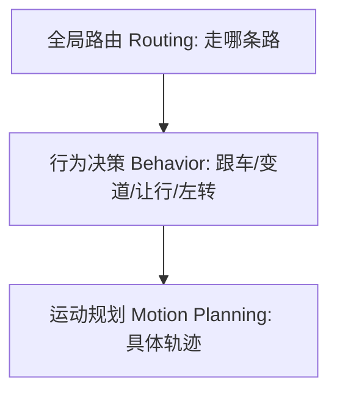
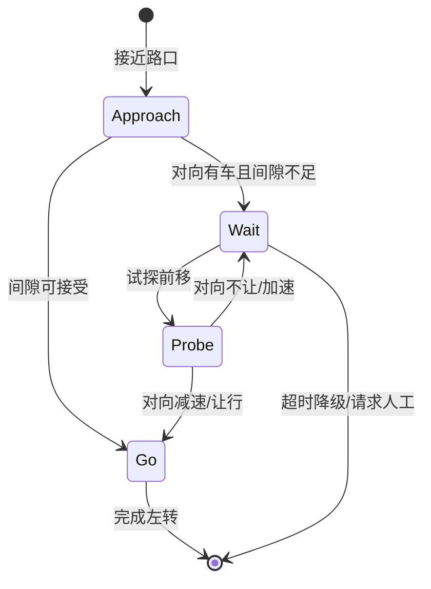

# 四、行为决策：路口该"走"还是"让"

## 引言：无保护左转，与对向直行车"对视"十秒

那是一次城区 NOA（Navigate on Autopilot，导航辅助驾驶）路测，车要从主路左转进小区。这是没有专用左转绿灯的"无保护左转（unprotected left turn）"。对向一辆直行车正快速逼近，老周的手虚搭在方向盘上，屏息看着决策模块的输出。

用纯规则（rule-based）的早期版本时，车在停止线前"僵"住了——规则写的是"对向有车且 TTC（Time-To-Collision，碰撞时间）小于阈值就等"，而对向车速度时快时慢，TTC 在阈值附近反复横跳，车像犯错的小学生，一秒进一秒退。换成博弈（game-theoretic）思路后，车开始"试探"：先小幅前移占住路口，释放"我要走"的意图信号，对向车略微减速，车抓住间隙果断完成左转，整个过程自然得像老司机。

这次对比把行为决策（behavioral decision）的核心暴露无遗：它处在"感知已给目标、规划要出轨迹"的中间层，要回答的不是"怎么走"（那是运动规划），而是"现在该走、该让、还是该等"。它必须处理交互、不确定性与安全底线。本章带你遍历从有限状态机到强化学习的方法谱系，并用 RSS 把安全边界钉死。

## 核心概念：决策的三层与四类方法

### 决策层级



全局路由给出"从 A 到 B 走哪条车道序列"；行为决策在此之上决定每个时刻的驾驶意图（intent）；运动规划把意图变成可执行的轨迹（trajectory）。

### 方法谱系

- 有限状态机（FSM, Finite State Machine）：把行为离散成状态（跟车、巡航、让行、换道），用清晰条件触发转移。可解释、易验收，但状态爆炸、难覆盖长尾交互。
- 决策树/规则：用树或专家规则表达"如果…则…"。直观、可审计，但维护成本高、泛化差。
- 博弈论（game theory）：把其他交通参与者当理性对手，建模收益（payoff）与均衡（equilibrium）。擅长交互式场景（汇入、博弈让行）。POMDP（Partially Observable Markov Decision Process，部分可观测马尔可夫决策）进一步处理"我看不见对方意图"的不确定性。
- 强化学习（RL, Reinforcement Learning）：让策略（policy）在与环境交互中从奖励（reward）学出"该怎么做"，上限高但可解释性与安全保证是硬伤。

## 机制深拆：交互、不确定性与安全约束

### 间隙接受（Gap Acceptance）与 TTC

无保护左转本质是"找间隙"。定义对向最近车的碰撞时间：

$$
\text{TTC} = \frac{d_{\text{gap}}}{v_{\text{oncoming}}}
$$

其中 $d_{\text{gap}}$ 是可用间隙距离。若自车完成左转所需时间 $t_{\text{maneuver}}$ 小于对向车到达冲突点时间，则间隙可接受（accept）。但这只是确定性近似——真实对向车会减速或加速，于是要引入概率化间隙接受（probabilistic gap acceptance），用对方减速意图的分布来算"安全概率"。

### 博弈建模

把自车与他车视为博弈双方，各自选动作（让/走/减速），收益函数把"高效到达"与"避免碰撞"都编码进去。纳什均衡（Nash equilibrium）给出双方都不愿单方面改变的稳定解。当存在多个均衡（都让/都走僵局），需引入"礼貌系数"或通信意图打破对称。

### RSS：责任敏感安全

责任敏感安全（RSS, Responsibility-Sensitive Safety）由 Mobileye 提出，核心思想是用一组数学上可验证的"安全距离/安全响应"规则，定义什么叫"合理谨慎"。例如纵向跟车要求：

$$
d_{\min} = v\,t_{\text{reaction}} + \frac{v^2}{2 a_{\max,\text{brake,own}}} - \frac{v_{\text{lead}}^2}{2 a_{\max,\text{brake,lead}}}
$$

只要自车与前车距离大于 $d_{\min}$，且横向也满足让行规则，那么即使发生碰撞，责任也不在自车（自车已尽到"合理谨慎"）。RSS 的价值是把"安全"从一个模糊概念，变成可写进决策的可行集（feasible set）约束——任何被决策选中的行为，都必须落在 RSS 安全可行集内。

## 工程实践：FSM 状态机与决策伪代码

先用 mermaid 画出无保护左转的行为状态机，再给一段基于 TTC/间隙接受的决策伪代码。



```python
def decide_left_turn(ego, oncoming, params):
    """无保护左转决策：返回 'wait' / 'probe' / 'go'。"""
    d_gap = oncoming.distance_to_conflict  # 对向车到冲突点距离
    v_on = oncoming.speed
    ttc = d_gap / v_on if v_on > 0.1 else float('inf')
    t_maneuver = params['turn_time']       # 自车完成左转耗时
    t_arrive = d_gap / v_on if v_on > 0.1 else float('inf')

    # 满足 RSS 纵向安全距离才考虑走
    d_min = (ego.speed * params['reaction'] +
             ego.speed**2 / (2 * params['a_brake_self']) -
             oncoming.speed**2 / (2 * params['a_brake_lead']))
    safe = (ego.distance_to_conflict - oncoming.distance_to_conflict) > d_min

    if not safe:
        return 'wait'
    if t_maneuver < t_arrive * params['margin']:
        return 'go'          # 确定性间隙可接受
    if ttc < params['probe_ttc']:
        return 'probe'       # 进入试探，释放意图信号
    return 'wait'
```

车规/实时落地坑：决策频率要与规划一致（常 10~20Hz），输出要有"意图保持"（intent persistence）避免一秒三变；状态机要设超时降级（fallback）到最小风险机动（MRM, Minimal Risk Maneuver）；博弈/RL 输出必须再过一层 RSS/规则安全校验，不能裸奔；对向车意图估计要带不确定性，避免"误信对方会让"酿成事故。

## 常见坑（12 条）

1. 状态爆炸：FSM 状态与转移手工堆到上百个，改一处牵全身，难维护难验证。
2. 阈值横跳：TTC 在边界反复触发"走/等"切换，车在停止线前抽搐。
3. 意图误判：把对向车减速当"让行"，其实对方只是正常减速，贸然左转。
4. 安全下限缺失：决策只管效率不管 RSS，为抢间隙牺牲安全裕度。
5. 反应延迟：决策到执行有 200ms 链路延迟，按当前状态算间隙却需用预测状态。
6. 长尾场景覆盖不足：施工区、交警手势、非常规路口，规则写不全。
7. 博弈均衡多解：双方都"礼貌"导致都等、路权僵局，需主动打破对称。
8. RL 奖励设计崩坏：奖励函数偏置让策略学会"钻空子"（如压线抢行）。
9. 不可解释性：深度学习决策给不出"为什么让"，验收/事故定责困难。
10. 降级路径缺失：决策卡死时无明确 fallback，车停在路中。
11. 忽视行人/非机动车：只看机动车博弈，忽略突然窜出的电动车/行人。
12. 全局与局部目标冲突：路由让左转，但决策因保守一直等，乘客体验极差。

## 面试要点（12 题）

1. 行为决策与运动规划区别？答：决策定"意图"（走/让/等），规划定"轨迹"（怎么走）。
2. FSM 优缺点？答：可解释易验收，但状态爆炸、难覆盖复杂交互。
3. 无保护左转难点？答：交互博弈+不确定性，规则易僵局，需间隙接受/博弈。
4. 什么是间隙接受？答：判断对向车间隙是否足够安全完成机动。
5. TTC 是什么？答：按当前速度到碰撞的时间，衡量紧迫程度。
6. 博弈论怎么用？答：建模双方收益与均衡，处理让行/汇入的交互。
7. POMDP 解决什么？答：对方意图部分可观测时的不确定性决策。
8. RSS 核心思想？答：用数学可验证的安全距离/响应规则定义"合理谨慎"。
9. RSS 与决策关系？答：把安全变成可行集约束，决策动作须落在其内。
10. RL 用于决策的利弊？答：上限高、能学复杂策略，但不可解释、安全难保证。
11. 决策失败怎么降级？答：超时/异常触发最小风险机动（MRM）或请求人工。
12. 为什么决策要"意图保持"？答：避免高频抖动让乘客不适、下游规划失稳。

## 结语：一页纸回顾与延伸

回顾：行为决策是感知与规划之间的"大脑"，回答"走还是让"。方法谱系从可解释但难扩展的 FSM/规则，到擅长交互的博弈/POMDP，再到高上限但难验收的 RL。无论哪种方法，都必须被 RSS 这类安全约束"兜底"——效率可以学，安全不能赌。无保护左转的僵局提醒我们：好的决策既要"敢走"，也要"知让"，更要"永远在安全可行集里"。

延伸阅读方向：RSS 原始论文（Shalev-Shwartz et al.）；博弈论入门（Osborne《An Introduction to Game Theory》）；POMDP 求解（如 DESPOT）；RL 安全方向（Constrained MDP、Safe RL）；Apollo/Autoware 开源决策模块读源码；ISO 21448 对"预期功能安全"的决策层要求。

本章约 3200 字。
