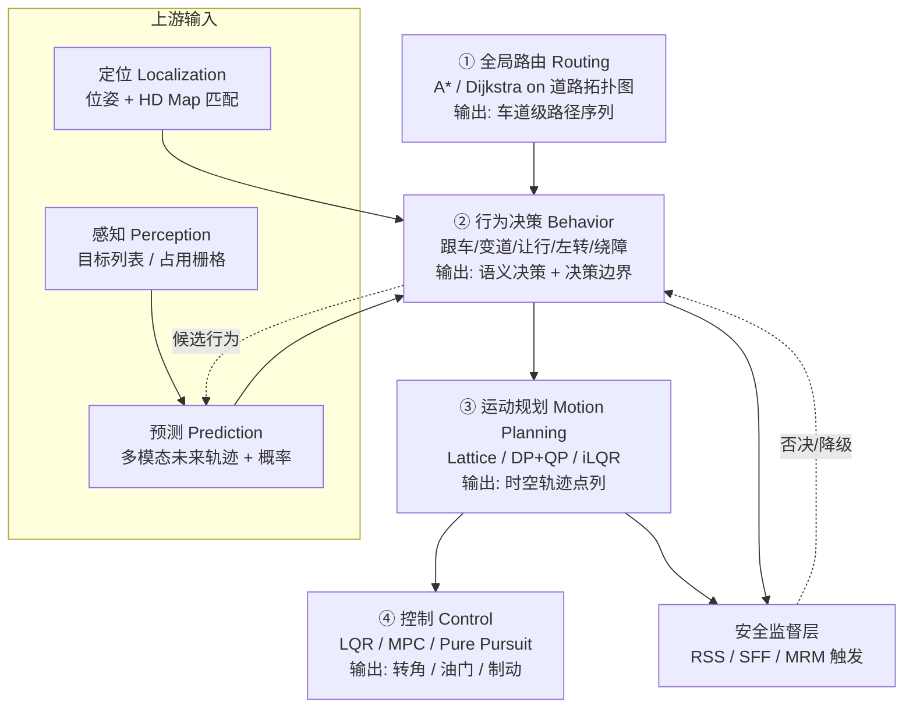
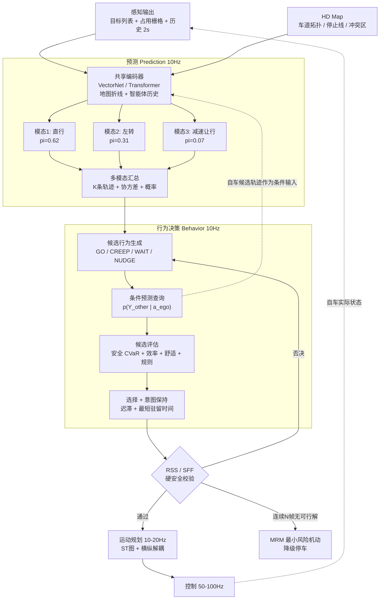
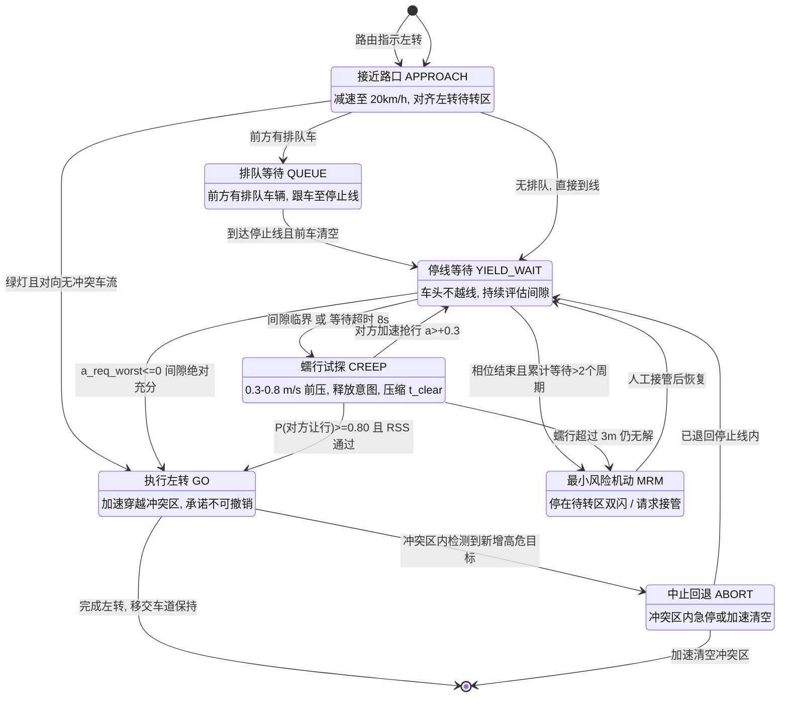

# 四、行为决策：路口该"走"还是"让"

## 0. 引言：无保护左转，与对向直行车"对视"了十秒

那是九月一个周三的傍晚，六点四十分，城区 NOA（Navigate on Autopilot，导航辅助驾驶）第 37 轮路测。车要从双向六车道的主路左转拐进一个老小区，路口没有左转专用相位——绿灯亮起时，对向直行车流和你共用同一个绿灯，你得自己找空子插过去。这就是教科书里的**无保护左转（unprotected left turn, UPLT）**，也是全世界所有自动驾驶团队的公敌。

老周坐在副驾，笔记本上开着决策模块的调试面板：左边一列滚动着感知给的对向目标 ID、距离与速度，右边是行为决策每 100 ms 打印一次的状态字。主驾是小陈，双手虚握方向盘，脚悬在刹车踏板上方三厘米的位置。

第一次跑的是三个月前那套纯规则（rule-based）版本。绿灯亮，车挪到停止线前 1.2 m，然后就停在那儿了。对向来了一辆白色轿车，距冲突点 62 m、速度 13.8 m/s，TTC（Time-To-Collision，碰撞时间）4.5 s——规则写死的是"TTC < 5 s 则等待"，于是等。那辆车过去了，后面跟着一辆网约车，间隙 4.9 s，还是等。再后面是一辆公交，间隙 5.1 s，规则说可以走，车往前挪了 0.4 m。结果公交司机松了一下油门，速度从 12.1 m/s 掉到 11.6 m/s，TTC 瞬间跳回 4.8 s，规则立刻反悔——车又缩了回去。屏幕上那一行状态字在 `GO` 和 `WAIT` 之间来回翻，两秒钟翻了七次，车身跟着一顿一顿地耸。

后面排起了长队。第四辆车的司机摇下车窗探出头来看，第六辆开始按喇叭。老周瞄了一眼计时器：**从绿灯亮起到这一相位结束，整整 47 秒，车一米都没往前挪。** 左转灯又变红了。小陈叹了口气接管，人工完成了这个左转——他只用了 3 秒，抓的是一个 4.3 s 的间隙，比系统刚才拒绝掉的那三个都小。

复盘会上，白板上写了两行字：

> 第一行：**机器不敢走的那些间隙，人天天在走。**
> 第二行：**人敢走，不是因为人算得更准，而是因为人知道对面会让。**

这两行字点破了行为决策（behavioral decision）与感知、规划的本质差别。感知面对的是**物理世界**——一块石头不会因为你盯着它看就挪窝；运动规划面对的是**运动学与优化**——曲率、加速度、时间最优，都有确定的数学答案。而行为决策面对的是**另一个会思考、会反应、会看你脸色的智能体**。你往前挪 0.4 m，对方会减速；你缩回去，对方会加速。这个"你动我动"的耦合关系，让"先预测他车轨迹、再按预测规划自车"这种朴素做法在根子上就是错的——**你的预测，会被你自己的动作改变**。

四周后换上博弈（game-theoretic）版本再跑同一个路口。绿灯亮，车以 0.4 m/s 的速度稳定蠕行（creep）前压，车头探出停止线 1.8 m 后保持。这个动作对对向司机来说是一句清晰的话："我要走了。"对向那辆车松了油门，减速度约 0.9 m/s²——决策模块把这个减速识别为让行信号，让行概率估计从 0.51 跳到 0.87，随即加速完成左转。整个过程 5.8 s，后车一声喇叭都没响。

本章要拆的就是这件事：行为决策在软件栈里站在哪个位置、它凭什么敢走、它凭什么必须让、以及——**怎么把"敢走"这件事钉死在一个数学上可验证的安全可行集里**。

---

## 1. 核心概念

### 1.1 决策在自动驾驶软件栈中的位置

经典的模块化自动驾驶栈把"从哪儿到哪儿"这个问题切成了四层，每层的时间尺度、空间尺度和数学工具都完全不同：



注意图里那条虚线 `BH -.候选行为.-> PRD`：**行为决策会把自己的候选动作反过来喂给预测模块**，这就是 2.5 节要展开的"条件预测"。在朴素的单向流水线里这条边是不存在的，而它的缺失正是"过度保守"的根源。

### 1.2 四层的输出契约与频率对比

| 层级 | 英文 | 主要输入 | 输出物 | 典型频率 | 时间视界 | 空间尺度 | 典型算法 | 单帧耗时预算 |
|---|---|---|---|---|---|---|---|---|
| ① 全局路由 | Routing / Mission Planning | 起终点、道路拓扑图、实时路况 | 车道级路径序列 `[lane_id, ...]` | 事件触发，0.01~0.1 Hz | 分钟~小时 | 1~100 km | Dijkstra、A*、ALT、Contraction Hierarchies | 1~500 ms（可离线预处理） |
| ② 行为决策 | Behavior Planning / Decision | 定位、感知目标、预测、HD Map、路由 | 语义决策 + 参考线 + 决策边界（ST 上下界、限速包络、停车墙、目标间隙） | **10 Hz**（5~20） | 3~10 s | 50~300 m | FSM/HSM/BT、POMDP、MCTS、博弈、学习策略 | 20~60 ms |
| ③ 运动规划 | Motion Planning | 决策边界、参考线、障碍物预测、动力学约束 | 时空轨迹 $(x,y,\theta,\kappa,v,a,t)$ 点列 | 10~20 Hz | 3~8 s | 50~200 m | Lattice、EM(DP+QP)、Frenet 采样、iLQR、OBCA | 30~80 ms |
| ④ 控制 | Control | 轨迹、车辆状态、标定表 | 方向盘转角、油门开度、制动压力 | **50~100 Hz** | 0.1~1 s | 1~20 m | PID、LQR、MPC、Stanley、Pure Pursuit | 2~10 ms |

**关于路由层的一点技术细节**：它跑在**道路拓扑图（road topology graph）**上，节点是车道段（lane segment），有向边是可通行关系（直行后继、可变道邻接、路口连接线 connector），边权通常是"预期通行时间"而非距离——要把限速、历史平均车速、转向惩罚（左转比直行贵，掉头最贵）、变道次数惩罚全部折算进去。

一个真实数量级：一座千万人口城市的高精地图车道级路网大约有 $10^6$ 量级的车道段、$3\times10^6$ 量级的有向边。裸 Dijkstra 的复杂度是 $O(E\log V)$，单次查询在毫秒到几十毫秒之间；但导航要支持"每秒重算一次以响应路况"，工业界普遍用 **Contraction Hierarchies（CH，收缩层次）** 或 **CRP（Customizable Route Planning）** 做预处理，把单次查询压到微秒量级，代价是几分钟的离线预处理和几百 MB 内存。

**A\* 的启发函数**在道路网上通常取 `直线距离 / 全局最大限速`，这保证了可采纳性（admissible，即 $h(n)\le h^*(n)$），从而保证最优性。若为了速度用 `直线距离 / 平均车速`，启发就变得不可采纳，会更快但可能返回次优路径——很多量产导航就是这么干的，因为用户感知不到 2% 的路径长度差异，却能感知到 300 ms 的卡顿。

**频率差三个数量级带来的工程后果**：控制层 100 Hz 意味着 10 ms 一帧，而行为决策 10 Hz 意味着 100 ms 一帧。当决策在 $t$ 时刻做出"GO"的判断时，这个判断要一直用到 $t+100$ ms。**在 50 km/h（13.9 m/s）下，100 ms 就是 1.39 m**；如果再加上感知 80 ms 的处理延迟、执行器 150 ms 的建压延迟，整条链路的"决策年龄"能到 300~400 ms，对应 4~5.5 m 的位置不确定。所有阈值设计都必须把这段距离预留进去，否则纸面上安全的决策在物理上已经晚了半个车身。

### 1.3 行为决策到底要回答哪几个问题

和感知一样，决策也有一份对下游的**输出契约**。它不输出轨迹（那是规划的活），它输出的是**约束与语义标签**：

| 输出项 | 英文 | 形式 | 举例 |
|---|---|---|---|
| 目标参考线 | reference line | 车道中心线序列 + Frenet 原点 | "切换到左侧车道中心线" |
| 纵向障碍物决策 | longitudinal decision | 对每个障碍物打标签：`FOLLOW` / `YIELD` / `OVERTAKE` / `STOP` / `IGNORE` | "对 obj_17 让行，对 obj_23 忽略" |
| 横向障碍物决策 | lateral decision | `NUDGE_LEFT` / `NUDGE_RIGHT` / `NONE` | "从右侧绕过停靠的公交" |
| 速度上界包络 | speed limit envelope | $v_{\max}(s)$ 分段函数 | 路口前 30 m 限 20 km/h |
| 停车墙 | stop fence / virtual wall | $s$ 位置 + 原因码 | "s=42.3 m 处停车，原因=红灯" |
| 时空可行域 | ST boundary | ST 图上的多边形上下界 | 允许在 $t\in[2.1, 4.8]$ s 通过冲突区 |
| 决策原因码 | decision reason code | 枚举 | `WAIT_ONCOMING_GAP_INSUFFICIENT` |
| 意图置信度 | intent confidence | $[0,1]$ | 0.87 |

最后两项常被新手忽略，但在量产项目里它们的重要性不亚于前面所有项：**原因码决定了 HMI 能不能告诉乘客"车为什么不走"，也决定了事故复盘时能不能定位到具体是哪条规则触发的**。一套没有原因码的决策模块，出了问题只能靠工程师肉眼看日志猜，这在功能安全审核里是过不去的。

把这些输出归纳成五个人话问题：

1. **走不走**（gap acceptance、路权判定）——本章主线；
2. **跟谁**（在 ST 图上把哪个目标当作 leader）；
3. **从哪侧过**（nudge 方向、超车方向、绕障方向）；
4. **换不换道**（必要性 necessity × 安全性 safety × 礼貌度 courtesy 的三重判断）；
5. **停在哪**（停止线前？人行横道前？路口内 keep-clear 区外？）。

### 1.4 方法谱系全景

| 方法族 | 代表方法 | 核心数学对象 | 交互建模 | 不确定性处理 | 可解释性 | 可验证性 | 长尾泛化 | 典型落地位置 |
|---|---|---|---|---|---|---|---|---|
| 规则类 | FSM、HSM、行为树、决策表 | 状态 + 转移条件 | 无（他车=移动障碍物） | 靠阈值裕度硬扛 | ★★★★★ | ★★★★★ | ★☆☆☆☆ | 量产主干、安全兜底 |
| 数值/优化类 | MDP + 值迭代、POMDP、MCTS | 值函数 $V(s)$ / 信念 $b(s)$ | 隐式（作为环境随机性） | ★★★★★（信念空间） | ★★★☆☆ | ★★★☆☆ | ★★★☆☆ | 特定场景求解器 |
| 博弈类 | Stackelberg、Nash、level-k、SVO | 收益矩阵 + 均衡 | ★★★★★（显式） | ★★★☆☆ | ★★★★☆ | ★★★☆☆ | ★★★☆☆ | 交互密集场景 |
| 学习类 | 模仿学习、强化学习、端到端 | 策略网络 $\pi_\theta(a\mid s)$ | 靠数据隐式学 | ★★★☆☆ | ★☆☆☆☆ | ★☆☆☆☆ | ★★★★☆ | 提议器 / 代价学习 |
| 形式化安全 | RSS、SFF、CBF、可达集 | 不等式约束 / 不变集 | 最坏情况假设 | 最坏界 | ★★★★★ | ★★★★★ | ★★★★☆（保守） | 后置校验层 |

现实中的量产架构几乎从来不是"选一个"，而是**分层叠加**：最外层用 HSM/场景机做粗分流（这是路口还是高速？），场景内部用规则或优化求解器出决策，交互密集时局部启用博弈或搜索，学习模型作为"提议器"或"代价函数"注入，最后所有输出必须过一遍 RSS 类形式化安全校验。**没有哪一层可以独自上路。**

### 1.5 术语校准：意图、行为、机动、轨迹

这四个词在中文文献里经常混用，先钉死：

| 术语 | 英文 | 时间尺度 | 抽象层次 | 例子 |
|---|---|---|---|---|
| 意图 | intention / intent | 5~30 s | 最抽象，与目的地相关 | "我要去左边那条路" |
| 行为 | behavior | 3~10 s | 语义离散标签 | "执行无保护左转" |
| 机动 | maneuver | 1~5 s | 带参数的动作原语 | "以 1.8 m/s² 加速穿过冲突区" |
| 轨迹 | trajectory | 0.1~8 s | 连续时空曲线 | $(x(t), y(t), v(t), \theta(t))$ |

行为决策模块的输出是**行为 + 机动参数**，不是轨迹。这个边界如果模糊，很容易演变成"决策模块偷偷生成了一条粗糙轨迹，规划模块再去拟合它"——这是许多项目后期"决策和规划打架"的根源：决策认为可行的机动，规划因为动力学约束做不出来，于是规划擅自改了，改完又不满足决策的安全假设。

**工程上的解药**：决策输出的机动参数必须是**规划一定能实现的**，因此决策内部必须持有一个**简化的运动学可行性检查器**（通常是点质量模型 + 加速度/jerk 上界），在输出前自检一次。本章第 7 节的代码里，`ego_clear_time()` 就是这样一个最小化的可行性检查器。

---

## 2. 预测与决策的耦合

### 2.1 预测模块的输出契约

预测（prediction）向决策交付的不是一条轨迹，而是**一个概率分布**。典型契约：

对每个动态目标 $i$，输出 $K$ 条候选未来轨迹及其概率：

$$\left\{ \left( \hat{Y}^{(i,k)}_{1:T},\ \pi^{(i,k)} \right) \right\}_{k=1}^{K}, \qquad \sum_{k=1}^{K}\pi^{(i,k)} = 1$$

其中 $\hat{Y}^{(i,k)}_{1:T} = \{(\hat{x}_t, \hat{y}_t, \hat{\Sigma}_t)\}_{t=1}^{T}$，$T$ 通常取 3 s（城区快速反应）、6 s（城区决策）或 8 s（Waymo Open Motion Dataset 标准）。$K$ 一般取 6（Argoverse 标准）或 64（内部使用后再聚类）。

除了轨迹集，成熟系统还会输出：

- **离散机动概率**：$P(\text{直行})=0.62$、$P(\text{左转})=0.31$、$P(\text{掉头})=0.07$；
- **车道占用概率**：目标在未来 $t$ 时刻处于每条车道的概率（决策模块最爱这个，因为它直接对应"会不会跟我抢同一条车道"）；
- **交互标签**：是否已经在为自车让行（yielding）；
- **占用流场（occupancy flow）**：BEV 网格上的占用概率 + 速度场，对不规则目标和群体行人特别有用。

### 2.2 预测方法谱系

| 族别 | 代表方法 | 输入表征 | 输出 | 有效视界 | 计算量 | 可解释性 | 主要失效模式 |
|---|---|---|---|---|---|---|---|
| **物理模型** | CV（匀速）、CA（匀加速）、CTRV（恒转率恒速）、CTRA、单车模型 | 当前状态向量 | 单条确定轨迹 | **< 1 s 优，> 2 s 崩** | 微秒级 | ★★★★★ | 无法表达转向意图；弯道上直着飞出去 |
| **机动意图分类** | HMM、SVM、GBDT、随机森林 + 机动库 | 手工特征（横向偏移、转向灯、横摆角速度） | 离散机动类别 + 概率 | 2~4 s | < 1 ms | ★★★★☆ | 特征工程天花板；机动库外的行为无法表达 |
| **地图先验/车道候选** | 沿车道中心线的 IDM / 常加速度推演 | HD Map 车道拓扑 + 状态 | 每条可行车道一条候选轨迹 | 3~6 s | 毫秒级 | ★★★★★ | 违章、切弯、压线、无图区域全废 |
| **栅格 CNN** | ChauffeurNet、MultiPath、CoverNet | BEV 多通道栅格图 | 轨迹集 / 锚点分类 | 3~6 s | 10~30 ms | ★★☆☆☆ | 栅格分辨率限制；远距离信息稀释 |
| **序列模型** | Social LSTM、Social GAN、Trajectron++ | 历史轨迹序列 + 社交池化 | 分布采样 | 3~5 s | 5~15 ms | ★★☆☆☆ | 缺地图约束，会预测出"开上人行道" |
| **矢量化图网络** | **VectorNet**、LaneGCN、TNT/DenseTNT、HiVT | 折线（polyline）集合 + 图注意力 | 多模态轨迹 + 概率 | 6~8 s | 5~20 ms | ★★☆☆☆ | 模式坍缩；对地图拓扑错误敏感 |
| **Transformer 场景级** | mmTransformer、SceneTransformer、Wayformer、MTR、QCNet | 统一 token 化的地图 + 智能体 | 联合多模态 / 边缘多模态 | 8 s | 20~80 ms | ★☆☆☆☆ | 算力大；长尾行为仍缺样本 |

**关于 CV 模型的一个反直觉事实**：Schöller 等人在 2020 年那篇《What the Constant Velocity Model Can Teach Us About Pedestrian Motion Prediction》里指出，在多个行人预测基准上，一个朴素的匀速模型能打败当时大量深度学习方法。原因很简单——**大部分时间里，大部分目标确实在匀速直行**。这给出了两条工程启示：

1. 任何预测模块上线前，必须先跑 CV 基线，跑不过就别上；
2. 深度模型的价值不在"平均误差"，而在**那 5% 会转向、会加塞、会突然刹车的样本**上。而这恰恰是决策模块最需要的部分，也恰恰是 minADE 这类平均指标看不出来的部分。

**VectorNet 的核心思想**值得单独说一句，因为它改变了整个领域的表征范式。栅格化（rasterization）把地图和轨迹画成图片再用 CNN 处理，问题是：车道线是几十米长、几十厘米宽的细长结构，栅格化后要么分辨率不够丢失细节，要么图太大算不动。VectorNet 改为把每个地图元素和每条轨迹表示成一串**向量（vector）**——每个向量记录起点、终点、属性、所属折线 ID：

$$v_i = \left[ d_i^{s},\ d_i^{e},\ a_i,\ j \right]$$

然后两级图网络：**折线子图（polyline subgraph）** 聚合同一折线内部的向量，**全局交互图（global interaction graph）** 用自注意力聚合所有折线之间的关系。计算量从"图像像素数"降到"向量数"，一个复杂路口的向量数在 $10^3$ 量级，而等分辨率栅格图是 $10^5{\sim}10^6$ 像素。

### 2.3 多模态输出与概率化

**为什么必须多模态？** 一辆车开到路口前，它可能左转也可能直行。如果预测模块输出一条"平均轨迹"，那条轨迹会指向左转和直行之间的某个方向——**一个物理上不可能、语义上无意义、且恰好指向路口中央的位置**。这就是回归任务的均值坍缩（mean collapse）：$\arg\min_\mu E\|y-\mu\|^2 = E[y]$，而多峰分布的期望往往落在概率密度的谷底。

主流建模是**高斯混合（GMM, Gaussian Mixture Model）**：

$$p(Y \mid X) = \sum_{k=1}^{K} \pi_k \prod_{t=1}^{T} \mathcal{N}\!\left(y_t;\ \mu_t^{k},\ \Sigma_t^{k}\right)$$

训练时如果直接最大化似然，会遇到"所有模态都往数据中心跑"的坍缩问题。实践中用 **Winner-Takes-All（WTA，胜者通吃）** 或其变体：

$$k^{*} = \arg\min_{k} \sum_{t=1}^{T} \left\| y_t - \mu_t^{k} \right\|_2, \qquad \mathcal{L} = \underbrace{-\log \pi_{k^{*}}}_{\text{分类项}} + \underbrace{\sum_{t=1}^{T} \ell_{\text{huber}}\!\left(y_t,\ \mu_t^{k^{*}}\right)}_{\text{回归项，只回传给胜者}}$$

只有离真值最近的那个模态接收回归梯度，其他模态保持"发散"，从而自然形成对不同意图的分工。**WTA 的病**是训练早期胜者随机、可能出现"死模态"（某个 $k$ 永远赢不了、梯度饿死）；改进版 **EWTA（Evolving WTA）** 先让 top-$m$ 个模态都接收梯度，再随训练进程把 $m$ 从 $K$ 逐步退火到 1。

另一条路线是 **goal-based（目标点条件）**：先在地图上枚举/采样一批候选终点（TNT 用车道中心线上的稀疏采样点，DenseTNT 用稠密目标集 + 可微 NMS），再对每个终点回归完整轨迹。好处是模态由地图拓扑天然定义，可解释性强，且不会预测出"开上绿化带"这种轨迹。

### 2.4 预测的评价指标

| 指标 | 英文全称 | 公式 | 含义 | 决策视角的问题 |
|---|---|---|---|---|
| minADE$_K$ | minimum Average Displacement Error | $\min_k \frac{1}{T}\sum_{t=1}^T \|\hat{y}^k_t - y_t\|_2$ | $K$ 条里最好那条的平均位移误差 | 只看最好的一条，**完全不惩罚另外 $K-1$ 条有多离谱** |
| minFDE$_K$ | minimum Final Displacement Error | $\min_k \|\hat{y}^k_T - y_T\|_2$ | 最好那条的终点误差 | 同上；且只看终点，中间穿模不管 |
| MR$_K$ | Miss Rate | $\frac{1}{N}\sum_i \mathbb{1}\!\left[\min_k \|\hat{y}^{k}_{i,T} - y_{i,T}\|_2 > \delta\right]$，$\delta=2$ m | 未命中率 | 阈值一刀切，2.01 m 和 20 m 同罚 |
| Brier-minFDE | — | $\text{minFDE}_K + \left(1 - \pi_{k^{*}}\right)^2$ | 在 minFDE 上加概率校准惩罚 | 好一些，但仍只关注最优模态 |
| Overlap Rate | — | 预测轨迹之间发生碰撞的比例 | 场景一致性 | 只有联合预测才有意义 |
| mAP | mean Average Precision (WOMD) | 按机动类别分桶后计算 AP | 兼顾概率排序质量 | 计算复杂，但最接近决策需求 |

**真实数字量级**（用于校准你对"预测有多准"的直觉）：

| 数据集 | 预测视界 | 顶尖方法 minADE$_6$ | minFDE$_6$ | MR$_6$ |
|---|---|---|---|---|
| Argoverse 1 | 3 s | 0.65~0.80 m | 0.95~1.20 m | 0.09~0.13 |
| Argoverse 2 | 6 s | 0.55~0.70 m | 1.10~1.40 m | 0.12~0.18 |
| nuScenes prediction | 6 s | 1.2~1.8 m（$K=5$） | 2.5~3.8 m | — |
| Waymo Open Motion | 8 s | 0.55~0.75 m | 1.1~1.6 m | 0.12~0.20 |

**注意 MR 那一列**：即便是榜首方法，也有 **10%~18% 的样本，六条预测里没有一条能在终点处落进 2 m 半径**。换算到 10 Hz 的决策频率、一个有 20 个动态目标的路口，意味着**每一帧平均有 2~3 个目标的未来是"预测错的"**。决策模块必须建立在"预测经常错"这个前提上设计，而不是"预测基本对，偶尔错"。

这条结论直接推出两个工程原则：

1. **决策不能只用最高概率模态**（Top-1 mode），必须对所有模态做风险评估，尤其是那些概率虽低但后果严重的模态（低概率高危：对向车突然左转切入）。工程上常用 CVaR（Conditional Value at Risk，条件风险价值）而非期望：$\text{CVaR}_\alpha = E[\text{cost} \mid \text{cost} \ge \text{VaR}_\alpha]$，取 $\alpha = 0.9$ 意味着"只看最坏 10% 情形的平均代价"。
2. **决策要有短视界的"物理兜底"**：在 0~1.5 s 这个视界内，不信任何学习模型，只信 CV/CA 外推 + 最坏加速度假设。因为这个视界里物理约束足够强，而学习模型带来的收益不足以抵消它偶尔的离谱错误。

### 2.5 "鸡生蛋"问题：自车行为改变他车反应

这是整章最重要的一节。

**朴素流水线（开环预测，open-loop prediction）** 的假设是：

$$\hat{Y}_{\text{other}} = f(X_{\text{history}}, \text{Map})$$

——他车未来只取决于历史和地图，与自车做什么无关。基于这个假设，决策模块把预测出的轨迹当成**不可改变的移动障碍物（moving obstacle）**，然后在剩下的空隙里找自己的路。

这个假设在自由流交通里勉强成立，在交互场景里**灾难性地错误**：

- 你要并线，旁边车道的车会不会让你，**取决于你有没有打转向灯、有没有向车道线靠拢**；
- 你要无保护左转，对向车会不会减速，**取决于你的车头有没有探出去**；
- 你在环岛入口等待，环岛内的车会不会给你空隙，**取决于你的姿态是"在等"还是"要走"**。

开环预测下，系统看到的是"对向车流永不停歇地以匀速通过冲突区"，于是永远等不到间隙——这就是 **frozen robot problem（冻结机器人问题，Trautman & Krause, 2010）**。引言里那 47 秒，本质就是这个。

**三种修补路线**：

| 路线 | 数学形式 | 优点 | 代价 | 落地情况 |
|---|---|---|---|---|
| **条件预测** conditional prediction | $p\!\left(Y_{\text{other}} \mid X,\ a_{\text{ego}}\right)$ | 直接、可复用现有预测模型（把自车规划轨迹当成额外输入 token） | 每个候选行为都要跑一次预测，算力 $\times M$ | Waymo/Motional 等已量产使用 |
| **联合预测** joint prediction | $p\!\left(Y_{\text{ego}}, Y_{\text{other}} \mid X\right)$ | 场景级一致，不会预测出互相穿模的轨迹 | 联合空间维度爆炸；自车不再"可控" | SceneTransformer、M2I 等研究方向 |
| **博弈求解** game-theoretic | $\left(a_{\text{ego}}^{*}, a_{\text{other}}^{*}\right)$ 为某种均衡 | 显式建模"我动你动"，可解释 | 收益函数难标定；均衡多解 | 局部场景启用（第 5 节） |

**条件预测的算力账**：设候选行为 $M=5$（GO/WAIT/CREEP/绕左/绕右），每个候选下预测 $N=20$ 个目标、每个目标 $K=6$ 个模态、视界 $T=60$ 步（6 s @10 Hz）。若预测网络单次前向 20 ms，则朴素做法需要 $5\times20 = 100$ ms——**超预算**。工程上的解法：

1. **共享编码器**：地图与历史的编码只做一次，只有解码器随自车候选轨迹重跑，前向从 20 ms 降到 3~5 ms；
2. **候选剪枝**：先用廉价的规则/RSS 过滤掉明显不可行的候选，$M$ 从 5 降到 2~3；
3. **分级评估**：先用 CV 模型 + 解析 RSS 做粗筛（微秒级），只对存活的候选做神经网络条件预测。

### 2.6 预测—决策—规划的交互闭环



这张图里有三条反馈边，每一条都对应一类真实事故：

- `COND -.-> ENC`：**缺了它就是 frozen robot**（引言的 47 秒）；
- `RSSCHK -->|否决| GEN`：**缺了它就是学习/博弈模块裸奔**，一旦收益函数标定偏了就直接撞上去；
- `RSSCHK -->|连续N帧无可行解| MRM`：**缺了它就是车卡在路中央**，或者更糟——在没有可行解时随便选一个执行。

---

## 3. 规则类方法：FSM、HSM、行为树与规则引擎

### 3.1 有限状态机 FSM：最朴素也最顽固的方案

**有限状态机（FSM, Finite State Machine）** 用五元组定义：$(\mathcal{Q}, \Sigma, \delta, q_0, F)$——状态集、输入字母表、转移函数、初始状态、终止状态集。放到驾驶决策里：

- $\mathcal{Q}$：`CRUISE`（自由巡航）、`FOLLOW`（跟车）、`LANE_CHANGE_LEFT/RIGHT`（换道）、`NUDGE`（绕障）、`YIELD`（让行）、`STOP`（停车）、`CREEP`（蠕行试探）、`PULL_OVER`（靠边停）……
- $\Sigma$：由感知/预测/地图计算出的**布尔谓词集合**，如 `has_front_obstacle`、`gap_sufficient`、`traffic_light_red`、`left_lane_clear`；
- $\delta$：转移表，每条形如 `(FOLLOW, front_vehicle_slow ∧ left_lane_clear ∧ ¬solid_line) → LANE_CHANGE_LEFT`。

FSM 的全部魅力在于**它是可穷举的**：状态有限、转移有限，你可以把整张转移表打印在墙上，逐条评审，逐条写测试用例，逐条向功能安全审核员解释。这在 ISO 26262 / ISO 21448 的语境下是巨大的优势——**能被穷举，就能被验证**。

### 3.2 无保护左转的决策状态机



注意这张图里三个容易被忽略的设计：

1. **`GO` 是"承诺（commitment）"状态**。一旦车头进入冲突区，退回去往往比走完更危险（车尾还留在对向车道上）。所以 `GO → ABORT` 的触发条件必须比 `YIELD_WAIT → GO` 苛刻得多，而且 `ABORT` 内部还要再判一次"退回快还是冲过去快"。工程上常用**不可撤销点（point of no return）**：设自车已进入冲突区 $s_{\text{in}}$ 米、冲突区总长 $L$，则退回耗时约 $\sqrt{2 s_{\text{in}}/b}$、冲完耗时约 $\sqrt{2(L-s_{\text{in}})/a}$，两者相等处即为不可撤销点。
2. **`CREEP` 是一个独立状态而不是 `GO` 的子步骤**。它的语义是"我在用车辆位置这个物理信道向对方发送意图"，它有自己的退出条件和自己的安全约束（蠕行速度上限、最大前压距离）。
3. **`MRM` 必须可达**。任何一个可能长期停留的状态，都必须有一条通往 MRM 的边，否则就是"卡死"。

### 3.3 状态爆炸：一次组合数计算

FSM 的死穴不是"状态多"，而是**转移多**。$N$ 个状态的全连通 FSM 有 $N(N-1)$ 条有向转移，每条转移都需要一个布尔条件、一段测试用例、一次评审。

真实项目里状态是怎么涨起来的？不是有人一口气写了 200 个状态，而是**上下文维度的笛卡尔积**：

$$N = \underbrace{8}_{\text{基础行为}} \times \underbrace{5}_{\text{道路类型}} \times \underbrace{6}_{\text{路口类型}} \times \underbrace{3}_{\text{前车状态}} \times \underbrace{3}_{\text{车道占用}} = 2160$$

- 基础行为 8：巡航/跟车/左换道/右换道/绕障/让行/路口通行/靠边停；
- 道路类型 5：高速/城市快速路/城市主干道/支路小巷/停车场；
- 路口类型 6：无路口/信号灯路口/停车让行标志/减速让行标志/环岛/无标识路口；
- 前车状态 3：无前车/静止前车/运动前车；
- 车道占用 3：本车道内/换道过程中/借对向道。

| 状态数 $N$ | 全连通转移 $N(N-1)$ | 仅保留 5% 合法转移 | 每条转移 3 个用例 | 人工评审工时（3 min/条） |
|---|---|---|---|---|
| 10 | 90 | 5 | 15 | 0.25 h |
| 30 | 870 | 44 | 132 | 2.2 h |
| 60 | 3,540 | 177 | 531 | 8.9 h |
| 120 | 14,280 | 714 | 2,142 | 36 h |
| 2,160 | **4,663,440** | 233,172 | 699,516 | **11,659 h ≈ 6 人年** |

这张表就是"为什么纯 FSM 撑不到 L4"的定量回答。**转移数随状态数平方增长，而状态数随上下文维度指数增长。**

更要命的是**修改成本**：新增一个状态（比如"避让消防车"），理论上要检查它与既有 2160 个状态之间的 4320 条潜在转移是否需要定义。实际项目里没人做得到，于是新状态被草率地只连到两三个"看起来相关"的状态上——**未定义的转移就是潜在的卡死或非法状态**。

### 3.4 层级状态机 HSM：用层级砍掉笛卡尔积

**层级状态机（HSM, Hierarchical State Machine / Statechart，Harel 1987）** 的思路：把笛卡尔积拆成**嵌套**与**正交（orthogonal region）**。

- **嵌套**：`INTERSECTION` 是一个超状态（superstate），内部有子状态 `APPROACH / WAIT / CREEP / GO`。从 `INTERSECTION` 到 `HIGHWAY` 的转移只需写一条，不需要为每个子状态各写一条——**超状态的出边被所有子状态继承**。
- **正交区域**：`纵向行为`（跟车/加速/制动）和 `横向行为`（保持/换道/绕障）是两个并行区域，各自独立演化。这把 $8 \times 3 = 24$ 个组合状态压回 $8 + 3 = 11$ 个。
- **历史状态（history state, H）**：从 `INTERSECTION` 被打断去执行 `EMERGENCY_YIELD`，结束后能自动回到打断前的子状态。

用 HSM 重算上面的例子：把 5 种道路类型、6 种路口类型做成两层嵌套（$5 + 6 = 11$ 个上下文超状态而非 $30$ 个组合），把纵向/横向拆成正交区域，状态数从 2160 降到大约 $11 + 8 + 3 + 3 = 25$ 量级，转移数从 466 万降到几百条——**降了四个数量级**。

**Apollo 的 Scenario-Stage 架构就是一个工业级 HSM**：顶层是十余个 Scenario（`LaneFollow`、`BareIntersection`、`StopSignUnprotected`、`TrafficLightProtected`、`TrafficLightUnprotectedLeftTurn`、`TrafficLightUnprotectedRightTurn`、`YieldSign`、`PullOver`、`EmergencyPullOver`、`ValetParking`、`ParkAndGo`、`Deadend` 等），每个 Scenario 内部再分若干 Stage，Stage 内部调用一组可配置的 Task（DP 路径、QP 速度、Piecewise Jerk 等）。Scenario 切换由一个独立的 `ScenarioManager` 依据地图元素与自车位置判定，这正是 HSM 的超状态转移。

### 3.5 行为树 Behavior Tree：从状态图到调用树

**行为树（BT, Behavior Tree）** 源自游戏 AI，近十年被大量引入机器人与自动驾驶决策。它把"状态 + 转移"换成"**树 + 每帧 tick 遍历**"。

每个节点被 tick 后返回三个状态之一：`SUCCESS` / `FAILURE` / `RUNNING`。**`RUNNING` 是 BT 相对 FSM 最本质的增量**——它天然表达"这个动作还没做完，下一帧继续"，而 FSM 需要为每个"进行中"的动作显式建一个状态。

**节点类型**：

| 类别 | 节点 | 记号 | 语义 | 驾驶决策中的用途 |
|---|---|---|---|---|
| 组合 Composite | Sequence 顺序 | `→` | 从左到右 tick，**遇 FAILURE 即返回 FAILURE**，全部 SUCCESS 才 SUCCESS | "检查间隙 → 检查后方 → 打灯 → 换道"，任一步失败即放弃 |
| 组合 | Fallback / Selector 选择 | `?` | 从左到右 tick，**遇 SUCCESS 即返回 SUCCESS**，全部失败才 FAILURE | 优先级列表："先试紧急处理，不行试换道，都不行就跟车" |
| 组合 | Parallel 并行 | `⇉` | 同时 tick 所有子节点，按 $M$-of-$N$ 策略汇总 | "保持车道 ∥ 监控后方来车" |
| 组合 | ReactiveSequence / ReactiveFallback | `→ᴿ` / `?ᴿ` | 每帧都从头重评估前置条件 | 保证高优先级条件失效时立刻抢占 |
| 装饰 Decorator | Inverter | `!` | 取反 | "非红灯" |
| 装饰 | Repeat / Retry(N) | | 重复/重试 | 变道失败重试 3 次 |
| 装饰 | Timeout(T) | | 超时强制 FAILURE | 蠕行 8 s 无果则失败 |
| 装饰 | Cooldown(T) | | 冷却期内直接 FAILURE | 防止 2 s 内反复换道 |
| 装饰 | Guard / Precondition | | 条件不满足则不 tick 子树 | RSS 未通过则不进入 GO 子树 |
| 叶 Leaf | Condition 条件 | 椭圆 | 只读判断，立即返回 S/F | `IsGapSufficient()` |
| 叶 | Action 动作 | 方框 | 执行，可返回 RUNNING | `ExecuteLeftTurn()` |

**一棵典型的左转决策树**（文字化表示，缩进即层级）：

```
?ᴿ  RootFallback（优先级从上到下）
├── →  紧急分支
│   ├── ○ IsCollisionImminent(TTC < 1.5s)
│   └── □ ExecuteEmergencyBrake()
├── →  让行分支
│   ├── ○ HasHigherPriorityAgent()      # 行人/紧急车辆/直行车
│   └── □ HoldAtStopLine()
├── →  通行分支
│   ├── ○ IsGreenPhase()
│   ├── Guard[RSS_OK]
│   ├── ?  间隙判断
│   │   ├── ○ IsGapAbsolutelySufficient()      # a_req_worst <= 0
│   │   └── →  博弈判断
│   │       ├── ○ IsYieldProbAbove(0.80)
│   │       └── ○ IsRequiredDecelComfortable(1.5)
│   └── □ ExecuteLeftTurn()               # 返回 RUNNING 直到完成
├── →  试探分支
│   ├── ○ IsYieldProbAbove(0.55)
│   ├── Cooldown(2.0s)
│   └── □ CreepForward(v=0.5, s_max=2.0)  # RUNNING
└── □ WaitAtStopLine()                     # 兜底，永远 RUNNING
```

**BT 为什么比 FSM 更容易扩展？** 四条原因，逐条说清楚：

1. **拓扑复杂度从 $O(N^2)$ 降到 $O(N)$**。FSM 新增一个状态要考虑它与所有既有状态的转移关系；BT 新增一个行为只需要在树上插入一棵子树，它与其他行为的关系由**父节点的组合语义**自动决定。上面那棵树里插入"避让紧急车辆"只需在 RootFallback 下加一个分支，不需要动其他任何节点。
2. **优先级是结构化的、显式的**。Fallback 节点从左到右的顺序**就是**优先级。这恰好匹配驾驶决策的语义："先看有没有要撞了，再看要不要让，再看能不能走，都不行就等着。"FSM 里优先级藏在转移条件的逻辑与或非中，改一个优先级要改一堆条件表达式。
3. **可组合与可复用（modularity）**。"检查换道安全性"这棵子树在左换道、右换道、绕障、汇入四个场景里可以原样复用；FSM 里这些逻辑会被复制到四组转移条件里，改一处漏三处。
4. **天然支持抢占（preemption）**。ReactiveFallback 每帧从根重新 tick，高优先级条件一旦成立立即打断低优先级的 RUNNING 动作，并调用其 `halt()`。FSM 要为"从任意状态被打断"显式画出 $N$ 条边。

**BT 的代价也要说清楚**：
- **隐式状态**。"当前在做什么"藏在"哪个叶节点返回了 RUNNING"里，调试时不如 FSM 一眼看清；需要额外的 tick 轨迹可视化工具。
- **每帧全树遍历**。一棵百节点的树每帧 tick 一遍，条件节点里如果有重计算（比如每个条件都重算一次 TTC），开销会显著。解药是**黑板（blackboard）缓存** + 事件驱动 BT（只在相关事件发生时重评估子树）。
- **形式化验证不如 FSM 成熟**。FSM 有成熟的模型检查（model checking）工具链，BT 的等价工具还在发展中。

### 3.6 决策表与规则引擎

对于"条件多但逻辑扁平"的判断（比如"该不该让行"的路权判定），**决策表（decision table）** 比树和状态机都更合适。它就是一张真值表：

| 规则 ID | 自车动作 | 他车方位 | 他车动作 | 有无信号灯 | 标志 | 结论 | 依据（GB 5768 / 道交法） |
|---|---|---|---|---|---|---|---|
| R-001 | 左转 | 对向 | 直行 | 无左转相位 | — | **让行** | 转弯让直行 |
| R-002 | 直行 | 右侧 | 直行 | 无灯 | 无标志 | **让行** | 让右侧来车 |
| R-003 | 右转 | 本向 | 直行（同车道） | 红灯 | 允许右转 | **让行** | 红灯右转须让行 |
| R-004 | 任意 | 任意 | 行人在人行横道 | 任意 | — | **让行** | 礼让行人（法定） |
| R-005 | 任意 | 任意 | 紧急车辆鸣笛 | 任意 | — | **让行 + 靠边** | 让行特种车辆 |
| R-006 | 出环岛 | 环岛内 | 绕行 | — | 环岛 | **优先** | 环内优先 |
| R-007 | 进环岛 | 环岛内 | 绕行 | — | 环岛 | **让行** | 环内优先 |

**规则引擎（rule engine）** 在此之上加三样东西：
1. **优先级与冲突消解**：当 R-001 和 R-005 同时命中，谁说了算？通常用显式优先级数字 + "最具体规则优先（specificity）"。
2. **规则的可配置与热更新**：不同国家/地区的路权规则不同（右舵国家、环岛让行方向、红灯右转是否允许），把规则做成配置文件而非代码，一份代码适配多区域。
3. **命中链追溯**：输出"本次决策命中了 R-001 和 R-004，最终 R-004 优先"，直接作为原因码进日志。

### 3.7 规则类方法可解释性与可验证性对比

| 维度 | FSM | HSM | 行为树 BT | 决策表 | 规则引擎 |
|---|---|---|---|---|---|
| 数学结构 | 有向图 | 嵌套有向图 + 正交区域 | 有序树 + 三值返回 | 真值表 | 表 + 优先级偏序 |
| 扩展复杂度 | $O(N^2)$ | $O(N)$（层内） | $O(1)$（插子树） | $O(1)$（加行） | $O(1)$ |
| 优先级表达 | 隐式（藏在条件里） | 隐式 | **显式（左右顺序）** | 显式（优先级列） | 显式 |
| 抢占/打断 | 需显式画边 | 超状态出边继承 | **天然（每帧重 tick）** | 不适用 | 不适用 |
| "进行中"语义 | 需专门建状态 | 同左 | **RUNNING 原生支持** | 无 | 无 |
| 可解释性 | ★★★★★ | ★★★★☆ | ★★★★☆ | ★★★★★ | ★★★★☆ |
| 形式化验证成熟度 | ★★★★★（模型检查/SPIN/NuSMV） | ★★★★☆ | ★★★☆☆ | ★★★★★（真值表可穷举） | ★★★☆☆ |
| 单元测试友好度 | ★★★★☆（逐转移测） | ★★★★☆ | ★★★★★（逐子树测） | ★★★★★ | ★★★★☆ |
| 运行时开销 | 极低（查表） | 极低 | 中（全树遍历） | 极低 | 中（匹配引擎） |
| 适合的问题 | 状态少、转移清晰 | 场景分层明确 | 优先级驱动、行为可复用 | 扁平多条件判定 | 多区域法规适配 |
| 不适合 | 交互密集、长尾 | 同左 | 需要精确状态机语义的安全逻辑 | 有时序依赖的逻辑 | 需要连续量优化 |

**一句话总结**：规则类方法的价值不在"聪明"，而在**可审计（auditable）**。它们回答不了"这个 4.3 s 的间隙到底能不能走"，但它们能保证"任何情况下都不会做出违反交规的决定"。所以现代架构里，规则不是被取代，而是**下沉成了安全兜底层和场景分流层**。

---

## 4. 数值与优化类方法：MDP、POMDP 与 MCTS

### 4.1 MDP 与值迭代：把决策变成一个数学问题

**马尔可夫决策过程（MDP, Markov Decision Process）** 用五元组 $(\mathcal{S}, \mathcal{A}, T, R, \gamma)$ 描述：状态集、动作集、转移概率 $T(s'\mid s,a)$、奖励 $R(s,a)$、折扣因子 $\gamma\in[0,1)$。目标是找一个策略 $\pi:\mathcal{S}\to\mathcal{A}$ 最大化期望累计折扣奖励：

$$V^{\pi}(s) = \mathbb{E}\left[\sum_{t=0}^{\infty}\gamma^{t}R(s_t, \pi(s_t)) \,\Big|\, s_0 = s\right]$$

**贝尔曼最优方程（Bellman optimality equation）**：

$$V^{*}(s) = \max_{a\in\mathcal{A}}\left[ R(s,a) + \gamma\sum_{s'\in\mathcal{S}} T(s'\mid s,a)\, V^{*}(s') \right]$$

**值迭代（value iteration）** 就是把这个方程当作不动点迭代反复代入：

$$V_{k+1}(s) \leftarrow \max_{a}\left[ R(s,a) + \gamma \sum_{s'} T(s'\mid s,a) V_k(s')\right]$$

**收敛性证明的关键**是贝尔曼算子 $\mathcal{T}$ 在无穷范数下是 $\gamma$-压缩映射（$\gamma$-contraction）：

$$\left\| \mathcal{T}V_1 - \mathcal{T}V_2 \right\|_{\infty} \leq \gamma \left\| V_1 - V_2 \right\|_{\infty}$$

**推导**：对任意状态 $s$，
$$\left| \mathcal{T}V_1(s) - \mathcal{T}V_2(s) \right| = \left| \max_a \left[R + \gamma\sum_{s'}T V_1\right] - \max_a\left[R + \gamma \sum_{s'} T V_2\right] \right|$$
利用 $|\max_a f(a) - \max_a g(a)| \le \max_a |f(a)-g(a)|$：
$$\leq \gamma\max_a \left|\sum_{s'} T(s'|s,a)\left(V_1(s')-V_2(s')\right)\right| \leq \gamma \max_a \sum_{s'} T(s'|s,a)\left\|V_1-V_2\right\|_\infty = \gamma\left\|V_1-V_2\right\|_\infty$$

由 Banach 不动点定理，迭代必收敛到唯一不动点 $V^*$，且误差按 $\gamma^k$ 几何衰减。

**折扣因子的物理含义**：$\gamma$ 决定了"看多远"。等效视界约为 $\frac{1}{1-\gamma}$ 步：

| $\gamma$ | 等效视界（步） | @10 Hz 对应时间 | 适用 |
|---|---|---|---|
| 0.90 | 10 | 1.0 s | 太短，只会应激反应 |
| 0.95 | 20 | 2.0 s | 跟车控制勉强够 |
| 0.99 | 100 | 10 s | 路口决策的合理下限 |
| 0.995 | 200 | 20 s | 变道到出口这类长程决策 |

**MDP 在自动驾驶的根本困难不是求解，是状态空间**。把"自车 + 5 辆他车"的连续状态（各自 $x,y,v,\theta$）离散化，即使每维只取 10 个格子，也是 $10^{4\times6} = 10^{24}$ 个状态——**离线值迭代彻底不可行**。所以工程上 MDP 只用于两类场合：(a) 状态被极度抽象后的高层决策（如"换道 / 不换道"，状态只有十几维语义特征）；(b) 作为在线搜索方法的理论框架。

### 4.2 POMDP：当他车意图不可观测

现实中你**看不见**对向司机在想什么。你能观测的是位置、速度、朝向、转向灯；你想知道的是意图——"他会不会让我"。这正是**部分可观测马尔可夫决策过程（POMDP, Partially Observable MDP）** 的标准设定。

POMDP 是七元组 $(\mathcal{S}, \mathcal{A}, \mathcal{O}, T, Z, R, \gamma)$，多了观测集 $\mathcal{O}$ 和观测模型 $Z(o \mid s', a)$。

**关键概念：信念状态（belief state）**。既然真实状态 $s$ 不可观，就维护一个关于 $s$ 的概率分布 $b(s)$。这个分布本身是**完全可观的**（它是你计算出来的），所以 POMDP 可以被转化成一个定义在**信念空间**上的 MDP——代价是状态空间从有限集变成了连续单纯形（simplex）。

**信念更新（belief update）**，本质就是贝叶斯滤波：

$$b^{a,o}(s') = \eta\; Z(o \mid s', a) \sum_{s\in\mathcal{S}} T(s' \mid s, a)\, b(s), \qquad \eta = \frac{1}{P(o\mid b,a)}$$

其中归一化因子 $P(o \mid b, a) = \sum_{s'} Z(o\mid s',a)\sum_s T(s'\mid s,a) b(s)$。

**信念空间上的贝尔曼方程**：

$$V^{*}(b) = \max_{a\in\mathcal{A}}\left[ \underbrace{\sum_{s} b(s) R(s,a)}_{\text{即时期望奖励}} + \gamma \underbrace{\sum_{o\in\mathcal{O}} P(o\mid b,a)\, V^{*}\!\left(b^{a,o}\right)}_{\text{对所有可能观测求期望}} \right]$$

**为什么这个方程比 MDP 难解得多？** 因为 $V^*$ 定义在连续的信念单纯形上。Sondik 的经典结果告诉我们，有限视界 POMDP 的值函数是**分段线性凸函数（PWLC, piecewise-linear convex）**，可以用一组 $\alpha$-向量表示：

$$V(b) = \max_{\alpha \in \Gamma}\ \alpha \cdot b = \max_{\alpha\in\Gamma}\sum_{s} \alpha(s)\, b(s)$$

但每做一步备份（backup），$\alpha$-向量的数量按

$$\left|\Gamma_{k+1}\right| \leq \left|\mathcal{A}\right| \cdot \left|\Gamma_k\right|^{\left|\mathcal{O}\right|}$$

增长——**观测数在指数位置上**。有限视界 POMDP 求解是 PSPACE-complete；无限视界不可判定。

**一个具体的 POMDP 左转建模**：

- **状态** $s = (x_{\text{ego}}, v_{\text{ego}}, \{x_i, v_i, \theta_i\}_{i=1}^{n})$，其中 $\theta_i \in \{\text{aggressive}, \text{neutral}, \text{yielding}\}$ 是**隐藏的驾驶风格**；
- **动作** $\mathcal{A} = \{\text{加速穿越}, \text{保持}, \text{蠕行}, \text{减速}, \text{急停}\}$，5 个；
- **观测** $o = (\hat{x}_i, \hat{v}_i, \hat{a}_i)$，带噪声的位置/速度/加速度；
- **观测模型**：$\theta_i = \text{yielding}$ 的车在自车蠕行后更可能表现出 $\hat a_i < -0.5$ m/s²；
- **奖励**：碰撞 $-10^4$、成功通过 $+100$、每步等待 $-1$、jerk 惩罚 $-0.1\|j\|^2$、违规 $-500$。

这个建模最漂亮的地方是：**POMDP 会自动学会"蠕行"**。因为蠕行这个动作虽然即时奖励不高，但它能显著改变观测分布，从而**降低信念熵**——这就是所谓的**信息收集动作（information-gathering action）**。QMDP 这类近似算法之所以在这里失效，正是因为它假设"下一步之后状态就完全可观"，从而**系统性地低估信息收集的价值**，永远学不会蠕行。

### 4.3 在线求解：POMCP 与 DESPOT 的耗时量级

既然离线求解不可行，工业界走**在线规划（online planning）**路线：只求当前信念 $b_0$ 下的最优动作，每帧重算。

**POMCP（Partially Observable Monte-Carlo Planning，Silver & Veness 2010）**：用蒙特卡洛树搜索在信念空间搜索，用粒子集近似信念，用黑盒仿真器代替显式的 $T$ 与 $Z$。优点是不需要写出转移矩阵，只要能"模拟一步"就行。

**DESPOT（Determinized Sparse Partially Observable Tree，Somani et al. 2013）**：POMCP 的关键改进。它只采样 $K$ 个**确定化场景（scenario）**——每个场景是一串预先抽好的随机数，把随机的 POMDP 变成 $K$ 棵确定性的树，从而把分支因子从 $|\mathcal{O}|$（可能无穷）降到 $K$。并且带正则化以防过拟合到这 $K$ 个场景：

$$\hat{V} = \max_{\pi \in \Pi} \left[ \hat{V}_{\pi}(b_0) - \lambda\,|\pi| \right]$$

其中 $|\pi|$ 是策略树的大小，$\lambda$ 是正则系数。DESPOT 还提供 **anytime** 性质与上下界，可以在任意时刻中断并给出当前最优动作及其性能保证——这对硬实时系统至关重要。

| 求解器 | 类型 | 关键假设 | 典型配置 | 单次求解耗时 | 能否上车 |
|---|---|---|---|---|---|
| 值迭代 VI | 离线 MDP | 状态完全可观、$\vert\mathcal{S}\vert$ 有限 | $\vert\mathcal{S}\vert \le 10^5$ | 秒~小时（离线） | 查表可，$10^{-3}$ ms |
| QMDP | POMDP 近似 | **一步后完全可观** | 同上 | 1~5 ms | 可，但学不会信息收集 |
| SARSOP | 离线 point-based | 可达信念空间稀疏 | $\vert\mathcal{S}\vert\le 10^4$ | 分钟~小时（离线） | 策略查表可 |
| POMCP | 在线 MCTS | 有黑盒仿真器 | $10^3\sim10^4$ 次 rollout | 50~300 ms | 勉强（需限深） |
| **DESPOT** | 在线，$K$ 确定化场景 | 同上 + 场景采样 | $K=100\sim500$，深度 20~40 步 | **30~150 ms** | 可（工程首选） |
| MCTS/UCT | 在线树搜索 | 完全可观或近似 | 500~5,000 次迭代 | 20~100 ms | 可 |
| iLQR / MPC | 连续轨迹优化 | 可微动力学、无离散语义 | 视界 3~5 s，30~50 步 | 5~30 ms | 可（但不做离散决策） |

**10 Hz 决策频率下的硬预算是 100 ms，扣掉数据准备与后处理，留给求解器的通常只有 40~60 ms。** 这就是为什么工程落地时几乎必然要做三件事：

1. **限制搜索深度**。深度 20 步 @0.3 s/步 = 6 s 视界，通常够用；深度翻倍则树规模指数增长。
2. **限制他车数量**。只把 3~5 个"相关目标"（会与自车规划路径产生冲突的）放进 POMDP，其余当作确定性障碍物。相关性筛选本身用廉价的几何冲突检测完成。
3. **动作空间粗离散**。5~9 个动作原语，不要连续加速度。
4. **anytime + 上一帧热启动（warm start）**：把上一帧的搜索树按实际观测剪枝后复用，等效于把预算翻了几倍。

### 4.4 MCTS 与 UCT：在交互决策中的用法

**蒙特卡洛树搜索（MCTS）** 每次迭代四步：

1. **选择（Selection）**：从根节点沿已扩展的树下行，每步用 UCT 准则选动作；
2. **扩展（Expansion）**：到达叶节点后新增一个子节点；
3. **仿真（Simulation / Rollout）**：从新节点用一个廉价的默认策略（random 或 IDM 跟车）模拟到终止或固定深度，得到回报 $R$；
4. **回传（Backpropagation）**：把 $R$ 沿路径回传，更新每个节点的访问次数 $N$ 与累计价值 $W$。

**UCT（Upper Confidence bounds applied to Trees）公式**——这是 MCTS 的灵魂，它把多臂老虎机的 UCB1 搬到了树上：

$$a^{*} = \arg\max_{a \in \mathcal{A}(s)} \left[ \underbrace{\frac{W(s,a)}{N(s,a)}}_{\text{利用 exploitation}} + \underbrace{c\sqrt{\frac{\ln N(s)}{N(s,a)}}}_{\text{探索 exploration}} \right]$$

其中 $N(s) = \sum_a N(s,a)$。**探索项的直觉**：某个动作被访问得越少（$N(s,a)$ 小），它的置信区间越宽，越值得再试一次；随着总访问次数 $N(s)$ 增长，$\ln N(s)$ 缓慢上升，保证所有动作最终都会被无限次访问（从而保证收敛到最优）。

**常数 $c$ 的取法**：若奖励已归一化到 $[0,1]$，理论推荐 $c = \sqrt{2}$。工程上 $c$ 是最重要的调参旋钮——$c$ 太小会过早收敛到局部最优（在左转场景里表现为"只试探过 WAIT，从没试过 CREEP"），$c$ 太大则退化成均匀随机搜索、有限预算内深度不够。实践中先把奖励归一化，再在 $[0.5, 2.0]$ 区间扫参。

**用于交互决策时的三种建模**：

| 建模方式 | 树的结构 | 他车动作如何处理 | 优点 | 缺点 |
|---|---|---|---|---|
| **单智能体 + 随机环境** | 决策节点 → 机会节点（chance node） | 按预测概率采样他车轨迹 | 简单，可直接接现成预测模块 | 他车不会对自车反应（仍是开环） |
| **交替走子（turn-taking）** | 自车层 / 他车层交替 | 他车层也用 UCT 最大化自己的收益 | 显式交互，接近博弈 | 树深度翻倍，"轮流走"不符合物理同时性 |
| **联合动作（simultaneous）** | 每层节点动作是 $(a_{\text{ego}}, a_{\text{other}})$ 组合 | 用 Decoupled-UCT 或 EXP3 处理同时博弈 | 物理正确 | 分支因子 $\vert A_e\vert \times \vert A_o\vert$ 爆炸 |

**渐进加宽（progressive widening）** 是处理连续动作空间的标准技巧：只允许节点 $s$ 拥有 $\lceil k N(s)^{\alpha}\rceil$ 个子节点（典型 $k=1{\sim}3$，$\alpha = 0.25{\sim}0.5$），访问次数涨上去了才允许新增动作候选。否则连续动作下每次都采到新动作，树永远长不深。

**MCTS 在决策模块里的现实定位**：它很少作为唯一决策器，更常见的是——**规则层给出 2~4 个候选行为，MCTS 只在这几个候选之间做几秒视界的交互推演，输出各自的期望代价供排序**。这样搜索空间从"所有可能行为"缩到"少数候选"，40 ms 预算内能跑 2,000~5,000 次迭代，足够区分优劣。

---

## 5. 博弈论方法与学习类方法

### 5.1 Stackelberg 博弈：领导者与跟随者

**Stackelberg 博弈**假设双方**不是同时决策**，而是有先后：领导者（leader）先承诺一个动作，跟随者（follower）观察到后做最优响应（best response）。这个结构和"蠕行释放意图"在物理上完美对应——**车头探出去这个动作，就是一次不可撤销的公开承诺**。

数学形式是一个**双层优化（bi-level optimization）**：

$$a_{E}^{*} = \arg\max_{a_E \in \mathcal{A}_E} J_E\!\left(a_E,\ \mathrm{BR}(a_E)\right), \qquad \mathrm{BR}(a_E) = \arg\max_{a_H \in \mathcal{A}_H} J_H\!\left(a_E, a_H\right)$$

$J_E$ 是自车收益，$J_H$ 是他车收益。**领导者优势（first-mover advantage）**：领导者可以选一个"让跟随者除了让行别无选择"的动作。这在数学上是真的，在物理上也是真的——这就是"路怒司机硬挤"能成功的原因，也正是为什么这套方法必须配 RSS 硬约束，否则算法会学成一个恶霸。

**跟随者收益的一个可用建模**（本章第 7 节代码采用的简化版）：他车面临"让"与"不让"两个选择，让行的代价是需要施加的减速度 $a_{\text{req}}$，不让的代价是碰撞风险。用一个 logistic 把它写成让行概率：

$$P(\text{yield}) = \sigma\!\left(\frac{a_{\text{tol}} - a_{\text{req}}}{\tau}\right), \qquad \sigma(z) = \frac{1}{1+e^{-z}}$$

$a_{\text{tol}}$ 是该司机"愿意为别人踩多重的刹车"的容忍度（由 SVO 决定），$\tau$ 是决策的软化温度（$\tau$ 越小越像硬阈值）。$a_{\text{req}}$ 由运动学解析算出：他车要在自车清空冲突区所需时间 $t_c$ 内不侵入缓冲区 $s_{\text{buf}}$，需满足 $v t_c + \frac{1}{2}a t_c^2 \le d - s_{\text{buf}}$，于是

$$a_{\text{req}} = \frac{2\left[v\,t_c - \left(d - s_{\text{buf}}\right)\right]}{t_c^{2}}$$

$a_{\text{req}} \le 0$ 表示他车根本不需要减速就能保持安全——**间隙绝对充分**。

### 5.2 纳什均衡与多均衡僵局

**纳什均衡（Nash equilibrium）** 假设双方**同时**决策，互为最优响应：

$$J_E\!\left(a_E^{*}, a_H^{*}\right) \geq J_E\!\left(a_E, a_H^{*}\right)\ \forall a_E, \qquad J_H\!\left(a_E^{*}, a_H^{*}\right) \geq J_H\!\left(a_E^{*}, a_H\right)\ \forall a_H$$

无保护左转的经典收益矩阵（行=自车，列=对向车；数值为效用，越大越好）：

| 自车 \ 对向 | 对向让行 | 对向直行 |
|---|---|---|
| **自车走 GO** | $(+8,\ -2)$ | $(-100,\ -100)$ ← 碰撞 |
| **自车等 WAIT** | $(-1,\ -1)$ ← 双方僵持 | $(-2,\ +8)$ |

这个矩阵有**两个纯策略纳什均衡**：$(\text{GO}, \text{让行})$ 和 $(\text{WAIT}, \text{直行})$。这就是经典的**斗鸡博弈（Chicken Game）** 结构：谁先"服软"谁吃亏，但都不服软就同归于尽。

**多均衡带来两类工程故障**：
- **僵局（deadlock）**：双方都选 WAIT，落到 $(-1,-1)$，谁也不动。这是四路停车口（four-way stop）最常见的失败模式。
- **对撞（deadlock 的反面）**：双方都选 GO，落到 $(-100,-100)$。

**打破对称的四种手段**（重要性递减）：
1. **交规**：路权规则本身就是社会为消除多均衡而设计的协调机制（转弯让直行、让右侧来车）。所以决策的第一层永远应该是规则表。
2. **显式意图信号**：转向灯、车头位置、点刹。这就是 Stackelberg 里的"承诺"。
3. **随机化 + 迟滞**：僵局持续超过阈值时，按一个带随机延时的规则打破（类似以太网的指数退避 CSMA/CD）。**关键是随机延时**——如果两台车用同一套确定性规则，会同时打破僵局，再次对撞。
4. **V2V 通信**：最彻底但依赖渗透率。

### 5.3 社会价值取向 SVO：用一个角度刻画驾驶风格

**社会价值取向（SVO, Social Value Orientation）** 来自社会心理学，Schwarting 等人（PNAS, 2019）把它引入自动驾驶。核心是用**一个角度参数 $\varphi$** 把"自己的收益"和"别人的收益"加权：

$$u_i = r_i \cos\varphi_i + r_{-i}\sin\varphi_i$$

$r_i$ 是自身收益，$r_{-i}$ 是他人收益。这个角度的几何意义是在 $(r_{\text{self}}, r_{\text{other}})$ 平面上的一个方向：

| $\varphi$ | 名称 | 英文 | 效用形式 | 驾驶行为表现 |
|---|---|---|---|---|
| $-90°$ | 攻击型 | sadistic | $u = -r_{-i}$ | 纯粹损人（现实中不建模） |
| $-45°$ | 竞争型 | competitive | $u = \frac{\sqrt2}{2}(r_i - r_{-i})$ | 别人过不去我才高兴；恶意别车 |
| $0°$ | 自利型 | egoistic / individualistic | $u = r_i$ | 只管自己，绝不让行，加塞不打灯 |
| $\approx 22.5°$ | 轻度亲社会 | — | $u = 0.92 r_i + 0.38 r_{-i}$ | 大多数人类司机的实测区间 |
| $45°$ | 亲社会型 | prosocial | $u = \frac{\sqrt2}{2}(r_i + r_{-i})$ | 等权重，主动让行 |
| $90°$ | 利他型 | altruistic | $u = r_{-i}$ | 完全牺牲自己，会造成新的危险 |

**实测分布**：人类司机的 SVO 大致落在 $0°$ 到 $45°$ 之间，众数在 $20°{\sim}30°$，但**长尾很重**——每 20 辆车里就有一两辆接近 $0°$ 甚至更低。这意味着：**用平均 SVO 建模的策略，会周期性地被那些激进司机教做人。** 工程上必须做**在线 SVO 估计**：用最近 2~4 s 的观测（跟车时距、变道频率、对他人礼让的响应）做贝叶斯更新，且**估计要偏保守**（先验偏向自利，需要证据才相信对方会让）。

Schwarting 等人的实验结果是：在合流场景中引入在线 SVO 估计，能把他车轨迹预测误差降低约 25%，并显著提高自车的合流成功率。本章第 7 节代码里 `svo` 参数就是这个 $\varphi$ 的归一化版本（0=完全自利，1=完全利他），它通过 $a_{\text{tol}} = 1.0 + 2.5\,\text{svo}$ 影响让行容忍度。

### 5.4 level-k 有限理性

纳什均衡假设双方**无限递归地**推理（"我知道你知道我知道……"），这既不现实也不可解。**level-k 模型**引入有限的推理深度：

- **level-0**：非策略性，不考虑别人。用最简单的模型——匀速直行、或纯粹跟车（IDM）。
- **level-1**：假设所有人都是 level-0，对之做最优响应。
- **level-2**：假设所有人都是 level-1，对之做最优响应。
- **level-$k$**：对 level-$(k-1)$ 做最优响应。

$$\pi_k = \mathrm{BR}\!\left(\pi_{k-1}\right)$$

**经验事实**：行为经济学与交通实验普遍发现，人类的推理深度集中在 **level-1 和 level-2**，很少超过 level-3。这是好消息——**你只需要算两三层，就足以匹配人类**。

**level-k 的两个工程优势**：
1. **计算简单**。每一级都是一个单智能体最优控制问题，没有不动点求解，没有均衡存在性问题。
2. **天然可解释**。"我认为对方是 level-1，即他认为我会匀速直行，所以他会加速抢行，所以我应该等" ——这段话可以直接写进原因码。

**level-k 的坑**：$k$ 的取值极其敏感。level-1 的自车会认为对方匀速不变，从而过于激进；level-2 的自车会认为对方在为自己让行，可能更激进；level-3 又变保守。**两台 level-k 车相遇会发生什么？** 如果一台 level-1、一台 level-2，配合良好；如果两台都是 level-2，双方都以为对方会让，**同时加速**——这就是"两个都很聪明的算法反而撞在一起"的机理。工程上必须给 level-k 的输出再加一层 RSS。

### 5.5 冻结机器人问题与解药

**冻结机器人（frozen robot）** 由 Trautman & Krause 在 2010 年提出：当机器人把人群/车流当作独立的、不可影响的动态障碍物时，随着环境密度上升，"无碰撞可行域"迅速收缩至空集，机器人的最优决策变成**永远不动**。

数学上很好理解：若把 $N$ 个他车的预测不确定性各自建模为随时间增长的椭球，$T$ 秒后的联合占用体积近似

$$V_{\text{occupied}}(T) \propto \sum_{i=1}^{N} \sigma_i^{2}(T) \sim \sum_{i=1}^{N}\left(\sigma_{i,0} + \dot\sigma_i T\right)^{2}$$

在密集车流（$N$ 大）+ 长视界（$T$ 大）下，这个体积会填满整个可行空间。**保守本身没错，错在保守是复利增长的。**

| 解药 | 机制 | 效果 | 副作用 |
|---|---|---|---|
| **条件预测** | 他车预测依赖自车动作 | 从根本上消除"不可影响"假设 | 算力翻倍 |
| **Stackelberg 承诺** | 蠕行 / 提前打灯，物理上改变对方收益 | 主动创造间隙 | 承诺必须可信，否则退化成虚张声势 |
| **风险度量替代最坏界** | 用 CVaR$_{0.9}$ 代替 $\sup$ | 允许接受可控的小概率风险 | 需要正确校准概率 |
| **交互式概率剪枝** | 剪掉与自车动作矛盾的预测模态（如"他不可能在我已占据冲突区时还加速冲") | 大幅缩小占用体积 | 剪错就是事故 |
| **僵局计时器 + 主动打破** | 等待超时后强制降低保守度、启动蠕行 | 保证活性（liveness） | 必须有 RSS 硬底 |

**活性（liveness）与安全性（safety）是一对形式化对偶**：安全性说"坏事永不发生"，活性说"好事终将发生"。一个永远不动的系统 100% 安全但 0% 活。行为决策的全部工程难度，就在于同时保住这两条。第 7 节代码里的 `wait_timeout = 8.0 s` 就是一条最朴素的活性保障。

### 5.6 模仿学习：从人类驾驶数据学策略

**行为克隆（BC, Behavior Cloning）** 是最直接的做法——把决策当成监督学习：

$$\min_{\theta}\ \mathbb{E}_{(s,a)\sim \mathcal{D}}\left[ \ell\!\left(\pi_\theta(s),\ a\right) \right]$$

$\mathcal{D}$ 是人类驾驶数据集。听起来完美：数据便宜（每辆量产车都在产生）、无需奖励设计、直接学到人类的"味道"。但它有三个结构性缺陷。

**缺陷一：分布偏移（distribution shift）与复合误差。** 训练时状态来自专家分布 $d_{\pi^*}$，运行时状态来自自己的策略分布 $d_{\pi_\theta}$。一旦策略犯了一点小错，就进入训练时没见过的状态，于是犯更大的错，于是进入更陌生的状态……

Ross & Bagnell（2010）给出的界很说明问题：若单步误差率为 $\epsilon$，视界为 $T$，则行为克隆的期望代价上界是

$$J(\pi_\theta) \leq J(\pi^{*}) + O\!\left(\epsilon\,T^{2}\right)$$

**误差按 $T^2$ 累积**，而不是 $T$。$T = 100$ 步时，$T^2 = 10^4$——单步 1% 的错误率就能毁掉整条轨迹。**DAgger（Dataset Aggregation）** 通过"让策略自己跑、让专家标注它遇到的状态、把新数据加回训练集"迭代，把界改进到 $O(\epsilon T)$。代价是需要一个能在线查询的专家——在自动驾驶里这意味着安全员必须对着每一帧回答"这里你会怎么开"，成本极高。工程上的替代是**合成扰动（synthetic perturbation）**：ChauffeurNet 的做法是人为把专家轨迹的起点偏移、加噪，再要求网络输出"回到正轨"的动作，等价于廉价地扩充了 $d_{\pi_\theta}$ 附近的数据。

**缺陷二：因果混淆（causal confusion）。** 网络可能学到伪相关而非因果。经典例子：输入里包含"上一时刻的加速度"，网络发现"上一帧在减速 → 这一帧也减速"这个规律的预测精度极高（因为动作有强时序自相关），于是**完全忽略了前方有没有障碍物**。训练损失很漂亮，一上路就直行撞车。解药是 **dropout past motion**——训练时随机把历史运动信息置零，强迫网络看环境。

**缺陷三：数据分布极端不平衡。** 真实驾驶数据里 99% 以上是"直行/跟车/正常刹车"，而决策模块最需要学的是那 0.1% 的复杂交互。均匀采样训练出的模型，在关键场景上等于没训练。解药是**基于场景标签的重采样**与**难例挖掘（hard example mining）**——但这又需要先有一个能自动标注"这是不是难例"的系统，鸡生蛋。

**还有一个哲学层面的问题**：人类驾驶数据里包含人类的坏习惯（超速、不打灯变道、抢黄灯）。行为克隆会**忠实地学会这些**。而且更微妙的是，人类数据里几乎没有"从危险状态中恢复"的样本，因为人类很少进入那些状态。

### 5.7 强化学习：奖励设计是真正的难题

RL 绕开了"需要专家标注"的问题，但换来了**奖励设计（reward shaping）** 这个更难的问题。一个典型的驾驶奖励：

$$r = w_1\, r_{\text{progress}} + w_2\, r_{\text{comfort}} + w_3\, r_{\text{safety}} + w_4\, r_{\text{rule}} + w_5\, r_{\text{social}}$$

各项的常见定义与它们各自的"翻车方式"：

| 分项 | 常见定义 | 权重取反常见后果（reward hacking） |
|---|---|---|
| $r_{\text{progress}}$ | $+\Delta s$ 或 $+v/v_{\text{limit}}$ | 权重过大 → 学会贴着对向车抢行、压实线超车 |
| $r_{\text{comfort}}$ | $-\left(w_a a^2 + w_j j^2\right)$ | 权重过大 → **学会不减速**（因为减速会产生负加速度惩罚） |
| $r_{\text{safety}}$ | 碰撞 $-10^4$；TTC 低于阈值时的连续惩罚 | 权重过大 → **frozen robot**，学会停在起点永不移动 |
| $r_{\text{rule}}$ | 压线/超速/闯灯的离散惩罚 | 稀疏 → 训练早期几乎收不到信号 |
| $r_{\text{social}}$ | 他车被迫减速的量 | 权重过大 → 过度礼让，被无限加塞 |

**"不减速"这个 bug 值得展开**：如果舒适性惩罚用的是 $-|a|^2$ 且不区分加速与减速，那么在接近前车时，"轻微减速"要付出惩罚，而"保持速度"不用付。只要碰撞惩罚的折扣后现值小于连续减速的累计惩罚，策略就会选择**一直不减速，直到最后一刻急刹**。这是折扣因子 $\gamma$ 与惩罚量级没配平的典型症状。修法：把安全项做成**硬约束**而非软惩罚（见 5.8 节），或者用势函数塑形（potential-based shaping，$F(s,s') = \gamma\Phi(s') - \Phi(s)$，Ng et al. 1999 证明这种形式不改变最优策略）。

**仿真训练的两个陷阱**：
1. **他车行为模型不真实**。仿真里的背景车通常用 IDM（Intelligent Driver Model）跟车 + MOBIL 变道模型。IDM 车永远理性、永远让行、永远不加塞。在这种环境里训出来的策略会**系统性过于激进**，一上真实道路就被教育。
2. **场景分布不真实**。仿真场景由人设计，人想不到的场景就不在训练集里，这与 SOTIF 的 Area 3（未知不安全）完全重合。

**Safe RL 与屏蔽（shielding）**：把安全从奖励项提升为约束，问题变成**受约束 MDP（CMDP）**：

$$\max_{\pi}\ \mathbb{E}_\pi\!\left[\sum_t \gamma^t r_t\right] \quad \text{s.t.} \quad \mathbb{E}_\pi\!\left[\sum_t \gamma^t c_t\right] \leq d$$

求解路线有拉格朗日松弛（自适应调 $\lambda$）、CPO（Constrained Policy Optimization，信赖域内投影到可行集）等。但**期望约束仍然允许小概率的严重违规**——对自动驾驶来说不够。

**屏蔽（shielding，Alshiekh et al. 2018）** 是更硬的方案：在策略与执行器之间插一个**形式化正确的屏蔽器**，它由安全规约（通常写成时序逻辑或可达集）综合而来。每一步：

$$a_{\text{exec}} = \begin{cases} a_\pi & \text{若 } a_\pi \in \mathcal{A}_{\text{safe}}(s) \\ \text{Proj}_{\mathcal{A}_{\text{safe}}(s)}\!\left(a_\pi\right)\ \text{或}\ a_{\text{fallback}} & \text{否则} \end{cases}$$

屏蔽的美妙之处：**无论策略网络内部发生了什么（权重损坏、对抗输入、分布外状态），输出都保证满足安全规约**。它的代价是——**屏蔽器的保守程度决定了系统的能力上限**。如果 $\mathcal{A}_{\text{safe}}$ 定义得过严，学习策略被削成了规则策略，学习的意义就消失了。这就是"RSS 太保守"这类批评的技术实质。

### 5.8 学习与规则的混合架构

| 架构 | 学习负责 | 规则负责 | 优点 | 主要风险 | 典型代表 |
|---|---|---|---|---|---|
| **纯规则** | 无 | 全部 | 完全可验证、可审计 | 长尾覆盖差、参数爆炸 | 早期 Apollo / Autoware |
| **规则为主 + 学习调参** | 在线预测阈值、代价权重、SVO 估计 | 结构、逻辑、兜底 | 改动小、可随时回退、认证成本低 | 学习收益有限（天花板低） | 多数量产 L2+ 城区 NOA |
| **学习提议 + 规则筛选**（提议器-验证器） | 生成 $M$ 个候选行为/轨迹 | 安全过滤 + 代价排序 + 最终裁决 | 兼顾长尾泛化与安全下界；失败模式是"退化成规则"而非"撞车" | 候选质量决定上限；候选全被拒时无解 | 主流 Robotaxi |
| **学习为主 + 形式化屏蔽** | 端到端策略 $\pi_\theta$ | 屏蔽器 $\mathcal{A}_{\text{safe}}$ | 上限高，安全有形式保证 | 屏蔽过严则退化；屏蔽器本身要验证 | 研究前沿 / 部分量产尝试 |
| **端到端** | 感知到轨迹全链路 | 仅最终碰撞检查 + 兜底 AEB | 数据驱动可扩展，无模块间信息损失 | 不可解释、难以定位问题、验证方法学尚不成熟 | UniAD / VAD / 量产端到端方案 |

**"提议器-验证器（proposer-verifier）"是目前工业界最主流的折中**，它的关键洞察是：**生成一个好方案很难（适合学习），判断一个方案好不好很容易（适合规则）**。这与形式化方法里 NP 问题"求解难、验证易"的结构完全同构。它的失败模式也很良性——当学习模块给出的所有候选都被安全层拒绝时，系统退化成规则兜底（保守但安全），而不是执行一个危险动作。

**关于端到端的一句冷静评价**：端到端确实消除了模块间的信息损失（感知输出的目标列表丢掉了大量原始信息），也确实在长尾泛化上有优势。但它把"决策为什么这样做"这个问题从"可以读代码"变成了"只能做实验"。在事故责任认定、监管审批、OTA 回归验证这三件事上，这个改变的成本目前还没有被完整地计价。**任何端到端方案上路时，那层独立于主模型的安全兜底（通常是基于 RSS 或占用栅格的碰撞检查 + AEB）都不是可选项。**

---

## 6. 安全形式化与典型场景拆解

### 6.1 RSS 纵向安全距离：公式逐项拆解

**责任敏感安全（RSS, Responsibility-Sensitive Safety）** 由 Mobileye 的 Shalev-Shwartz、Shammah、Shashua 在 2017 年提出。它的核心主张是：不要试图证明"永不碰撞"（这在他人可以任意违规的世界里不可能），而要形式化定义什么叫**"合理谨慎（reasonable caution / due care)"**——只要自车始终保持合理谨慎，那么发生的碰撞在责任上就不归自车。

同向行驶时，后车（自车，速度 $v_r$）与前车（速度 $v_f$）的最小安全距离：

$$d_{\min} = \left[\underbrace{v_r \rho}_{①} + \underbrace{\frac{1}{2}a_{\max}\rho^{2}}_{②} + \underbrace{\frac{\left(v_r + \rho\, a_{\max}\right)^{2}}{2\,b_{\min}}}_{③} - \underbrace{\frac{v_f^{2}}{2\,b_{\max}}}_{④}\right]_{+}$$

逐项的物理含义：

| 项 | 表达式 | 物理含义 | 为什么这么取 |
|---|---|---|---|
| ① | $v_r\rho$ | 响应时间 $\rho$ 内自车按当前速度前进的距离 | $\rho$ 是从"前车开始刹车"到"自车制动力建立"的全链路延迟：感知 + 决策 + 通信 + 执行器建压 |
| ② | $\frac{1}{2}a_{\max}\rho^2$ | 响应期内自车**仍在加速**多走的距离 | **最坏假设**：也许自车刚好在响应窗口开始时踩下了油门；不假设它会好心地维持匀速 |
| ③ | $\frac{(v_r+\rho a_{\max})^2}{2 b_{\min}}$ | 响应期结束时速度为 $v_r+\rho a_{\max}$，此后以减速度 $b_{\min}$ 刹停的距离 | 用 $b_{\min}$（**最小**可保证减速度）是保守取法——我们只敢承诺自己"至少能刹这么狠"，不敢指望路面附着系数一定够好 |
| ④ | $-\frac{v_f^2}{2 b_{\max}}$ | 减去前车以 $b_{\max}$（**最大**可能减速度）刹停走过的距离 | 最坏假设：前车可能一脚刹到物理极限，甚至撞上静止障碍物瞬间停止 |
| $[\cdot]_+$ | $\max(0,\cdot)$ | 非负截断 | 若前车速度远高于自车，公式可能给出负值，此时安全距离为 0 |

**注意 ③ 和 ④ 里 min/max 的取法是反的**，这不是笔误，而是 RSS 的精髓：**对自己的能力做下界估计，对他人的行为做上界估计**。这条原则在任何安全论证里都成立。

**参数的典型取值**：

| 参数 | 符号 | 人类驾驶员 | 自动驾驶系统 | 说明 |
|---|---|---|---|---|
| 响应时间 | $\rho$ | 0.75~1.5 s | **0.1~0.6 s** | AD 的核心优势就在这里 |
| 最大加速度 | $a_{\max}$ | 3.0~3.5 m/s² | 3.0 m/s² | 乘用车全油门量级 |
| 最小保证减速度 | $b_{\min}$ | 3.5~4.0 m/s² | 4.0 m/s² | 保守承诺，湿滑路面要降到 3.0 |
| 最大可能减速度 | $b_{\max}$ | 8.0~9.0 m/s² | 8.0 m/s² | 干燥沥青 $\mu\approx0.8$，$b = \mu g \approx 7.8$ |

### 6.2 RSS 纵向数值算例

用 `code/rss_numeric.py`（$\rho=0.6$ s，$a_{\max}=3.0$，$b_{\min}=4.0$，$b_{\max}=8.0$）实算：

```
=== RSS 纵向（同向跟车）ρ=0.6s a_max=3.0 b_min=4.0 b_max=8.0 ===
 vr(m/s) vf(m/s)      vρ    ½aρ²      后车刹停      -前车刹停  d_min(m)    时距(s)
     8.3     8.3    4.98    0.54     12.75      -4.31     13.97     1.68
    13.9    13.9    8.34    0.54     30.81     -12.08     27.62     1.99
    16.7    16.7   10.02    0.54     42.78     -17.43     35.91     2.15
    22.2    22.2   13.32    0.54     72.00     -30.80     55.06     2.48
    27.8    27.8   16.68    0.54    109.52     -48.30     78.44     2.82
    33.3    33.3   19.98    0.54    154.00     -69.31    105.22     3.16
    22.2     0.0   13.32    0.54     72.00      -0.00     85.86     3.87
    33.3    25.0   19.98    0.54    154.00     -39.06    135.46     4.07
```

几条值得记住的结论：

1. **50 km/h（13.9 m/s）等速跟车，RSS 要求 27.6 m，对应 1.99 s 的车头时距**——这和驾校教的"两秒法则"惊人吻合。这不是巧合：两秒法则本来就是人类经验对同一物理过程的粗糙拟合。
2. **120 km/h（33.3 m/s）等速跟车要求 105.2 m，时距 3.16 s**。而中国高速公路上实测的平均车头时距只有 1.2~1.8 s。**RSS 在高速上比人类保守得多**——这是它被诟病"不实用"的主要来源，也是"完全按 RSS 开车会被不断加塞"这个真实工程问题的根源。
3. **80 km/h 撞静止车（$v_f = 0$）需要 85.9 m**。回顾第一章讲的毫米波雷达静止目标抑制问题：如果系统直到 60 m 才确认前方有静止车，那么按 RSS 它已经处在不安全状态里了——**这就是感知性能与决策安全裕度之间的定量桥梁**。
4. **时距随速度单调上升**（1.68 → 3.16 s）。原因是 ③④ 两项都是速度的二次项，但 ③ 用 $b_{\min}=4$、④ 用 $b_{\max}=8$，二次项系数差了一倍，速度越高这个差额越大。

**参数敏感性**（$v_r=v_f=13.9$ m/s 基准 27.62 m）：

| 变动 | 新 $d_{\min}$ | 变化 | 解读 |
|---|---|---|---|
| 基准 | 27.62 m（时距 1.99 s） | — | $\rho=0.6,\ b_{\min}=4.0,\ b_{\max}=8.0$ |
| $\rho: 0.6\to1.0$ s | 39.03 m（2.81 s） | **+41.3%** | 链路延迟每增加 0.1 s，跟车距离要多 **2.77 m** |
| $\rho: 0.6\to0.3$ s | 19.61 m（1.41 s） | **−29.0%** | 缩短延迟是提升通行效率最有效的手段 |
| $b_{\min}: 4.0\to3.0$（雨天降附着） | 37.89 m（2.73 s） | **+37.2%** | 雨天必须主动拉大车距，不是"开慢点"就够了 |
| $b_{\max}: 8.0\to10.0$（对前车能力估计更悲观） | 30.03 m（2.16 s） | +8.7% | 对他人假设越保守，自己越要退后 |

第二行那个数字值得所有做系统集成的人记住：**$\rho$ 每增加 0.1 s，50 km/h 下的安全跟车距离就要多出约 2.8 m**。把域控制器的调度抖动从 30 ms 压到 10 ms，换来的是实实在在的通行能力。

### 6.3 对向 RSS 与横向 RSS

**对向行驶（opposite direction）** 时双方都要刹停，因此两侧的响应距离与制动距离都要计入：

$$d_{\min}^{\text{opp}} = \left[ v_1\rho + \frac{1}{2}a_{\max}\rho^{2} + \frac{\left(v_1+\rho a_{\max}\right)^{2}}{2 b_{\min}} \right] + \left[ v_2\rho + \frac{1}{2}a_{\max}\rho^{2} + \frac{\left(v_2+\rho a_{\max}\right)^{2}}{2 b_{\min}}\right]$$

```
=== RSS 纵向（对向）ρ=0.6s a_max=3.0 b_min=4.0 ===
  v1= 13.9 v2= 13.9 -> d_min=  79.38 m
  v1= 16.7 v2= 16.7 -> d_min= 106.68 m
  v1=  8.3 v2= 13.9 -> d_min=  57.96 m
  v1= 22.2 v2= 22.2 -> d_min= 171.72 m
```

**两辆 50 km/h 的车对向行驶，RSS 安全距离是 79.4 m。** 这解释了为什么"借对向车道超车"在 RSS 框架下几乎总是不被允许——双向单车道公路的可视距离往往还不到 79 m。RSS 对此的处理是引入**不对称责任**：借道超车的一方承担全部让行义务，因此它必须保证在对向车不做任何反应的前提下也能退回。

**横向 RSS** 处理并排行驶时的横向逼近。两车横向速度 $v_1$（向右为正）与 $v_2$（向左为正），横向加速度上限 $a_{\text{lat}}$，横向制动能力 $b_{\text{lat}}$，再加一个不可约裕度 $\mu$（表示传感器误差 + 车道保持抖动 + 车辆宽度的不确定性）：

$$d_{\text{lat},\min} = \mu + \left[ \frac{v_1 + v_{1,\rho}}{2}\rho + \frac{v_{1,\rho}^{2}}{2 b_{\text{lat}}} \right] + \left[ \frac{v_2 + v_{2,\rho}}{2}\rho + \frac{v_{2,\rho}^{2}}{2 b_{\text{lat}}} \right], \qquad v_{i,\rho} = v_i + \rho\, a_{\text{lat}}$$

```
=== RSS 横向 ρ=0.6s a_lat=1.0 b_lat=1.5 μ=0.4m ===
  v_lat1= 0.0 v_lat2= 0.0 -> d_lat_min= 1.00 m
  v_lat1= 0.5 v_lat2= 0.0 -> d_lat_min= 1.58 m
  v_lat1= 1.0 v_lat2= 0.5 -> d_lat_min= 2.92 m
  v_lat1= 1.5 v_lat2= 1.0 -> d_lat_min= 4.58 m
  v_lat1= 2.0 v_lat2= 0.0 -> d_lat_min= 4.33 m
```

**注意第一行**：即使双方横向速度都为 0，横向安全距离也不是 0，而是 $\mu = 1.0$ m（这里 $\mu$ 取 0.4 m 加上两侧各自 0.3 m 的响应期蠕变，合计 1.0 m）。这就是为什么并排行驶的两辆车即使都笔直，也需要保持横向间距——**没有任何车能保证绝对直行**。中国城市道路车道宽 3.25~3.75 m，车宽 1.8~2.0 m，两车都居中时横向净距约 1.3~1.9 m，恰好在 RSS 的临界附近。这也解释了在窄车道上与大货车并行时那种本能的不适感——**它是有物理依据的**。

### 6.4 RSS、SFF 与 CBF：三种安全形式化的对比

**安全力场（SFF, Safety Force Field，NVIDIA，Nistér et al. 2019）** 的思路与 RSS 不同：不做纵横向解耦的距离规则，而是为每个交通参与者定义一个**安全程序（safety procedure）**（例如"以某个减速度直线刹停"），计算它执行该程序期间占据的**时空集合（claimed set）** $\mathcal{C}_i$。安全条件就是

$$\mathcal{C}_i \cap \mathcal{C}_j = \emptyset, \quad \forall i \neq j$$

在此基础上定义一个连续的"安全势"，其负梯度就是把自车推离危险的"安全力"。

**控制屏障函数（CBF, Control Barrier Function）** 则是控制理论路线：定义一个安全集 $\mathcal{S} = \{x : h(x)\ge 0\}$，只要控制量满足

$$\dot{h}(x, u) = \nabla h(x)^{\top} f(x,u) \geq -\alpha\!\left(h(x)\right)$$

（$\alpha$ 是扩展 class-$\mathcal{K}$ 函数），就能保证 $\mathcal{S}$ 是前向不变集——一旦进入就永不离开。实现上通常写成一个 QP：$\min_u \|u - u_{\text{nom}}\|^2$ s.t. CBF 约束。

| 维度 | RSS | SFF | CBF |
|---|---|---|---|
| 数学形式 | 解析距离不等式（纵/横解耦） | 时空占用集合相交判定 | 连续时间前向不变集 |
| 交互几何 | 需先分类为纵向/横向/路口场景 | **任意角度统一处理** | 任意（取决于 $h$ 的设计） |
| 责任归属 | **显式定义（核心卖点）** | 不显式定义 | 不涉及 |
| 计算复杂度 | $O(1)$ 闭式，微秒级 | 需采样/积分占用集，毫秒级 | QP 求解，小规模 $<1$ ms |
| 落地形态 | 决策/规划的后置校验层 | 力场引导 + 校验 | 控制层的安全滤波器 |
| 保守性来源 | 参数 $\rho, b_{\min}, b_{\max}$ 取最坏 | safety procedure 的选择 | $\alpha$ 函数与 $h$ 的裕度 |
| 主要批评 | 高速场景过于保守；参数无统一标定标准 | 计算量大；缺少责任语义 | 需要精确动力学模型；多约束时 QP 可能不可行 |
| 标准化程度 | IEEE 2846-2022 已吸收其思想 | 无 | 无 |

**IEEE 2846-2022**（《Assumptions for Models in Safety-Related Automated Vehicle Behavior》）值得一提：它把 RSS 那套"对他人行为做合理最坏假设"的方法论标准化了，规定了如何定义"合理可预见的假设"（reasonably foreseeable assumptions），但**没有规定具体参数数值**——参数由各地区监管或厂商依据本地驾驶数据标定。这是一个务实的分工。

### 6.5 SOTIF：ISO 21448 与场景库

**ISO 26262 管的是"系统坏了怎么办"**（电子电气系统的随机硬件失效与系统性失效）；**ISO 21448（SOTIF, Safety Of The Intended Functionality，预期功能安全）管的是"系统没坏，但它就是不够聪明"**。感知漏检一个穿深色衣服的行人、决策在无保护左转前僵住 47 秒——这些都没有任何元件损坏，全部属于 SOTIF 范畴。

SOTIF 用一个 $2\times2$ 象限描述整个工程目标：

| 区域 | 已知性 | 安全性 | 工程动作 | 决策模块的例子 |
|---|---|---|---|---|
| **Area 1** | 已知 | 安全 | 保持，作为功能释放的依据 | 有保护左转（有专用相位） |
| **Area 2** | 已知 | 不安全 | 通过功能改进（改算法/加约束/限制 ODD）移入 Area 1 | 无保护左转僵局——已知问题，正在改 |
| **Area 3** | **未知** | **不安全** | 通过场景挖掘让它"变已知"，再移入 1 或 2 | 交警手势与红灯冲突时的行为 |
| **Area 4** | 未知 | 安全 | 无需处理，随认知增长自然变为 Area 1 | — |

**SOTIF 的全部工程活动，本质就是"把 Area 2 和 Area 3 的体积压到可接受水平"。** 而 Area 3 是未知的——你不能测试你想不到的东西。这就是场景库、影子模式、事故数据挖掘存在的全部理由。

**场景库的组织方式：PEGASUS 六层模型**（德国 PEGASUS 项目提出，现已成为事实标准，后被扩展为 6-Layer Model）：

| 层 | 内容 | 决策相关示例 |
|---|---|---|
| L1 道路层 | 几何、曲率、坡度、车道数 | 左转半径决定 $t_{\text{clear}}$ |
| L2 交通设施 | 标志、标线、信号灯、护栏 | 有无左转专用相位 |
| L3 临时变更 | 施工、事故封闭、临时标志 | 施工绕行决策 |
| L4 动态目标 | 车辆、行人、非机动车及其行为 | 对向车流密度与到达分布 |
| L5 环境条件 | 光照、天气、路面附着 | 雨天 $b_{\min}$ 下调 |
| L6 数字信息 | V2X、高精地图版本、定位质量 | 地图过期导致路权判断错误 |

**场景的三个抽象层级**（同样出自 PEGASUS）：
- **功能场景（functional scenario）**：自然语言描述，"在无保护路口左转，对向有直行车流"；
- **逻辑场景（logical scenario）**：参数化，"对向车速 $\in[8,20]$ m/s，间隙 $\in[2,10]$ s，车流量 $\in[200,1200]$ veh/h"；
- **具体场景（concrete scenario）**：赋定值，"对向车速 13.9 m/s，间隙 4.3 s"。

一个逻辑场景通过参数采样可以生成成千上万个具体场景。**关键工程问题是采样策略**：均匀采样极其低效（99% 的样本都是轻松通过的），必须用**重要性采样（importance sampling）**、**自适应压力测试（adaptive stress testing）** 或**基于代理模型的贝叶斯优化**去主动搜索失败边界。业界口径是：**一个成熟的城区决策场景库大约 $10^4\sim10^6$ 个具体场景，每次代码合入跑一遍全量回归需要几千到几万核时。**

其他常用场景来源：NHTSA 的 37 类 pre-crash scenario typology（按事故前的运动学关系分类）、Euro NCAP 的 AEB/AES 测试卡、中国的 CIDAS 事故深度调查数据库、以及 ASAM 的 OpenSCENARIO + OpenDRIVE 描述格式。

### 6.6 MRC 与 MRM：决策的最后一道门

**最小风险状态（MRC, Minimal Risk Condition）** 与 **最小风险机动（MRM, Minimal Risk Maneuver）** 是 SAE J3016 与 ISO 21448 里的核心概念：当系统无法继续执行动态驾驶任务（DDT）时，它必须自主进入一个风险最小的稳定状态。**MRM 是过程，MRC 是终态。**

| 级别 | 机动 | 减速度 | 终态 MRC | 典型触发 |
|---|---|---|---|---|
| M0 | 功能降级（限速、退出高级功能、请求接管） | — | 继续行驶，能力受限 | 单传感器性能轻微下降；接近 ODD 边界 |
| M1 | 本车道内平缓减速停车 | 1.5~2.5 m/s² | 车道内停止 + 双闪 | 短时故障、无法变道、低速场景 |
| M2 | 本车道内较强减速停车 | ≤ **4.0 m/s²** | 同上 | 前方受阻且无绕行空间 |
| M3 | 变道至最右侧车道/应急车道后停车 | 1.5~3.0 m/s² | 路肩停止 + 双闪 + 三角牌（若有能力） | 高速场景、可安全变道 |
| M4 | 驶出主路至匝道/服务区安全区域 | 常规 | 安全区停止 | 长时间失效、乘客舱有人 |
| M5 | 立即最大制动 | 6~9 m/s² | 原地停止 | 即将碰撞，AEB 域 |

**UNECE R157（ALKS 法规）** 对 MRM 有明确量化要求：MRM 期间的减速度**不应超过 4.0 m/s²**（除非为避免碰撞必需），且要开启危险警告灯。这就是上表 M2 那一栏 4.0 的出处。

**MRM 不是"随便停下"——Cruise 2023 事故的教训。** 2023 年 10 月 2 日晚，旧金山，一名行人先被一辆人类驾驶的车辆撞飞，落到相邻车道一辆 Cruise 无人车前方。Cruise 车辆发生碰撞后，其系统按预设逻辑执行了"靠边停车（pullover）"这一 MRM，在行人被卡在车底的情况下**又向前行驶并拖行了约 20 英尺（约 6 m）** 才停下。加州 DMV 随后吊销了 Cruise 的无人化部署与测试许可。

这个案例对决策工程师的直接教训有三条：

1. **MRM 的选择必须依赖碰撞后状态评估（post-crash assessment）**。当存在"车下可能有 VRU"的怀疑时，正确的 MRC 是**原地锁死不动 + 呼叫救援**，而不是任何形式的移动。
2. **MRM 的触发逻辑本身要经过场景库覆盖**。"碰撞后靠边停车"在 99% 的场景下是对的（避免二次事故），但在这 1% 里是致命的。这正是 SOTIF Area 3 的教科书样本。
3. **要有"人在环"的兜底通道**。远程协助（remote assistance）在这类罕见但高危的场景里不是备份，是必需品。

**MRM 触发条件的工程清单**（决策模块必须显式维护）：
- 连续 $N$ 帧（典型 $N=5{\sim}10$，即 0.5~1 s）RSS 校验无可行解；
- 感知置信度低于门限持续超过 $T$ 秒（传感器脏污、强逆光、暴雨）；
- 定位失效或地图匹配失败；
- 超出 ODD（进入未映射区域、天气超限、超速区间）；
- 单点故障（域控温度过高、CAN 总线丢帧、执行器反馈异常）；
- 累计等待超时（本章 5.5 节的活性保障失败，例如两个信号周期仍未能完成左转）。

### 6.7 场景拆解一：无保护左转

| 判据 | 符号 | 典型阈值 | 来源与说明 |
|---|---|---|---|
| 临界间隙（主路左转） | $t_c$ | **4.1 s**（HCM 基础值） | HCM 双向停车控制交叉口基础临界车头时距；实测 4.5~6.5 s |
| 跟随间隙 | $t_f$ | 2.2 s | 同上；决定连续左转的通行能力 |
| 自车清空冲突区时间 | $t_{\text{clear}}$ | 3.6~4.7 s（静止起步） | $t=\frac{-v_0+\sqrt{v_0^2+2aL}}{a}+\tau_{\text{lat}}$，$L=10{\sim}18$ m |
| 后侵入时间 | PET | ≥ 1.5 s | Post-Encroachment Time，自车清空到他车到达的间隔 |
| 蠕行速度 | $v_{\text{creep}}$ | 0.3~0.8 m/s | 足以传达意图，又能在 0.5 s 内刹停 |
| 最大蠕行前压距离 | $s_{\text{creep}}$ | 1.5~2.5 m | 超过则车头进入对向直行车道 |
| 让行概率 GO 门限 | $P_{\text{yield}}$ | ≥ 0.80 | 需要与 RSS 硬约束叠加 |
| 僵局解锁超时 | — | 8~12 s | 活性保障 |

**核心权衡**：$t_{\text{clear}}$ 与 $t_c$ 的关系决定了能不能走。用 `rss_numeric.py` 算出的 $t_{\text{clear}}$ 表：

```
=== 自车清空冲突区时间 t_clear（a=1.8m/s² 延迟0.25s）===
  L= 10m v0=0.0m/s -> t_clear= 3.58s  L= 10m v0=1.0m/s -> t_clear= 3.07s  L= 10m v0=2.0m/s -> t_clear= 2.65s  L= 10m v0=3.0m/s -> t_clear= 2.31s
  L= 12m v0=0.0m/s -> t_clear= 3.90s  L= 12m v0=1.0m/s -> t_clear= 3.39s  L= 12m v0=2.0m/s -> t_clear= 2.96s  L= 12m v0=3.0m/s -> t_clear= 2.60s
  L= 14m v0=0.0m/s -> t_clear= 4.19s  L= 14m v0=1.0m/s -> t_clear= 3.68s  L= 14m v0=2.0m/s -> t_clear= 3.24s  L= 14m v0=3.0m/s -> t_clear= 2.87s
  L= 16m v0=0.0m/s -> t_clear= 4.47s  L= 16m v0=1.0m/s -> t_clear= 3.95s  L= 16m v0=2.0m/s -> t_clear= 3.50s
  L= 18m v0=0.0m/s -> t_clear= 4.72s  L= 18m v0=1.0m/s -> t_clear= 4.20s  L= 18m v0=2.0m/s -> t_clear= 3.75s  L= 18m v0=3.0m/s -> t_clear= 3.36s
```

**这张表就是"蠕行为什么有用"的定量答案**：$L=14$ m 时，从静止起步需要 4.19 s，而先蠕行到 2 m/s 只需要 3.24 s——**省下 0.95 s**。在临界间隙分布里，0.95 s 意味着可接受的间隙从 5.2 s 降到 4.25 s，按泊松到达车流（车流量 600 veh/h、平均车头时距 6 s）计算，可用间隙的出现频率提高了约 40%。蠕行的收益是双重的：**既压缩了自己的需求，又提高了对方让行的概率。**

### 6.8 场景拆解二：匝道汇入

| 判据 | 典型阈值 | 说明 |
|---|---|---|
| 目标间隙（主路车流中） | ≥ 3.0~4.5 s | 高速汇入的临界间隙比路口小，因为速度接近、相对速度小 |
| 速度差 | $\vert v_{\text{ego}} - v_{\text{main}}\vert \le 5$ m/s | 速度差过大是汇入事故第一诱因 |
| 加速车道剩余长度 | 剩余 < 100 m 时提升激进度 | 加速车道典型长度 180~300 m（高速）/ 60~120 m（城快） |
| 合作度估计 | $P_{\text{coop}} \ge 0.6$ | 主路车是否减速让出空间 |
| 汇入点提前量 | 剩余长度的 60%~70% 处完成 | 留出失败重试余量 |

**合作度估计（cooperativeness estimation）** 是这个场景的技术核心。可观测的合作信号：
- 主路目标车**减速**（$a < -0.3$ m/s²）且前方无其他触发减速的原因；
- 主路目标车**向左微移**（横向偏移 > 0.3 m，为你腾出空间）；
- 主路目标车与其前车的**时距扩大**（主动拉开间隙）；
- 主路目标车**打了左转向灯**（准备变道让行）。

工程实现通常是一个小型贝叶斯滤波：先验合作概率来自该路段的历史统计（早高峰匝道口的合作率显著低于平峰），观测更新用上述四个信号的似然比。**关键设计原则：合作度的上升要慢，下降要快**——观测到一次加速抢行就应该立刻把合作概率打到底，而观测到减速要连续 3~5 帧才能提升信任。这是典型的非对称信任更新，与安全领域的通行做法一致。

**加速车道剩余长度必须进入决策**。随着剩余长度减少，系统的"保守成本"急剧上升（汇入失败意味着停在加速车道末端，这是极度危险的状态）。所以决策的激进度应该是剩余长度的单调递减函数，工程上用一个分段的间隙门限：剩余 > 150 m 时要求 4.5 s 间隙，100~150 m 要求 3.5 s，< 100 m 要求 3.0 s 并允许更强的加减速。

### 6.9 场景拆解三：环岛

| 判据 | 典型阈值 | 说明 |
|---|---|---|
| 进环临界间隙 | 4.5~5.2 s | HCM 单车道环岛基础值；比信号路口左转略小 |
| 跟随间隙 | 2.6~3.2 s | 决定环岛通行能力 |
| 环内车速 | 20~30 km/h | 由环岛半径限制，小半径环岛 15~20 km/h |
| 让行规则 | 环内优先 | 中国《道交法》与多数国家一致 |
| 出环决策提前量 | 出口前 1 个出口 | 需提前打右转灯并向外侧车道靠 |

环岛的特殊难点有三个：

1. **意图不可观**。环内的车究竟是要在下一个出口出去（那它对你无威胁），还是要继续绕（那它就是你的冲突方）？关键线索是**右转向灯**，但转向灯的使用率在实测中只有 40%~70%。次级线索是**横向位置**（靠外侧车道通常意味着即将出环）和**减速行为**。
2. **多车道环岛的车道纪律**。两车道环岛里，内车道车辆出环时要横穿外车道，这是环岛事故的高发点。
3. **几何遮挡**。环岛中心的绿化/雕塑会遮挡视线，感知的有效范围往往只有 30~50 m，对应 4~6 s 的预警时间——**恰好卡在临界间隙的量级上**。

### 6.10 场景拆解四：行人过街

| 判据 | 典型阈值 | 说明 |
|---|---|---|
| 行人步速（设计值） | 1.2 m/s（成人）/ 0.8~1.0 m/s（老人、儿童） | 美国 MUTCD 清空时间按 1.07 m/s (3.5 ft/s) 计 |
| 意图判定提前量 | 1.5~3.0 s | 从"疑似要过街"到"确实迈步" |
| 让行触发距离 | 行人距车道边缘 < 2 m 且朝向车道 | 中国法规：礼让行人为法定义务 |
| 停车让行的减速度 | ≤ 2.0 m/s²（舒适）/ ≤ 4.0（紧急） | 后车追尾风险随减速度上升 |
| 恢复起步条件 | 行人完全离开自车路径 + 0.5 m 裕度 | 不能"擦着行人走" |

**行人意图识别的线索层级**（由弱到强）：

| 线索 | 英文 | 提前量 | 可靠性 | 获取难度 |
|---|---|---|---|---|
| 位置（站在路缘） | position | 3~5 s | ★★☆☆☆ | 低 |
| 身体朝向 | body orientation | 2~4 s | ★★★☆☆ | 中（需 3D 朝向估计） |
| **头部姿态/视线** | head pose / gaze | **2~3 s** | ★★★★☆ | 高（需 ≥ 60 px 头部区域） |
| 步态相位 | gait phase | 1~2 s | ★★★★☆ | 高（需 ≥ 10 fps 骨架） |
| 实际横向速度 | lateral velocity | 0.5~1.5 s | ★★★★★ | 低 |
| 手势（招手、挥手示意） | gesture | 变化大 | ★★★☆☆ | 高 |

**头部姿态是最有价值的中期线索**："行人转头看向来车方向"这个动作，在行为学上强烈预示着"他正在评估是否可以过街"。但它对感知提出了苛刻要求——要可靠估计头部朝向，头部区域至少需要 60×60 像素，用 $f_x = 2762$ 的主摄计算，头宽约 0.18 m，则最大可用距离为 $0.18 \times 2762 / 60 \approx 8.3$ m。**8 米，对应 50 km/h 下只有 0.6 s**——完全来不及。所以头部姿态只在低速（< 30 km/h）城区场景可用，高速场景必须依赖位置与速度这类粗线索加大安全裕度。

**一个必须建模的非对称性**：漏判"行人要过街"的代价（碰撞）远大于误判的代价（不必要的减速）。所以行人场景的决策门限应该显著偏保守，且**保守的方式应该是"提前柔和减速"而不是"临近急刹"**——前者的后车追尾风险低一个数量级。

### 6.11 场景拆解五：施工绕行

| 判据 | 典型阈值 | 说明 |
|---|---|---|
| 锥桶序列识别置信度 | ≥ 3 个锥桶成线 | 单个锥桶可能是误检或路面杂物 |
| 可通行宽度 | 车宽 + 0.6 m（低速）/ + 1.0 m（常速） | 低于此值必须停车或请求接管 |
| 借道决策 | 借对向道需对向 RSS 通过 | 见 6.3 节：50 km/h 对向需 79 m |
| 绕行速度上限 | 20~30 km/h | 施工区速度限制 + 不确定性大 |
| 地图失配容忍 | 允许偏离车道中心 > 2 m | 施工区高精地图必然过期 |

施工绕行是**最能暴露"过度依赖高精地图"这个架构缺陷**的场景。地图说这里有三条车道且都可通行，现实是右两条被锥桶封了、车流全挤在左道、还有临时的反向导流。这时候：

- **地图必须可被感知覆盖（override）**。设计上要有明确的优先级：实时感知的锥桶/施工标志 > 地图的车道可通行属性。
- **必须支持"无参考线行驶"**。当所有地图车道都不可用时，决策要能基于可行驶区域（free space）生成一条临时参考线。这在架构上意味着规划模块不能强依赖 Frenet 坐标系。
- **交警手势与临时标志的优先级最高**。这属于 SOTIF Area 3 的重灾区，绝大多数量产系统的处理方式是——**识别到疑似交警/临时管制就退出自动驾驶并请求接管**。这是诚实且正确的做法。

### 6.12 场景拆解六：紧急车辆避让

| 判据 | 典型阈值 | 说明 |
|---|---|---|
| 声音检测提前量 | 100~300 m | 警笛声频 500~1800 Hz，多普勒可判来向 |
| 视觉确认距离 | 60~150 m | 爆闪灯的时域特征（1~3 Hz 闪烁） |
| 让行动作 | 靠右减速/停车，高速上让出应急车道 | 法定义务 |
| 禁止行为 | 不得为让行而闯红灯/越实线（除非交警指挥） | 法规冲突需要显式规则 |

**声源定位是这个场景的独特技术点**：多麦克风阵列（典型 4~6 麦，车顶或翼子板布置）用 TDOA（到达时间差）估计方位，配合警笛的特征频率模式（欧标双音 $f_1=650$/$f_2=750$ Hz 交替，美标 wail/yelp/hi-lo）做分类。多普勒频移的方向可以判断紧急车辆是在接近还是远离：

$$f_{\text{obs}} = f_{\text{src}}\frac{c}{c - v_{\text{rel}}}$$

$c = 343$ m/s（空气声速），紧急车辆以 25 m/s 接近时，1000 Hz 的警笛听起来是 1079 Hz，远离时是 932 Hz——**接近与远离之间有 147 Hz 的差**，非常容易区分。

**这个场景的决策难点在于法规冲突**：让行是法定义务，但让行的动作（越实线、进应急车道、压导流带）本身也可能违法。工程上必须有一张显式的**法规优先级表**，且这张表随地区变化。绝大多数系统的处理是：在合法范围内最大程度让行（减速靠右），超出合法范围则保持不动并提示接管。

### 6.13 场景拆解七：拥堵蠕行（stop-and-go）

| 判据 | 典型阈值 | 说明 |
|---|---|---|
| 触发车速 | < 20 km/h 且前车时距 < 2 s | 进入 stop-and-go 模式 |
| 跟停距离 | 2.0~4.0 m | 太近影响加塞感知，太远被加塞 |
| 自动起步延迟 | 前车起步后 0.3~1.0 s | 人类平均 0.8~1.2 s；AD 可更快 |
| 起步超时 | 静止 > 3~5 s 后需驾驶员确认（L2）/ 自主起步（L3+） | 法规要求差异大 |
| 加塞判定 | 邻车横向速度 > 0.3 m/s 且横向重叠 > 30% | 决定是让还是不让 |

**stop-and-go 里最有工程价值的一件事是"串稳定性（string stability）"**。设第 $n$ 辆车对第 $n-1$ 辆车的速度扰动响应传递函数为 $G(s)$，串稳定的条件是

$$\left\| G(j\omega) \right\|_{\infty} \leq 1, \quad \forall \omega$$

即扰动在车队中传播时不被放大。人类驾驶的车队 $\|G\|_\infty > 1$，所以高速上一个人轻点刹车，传到后面十几辆车就成了急刹——这就是"幽灵堵车（phantom traffic jam）"的成因。

**自动驾驶能改善这一点，靠的正是更短的反应时间**。对常见的恒定时距（constant time headway）策略，串稳定的充分条件近似为

$$t_{\text{hw}} > 2\tau$$

$\tau$ 是包含感知、决策、执行的等效一阶延迟。人类 $\tau \approx 0.8$ s 需要 $t_{\text{hw}} > 1.6$ s（而实际只跟 1.0~1.2 s，所以不稳定）；自动驾驶 $\tau \approx 0.3$ s 只需要 $t_{\text{hw}} > 0.6$ s——**在保持 1.2 s 时距的同时轻松满足串稳定**。仿真研究普遍显示，5%~10% 的自动驾驶渗透率就能显著抑制走走停停波，这是自动驾驶少数几个"社会效益远大于个体效益"的地方。

**加塞（cut-in）判定是这个场景的高频痛点**：判早了，别人只是压线你就减速，被后车按喇叭；判晚了，别人已经进来你才反应，急刹。工程上用一个二维判据——横向速度 $v_{\text{lat}}$ 与横向重叠率 $\eta$（邻车车身与本车道的重叠占比），并对不同的组合给出不同的响应强度：

| $v_{\text{lat}}$ | $\eta$ | 判定 | 响应 |
|---|---|---|---|
| < 0.2 m/s | < 20% | 车道内偏移 | 忽略 |
| 0.2~0.5 m/s | 20%~40% | 疑似加塞 | 轻微减速（0.5 m/s²）预留空间 |
| > 0.5 m/s | > 40% | 确认加塞 | 按新前车重算跟车距离 |
| > 1.0 m/s | > 60% | 强行加塞 | 舒适性让位，允许 3 m/s² 减速 |

---

## 7. 工程实践：一个可运行的无保护左转决策器

### 7.1 设计思路

我们把前面所有概念收敛到一个可运行的最小系统里。输入是对向来车列表（到冲突点距离、速度、观测加速度、SVO 估计），输出是 `GO` / `CREEP` / `WAIT` 三态决策**及其自然语言理由**。内部包含五个模块：

1. **运动学可行性**：`ego_clear_time()` 算出自车清空冲突区所需时间 $t_{\text{clear}}$（含链路延迟）；
2. **他车到达时间**：`arrival_time()` 解 $d = vt + \frac{1}{2}at^2$ 求根，若他车正在减速且减速到停仍到不了冲突点，返回 $\infty$；
3. **硬安全门**：`required_decel()` 计算他车为不侵入缓冲区所需的减速度 $a_{\text{req}}$，并在其上叠加一个"最坏加速"假设得到 $a_{\text{req}}^{\text{worst}}$；
4. **Stackelberg 让行估计**：`yield_prob()` 用 SVO 决定的容忍度与 $a_{\text{req}}$ 做 logistic，输出让行概率；
5. **间隙接受模型**：logistic 形式 $P_{\text{accept}} = \sigma\!\left(\frac{t_{\text{arr}} - t_c}{\beta}\right)$，$t_c$ 取 HCM 量级的 5.0 s。

**决策优先级链**（从硬到软，与 5.8 节的"提议器-验证器"同构）：

```
① a_req_worst <= 0            -> GO    （最坏情况下也绝对安全，无需任何博弈假设）
② a_req_worst > b_max_phys    -> WAIT  （对方物理上刹不住，硬安全门否决，不可覆盖）
③ a_req <= 0 且 PET 达标      -> GO    （名义安全 + 时间裕度）
④ a_req <= 0 但 PET 不足      -> CREEP （安全但没富余，蠕行压缩 t_clear）
⑤ a_req 舒适 且 P(让) >= 0.80 -> GO    （依赖博弈假设，但只要求对方轻踩刹车）
⑥ P(让) >= 0.55               -> CREEP （信心不足，用蠕行做主动信息收集）
⑦ 等待超时 且 非硬危险        -> CREEP （活性保障，打破 frozen robot）
⑧ 其余                        -> WAIT
```

注意**②号规则是唯一不可被任何上层覆盖的**——它不依赖任何关于对方意图的假设，只依赖物理。这就是 RSS 式硬约束在这个小系统里的化身。

### 7.2 代码：`code/left_turn_decider.py`

```python
"""无保护左转决策器：TTC + 间隙接受 logit + Stackelberg 让行博弈 -> GO / CREEP / WAIT。"""
import math
from dataclasses import dataclass

SQ, INF = math.sqrt, float("inf")


def sigmoid(x):
    return 1.0 / (1.0 + math.exp(-max(-40.0, min(40.0, x))))


def fs(x, w=6):
    """把可能为 inf 的时间量格式化成定宽字符串。"""
    return f"{'  >99':>{w}}" if x == INF else f"{x:{w}.2f}"


@dataclass
class Veh:
    name: str
    d: float          # 到冲突点距离 m
    v: float          # 车速 m/s
    a: float = 0.0    # 观测纵向加速度 m/s^2（正=加速抢行）
    svo: float = 0.5  # 社会价值取向 0=激进自利 1=利他礼让


@dataclass
class Params:
    t_crit: float = 5.0       # 临界间隙 s（HCM 无保护左转经验区间 4.1~5.5）
    beta: float = 0.7         # 间隙接受 logit 斜率
    margin: float = 1.5       # GO 所需时间裕度 s
    a_ego: float = 1.8        # 自车起步加速度 m/s^2
    l_cross: float = 14.0     # 需清空的冲突区长度 m（含车长）
    latency: float = 0.25     # 感知-决策-执行链路延迟 s
    s_buf: float = 5.0        # 冲突点纵向安全缓冲 m
    a_worst: float = 1.0      # 对向车"最坏加速"假设 m/s^2
    a_comf: float = 1.5       # 对向车舒适减速上限 m/s^2
    a_max_brake: float = 6.0  # 对向车物理最大减速 m/s^2
    p_go: float = 0.80        # 信任对方让行才 GO 的概率门限
    p_creep: float = 0.55     # 蠕行试探的概率门限
    wait_timeout: float = 8.0 # frozen-robot 解锁时间 s


def ego_clear_time(p: Params, v0=0.0):
    """自车从 v0 加速清空冲突区所需时间（含链路延迟）。"""
    return (-v0 + SQ(v0 ** 2 + 2 * p.a_ego * p.l_cross)) / p.a_ego + p.latency


def arrival_time(d, v, a):
    """解 d = v t + 0.5 a t^2 求到达冲突点时间；减速到停仍够不着则为 inf。"""
    if d <= 0:
        return 0.0
    if abs(a) < 1e-3:
        return d / v if v > 0.1 else INF
    disc = v * v + 2 * a * d
    if disc < 0:
        return INF
    t = (-v + SQ(disc)) / a
    return t if t > 0 else INF


def required_decel(o: Veh, t_clear, p: Params, extra_a=0.0):
    """对向车为不侵入冲突缓冲区，在 t_clear 内需附加的减速度（<=0 表示无需减速）。"""
    base = 2.0 * (o.v * t_clear - (o.d - p.s_buf)) / (t_clear ** 2)
    return base + o.a + extra_a


def yield_prob(o: Veh, a_req, p: Params):
    """Stackelberg：自车为领导者先动，估计跟随者选择"让行"的概率。"""
    if a_req <= 0:
        return 1.0
    if a_req > p.a_max_brake:
        return 0.0
    a_tol = 1.0 + 2.5 * o.svo            # SVO 越高越肯为别人踩刹车
    if o.a > 0.3:                        # 观测到正在加速 = 抢行意图
        a_tol -= 1.0
    return sigmoid((a_tol - a_req) / 0.6)


def decide(ego_v, oncoming, p: Params, wait_time=0.0):
    tc = ego_clear_time(p, ego_v)
    rep, crit = {"t_clear": round(tc, 2), "rows": []}, None
    for o in oncoming:
        t_nom = arrival_time(o.d, o.v, max(-3.0, min(2.0, o.a)))
        a_nom = required_decel(o, tc, p)
        a_wst = required_decel(o, tc, p, p.a_worst)
        py = yield_prob(o, a_nom, p)
        rep["rows"].append(
            f"{o.name}: d={o.d:5.1f}m v={o.v:4.1f}m/s a={o.a:+4.1f} svo={o.svo:.2f} | "
            f"TTC={o.d / max(o.v, .1):5.2f}s t_arr={fs(t_nom)}s "
            f"a_req={a_nom:+5.2f} a_req_worst={a_wst:+5.2f} P(让)={py:.2f}")
        key = (a_wst, a_nom)
        if crit is None or key > crit[0]:      # 取"最难让"的那辆为临界车
            crit = (key, o, t_nom, a_nom, a_wst, py)
    if crit is None:
        return "GO", "无冲突车流", rep
    _, o, t_nom, a_nom, a_wst, py = crit
    pet = t_nom - tc
    pa = sigmoid((t_nom - p.t_crit) / p.beta)
    rep.update(crit=o.name, pet=fs(pet, 1).strip(), p_accept=round(pa, 3),
               a_req=round(a_nom, 2), a_req_worst=round(a_wst, 2), p_yield=round(py, 3))

    if a_wst <= 0:
        return "GO", (f"即使 {o.name} 以 {p.a_worst}m/s² 最坏加速，也进不了 "
                      f"{p.s_buf}m 缓冲区（a_req_worst={a_wst:+.2f}），间隙绝对充分"), rep
    if a_wst > p.a_max_brake:
        return "WAIT", (f"{o.name} 让行需 {a_wst:.2f}m/s² > 物理极限 "
                        f"{p.a_max_brake}m/s²，硬安全门不通过"), rep
    if a_nom <= 0:
        if pet >= p.margin or pa >= 0.5:
            return "GO", (f"名义轨迹下 {o.name} 无需减速(a_req={a_nom:+.2f})，"
                          f"PET={fs(pet, 1).strip()}s、P(接受)={pa:.2f} 达标"), rep
        return "CREEP", (f"名义安全但裕度不足(PET={pet:.2f}s<{p.margin}s，"
                         f"P(接受)={pa:.2f})，蠕行前压压缩 t_clear 再判"), rep
    if a_nom <= p.a_comf and py >= p.p_go:
        return "GO", (f"仅需 {o.name} 舒适减速 {a_nom:.2f}m/s²，"
                      f"博弈估计其让行概率 {py:.2f} ≥ {p.p_go}"), rep
    if py >= p.p_creep:
        return "CREEP", (f"需 {o.name} 减速 {a_nom:.2f}m/s² 但 P(让)={py:.2f} 仅中等，"
                         f"蠕行释放意图、观察其响应"), rep
    if wait_time > p.wait_timeout and a_nom <= 0.6 * p.a_max_brake:
        return "CREEP", (f"已等待 {wait_time:.1f}s > {p.wait_timeout}s，"
                         f"主动蠕行打破 frozen-robot 僵局"), rep
    return "WAIT", (f"需 {o.name} 减速 {a_nom:.2f}m/s² 而 P(让)={py:.2f} 偏低"
                    f"（已等 {wait_time:.1f}s），保持等待"), rep


if __name__ == "__main__":
    P = Params()
    cases = [
        ("S1 大间隙：单车 130m @50km/h",            0.0, [Veh("A", 130, 13.9)], 0.0),
        ("S2 临界间隙：单车 68m @50km/h",           0.0, [Veh("A", 68, 13.9)], 0.0),
        ("S3 小间隙：单车 30m @60km/h",             0.0, [Veh("A", 30, 16.7)], 0.0),
        ("S4 对方加速抢行：50m @12m/s a=+1.5 激进", 0.0, [Veh("A", 50, 12.0, +1.5, 0.15)], 0.0),
        ("S5 对方减速礼让：45m @11m/s a=-1.5 礼貌", 0.0, [Veh("A", 45, 11.0, -1.5, 0.85)], 0.0),
        ("S6 车队三车连续 40/72/108m @13m/s",       0.0, [Veh("A", 40, 13.0), Veh("B", 72, 13.0),
                                                          Veh("C", 108, 13.0)], 0.0),
        ("S7 僵持解锁：45m @12.5m/s 激进 已等9.5s", 0.0, [Veh("A", 45, 12.5, 0.0, 0.10)], 9.5),
        ("S8 已蠕行至 2m/s，同 S2 间隙",            2.0, [Veh("A", 68, 13.9)], 3.0),
    ]
    for title, v0, onc, wt in cases:
        act, why, rep = decide(v0, onc, P, wt)
        print(f"\n=== {title} ===")
        for r in rep["rows"]:
            print("   " + r)
        print(f"   t_clear={rep['t_clear']}s  临界车={rep.get('crit')}  "
              f"PET={rep.get('pet')}s  P(接受)={rep.get('p_accept')}  "
              f"P(让)={rep.get('p_yield')}")
        print(f"   >>> {act}  |  {why}")
```

### 7.3 真实运行输出

```
$ python left_turn_decider.py

=== S1 大间隙：单车 130m @50km/h ===
   A: d=130.0m v=13.9m/s a=+0.0 svo=0.50 | TTC= 9.35s t_arr=  9.35s a_req=-7.58 a_req_worst=-6.58 P(让)=1.00
   t_clear=4.19s  临界车=A  PET=5.16s  P(接受)=0.998  P(让)=1.0
   >>> GO  |  即使 A 以 1.0m/s² 最坏加速，也进不了 5.0m 缓冲区（a_req_worst=-6.58），间隙绝对充分

=== S2 临界间隙：单车 68m @50km/h ===
   A: d= 68.0m v=13.9m/s a=+0.0 svo=0.50 | TTC= 4.89s t_arr=  4.89s a_req=-0.53 a_req_worst=+0.47 P(让)=1.00
   t_clear=4.19s  临界车=A  PET=0.70s  P(接受)=0.462  P(让)=1.0
   >>> CREEP  |  名义安全但裕度不足(PET=0.70s<1.5s，P(接受)=0.46)，蠕行前压压缩 t_clear 再判

=== S3 小间隙：单车 30m @60km/h ===
   A: d= 30.0m v=16.7m/s a=+0.0 svo=0.50 | TTC= 1.80s t_arr=  1.80s a_req=+5.12 a_req_worst=+6.12 P(让)=0.01
   t_clear=4.19s  临界车=A  PET=-2.40s  P(接受)=0.01  P(让)=0.008
   >>> WAIT  |  A 让行需 6.12m/s² > 物理极限 6.0m/s²，硬安全门不通过

=== S4 对方加速抢行：50m @12m/s a=+1.5 激进 ===
   A: d= 50.0m v=12.0m/s a=+1.5 svo=0.15 | TTC= 4.17s t_arr=  3.43s a_req=+2.11 a_req_worst=+3.11 P(让)=0.05
   t_clear=4.19s  临界车=A  PET=-0.76s  P(接受)=0.096  P(让)=0.053
   >>> WAIT  |  需 A 减速 2.11m/s² 而 P(让)=0.05 偏低（已等 0.0s），保持等待

=== S5 对方减速礼让：45m @11m/s a=-1.5 礼貌 ===
   A: d= 45.0m v=11.0m/s a=-1.5 svo=0.85 | TTC= 4.09s t_arr=   >99s a_req=-0.80 a_req_worst=+0.20 P(让)=1.00
   t_clear=4.19s  临界车=A  PET=>99s  P(接受)=1.0  P(让)=1.0
   >>> GO  |  名义轨迹下 A 无需减速(a_req=-0.80)，PET=>99s、P(接受)=1.00 达标

=== S6 车队三车连续 40/72/108m @13m/s ===
   A: d= 40.0m v=13.0m/s a=+0.0 svo=0.50 | TTC= 3.08s t_arr=  3.08s a_req=+2.22 a_req_worst=+3.22 P(让)=0.51
   B: d= 72.0m v=13.0m/s a=+0.0 svo=0.50 | TTC= 5.54s t_arr=  5.54s a_req=-1.42 a_req_worst=-0.42 P(让)=1.00
   C: d=108.0m v=13.0m/s a=+0.0 svo=0.50 | TTC= 8.31s t_arr=  8.31s a_req=-5.51 a_req_worst=-4.51 P(让)=1.00
   t_clear=4.19s  临界车=A  PET=-1.12s  P(接受)=0.06  P(让)=0.513
   >>> WAIT  |  需 A 减速 2.22m/s² 而 P(让)=0.51 偏低（已等 0.0s），保持等待

=== S7 僵持解锁：45m @12.5m/s 激进 已等9.5s ===
   A: d= 45.0m v=12.5m/s a=+0.0 svo=0.10 | TTC= 3.60s t_arr=  3.60s a_req=+1.41 a_req_worst=+2.41 P(让)=0.43
   t_clear=4.19s  临界车=A  PET=-0.59s  P(接受)=0.119  P(让)=0.433
   >>> CREEP  |  已等待 9.5s > 8.0s，主动蠕行打破 frozen-robot 僵局

=== S8 已蠕行至 2m/s，同 S2 间隙 ===
   A: d= 68.0m v=13.9m/s a=+0.0 svo=0.50 | TTC= 4.89s t_arr=  4.89s a_req=-3.44 a_req_worst=-2.44 P(让)=1.00
   t_clear=3.24s  临界车=A  PET=1.66s  P(接受)=0.462  P(让)=1.0
   >>> GO  |  即使 A 以 1.0m/s² 最坏加速，也进不了 5.0m 缓冲区（a_req_worst=-2.44），间隙绝对充分
```

### 7.4 逐场景解读

| 场景 | 决策 | 触发的规则 | 关键洞察 |
|---|---|---|---|
| **S1** 130 m 大间隙 | GO | ① $a_{\text{req}}^{\text{worst}}=-6.58 \le 0$ | 这是"不依赖任何对方善意"的 GO。$a_{\text{req}}$ 为大负数表示对方即使加速也够不着，属于绝对安全区。**任何决策器都应该优先落在这一类里。** |
| **S2** 68 m 临界间隙 | CREEP | ④ 名义安全但 PET$=0.70<1.5$ s | 这就是引言里那个"人敢走、机器不敢"的间隙。系统没有拒绝，而是选择蠕行——**把"要不要走"这个二值问题转成了"先花 1 秒收集信息"的三值问题**。 |
| **S3** 30 m 小间隙 | WAIT | ② $a_{\text{req}}^{\text{worst}}=6.12 > 6.0$ | 硬安全门。注意这里 TTC 只有 1.80 s，而 $t_{\text{clear}}=4.19$ s，PET$=-2.40$ s 意味着**自车还没出去，对方就到了**。这条规则不可被超时或博弈覆盖。 |
| **S4** 对方加速抢行 | WAIT | ⑧ 兜底 | 精髓在 `a=+1.5` 这个观测量：它同时做了两件事——把 $t_{\text{arr}}$ 从 4.17 s（按 TTC 算）压到 3.43 s（按 CA 模型算），并通过 `yield_prob` 里的 `a_tol -= 1.0` 把让行概率打到 0.05。**观测到的加速度是最强的意图信号。** |
| **S5** 对方减速礼让 | GO | ③ $a_{\text{req}}=-0.80\le0$ 且 PET 达标 | $t_{\text{arr}}=\infty$ 是因为对方以 $-1.5$ m/s² 减速，在到达冲突点前就会停下（$v^2/2a = 11^2/3 = 40.3 < 45$ m）。这正是"礼让"的运动学定义。SVO=0.85 的高值进一步支撑了这个判断。 |
| **S6** 三车队列 | WAIT | ⑧ 兜底 | **关键在临界车选择**：三辆车里 B、C 都毫无威胁（$a_{\text{req}}$ 为负），但决策由最难让的 A 主导。这是"取最坏"原则——**车队场景不能算平均间隙，只能看最小间隙**。同时它揭示了车队跟驰的通行能力问题：车头时距 $72-40=32$ m ÷ 13 m/s ≈ 2.46 s，远小于 $t_{\text{clear}}=4.19$ s，所以整个车队通过前都没有可用间隙。 |
| **S7** 僵持 9.5 s | CREEP | ⑦ 活性保障 | $P(\text{让})=0.43$ 低于 0.55 的蠕行门限，按常规逻辑应该继续 WAIT。但超时规则介入了——**在 $a_{\text{req}}=1.41 \le 0.6\times6.0=3.6$ 的前提下**（即仍在安全余量内）主动蠕行。注意这个附加条件：活性保障不能突破安全底线。 |
| **S8** 蠕行后重判 | GO | ① 升级为绝对安全 | **这是全套机制的闭环验证**：同样是 68 m 的间隙，静止时 $t_{\text{clear}}=4.19$ s 只能 CREEP；蠕行到 2 m/s 后 $t_{\text{clear}}=3.24$ s，$a_{\text{req}}^{\text{worst}}$ 从 $+0.47$ 变成 $-2.44$，**直接从"临界"跳进了"绝对安全区"**。蠕行 0.95 s 的时间收益，换来了决策等级的两级跃升。 |

**S2 → S8 这条链是本章最重要的一个数值结论**：$t_{\text{clear}}$ 减少 0.95 s（22.7%），使得 $a_{\text{req}}^{\text{worst}}$ 从 $+0.47$ 降到 $-2.44$（变化量 2.91 m/s²）。这是因为 $a_{\text{req}} \propto 1/t_c^2$ 的二次关系——**时间上的小改善，在加速度需求上是平方级的放大**。这就是老司机为什么本能地要往前"蹭"一点。

### 7.5 车规 / 实时落地的坑

**① 决策频率与意图保持（intent persistence）。** 决策频率必须与规划一致（10 Hz 是行业主流），但**决策的输出不能每帧独立**。必须加两层稳定化：
- **迟滞（hysteresis）**：进入 GO 的门限 $P_{\text{yield}}\ge0.80$，退出 GO 的门限设为 $P_{\text{yield}} < 0.60$，中间留 0.20 的死区；
- **最短驻留时间（minimum dwell time）**：任何状态一旦进入，至少保持 $N$ 帧（典型 5~10 帧，即 0.5~1 s）才允许切换，除非触发硬安全规则。

没有这两层，S2 那种 $P_{\text{accept}}=0.46$ 的临界场景会在 0.46 附近的噪声里疯狂翻转——这就是引言里"两秒钟翻了七次"的直接成因。

**② 延迟必须显式建模，不能靠加大阈值糊弄。** 代码里 `latency=0.25` 只是链路延迟的一部分。完整的时间账：

| 环节 | 典型延迟 | 说明 |
|---|---|---|
| 传感器曝光到数据出口 | 20~50 ms | 相机曝光 + ISP + 序列化 |
| 感知推理 | 30~80 ms | 取决于模型与算力 |
| 预测推理 | 10~30 ms | 共享编码器后可摊薄 |
| 决策 | 20~60 ms | 本章模块 |
| 规划 | 30~80 ms | |
| 控制 + CAN 传输 | 10~20 ms | |
| 执行器建压/转向响应 | **100~200 ms** | **常被忽略，却是最大的一项** |
| **合计** | **220~520 ms** | 50 km/h 下对应 3.1~7.2 m |

**关键工程原则：决策要基于"预测到执行时刻的状态"，而不是"当前观测状态"**。即把所有目标按延迟量 $\Delta$ 前推一步再做判断。代码里 `latency` 被加进 $t_{\text{clear}}$ 就是这个思想的最小实现。

**③ 状态机必须有超时降级路径。** 每个可能长期停留的状态都要有计时器与 MRM 出口。工程上常见的漏洞是"只给主状态加了超时，没给异常分支加"。

**④ 浮点与除零。** 代码里 `o.d / max(o.v, .1)` 与 `abs(a) < 1e-3` 这类保护在车规代码里是强制项。更严格的做法是**完全禁用浮点异常**（编译期开 `-ffast-math` 是禁止的），并对所有除法做显式的分母检查。MISRA C++ 与 AUTOSAR C++14 对此有明确条款。

**⑤ 内存与实时性：禁止动态分配。** 决策模块在实时线程里不能 `malloc`/`new`。对向车列表要用固定容量的数组（如 `std::array<Veh, 32>`），超出容量时按危险度排序截断——**而且截断策略本身要有明确定义并测试**，不能是"随便丢后面的"。

**⑥ 确定性与可复现。** 同样的输入必须给出同样的输出，否则日志回放定位不了问题。这意味着：不能用无序容器遍历（`std::unordered_map` 的迭代顺序不确定）、不能用多线程无锁累加（浮点加法不满足结合律）、不能用系统时间做种子。代码里 `if crit is None or key > crit[0]` 这种"取最坏"的比较，在有并列值时的行为也必须确定（这里靠元组的字典序保证）。

**⑦ 参数必须可标定、可分区域配置。** `t_crit`、`p_go`、`a_max_brake` 这些参数在不同城市、不同路口、不同时段的最优值不同。它们必须放在配置文件里，支持按地理围栏加载，并且**每个参数都要有明确的物理含义和合法区间**（配置校验在启动时做，不能等运行时崩）。

**⑧ 博弈/学习模块的输出必须过硬安全校验，不能裸奔。** 代码里规则②在规则⑤⑥⑦之前，这个顺序不是随意的——**任何依赖"对方会让"这个假设的决策，都必须先通过不依赖该假设的硬检查**。

**⑨ 意图估计要带不确定性并偏保守。** `svo` 在真实系统里应该是一个带方差的在线估计量，而 `yield_prob` 应该用它的**保守分位数**（如 20% 分位）而非均值。"误信对方会让"是这类系统最致命的失效模式。

### 7.6 案例复盘：Uber ATG 2018 亚利桑那事故的决策链

2018 年 3 月 18 日 21:58，美国亚利桑那州 Tempe，一辆搭载 Uber ATG 自动驾驶系统的沃尔沃 XC90 在 N Mill Ave 撞上正推着自行车横穿马路的 Elaine Herzberg，致其死亡。这是全球首起自动驾驶车辆致行人死亡事故。NTSB 的调查报告（HWY18MH010）披露的细节，几乎构成了一份"决策模块反面教材"：

**时间线（以碰撞时刻为 0）：**

| 时刻 | 系统状态 | 问题定性 |
|---|---|---|
| −5.6 s | 雷达首次检测到目标，分类为"车辆" | 感知已看见 |
| −5.2 s | 激光雷达检测到目标，分类为"其他" | 分类开始跳变 |
| −4.2 s | 重新分类为"车辆" | 第 2 次跳变 |
| −3.9 ~ −2.7 s | 在"车辆"与"其他"之间反复跳变 | **每次跳变都重置跟踪历史** |
| −2.6 s | 分类为"自行车" | 第 N 次跳变 |
| −1.5 s | 分类为"未知" | |
| −1.2 s | 分类为"自行车"，系统判定需要**紧急制动** | 决策终于给出正确结论 |
| −1.2 ~ −0.2 s | **动作抑制（action suppression）期**，系统不执行制动 | 设计上的 1 秒延迟 |
| −0.2 s | 系统发出减速请求，同时提示驾驶员 | 太晚 |
| −0.02 s | 安全员转动方向盘 | |
| 0 | 碰撞，车速约 39 mph（约 63 km/h） | |
| +0.7 s | 安全员踩下制动 | |

**决策链上的五处失效，逐条对应本章的知识点：**

1. **类别抖动导致跟踪 ID 重置 → 预测彻底失效。** 每次分类变化，系统就丢弃该目标的运动历史，重新开始建轨迹。没有稳定的历史，就算不出稳定的速度和朝向，就无法做任何有意义的轨迹预测。**这直接对应本章 2.1 节的"预测输出契约"——预测的输入是历史，历史断了预测就是零。** 这也是为什么现代系统把"跟踪一致性"当作感知的一级指标，而不只看单帧检测精度。

2. **类别体系里没有"在人行横道外横穿的行人"这一类。** 系统的语义词表假设行人只会在人行横道过街。这是典型的 **SOTIF Area 3**：设计者没想到的场景，既未知又不安全。**教训是：决策不能只依赖"这是什么"，还必须依赖"这块空间被占了没有"** ——这正是占用栅格（occupancy grid）与通用障碍物（general obstacle）通道存在的理由。

3. **1 秒的"动作抑制期"是一个决策层的调参取向问题。** 这个机制的设计初衷是防止误检导致的幽灵刹车（回顾第一章 4.9 节的静止目标问题）——系统要花 1 秒"确认"这不是误报。这是一个**在"抑制误触发"与"保住真触发"之间做的权衡，而权衡的天平偏错了方向**。1 秒在 63 km/h 下就是 17.5 m，而当时的制动距离需求大约就是这个量级。这条教训对每一个设置了"连续 N 帧确认"逻辑的工程师都成立：**N 帧确认的代价必须用碰撞距离折算，而不是用误报率折算**。

4. **沃尔沃原厂 AEB 在自动驾驶模式下被禁用，且系统没有替代的独立兜底。** 这违反了本章 5.8 节反复强调的原则——**任何决策架构都必须有一层独立于主决策链的安全兜底**。禁用原厂 AEB 的理由（避免两套系统冲突）在工程上可以理解，但前提是自己那套至少同样可靠。

5. **无接管提示机制。** 系统判定需要紧急制动后，直到 −0.2 s 才提示驾驶员。安全员当时正在看手机（NTSB 认定这是事故的直接原因），但即使她在专心监控，1 秒的提前量也远不够人类反应（人类刹车反应时间中位数约 1.2 s）。**这对应本章 6.6 节 MRM 的设计——"请求接管"本身是一种 MRM，而它必须有足够的提前量才有意义，否则只是把责任转移给人类的形式主义。**

NTSB 认定的**可能原因（probable cause）** 是安全员因视觉分心未能监控驾驶环境；**促成因素（contributing factors）** 包括 Uber ATG 不充分的安全风险评估、对车辆操作员的无效监督、以及缺乏充分的安全文化。

**这个案例最值得反复咀嚼的一点是：系统在 5.6 秒前就"看见"了她。** 感知没有完全失败。失败的是感知到决策之间那条链路上的每一个环节——跟踪的一致性、类别体系的完备性、预测的可用性、确认逻辑的时间预算、兜底机制的独立性、以及接管提示的提前量。**检测到，不等于用上了。**

### 7.7 评价与验证

#### 7.7.1 安全性指标

| 指标 | 定义 | 参考量级 | 局限 |
|---|---|---|---|
| **MPI / MPD** | Miles Per Intervention / Disengagement，每次人工接管的平均里程 | 加州 DMV 2023 年度报告中头部公司披露值在 **$10^4$ 英里量级**（不同公司口径差异极大） | 口径不统一：接管定义、ODD 难度、是否含运营里程都不同，**跨公司横向比较基本无意义** |
| 碰撞率 | 每百万英里的碰撞次数（分可归责/不可归责） | 人类：警方报案事故约每 $5\times10^5$ 英里 1 次 | 样本稀疏，短期统计无显著性 |
| **RSS 违规率** | 决策输出落在 RSS 不安全集内的帧占比 | 目标 0；工程上关注"接近违规"的分布 | 依赖 RSS 参数标定 |
| 关键场景成功率 | 场景库中每类场景的通过率 | 目标 > 99.9%（每类） | 场景库覆盖率决定其含金量 |
| TTC/PET 分布 | 最小 TTC、最小 PET 的分位数 | PET P1 > 1.0 s，最小 TTC P1 > 2.0 s | 需与人类基线对比才有意义 |

**关于 MPI 的一个冷静提醒**：MPI 是一个**极易被优化的代理指标**。把车队只投放在简单路段、把接管定义收紧、把安全员的接管门槛提高，MPI 都会好看。它可以用来看**自己的纵向趋势**，不适合用来做**横向比较**，更不能用来做安全论证。

#### 7.7.2 舒适性指标

| 量 | 舒适 | 可接受 | 明显不适 | 紧急允许 |
|---|---|---|---|---|
| 纵向加速度 $\vert a_x\vert$ | ≤ 1.5 m/s² | ≤ 2.5 m/s² | > 3.0 m/s² | 6~9 m/s² |
| 纵向 jerk $\vert j_x\vert$ | ≤ 2.0 m/s³ | ≤ 3.5 m/s³ | > 5.0 m/s³ | > 10 m/s³ |
| 横向加速度 $\vert a_y\vert$ | ≤ 1.5 m/s² | ≤ 2.5 m/s² | > 3.0 m/s² | — |
| 横向 jerk $\vert j_y\vert$ | ≤ 1.0 m/s³ | ≤ 2.0 m/s³ | > 3.0 m/s³ | — |
| **决策翻转率** | < 2 次/分钟 | < 5 次/分钟 | > 10 次/分钟 | — |

最后一行是决策模块专属的一级指标。**jerk 的尖峰往往不是规划算出来的，而是决策翻转造成的**——决策从 GO 变 WAIT，规划被迫重新生成一条完全不同的轨迹，两条轨迹的衔接处就是一个 jerk 尖峰。所以监控 jerk 的 P99 时，一定要同时看**该时刻决策有没有翻转**，这是定位问题最快的路径。

#### 7.7.3 效率指标

- **路口平均延误**（s/veh）：与人类基线对比，差距 > 30% 就会被乘客明确感知；
- **无保护左转成功率**：单个信号周期内完成左转的比例，目标 > 90%；
- **平均等待时间与 P95 等待时间**：P95 比均值更重要，因为"偶尔等 90 秒"比"平均等 15 秒"更伤体验；
- **被后车鸣笛次数 / 百公里**：一个粗糙但极其有效的代理指标，它同时捕捉了"太慢"和"太犹豫"；
- **通行能力**（veh/h）：在车队场景下评估。

#### 7.7.4 场景库回归与影子模式

**场景库回归（scenario regression）** 是决策代码的"单元测试"。典型流水线：每次 MR 合入触发 $10^4\sim10^5$ 个具体场景的并行仿真，输出一张对比表（碰撞数、RSS 违规数、成功率、延误、jerk P99），任何一项劣化超过阈值就阻塞合入。工程要点：
- **场景要参数化而非硬编码**，否则改一个阈值要改几千个场景文件；
- **必须有"金标准场景集"**（几百个人工精选的高价值场景），全量跑太慢时至少跑这一集；
- **失败场景要能一键复现并可视化**，否则工程师会绕过它。

**影子模式（shadow mode）** 是把新策略部署到量产车上**并行运行但不接管执行**，只记录"如果由我来决策，我会怎么做"，并与人类驾驶员的实际操作比对。

| 维度 | 优势 | 局限 |
|---|---|---|
| 风险 | **零**（不执行） | — |
| 数据规模 | 车队规模 × 每车每天数百公里，量级碾压路测 | 只能获得人类实际经历的状态分布 |
| 场景分布 | **真实**（不是人设计的） | 缺少"如果系统开会遇到但人类不会遇到"的状态 |
| 可测量的东西 | 分歧率（divergence rate）、分歧的分布与聚类 | **无法测量安全性** |

**最后一行是影子模式最常被误解的地方**：影子模式只能告诉你"我和人类的决策不一样"，不能告诉你"我的决策会不会撞车"。因为一旦策略真的执行了，后续状态就与记录的不同了（**反事实 counterfactual 问题**）。分歧本身也不代表错误——人类可能是错的。所以影子模式的正确用法是**挖掘场景、发现分布外样本、给场景库供给素材**，而不是当作安全验证手段。

#### 7.7.5 仿真里程与真实里程的置信度换算

这是整个行业最诚实也最尴尬的一个话题。

RAND 公司 2016 年那篇《Driving to Safety》（Kalra & Paddock）给出了一个经典估算：以美国人类驾驶的致命事故率（约每亿英里 1.09~1.35 人死亡）为基线，

- 要以 **95% 置信度**证明自动驾驶的致命事故率比人类**低 20%**，需要累计约 **110 亿英里**无事故运行；
- 即使只想把自身致命事故率估计到 **±20% 的精度**，也需要约 **2.75 亿英里**。

**换算成时间**：一支 100 辆车的车队，全年 365 天 × 24 小时不停歇、平均车速 25 mph，一年跑 $100\times24\times25\times365 \approx 2.19\times10^{7}$ 英里。跑完 110 亿英里需要 **约 500 年**。

**这个数字就是"为什么必须靠仿真"的全部理由。** 但仿真里程不能 1:1 折算成真实里程，理由有三：

1. **保真度（fidelity）问题**。仿真里的他车用 IDM/MOBIL 驱动，它们永远理性；仿真里的传感器噪声是人为建模的；仿真里的路面附着是常数。工程上必须做**日志重放验证（log replay validation）**：用真实路测日志驱动仿真，比较仿真输出与真实系统输出的偏差，把这个偏差量化成"保真度折扣因子"。
2. **场景分布问题**。仿真只能跑你想到的场景，而 SOTIF Area 3 恰恰是你想不到的。**仿真里程的边际价值随重复度上升而急剧衰减**——第 100 万次跑同一个逻辑场景的不同参数，学到的东西远少于第 1 次。
3. **重要性采样的折算**。如果用重要性采样把危险场景的出现频率放大了 $10^3$ 倍，那么等效里程可以按加速因子折算，但**必须同时报告估计量的方差**，否则这个折算就是自欺欺人。

**当前行业的务实共识**是：不用"里程数"做安全论证，改用**场景覆盖率 + 分层论证（safety case）**。即：把 ODD 分解成可枚举的场景维度，论证每个维度上的覆盖率与残余风险，再用故障树/事件树把它们组合成整车级的风险论证。这就是 ISO 21448 与 UL 4600 的方法论核心。里程数只是这个论证的一个输入，不是结论本身。

---

## 8. 常见坑（14 条：现象 → 原因 → 对策）

**1. 决策抖动（chattering）：车在停止线前一进一退。**
- **现象**：状态字 1 秒内翻转 5~7 次，车身可见的顿挫，乘客晕车。
- **原因**：判据（TTC / $P_{\text{accept}}$）在阈值附近，加上感知噪声（速度估计 ±0.3 m/s），使布尔判定在两侧反复穿越。本质是**用一个硬阈值去切一个带噪声的连续量**。
- **对策**：① 双阈值迟滞（进 0.80 / 出 0.60）；② 最短驻留时间 5~10 帧；③ 引入 CREEP 这类中间态，让"不确定"有地方去；④ 对判据本身做时间滤波（一阶低通或滑窗中值），而不是对决策结果做滤波。

**2. 状态爆炸：FSM 涨到上百状态后无人敢改。**
- **现象**：新增一个功能要改 30 处转移条件，回归测试挂掉一半，且没人说得清哪些转移是死代码。
- **原因**：上下文维度的笛卡尔积（3.3 节），转移数 $O(N^2)$。
- **对策**：① 上层用 HSM/场景机做正交分解（Apollo 的 Scenario-Stage）；② 场景内部用行为树，靠 Fallback 的左右顺序表达优先级；③ 强制要求每条转移有唯一 ID、明确的触发条件文档和至少 3 个测试用例；④ 定期做**可达性分析**，删除永远走不到的转移。

**3. 冻结机器人：路口一等 47 秒。**
- **现象**：密集车流下永远等不到"绝对安全"的间隙，通行效率崩塌，后车鸣笛。
- **原因**：开环预测把他车当作不可影响的移动障碍物（2.5 节），保守性随目标数与视界复利增长。
- **对策**：① 条件预测；② 蠕行释放意图（Stackelberg 承诺）；③ 用 CVaR 替代最坏界；④ 等待超时后的活性保障（代码规则⑦），**但必须保留不可覆盖的硬安全门（规则②）**。

**4. 意图误判：把正常减速当成"让行"。**
- **现象**：对向车因为前方红灯/前车减速而减速，系统误判为"他在让我"，果断左转，结果对方通过后继续加速。
- **原因**：把"减速"这个观测直接当作"让行意图"，没有排除其他减速原因（confounder）。
- **对策**：① 减速归因——检查该车前方是否有其他触发减速的因素（前车、红灯、弯道）；② 要求**多信号一致**（减速 + 车头下压 + 与自车的相对位置合理）；③ 让行概率用保守分位数；④ 即使判定为让行，仍要保证"若对方反悔，自车能安全退出"。

**5. 延迟未建模：纸面安全、物理已晚。**
- **现象**：仿真里通过率 99.9%，实车上频繁触发紧急制动。
- **原因**：用"当前观测状态"做判断，忽略了 220~520 ms 的端到端延迟（7.5 节表格），尤其是执行器 100~200 ms 的建压时间。
- **对策**：① 把所有目标状态按延迟量前推；② 把延迟显式加进 $t_{\text{clear}}$ 与 RSS 的 $\rho$；③ 在仿真里注入真实延迟分布（不是常数，是带抖动的分布）；④ 监控实车的端到端延迟并作为告警指标。

**6. 长尾场景无覆盖：交警手势、临时管制、逆行电动车。**
- **现象**：遇到设计时没想到的情况，行为不可预期（可能急刹，也可能视而不见）。
- **原因**：SOTIF Area 3。规则写不全，学习模型没样本。
- **对策**：① 显式的"未知场景检测器"（分布外检测 OOD），检测到就降级/请求接管——**主动承认不会，比瞎猜安全**；② 用占用栅格做与类别无关的兜底；③ 影子模式 + 事故数据挖掘持续扩充场景库；④ 远程协助通道。

**7. 博弈多均衡僵局：两车对视，谁也不动。**
- **现象**：四路停车口、窄路会车，双方都选择等待。
- **原因**：斗鸡博弈的双纯策略均衡（5.2 节），缺少打破对称的协调机制。
- **对策**：① 优先用交规判定路权（这是社会设计的协调机制）；② 显式意图信号（蠕行、灯光）；③ **带随机延时的僵局打破**——注意必须随机，否则两台同款车会同时打破；④ 有 V2V 时直接协商。

**8. RL 奖励崩坏：策略学会钻空子。**
- **现象**：仿真指标漂亮，行为诡异——贴线抢行、不减速直到最后一刻急刹、原地不动。
- **原因**：奖励项之间量级失衡，或者用软惩罚表达硬约束（5.7 节表格）。
- **对策**：① 安全用硬约束/屏蔽，不要用软惩罚；② 势函数塑形（$F = \gamma\Phi(s')-\Phi(s)$）保证不改变最优策略；③ 在仿真里加入激进型背景车（SVO 分布要有长尾）；④ 每次奖励改动都跑一遍完整场景库，看**行为**而不只看**回报曲线**。

**9. 不可解释：出了事故说不清为什么。**
- **现象**：事故复盘时只能说"模型这么输出的"，无法定位、无法承诺修复。
- **原因**：端到端或大模型决策缺少中间语义表示与原因码。
- **对策**：① 强制输出**决策原因码 + 关键中间量**（本章代码的 `rep` 字典就是最小版本）；② 采用提议器-验证器架构，让最终裁决在可解释的规则层；③ 记录完整的决策快照（输入 + 中间量 + 输出）以支持位级复现。

**10. 降级路径缺失：系统卡死在路中央。**
- **现象**：连续多帧无可行解，车停在路口中间或车道中央，形成新的危险源。
- **原因**：只设计了"正常路径"，没有为"无解"定义行为。
- **对策**：① 每个状态都有 MRM 出口；② 分级 MRM（6.6 节表格），根据剩余能力选择最合适的一级；③ **MRM 触发条件要显式枚举并逐条测试**；④ 远程协助兜底。

**11. MRM 选错：正确的机制用在错误的场景。**
- **现象**：碰撞后执行"靠边停车"，把卡在车下的行人拖行（Cruise 2023）。
- **原因**：MRM 选择逻辑没有考虑碰撞后状态，把一个 99% 场景下正确的策略无条件应用。
- **对策**：① 碰撞后强制进入独立的 post-crash 状态机，默认动作是**原地锁死**；② 任何"移动型"MRM 都要有前置条件检查（车下/车周是否有 VRU）；③ 把这类场景加入场景库并作为阻塞级用例。

**12. 忽视 VRU：只和机动车博弈。**
- **现象**：左转时只盯着对向直行车，忽略了从右侧人行横道快步走来的行人或逆行的电动自行车。
- **原因**：冲突目标筛选只考虑了机动车道上的目标；VRU 的运动模型（可突然转向、可原地掉头）比车辆自由得多，基于车道的预测完全不适用。
- **对策**：① 冲突区筛选要覆盖全部可达空间而非仅车道；② VRU 用更大的不确定性椭球和更保守的可达集；③ 左转过程中**必须持续监控目标车道的人行横道**，而不是在起步时判一次就完事。

**13. 全局与局部目标冲突：路由让左转，决策一直不敢左转。**
- **现象**：车在直行车道上一次次错过左转路口，导航反复重规划，乘客到不了目的地。
- **原因**：路由层与行为层没有信息回传——路由不知道"这个左转很难"，行为层不知道"错过这个路口要多绕 3 公里"。
- **对策**：① 建立**双向接口**：行为层向路由层反馈"该机动的困难度/失败次数"，路由层向行为层下发"该机动的紧迫度/错过代价"；② 紧迫度进入决策的收益函数（错过代价大时提高激进度，但仍不突破硬安全门）；③ 连续失败 $N$ 次后路由主动重规划，避开该路口。

**14. 参数在会议室里拍脑袋定，没有数据支撑。**
- **现象**：`t_crit = 5.0`、`p_go = 0.80` 这类关键参数的来历无人说得清，改动全靠感觉，A/B 之间打嘴仗。
- **原因**：缺少参数标定的数据闭环。
- **对策**：① 从真实驾驶数据中**统计人类的间隙接受分布**，用极大似然拟合 logit 的 $t_c$ 与 $\beta$（这正是交通工程里的标准做法）；② 分区域、分时段标定；③ 每个参数在配置里附带"数据来源 + 标定日期 + 合法区间"三个元信息；④ 用场景库做参数敏感性扫描，找出对指标最敏感的那几个参数并优先投入标定资源。

---

## 9. 面试要点（16 题）

**1. 行为决策与运动规划的边界在哪？为什么要分开？**
决策输出**离散语义 + 约束**（对每个障碍物 follow/yield/overtake/ignore、参考线选择、ST 图上下界、停车墙位置），规划输出**连续时空轨迹**。分开的三个理由：① 离散决策适合搜索/规则/博弈，连续轨迹适合数值优化，数学工具不同；② 决策的语义标签是可解释、可审计的，直接对应原因码；③ 分层后各自的验证方法不同（决策靠场景库穷举，规划靠约束满足性证明）。边界模糊的典型病症是"决策偷偷生成粗糙轨迹、规划再去拟合"，会导致决策认为可行的机动规划做不出来。

**2. 各层的频率大致是多少？为什么决策不做到 50 Hz？**
路由 0.01~0.1 Hz（事件触发）、决策 10 Hz、规划 10~20 Hz、控制 50~100 Hz。决策不需要高频的原因：① 决策的时间尺度是 3~10 s，100 ms 的更新周期相对足够；② 决策依赖预测，预测本身只有 10 Hz；③ 更重要的是**高频反而有害**——它会放大抖动。稳定性需要的是意图保持（迟滞 + 最短驻留），而不是更快的重算。

**3. 什么是间隙接受模型？临界间隙的典型值是多少？**
间隙接受（gap acceptance）描述驾驶员在多大的时间间隙下会选择插入车流。常用 logit 形式 $P = \sigma((t - t_c)/\beta)$，$t_c$ 为临界间隙（50% 接受概率对应的间隙）。HCM 给出的基础值：主路左转 $t_{c}=4.1$ s、跟随间隙 2.2 s；次路直行 6.5 s、次路左转 7.5 s；单车道环岛进环约 4.5~5.2 s。实测无保护左转的临界间隙在 4.5~6.5 s，随驾驶员年龄、路口几何、视距显著变化。

**4. TTC 和 PET 有什么区别？为什么决策更该看 PET？**
TTC（Time-To-Collision）= 按当前相对运动到碰撞的时间，衡量**当前的紧迫程度**。PET（Post-Encroachment Time）= 自车清空冲突区的时刻到他车到达冲突区的时刻之间的间隔，衡量**两者在冲突点的时间错开量**。决策更该看 PET，因为左转这类交叉冲突里两车不在同一条线上，"碰撞时间"本身定义模糊；而 PET 直接对应"我出去了他才到"这个物理事实。本章代码用 $\text{PET} = t_{\text{arr}} - t_{\text{clear}}$，工程门限典型 ≥ 1.5 s。

**5. 完整写出 RSS 纵向安全距离公式并解释每一项。**
$d_{\min} = \left[v_r\rho + \frac{1}{2}a_{\max}\rho^2 + \frac{(v_r+\rho a_{\max})^2}{2b_{\min}} - \frac{v_f^2}{2b_{\max}}\right]_+$。① 响应期匀速位移；② 响应期内**最坏情况仍在加速**多走的距离；③ 响应期末速度以**最小保证减速度** $b_{\min}$ 刹停的距离；④ 减去前车以**最大可能减速度** $b_{\max}$ 刹停的距离。核心原则：对自己能力取下界，对他人行为取上界。典型参数 $\rho=0.6$ s、$a_{\max}=3$、$b_{\min}=4$、$b_{\max}=8$，则 50 km/h 等速跟车需 27.6 m（时距 1.99 s），120 km/h 需 105.2 m（3.16 s）。

**6. RSS 被批评"太保守"，你怎么看？**
批评是成立的：120 km/h 下 3.16 s 的时距远大于实测人类的 1.2~1.8 s，严格执行会被持续加塞，反而可能增加风险。但要区分两件事——**RSS 作为"安全可行集的边界"是对的，作为"日常跟车目标值"是错的**。正确用法是：RSS 定义**绝不可越过的红线**，正常行驶保持在红线之外一段舒适裕度，只在被加塞等情形下允许短暂逼近红线并主动恢复。另外，$\rho$、$b_{\min}$、$b_{\max}$ 是可标定的，IEEE 2846 明确把参数标定留给区域监管，不同地区可以有不同的保守度。

**7. POMDP 相比 MDP 多解决了什么问题？为什么它能"学会蠕行"？**
POMDP 引入观测模型与信念状态 $b(s)$，处理"他车意图不可直接观测"。它能学会蠕行，是因为信念空间上的值函数会**为降低信念熵的动作赋予价值**——蠕行的即时奖励不高，但它显著改变了观测分布，从而提升后续决策质量。这类动作叫信息收集动作。QMDP 这类近似算法假设"一步之后完全可观"，会系统性低估信息收集的价值，因此永远学不会蠕行。这是判断一个近似算法能不能用在交互场景的试金石。

**8. DESPOT 相比 POMCP 的关键改进是什么？在线求解的耗时量级？**
DESPOT 只采样 $K$ 个**确定化场景**（预先抽好随机数序列），把随机 POMDP 变成 $K$ 棵确定性树，分支因子从 $|\mathcal{O}|$（可能无穷）降到 $K$；并用 $\hat V_\pi(b_0) - \lambda|\pi|$ 的正则化防止过拟合这 $K$ 个场景；同时提供 anytime 与上下界。典型配置 $K=100\sim500$、深度 20~40 步，单次求解 30~150 ms。10 Hz 决策的硬预算是 100 ms，留给求解器通常只有 40~60 ms，所以工程上必须限深、限目标数（3~5 个相关目标）、粗离散动作空间（5~9 个原语），并做上一帧热启动。

**9. 写出 UCT 公式并解释探索项。常数 $c$ 怎么选？**
$a^* = \arg\max_a\left[\frac{W(s,a)}{N(s,a)} + c\sqrt{\frac{\ln N(s)}{N(s,a)}}\right]$。第一项是利用（当前平均回报），第二项是探索：某动作访问越少，置信区间越宽，越值得再试；$\ln N(s)$ 保证所有动作最终被无限次访问，从而收敛到最优。奖励归一化到 $[0,1]$ 时理论推荐 $c=\sqrt2$，工程上在 $[0.5, 2.0]$ 扫参。$c$ 太小会过早收敛（"只试过 WAIT 从没试过 CREEP"），太大则有限预算内树长不深。连续动作空间要配渐进加宽：节点子节点数限制为 $\lceil kN(s)^\alpha\rceil$。

**10. Stackelberg 和 Nash 的区别？无保护左转更适合哪个？**
Stackelberg 是**序贯**博弈：领导者先承诺，跟随者最优响应，双层优化 $a_E^*=\arg\max_{a_E}J_E(a_E, \mathrm{BR}(a_E))$，有先动优势。Nash 是**同时**博弈，互为最优响应，可能有多个均衡。无保护左转更适合 Stackelberg，因为"车头探出去"这个动作在物理上就是一个不可撤销的公开承诺，与领导者角色天然对应。Nash 建模会遇到斗鸡博弈的双均衡问题——都走（撞车）或都等（僵局）。但**无论用哪个，输出都必须过一层不依赖对方善意的硬安全校验**。

**11. 什么是 SVO？角度参数各个取值对应什么驾驶风格？**
社会价值取向（Social Value Orientation），$u_i = r_i\cos\varphi + r_{-i}\sin\varphi$。$\varphi=0°$ 自利（只管自己）、$45°$ 亲社会（等权）、$90°$ 利他、$-45°$ 竞争（以损人为乐）。人类司机实测集中在 $20°{\sim}30°$，但长尾很重（每 20 辆有一两辆接近 $0°$）。工程用法：在线贝叶斯估计每辆车的 $\varphi$，用**保守分位数**而非均值代入决策；信任的上升要慢、下降要快（观测到一次抢行立刻打回）。Schwarting 等人（PNAS 2019）报告引入在线 SVO 估计可把合流场景的预测误差降低约 25%。

**12. level-k 模型是什么？两台 level-2 的车相遇会发生什么？**
level-k 用有限推理深度替代 Nash 的无限递归：level-0 非策略性（匀速/IDM），level-$k$ 对 level-$(k-1)$ 做最优响应。人类实测集中在 level-1/level-2。两台 level-2 相遇时，**双方都认为对方是 level-1（会为自己让行），于是同时加速**——这就是"两个都很聪明的算法反而撞在一起"的机理。所以 level-k 必须配 RSS 硬约束，且 $k$ 的在线估计要保守。

**13. 什么是冻结机器人问题？列举三种解药。**
把他车当作独立、不可影响的动态障碍物时，随环境密度上升，无碰撞可行域收缩至空集，最优决策变成永不移动（Trautman & Krause, 2010）。解药：① **条件预测** $p(Y_{\text{other}}\mid a_{\text{ego}})$，从根本上消除"不可影响"假设；② **Stackelberg 承诺**（蠕行、提前打灯），物理上改变对方收益；③ **用 CVaR 替代最坏界**，允许接受可控的小概率风险；④ **僵局计时器 + 主动打破**（活性保障），但必须保留硬安全门。核心是理解安全性与活性是一对形式化对偶，只保一个是不合格的。

**14. 模仿学习的分布偏移问题，误差是怎么累积的？**
训练分布是专家的 $d_{\pi^*}$，运行分布是自己的 $d_{\pi_\theta}$。犯一点小错就进入训练时没见过的状态，于是犯更大的错。Ross & Bagnell（2010）给出 BC 的期望代价上界 $J(\pi_\theta)\le J(\pi^*) + O(\epsilon T^2)$——**按视界的平方累积**，$T=100$ 时单步 1% 错误率就能毁掉整条轨迹。DAgger 通过"让策略自己跑、专家标注它遇到的状态"迭代，改进到 $O(\epsilon T)$，但需要可在线查询的专家。工程替代是合成扰动（ChauffeurNet：人为偏移专家轨迹并要求网络学会回到正轨）。另外两个坑是因果混淆（学到"上帧减速→本帧减速"而忽略障碍物，解法是 dropout past motion）与数据极端不平衡。

**15. 什么是 shielding？它的能力上限由什么决定？**
在策略与执行器之间插入一个由形式化安全规约综合而来的屏蔽器：$a_\pi$ 若在 $\mathcal{A}_{\text{safe}}(s)$ 内则放行，否则投影到安全集或改用兜底动作。它的价值是**无论策略网络内部发生什么（权重损坏、对抗输入、分布外状态），输出都保证满足安全规约**。它的能力上限完全由 $\mathcal{A}_{\text{safe}}$ 的保守程度决定——定义得过严，学习策略被削成规则策略，学习的意义消失。这就是"RSS 太保守"这类批评的技术实质，也是屏蔽器设计的核心权衡。

**16. 为什么不能用"跑了多少万公里没出事"来论证安全？**
RAND 2016 的估算：以人类致命事故率（约每亿英里 1.09~1.35 人）为基线，要以 95% 置信度证明比人类低 20%，需累计约 **110 亿英里**；即使只想把自身致命事故率估到 ±20% 精度也需约 **2.75 亿英里**。100 辆车全天候跑一年才 2190 万英里，110 亿英里要 500 年。所以里程数在统计上根本不够。仿真里程也不能 1:1 折算——保真度、场景分布、重要性采样的方差都要打折。当前的务实做法是**用场景覆盖率 + 分层安全论证（safety case）替代里程论证**，即把 ODD 分解成可枚举的场景维度，逐维论证覆盖率与残余风险，再组合成整车级论证。这是 ISO 21448 与 UL 4600 的方法论核心。

---

## 10. 结语：一页纸回顾

### 10.1 速查表

**决策在软件栈中的位置**

| 层 | 频率 | 视界 | 输出 |
|---|---|---|---|
| 路由 Routing | 0.01~0.1 Hz | 分钟~小时 | 车道级路径序列 |
| **行为决策 Behavior** | **10 Hz** | **3~10 s** | **语义决策 + 决策边界 + 原因码** |
| 运动规划 Motion Planning | 10~20 Hz | 3~8 s | 时空轨迹点列 |
| 控制 Control | 50~100 Hz | 0.1~1 s | 转角/油门/制动 |

**方法谱系一句话总结**

| 方法 | 一句话 |
|---|---|
| FSM | 可穷举因而可验证，但转移数 $O(N^2)$、状态数随上下文指数爆炸 |
| HSM | 用嵌套 + 正交区域把笛卡尔积拆开，Apollo 的 Scenario-Stage 即是 |
| 行为树 | 优先级 = 左右顺序，扩展 $O(1)$，`RUNNING` 是它相对 FSM 的本质增量 |
| POMDP | 信念状态处理"意图不可观"，唯一能自动学会"蠕行收集信息"的框架 |
| MCTS/UCT | 利用 + 探索，$c\sqrt{\ln N(s)/N(s,a)}$，适合在少数候选间做交互推演 |
| Stackelberg | 先动即承诺，与"车头探出去"物理同构 |
| SVO | 一个角度 $\varphi$ 刻画驾驶风格，$0°$ 自利 / $45°$ 亲社会 |
| level-k | 有限理性深度，人类多在 level-1/2；两台 level-2 会对撞 |
| 模仿学习 | 便宜但 $O(\epsilon T^2)$ 复合误差 + 因果混淆 + 极端不平衡 |
| 强化学习 | 上限高但奖励设计是真难题，安全必须用硬约束而非软惩罚 |
| RSS | 对己取下界、对人取上界；定义红线而非日常目标值 |
| SFF / CBF | 时空占用集合相交 / 前向不变集，与 RSS 互补 |

**关键数字**

| 量 | 数值 | 出处 |
|---|---|---|
| 决策频率 | 10 Hz | 行业主流 |
| 端到端延迟 | 220~520 ms（执行器 100~200 ms 最大） | 7.5 节 |
| RSS @50 km/h 等速跟车 | 27.6 m（时距 1.99 s） | 6.2 节实算 |
| RSS @120 km/h 等速跟车 | 105.2 m（3.16 s） | 同上 |
| RSS @80 km/h 撞静止车 | 85.9 m | 同上 |
| $\rho$ 每 +0.1 s 的代价 | +2.77 m @50 km/h | 6.2 节 |
| 临界间隙（主路左转，HCM 基础值） | 4.1 s | HCM |
| 临界间隙（实测无保护左转） | 4.5~6.5 s | 交通工程实测 |
| 环岛进环临界间隙 | 4.5~5.2 s | HCM |
| $t_{\text{clear}}$（$L=14$ m 静止起步） | 4.19 s | 代码实算 |
| $t_{\text{clear}}$（蠕行到 2 m/s） | 3.24 s（省 0.95 s） | 代码实算 |
| PET 工程门限 | ≥ 1.5 s | 本章代码 |
| 舒适 jerk | ≤ 2.0 m/s³ | ISO 2631 量级 |
| 决策翻转率目标 | < 2 次/分钟 | 工程经验 |
| MPI（头部公司公开披露） | $10^4$ 英里量级 | 加州 DMV 2023 |
| 安全论证所需里程 | **110 亿英里** | RAND 2016 |
| UNECE R157 MRM 减速度上限 | 4.0 m/s² | 法规 |
| 预测 MR$_6$（顶尖方法） | 0.10~0.18 | 各大榜单 |

**三条不可违背的工程铁律**

1. **任何依赖"对方会让"的决策，都必须先通过不依赖该假设的硬安全检查。** 博弈、学习、搜索都可以错，硬安全门不能错。
2. **安全性与活性是一对对偶，只保一个都不合格。** 永远不动的车 100% 安全、0% 可用。冻结机器人不是"过于安全"，而是一种失效。
3. **检测到不等于用上了。** Uber ATG 在碰撞前 5.6 秒就看见了行人。感知、跟踪一致性、类别完备性、预测可用性、确认时间预算、兜底独立性、接管提前量——链条上任何一环断了，前面所有的努力都归零。

### 10.2 延伸阅读

**形式化安全**
- Shalev-Shwartz, Shammah, Shashua. *On a Formal Model of Safe and Scalable Self-driving Cars*（RSS 原始论文，2017）
- Nistér et al. *The Safety Force Field*（NVIDIA，2019）
- IEEE Std 2846-2022, *Assumptions for Models in Safety-Related Automated Vehicle Behavior*
- ISO 21448:2022 *Road vehicles — Safety of the intended functionality*；UL 4600 *Standard for Safety for the Evaluation of Autonomous Products*
- Ames et al. *Control Barrier Functions: Theory and Applications*（CBF 综述，2019）

**不确定性决策与搜索**
- Kaelbling, Littman, Cassandra. *Planning and Acting in Partially Observable Stochastic Domains*（POMDP 经典）
- Silver & Veness. *Monte-Carlo Planning in Large POMDPs*（POMCP，2010）
- Somani et al. *DESPOT: Online POMDP Planning with Regularization*（2013）
- Browne et al. *A Survey of Monte Carlo Tree Search Methods*（2012）
- Kochenderfer. *Decision Making Under Uncertainty: Theory and Application*（教材首选）

**博弈与交互**
- Schwarting, Pierson, Alonso-Mora, Karaman, Rus. *Social Behavior for Autonomous Vehicles*（PNAS 2019，SVO）
- Sadigh et al. *Planning for Autonomous Cars that Leverage Effects on Human Actions*（RSS 会议 2016，Stackelberg 式主动影响）
- Trautman & Krause. *Unfreezing the Robot*（IROS 2010，冻结机器人问题）
- Li et al. *Game Theoretic Modeling of Driver and Vehicle Interactions*（level-k 在驾驶中的应用）

**预测**
- Gao et al. *VectorNet*（CVPR 2020）；Liang et al. *LaneGCN*（ECCV 2020）
- Gu et al. *DenseTNT*（ICCV 2021）；Nayakanti et al. *Wayformer*（ICRA 2023）；Shi et al. *MTR*（NeurIPS 2022）
- Schöller et al. *What the Constant Velocity Model Can Teach Us About Pedestrian Motion Prediction*（RA-L 2020）

**学习类决策**
- Bansal, Krizhevsky, Ogale. *ChauffeurNet*（2018，合成扰动与显式损失）
- Ross, Gordon, Bagnell. *A Reduction of Imitation Learning and Structured Prediction to No-Regret Online Learning*（DAgger，2011）
- Alshiekh et al. *Safe Reinforcement Learning via Shielding*（AAAI 2018）
- Achiam et al. *Constrained Policy Optimization*（ICML 2017）
- Hu et al. *Planning-oriented Autonomous Driving*（UniAD，CVPR 2023 Best Paper）

**验证与工程**
- Kalra & Paddock. *Driving to Safety: How Many Miles of Driving Would It Take to Demonstrate Autonomous Vehicle Reliability?*（RAND, 2016）
- NTSB 报告 HWY18MH010（Uber ATG 2018 Tempe 事故）
- PEGASUS 项目六层场景模型；ASAM OpenSCENARIO / OpenDRIVE 规范
- *Highway Capacity Manual*（HCM）关于间隙接受与临界车头时距的章节
- Apollo `modules/planning`（Scenario-Stage 架构）与 Autoware `behavior_velocity_planner` / `behavior_path_planner` 源码

**回到引言那两行白板字。** 机器不敢走的间隙，人天天在走；人敢走，是因为人知道对面会让。这一章讲的所有东西——条件预测、Stackelberg 承诺、SVO 估计、蠕行、活性保障——本质上都在做同一件事：**教机器理解"对面会让"这件事，并且在理解错的时候仍然撞不上。** 前半句是效率，后半句是安全，两者缺一不可。

本章约 30000 字（正文约 30000 中文字符，含英文术语与公式标签约 34000 字）。


