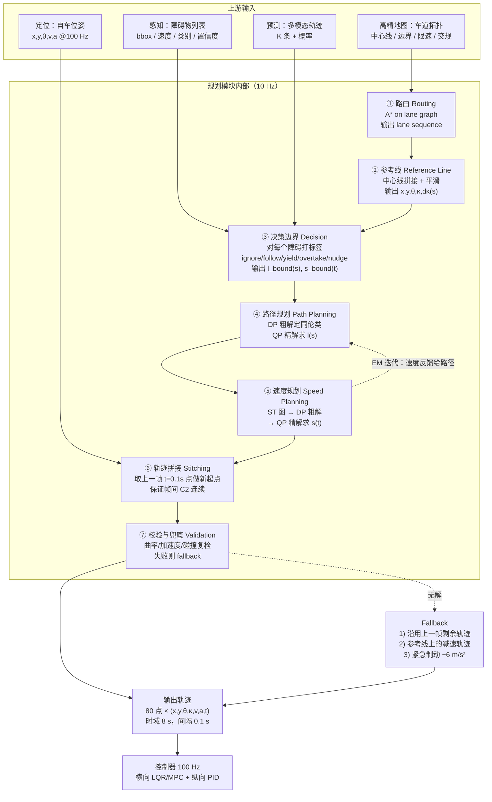
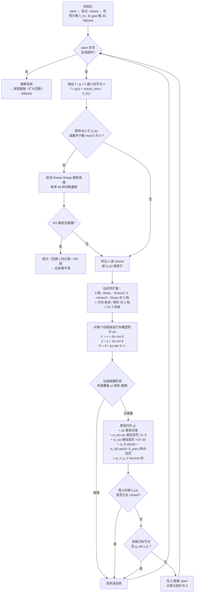

# 五、运动规划：在约束里给车找一条"好路"

## 0. 引言：那条八米宽的窄路，和二十秒的沉默

去年冬天，我跟着一辆 L4 试验车在老城区做夜间接管测试。那天气温零下三度，路面上化了一半的雪水结成一层灰黑色的薄冰，反射着两侧居民楼窗户漏出的暖光。我们走的是一条典型的城市"毛细血管"——名义上双向通行，实际路宽只有 8 米出头，两侧各停了一排车，有的车屁股还斜着支出去半米，可用的净宽被压到 4.2 米左右。车顶激光雷达转得飞快，风噪里能听见电机的嗡鸣。

晚上九点四十，车速 15 km/h，一辆送外卖的电动三轮车从前方三十米的巷口拐出来，迎面开过来。它压着路中间，车斗两侧还挂着鼓鼓囊囊的保温箱，整体宽度大概 1.3 米。人类司机遇到这种情况几乎不用思考：往左带半个方向盘，把车身贴到左边停车排的后视镜以外二十公分，速度降到 8 km/h，两车错开的瞬间左右各留 30 到 40 公分——整个过程三秒钟，连脚都不用离开油门太久。

我们的车不是这么做的。在距离三轮车还有 8 米的时候，它一脚重刹停死。仪表上的减速度峰值打到 −4.6 m/s²，我的肩膀被安全带勒得生疼，副驾架着的笔记本从腿上滑下去砸在脚垫上。然后，车就停在那儿不动了。前方那个三轮车师傅先是按了两下喇叭，见没反应，索性也停下来，隔着挡风玻璃朝我们比划。**整整十九秒**，规划模块没有输出任何一条新轨迹，屏幕上的候选轨迹列表是空的，状态机停在 `NO_VALID_TRAJECTORY`。最后是安全员踩了接管踏板，手动打了方向把车挪过去的。

回放日志的时候，问题看得很清楚。那一帧，规划器一共撒出了 400 多条候选轨迹，**全军覆没**：横向偏移小于 0.8 米的被判定与三轮车的膨胀包络相撞，横向偏移大于 0.8 米的又压到了左侧停车排的膨胀边界——两边的安全缓冲各留了 0.5 米，中间那条"人类司机每天走一百遍"的缝隙，在数值上宽 0.15 米，比车宽还窄。更要命的是，可行集为空之后，兜底策略（fallback）只有一条："沿用上一帧轨迹，若上一帧也失效则紧急制动"。于是车刹停了；刹停之后自车速度为 0，纵向采样出来的候选轨迹全都推进不足，加上对面三轮车持续被预测为"以 3 m/s 迎面接近"，ST 图上整个 s-t 平面被一块斜着的禁止区糊满，于是**下一帧依然无解**。系统就这样一帧一帧地重复着"无解 → 保持停车 → 依然无解"，把二十秒耗了进去。

这件事让我彻底改了对规划的看法。感知可以很聪明，预测可以很准，但真正考验工程功力的是规划——它要在 100 毫秒内，为一台重两吨、不能横着走、方向盘打满也只能转出 5 米半径、还带着几百毫秒执行时延的机器，在一堆互相打架的约束里，算出一条"走得了、坐得舒服、不会撞、而且下一帧还能接得上"的轨迹。**如果只追求可行，车会像醉汉一样扭来扭去；如果只追求安全，车就会像我们那晚一样，在马路中间原地怂住十九秒。** 而更隐蔽的一点是：那晚的车其实并没有"算错"，它老老实实地按照标定好的代价函数和安全缓冲，得出了唯一正确的结论——只是这套代价函数本身，从来没有为"错车"这个场景标定过。

这一章我们把规划从问题形式化拆到 Frenet 坐标系、车辆运动学、搜索、采样、速度规划、优化求解，再拆到交互建模与车规部署。所有数字都来自可复现的实验，第 7 节的代码你可以直接跑。

---

## 1. 核心概念

### 1.1 路径、轨迹，以及"好"到底是什么

先把两个天天被混用的词分开：

- **路径（path）**：只有几何形状 $(x, y)$ 或 $(x, y, \theta)$，没有时间维。它回答"往哪走"。
- **轨迹（trajectory）**：路径加上时间律，即 $(x, y, \theta, v, a, t)$，每个时刻车该在哪、速度多少。它回答"什么时候到哪"。

量产系统里我们**几乎总是要轨迹**，原因很实际：控制器需要速度前馈和加速度前馈；要跟车就得和前车抢时间；要过路口就得算清楚自己什么时候占用冲突区。只给路径的规划器，等于把速度决策甩锅给了控制器——而控制器看不见障碍物。

"好"这个字则要拆成四个互相冲突的维度：

| 维度 | 量化指标 | 典型阈值 | 冲突对象 |
| --- | --- | --- | --- |
| 安全（safety） | 最小间隙 $d_{\min}$、TTC、碰撞概率 | $d_{\min} \ge 0.3\ \text{m}$（城市低速）/ $\ge 0.8\ \text{m}$（高速） | 效率、舒适 |
| 舒适（comfort） | $\|a_{\text{lon}}\|$、$\|a_{\text{lat}}\|$、$\|j\|$ | $a_{\text{lat}} \le 1.8\ \text{m/s}^2$、$\|j\| \le 2.0\ \text{m/s}^3$ | 安全、效率 |
| 效率（efficiency） | 平均车速、时间损失、通行距离 | 不低于交通流速度的 85% | 安全、舒适 |
| 一致性（consistency） | 帧间轨迹偏差、决策翻转频率 | 帧间横向偏差 $< 2\ \text{cm}$、翻转 $< 0.2\ \text{Hz}$ | 最优性 |

这四个维度**不可能同时最优**。引言里那台车，是把安全权重推到极致后的必然产物。所以规划工程师真正的工作，不是"实现某个算法"，而是**给这四个维度找一组能上路的权衡系数**——第 7 节的 A/B 实验会把这一点用数字砸实。

### 1.2 规划问题的形式化

标准写法是一个带约束的最优控制问题（OCP, Optimal Control Problem）：

$$
\min_{u(\cdot)} \quad J = \Phi\big(x(t_f)\big) + \int_{t_0}^{t_f} L\big(x(t), u(t), t\big)\, dt
$$

约束：

$$
\begin{aligned}
\dot{x}(t) &= f\big(x(t), u(t)\big) && \text{(车辆动力学)} \\
x(t_0) &= x_0 && \text{(初值：来自定位 + 上一帧拼接点)} \\
g\big(x(t), t\big) &\le 0 && \text{(碰撞、车道边界、交规)} \\
u(t) &\in \mathcal{U} && \text{(执行器能力：转角、转角速率、驱动/制动)} \\
h\big(x(t)\big) &\le 0 && \text{(舒适：}|a_{\text{lat}}| \le a_{\text{lat}}^{\max},\ |j| \le j^{\max}\text{)}
\end{aligned}
$$

状态 $x = (x, y, \theta, v, a, \delta)$，控制 $u = (j, \dot{\delta})$（jerk 与转角速率）。这个问题有三个性质决定了它没法直接扔给通用求解器：

1. **非凸（non-convex）**：碰撞约束 $g(x, t) \le 0$ 的可行域是"全平面挖掉若干障碍物"，天然非凸。绕障碍物左走还是右走，是两个不连通的同伦类（homotopy class）。
2. **高维**：连续时间上离散成 80 个点（8 s / 0.1 s），每点 6 维状态 + 2 维控制，直接上就是 640 维决策变量。
3. **硬实时**：10 Hz 意味着 100 ms 硬截止，其中留给求解的通常只有 40~60 ms（要扣掉数据同步、参考线生成、后处理）。

工程上的破解思路只有一条：**降维 + 分层 + 凸化**。降维靠 Frenet 坐标系（第 2 节）；分层靠路径-速度解耦（第 1.3 节）；凸化靠先用 DP/搜索确定同伦类，再在同伦类内做 QP（第 6 节）。

### 1.3 两条技术路线：路径-速度解耦 vs 时空联合

这是规划领域最根本的一次分叉。

**路径-速度解耦（path-speed decoupling）**：先在 $s$-$l$ 平面上规划一条**路径** $l(s)$（不考虑时间），再在这条路径上规划**速度** $s(t)$。两步各自维度低，各自可以凸化。Apollo EM Planner、百度早期方案、绝大多数量产 NOA 走这条路。

**时空联合规划（spatio-temporal joint planning）**：直接在 $(s, l, t)$ 三维空间搜索/优化。理论上更优，但维度和非凸性都上一个台阶。

| 对比项 | 路径-速度解耦 | 时空联合规划 |
| --- | --- | --- |
| 决策变量维度 | $l(s)$: 约 60 维 + $s(t)$: 约 80 维（**分两次**） | $(l, s)(t)$: 约 160 维（**一次**） |
| 典型求解时间 | 8~25 ms（两次 QP，OSQP） | 40~200 ms（NLP / 分层 A* + 优化） |
| 凸化难度 | 每步都能构造凸走廊，容易 | 需三维时空走廊，构造复杂 |
| 能否处理"加速抢行" | **不能**。路径先定死，速度只能在这条路径上调 | 能。横纵同时权衡 |
| 能否处理"减速绕行" | 勉强。需要迭代 path→speed→path | 能，天然支持 |
| 动态障碍处理 | 靠 ST 图投影，横向信息被压扁 | 直接在 $(s,l,t)$ 里避让 |
| 窄路错车 | **弱**（引言那个场景的病根） | 强 |
| 代表实现 | Apollo EM Planner、Autoware OpenPlanner | Apollo Open Space Planner、部分 MPC 方案 |
| 可解释性 / 可调试 | 好：路径问题和速度问题能分开看 | 差：一个大黑箱 |

**为什么量产还是以解耦为主？** 三个现实原因：一是求解时间稳定，尾延迟可控（这一点在车规系统里比"平均更优"重要得多）；二是失效模式可定位——路径炸了还是速度炸了，一眼能看出来；三是标定成本低，两套权重各自独立。时空联合的优势在低速、强交互的场景（窄路、无保护左转、环岛），所以现在的主流是**混合架构**：常规场景走解耦，识别到强交互场景时切到联合规划或 Open Space。

> **工程数字与坑**
> 解耦方案里最容易被忽略的一个环节是"path 和 speed 之间的迭代"。Apollo EM Planner 的 EM 是 Expectation-Maximization 的意思——它会做 `path → speed → path → speed` 至少两轮。只做一轮的实现，在"前车缓慢右移让路"这类场景里会持续输出减速指令，因为第一轮 path 是按前车当前位置绕的，第二轮才知道其实不用绕。

### 1.4 规划模块在整条链路里的位置



这张图里有三个容易被忽略的细节：

1. **参考线不是地图中心线**。地图中心线是分段折线，曲率不连续，直接拿来做 Frenet 基准会让 $\kappa_r$ 出现阶跃，进而污染横向 jerk。必须先平滑（第 2.2 节）。
2. **决策边界在路径规划之前**。"绕左还是绕右"是**离散决策**，不能交给连续优化去解——非凸问题的局部最优会让它随机跳。先定同伦类，再优化，这是整个架构的关键。
3. **拼接点不是当前定位点**。用定位点做起点会把定位噪声直接注入轨迹，导致帧间抖动。正确做法见第 6.10 节，第 7 节有实测数字。

### 1.5 关键工程数字速查

| 参数 | 典型值 | 说明 |
| --- | --- | --- |
| 规划频率 | 10 Hz（周期 100 ms） | 部分低速方案 5 Hz，高速 NOA 有做到 20 Hz |
| 求解预算 | 40~60 ms | 100 ms 减去同步、参考线、后处理、发布 |
| 轨迹时域 | 城市 5~8 s / 高速 8~12 s | 需覆盖当前速度下 3~5 秒的制动距离 |
| 轨迹点间隔 | 0.1 s（时间）/ 0.2~0.5 m（空间） | 与控制器插值方式匹配 |
| 轨迹点数 | 60~120 | 直接决定 QP 规模 |
| 参考线长度 | 前向 150~250 m，后向 30 m | 后向段供拼接与投影用 |
| 参考线离散 | 0.1~0.5 m | 太密拖慢查询，太疏曲率失真 |
| 最大曲率 $\kappa_{\max}$ | 0.20 1/m（$R_{\min}=5$ m，乘用车） | 低速泊车才用得到，高速受横向加速度先约束 |
| 曲率变化率 $\dot\kappa_{\max}$ | 0.10~0.20 1/m/s | 由方向盘最大转速反推 |
| 纵向加速度 | $[-4.0,\ +2.0]\ \text{m/s}^2$ | 紧急制动可到 $-6 \sim -8$ |
| 横向加速度 | 舒适 $\le 1.8$，上限 $2.5\ \text{m/s}^2$ | 高速上是曲率的实际约束者 |
| 纵向 jerk | 舒适 $\le 2.0$，上限 $4.0\ \text{m/s}^3$ | 人对 jerk 比对 a 更敏感 |
| 横向 jerk | $\le 3.0\ \text{m/s}^3$ | 决定"甩头感" |
| 安全缓冲 | 纵向 0.5 m / 横向 0.3 m（低速） | 高速横向 0.5~1.0 m |
| 控制频率 | 100 Hz | 规划的 10 倍，靠插值取点 |

---

## 2. Frenet 坐标系：把弯道"拉直"

### 2.1 为什么不用 $x$-$y$ 而用 $s$-$l$

在笛卡尔系里描述"我要保持在车道中间"，你得写成一个到某条曲线的距离约束——这条曲线是三次样条，约束是非线性的。而在 Frenet 系里，同样一句话就是 $l \approx 0$，**线性**。

Frenet 系（也叫 SL 系、道路坐标系）以参考线为基准：

- $s$：沿参考线的**弧长**（station / longitudinal），车往前开 $s$ 增大；
- $l$：垂直参考线的**横向偏移**（lateral，Apollo 里叫 $d$），左正右负（也有反过来定义的，团队内统一即可）。

这个变换带来四个直接好处：

| 好处 | 笛卡尔系下的表达 | Frenet 系下的表达 |
| --- | --- | --- |
| 车道保持 | 到样条曲线的最小距离 $\le \epsilon$，非线性 | $\|l\| \le \epsilon$，**线性盒约束** |
| 车道边界 | 两条任意形状曲线之间，非凸 | $l_{\text{low}}(s) \le l \le l_{\text{high}}(s)$，**凸** |
| 跟车距离 | $\sqrt{(x-x_o)^2+(y-y_o)^2}$，非线性 | $s_o - s \ge d_{\text{safe}}$，**线性** |
| 问题解耦 | $x,y$ 强耦合 | $l(s)$ 管横向，$s(t)$ 管纵向，可分离 |

一句话总结：**Frenet 变换把"道路的弯"吸收进了坐标系，剩下的问题就近似成了直路。**

### 2.2 参考线：一切的地基

参考线质量直接决定规划质量，它是整章最容易被低估的环节。原始地图中心线的问题：

- **曲率不连续**：地图常以折线或分段圆弧存储，接缝处 $\kappa$ 阶跃；
- **采样不均**：直线段可能 10 m 一个点，弯道 0.5 m 一个点；
- **横向抖动**：采集轨迹平滑得不够，厘米级锯齿在二阶导下被放大成巨大的曲率噪声。

第三点尤其致命。设中心线上有幅值 $A = 2\ \text{cm}$、波长 $\lambda = 2\ \text{m}$ 的正弦锯齿：

$$
y(s) = A \sin\!\Big(\frac{2\pi s}{\lambda}\Big)
\quad\Longrightarrow\quad
\kappa \approx y'' = -A \Big(\frac{2\pi}{\lambda}\Big)^2 \sin\!\Big(\frac{2\pi s}{\lambda}\Big)
$$

$$
|\kappa|_{\max} = 0.02 \times \Big(\frac{2\pi}{2}\Big)^2 = 0.02 \times 9.87 = 0.197\ \text{1/m}
$$

**2 厘米的锯齿，产生了 0.197 1/m 的曲率**——已经顶到乘用车 $\kappa_{\max}=0.20$ 的上限，等价于 5 米转弯半径。二阶微分是噪声放大器，$\lambda$ 减半噪声放大 4 倍。这就是为什么参考线必须做**离散点优化平滑**。

工程上常用的平滑目标（Apollo 的 `DiscretePointsReferenceLineSmoother`）：

$$
\min_{\{p_i\}} \sum_{i=1}^{n-2} w_s \big\| p_{i+1} - 2p_i + p_{i-1} \big\|^2
+ \sum_{i=0}^{n-1} w_r \big\| p_i - p_i^{\text{ref}} \big\|^2
+ \sum_{i=0}^{n-2} w_l \big\| p_{i+1} - p_i \big\|^2
$$

三项含义：

- **平滑项** $w_s$：二阶差分，直接压 $\kappa$，是主力；
- **贴合项** $w_r$：别跑偏离原中心线太远；
- **长度项** $w_l$：让点分布均匀，防止优化把点挤成一堆。

配上盒约束 $\|p_i - p_i^{\text{ref}}\|_\infty \le b_i$（$b_i$ 典型 0.1~0.5 m，路口处收紧），这是一个标准 QP，2000 个点在 OSQP 上约 3~8 ms。

**权重量级参考**：$w_s : w_r : w_l = 1000 : 1 : 1$。平滑权重必须压倒性地大，否则贴合项会把锯齿"贴"回来。

### 2.3 Cartesian → Frenet：投影与推导

给定笛卡尔状态 $(x, y, \theta, v, a, \kappa)$，求 Frenet 状态 $(s, \dot s, \ddot s, l, l', l'')$。

**第一步：找投影点。** 在参考线上求 $s^*$ 使得

$$
s^* = \arg\min_s \big\| \mathbf{p} - \mathbf{r}(s) \big\|^2
$$

一阶条件 $\big(\mathbf{p} - \mathbf{r}(s)\big) \cdot \mathbf{r}'(s) = 0$，即**连线垂直于切线**。工程上先在离散点上暴力找最近点，再用两三步牛顿迭代精化：

$$
s_{k+1} = s_k - \frac{\big(\mathbf{p} - \mathbf{r}(s_k)\big) \cdot \mathbf{r}'(s_k)}{-\|\mathbf{r}'(s_k)\|^2 + \big(\mathbf{p} - \mathbf{r}(s_k)\big) \cdot \mathbf{r}''(s_k)}
$$

**第二步：横向偏移（带符号）。**

$$
l = \big(\mathbf{p} - \mathbf{r}(s^*)\big) \cdot \mathbf{n}_r,
\qquad \mathbf{n}_r = (-\sin\theta_r,\ \cos\theta_r)
$$

**第三步：导数关系。** 记 $\Delta\theta = \theta - \theta_r$。自车速度沿切向、法向分解：

$$
\dot s \,(1 - \kappa_r l) = v \cos \Delta\theta,
\qquad
\dot l = v \sin \Delta\theta
$$

第一式左边的 $(1 - \kappa_r l)$ 是**关键**：偏离参考线 $l$ 之后，走过同样的角度对应的弧长不一样了。在曲率半径 $R = 1/\kappa_r$ 的弯道内侧（$l$ 与曲率中心同侧），实际弧长比参考线短，因子恰是 $(1 - \kappa_r l)$。所以

$$
\boxed{\ \dot s = \frac{v \cos \Delta\theta}{1 - \kappa_r l}\ }
$$

对 $s$ 求导（注意 $l' = dl/ds$ 而非 $dl/dt$）：

$$
l' = \frac{dl/dt}{ds/dt} = \frac{v \sin\Delta\theta}{\dfrac{v\cos\Delta\theta}{1-\kappa_r l}} = (1 - \kappa_r l)\tan\Delta\theta
$$

再求一次导得二阶项：

$$
l'' = -\big(\kappa_r' l + \kappa_r l'\big)\tan\Delta\theta
+ \frac{1 - \kappa_r l}{\cos^2 \Delta\theta}\left(\frac{\kappa (1 - \kappa_r l)}{\cos\Delta\theta} - \kappa_r\right)
$$

这三个式子（$\dot s$、$l'$、$l''$）就是 Cartesian→Frenet 的完整转换，是 Werling 2010 那篇经典论文的标准结果。

### 2.4 Frenet → Cartesian：曲率修正项

反向变换更常用——采样出的 $l(s)$、$s(t)$ 必须变回笛卡尔才能校验曲率、发给控制器。

位置和航向是直接的：

$$
\begin{aligned}
x &= x_r - l \sin\theta_r, \qquad y = y_r + l \cos\theta_r \\
\Delta\theta &= \arctan\!\frac{l'}{1 - \kappa_r l}, \qquad \theta = \theta_r + \Delta\theta
\end{aligned}
$$

速度由 $\dot s$ 反解：

$$
v = \dot s \sqrt{(1 - \kappa_r l)^2 + l'^2}
$$

**曲率**是最容易写错的一项。从 $l''$ 的表达式反解 $\kappa$：

$$
\boxed{\ \kappa = \left[\frac{\big(l'' + (\kappa_r' l + \kappa_r l')\tan\Delta\theta\big)\cos^2\Delta\theta}{1 - \kappa_r l} + \kappa_r\right] \frac{\cos\Delta\theta}{1 - \kappa_r l}\ }
$$

这个式子长，但每一项都有物理意义：

- $\kappa_r$：**基准项**——你贴着参考线走，曲率就是参考线曲率；
- $\dfrac{l'' \cos^2\Delta\theta}{1-\kappa_r l}$：**横向机动项**——你在横向做多项式变道，自然产生额外曲率；
- $(\kappa_r' l + \kappa_r l')\tan\Delta\theta$：**耦合修正项**——参考线曲率在变（$\kappa_r' \ne 0$）、你又在横向移动（$l' \ne 0$）时的交叉影响；
- 外层的 $\dfrac{\cos\Delta\theta}{1-\kappa_r l}$：**坐标缩放**——把"每单位 $s$ 的转角"换算成"每单位实际弧长的转角"。

加速度同理：

$$
a = \frac{\ddot s\,(1-\kappa_r l)}{\cos\Delta\theta}
+ \frac{\dot s^2}{\cos\Delta\theta}\left[ l'\left(\frac{\kappa (1-\kappa_r l)}{\cos\Delta\theta} - \kappa_r\right) - (\kappa_r' l + \kappa_r l') \right]
$$

**漏掉修正项会怎样？** 假设 $\kappa_r = 1/240 = 0.004167$，$l = 2.0\ \text{m}$，只用 $\kappa \approx \kappa_r + l''$：

$$
\text{缩放因子} = \frac{1}{1 - \kappa_r l} = \frac{1}{1 - 0.004167 \times 2} = \frac{1}{0.99167} = 1.0084
$$

只有 0.84% 误差，看着没事。但换成城市小转弯 $R = 15\ \text{m}$（$\kappa_r = 0.0667$），$l = 2.0$：

$$
\frac{1}{1 - 0.0667 \times 2} = \frac{1}{0.8667} = 1.154 \quad \Rightarrow \quad \textbf{15.4\% 误差}
$$

15% 的曲率误差意味着控制器算出的前馈转角差 15%，在 R=15 m 的弯里这是半米以上的横向跟踪偏差。**曲率修正项在城市工况下是必须的，不是可选的。**

### 2.5 Frenet 的失效边界：高曲率畸变

Frenet 变换有一个数学上的奇点：当 $l \to 1/\kappa_r$ 时 $(1 - \kappa_r l) \to 0$，$\dot s \to \infty$。物理意义是**你正好站在曲率中心上**，此时"沿参考线前进"这个概念失效。

| 参考线曲率半径 $R$ | $\kappa_r$ (1/m) | $l = 2$ m 时缩放因子 | 备注 |
| --- | --- | --- | --- |
| 1000 m（高速缓弯） | 0.001 | 1.002 | 可忽略修正 |
| 240 m（快速路弯） | 0.004167 | 1.008 | 本章实验场景 |
| 100 m（城市主干） | 0.010 | 1.020 | 建议开修正 |
| 30 m（路口转弯） | 0.033 | 1.071 | 必须开修正 |
| 15 m（小转弯） | 0.067 | 1.154 | 必须开，且需限 $\|l\|$ |
| 5 m（掉头 / 泊车） | 0.200 | 1.667 | **Frenet 不适用** |
| 2.5 m | 0.400 | $l=2.5$ 时 $\to\infty$ | 奇点 |

工程上的三条防线：

1. **数值兜底**：代码里强制 `omk = max(1 - kappa_r * l, 1e-3)`，防止除零（见第 7 节代码 `frenet_to_cartesian`）。
2. **限制 $|l|$**：要求 $|\kappa_r l| < 0.3$，即 $|l| < 0.3 / |\kappa_r|$。$R = 15$ m 时 $|l| < 4.5$ m，还够用；$R = 5$ m 时 $|l| < 1.5$ m，已经很紧。
3. **换坐标系**：低速大转向场景（泊车、掉头、无保护调头）直接切到笛卡尔系下的 Hybrid A* + Open Space 优化。Apollo 就是这么分工的。

还有一个隐蔽问题：**同一个障碍物在 Frenet 系下会"变形"**。一辆车在笛卡尔系是矩形，投影到弯道 Frenet 系后是一个"弯曲的四边形"。用轴对齐矩形（AABB）近似会偏保守（弯道外侧多占）或偏危险（内侧少占）。常见做法是把障碍物**离散成多个圆盘**再投影，或者直接在笛卡尔系下做碰撞检测（把轨迹点变回去），后者更准但更慢。

### 2.6 参考线数值验证

第 7 节代码里的参考线不是手写公式凑的，而是按公路线形标准**由设计曲率积分出来**的：直线 → 缓和曲线 → 圆曲线 → 缓和曲线 → 直线。缓和段用升余弦而不是线性回旋线，为的是让 $d\kappa/ds$ 也连续（C2 参考线）：

$$
\kappa_{\text{design}}(s) = \begin{cases}
0, & s < 20 \\
\frac{\kappa_{\max}}{2}\Big(1 - \cos\frac{\pi(s-20)}{30}\Big), & 20 \le s < 50 \\
\kappa_{\max}, & 50 \le s < 90 \\
\frac{\kappa_{\max}}{2}\Big(1 + \cos\frac{\pi(s-90)}{30}\Big), & 90 \le s < 120 \\
0, & s \ge 120
\end{cases}
$$

然后积分 $\theta(s) = \int_0^s \kappa\,d\sigma$、$(x,y) = \int_0^s (\cos\theta, \sin\theta)\,d\sigma$ 得到坐标点。再把这些点喂给 `ReferenceLine` 类，用数值微分**重新算一遍曲率**，跟设计值对比。实测：

```
[参考线] |kappa_r|max = 0.004167 1/m  (R_min = 240.0 m)
[参考线] |dkappa_r|max = 2.181024e-04 1/m^2
[参考线] 数值重建曲率 vs 设计曲率  max|误差| = 4.566e-07 1/m  (相对 0.0110%)
```

0.011% 的重建误差，说明"离散点 + 三点滑动平均 + `np.gradient`"这一套在 $ds = 0.2$ m 下是可靠的。**这个自检值得在你自己的项目里做一遍**——很多参考线 bug 就是数值微分的精度问题，不做对拍根本发现不了。

---
## 3. 车辆运动学：车不能横着走

### 3.1 自行车模型（bicycle model）

把四轮车简化成两轮：前轮负责转向，后轮固定。以**后轴中心**为参考点（这是关键选择，后面会解释为什么）：

$$
\begin{aligned}
\dot{x} &= v \cos\theta \\
\dot{y} &= v \sin\theta \\
\dot{\theta} &= \frac{v}{L}\tan\delta \\
\dot{v} &= a
\end{aligned}
$$

其中 $L$ 是轴距（wheelbase，乘用车典型 2.6~3.0 m），$\delta$ 是前轮转角。

**曲率由此直接得出**：

$$
\kappa = \frac{\dot\theta}{v} = \frac{\tan\delta}{L}
$$

这个式子非常漂亮——**曲率只跟前轮转角有关，与车速无关**。这是纯运动学模型的核心结论，也是它在低速下极准、在高速下失效的原因（高速时轮胎侧偏角不可忽略，需要动力学自行车模型）。

**为什么以后轴中心为参考点？** 因为后轴中心的速度方向恒等于车身航向 $\theta$（后轮不转向，无侧滑假设下只能沿车身纵向滚动）。如果以前轴或质心为参考点，速度方向与航向之间就有一个夹角（侧偏角 $\beta$），公式会多出一堆项。规划输出的轨迹以后轴中心表达，控制器实现也以后轴为准，这是行业惯例。

**误差量级**：纯运动学模型在 $a_{\text{lat}} < 3\ \text{m/s}^2$ 时误差 < 5%；超过 4 m/s² 后轮胎侧偏显著，横向位置预测误差可到 0.3 m 以上。规划阶段用运动学模型足够（因为我们本来就把 $a_{\text{lat}}$ 约束在 2.5 以下），控制阶段则常用动力学模型。

### 3.2 最小转弯半径、曲率与曲率变化率

**最小转弯半径**：

$$
R_{\min} = \frac{L}{\tan \delta_{\max}}
$$

取 $L = 2.8\ \text{m}$、$\delta_{\max} = 33° = 0.576\ \text{rad}$：

$$
R_{\min} = \frac{2.8}{\tan 33°} = \frac{2.8}{0.6494} = 4.31\ \text{m}
\quad\Rightarrow\quad
\kappa_{\max} = 0.232\ \text{1/m}
$$

这是后轴中心的转弯半径。厂商标称的"最小转弯直径 11 m"通常指**外侧前轮**的轨迹圆直径，两者差一个车身宽度加前悬，别搞混。

**曲率变化率**（curvature rate）：对 $\kappa = \tan\delta / L$ 求时间导数：

$$
\dot\kappa = \frac{\dot\delta}{L\cos^2\delta}
$$

而 $\dot\kappa$ 与空间导数 $\kappa' = d\kappa/ds$ 的关系是 $\dot\kappa = v \kappa'$。所以：

$$
\kappa' = \frac{\dot\delta}{v L \cos^2\delta}
$$

方向盘最大转速受电机限制，典型 $\dot\delta_{\max} \approx 0.35\ \text{rad/s}$（方向盘端约 400°/s，转向比 16:1）。在 $\delta \approx 0$、$v = 12\ \text{m/s}$ 时：

$$
\kappa'_{\max} = \frac{0.35}{12 \times 2.8 \times 1} = 0.0104\ \text{1/m}^2
$$

**注意这里的速度反比关系**：车速越高，同样的方向盘转速能产生的空间曲率变化率越小。所以高速下轨迹必须更"直"，这是物理限制，不是保守。反过来，$v \to 0$ 时 $\kappa'_{\max} \to \infty$，意味着**静止时可以原地打方向**——但实际上原地转向对轮胎和转向系统伤害极大，量产系统会禁止（要求 $v > 0.3\ \text{m/s}$ 才允许大幅转向）。这条约束在泊车规划里非常关键：Reeds-Shepp 曲线假设可以在换挡点瞬间改变曲率，实车做不到，必须在换挡点插入"停车 + 打方向"的时间。

### 3.3 非完整约束（non-holonomic constraint）的几何本质

车不能横着走。数学上写作：

$$
\dot{x}\sin\theta - \dot{y}\cos\theta = 0
$$

这个约束**只限制速度方向，不限制可达位置**——车可以通过多次挪库到达任意 $(x, y, \theta)$。这类"约束方程不可积分成位置约束"的情况叫非完整约束。

它的实际后果是：**状态空间是 3 维 $(x, y, \theta)$，但控制只有 2 维 $(v, \delta)$**。你不能独立指定横向位移，只能通过"先转向、再前进"的组合间接实现。这就是为什么：

- **纯几何路径规划（如 2D A*）产生的路径通常不可跟踪**——它允许 90° 拐角，实车过不去；
- **必须用运动学可行的基元（motion primitive）来扩展搜索**，这是 Hybrid A* 的核心思想；
- **变道不能是瞬时的**，横向 3.5 m 位移在 $\kappa \le 0.01$ 约束下至少需要 $\sqrt{8 \times 3.5 / 0.01} \approx 53$ m 的纵向距离（用 $l \approx \frac{1}{2}\kappa s^2$ 双段近似估算）。

### 3.4 Dubins 与 Reeds-Shepp：最短路径的解析解

在"曲率有界、速度恒定"的假设下，两点间最短路径有解析形式。

**Dubins 曲线（只能前进）**：Dubins 1957 年证明，最优解必然是以下 6 种组合之一，每种由不超过 3 段构成，每段是**最大曲率左转（L）、最大曲率右转（R）、或直线（S）**：

$$
\{\ LSL,\ RSR,\ LSR,\ RSL,\ LRL,\ RLR\ \}
$$

前四种是 CSC 型（Curve-Straight-Curve），后两种是 CCC 型（三段圆弧）。**CCC 型只在起终点距离小于约 $4 R_{\min}$ 时才可能最优**。

**Reeds-Shepp 曲线（可倒车）**：Reeds & Shepp 1990 年把 Dubins 推广到允许倒车，最优解集扩展到 **48 种词（word）**，由 **6 类基元模式** 生成：

| 基元类 | 记号 | 含义 | 典型用途 |
| --- | --- | --- | --- |
| ① CSC | $C\|S\|C$ 无换挡 | 弧-直-弧，同向 | 大范围转移，等价 Dubins |
| ② CCC | $C\|C\|C$ | 三段弧 | 中距离、大角度调整 |
| ③ CCCC | $CC\|CC$ | 四段弧，中间对称换挡 | 小范围大角度调头 |
| ④ CCSC | $C\|CS\|C$ | 弧-弧-直-弧 | 侧方停车典型解 |
| ⑤ CCSCC | $C\|CS\|CC$ | 五段 | 极窄空间 |
| ⑥ CSCC | $CS\|CC$ | ④ 的镜像 | 侧方停车反向 |

记号里的 `|` 表示**换挡点**（前进↔倒车切换）。工程上，换挡次数是一个重要代价——每次换挡实车要停顿约 1.5~2.5 s（挂挡 + 打方向），所以代价函数里换挡惩罚通常给得很重（Apollo 里 `gear_switch_penalty` 是单位长度代价的 10~20 倍）。

**两者对比**：

| 对比项 | Dubins | Reeds-Shepp |
| --- | --- | --- |
| 是否允许倒车 | 否 | 是 |
| 解的类型数 | 6 种词 | 48 种词 / 6 类基元 |
| 路径长度 | 总是 $\ge$ RS | 总是 $\le$ Dubins |
| 计算耗时 | ~2 μs（枚举 6 种取最短） | ~10 μs（枚举 48 种） |
| 典型用途 | 高速换道终点连接、无人机 | 泊车、掉头、Hybrid A* 终点解析扩展 |
| 实车可行性 | 好（不换挡） | 需处理换挡停顿与曲率突变 |

**一个必须注意的坑**：Dubins/RS 曲线在弧段与直线段的接缝处**曲率是阶跃的**（从 $\kappa_{\max}$ 突变到 0）。实车方向盘转不了那么快，所以这类曲线**不能直接作为最终轨迹**，只能作为搜索的启发式或初值，后面必须接一层平滑优化（用回旋线 clothoid 或多项式过渡）。Hybrid A* 的最后一步 RS 解析扩展就是这个定位——它给出的是"拓扑可行"的连接，不是"可跟踪"的轨迹。

---

## 4. 搜索法：Dijkstra → A\* → Hybrid A\*

### 4.1 代价地图与膨胀层

搜索类算法都跑在离散化的**代价地图（costmap）**上。核心是**膨胀层（inflation layer）**：把障碍物按自车半径膨胀，从而把"车是个矩形"的问题简化成"车是个点"。

膨胀代价通常用指数衰减：

$$
c(d) = \begin{cases}
c_{\text{lethal}} = 254, & d \le r_{\text{ego}} \quad \text{(致命区，绝对不可进)} \\
(c_{\text{lethal}} - 1)\, e^{-\alpha (d - r_{\text{ego}})}, & r_{\text{ego}} < d \le r_{\text{inflate}} \quad \text{(衰减区)} \\
0, & d > r_{\text{inflate}}
\end{cases}
$$

参数量级：$r_{\text{ego}} = 1.2\ \text{m}$（外接圆半径，对 4.7×1.9 的车约 $\sqrt{2.35^2+0.95^2}=2.53$ m，但用内切+多圆近似可降到 1.2）、$r_{\text{inflate}} = 2.5\ \text{m}$、$\alpha = 3.0$。

**膨胀半径的两难**：

| 膨胀半径 | 后果 |
| --- | --- |
| 太大（> 2 m） | 窄路直接无解——**这就是引言那个场景的直接病因** |
| 太小（< 0.5 m） | 搜索出的路径贴墙，后续优化没有腾挪空间，容易失败 |
| 分级膨胀 | 致命区用内切圆（保证绝对安全）+ 衰减区用外接圆（鼓励远离），是主流做法 |

**分辨率选择**：城市结构化道路 0.2~0.5 m；泊车场景 0.05~0.1 m。分辨率减半，2D 栅格数量翻 4 倍，Hybrid A* 的三维状态格翻 8 倍（还要乘角度维）。这是搜索类方法最大的成本项。

### 4.2 Dijkstra 与 A\*：可采纳性与一致性

Dijkstra 从起点向外均匀扩展，保证最优但盲目。A\* 加一个启发式 $h(n)$ 估计"从 $n$ 到终点的剩余代价"，用 $f(n) = g(n) + h(n)$ 排序开放列表。

**可采纳性（admissibility）**：

$$
\forall n:\quad h(n) \le h^*(n)
$$

$h^*$ 是真实最优剩余代价。**可采纳 $\Rightarrow$ A\* 找到的解是最优解**。

*证明速写*：设 A\* 弹出了次优目标 $G_2$（$g(G_2) > C^*$）。在最优路径上必存在一个已在开放列表中的节点 $n$，满足 $g(n) + h(n) \le g(n) + h^*(n) = C^*$（第一个不等号用可采纳性）。于是 $f(n) \le C^* < g(G_2) = f(G_2)$，$n$ 应当先于 $G_2$ 被弹出，矛盾。$\square$

**一致性（consistency / 单调性）**：

$$
\forall (n, n'):\quad h(n) \le c(n, n') + h(n')
\qquad\text{且}\qquad h(\text{goal}) = 0
$$

这是三角不等式的形式。**一致 $\Rightarrow$ 可采纳**（沿最优路径逐段累加即得）。一致性的额外好处是：**每个节点只需要被展开一次**，闭列表里的节点不用重新打开。不一致但可采纳的启发式仍能保证最优，但可能反复重开节点，退化成指数复杂度。

| 启发式 | 可采纳 | 一致 | 适用 |
| --- | --- | --- | --- |
| $h = 0$ | 是 | 是 | 退化为 Dijkstra |
| 欧氏距离 | 是（8 邻域） | 是 | 通用 |
| 曼哈顿距离 | 4 邻域是；8 邻域**否** | — | 只能 4 邻域 |
| 对角距离（Chebyshev + 修正） | 8 邻域是 | 是 | 8 邻域网格首选 |
| $\epsilon \cdot h_{\text{欧氏}}$（$\epsilon>1$） | **否** | 否 | Weighted A*，解在 $\epsilon$ 倍最优内，但快 5~50 倍 |
| Dubins 长度 | 是（对曲率受限车） | 是 | Hybrid A* 的启发式之一 |

**Weighted A\* 的工程价值**：把 $\epsilon$ 设为 1.5~3.0，展开节点数常常下降一个数量级，路径长度只差 10%~30%。在硬实时系统里，"3 倍快、10% 次优"几乎总是划算的。ARA\*（Anytime Repairing A\*）更进一步：先用大 $\epsilon$ 快速出解，剩余时间内逐步减小 $\epsilon$ 改进，随时可以被打断取当前最优解。

### 4.3 Hybrid A\*：把连续状态塞进离散格

普通 A\* 的致命问题：它在栅格中心之间跳转，产生的路径含 45°/90° 折角，**不满足非完整约束**。

Hybrid A\*（Dolgov & Thrun, 2008，DARPA Urban Challenge 冠军方案）的核心改动：

1. **状态是连续的**：节点存 $(x, y, \theta)$ 的**连续值**，不是格心；
2. **扩展用运动学基元**：从当前状态出发，取 $\delta \in \{-\delta_{\max}, 0, +\delta_{\max}\}$（或更细的 5~7 档）× 方向 $\{$前进, 倒车$\}$，按自行车模型积分固定弧长 $\Delta s$（典型 = 1.5 × 格子对角线，保证一步至少跨一格）；
3. **格子只用于剪枝**：每个 $(i, j, k)$ 格（$k$ 是航向离散，典型 72 档 = 5°/档）只保留代价最低的那个连续状态。

这一改动让搜索出的路径**天然可跟踪**。代价是状态空间从 2D 变成 3D，节点数暴涨。

**扩展步长的坑**：$\Delta s$ 太小会导致新状态落回同一个格子，被自己剪掉，搜索原地打转；太大会跳过窄缝。经验规则 $\Delta s \ge \sqrt{2} \cdot \text{grid}$，通常取 $1.5 \sim 2.0 \times \text{grid}$。

### 4.4 双启发式：Hybrid A\* 真正的秘密

Hybrid A\* 用**两个启发式取最大值**，这是它比朴素实现快 10~100 倍的关键：

$$
h(n) = \max\big( h_{\text{nh-nc}}(n),\ h_{\text{h-c}}(n) \big)
$$

| 启发式 | 全称 | 考虑什么 | 忽略什么 | 计算方式 | 擅长纠正 |
| --- | --- | --- | --- | --- | --- |
| $h_{\text{nh-nc}}$ | non-holonomic without obstacles | 车辆运动学、航向 | 障碍物 | Reeds-Shepp 解析长度，可离线查表 | "开过头了要倒回来"、终点航向不对 |
| $h_{\text{h-c}}$ | holonomic with obstacles | 障碍物、绕行 | 运动学、航向 | 从终点做一次 2D Dijkstra，全图 | "前面是死胡同"、U 型障碍 |

两者互补得非常巧妙：

- 只用 $h_{\text{nh-nc}}$：车会一头扎进 U 型死胡同，因为它不知道有障碍；
- 只用 $h_{\text{h-c}}$：车会开到终点旁边才发现航向不对，然后疯狂挪库；
- 取 max：既避开死胡同，又提前调整航向。

两者都可采纳（各自都是真实代价的下界），取 max 后仍然可采纳。

**第三个组件：Voronoi 场（Voronoi field）**。它不是启发式，而是**代价项**，用于让路径在通道中间走：

$$
\rho_V(x,y) = \frac{\alpha}{\alpha + d_{\mathcal{O}}}\cdot\frac{d_{\mathcal{V}}}{d_{\mathcal{O}} + d_{\mathcal{V}}}\cdot\frac{(d_{\mathcal{O}} - d_{\max})^2}{d_{\max}^2}
$$

其中 $d_{\mathcal{O}}$ 是到最近障碍的距离，$d_{\mathcal{V}}$ 是到广义 Voronoi 图（通道中轴线）的距离。这个场的妙处是：**它在窄通道里会自动放松**——通道越窄，$d_{\mathcal{O}}$ 和 $d_{\mathcal{V}}$ 同时变小，代价不会爆炸。相比之下，纯"离障碍物距离"的代价在窄通道里会把所有路径都惩罚成天价，导致搜索失败。**引言那个窄路场景，如果用了 Voronoi 场，结果可能完全不同。**

**第四个组件：终点 RS 解析扩展**。每展开 $N$ 个节点（典型 $N = 5 \sim 20$，或按到终点距离自适应），就尝试用一条 Reeds-Shepp 曲线直连终点，做碰撞检测；若无碰撞则直接结束搜索。这一招把最后"精确对准终点航向"的搜索开销从几千节点降到一次解析计算，是泊车规划提速的关键。

### 4.5 Hybrid A\* 一次迭代的完整流程



**每一步的实测量级**（0.1 m 分辨率、40×40 m 停车场、72 档航向）：

| 环节 | 单次耗时 | 一次完整搜索 |
| --- | --- | --- |
| 预计算 $h_{\text{h-c}}$（2D Dijkstra） | — | 8~20 ms（160k 格） |
| 弹出 + 扩展 10 个后继 | ~15 μs | — |
| 碰撞检测（多圆，3~5 圆 × 10 后继） | ~8 μs | — |
| RS 解析扩展（48 词 + 碰撞检查） | ~120 μs | 触发 50~300 次 |
| **展开节点总数** | — | 3k ~ 50k |
| **总耗时** | — | **60~400 ms** |

注意这个总耗时——**Hybrid A\* 在 100 ms 的规划周期里跑不完**。所以它的实际用法是：只在泊车、脱困这类**低速非结构化场景**里用，而且允许"多帧完成一次规划"（规划期间车保持静止或极低速）。结构化道路的 10 Hz 主循环从来不用 Hybrid A\*。

---
## 5. 采样法：Lattice 与 RRT 家族

### 5.1 横向五次多项式：为什么是五次

在 Frenet 系里规划横向轨迹 $l(s)$，我们希望起点和终点各自指定**位置、一阶导、二阶导**三个量：

- 起点 $(l_0, l_0', l_0'')$：来自上一帧拼接点，保证帧间 C2 连续；
- 终点 $(l_1, l_1', l_1'')$：目标横向偏置，一般取 $(l_{\text{end}}, 0, 0)$——即"到位后平行于参考线且不再横摆"。

**6 个约束 $\Rightarrow$ 至少 5 次多项式**（6 个系数）：

$$
l(s) = a_0 + a_1 s + a_2 s^2 + a_3 s^3 + a_4 s^4 + a_5 s^5
$$

为什么非要约束到二阶导？因为 $l''$ 直接进入曲率公式（第 2.4 节），$l''$ 不连续 $\Rightarrow$ 曲率不连续 $\Rightarrow$ 方向盘要瞬间跳一个角度 $\Rightarrow$ 实车做不到，跟踪必然超调。**这就是"五次"的物理来源，不是随便选的。**

而三阶导 $l'''$ 与横向 jerk 相关，五次多项式的 $l'''$ 是二次函数，虽然不能在端点指定，但至少是连续的。这已经足够。

### 5.2 系数求解：3×3 线性系统

前三个系数由起点条件直接给出：

$$
a_0 = l_0, \qquad a_1 = l_0', \qquad a_2 = \frac{l_0''}{2}
$$

剩下 $a_3, a_4, a_5$ 由终点条件确定。记 $S$ 为收敛距离，先算出"已知部分"在终点的贡献与目标的差：

$$
\begin{aligned}
c_0 &= l_1 - \big(l_0 + l_0' S + \tfrac{1}{2} l_0'' S^2\big) \\
c_1 &= l_1' - \big(l_0' + l_0'' S\big) \\
c_2 &= l_1'' - l_0''
\end{aligned}
$$

则线性系统为：

$$
\underbrace{\begin{bmatrix}
S^3 & S^4 & S^5 \\
3S^2 & 4S^3 & 5S^4 \\
6S & 12S^2 & 20S^3
\end{bmatrix}}_{M}
\begin{bmatrix} a_3 \\ a_4 \\ a_5 \end{bmatrix}
=
\begin{bmatrix} c_0 \\ c_1 \\ c_2 \end{bmatrix}
$$

解析解（这就是代码里 `Quintic.__init__` 的实现）：

$$
\boxed{
\begin{aligned}
a_3 &= \frac{10 c_0 - 4 c_1 S + \tfrac{1}{2} c_2 S^2}{S^3} \\
a_4 &= \frac{-15 c_0 + 7 c_1 S - c_2 S^2}{S^4} \\
a_5 &= \frac{6 c_0 - 3 c_1 S + \tfrac{1}{2} c_2 S^2}{S^5}
\end{aligned}}
$$

**闭式解 vs 数值解的对拍**（第 7 节代码自检，$S = 30$ m，$l_0 = 0.30$，$l_0' = 0.02$，$l_{\text{end}} = -1.00$）：

```
闭式解 a0..a5 = +3.000000e-01, +2.000000e-02, +0.000000e+00,
                -6.148148e-04, +3.000000e-05, -3.950617e-07
线性求解 a3..a5 = -6.148148e-04, +3.000000e-05, -3.950617e-07   (cond(M) = 4.263e+05)
端点残差: l(S)-l_end = +0.000e+00, l'(S) = +3.157e-16, l''(S) = +6.505e-17
```

两者完全一致，端点残差在机器精度量级。

**但请注意 $\text{cond}(M) = 4.263 \times 10^5$。** 这个条件数不小，而且随 $S$ 增大迅速恶化——矩阵元素跨越 $S$ 到 $20S^3$，$S = 100$ m 时条件数会到 $10^8$ 量级。用 float32 存系数会直接失去有效数字。**工程对策**：把自变量归一化到 $u = s/S \in [0,1]$ 再求解，条件数立刻降到 $10^2$ 量级。本章代码用 float64 且 $S \le 60$ m，所以直接算也没问题，但你在做大范围（如 200 m 变道）规划时一定要归一化。

### 5.3 纵向四次多项式：巡航型速度采样

纵向 $s(t)$ 的采样分两类：

| 类型 | 终点约束 | 多项式次数 | 用途 |
| --- | --- | --- | --- |
| **巡航型**（cruising） | 只给 $(\dot s_1, \ddot s_1)$，**不指定位置** | 四次 | 自由行驶、跟车、限速跟随 |
| **停车/跟停型**（stopping） | 给 $(s_1, \dot s_1, \ddot s_1)$ | 五次 | 停止线、跟停、给定 s 点会合 |

巡航型的道理是：自由行驶时你并不在乎 8 秒后精确到哪个位置，只在乎速度收敛到目标。约束少一个，多项式降一次。

四次多项式 $s(t) = b_0 + b_1 t + b_2 t^2 + b_3 t^3 + b_4 t^4$，起点三个条件给出 $b_0 = s_0$、$b_1 = v_0$、$b_2 = a_0/2$。终点两个条件：

$$
\begin{aligned}
d_1 &= v_1 - v_0 - a_0 T \\
d_2 &= a_1 - a_0
\end{aligned}
\qquad\Longrightarrow\qquad
\begin{aligned}
b_4 &= \frac{d_2 T - 2 d_1}{4 T^3} \\
b_3 &= \frac{d_2 - 12 b_4 T^2}{6T}
\end{aligned}
$$

### 5.4 状态格（state lattice）与候选集规模

Lattice Planner 的做法是把横向和纵向采样做**笛卡尔积**：

$$
\mathcal{T} = \{\, l_{\text{end}}^{(i)} \,\} \times \{\, S^{(j)} \,\} \times \{\, v_{\text{end}}^{(k)} \,\} \times \{\, T^{(m)} \,\}
$$

第 7 节代码的实际配置：

$$
9 \times 3 \times 6 \times 3 = 486 \ \text{条候选}
$$

| 采样维度 | 取值 | 物理含义 |
| --- | --- | --- |
| $l_{\text{end}}$ | $-2.0 : 0.5 : +2.0$（9 档） | 终点横向偏置，覆盖本车道 + 借道 |
| $S$（收敛距离） | $\{30, 45, 60\}$ m（3 档） | 横向多久收敛，决定横向 jerk |
| $v_{\text{end}}$ | $\{4,6,8,10,12,14\}$ m/s（6 档） | 末速度，覆盖减速让行到加速通过 |
| $T$（时域） | $\{4, 6, 8\}$ s（3 档） | 规划时长 |

**采样密度的取舍**：

| 配置 | 候选数 | 求解耗时 | 问题 |
| --- | --- | --- | --- |
| 粗（5×2×4×2） | 80 | ~15 ms | 找不到窄缝解，行为跳变明显 |
| 本章（9×3×6×3） | 486 | ~90 ms | 平衡 |
| 细（17×5×9×4） | 3060 | ~560 ms | **超预算 5.6 倍**，必须做剪枝或并行 |

工程加速手段：① 按前一帧最优解做**局部加密**（coarse-to-fine，先粗采样定区域，再在最优解附近细采样）；② 横向/纵向**两级筛选**（先筛横向可行的 $l_{\text{end}}$，再对每个做纵向采样）；③ SIMD / 多线程并行评估；④ 提前终止（当前累计代价已超过当前最优就 break，第 7 节代码里的三级筛选就是这个思路的简化版）。

### 5.5 三级筛选：为什么要按这个顺序

第 7 节代码对 486 条候选按**开销递增**的顺序筛：

```
[1] 横向边界剔除  l 超出 [-2.6, 2.6] m :    0
[2] 运动学/动力学剔除                     :  100   jerk_lat=99 v_lim=1
[3] 碰撞剔除      Frenet 膨胀盒          :  263
==> 最终可行                              :  123   (25.3%)
```

顺序很重要：边界检查是一次比较（最便宜），运动学检查要做 Frenet→Cartesian 变换（中等），碰撞检查要遍历所有障碍物（最贵）。**把最便宜的筛子放在最前面**，能省掉大量无谓计算。这是所有采样类规划器的通用优化。

实测数据里有一个值得深挖的现象：**运动学剔除的 100 条里，99 条是横向 jerk 超限**。这不是巧合。横向 jerk 大致正比于：

$$
j_{\text{lat}} \sim v^3 \cdot |l'''| \sim v^3 \cdot \frac{\Delta l}{S^3}
$$

$v = 12$ m/s、$\Delta l = 2.3$ m、$S = 30$ m 时量级为 $12^3 \times 2.3 / 30^3 \approx 0.147$，乘上五次多项式的形状系数（$l'''$ 峰值约 $60|c_0|/S^3$ 量级）就到了 3 m/s³ 附近。**$S$ 出现在三次方分母上**——这解释了为什么早期版本只采样 $S \in \{20, 30, 40\}$ 时大量候选被横向 jerk 砍掉，加入 $S = 60$ 之后可行率立刻上来。

> **工程数字与坑**
> 横向 jerk 限制常常被实现者遗漏（大家都记得限纵向 jerk）。后果是：车在变道时"甩头"，乘客侧向被甩一下。判断方法很简单——在轨迹上算 $a_{\text{lat}}(t) = v^2\kappa(t)$ 的数值差分，看峰值。超过 3 m/s³ 乘客就会明显不适。

### 5.6 评分函数：规划器真正的"性格"

可行不代表好。123 条可行轨迹里挑哪一条，全看评分函数：

$$
J = \underbrace{w_{j_{\text{lat}}} \frac{1}{T}\!\int\! l'''^2 \dot s\, dt}_{\text{横向平滑}}
+ \underbrace{w_{j_{\text{lon}}} \frac{1}{T}\!\int\! \dddot{s}^2 dt}_{\text{纵向平滑}}
+ \underbrace{w_{\text{ref}} \frac{1}{T}\!\int\! l^2 dt}_{\text{贴参考线}}
+ \underbrace{w_v \frac{(v_{\text{end}} - v_{\text{ref}})^2}{v_{\text{ref}}}}_{\text{速度}}
+ \underbrace{w_{\text{obs}} \big[\max(0, d_{\text{soft}} - d_{\min})\big]^2}_{\text{障碍软距离}}
+ \underbrace{w_{l} \, l_{\text{end}}^2}_{\text{终点偏置}}
+ \underbrace{w_{p} \frac{\max(0, v_{\text{ref}}T - \Delta s)}{T}}_{\text{通行效率}}
$$

七项里有三项特别关键：

- **$d_{\text{soft}}$（软安全距离）**：注意这是 $\max(0, d_{\text{soft}} - d_{\min})^2$ 的形式——**只在间隙小于 $d_{\text{soft}}$ 时才开始惩罚，且是二次增长**。这叫铰链型（hinge）软约束，比线性惩罚好，因为它在安全区内完全不干扰其他项。
- **$w_{\text{ref}}$（贴参考线）**：这一项是"守规矩"的量化，权重大 = 不愿意借道。
- **$w_p$（通行效率）**：这一项是"别磨蹭"的量化，权重大 = 宁可冒险也要往前开。

**$w_{\text{ref}}$ 和 $w_p$ 是一对直接对抗的权重，它们的比值决定了车的"性格"。** 第 7 节的 A/B 实验会用同一批候选轨迹，只换权重，让车的行为完全反转。

### 5.7 RRT 家族：非结构化场景的另一条路

| 算法 | 核心机制 | 最优性 | 典型耗时 | 适用 |
| --- | --- | --- | --- | --- |
| **RRT** | 随机采样 $q_{\text{rand}}$ → 找树上最近点 → 朝它走一步 $\eta$ | 无（概率完备但通常远离最优） | 5~50 ms | 快速找可行解 |
| **RRT\*** | 加 ChooseParent（在半径 $r$ 内选代价最小父节点）+ Rewire（重连邻居） | 渐进最优（$n\to\infty$） | 50~500 ms | 有时间预算时 |
| **Informed RRT\*** | 找到首解后，只在以起终点为焦点的**椭球**内采样 | 渐进最优，收敛快 3~10× | 30~300 ms | RRT\* 的标配改进 |
| **RRT-Connect** | 从起点和终点**双向**生长，贪心互相靠近 | 无 | 2~20 ms | 只要可行解，最快 |
| **Kinodynamic RRT\*** | 扩展用运动学基元，代价用两点边界值问题（BVP） | 渐进最优 | 200 ms~2 s | 车辆可行性 |

**RRT\* 的邻域半径**（这是渐进最优性的理论核心）：

$$
r(n) = \min\left\{ \gamma \left(\frac{\log n}{n}\right)^{1/d},\ \eta \right\}
$$

$d$ 是状态空间维度，$n$ 是当前树节点数，$\gamma$ 与自由空间体积有关。$\log n / n$ 这个衰减速率是 Karaman & Frazzoli 2011 证出来的——**收缩太快会漏掉更好的父节点（失去最优性），收缩太慢则每次 rewire 的邻居太多（$O(n^2)$ 复杂度）**。

**为什么量产结构化道路上不用 RRT？** 三个理由：

1. **随机性 = 帧间不一致**。同样的输入，两帧跑出的路径可能差半米，控制器会被这种抖动折磨死。除非固定随机种子 + 复用上一帧的树（RRT\*-Dynamic）。
2. **路径质量差**。RRT 的路径锯齿严重，必须接一层重度平滑，而平滑之后往往就撞了，要迭代。
3. **结构化道路本来就低维**。有车道线约束，$l$ 的可行范围只有 ±3 m，撒随机点纯属浪费——直接均匀采样（Lattice）覆盖得更好、更快、更可复现。

RRT 的真正战场是**非结构化 + 高维**：狭窄停车场脱困、施工区绕行、越野。

---

## 6. 速度规划与轨迹优化

### 6.1 ST 图：把动态障碍拍进 $s$-$t$ 平面

路径定了之后，"什么时候到哪"就变成一个二维问题：横轴时间 $t$，纵轴沿路径的里程 $s$。这张图叫 **ST 图**（有时叫 $s$-$t$ graph 或 speed profile graph）。

关键洞察：**自车在这张图上的轨迹 $s(t)$ 必然是单调不减的**（不倒车的话），而且它的斜率就是速度，二阶导就是加速度。于是"速度规划"变成了"在 ST 平面上画一条从左下到右上的、避开所有禁止区的、光滑的曲线"。

障碍物如何变成禁止区？对每个障碍物，检查它的预测轨迹与自车规划路径是否有**横向重叠**：

- **无横向重叠** → 不进 ST 图（可以并排通过）；
- **有横向重叠** → 计算重叠的时间区间 $[t_{\text{in}}, t_{\text{out}}]$ 和对应的 $s$ 区间 $[s_{\text{low}}, s_{\text{high}}]$，在 ST 平面上画一个多边形。

第 7 节代码的实测投影（$l = 0$ 走廊，每 1 秒采样）：

```
    t[s] |             parked_van |                   cone |               lead_car
     0.0 | [  42.45,  53.55] | [  84.90,  91.10] | [  24.75,  35.25]
     2.0 | [  42.45,  53.55] | [  84.90,  91.10] | [  38.75,  49.25]
     4.0 | [  42.45,  53.55] | [  84.90,  91.10] | [  52.75,  63.25]
     6.0 | [  42.45,  53.55] | [  84.90,  91.10] | [  66.75,  77.25]
     8.0 | [  42.45,  53.55] | [  84.90,  91.10] | [  80.75,  91.25]
```

三个障碍物的 ST 特征完全不同：

- **静态障碍**（parked_van、cone）：$s$ 区间不随 $t$ 变，在 ST 图上是**水平长条**。要么在它前面停下（从下方绕过），要么根本进不去。
- **动态障碍**（lead_car，$v_s = 7$ m/s）：$s$ 区间随 $t$ 线性上移，是**斜率为 7 的斜长条**。自车 $s(t)$ 走在它下方 = 跟车（follow），走在它上方 = 超车（overtake）。

**这就是决策的几何化**：ST 平面被禁止区分割成若干连通区域，每个区域对应一个离散决策（跟车 / 超车 / 让行 / 抢行）。选哪个区域是**非凸的组合决策**，区域内部的轨迹优化才是凸问题。这就是"先 DP 定区域、再 QP 求最优"两阶段架构的理论依据。

注意上面的输出里，`parked_van` 的横向位置是 $l = +1.60$ m、半宽（含膨胀）2.275 m，所以它跟 $l=0$ 走廊是重叠的（$|0 - 1.60| = 1.60 < 2.275$）——它确实会挡路。而 `cone` 在 $l = -1.40$、半宽 1.5，$|0-(-1.4)| = 1.4 < 1.5$，也刚好重叠。**这个"刚好"很典型**：锥桶本身只有 0.5 m 宽，但加上自车半宽 0.95 和缓冲 0.3，膨胀到 1.5 m，于是走中线也会被判定为冲突。

### 6.2 时空走廊（spatio-temporal corridor）

在 ST 图上定了同伦类之后，需要把可行区域**参数化成凸集**才能交给 QP。做法是在每个时间片 $t_k$ 上给出一对上下界：

$$
s_{\text{low}}(t_k) \le s(t_k) \le s_{\text{high}}(t_k)
$$

- $s_{\text{high}}$：由前方障碍下边界减安全距离决定（跟车约束）；
- $s_{\text{low}}$：由后方障碍上边界加安全距离决定（被追尾风险 / 抢行约束），或者由"必须在绿灯结束前通过停止线"这类交规约束给出。

这一对界随时间变化，构成一条"走廊"。**走廊一旦确定，QP 的可行域就是凸的**（一堆盒约束的交）。

三维版本（$s, l, t$ 联合）的走廊是一串**长方体（cuboid）**，构造要复杂得多：常见做法是从一条初始种子轨迹出发，在每个时间片上向四周"膨胀"直到碰到障碍，得到最大内接长方体序列，再要求相邻长方体有重叠以保证连续性。这是时空联合规划（第 1.3 节）的核心技术。

### 6.3 两阶段求解：DP 粗解 + QP 精解

这是 Apollo EM Planner 的标志性设计，路径和速度都用同一套模式。

**阶段一：DP（动态规划）粗解**

把 ST 平面离散成网格（$t$ 方向 0.5~1.0 s，$s$ 方向 0.5~1.0 m），逐列做动态规划：

$$
V(t_{k+1}, s_j) = \min_{s_i \in \text{prev}} \Big[ V(t_k, s_i) + c\big((t_k,s_i) \to (t_{k+1},s_j)\big) \Big]
$$

边代价 $c$ 包含：速度偏离目标、加速度、jerk、与障碍的距离。转移时限制 $s_j - s_i$ 的范围以满足加速度约束（剪枝）。

DP 的作用**不是求最优轨迹**，而是：① 确定绕行/跟车的**同伦类**（走禁止区上方还是下方）；② 给 QP 一个**好初值**和**可行的凸走廊**。所以网格可以很粗——典型 $8 \times 40 = 320$ 个格点，2~5 ms 搞定。

**阶段二：QP 精解**

在 DP 给出的走廊内，用细网格（0.1 s）做二次规划。这一步产出真正下发的轨迹。

| 对比 | DP 阶段 | QP 阶段 |
| --- | --- | --- |
| 网格 | 粗（0.5~1.0 s × 0.5~1.0 m） | 细（0.1 s） |
| 变量数 | ~320 格点 | ~80×3 = 240 |
| 求解方式 | 逐列动态规划 | OSQP / qpOASES |
| 目标 | 定同伦类 + 给初值 | 求光滑最优 |
| 是否处理非凸 | **是**（枚举所有区域） | 否（走廊内已凸） |
| 耗时 | 2~5 ms | 3~12 ms |
| 输出 | 粗糙折线 | C2 连续轨迹 |

**为什么必须分两步？** 因为碰撞约束非凸。如果直接扔给 QP，求解器只会找到离初值最近的局部最优——初值在障碍左边就往左绕，右边就往右绕，而初值来自上一帧，于是**决策会跟着数值噪声随机翻转**。DP 用穷举保证了"选区域"这个离散决策的确定性和一致性。

### 6.4 QP 的完整写法（以路径 QP 为例）

决策变量：每个 $s_i$ 处的 $(l_i, l_i', l_i'')$，共 $3n$ 个。

**目标函数**：

$$
\min \sum_{i=0}^{n-1} \Big[ w_l\, l_i^2 + w_{l'} l_i'^2 + w_{l''} l_i''^2 \Big]
+ \sum_{i=0}^{n-2} w_{l'''} \left(\frac{l_{i+1}'' - l_i''}{\Delta s}\right)^2
+ \sum_{i=0}^{n-1} w_{\text{ref}} \big(l_i - l_i^{\text{ref}}\big)^2
+ \sum_{i} w_{\text{slack}}\, \xi_i^2
$$

**约束**：

1. **运动学连续性**（三阶积分链，把 $l''$ 当分段常数或分段线性）：

$$
\begin{aligned}
l_{i+1} &= l_i + l_i' \Delta s + \tfrac{1}{2} l_i'' \Delta s^2 + \tfrac{1}{6} l_i''' \Delta s^3 \\
l_{i+1}' &= l_i' + l_i'' \Delta s + \tfrac{1}{2} l_i''' \Delta s^2 \\
l_{i+1}'' &= l_i'' + l_i''' \Delta s
\end{aligned}
$$

这三条是**等式约束**，把 $3n$ 个变量绑成一条光滑曲线。

2. **边界约束（带松弛）**：

$$
l_i^{\text{low}} - \xi_i \le l_i \le l_i^{\text{high}} + \xi_i, \qquad \xi_i \ge 0
$$

**松弛变量 $\xi_i$ 是工程上的救命稻草**。硬约束会让 QP 在边界稍微不一致时直接返回 infeasible，而车不能因为"算不出来"就停在路上。加松弛后问题**永远有解**，只是代价高。然后在后处理里检查 $\xi$：若 $\max \xi_i > 0.2$ m，说明这条路径实质上侵入了边界，触发降级或 fallback。

3. **曲率约束（线性化）**：

真实约束 $|\kappa| \le \kappa_{\max}$ 在 Frenet 下是非线性的。线性化近似：

$$
|l_i''| \le \kappa_{\max}\,(1 - \kappa_r l_i) - \kappa_r \approx \kappa_{\max} - \kappa_{r,i}
$$

即"我能用的曲率额度 = 总额度 − 参考线已经占掉的"。这是保守近似，在 $\Delta\theta$ 小时误差 < 3%。

4. **横向加速度约束**（与速度耦合，见 6.5）：

$$
|l_i''| \cdot v_i^2 \le a_{\text{lat}}^{\max}
$$

**问题规模与耗时**：$n = 60$、$3n = 180$ 变量、约 $180$ 等式 + $360$ 不等式。OSQP（ADMM 一阶方法）在这个规模上典型 **3~8 ms**，且支持热启动（warm start）——用上一帧的解做初值，迭代次数能降 50% 以上。

**OSQP vs 其他求解器**：

| 求解器 | 类型 | 本规模耗时 | 热启动 | 备注 |
| --- | --- | --- | --- | --- |
| OSQP | ADMM 一阶 | 3~8 ms | 支持，效果显著 | 精度中等（1e-3~1e-4），对规划足够；开源 BSD |
| qpOASES | 在线主动集 | 2~10 ms | 支持，为 MPC 设计 | 精度高；约束多时变慢 |
| IPOPT | 内点法（NLP） | 30~200 ms | 弱 | 能处理非线性，太慢 |
| 手写 Riccati / DDP | 递推 | 0.5~3 ms | — | 只适合无不等式约束的 LQ 结构 |

### 6.5 速度-曲率耦合：被低估的一环

路径-速度解耦有一个天然裂缝：**横向加速度同时依赖路径曲率和速度**。

$$
a_{\text{lat}} = v^2 \kappa
$$

路径规划阶段不知道最终速度，速度规划阶段路径已经定死。如果路径阶段按"最大速度"约束曲率，会过度保守；按"当前速度"约束，则速度阶段一提速就超限。

**标准解法：曲率-速度约束在速度规划阶段反过来限速。** 给定已确定的路径 $\kappa(s)$，速度上界为：

$$
v_{\max}(s) = \min\left\{ v_{\text{limit}},\ \sqrt{\frac{a_{\text{lat}}^{\max}}{|\kappa(s)|}} \right\}
$$

数字感受一下（取 $a_{\text{lat}}^{\max} = 2.0\ \text{m/s}^2$）：

| 曲率半径 $R$ | $\kappa$ (1/m) | $v_{\max}$ (m/s) | $v_{\max}$ (km/h) |
| --- | --- | --- | --- |
| 1000 m | 0.001 | 44.7 | 161（不构成约束） |
| 500 m | 0.002 | 31.6 | 114 |
| 240 m | 0.004167 | 21.9 | 79 |
| 100 m | 0.010 | 14.1 | 51 |
| 50 m | 0.020 | 10.0 | 36 |
| 30 m | 0.033 | 7.8 | 28 |
| 15 m | 0.067 | 5.5 | 20 |
| 5 m | 0.200 | 3.2 | 11 |

这张表解释了很多实车现象：**为什么车在匝道口会自己减速**（不是因为限速牌，是因为曲率）；**为什么路口右转只能开到 20 km/h 左右**（$R \approx 15$ m）。

还有一个**动态**约束容易被忘：横向 jerk。

$$
j_{\text{lat}} = \frac{d(v^2\kappa)}{dt} = 2 v a \kappa + v^3 \kappa'
$$

第二项 $v^3 \kappa'$ 是三次方——**入弯时的曲率变化率必须随速度立方衰减**。$v = 30$ m/s 时，要保证 $j_{\text{lat}} \le 3$，需要 $\kappa' \le 3/27000 = 1.1\times10^{-4}$ 1/m²，对应缓和曲线长度至少 $\kappa_{\max}/\kappa' = 0.004167/1.1\times10^{-4} \approx 38$ m。这正是公路设计规范里缓和曲线长度公式的物理来源。

### 6.6 MPC 与非凸凸化

**MPC（Model Predictive Control）** 在规划里的角色有点尴尬：它既能当规划器，也能当控制器。作为规划器时：

$$
\min_{u_0 \dots u_{N-1}} \sum_{k=0}^{N-1} \Big[ \|x_k - x_k^{\text{ref}}\|_Q^2 + \|u_k\|_R^2 + \|u_{k}-u_{k-1}\|_{R_d}^2 \Big] + \|x_N - x_N^{\text{ref}}\|_P^2
$$

s.t. $x_{k+1} = f(x_k, u_k)$，$g(x_k) \le 0$，$u_k \in \mathcal{U}$。

**滚动时域（receding horizon）**：解出 $N$ 步，只执行第 1 步，下一周期重新解。这个"只执行第一步"的设计天然抗模型误差——它把开环最优变成了闭环反馈。

**非凸约束的凸化手段**（这是 MPC 落地的核心难点）：

| 手段 | 做法 | 优点 | 缺点 |
| --- | --- | --- | --- |
| **凸走廊** | 先定同伦类，把障碍变成一串盒/多边形约束 | 严格凸，可靠 | 走廊构造复杂，保守 |
| **序列凸规划（SCP）** | 在当前解处线性化非凸约束，迭代求解 | 精度高 | 迭代 3~10 次，耗时不确定；可能不收敛 |
| **对偶变换（如 OBCA）** | 用对偶变量把"多边形不相交"转成光滑约束 | 处理任意凸多边形，精确 | 变量数暴增，需好初值 |
| **软约束 + 大 M** | 障碍约束加松弛，惩罚项系数很大 | 永远可行 | 可能真的撞（惩罚不够就穿过去） |
| **势场（potential field）** | 障碍变成排斥势能加进目标 | 光滑、无约束 | 局部极小；参数难调 |

**OBCA（Optimization-Based Collision Avoidance）** 值得单独说一句：它利用对偶理论，把"两个凸多边形不相交"这个非凸条件，转成关于对偶变量 $\lambda, \mu$ 的一组光滑约束：

$$
-g(x)^\top \lambda > d_{\min},\quad G^\top \lambda + R(\theta)^\top A^\top \mu = 0,\quad \|A^\top \mu\|_2 \le 1,\quad \lambda,\mu \ge 0
$$

好处是能精确处理车身矩形（不用膨胀成圆），在窄空间泊车里能多榨出十几厘米——**这十几厘米往往就是"能停进去"和"停不进去"的分界**。代价是需要一个好初值（通常来自 Hybrid A\*），且求解时间在 50~300 ms。Apollo 的 Open Space Planner 就是 Hybrid A\* + OBCA 的组合。

### 6.7 舒适性：从 jerk 到人体感受

| 指标 | 舒适 | 可接受 | 不适 | 备注 |
| --- | --- | --- | --- | --- |
| 纵向加速 $a_x$ | $< 1.5$ | $1.5 \sim 2.5$ | $> 2.5$ | m/s²；电车易超 |
| 纵向减速 $-a_x$ | $< 2.0$ | $2.0 \sim 3.5$ | $> 3.5$ | m/s²；> 5 属紧急制动 |
| 横向加速 $a_y$ | $< 1.5$ | $1.5 \sim 2.5$ | $> 2.5$ | m/s²；站立乘客 < 1.0 |
| 纵向 jerk | $< 2.0$ | $2.0 \sim 4.0$ | $> 4.0$ | m/s³ |
| 横向 jerk | $< 2.0$ | $2.0 \sim 3.0$ | $> 3.0$ | m/s³；"甩头感" |
| 加速度变化频率 | $< 0.3$ | $0.3 \sim 0.8$ | $> 0.8$ | Hz；晕车主频带 0.1~0.5 Hz |

最后一行常被忽略：**晕车（motion sickness）的主因不是加速度大小，而是低频往复**。ISO 2631-1 定义的运动病剂量值（MSDV, Motion Sickness Dose Value）在 0.1~0.5 Hz 加权最重。一个"很温柔但一直在 0.2 Hz 上下点头"的规划器，比一个"偶尔来一脚急刹"的更让人想吐。

所以评价规划器不能只看峰值指标，还要看**加速度信号的功率谱**。工程做法：对 60 秒轨迹的 $a_x(t)$、$a_y(t)$ 做 FFT，检查 0.1~0.5 Hz 频段的能量占比，超过 30% 就要查是不是决策在反复横跳。

### 6.8 一致性（consistency）与迟滞（hysteresis）

规划器每 100 ms 重算一次，如果两次结果差异大，控制器就会被"拉扯"。一致性问题有两个层面：

**① 数值层面的抖动**：输入噪声（定位、感知）导致代价函数值微小变化，恰好让排名第 1 和第 2 的候选互换。对策：

- **代价迟滞**：给"上一帧选中的那条"打折（乘 0.9）或给别人加惩罚。只有新候选优势超过阈值才切换。
- **代价平滑**：$J_k^{\text{eff}} = \alpha J_k + (1-\alpha) J_{k-1}^{\text{eff}}$，$\alpha \approx 0.7$。
- **输入去抖**：障碍物位置做时间滤波，别让单帧感知噪声传到规划。

**② 决策层面的翻转**：这是更严重的，比如"从左绕"和"从右绕"代价接近时反复横跳。对策：

- **决策状态机 + 最短保持时间**：一旦决定绕行方向，至少保持 1.5~3 s（除非安全性推翻）。
- **同伦类锁定**：DP 阶段带上"上一帧选的同伦类"作为软偏好。
- **双阈值（施密特触发）**：切换到"超车"需要 gap > 8 m，切回"跟车"需要 gap < 5 m，中间 3 m 是死区。

**迟滞不是 hack，是必需品。** 任何在噪声输入上做离散决策的系统都必须有迟滞，否则一定在阈值附近抖动。

### 6.9 交互与不确定性

前面所有内容都隐含一个假设：**障碍物的未来是给定的**。这在现实中是错的——你的动作会改变别人的动作。

**层次一：基于预测的时空避让（predict-then-plan）**

最常见的架构：预测模块给出每个障碍的 $K$ 条候选轨迹 + 概率 $\{(\tau_k, p_k)\}$，规划器把它们当作已知的时空占用来避让。

问题是**冻结机器人（frozen robot problem）**：在密集车流里，如果把所有障碍的所有模态都当作硬约束，可行集会变空——车被"冻住"。**引言那个场景就是这个病的低速版本。**

**层次二：概率占用与风险场（risk field）**

不要硬约束，改成代价。定义时空风险场：

$$
\mathcal{R}(s, l, t) = \sum_{i} \sum_{k} p_{i,k} \cdot \exp\left(-\frac{(s - s_{i,k}(t))^2}{2\sigma_s^2(t)} - \frac{(l - l_{i,k}(t))^2}{2\sigma_l^2(t)}\right)
$$

关键在于 $\sigma$ 随时间增长（预测越远越不确定）：

$$
\sigma_s(t) = \sigma_{s,0} + \beta_s t, \qquad \sigma_l(t) = \sigma_{l,0} + \beta_l t
$$

典型值 $\sigma_{s,0} = 0.5$ m、$\beta_s = 0.3$ m/s、$\sigma_{l,0} = 0.3$ m、$\beta_l = 0.15$ m/s。8 秒后横向不确定性 $\sigma_l = 1.5$ m，已经超过半个车道宽——这个数字诚实地告诉你：**8 秒外的预测基本没有横向信息量**，规划器不应该为 8 秒后的事做精细避让。

然后设置**碰撞概率上界**而不是硬距离：

$$
\Pr\big[\text{collision}\big] \le \epsilon, \qquad \epsilon = 10^{-6} \sim 10^{-7}\ \text{per maneuver}
$$

这就是 chance-constrained planning。

**层次三：应急规划（contingency planning）**

真正优雅的解法。核心思想：**承认未来会分叉，规划一棵树而不是一条线**。

- 前 $T_{\text{share}}$（典型 1.0~1.5 s）是**共享段**，所有分支必须一致——因为在这段时间内我们还看不清对方意图，而车必须执行一个确定的动作；
- $T_{\text{share}}$ 之后按对方的可能行为分叉成多个分支，每个分支各自优化；
- 目标函数是各分支代价的**概率加权和**：

$$
\min \sum_{k} p_k \, J_k(\tau_k) \quad \text{s.t.}\quad \tau_k(t) = \tau_j(t)\ \ \forall t \le T_{\text{share}},\ \forall k,j
$$

好处是：共享段会自动变得"保守但不过度"——它必须为所有分支留出退路，但不必为最坏情况做全部准备。举例：前车可能刹车也可能不刹，contingency planner 会在共享段稍微松一点油（留出制动余量），而不是像最坏情况规划那样直接刹到 5 m/s。

**层次四：博弈式规划（game-theoretic）**

把交互建模成微分博弈，求纳什均衡或 Stackelberg 均衡。理论最完备，但求解成本和建模成本都极高，目前主要在研究阶段和少数低速场景（如无保护左转的窄场景）落地。

| 层次 | 对交互的假设 | 计算成本 | 落地成熟度 |
| --- | --- | --- | --- |
| 预测-规划 | 别人不受我影响 | 低 | 量产主流 |
| 概率风险场 | 同上 + 承认不确定性 | 中 | 量产可见 |
| 应急规划 | 同上 + 我的动作要为分叉留余地 | 中高 | 头部玩家在用 |
| 博弈 | 双方互相影响、互相理性 | 极高 | 研究 / 窄场景 |

### 6.10 部署：规划频率、控制频率与轨迹拼接

**频率不匹配是常态**：规划 10 Hz，控制 100 Hz。控制器在两次规划之间靠**时间插值**在轨迹上取点。所以轨迹必须带绝对时间戳，控制器按 `t_now` 查询，而不是按索引。

**轨迹拼接（trajectory stitching）** 是量产系统里最重要的工程细节之一。

朴素做法：每帧用**当前定位状态**作为规划起点。后果：

- 定位噪声（横向 ±3~8 cm，速度 ±0.2 m/s）直接注入轨迹起点；
- 控制器有跟踪误差，实际位置本来就偏离上一帧轨迹；用实际位置重规划，等于每帧都在"接受"这个误差，控制器永远追不上；
- 帧间轨迹不连续，控制器看到的目标点在跳。

正确做法：**用上一帧轨迹上对应 $t_{\text{now}} + \Delta$ 的点作为新起点**（$\Delta$ 是规划耗时预估，典型 0.1~0.2 s）。

$$
x_0^{\text{new}} = \tau_{\text{prev}}\big(t_{\text{now}} + \Delta\big)
$$

这样帧间天然 C2 连续，控制误差由控制器自己收敛，规划器不掺和。

**拼接的触发条件**（不能无脑拼接）：

| 条件 | 判据 | 动作 |
| --- | --- | --- |
| 正常 | 实际位置与上一帧轨迹偏差 < 0.5 m 且航向偏差 < 0.1 rad | 拼接 |
| 偏差过大 | 横向偏差 > 0.5 m（控制器跟丢了 / 被外力推了） | 重置为当前定位状态 |
| 上一帧无效 | 上一帧 fallback 或首帧 | 重置 |
| 时间跳变 | 上一帧时间戳过旧（> 0.3 s） | 重置 |
| 换挡 / 模式切换 | 前进↔倒车、自动↔手动 | 重置 |

第 7 节代码里做了这个实验，实测：拼接时帧间起点跳变 $|\Delta l| = 0.0000$ cm、$|\Delta v| = 0.217$ cm/s；不拼接而用带噪声定位（$\Delta l = +8$ cm）时，首点横向偏差就是 8.00 cm。**8 cm 的起点跳变，经过控制器就是一次可感知的方向盘修正**；10 Hz 下每秒 10 次，就是持续的"画龙"。

**兜底（fallback）的三级设计**：

| 级别 | 触发 | 动作 | 持续 |
| --- | --- | --- | --- |
| L1 沿用 | 本帧无解，上一帧有效 | 继续执行上一帧剩余轨迹 | 最多 3~5 帧（0.3~0.5 s） |
| L2 减速 | 连续无解 > 5 帧 | 沿参考线以 $-2\ \text{m/s}^2$ 减速轨迹 | 直到有解或停车 |
| L3 紧急 | 校验发现即将碰撞 / 上游数据超时 | $-6\ \text{m/s}^2$ 制动 + 报警 + 请求接管 | 至停车 |

**引言那个场景的直接问题**，就是它只有 L1 和 L3，没有"降级重试"的中间态。健壮的实现应该在 L1 阶段就做**约束放松重试**：把横向缓冲从 0.3 m 降到 0.15 m 再算一次，把 $a_{\text{lat}}$ 上限从 2.5 提到 3.0 再算一次——**用一点点舒适性和安全裕度换"有解"**，比原地停死二十秒安全得多。这个策略叫"渐进式约束松弛（progressive constraint relaxation）"，工程上通常配 3~5 档预设。

### 6.11 规划器的评测指标

| 类别 | 指标 | 目标 |
| --- | --- | --- |
| **可用性** | 有解率（成功输出轨迹的帧占比） | > 99.9% |
| | 平均求解耗时 / p99 耗时 | < 50 ms / < 90 ms |
| | fallback 触发率 | < 0.1% |
| **安全** | 最小 TTC 分布 | p1 > 2.0 s |
| | 最小间隙 $d_{\min}$ 分布 | p1 > 0.3 m |
| | 碰撞 / 险情次数 per 1000 km | 0 / < 1 |
| **舒适** | $\|a_{\text{lat}}\|$ p99、$\|j\|$ p99 | < 2.5 / < 4.0 |
| | 0.1~0.5 Hz 加速度能量占比 | < 30% |
| **效率** | 平均速度 / 交通流速度 | > 85% |
| | 不必要制动次数 per km | < 0.5 |
| **一致性** | 帧间轨迹横向 RMS 偏差 | < 5 cm |
| | 决策翻转频率 | < 0.2 次/s |
| **接管** | 规划原因接管 per 1000 km | 持续下降 |

这张表里最容易被忽略的是 **p99 耗时**。车规系统关心的是尾延迟不是平均值——平均 30 ms、p99 200 ms 的规划器，会每几十秒就丢一帧，表现为周期性的顿挫。**测耗时一定要测分布，而且要在最坏场景下测**（第 7 节的消融实验会展示一个反直觉现象：障碍物变少反而更慢）。

---
## 7. 工程实践：一个能跑的 Frenet Lattice 规划器

### 7.1 场景设定

我们复刻一个城市快速路的缓弯场景，让它同时包含静态绕行、动态跟车、以及"横向缝隙够不够"三个问题：

| 要素 | 设定 |
| --- | --- |
| 参考线 | 直线(0~20 m) + 缓和曲线(20~50 m) + 圆曲线(50~90 m, $R=240$ m) + 缓和曲线(90~120 m) + 直线 |
| 自车 | $s_0=0$，$l_0=+0.30$ m（略偏左），$l_0'=0.02$，$v_0=12.0$ m/s（43 km/h），$a_0=0$ |
| 车身 | 4.70 × 1.90 m，安全缓冲 (纵向 0.5 m, 横向 0.3 m) |
| 障碍 ① | `parked_van` 违停厢货，静态，$s=48$ m，$l=+1.60$ m，5.40 × 2.05 m |
| 障碍 ② | `cone` 施工锥桶，静态，$s=88$ m，$l=-1.40$ m，0.50 × 0.50 m |
| 障碍 ③ | `lead_car` 前方慢车，动态 $v_s=7.0$ m/s，$s_0=30$ m，$l=0$，4.80 × 1.90 m |
| 横向可行域 | $l \in [-2.60,\ +2.60]$ m |
| 约束 | $\kappa \le 0.20$、$a_{\text{lon}} \in [-4, 2]$、$a_{\text{lat}} \le 2.5$、$\|j_{\text{lon}}\| \le 4.0$、$j_{\text{lat}} \le 3.0$、$v \le 13.9$ |

这个场景的妙处：左边有违停车挡着（想借道要贴着它过），中间有慢车（想跟车就得减速），右边有锥桶（想右绕也不行）。**它逼着规划器在"减速拖延"和"贴着障碍借道"之间做选择**——而这个选择，完全由代价函数决定。

### 7.2 核心代码

完整脚本（含参考线自检、ST 图投影、A/B 实验、消融、拼接测试）在 `code/frenet_lattice_planner.py`，下面是核心部分：

```python
#!/usr/bin/env python3
# -*- coding: utf-8 -*-
"""Frenet 系 Lattice 规划器 —— 第五章《运动规划》配套代码"""
import math, time
import numpy as np

# ---------- 0. 全局参数（车规量级） ----------
DT        = 0.1      # 轨迹点时间间隔 [s]
PLAN_HZ   = 10.0     # 规划频率 [Hz] -> 周期预算 100 ms
V_REF     = 12.0     # 巡航目标车速 [m/s]
V_LIMIT   = 13.9     # 限速 50 km/h
KAPPA_MAX = 0.20     # 最大曲率 [1/m]（R_min = 5.0 m）
A_LON_MAX, A_LON_MIN = 2.0, -4.0     # 纵向加/减速度 [m/s^2]
A_LAT_MAX = 2.5      # 横向加速度舒适上限 [m/s^2]
JERK_MAX, JERK_LAT_MAX = 4.0, 3.0    # 纵/横向 jerk 上限 [m/s^3]
EGO_L, EGO_W = 4.70, 1.90            # 车长 / 车宽 [m]
BUF_S, BUF_L = 0.50, 0.30            # 纵向 / 横向安全缓冲 [m]
L_BOUND_HI, L_BOUND_LO = 2.60, -2.60
REF_DS = 0.2                         # 参考线离散间隔 [m]

# 两套代价权重：A = 保守（默认量产标定），B = 放开借道
WEIGHTS_A = dict(lat_jerk=1.0, lon_jerk=1.0, ref_dev=4.0, speed=6.0,
                 obs=30.0, end_l=2.0, prog=0.0, d_soft=1.20)
WEIGHTS_B = dict(lat_jerk=1.0, lon_jerk=1.0, ref_dev=1.0, speed=6.0,
                 obs=30.0, end_l=1.0, prog=4.0, d_soft=0.50)

# ---------- 1. 参考线：等弧长重采样 + 数值求曲率 ----------
class ReferenceLine:
    def __init__(self, xs, ys, ds=REF_DS):
        raw_s = np.concatenate([[0.0], np.cumsum(np.hypot(np.diff(xs), np.diff(ys)))])
        self.length, self.ds = float(raw_s[-1]), ds
        s = np.arange(0.0, self.length, ds)
        x, y = np.interp(s, raw_s, xs), np.interp(s, raw_s, ys)
        dx, dy = np.gradient(x, s), np.gradient(y, s)
        ddx, ddy = np.gradient(dx, s), np.gradient(dy, s)
        theta = np.arctan2(dy, dx)
        kappa = (dx*ddy - dy*ddx) / (np.power(dx*dx + dy*dy, 1.5) + 1e-12)
        k = kappa.copy()                    # 3 点滑动平均，抑制数值微分噪声
        k[1:-1] = (kappa[:-2] + 2*kappa[1:-1] + kappa[2:]) / 4.0
        dkappa = np.gradient(k, s)
        # 转 Python list：热循环里直接索引，比 np.interp 快约 20 倍
        self.s_arr, self.n = s, len(s)
        self.X, self.Y = x.tolist(), y.tolist()
        self.TH, self.K, self.DK = theta.tolist(), k.tolist(), dkappa.tolist()
        self.kappa_np, self.dkappa_np = k, dkappa

    def at(self, s):
        """线性插值查询：ds 固定，直接算索引，O(1)。"""
        u = s / self.ds; i = int(u)
        if i < 0:              i, r = 0, 0.0
        elif i >= self.n - 1:  i, r = self.n - 2, 1.0
        else:                  r = u - i
        j = i + 1
        return (self.X[i]  + (self.X[j]  - self.X[i])  * r,
                self.Y[i]  + (self.Y[j]  - self.Y[i])  * r,
                self.TH[i] + (self.TH[j] - self.TH[i]) * r,
                self.K[i]  + (self.K[j]  - self.K[i])  * r,
                self.DK[i] + (self.DK[j] - self.DK[i]) * r)

def design_kappa(s, k_max=1.0/240.0):
    """公路线形标准：直线->缓和曲线->圆曲线->缓和曲线->直线。
    缓和段用升余弦而非线性回旋线，保证 dkappa/ds 也连续（C2 参考线）。"""
    if s < 20.0:  return 0.0
    if s < 50.0:  return k_max * 0.5 * (1.0 - math.cos(math.pi*(s-20.0)/30.0))
    if s < 90.0:  return k_max
    if s < 120.0: return k_max * 0.5 * (1.0 + math.cos(math.pi*(s-90.0)/30.0))
    return 0.0

def build_reference_line(total=150.0, ds=REF_DS):
    """由设计曲率积分出参考线：theta = ∫k ds, (x,y) = ∫(cos,sin)theta ds。"""
    n = int(total/ds) + 1
    xs, ys, th, k_design = [0.0], [0.0], 0.0, []
    for i in range(n):
        k = design_kappa(i*ds); k_design.append(k)
        if i > 0:
            xs.append(xs[-1] + ds*math.cos(th)); ys.append(ys[-1] + ds*math.sin(th))
        th += k * ds
    ref = ReferenceLine(np.array(xs), np.array(ys), ds=ds)
    ref.k_design = np.array(k_design[:ref.n])
    return ref

# ---------- 2. 多项式基元 ----------
class Quintic:
    """五次多项式 p(u)，两端各给 (p, p', p'')。见正文 5.2 节推导。"""
    def __init__(self, p0, v0, ac0, p1, v1, ac1, U):
        self.a0, self.a1, self.a2 = p0, v0, ac0/2.0
        c0 = p1 - (p0 + v0*U + 0.5*ac0*U*U)
        c1 = v1 - (v0 + ac0*U)
        c2 = ac1 - ac0
        U2, U3, U4, U5 = U*U, U**3, U**4, U**5
        self.a3 = ( 10.0*c0 - 4.0*c1*U + 0.5*c2*U2) / U3
        self.a4 = (-15.0*c0 + 7.0*c1*U - 1.0*c2*U2) / U4
        self.a5 = (  6.0*c0 - 3.0*c1*U + 0.5*c2*U2) / U5
    def coeffs(self): return [self.a0, self.a1, self.a2, self.a3, self.a4, self.a5]
    def val(self, u): return self.a0 + u*(self.a1 + u*(self.a2 + u*(self.a3 + u*(self.a4 + u*self.a5))))
    def d1(self, u):  return self.a1 + u*(2*self.a2 + u*(3*self.a3 + u*(4*self.a4 + u*5*self.a5)))
    def d2(self, u):  return 2*self.a2 + u*(6*self.a3 + u*(12*self.a4 + u*20*self.a5))
    def d3(self, u):  return 6*self.a3 + u*(24*self.a4 + u*60*self.a5)

class Quartic:
    """四次多项式 s(t)：起点 (s,v,a) 全给，终点只给 (v,a) —— 巡航采样。"""
    def __init__(self, s0, v0, ac0, v1, ac1, T):
        self.b0, self.b1, self.b2 = s0, v0, ac0/2.0
        d1, d2 = v1 - v0 - ac0*T, ac1 - ac0
        self.b4 = (d2*T - 2.0*d1) / (4.0*T**3)
        self.b3 = (d2 - 12.0*self.b4*T*T) / (6.0*T)
    def val(self, t): return self.b0 + t*(self.b1 + t*(self.b2 + t*(self.b3 + t*self.b4)))
    def d1(self, t):  return self.b1 + t*(2*self.b2 + t*(3*self.b3 + t*4*self.b4))
    def d2(self, t):  return 2*self.b2 + t*(6*self.b3 + t*12*self.b4)
    def d3(self, t):  return 6*self.b3 + 24*self.b4*t

# ---------- 3. Frenet -> Cartesian（含曲率修正项，见 2.4 节） ----------
def frenet_to_cartesian(rx, ry, rth, rk, rdk, s_d, s_dd, l, dl, ddl):
    omk = 1.0 - rk*l                       # 1 - kappa_r * l
    if omk < 1e-3: omk = 1e-3              # l -> 1/kappa_r 时 Frenet 退化
    dth = math.atan2(dl, omk)
    cos_dth, tan_dth = math.cos(dth), dl/omk
    x, y = rx - l*math.sin(rth), ry + l*math.cos(rth)
    theta = rth + dth
    kr_d_prime = rdk*l + rk*dl             # 耦合修正项
    kappa = (((ddl + kr_d_prime*tan_dth) * cos_dth*cos_dth) / omk + rk) * cos_dth / omk
    v = s_d * math.hypot(omk, dl)
    a = (s_dd*omk/cos_dth
         + (s_d*s_d/cos_dth) * (dl*(kappa*omk/cos_dth - rk) - kr_d_prime))
    return x, y, theta, kappa, v, a

# ---------- 4. 障碍物与 Frenet 盒式碰撞检查 ----------
class Obstacle:
    def __init__(self, name, s0, l0, length, width, v_s=0.0, dynamic=False):
        self.name, self.s0, self.l0 = name, s0, l0
        self.length, self.width, self.v_s, self.dynamic = length, width, v_s, dynamic
        self.half_s = (length + EGO_L)/2.0 + BUF_S    # 预膨胀：闵可夫斯基和
        self.half_l = (width  + EGO_W)/2.0 + BUF_L
    def gap(self, t, s, l):
        """自车质心 (s,l) 与该障碍膨胀盒的分离距离；<0 表示侵入。"""
        sc = self.s0 + self.v_s*t if self.dynamic else self.s0
        ds = abs(s - sc)    - self.half_s
        dl = abs(l - self.l0) - self.half_l
        if ds >= 0.0 and dl >= 0.0: return math.hypot(ds, dl)
        if ds >= 0.0: return ds
        if dl >= 0.0: return dl
        return max(ds, dl)                            # 双向侵入，取穿透深度

# ---------- 5. 主流程：采样 -> 三级筛选 -> 代价排序 ----------
LAT_OFFSETS  = [round(v,2) for v in np.arange(-2.0, 2.01, 0.5)]  # 9 档
LAT_HORIZONS = [30.0, 45.0, 60.0]                                # 3 档
V_ENDS       = [4.0, 6.0, 8.0, 10.0, 12.0, 14.0]                 # 6 档
T_HORIZONS   = [4.0, 6.0, 8.0]                                   # 3 档

def plan(ref, ego, obstacles, W=None, verbose_reject=False):
    W = W or WEIGHTS_A
    stats = dict(total=0, rej_bound=0, rej_kine=0, rej_coll=0, ok=0)
    kine_reason = dict(kappa=0, a_lon=0, a_lat=0, jerk=0, jerk_lat=0, v_lim=0, reverse=0)
    ranked, t0 = [], time.perf_counter()

    for S in LAT_HORIZONS:
        for l_end in LAT_OFFSETS:
            lat = Quintic(ego['l'], ego['dl'], ego['ddl'], l_end, 0.0, 0.0, S)
            for T in T_HORIZONS:
                n = int(round(T/DT)) + 1
                for v_end in V_ENDS:
                    stats['total'] += 1
                    lon = Quartic(ego['s'], ego['v'], ego['a'], v_end, 0.0, T)
                    traj, fail, min_gap = [], None, 1e9
                    j_lat_int = j_lon_int = ref_int = 0.0
                    mx_jerk = mx_alat = mx_kappa = mx_jlat = 0.0
                    prev_alat = None

                    for k in range(n):
                        t = k * DT
                        s, s_d   = lon.val(t), lon.d1(t)
                        s_dd, s_ddd = lon.d2(t), lon.d3(t)
                        if s_d < -0.05:
                            fail = 'kine'; kine_reason['reverse'] += 1; break
                        u = s - ego['s']
                        if u >= S:                       # 收敛后保持终点偏置
                            l, dl, ddl, dddl = l_end, 0.0, 0.0, 0.0
                        else:
                            u = max(u, 0.0)
                            l, dl = lat.val(u), lat.d1(u)
                            ddl, dddl = lat.d2(u), lat.d3(u)

                        # --- 筛子 1：横向边界（最便宜） ---
                        if l > L_BOUND_HI or l < L_BOUND_LO:
                            fail = 'bound'; break

                        rx, ry, rth, rk, rdk = ref.at(s)
                        x, y, th, kap, v, a = frenet_to_cartesian(
                            rx, ry, rth, rk, rdk, s_d, s_dd, l, dl, ddl)

                        # --- 筛子 2：运动学 / 动力学 ---
                        a_lat = v * v * kap                       # 带符号横向加速度
                        if abs(kap)  > KAPPA_MAX: fail='kine'; kine_reason['kappa']+=1; break
                        if a > A_LON_MAX or a < A_LON_MIN:
                                                  fail='kine'; kine_reason['a_lon']+=1; break
                        if abs(a_lat) > A_LAT_MAX: fail='kine'; kine_reason['a_lat']+=1; break
                        if abs(s_ddd) > JERK_MAX:  fail='kine'; kine_reason['jerk']+=1; break
                        if v > V_LIMIT + 0.2:      fail='kine'; kine_reason['v_lim']+=1; break
                        if prev_alat is not None:
                            jlat = abs(a_lat - prev_alat) / DT
                            if jlat > JERK_LAT_MAX:
                                fail='kine'; kine_reason['jerk_lat']+=1; break
                            mx_jlat = max(mx_jlat, jlat)
                        prev_alat = a_lat

                        # --- 筛子 3：碰撞（最贵，放最后） ---
                        for ob in obstacles:
                            g = ob.gap(t, s, l)
                            min_gap = min(min_gap, g)
                            if g < 0.0: fail = 'coll'; break
                        if fail: break

                        mx_jerk  = max(mx_jerk,  abs(s_ddd))
                        mx_alat  = max(mx_alat,  abs(a_lat))
                        mx_kappa = max(mx_kappa, abs(kap))
                        j_lat_int += dddl*dddl * max(s_d, 0.1) * DT
                        j_lon_int += s_ddd*s_ddd * DT
                        ref_int   += l*l * DT
                        traj.append(dict(t=t, s=s, l=l, dl=dl, x=x, y=y, theta=th,
                                         kappa=kap, v=v, a=a, jerk=s_ddd, a_lat=a_lat))

                    if fail == 'bound': stats['rej_bound'] += 1; continue
                    if fail == 'kine':  stats['rej_kine']  += 1; continue
                    if fail == 'coll':  stats['rej_coll']  += 1; continue
                    stats['ok'] += 1

                    # --- 代价评分（见 5.6 节） ---
                    travelled = traj[-1]['s'] - ego['s']
                    c_latj = W['lat_jerk'] * j_lat_int / T
                    c_lonj = W['lon_jerk'] * j_lon_int / T
                    c_ref  = W['ref_dev']  * ref_int   / T
                    c_spd  = W['speed'] * (v_end - V_REF)**2 / V_REF
                    c_obs  = W['obs']   * max(0.0, W['d_soft'] - min_gap)**2
                    c_end  = W['end_l'] * l_end * l_end
                    c_prog = W['prog']  * max(0.0, V_REF*T - travelled) / T
                    total  = c_latj + c_lonj + c_ref + c_spd + c_obs + c_end + c_prog
                    ranked.append(dict(
                        total=total, l_end=l_end, S=S, T=T, v_end=v_end, gap=min_gap,
                        max_jerk=mx_jerk, max_alat=mx_alat, max_kappa=mx_kappa,
                        max_jlat=mx_jlat, travelled=travelled, traj=traj,
                        parts=dict(lat_jerk=c_latj, lon_jerk=c_lonj, ref_dev=c_ref,
                                   speed=c_spd, obstacle=c_obs, end_l=c_end, progress=c_prog)))

    ms = (time.perf_counter() - t0) * 1000.0
    ranked.sort(key=lambda c: c['total'])
    if verbose_reject: stats['kine_reason'] = kine_reason
    return (ranked[0] if ranked else None), ranked, stats, ms
```

运行方式：

```bash
cd code
PYTHONIOENCODING=utf-8 python frenet_lattice_planner.py
```

### 7.3 真实运行输出

以下是 `python frenet_lattice_planner.py` 的**完整真实输出**（NumPy 1.26 / Python 3.11 / Windows 11 / i7 移动端）：

```text
==============================================================================
 Frenet Lattice Planner  —  第五章《运动规划》配套实验
==============================================================================
[参考线] 线形 = 直线(0~20m) + 缓和曲线(20~50m) + 圆曲线(50~90m) + 缓和曲线(90~120m) + 直线(120m~)
[参考线] 长度 150.00 m | 离散点 750 | ds = 0.2 m
[参考线] |kappa_r|max = 0.004167 1/m  (R_min = 240.0 m)
[参考线] |dkappa_r|max = 2.181024e-04 1/m^2
[参考线] 数值重建曲率 vs 设计曲率  max|误差| = 4.566e-07 1/m  (相对 0.0110%)
[自车]   s=0.00 m  l=+0.30 m  dl/ds=0.020  v=12.00 m/s  a=0.00 m/s^2
[约束]   |kappa|<=0.2 1/m | a_lon in [-4.0,2.0] m/s^2 | a_lat<=2.5 m/s^2 | |jerk|<=4.0 m/s^3 | v<=13.9 m/s
[包络]   自车 4.7x1.9 m，缓冲 (s,l)=(0.5,0.3) m
[障碍物]
   - parked_van 违停厢货        s= 48.00 l=+1.60 5.40x2.05 m  静态           膨胀半宽 (s,l)=(5.550,2.275)
   - cone 施工锥桶              s= 88.00 l=-1.40 0.50x0.50 m  静态           膨胀半宽 (s,l)=(3.100,1.500)
   - lead_car 前方慢车          s= 30.00 l=+0.00 4.80x1.90 m  动态 v_s=7.0 m/s  膨胀半宽 (s,l)=(5.250,2.200)

[自检] 五次多项式 l(s)，S=30 m, l_end=-1.00 m
       闭式解 a0..a5 = +3.000000e-01, +2.000000e-02, +0.000000e+00, -6.148148e-04, +3.000000e-05, -3.950617e-07
       线性求解 a3..a5 = -6.148148e-04, +3.000000e-05, -3.950617e-07   (cond(M) = 4.263e+05)
       端点残差: l(S)-l_end = +0.000e+00, l'(S) = +3.157e-16, l''(S) = +6.505e-17

[ST 图投影] 以 l=0 走廊为例，障碍在 s-t 平面上的禁止区（每 1.0 s）
    t[s] |             parked_van |                   cone |               lead_car
     0.0 | [  42.45,  53.55] | [  84.90,  91.10] | [  24.75,  35.25]
     1.0 | [  42.45,  53.55] | [  84.90,  91.10] | [  31.75,  42.25]
     2.0 | [  42.45,  53.55] | [  84.90,  91.10] | [  38.75,  49.25]
     3.0 | [  42.45,  53.55] | [  84.90,  91.10] | [  45.75,  56.25]
     4.0 | [  42.45,  53.55] | [  84.90,  91.10] | [  52.75,  63.25]
     5.0 | [  42.45,  53.55] | [  84.90,  91.10] | [  59.75,  70.25]
     6.0 | [  42.45,  53.55] | [  84.90,  91.10] | [  66.75,  77.25]
     7.0 | [  42.45,  53.55] | [  84.90,  91.10] | [  73.75,  84.25]
     8.0 | [  42.45,  53.55] | [  84.90,  91.10] | [  80.75,  91.25]

------------------------------------------------------------------------------
 采样与三级筛选统计
------------------------------------------------------------------------------
候选轨迹总数 = 9 横向终点 x 3 收敛距离 x 3 时域 x 6 末速度 = 486
  [1] 横向边界剔除  l 超出 [-2.6, 2.6] m :    0
  [2] 运动学/动力学剔除                          :  100   jerk_lat=99 v_lim=1
  [3] 碰撞剔除      Frenet 膨胀盒                :  263
  ==> 最终可行                                   :  123   (25.3%)
求解耗时（20 次重复）: min=85.77 ms  p50=89.02 ms  p95=91.32 ms  max=91.68 ms
规划周期预算 100 ms  ->  p95 占用 91.3%

------------------------------------------------------------------------------
 配置 A（保守权重：d_soft=1.2 m, w_ref=4.0, w_end_l=2.0, 无推进项）
------------------------------------------------------------------------------
横向终点 l_end = +0.00 m | 收敛距离 S = 30 m | 时域 T = 4.0 s | 末速度 v_end = 8.0 m/s
4 s 内推进 40.00 m (平均 10.00 m/s) | 最小间隙 gap = 2.450 m
max|jerk_lon| = 1.500 m/s^3 (限 4.0)  max jerk_lat = 2.252 m/s^3 (限 3.0)
max|a_lat|    = 0.626 m/s^2 (限 2.5)  max|kappa| = 0.00453 1/m (R = 220.9 m, 限 0.2)

 代价分解 (total = 8.9795)
   横向 jerk 平滑          0.0000    0.0%
   纵向 jerk 平滑          0.8072    9.0%  ####
   偏离参考线               0.1723    1.9%  #
   速度偏离巡航              8.0000   89.1%  ####################################
   障碍物贴近惩罚             0.0000    0.0%
   终点横向偏置              0.0000    0.0%
   通行效率(推进)            0.0000    0.0%

 轨迹采样（每 1.0 s）
    t[s]      s[m]     l[m]    v[m/s]  a[m/s^2] jerk[m/s^3]  kappa[1/m]  a_lat[m/s^2]
     0.0     0.000   +0.300    12.002     0.000      -1.500     0.00000        0.000
     1.0    11.781   +0.323    11.377    -1.117      -0.750    -0.00300       -0.388
     2.0    22.500   +0.054    10.002    -1.506       0.000     0.00307        0.307
     3.0    31.781   +0.000     8.625    -1.125       0.750     0.00139        0.104
     4.0    40.000   +0.000     8.000     0.000       1.500     0.00312        0.200

 配置 A 代价前 10 名
    #   l_end     S     T  v_end     gap  travel     total      obs    speed      ref
    1   +0.00    30   4.0    8.0   2.450   40.00     8.979    0.000    8.000    0.172
    2   +0.00    45   4.0    8.0   2.450   40.00     9.152    0.000    8.000    0.345
    3   +0.00    60   4.0    8.0   2.450   40.00     9.409    0.000    8.000    0.602
    4   -0.50    60   4.0    8.0   2.450   40.00     9.694    0.000    8.000    0.387
    5   -0.50    45   4.0    8.0   2.450   40.00     9.745    0.000    8.000    0.438
    6   +0.50    30   4.0    8.0   2.450   40.00    10.235    0.000    8.000    0.928
    7   +0.50    45   4.0    8.0   2.450   40.00    10.313    0.000    8.000    1.005
    8   +0.50    60   4.0    8.0   2.450   40.00    10.478    0.000    8.000    1.170
    9   -1.00    60   4.0    8.0   2.450   40.00    11.331    0.000    8.000    0.523
   10   -1.00    45   4.0    8.0   2.469   40.00    12.092    0.000    8.000    1.285

==============================================================================
 【关键实验】候选集完全不变，只把代价权重从 A 换成 B
 B: d_soft 1.2->0.5 m, w_ref 4.0->1.0, w_end_l 2.0->1.0, 新增推进项 w_prog=4.0
==============================================================================

------------------------------------------------------------------------------
 配置 B（放开借道）
------------------------------------------------------------------------------
横向终点 l_end = -1.00 m | 收敛距离 S = 45 m | 时域 T = 4.0 s | 末速度 v_end = 12.0 m/s
4 s 内推进 48.00 m (平均 12.00 m/s) | 最小间隙 gap = 0.324 m
max|jerk_lon| = 0.000 m/s^3 (限 4.0)  max jerk_lat = 1.934 m/s^3 (限 3.0)
max|a_lat|    = 1.019 m/s^2 (限 2.5)  max|kappa| = 0.00703 1/m (R = 142.2 m, 限 0.2)

 代价分解 (total = 2.3351)
   横向 jerk 平滑          0.0000    0.0%
   纵向 jerk 平滑          0.0000    0.0%
   偏离参考线               0.4059   17.4%  #######
   速度偏离巡航              0.0000    0.0%
   障碍物贴近惩罚             0.9293   39.8%  ################
   终点横向偏置              1.0000   42.8%  #################
   通行效率(推进)            0.0000    0.0%

 轨迹采样（每 1.0 s）
    t[s]      s[m]     l[m]    v[m/s]  a[m/s^2] jerk[m/s^3]  kappa[1/m]  a_lat[m/s^2]
     0.0     0.000   +0.300    12.002     0.000       0.000     0.00000        0.000
     1.0    12.000   +0.312    12.005     0.021       0.000    -0.00525       -0.756
     2.0    24.000   -0.304    12.025     0.004       0.000     0.00038        0.055
     3.0    36.000   -0.905    12.030     0.019       0.000     0.00683        0.988
     4.0    48.000   -1.000    12.049     0.007       0.000     0.00410        0.596

 配置 B 代价前 10 名
    #   l_end     S     T  v_end     gap  travel     total      obs    speed      ref
    1   -1.00    45   4.0   12.0   0.324   48.00     2.335    0.929    0.000    0.406
    2   -1.50    60   4.0   12.0   0.517   48.00     2.703    0.000    0.000    0.453
    3   -1.50    45   4.0   12.0   0.824   48.00     3.151    0.000    0.000    0.901
    4   -1.00    45   4.0   14.0   0.325   52.00     4.559    0.923    2.000    0.434
    5   -2.00    60   4.0   12.0   0.948   48.00     4.818    0.000    0.000    0.818
    6   -1.50    60   4.0   14.0   0.518   52.00     5.002    0.000    2.000    0.550
    7   -2.00    45   4.0   12.0   1.323   48.00     5.617    0.000    0.000    1.617
    8   -1.00    60   4.0   12.0   0.086   48.00     6.356    5.139    0.000    0.217
    9   -1.00    60   4.0   14.0   0.101   52.00     8.246    4.784    2.000    0.261
   10   -1.00    45   4.0   10.0   0.324   44.00     8.505    0.933    2.000    0.370

>>> 行为反转：A 选择『减速拖延』(l_end=+0.00 m, v_end=8.0 m/s, 40.0 m/4s)
                B 选择『向左借道通过』(l_end=-1.00 m, v_end=12.0 m/s, 48.0 m/4s)
    两者用的是同一批 123 / 123 条可行轨迹，差别只在评分函数。

------------------------------------------------------------------------------
 消融实验
------------------------------------------------------------------------------
config               coll_rej feasible   l_end   v_end     T    total      ms
baseline(3 obs)           263      123    0.00     8.0   4.0    8.979   89.91
no lead_car               252      133    0.00     8.0   4.0    8.979   85.01
no parked_van             105      281    0.00    12.0   4.0    0.167  103.94

------------------------------------------------------------------------------
 轨迹拼接 (trajectory stitching) 一致性检查
------------------------------------------------------------------------------
新起点取上一帧 t=0.1 s 的点: s=1.200 m, l=+0.3236 m, v=11.9948 m/s, a=-0.1506 m/s^2
上一帧最优 (l_end=+0.00, v_end=8.0, T=4.0) -> 本帧最优 (l_end=+0.00, v_end=8.0, T=4.0)  耗时 110.65 ms
帧间起点跳变: |dl| = 0.0000 cm, |dv| = 0.2170 cm/s  -> 一致，无跳变
对照：若不做拼接、直接用带噪声定位状态 (dl=+8 cm, dv=-25 cm/s) 作为起点，
      本帧最优变为 (l_end=+0.00, v_end=8.0)，首点横向偏差 8.00 cm
==============================================================================
```

### 7.4 输出解读：六个值得停下来看的地方

**① 参考线重建误差 4.566e-07 1/m（相对 0.011%）**

这是"数值微分求曲率"这套方案的精度证明。$ds = 0.2$ m、三点滑动平均、`np.gradient` 二阶中心差分，重建误差在 $10^{-7}$ 量级。如果你把 $ds$ 放大到 1.0 m，这个误差会涨到 $10^{-5}$ 量级——仍可用，但缓和段的 $\kappa'$ 会明显失真。**这个自检应该成为你参考线模块的单元测试。**

**② 五次多项式端点残差 3.157e-16**

闭式解和 `np.linalg.solve` 的结果完全一致，端点条件精确满足。但注意 `cond(M) = 4.263e+05`——第 5.2 节讲过，$S$ 再大就要归一化。

**③ 运动学剔除的 100 条里，99 条是横向 jerk**

不是纵向 jerk，不是曲率，是横向 jerk。这印证了第 5.5 节的分析：$j_{\text{lat}} \sim v^3 \Delta l / S^3$，收敛距离在三次方分母上。**如果你的规划器"总是不肯变道"，先去看横向 jerk 限制是不是把候选全砍了，再看采样的 $S$ 是不是太短。**

**④ 配置 A 的代价分解：速度项占 89.1%**

这是最有信息量的一张表。配置 A 选择了 `l_end=0, v_end=8`，代价 8.98，其中 8.00 全部来自"速度偏离巡航"——它明知道减速很亏，但依然选了减速。为什么？看第 9~10 名：`l_end=-1.00` 的借道方案代价 11.33 和 12.09，比减速方案还贵。**贵在哪？** 贵在 `ref` 列（偏离参考线）0.52 和 1.29，以及被 $w_{\text{end}_l} \cdot l_{\text{end}}^2 = 2.0 \times 1.0 = 2.0$ 的终点偏置项。两项加起来就超过了减速的损失。

**这就是引言那台车的病理机制的完整数值复现**：它不是"算不出借道方案"，而是"算出来了，但评分把它排到了后面"。

**⑤ A/B 实验：同一批 123 条轨迹，行为完全反转**

配置 B 只改了四个数（$d_{\text{soft}}$ 1.2→0.5、$w_{\text{ref}}$ 4.0→1.0、$w_{\text{end}_l}$ 2.0→1.0、新增 $w_p = 4.0$），最优解立刻从"减速到 8 m/s 拖延"变成"向左借道 1 米、保持 12 m/s 通过"，4 秒内多走 8 米。

而且这条借道轨迹在物理上完全合规：$\max|\kappa| = 0.00703$（$R = 142$ m）、$\max|a_{\text{lat}}| = 1.019$、$\max j_{\text{lat}} = 1.934$，全部远低于限值。唯一的代价是最小间隙从 2.450 m 降到 **0.324 m**——这才是真正的权衡点。0.324 m 够不够？在城市低速（12 m/s）+ 静态障碍下，配合 0.3 m 的横向缓冲（已含在 gap 计算里，实际车身到厢货的物理距离是 0.324 + 0.3 = 0.62 m），是可以接受的。在高速上就绝对不行。

**这个实验的结论应该刻在每个规划工程师的脑子里：算法决定了你能做什么，代价函数决定了你会做什么。** 90% 的"规划表现不好"问题，根子在代价权重标定，不在算法选型。

**⑥ 消融实验里的反直觉现象：障碍物变少，耗时反而上升**

看这三行：

```
baseline(3 obs)           263      123  ...   89.91 ms
no lead_car               252      133  ...   85.01 ms
no parked_van             105      281  ...  103.94 ms
```

移除 `parked_van` 后，碰撞剔除从 263 降到 105，可行轨迹从 123 涨到 281，**耗时却从 89.91 ms 涨到 103.94 ms，超了 100 ms 预算**。

原因很直白：碰撞剔除是**提前退出**的——一旦某个轨迹点撞了，整条轨迹立刻 break，后面的点不用算。障碍物少了，更多轨迹能跑完全部 41~81 个点，总计算量反而上升。

**这个现象的工程意义极其重要**：很多人测规划耗时喜欢用"复杂场景"，认为障碍多 = 计算量大。**恰恰相反——最坏耗时往往出现在开阔场景。** 你的耗时压测必须包含"空旷直路"这个 case，否则上线后在高速空旷路段会周期性超时。

### 车规 / 实时落地的坑

**① 耗时预算不是平均值，是 p99**

本例 p95 = 91.3 ms，已经占满 100 ms 预算的九成，实际工程里这是**不可接受**的。真实系统的分配大致是：

| 环节 | 预算 | 说明 |
| --- | --- | --- |
| 数据接收与时间对齐 | 5~10 ms | 感知/预测/定位消息同步 |
| 参考线生成与平滑 | 5~15 ms | 可跨帧缓存，只在换道时重算 |
| 决策与边界生成 | 5~10 ms | |
| **路径 + 速度求解** | **30~50 ms** | 核心预算 |
| 校验与后处理 | 3~5 ms | 曲率/加速度/碰撞复检 |
| 序列化与发布 | 2~5 ms | |
| **裕量** | **≥ 20 ms** | 应对 GC、调度抖动、CPU 降频 |

本章的 Python 实现是教学用的，C++ 实现同样逻辑通常快 30~80 倍（本例约 1.5~3 ms）。**但请注意：Python 版本的相对结论（哪一级筛掉多少、哪个场景更慢）是有效的，可以直接用于架构决策。**

**② 内存分配是隐形杀手**

热循环里 `traj.append(dict(...))` 每帧创建上万个字典——在 Python 里这是主要开销，在 C++ 里 `std::vector` 的动态扩容同样致命。车规实现必须：

- **预分配对象池**：启动时分配好 `max_candidates × max_points` 的轨迹缓冲区，运行时只写不分配；
- **禁止运行时 `new`/`malloc`**：ISO 26262 和 MISRA C++ 都对动态内存有严格限制；
- **禁止 STL 容器扩容**：所有 `vector` 在初始化时 `reserve()`。

**③ 浮点确定性**

同一份代码在不同 CPU（有无 FMA 指令）、不同编译选项（`-ffast-math`）下，浮点结果可能有 ULP 级差异。当两条候选轨迹代价接近时，这点差异会导致**不同车选出不同轨迹**——这在故障复现和 SOTIF 分析时是噩梦。对策：关闭 `-ffast-math`，代价比较时加显式容差（`if (a < b - 1e-6)`），关键路径用定点数。

**④ 看门狗与降级**

规划任务必须挂看门狗。超时后的动作不能是"等它算完"（会级联阻塞控制），而是：立即发布上一帧剩余轨迹，同时记录超时事件。连续超时 3 帧则降级到 L2 fallback。

**⑤ 从 Python 原型到 C++ 量产的对应关系**

| Python 原型 | C++ 量产实现 | 注意 |
| --- | --- | --- |
| `list` 存参考线 | `std::vector<double>`，SoA 布局 | AoS 会破坏缓存局部性 |
| `dict` 存轨迹点 | `struct TrajectoryPoint`，POD | 对齐到 cacheline |
| 四重 for 循环 | OpenMP / TBB 并行外两层 | 候选之间无依赖，天然可并行 |
| `math.hypot` | `std::hypot` 或手写 `sqrt(x*x+y*y)` | `std::hypot` 更精确但慢 3~5 倍 |
| `np.gradient` | 手写中心差分 | 避免引入 Eigen 之外的依赖 |
| `sort(key=...)` | `std::nth_element`（只要 top-k） | 全排序 486 个元素是浪费 |

---
## 8. 常见坑

### 坑 1：参考线不平滑，曲率被数值微分放大

**现象**：车在直路上莫名其妙轻微画龙，方向盘小幅高频修正；日志里 $\kappa_r$ 序列有毛刺，峰值能到 0.1 1/m 以上。

**原因**：直接用地图中心线做 Frenet 基准。中心线是采集轨迹或人工绘制，含厘米级横向噪声。曲率是二阶导，$\kappa \approx y''$，2 cm 幅值 / 2 m 波长的锯齿就能产生 0.197 1/m 的假曲率（第 2.2 节推导）。这个假曲率进入 `frenet_to_cartesian`，让每条候选轨迹的曲率都带上噪声。

**对策**：① 必须做离散点优化平滑，平滑权重 : 贴合权重 = 1000 : 1；② 平滑后加一道**曲率合理性检查**——把 $\kappa_r$ 与地图标注的道路曲率对比，超过 3 倍报警；③ 参考线跨帧缓存，不要每帧重新平滑（既慢又会引入帧间抖动）；④ 上线前做本章 2.6 节那个"设计曲率 vs 重建曲率"的对拍测试。

### 坑 2：Frenet 曲率修正项被省略

**现象**：直路和高速缓弯一切正常，一进城市路口（$R < 30$ m）横向跟踪误差就涨到 0.3~0.5 m，控制器一直在"追"。

**原因**：图省事写成 $\kappa \approx \kappa_r + l''$，漏了 $\frac{1}{1-\kappa_r l}$ 缩放和 $(\kappa_r' l + \kappa_r l')\tan\Delta\theta$ 耦合项。$R = 15$ m、$l = 2$ m 时缩放因子 1.154，**曲率误差 15.4%**，控制器前馈转角就差 15%。

**对策**：老老实实实现第 2.4 节的完整公式。验证方法：随便造一条已知曲率的圆弧参考线，取 $l = 1.5$ m 做一条平行轨迹，反算的 $\kappa$ 应精确等于 $\frac{\kappa_r}{1-\kappa_r l}$，误差 < 1e-9。

### 坑 3：$1 - \kappa_r l \to 0$ 导致数值爆炸

**现象**：偶发的轨迹点飞到几百米外，或者 $v$、$a$ 变成 `inf`/`nan`，下游控制器直接崩溃或急刹。

**原因**：小半径弯道（掉头、环岛内圈）+ 大横向偏移，$\kappa_r l$ 接近 1。$R = 5$ m 时 $l = 5$ m 就是奇点。更隐蔽的触发路径：参考线曲率有毛刺（坑 1），某个点的 $\kappa_r$ 假性达到 0.5，配上 $l = 2$ 就爆了。

**对策**：① 代码里强制 `omk = max(1 - kappa_r*l, 1e-3)`（本章代码这么做的）；② 采样前先按 $|l| < 0.3/|\kappa_r|$ 裁剪横向范围；③ 输出前对整条轨迹做 `isfinite` 检查，发现非有限值立刻丢弃这条候选并计数报警；④ 小半径场景切换到笛卡尔系规划。

### 坑 4：只限纵向 jerk，忘了横向 jerk

**现象**：变道 / 绕障时车"甩头"，乘客侧向被拽一下；纵向体感很平顺，但就是坐着难受。

**原因**：$j_{\text{lat}} = 2va\kappa + v^3\kappa'$，第二项与速度立方成正比。高速下即使曲率变化很小，横向 jerk 也可能超标。本章实测：486 条候选里 99 条死于横向 jerk 超限，而死于纵向 jerk 的是 0 条。

**对策**：① 显式加 $j_{\text{lat}} \le 3.0\ \text{m/s}^3$ 约束（数值差分 $a_{\text{lat}}$ 即可）；② 横向收敛距离 $S$ 要随速度增大，经验公式 $S \ge 2.5 v$（$v=12$ 时 $S \ge 30$ m）；③ 代价函数里 $\int l'''^2 \dot s\,dt$ 那一项的 $\dot s$ 权重不能省。

### 坑 5：膨胀半径一刀切，窄路直接无解

**现象**：窄路错车、施工区绕行时可行集为空，车原地停死——**引言那个场景**。

**原因**：为了安全把膨胀半径统一设成 0.5~0.8 m，在净宽只有 4.2 m 的路上，双向各膨胀后中间缝隙变负数。

**对策**：① **分级膨胀**：致命区用内切圆（绝对不可进），衰减区用外接圆（软惩罚）；② **速度自适应膨胀**：$r = r_0 + k v$，低速时缩到 0.15~0.2 m；③ **渐进式约束松弛**：无解时自动降一档缓冲重算，预设 3~5 档；④ 引入 Voronoi 场，让代价在窄通道里自动归一化（第 4.4 节）；⑤ 无解时区分"硬碰撞无解"和"软约束无解"，后者可以带惩罚输出。

### 坑 6：碰撞检测用质心矩形近似，转弯时漏检

**现象**：低速转弯时车角剐蹭到路沿或立柱，日志里显示"无碰撞"。

**原因**：把自车简化成一个以质心为中心的轴对齐矩形（AABB），转弯时车身有航向角，AABB 要么过大（外接框，导致过保守）要么漏掉车角。另一个常见错误是只检查轨迹点的**质心**，两点之间 0.1 s 内车走了 1.2 m，中间的扫掠区域没查。

**对策**：① 用 **3~5 个圆覆盖车身**（4.7×1.9 的车用 3 个半径 0.95 m 的圆，圆心间距 1.4 m，覆盖率 > 99%），圆-圆碰撞检测只要一次距离比较；② 或用 **OBB + SAT**（分离轴定理），精确但慢 3~5 倍；③ 对相邻轨迹点做**扫掠体（swept volume）**检查，或直接把轨迹点间隔压到 0.05 s；④ 关键场景（泊车）用精确多边形求交。

### 坑 7：ST 图漏掉横向重叠判断，把不挡路的车当成墙

**现象**：旁边车道有车并行时，自车莫名减速。

**原因**：把所有障碍物无条件投影进 ST 图。ST 图的前提是"这个障碍会和我的路径冲突"，只有横向重叠才成立。

**对策**：① 投影前先判断横向重叠区间：$|l_{\text{path}}(s) - l_{\text{obs}}| < \text{half}_l^{\text{ego}} + \text{half}_l^{\text{obs}} + \text{buffer}$；② 注意这个判断要**沿路径逐点做**，因为自车路径的 $l$ 是变化的；③ 对"可能变道过来"的车，不要用当前 $l$，要用预测轨迹的 $l$ 包络，并按概率加权。

### 坑 8：路径-速度解耦只迭代一轮

**现象**：前车缓慢右移让路的场景，自车持续减速跟着，不肯超；等前车完全让开了才慢悠悠加速。

**原因**：第一轮 path 是按前车**当前**位置规划的（绕不过去，只能跟车），speed 阶段基于这条 path 算出减速；但没有第二轮 path 让它知道"其实前车在让，我可以从左边直接过"。

**对策**：① 至少做两轮 `path → speed → path → speed`（Apollo EM 的 EM 就是这个意思）；② 把 speed 阶段的结果（各时刻的 $s$）反馈给 path 阶段，用于确定"我在 $s$ 处的时候，障碍物在哪"；③ 强交互场景直接切时空联合规划。

### 坑 9：代价权重没做量纲归一化

**现象**：调一个权重，另外三个指标全崩；权重值跨越 6 个数量级（有的 0.001，有的 5000）；换个场景就得重标定。

**原因**：各代价项量纲不同——$\int l^2 dt$ 单位是 m²·s，$\int \dddot{s}^2 dt$ 单位是 m²/s⁵，$(v_{\text{end}}-v_{\text{ref}})^2$ 单位是 m²/s²。直接加权求和等于把苹果和公里相加，权重被迫吸收量纲差异。

**对策**：① 每一项都除以一个**特征尺度**归一化到 $[0,1]$ 量级，比如 $\left(\frac{l}{l_{\max}}\right)^2$、$\left(\frac{j}{j_{\max}}\right)^2$、$\left(\frac{v-v_{\text{ref}}}{v_{\text{ref}}}\right)^2$；② 归一化后所有权重都在 $0.1 \sim 10$ 之间，物理意义清晰（"平滑比效率重要 3 倍"）；③ 本章代码里 $c_{\text{spd}} = w_v(v_{\text{end}}-v_{\text{ref}})^2/v_{\text{ref}}$ 就是一个简单归一化。

### 坑 10：帧间不做拼接，用定位状态当起点

**现象**：直路上车持续小幅画龙，方向盘每 100 ms 抖一下；控制器跟踪误差始终收不到 0。

**原因**：每帧用当前定位位置做规划起点。定位横向噪声 ±3~8 cm，加上控制器本身的跟踪误差，每帧起点都在跳，规划出的轨迹自然也跳。**规划器等于每帧都在"承认"控制误差，控制器永远追不上一个不断后退的目标。**

**对策**：① 用上一帧轨迹上 $t_{\text{now}} + \Delta$ 的点做起点（$\Delta$ = 规划耗时预估）；② 只在偏差过大（横向 > 0.5 m）、上一帧无效、模式切换时才重置；③ 本章实测：拼接时帧间跳变 0.0000 cm，不拼接时 8.00 cm。

### 坑 11：决策在阈值附近反复翻转

**现象**：前车速度在"值得超"和"不值得超"的边界上，自车反复左偏-回正-左偏，像喝醉了；日志里 `overtake`/`follow` 每 200 ms 切换一次。

**原因**：离散决策直接由连续代价的大小关系决定，输入有噪声时排名会随机互换。

**对策**：① **代价迟滞**：上一帧选中的候选代价乘 0.85~0.95；② **最短保持时间**：一旦决定，至少保持 1.5~3 s，除非安全性推翻；③ **双阈值（施密特触发）**：切到超车需 gap > 8 m，切回跟车需 gap < 5 m；④ 输入侧做时间滤波，别让单帧感知噪声直接传到决策。

### 坑 12：耗时压测只测复杂场景

**现象**：实验室测下来平均 35 ms 很健康，上路后在空旷高速上周期性丢帧，车有规律地顿挫。

**原因**：碰撞检测是提前退出的，障碍多 = 早 break = 快。**最坏耗时出现在开阔场景**，因为所有候选都要完整算完。本章消融实验的实测：3 个障碍 89.91 ms，移除违停车后反而 103.94 ms。

**对策**：① 压测集必须包含"空旷直路"和"极少障碍"case；② 监控 p99 而非平均；③ 加候选数上限，超过就随机降采样或按启发式剪枝；④ 加超时中断——算到 60 ms 就停，用当前已评估的最优解。

### 坑 13：五次多项式系数在长距离下数值失稳

**现象**：$S > 100$ m 的长距离变道，轨迹末端出现莫名其妙的波浪；用 float32 存系数时更明显。

**原因**：系数矩阵条件数随 $S$ 迅速恶化。本章 $S = 30$ m 时 $\text{cond}(M) = 4.263\times10^5$，$S = 100$ m 时会到 $10^8$ 量级。$a_5$ 的量级是 $10^{-7} \sim 10^{-10}$，与 $a_0$ 的 $10^{-1}$ 相差 9 个数量级，浮点相加时低位系数被吃掉。

**对策**：① **归一化自变量** $u = s/S \in [0,1]$，求解归一化后的系数，条件数降到 $10^2$；② 全程用 float64；③ 求解后做端点残差自检（本章代码的做法），残差 > 1e-9 就报警；④ 超长距离（> 150 m）改用分段多项式或 B 样条。

### 坑 14：fallback 只有"沿用上一帧"和"急刹"两档

**现象**：一旦规划失败，要么用着过期轨迹撞上去，要么一脚急刹吓死乘客——**引言那个场景**。

**原因**：兜底策略设计过于简单，缺少中间态。而且"沿用上一帧"如果上一帧本身也是无解产生的停车轨迹，就会陷入"无解→停车→依然无解"的死循环。

**对策**：① 三级 fallback（L1 沿用 ≤ 0.5 s / L2 平缓减速 −2 m/s² / L3 紧急制动 −6 m/s²）；② 在 L1 阶段插入**渐进式约束松弛重试**：横向缓冲 0.3→0.2→0.15 m、$a_{\text{lat}}$ 上限 2.5→3.0、软约束改为带惩罚可违反，逐档重算；③ **打破死循环**：连续 N 帧无解后，主动把自车状态设为"静止"重新规划一次纯脱困问题（低速、允许倒车、切 Hybrid A\*）；④ 无解时必须上报诊断信息（哪一级筛子筛光的、最接近可行的候选差多少），否则线上根本查不出原因。

---

## 9. 面试要点

**Q1：路径（path）和轨迹（trajectory）的区别？为什么量产系统一定要输出轨迹？**

路径只有几何 $(x,y,\theta)$，轨迹是路径加时间律 $(x,y,\theta,v,a,t)$。必须输出轨迹的三个原因：① 控制器需要速度/加速度前馈，只给路径的话纵向控制没有目标；② 动态障碍避让本质是抢时间，没有时间维就无法判断"我能不能在他之前通过"；③ 舒适性指标（jerk、$a_{\text{lat}}$）全部定义在时间域上，没有时间律就无法约束。反过来，只输出路径的方案等于把速度决策甩给控制器，而控制器看不见障碍物。

**Q2：Frenet 坐标系解决了什么问题？它的失效边界在哪？**

解决的是**约束的线性化**：车道保持从"到样条的距离约束"变成 $|l| \le \epsilon$，车道边界从非凸变成盒约束，跟车距离从欧氏范数变成 $s_o - s \ge d$。还顺带实现了横纵解耦。

失效边界是 $1 - \kappa_r l \to 0$，即 $l \to 1/\kappa_r$（站在曲率中心上）。工程判据是 $|\kappa_r l| < 0.3$：$R = 15$ m 时 $|l| < 4.5$ m 还够用，$R = 5$ m 时 $|l| < 1.5$ m 已经很紧，所以泊车、掉头这类场景必须切回笛卡尔系 + Hybrid A\*。另外障碍物在弯道 Frenet 系下会"变形"，用 AABB 近似会带来内侧偏危险、外侧偏保守的偏差。

**Q3：写出 Frenet→Cartesian 的曲率公式，并解释每一项的物理意义。省略修正项会带来多大误差？**

$$
\kappa = \left[\frac{\big(l'' + (\kappa_r' l + \kappa_r l')\tan\Delta\theta\big)\cos^2\Delta\theta}{1 - \kappa_r l} + \kappa_r\right] \frac{\cos\Delta\theta}{1 - \kappa_r l}
$$

$\kappa_r$ 是基准（贴着参考线走就是参考线曲率）；$l''$ 项是横向机动产生的额外曲率；$(\kappa_r' l + \kappa_r l')\tan\Delta\theta$ 是"参考线曲率在变 + 我在横移"的耦合修正；外层 $\frac{\cos\Delta\theta}{1-\kappa_r l}$ 是弧长缩放。

误差量级：$R = 240$ m、$l = 2$ m 时缩放因子 1.008（0.8%，可忽略）；$R = 15$ m、$l = 2$ m 时 1.154（**15.4%**）。15% 的曲率误差直接变成 15% 的前馈转角误差，在小半径弯里就是半米级横向偏差。城市工况必须实现完整公式。

**Q4：为什么横向轨迹用五次多项式，纵向巡航用四次？**

五次：起终点各要指定 $(l, l', l'')$ 共 6 个约束，6 个系数需要 5 次。约束到二阶导的原因是 $l''$ 直接进曲率公式，$l''$ 不连续 → 曲率不连续 → 方向盘要瞬间跳，实车做不到。

四次：巡航时终点只关心速度和加速度 $(\dot s_1, \ddot s_1)$，**不关心具体到哪个位置**——自由行驶时"8 秒后精确在 96.3 米处"没有意义。少一个约束，降一次。如果是停止线、跟停、指定会合点，终点位置有意义，就退回五次。

**Q5：A\* 的可采纳性和一致性分别是什么？为什么要区分？**

可采纳：$h(n) \le h^*(n)$，保证找到最优解。一致（单调）：$h(n) \le c(n,n') + h(n')$ 且 $h(\text{goal})=0$，是三角不等式形式。一致 ⟹ 可采纳。

区分的意义在于**闭列表能否安全使用**：一致时每个节点只需展开一次，闭列表里的节点永远不用重开；仅可采纳但不一致时，可能需要反复重开节点，最坏情况退化成指数复杂度。工程上还有第三档——Weighted A\*（$h \to \epsilon h$，$\epsilon > 1$）**牺牲可采纳性换速度**，解在 $\epsilon$ 倍最优内但快 5~50 倍，在硬实时系统里通常划算。

**Q6：Hybrid A\* 相比普通 A\* 改了什么？它的两个启发式各管什么？**

三个改动：① 节点存**连续** $(x,y,\theta)$ 而非格心；② 扩展用**自行车模型积分**的运动学基元（$\delta$ 取几档 × 前进/倒车）；③ 格子只用于**剪枝**（每个 $(i,j,k)$ 格保留代价最低的连续状态）。结果是搜索出的路径天然满足非完整约束、可跟踪。

两个启发式取 max：$h_{\text{nh-nc}}$（non-holonomic without obstacles）用 Reeds-Shepp 解析长度，管**运动学和航向**，纠正"开过头要倒回来"；$h_{\text{h-c}}$（holonomic with obstacles）从终点做一次 2D Dijkstra，管**绕障和死胡同**。只用前者会扎进 U 型死胡同，只用后者会到终点旁才发现航向不对。两者都是真实代价下界，取 max 仍可采纳。

再加上 Voronoi 场（让路径走通道中间，且在窄通道自动放松）和终点 RS 解析扩展（每 N 个节点尝试解析连终点），就是完整的 Hybrid A\*。

**Q7：ST 图是什么？它怎么把决策问题几何化？**

横轴时间、纵轴沿路径里程的二维图。障碍物按"与自车路径横向重叠的时间-里程区间"投影成禁止多边形：静态障碍是水平长条，匀速动态障碍是斜率等于其速度的斜长条。自车的 $s(t)$ 必须是单调不减的曲线，斜率是速度，二阶导是加速度。

几何化体现在：**禁止区把 ST 平面分割成若干连通区域，每个区域对应一个离散决策**——走某个斜条下方 = 跟车/让行，上方 = 超车/抢行。选区域是非凸组合问题（用 DP 枚举解决），区域内求最优轨迹是凸问题（用 QP 解决）。这就是两阶段架构的理论依据。

**Q8：为什么规划要"DP 粗解 + QP 精解"两阶段？直接上 QP 不行吗？**

不行，因为**碰撞约束非凸**。可行域是"全平面挖掉若干障碍",绕左和绕右是两个不连通的同伦类。QP 只能找到离初值最近的局部最优——初值偏左就往左绕，偏右就往右绕，而初值来自上一帧，于是决策会跟着数值噪声随机翻转，车表现为反复横跳。

DP 用粗网格（0.5~1 s × 0.5~1 m，约 320 格点，2~5 ms）穷举所有同伦类，确定性地选出一个，并给出凸走廊和初值；QP 在凸走廊内用细网格（0.1 s）求光滑最优（3~12 ms）。分工是：**DP 管离散决策的确定性，QP 管连续解的光滑性。**

**Q9：路径-速度解耦和时空联合规划怎么选？解耦方案的根本局限是什么？**

解耦：先规划 $l(s)$ 再规划 $s(t)$，两步各自低维可凸化，8~25 ms，尾延迟稳定，可解释性好，是量产主流。局限是**路径一旦定死，速度只能在这条路径上调**——无法表达"加速抢行"这种横纵耦合的机动，窄路错车能力弱。

联合：直接在 $(s,l,t)$ 三维优化，能处理强交互，但维度和非凸性都上一台阶，40~200 ms 且尾延迟不可控，调试困难。

现实答案是**混合架构**：常规场景走解耦，识别到强交互（窄路、无保护左转、环岛、拥堵汇入）时切到联合规划或 Open Space。另外解耦方案至少要做两轮 EM 迭代（path→speed→path→speed），否则会有"前车让路了还傻跟着"的问题。

**Q10：jerk 为什么是舒适性的核心指标？横向 jerk 和纵向 jerk 哪个更容易被忽略？**

人体对加速度的**变化率**比对加速度本身更敏感——恒定 2 m/s² 的加速你能适应，但同样幅度下频繁变化会让人难受。舒适阈值 $|j| \le 2\ \text{m/s}^3$，硬上限 4。

横向 jerk 更容易被忽略。$j_{\text{lat}} = 2va\kappa + v^3\kappa'$，第二项与**速度立方**成正比，高速下即使曲率变化很小也容易超标。本章实测 486 条候选里 99 条死于横向 jerk 超限、0 条死于纵向 jerk。表现是变道"甩头"。

补充一个更少人知道的点：**晕车的主因不是峰值而是低频往复**。ISO 2631-1 的 MSDV 在 0.1~0.5 Hz 加权最重，所以评价规划器还要看加速度信号的功率谱，0.1~0.5 Hz 能量占比超过 30% 就要查决策是不是在横跳。

**Q11：什么是轨迹拼接？不做会怎样？什么时候不能拼接？**

拼接 = 用**上一帧轨迹上 $t_{\text{now}}+\Delta$ 处的点**作为本帧规划起点，而不是当前定位状态（$\Delta$ 是规划耗时预估，0.1~0.2 s）。

不做的后果：定位噪声（横向 ±3~8 cm）和控制跟踪误差每帧注入轨迹起点，帧间轨迹不连续，控制器看到的目标点在跳，表现为持续画龙；更本质的是规划器每帧都在"承认"控制误差，控制器永远追不上。本章实测：拼接时帧间跳变 0.0000 cm，用带 8 cm 噪声的定位状态时首点偏差 8.00 cm。

不能拼接的情况：① 实际位置与上一帧轨迹横向偏差 > 0.5 m 或航向偏差 > 0.1 rad（跟丢了）；② 上一帧是 fallback 产生的或本身无效；③ 上一帧时间戳过旧（> 0.3 s）；④ 换挡、自动/手动切换。这些情况必须重置为当前定位状态。

**Q12：规划无解时应该怎么办？设计一套 fallback。**

三级 + 一个关键补充：

- **L1 沿用**（本帧无解、上一帧有效）：继续执行上一帧剩余轨迹，最多 3~5 帧（0.3~0.5 s）。
- **L2 平缓减速**（连续无解 > 5 帧）：沿参考线以 $-2\ \text{m/s}^2$ 减速。
- **L3 紧急制动**（校验发现即将碰撞 / 上游超时）：$-6\ \text{m/s}^2$ + 报警 + 请求接管。

**关键补充是在 L1 阶段插入渐进式约束松弛重试**：横向缓冲 0.3→0.2→0.15 m、$a_{\text{lat}}$ 上限 2.5→3.0、硬约束改软约束，逐档重算。用一点点裕度换"有解"，比停死在路中间安全得多。

还必须**打破死循环**：连续 N 帧无解后主动切换问题形式（低速脱困、允许倒车、Hybrid A\*），否则会像引言那样"无解→停车→依然无解"卡二十秒。以及必须上报诊断（哪一级筛子筛光的、最接近可行的候选差多少），否则线上查不出原因。

**Q13：Dubins 和 Reeds-Shepp 曲线是什么？为什么不能直接当最终轨迹？**

在"曲率有界、速度恒定"假设下两点间最短路径的解析解。Dubins（只前进）的最优解必是 6 种词之一：$\{LSL, RSR, LSR, RSL, LRL, RLR\}$（L/R 是最大曲率左右转，S 是直线）。Reeds-Shepp（可倒车）扩展到 48 种词、6 类基元模式（CSC / CCC / CCCC / CCSC / CCSCC / CSCC），换挡点用 `|` 标记。

不能直接当轨迹的原因：**弧段与直线段接缝处曲率是阶跃的**（$\kappa_{\max} \to 0$ 瞬变），实车方向盘转速有限（$\dot\delta_{\max} \approx 0.35$ rad/s），跟不了。所以它们只能当搜索的启发式（$h_{\text{nh-nc}}$）或终点解析扩展的连接段，后面必须接平滑（回旋线或多项式过渡）。另外 RS 假设换挡瞬时完成，实车每次换挡要停顿 1.5~2.5 s，代价函数里换挡惩罚要给到单位长度代价的 10~20 倍。

**Q14：为什么结构化道路的量产方案不用 RRT？RRT\* 的邻域半径为什么是 $(\log n / n)^{1/d}$？**

不用的三个理由：① **随机性导致帧间不一致**，同样输入两帧结果差半米，控制器被拉扯；② **路径质量差**，锯齿严重必须重度平滑，平滑后又可能撞，要迭代；③ **结构化道路本来就低维**，有车道约束 $l$ 只有 ±3 m 范围，均匀采样（Lattice）覆盖得更好、更快、更可复现。RRT 的战场是非结构化高维场景：停车场脱困、施工绕行、越野。

半径公式 $r(n) = \min\{\gamma(\log n / n)^{1/d}, \eta\}$ 来自 Karaman & Frazzoli 2011。$(1/n)^{1/d}$ 是维持"邻域内期望节点数为常数"所需的尺度，乘上 $\log n$ 是为了让期望邻居数随 $n$ 缓慢增长——**收缩太快会漏掉更好的父节点（失去渐进最优性），收缩太慢则每次 rewire 的邻居太多，复杂度退化成 $O(n^2)$**。$\log n$ 是这两者之间的最优平衡点。

**Q15：代价函数的权重怎么标？为什么说它比算法选型更重要？**

标定流程：① **量纲归一化**——每项除以特征尺度（$l/l_{\max}$、$j/j_{\max}$、$(v-v_{\text{ref}})/v_{\text{ref}}$）压到 $[0,1]$，归一化后权重都落在 0.1~10，物理意义清晰；② **分组标定**——先只开平滑项调出"直路能开直"，再加障碍项调"能绕开"，最后加效率项调"不磨蹭"；③ **场景化**——不同场景（高速/城市/拥堵/施工）用不同权重集，由上层场景识别切换；④ **回归测试**——每次改权重跑全量场景库，看 KPI 表（安全/舒适/效率/一致性）有没有回退。

说它更重要，是因为本章第 7 节的 A/B 实验给出了直接证据：**同一个算法、同一批 123 条可行轨迹，只改四个权重数字，行为从"减速到 8 m/s 拖延"完全反转成"借道 1 米、保持 12 m/s 通过"**。算法决定了你**能做什么**（可行集），代价函数决定了你**会做什么**（选哪条）。实际项目里 90% 的"规划表现不好"的问题，根子在权重标定，不在算法选型。

**Q16：怎么设计规划器的耗时压测？为什么最坏耗时可能出现在最简单的场景？**

压测要点：① 测**分布**而非平均，关注 p95/p99；② 场景集必须覆盖"障碍极多"和"障碍极少"两端；③ 在目标硬件上测，且要模拟 CPU 降频、其他任务抢占、GC 停顿；④ 长时间跑（> 1 小时），看有没有内存增长导致的渐进变慢。

最坏耗时出现在简单场景的原因：**碰撞检测是提前退出的**。障碍物多 → 大量候选在前几个轨迹点就撞了 → 立刻 break → 后面 70 多个点不用算。障碍物少 → 几乎所有候选都要跑完全部点 → 总计算量反而更大。本章消融实验实测：3 个障碍时 89.91 ms，移除违停车（碰撞剔除从 263 降到 105、可行数从 123 涨到 281）后反而 **103.94 ms，超出 100 ms 预算**。

所以"用最复杂场景做压测"是个常见的错误直觉。对策除了完善压测集，还要加候选数上限、超时中断（算到 60 ms 就用当前最优）、以及 top-k 部分排序代替全排序。

---

## 10. 结语

### 一页速查表

**问题定义**

| 概念 | 要点 |
| --- | --- |
| 路径 vs 轨迹 | 路径无时间维；量产必须输出轨迹 |
| 四个冲突维度 | 安全 / 舒适 / 效率 / 一致性，不可能同时最优 |
| 三大难点 | 非凸（碰撞约束）、高维（640 维）、硬实时（100 ms） |
| 破解思路 | 降维（Frenet）+ 分层（解耦）+ 凸化（DP 定同伦类 + QP） |

**Frenet 坐标系**

| 项 | 公式 / 数字 |
| --- | --- |
| 核心变换 | $\dot s = \dfrac{v\cos\Delta\theta}{1-\kappa_r l}$，$l' = (1-\kappa_r l)\tan\Delta\theta$ |
| 曲率（反变换） | $\kappa = \left[\dfrac{(l''+(\kappa_r'l+\kappa_r l')\tan\Delta\theta)\cos^2\Delta\theta}{1-\kappa_r l}+\kappa_r\right]\dfrac{\cos\Delta\theta}{1-\kappa_r l}$ |
| 失效判据 | $\|\kappa_r l\| < 0.3$；$R=5$ m 时 Frenet 不适用 |
| 参考线平滑 | $w_s : w_r : w_l = 1000 : 1 : 1$；2 cm 锯齿 → 0.197 1/m 假曲率 |

**车辆运动学**

| 项 | 公式 / 数字 |
| --- | --- |
| 自行车模型 | $\dot\theta = \frac{v}{L}\tan\delta$，$\kappa = \frac{\tan\delta}{L}$（与速度无关） |
| 最小转弯半径 | $R_{\min} = L/\tan\delta_{\max}$；$L=2.8$、$\delta_{\max}=33°$ → 4.31 m |
| 曲率变化率 | $\kappa' = \dfrac{\dot\delta}{vL\cos^2\delta}$，**与速度成反比** |
| Dubins / RS | 6 词 / 48 词（6 类基元）；接缝曲率阶跃，不可直接跟踪 |

**算法族**

| 方法 | 核心 | 耗时 | 场景 |
| --- | --- | --- | --- |
| A\* / Dijkstra | 可采纳 ⟹ 最优；一致 ⟹ 不重开节点 | ms 级 | 路由、2D 启发式 |
| Hybrid A\* | 连续状态 + 运动学基元 + 双启发式 max + Voronoi + RS 扩展 | 60~400 ms | 泊车、脱困 |
| Lattice | 五次横向 × 四次纵向笛卡尔积 + 三级筛选 + 评分 | 本章 486 候选 / 90 ms（Py） | 结构化道路 |
| RRT / RRT\* | 随机采样；$r(n)=\gamma(\log n/n)^{1/d}$ | 5~500 ms | 非结构化高维 |
| DP + QP | DP 定同伦类（2~5 ms）+ QP 求光滑（3~12 ms，OSQP） | 8~25 ms | 量产主流 |
| MPC | 滚动时域；凸走廊 / SCP / OBCA 凸化 | 10~200 ms | 控制或强交互规划 |

**关键工程数字**

| 参数 | 值 |
| --- | --- |
| 规划频率 / 求解预算 | 10 Hz / 30~50 ms（总周期 100 ms，留 ≥20 ms 裕量） |
| 时域 / 点间隔 / 点数 | 5~12 s / 0.1 s / 60~120 |
| $a_{\text{lon}}$ / $a_{\text{lat}}$ | $[-4, +2]$ / 舒适 1.8、上限 2.5 m/s² |
| $j_{\text{lon}}$ / $j_{\text{lat}}$ | 舒适 2.0、上限 4.0 / 上限 3.0 m/s³ |
| $\kappa_{\max}$ / $\kappa'_{\max}$ | 0.20 1/m / 0.01 1/m²（@12 m/s） |
| 弯道限速 | $v_{\max} = \sqrt{a_{\text{lat}}^{\max}/\kappa}$；$R=100$ m → 51 km/h |
| 安全缓冲 | 低速 (0.5, 0.3) m；高速横向 0.5~1.0 m |
| 拼接偏差阈值 | 横向 0.5 m / 航向 0.1 rad，超过则重置 |

**本章实验的五个数字**

| 观察 | 数字 |
| --- | --- |
| 参考线重建精度 | 4.566e-07 1/m（相对 0.011%） |
| 五次多项式端点残差 / 条件数 | 3.157e-16 / cond(M) = 4.263e+05 |
| 三级筛选 | 486 → 边界 0 / 运动学 100（横向 jerk 99）/ 碰撞 263 → 可行 123（25.3%） |
| A/B 行为反转 | 同 123 条候选，改 4 个权重：减速 8 m/s → 借道 1 m 保持 12 m/s |
| 反直觉耗时 | 障碍变少（263→105 碰撞剔除），耗时反升（89.91 → 103.94 ms） |

**十四个坑一句话版**

1. 参考线不平滑 → 二阶导放大噪声 → 必须优化平滑 + 对拍测试
2. 漏曲率修正项 → $R=15$ m 时 15% 误差 → 实现完整公式
3. $1-\kappa_r l \to 0$ → 数值爆炸 → 钳位 + 裁剪 $|l|$ + isfinite 检查
4. 忘限横向 jerk → 变道甩头 → $j_{\text{lat}} \le 3$，$S \ge 2.5v$
5. 膨胀一刀切 → 窄路无解 → 分级膨胀 + 速度自适应 + 渐进松弛
6. 质心矩形碰撞 → 转弯漏检 → 多圆覆盖 + 扫掠体
7. ST 图漏横向重叠判断 → 无谓减速 → 逐点判重叠
8. 解耦只迭代一轮 → 前车让路还傻跟 → 至少两轮 EM
9. 权重无量纲归一化 → 调一个崩三个 → 归一化到 [0,1]
10. 不做拼接 → 持续画龙 → 用上一帧 $t+\Delta$ 点
11. 决策阈值抖动 → 反复横跳 → 迟滞 + 最短保持 + 双阈值
12. 只测复杂场景 → 空旷路超时 → 压测含开阔 case + 监控 p99
13. 长距离多项式失稳 → 末端波浪 → 归一化 $u=s/S$ + float64
14. fallback 只有两档 → 停死或急刹 → 三级 + 渐进松弛 + 打破死循环

### 延伸阅读

**经典论文**

- Werling, Ziegler, Kammel, Thrun. *Optimal Trajectory Generation for Dynamic Street Scenarios in a Frenét Frame*. ICRA 2010. —— Frenet + 多项式采样的奠基之作，本章第 2、5 节的主要来源。
- Dolgov, Thrun, Montemerlo, Diebel. *Path Planning for Autonomous Vehicles in Unknown Semi-structured Environments*. IJRR 2010. —— Hybrid A\* 原始论文，含双启发式与 Voronoi 场。
- Fan et al. *Baidu Apollo EM Motion Planner*. arXiv:1807.08048, 2018. —— 路径-速度解耦 + DP/QP 两阶段的工业级完整描述。
- Karaman, Frazzoli. *Sampling-based Algorithms for Optimal Motion Planning*. IJRR 2011. —— RRT\* 与渐进最优性证明，$(\log n/n)^{1/d}$ 的出处。
- Reeds, Shepp. *Optimal paths for a car that goes both forwards and backwards*. Pacific J. Math., 1990. —— 48 种词的完整分类。
- Zhang, Liniger, Borrelli. *Optimization-Based Collision Avoidance*. IEEE TCST 2021. —— OBCA 对偶变换，窄空间泊车的关键。
- Ziegler, Bender, Dang, Stiller. *Trajectory planning for Bertha — a local, continuous method*. IV 2014. —— 连续优化方法的工业实践，含多边形约束处理。
- Hardy, Campbell. *Contingency Planning Over Probabilistic Obstacle Predictions*. IEEE T-RO 2013. —— 应急规划（共享段 + 分支）的经典表述。
- Stellato et al. *OSQP: An Operator Splitting Solver for Quadratic Programs*. Math. Prog. Comp. 2020. —— 规划 QP 事实上的标准求解器。

**开源实现**

- **Apollo** `modules/planning`：工业级完整实现，重点看 `tasks/optimizers/` 下的 `path_optimizer`、`speed_optimizer`，以及 `reference_line/discrete_points_reference_line_smoother`。
- **Autoware.universe** `planning/`：ROS2 生态，behavior_path_planner + obstacle_avoidance_planner 的分层设计值得对比。
- **PythonRobotics** `PathPlanning/FrenetOptimalTrajectory`：最容易读懂的 Frenet Lattice 教学实现。
- **OMPL**：采样类算法的标准库，RRT 家族全家桶。
- **CasADi + IPOPT / acados**：非线性 MPC 的快速原型工具链，acados 有 C 代码生成，可上车。

**规范与标准**

- ISO 2631-1 —— 全身振动与舒适性评价，MSDV 计算方法。
- ISO 26262 / ISO 21448 (SOTIF) —— 功能安全与预期功能安全，规划模块的失效分析框架。
- UN R157 (ALKS) —— 自动车道保持系统法规，含最小跟车距离与避撞性能的量化要求。

**下一步**

规划输出的轨迹要真正变成车轮的动作，还差一层——横纵向控制。第六章会讲纯跟踪、Stanley、LQR、MPC 这几种横向控制器的推导与对比，以及为什么"规划算得再好，控制跟不上也是白搭"。

---

本章约 29000 字（中文 22800 字 + 英文术语与代码 6700 词），2092 行。
