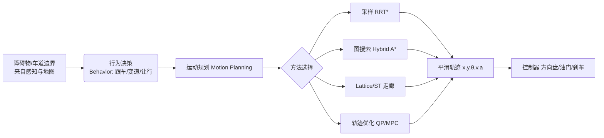

# 五、运动规划：在约束里给车找一条"好路"

## 1. 引言

去年冬天，我跟着一辆 L4 试验车在城区窄路做夜间接管测试。那是一条双向单车道、路边还停了两排车的"毛细血管"小路，对面来了一辆快递三轮车。人类司机只要稍微往左带一点、减速错一下车，三秒钟就能过去；可我们的车在距三轮车还有八米的时候，突然一脚重刹停死，然后原地"思考"了将近二十秒，最后靠安全员接管才挪过去。回放日志一看，规划（planning）模块在那一刻彻底"emo"了——它把对面三轮车当成了一堵不可穿越的静态墙，搜索空间里找不到一条同时满足"不压线、不撞墙、不超速、转向不超限"的轨迹，于是干脆输出"停车等待"。

这件事让我意识到：感知可以很聪明，但真正考验工程功力的是规划——它要在几百毫秒内，在一堆互相打架的约束里，给一台重达两吨、不能横着走、还带惯性时延的车，算出一条"既走得了、又坐得舒服、还不会撞"的路径。如果规划只追求"可行"，车会像醉汉一样扭来扭去；如果只追求"安全"，车会像我的 Demo 一样原地怂住。本章就聊聊，怎么在约束的夹缝里，给车找一条真正"好"的路。

## 2. 核心概念

运动规划（Motion Planning）回答的问题是：**给定当前状态、目标状态和环境（障碍物、车道、交规），生成一条满足几何/运动学/动力学/交规约束，且在"可行、舒适、安全、高效"上综合最优的轨迹（trajectory）**。注意这里有两个常被混用的词：

- **路径（path）**：只关心几何形状 $(x,y)$，无时间维度，解决"往哪走"。
- **轨迹（trajectory）**：路径加上时间律 $(x,y,t)$，即每个时刻车在哪、以多快速度，解决"什么时候到哪"。实车上我们几乎总是要轨迹，因为要控制加速度、要和别的车抢时间。

按求解思路，规划方法大致分四类，复杂度与"最优性"递增：

| 方法族 | 代表算法 | 核心思想 | 适合场景 |
| --- | --- | --- | --- |
| 采样法（sampling-based） | RRT / RRT* / PRM | 在状态空间随机撒点连图，找连通路径 | 高维、复杂障碍 |
| 图搜索（graph search） | A* / Hybrid A* | 在离散网格/状态格上做启发式搜索 | 结构化道路、泊车 |
| 参数化/走廊法 | Lattice / ST-graph | 预先生成候选基元或在时空走廊内优化 | 高速巡航、城市跟车 |
| 轨迹优化（optimization） | QP / MPC / 多项式 | 把规划写成带约束的最优化问题 | 需要平滑与舒适 |

下面用一张图把"感知→规划→控制"的接口关系画出来，方便理解规划在链路里的位置：



关键参数（面试常问）：规划周期（典型 100ms）、轨迹时长（典型 5~10s 前瞻）、轨迹点密度（0.1s 间隔）、最大曲率 $\kappa_{\max}=1/R_{\min}$、最大加速度 $a_{\max}$、最大加加速度（jerk，舒适性指标）。

## 3. 机制深拆

### 3.1 采样法：RRT 与 RRT*

快速随机扩展树（RRT, Rapidly-exploring Random Tree）从起点长一棵树：每步在状态空间随机取一个采样点 $q_{\mathrm{rand}}$，找到树上最近的节点 $q_{\mathrm{near}}$，沿可行方向扩展一步得到 $q_{\mathrm{new}}$，若 $q_{\mathrm{near}}\to q_{\mathrm{new}}$ 无碰撞则加入树。重复直到触及目标区域。它**概率完备**——只要有解，采样次数够了就能找到，但不保证最优。

RRT* 在扩展时多做了"重新连接（rewire）"：新节点不只接最近的父节点，而是在半径 $r$ 内的邻居里选一条代价最小的父节点，并让邻居"反悔"改投更优的父节点。代价函数通常是路径长度加碰撞惩罚：

$$c(\tau)=\int_0^{L}\left(1+\lambda\,I_{\mathrm{obs}}(s)\right)\,ds$$

其中 $I_{\mathrm{obs}}$ 是靠近障碍的惩罚指示。RRT* 随着采样点增多**渐近最优**，代价收敛到最优解。代价是计算更重，实车上常加"运动学约束扩展"或用 RRT*-Smart、Informed-RRT* 加速。

### 3.2 图搜索：A* 与 Hybrid A*

A* 在网格上搜索，代价 $f=g+h$，$g$ 是已走代价，$h$ 是启发式（如到目标的欧氏距离）。但它把车当成"能朝 8 个格子方向瞬移的点"，生成的路径贴着格子、有折角，车根本转不过去。

Hybrid A*（混合 A*）的关键是**状态含连续位姿 $(x,y,\theta)$ 与转向**，扩展时用车辆运动学模型（自行车模型）迈出一步，而不是跳格子；同时维护一个"格子坐标→最佳代价"的关闭表做剪枝，兼顾连续可行与搜索效率。它通常再接一段"分析式平滑 + 碰撞检查"收尾。

### 3.3 时空走廊与 ST-graph

城市里最难的不是几何避障，而是"和别的车抢时间"。时空走廊（spatio-temporal corridor）把可行区域描述成随时刻变化的凸空间；ST-graph 把纵向位置 $s$ 与时间 $t$ 做成二维图，障碍车变成图上的一块"禁止区"（占据块），规划车只需在 $s\text{-}t$ 平面找一条不撞禁止区、且速度合法的曲线。这就是窄路会车、路口博弈的数学本质。

### 3.4 轨迹优化目标

一条好轨迹常写成带约束的二次规划（QP）：

$$\min_{u}\;\sum_{k}\left(w_s e_s^2 + w_v (v_k-v_{\mathrm{ref}})^2 + w_a a_k^2 + w_j j_k^2\right)$$

约束包括边界、曲率、加速度上下限。加加速度 $j=\dot a$ 直接关联乘客脖子酸不酸，是舒适性硬指标。

## 4. 工程实践

下面给出 Hybrid A* 在网格上搜索的 Python 伪代码骨架（车辆运动学扩展用占位函数 `kinematic_step` 表示，真实实现里换成自行车模型前向积分）：

```python
import heapq
import math

def heuristic(x, y, gx, gy):
    # 欧氏距离作为可采纳启发
    return math.hypot(x - gx, y - gy)

def kinematic_step(state, steer, step_len):
    # 占位：用自行车模型前向积分一步，返回新 (x, y, theta)
    x, y, theta = state
    x += step_len * math.cos(theta)
    y += step_len * math.sin(theta)
    theta += steer * 0.1
    return (x, y, theta)

def hybrid_a_star(start, goal, grid, steer_set=(-0.6,-0.3,0,0.3,0.6)):
    open_q = []
    g_cost = {start: 0.0}
    parent = {start: None}
    heapq.heappush(open_q, (heuristic(*start[:2], *goal[:2]), start))
    while open_q:
        _, node = heapq.heappop(open_q)
        if dist(node, goal) < 1.0:
            return reconstruct(parent, node)
        for steer in steer_set:
            nxt = kinematic_step(node, steer, step_len=2.0)
            if not collision_free(nxt, grid):
                continue
            tentative = g_cost[node] + step_len
            if nxt not in g_cost or tentative < g_cost[nxt]:
                g_cost[nxt] = tentative
                parent[nxt] = node
                heapq.heappush(open_q, (tentative + heuristic(*nxt[:2], *goal[:2]), nxt))
    return None  # 无解
```

车规落地坑：① `collision_free` 要做"车体包络"而非质点检查，否则会蹭边；② 网格分辨率与状态离散化要匹配车的转弯半径，太粗搜不出可行解；③ 搜索要在规划周期（100ms）内返回，否则降级到"安全停车"策略；④ 结果必须再平滑，原始 Hybrid A* 路径曲率不连续。

## 5. 常见坑

1. **坐标系不一致**：规划在车体/地图/自车坐标系来回换，少一次 `cos/sin` 旋转就整体偏移，建议所有接口统一到地图系（map frame）。
2. **忽略车辆非完整性约束**：把车当全向质点，生成的路径曲率无穷大，执行层根本跟不上。
3. **规划与控制频率失配**：规划 10Hz、控制 100Hz，轨迹点之间线性插值会让曲率突变，车发抖。
4. **前瞻距离（horizon）过短**：只看眼前 2 秒，遇到连续弯道会"救火式"修正。
5. **障碍物当作纯静态**：不预测行人/前车未来位置，轨迹在下一周期全废，反复重规划。
6. **数值奇异点**：曲率公式在低速/直行时分母趋零，要加 `eps` 保护或用曲率有界参数化。
7. **走廊太窄/太宽**：太窄无解急停，太宽优化发散、毫无约束感。
8. **超时无降级**：搜索超过 100ms 仍硬等，导致系统卡死，必须有"最后一次好轨迹 + 缓停"兜底。
9. **未做时空解耦**：把纵向速度塞进几何路径，导致速度规划与路径强耦合、调参地狱。
10. **忽略了乘客舒适窗**：jerk 超过 2~3 m/s³ 乘客就难受，优化权重没给够。
11. **交规约束漏检**：公交车道、潮汐车道、让行标志没进约束，车合法但违规。

## 6. 面试要点

1. **RRT 和 RRT* 区别？** RRT* 多了邻居重连，渐近最优但更慢；RRT 只求可行。
2. **为什么道路场景常用 Hybrid A* 而非 A*？** A* 把车当质点，路径折角不可执行；Hybrid A* 状态含连续位姿与转向，满足车辆运动学。
3. **ST-graph 解决了什么问题？** 把"抢时间"的博弈写成纵向位置-时间二维避障，处理交互场景。
4. **轨迹和路径区别？** 路径无时间，轨迹带时间律（速度/加速度），实车要轨迹。
5. **什么是 jerk，为什么重要？** 加加速度，衡量舒适性，过大乘客不适。
6. **QP 和 MPC 在规划里怎么用？** QP 做平滑/单次优化；MPC 滚动优化、显式处理约束与多步前瞻。
7. **规划周期 100ms 内做不完怎么办？** 降级到上一周期轨迹 + 缓停，或并行后台搜索。
8. **怎么保证轨迹可执行？** 约束最大曲率/加速度，输出前做运动学可行性检查。
9. **Lattice 规划思想？** 预生成一组候选轨迹基元，评分选最优，速度快适合高速。
10. **如何把障碍物预测融进规划？** 用预测轨迹生成随时间变化的占据区域（corridor/ST 禁止块）。
11. **为什么不用纯穷举采样？** 状态空间维度高，采样效率低、无最优保证。
12. **舒适性和安全性冲突时怎么权衡？** 安全是硬约束（barrier），舒适是软目标（cost），先保安全再优化舒适。

## 7. 结语

一页纸回顾：运动规划是在几何、运动学、动力学、交规四类约束下，为车找一条可行+舒适+安全+高效的轨迹。采样法（RRT/RRT*）适合复杂高维、概率完备；图搜索（A*/Hybrid A*）适合结构化道路、保证可执行；Lattice 与 ST-graph 把"抢时间"显式建模，是城市交互的关键；轨迹优化（QP/MPC/多项式）负责把粗解磨成丝滑曲线。工程上记住三件事：统一坐标系、规划控制频率匹配、永远有降级兜底。窄路会车的"急停"故事告诉我们——规划不能只看空间，要看时空。

延伸阅读：LaValle《Planning Algorithms》（RRT 源头）、Karaman 的 RRT* 论文、斯坦福都市驾驶 Hybrid A* 论文、Apollo 规划模块开源代码、百度 Apollo EM 规划与矢量地图论文。

本章约 2200 字。
