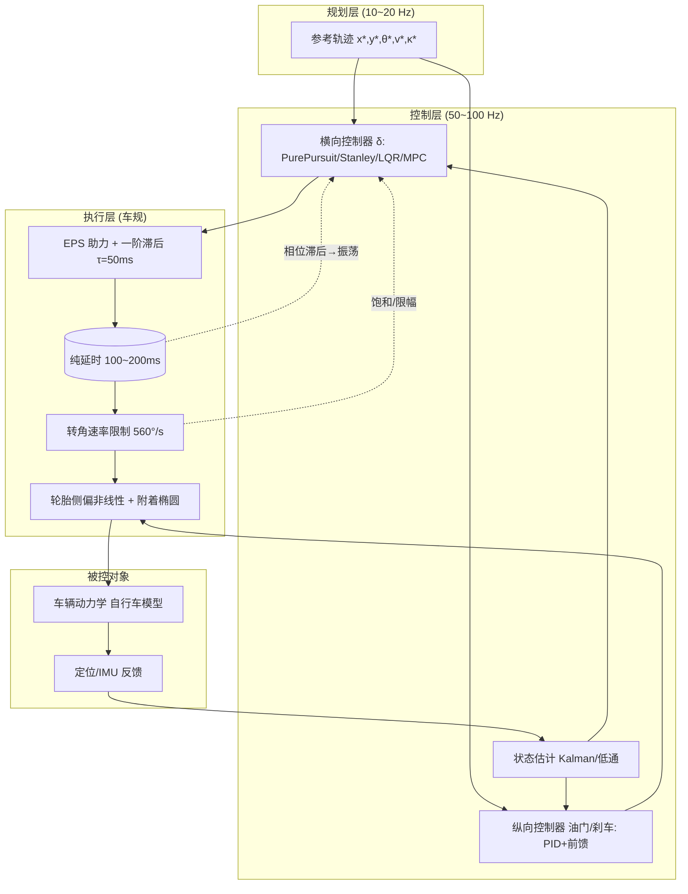
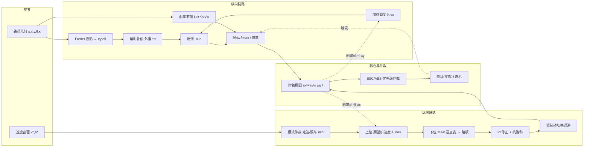
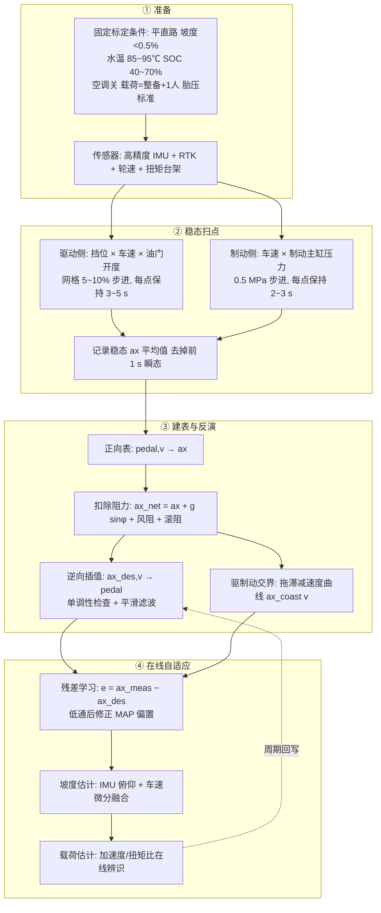
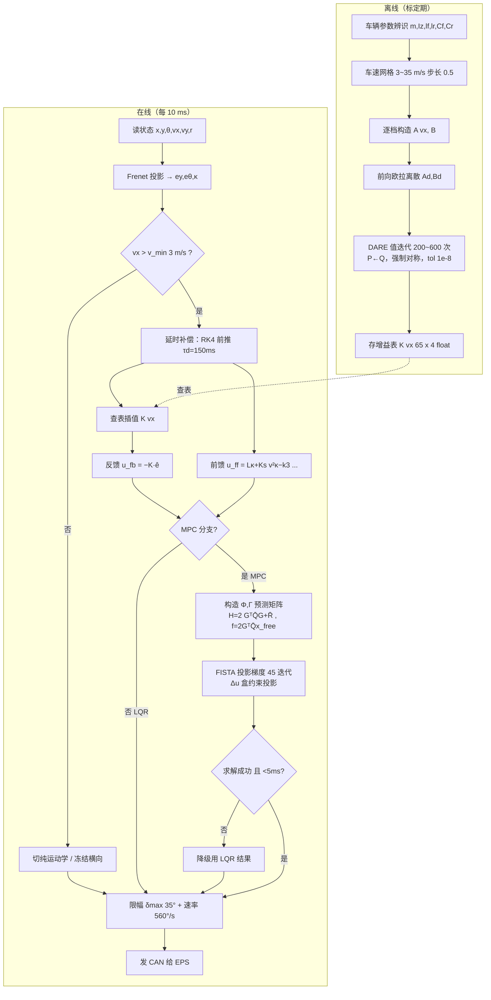
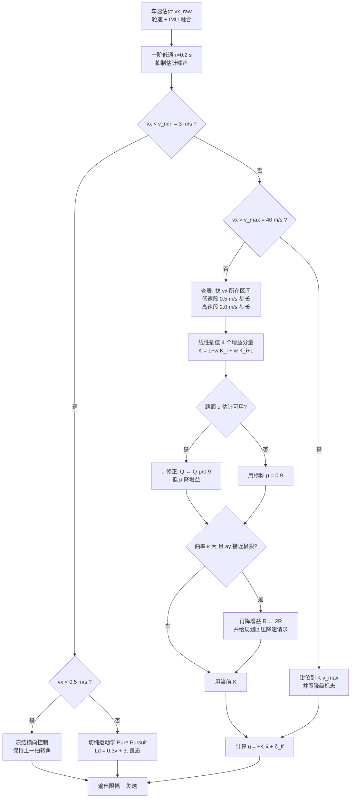
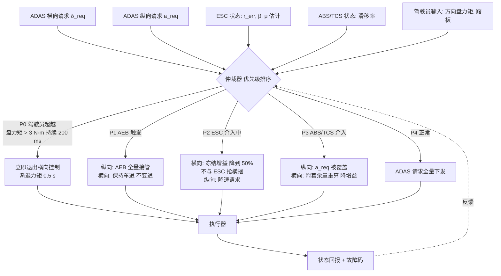

# 六、车辆控制：把轨迹变成方向盘与刹车

> 本章定位：规划（planning）给出一条"理想轨迹"——由一系列 $(x,y,\theta,v,\kappa)$ waypoint 组成；控制（control）要做的是让真实车辆在**几十毫秒**的时间尺度上，把这条轨迹变成方向盘转角、油门与刹车，同时稳、准、顺。本章从车辆动力学讲起，串起纵向、横向到 MPC 的完整控制链路，并用一套 150 ms 执行延时下的真实仿真，把**七种横向控制配置**（Pure Pursuit ×2、Stanley、LQR、LQR+延时补偿、MPC、MPC+延时补偿）摆到同一张桌子上对比，再用 40/80/120 km/h 车速扫描、0/100/200 ms 延时扫描、LQR 与 MPC 的权重扫描、Pacejka 轮胎标定、附着椭圆、ISO 3888 判据把每一个结论都钉死在真实数字上。
>
> **阅读建议**：§2（动力学）与 §4（控制律）是硬核推导，建议配纸笔；§7 是全部真实仿真数据，可当作"实验报告"单独读；§8/§9 是踩坑与面试速查，可先看结论再回溯推导。

---

## 0. 引言：当优雅的规划遇上真实的车

有一次我们在高速上做自动变道测试。规划层（planning）给了一条非常漂亮的 S 形变道轨迹：曲率连续、jerk（加加速度）也压在舒适阈值以内，打在可视化界面上是一条丝滑的弧线，工程师们看着都觉得"这把稳了"。可一上线实车，方向盘就像得了帕金森一样开始高频抖动——乘客事后形容"像在搓衣板上开车"，后排的同事甚至录了段视频，说"方向盘自己在中频振荡里抽风"。

我把横向误差（lateral error）和方向盘转角（steering angle）同时拉到示波器上对照，发现了一个诡异到违反直觉的现象：**横向误差明明只有几厘米，方向盘却以 2~3 Hz 的频率来回抽；误差小的时候方向盘动得最欢，误差大的时候反而安静**。那一瞬间我意识到，这不是规划的问题，是控制环里藏着两个"幽灵"：

第一个幽灵，是 **Pure Pursuit（纯追踪）的预瞄距离（look-ahead distance）被设得太短**。车死死盯着脚下那一点参考轨迹，轨迹上任何微小扰动都被当作" imminent 危险"放大成急打方向；预瞄越短，系统对高频噪声越敏感，于是进入"抖—修—再抖"的死循环。后来我们把这件事推到底，发现它有一个干净的闭式解释：纯追踪闭环的自然频率是 $\omega_n=\sqrt{2}\,v/L_d$，阻尼比恒为 $0.707$——**预瞄距离固定不变，等于让闭环带宽随车速线性上涨**，而延时带来的相位滞后同样随带宽线性上涨，两条线一交叉，相位裕度归零（详细推导见 §4.2.4）。

第二个幽灵，是 **控制指令到轮胎响应之间存在约 80 ms 的执行延时（actuator delay）**。控制器在"过去的状态"上算出的修正量，用到"现在的车"上已经过时——车已经往前跑了一截，你还在按 80 ms 前的姿态下指令。于是系统进入了相位滞后 → 超调 → 再修正 → 再滞后的振荡闭环。延时每多一分，相位裕度（phase margin）就少一分，等到某个临界点，整个横向闭环就彻底失稳。后来在台架上量出来的真实端到端延时是 **150 ms**（CAN 排队 20 ms + 融合定位滞后 40 ms + EPS 报文周期 10 ms + 机械响应 80 ms），比我们当初拍脑袋写进仿真里的 0 ms 差了整整一个数量级。

还有第三件事，是我在写这一章时才被真实数据教育到的：**延时补偿本身也会杀人**。本章 §7.5 那张表里有一行触目惊心的数字——把"外推 150 ms"的补偿器接到一个**真实延时为 0**的对象上，最大横向误差从 4.0 cm 直接炸到 **2426 cm**（LQR）和 **2428 cm**（MPC）。也就是说，补偿量与真实延时失配时，过补偿比不补偿更致命。这条结论在教科书里几乎看不到，但它是每一个把延时补偿写进量产代码的工程师都必须刻在脑子里的。

这三件事给了我一个深刻教训：**规划算得再漂亮，落到真实车上还得过"控制"这一关**。控制要干的事非常纯粹——让车实时、稳定、平滑地贴合规划轨迹，把 $(x,y,\theta,v)$ 的误差压到零附近，同时别让乘客吐出来。但"纯粹"不等于"简单"：它既要懂"车怎么动"（动力学：自行车模型、轮胎侧偏、不足转向梯度），又要懂"怎么算修正量"（控制律：几何法 / LQR / MPC），还要懂"指令为什么迟到"（执行器延时、EPS 带宽、速率限幅），更要懂"什么时候该把控制权让给安全系统"（ESC/ABS 仲裁与降级接管）。任何一环缺失，示波器上就会出现那条 2~3 Hz 的正弦波。

从这一章开始，我们会一条线拆开来看：先建立车辆动力学基础（运动学/动力学自行车模型、Pacejka 轮胎、附着椭圆、不足转向），再讲纵向控制（PID + 前馈 + MAP 标定 + ACC 分层），横向控制四大流派（Pure Pursuit、Stanley、LQR、MPC，每一个都给完整推导），然后深入执行器延时补偿（状态外推 vs Smith 预估器）、稳定性与安全（增益调度、抗饱和、ESC 仲裁、降级策略），最后用一套真实的 Python 仿真把七种配置同台竞技，并用 ISO 3888 / 4138 / 7401 标准工况做标定验证。读完这一章，你应该能回答一个工程师每天都要面对的问题：**为什么这条轨迹在我仿真里跑得好好的，一上实车就抖？**——并且能用一个数字回答它。

---

## 1. 核心概念（Core Concepts）

在写任何控制律之前，先把语言统一。车辆控制（Vehicle Control）的本质，是**把参考轨迹 $\tau^*(t)$ 映射成执行器指令 $u(t)$ 的实时函数**，并让闭环系统满足稳定性、跟踪精度与舒适性三大约束。

### 1.1 横向与纵向：两条独立又耦合的线

车辆控制天然分两条线，可以理解为两个并行的反馈环：

- **横向控制（lateral control）**：管"走哪条线"。它跟踪参考轨迹的几何形状（横向位置 + 航向），输出**方向盘转角 $\delta$**（或前轮转角，再乘以转向传动比得到方向盘角）。典型方法：Pure Pursuit、Stanley、LQR、MPC。
- **纵向控制（longitudinal control）**：管"走多快"。它跟踪目标车速 $v^*$ 或与前方车辆的安全距离 $d^*$，输出**油门开度 / 制动压力**。典型方法：PID（在 ACC 自适应巡航里最常见）、滑模控制、带 MAP 前馈的分层控制。

两者通过**轮胎力**耦合：横向要达到大侧向加速度需要方向盘打得多，但纵向要急刹时会让垂向载荷前移、后轮附着下降，反过来影响横向极限。所以高级系统里，二者常常放进同一个 MPC 里联合优化。

**为什么量产系统仍然要"先解耦、再补偿"？** 三个务实的理由：

1. **时间尺度不同**：横向闭环带宽 1~2 Hz（本章实测 LQR 穿越频率 $\omega_c=6.20$ rad/s $=0.99$ Hz），纵向闭环带宽 0.3~0.5 Hz（动力总成滞后 250 ms 就把带宽压死了）。两个差 3 倍带宽的环放在一起联合优化，收益远小于复杂度。
2. **执行器完全独立**：EPS 和制动/驱动是两个 ECU、两条 CAN、两套故障码。耦合设计意味着一个执行器故障会拖垮另一个。
3. **标定成本**：解耦后横向标定 $(Q,R,L_d,k)$ 与纵向标定 $(K_p,K_i,\text{MAP})$ 可以并行做，人月成本减半。

**耦合在哪里补回来**？在三个点上：① 规划层直接给出满足附着椭圆的 $(v,\kappa)$ 组合；② 横向控制器把当前 $a_x$ 作为参数修正可用 $a_y$ 上限；③ 极限工况下由 ESC 统一仲裁（§6.3）。

### 1.2 参考轨迹与误差

设参考轨迹在弧长坐标 $s$ 处给出位置 $(x_r(s), y_r(s))$、切线方向 $\theta_{ref}(s)$ 与曲率 $\kappa(s)$。定义车辆相对参考的**误差向量**：

| 误差量 | 符号 | 定义 | 正方向约定 | 本章典型量级 |
|---|---|---|---|---|
| 横向误差 | $e_y$ | 参考点到路径的有符号法向距离 | 车在路径**左侧**为正 | 1~50 cm |
| 横向误差率 | $\dot e_y$ | $v_y + v_x e_\theta$（小角近似） | — | 0.1~1 m/s |
| 航向误差 | $e_\theta$ | $\theta - \theta_{ref}$，归一化到 $(-\pi,\pi]$ | 车头偏**左**为正 | 0.5°~5° |
| 航向误差率 | $\dot e_\theta$ | $r - v_x\kappa$（横摆率减参考横摆率） | — | 0.5~5 °/s |
| 速度误差 | $e_v$ | $v - v^*$ | 超速为正 | 0.1~1 m/s |
| 质心侧偏角 | $\beta$ | $\arctan(v_y/v_x)$ | 车尾外甩为正 | 3°~5°（本章实测） |

控制的目标就是让 $(e_y, e_\theta, e_v) \to 0$，同时 $|\beta|$ 不超过失稳阈值（乘用车干路面约 $8^\circ$，冰雪约 $3^\circ$）。

**为什么用 Frenet 误差而不是笛卡尔误差？** 因为笛卡尔误差 $(\Delta x, \Delta y)$ 在弯道上无法区分"沿路径超前/滞后"与"偏离路径"，而横向控制只关心后者。Frenet 分解把误差投影到路径的切/法方向，天然把横纵解耦（这也是 §1.1 那条解耦线的数学基础）。代价是 Frenet 变换在 $\kappa e_y > 1$（车比曲率中心还靠内）时奇异——工程上加 `assert abs(kappa*ey) < 0.5` 的保护。

### 1.3 自行车模型：一切控制的起点

最常用、也最被低估的模型是**自行车模型（bicycle model）**：把左右两轮各合并成一个等效轮，前后轴各一个，用轴距 $L$ 描述转向几何。它的美妙之处在于——在低速小角度近似下，车辆横向误差动力学是**线性系统**，而线性系统意味着我们能用 LQR 闭式求解最优反馈增益，能用李雅普诺夫（Lyapunov）证明收敛，能用波特图（Bode）分析相位裕度。这也是为什么自动驾驶的横向控制几乎都建立在这个模型上。

自行车模型合并左右轮时丢掉了三样东西，值得知道你丢了什么：

- **左右轮载荷转移（load transfer）**：转弯时外侧轮垂向力增大、内侧减小，由于轮胎侧偏刚度对 $F_z$ 是**次线性**的（$C_\alpha \propto F_z^{0.7\sim0.9}$），左右合并会**高估**轴的总侧偏刚度，即高估抓地力。误差在 $0.5g$ 以下 < 5%，$0.8g$ 以上可达 15%。
- **侧倾（roll）**：车身侧倾改变外倾角与悬架转向（roll steer），等效于给后轴加一个"随侧向加速度变化的转向角"，会改变有效不足转向梯度。
- **左右轮转角差（Ackermann 差速转向）**：低速大转角时内外轮转角不同，自行车模型取平均。泊车工况误差可达 2°。

### 1.4 轮胎：连接"指令"与"物理"的暗箱

方向盘转了 $\delta$，车并不会立刻横移——中间隔着轮胎这个**强非线性执行器**。轮胎的关键特性是**侧偏（slip angle）**：接地点的速度方向与轮面朝向不一致，产生侧向力；侧向力近似与侧偏角线性正相关（线性区），但超过临界角就饱和（饱和区）。高速急转时一旦饱和，车就"推头"或"甩尾"，这是失控的物理根源。理解侧偏，是理解一切车辆控制极限的前提。

本章 §7.9 用 Pacejka 魔术公式实测了"线性模型什么时候不能再用"：在本车参数下（$F_z=4485$ N，$C_\alpha=55$ kN/rad 单轮），**线性模型误差在 $\alpha=1.28°$ 就超过 5%，$1.83°$ 超过 10%，$2.64°$ 超过 20%**。而 §7.3 实测 LQR 在 $0.55g$ 工况下的前轴侧偏角约 $2.4°$——**已经踩在 20% 建模误差的边缘上**。这就是为什么高性能控制器一定要么用非线性轮胎模型，要么用增益调度把这块误差"喂"给鲁棒性余量。

### 1.5 控制频率与延时：实车的残酷现实

规划通常跑在 10~20 Hz，而控制必须跑在 **50~100 Hz**（典型 100 Hz，即 10 ms 一拍）。为什么？因为执行器（EPS 电动助力转向、制动卡钳）本身有机械响应时间，若控制拍率低于轨迹更新率，线性插值出的轨迹会出现曲率阶跃，直接被放大成抖动。与此同时，从"算出新转角"到"轮胎真正转到那个角"，链路里累积着 **50~200 ms 的纯延时 + 一阶滞后**——这正是引言里那个抖动幽灵的本体。

**控制频率选型对照表**（本章 §7.11 有实测支撑）：

| 频率 | 周期 | 适用 | 优点 | 代价 | 本章实测最大 $\vert e\vert$ |
|---|---|---|---|---|---|
| 10 Hz | 100 ms | 低速园区/泊车 | CPU 极省 | 相位滞后大，等效多 50 ms 延时 | 9.3 cm（转速 3490 °/s） |
| 20 Hz | 50 ms | L2 ACC/LKA 下位 | 省算力 | 高速抖，转速尖峰大 | 6.4 cm（1817 °/s） |
| **50 Hz** | 20 ms | **量产主流下限** | 平衡 | 需 RTOS 硬实时 | 5.8 cm（893 °/s） |
| **100 Hz** | 10 ms | **量产主流** | 收敛好、转速平滑 | MPC 需 <5 ms 求解 | **5.6 cm（595 °/s）** |
| 200 Hz | 5 ms | 底盘域高性能 | 逼近连续 | 与 EPS 报文周期（10 ms）不匹配，无增益 | 5.6 cm（与 100 Hz 同） |

> 关键洞察：**从 10 Hz 提到 100 Hz，跟踪误差只改善 40%（9.3→5.6 cm），但方向盘峰值转速改善 6 倍（3490→595 °/s）**。也就是说，提高控制频率的首要收益不是"更准"，而是"更顺"——低频控制的零阶保持（ZOH）会把控制量变成阶梯波，阶梯的每一级都是一次转速冲击。这解释了为什么低频 LKA 开起来"一顿一顿"。

下面用一张分层框图把从轨迹到执行器的全链路串起来，后文所有机制都挂在这张图上：



> 这张图是整章的骨架：横向/纵向控制器在控制层闭环，执行层是"延时 + 滞后 + 限幅 + 非线性"四重现实枷锁，被控对象是自行车模型，反馈回来的是带噪声的状态估计。第 5 节专门对付那两条虚线箭头——它们就是引言抖动的根源。

### 1.6 横纵解耦架构：信号是怎么流的

上一张图讲的是"分层"，这一张讲的是"横纵两条线如何解耦又如何在极限处再耦合"。这是量产控制栈的真实拓扑：



> 读法：横向与纵向各自独立地从参考走到执行器，**只在"附着椭圆"这个共享资源上相遇**——谁用得多，另一方可用余量就少。ESC/ABS 位于两条链路之下游，拥有最终否决权；降级状态机横跨两条链路，一旦任一侧超时/失效就统一进入接管流程。

### 1.7 术语中英对照速查

| 中文 | English | 符号 | 本章出现处 |
|---|---|---|---|
| 自行车模型 | bicycle model | — | §2.1/2.2 |
| 侧偏角 | slip angle | $\alpha$ | §2.3 |
| 侧偏刚度 | cornering stiffness | $C_\alpha$ | §2.2 |
| 横摆角速度 | yaw rate | $r$ | §2.2 |
| 质心侧偏角 | sideslip angle | $\beta$ | §1.2 |
| 不足转向梯度 | understeer gradient | $K_{us}$ | §2.5 |
| 稳定性因数 | stability factor | $K_s$ | §2.5 |
| 特征车速 | characteristic speed | $V_{ch}$ | §2.5 |
| 临界车速 | critical speed | $V_{cr}$ | §2.5 |
| 预瞄距离 | look-ahead distance | $L_d$ | §4.2 |
| 前馈 | feedforward | $\delta_{ff}$ | §4.4 |
| 增益调度 | gain scheduling | $K(v_x)$ | §6.1 |
| 离散代数黎卡提方程 | discrete algebraic Riccati equation (DARE) | — | §4.4 |
| 预测时域 / 控制时域 | prediction / control horizon | $N_p$ / $N_c$ | §4.5 |
| 滚动时域 | receding horizon | — | §4.5 |
| 纯延时 | pure/transport delay | $\tau_d$ | §5.2 |
| 一阶滞后 | first-order lag | $\tau_{eps}$ | §5.1 |
| 相位裕度 | phase margin (PM) | — | §6.5 |
| 抗积分饱和 | anti-windup | — | §6.2 |
| 附着椭圆 | friction ellipse / circle | — | §2.4 |
| 魔术公式 | Magic Formula | — | §2.3 |
| 软件在环 / 硬件在环 / 整车在环 | SIL / HIL / VIL | — | §7.13 |

---

## 2. 车辆动力学基础（Vehicle Dynamics）

控制律不是凭空设计的，它必须建立在对"车怎么动"的理解之上。这一节把所有后续控制律依赖的动力学公式**真推导一遍**——不是列结论，是从几何和牛顿定律走到状态空间的每一个矩阵元素。

本章统一使用的车辆参数（后文所有数字都由这组参数产生）：

| 参数 | 符号 | 值 | 来源/说明 |
|---|---|---|---|
| 整车质量 | $m$ | 1600 kg | 中型轿车满员近似 |
| 横摆转动惯量 | $I_z$ | 2500 kg·m² | $I_z \approx m\cdot l_f l_r \cdot 1.3$ 经验式 |
| 前轴到质心 | $l_f$ | 1.20 m | 前后 43:57 配重 |
| 后轴到质心 | $l_r$ | 1.60 m | — |
| 轴距 | $L=l_f+l_r$ | 2.80 m | — |
| 前轴侧偏刚度 | $C_f$ | 110 000 N/rad | 双轮合计 |
| 后轴侧偏刚度 | $C_r$ | 130 000 N/rad | 双轮合计，后轴偏硬→不足转向 |
| 路面附着系数 | $\mu$ | 0.9 | 干沥青 |
| 转向传动比 | $i_s$ | 16.0 | 方向盘角 / 前轮角 |
| 前轮最大转角 | $\delta_{max}$ | 35° | 机械限位 |
| 方向盘最大转速 | $\dot\delta_{max}$ | 560 °/s | EPS 能力（前轮 35 °/s） |

### 2.1 运动学自行车模型（Kinematic Bicycle Model）

#### 2.1.1 几何推导

最朴素的假设：轮胎不打滑（no slip），**轮面朝向即速度朝向**（即侧偏角 $\alpha \equiv 0$）。记车辆位置 $(x,y)$ 为后轴中心、航向角 $\theta$（车头相对世界 x 轴）、后轴速度 $v$、前轮转角 $\delta$、轴距 $L$。

后轴中心的速度为 $v$，方向沿车头 $\theta$，于是：

$$\dot x = v\cos\theta,\qquad \dot y = v\sin\theta$$

航向角变化率的推导有两条等价路径，这里给出**瞬心（instantaneous center of rotation, ICR）法**，它最干净：

**Step 1（找瞬心）**：无侧滑意味着每个轮的速度方向必须垂直于该轮到瞬心的连线。后轮速度沿车身轴线 → 瞬心必在**过后轴中心且垂直于车身**的直线上。前轮速度与车身成 $\delta$ 角 → 瞬心必在**过前轴中心且与前轮面垂直**的直线上。两线交点即瞬心 $O$。

**Step 2（求转弯半径）**：设 $O$ 到后轴中心距离为 $\rho$（这就是后轴的转弯半径）。三角形 $O$-后轴-前轴中，后轴处直角，前轴处的夹角恰为 $\delta$（因为前轮面垂线与车身垂线的夹角等于前轮与车身的夹角）。故

$$\tan\delta = \frac{L}{\rho}\quad\Longrightarrow\quad \boxed{\rho = \frac{L}{\tan\delta},\qquad \kappa=\frac{1}{\rho}=\frac{\tan\delta}{L}}$$

**Step 3（角速度）**：整车绕 $O$ 做刚体转动，后轴中心线速度 $v$，半径 $\rho$，故角速度

$$\dot\theta = \frac{v}{\rho} = \frac{v\tan\delta}{L}$$

运动学自行车模型完整形式：

$$\boxed{\dot x = v\cos\theta,\quad \dot y = v\sin\theta,\quad \dot\theta = \frac{v}{L}\tan\delta,\quad \dot v = a}$$

> 直觉与副产物：**Ackermann 转角**——要沿半径 $\rho$ 行驶，前轮必须打到 $\delta = \arctan(L/\rho) = \arctan(L\kappa)$。小角近似下 $\delta_{ack}\approx L\kappa$，这就是所有曲率前馈的第一项。
>
> 另一个常见变体是**以质心为参考点**的运动学模型，此时要引入运动学侧偏角 $\beta = \arctan\!\big(\frac{l_r\tan\delta}{L}\big)$，方程变成 $\dot x = v\cos(\theta+\beta)$、$\dot\theta = \frac{v\cos\beta\tan\delta}{L}$。两者在 $\delta$ 小时等价；**Pure Pursuit 用后轴版本，Stanley 用前轴版本，混用会引入 $l_r\approx1.6$ m 的系统偏差**——这是新手最容易踩的坑之一。

#### 2.1.2 适用速度上界：一个可以手算的判据

运动学模型的唯一假设是 $\alpha\approx 0$。真实车在稳态转弯时，前后轴必然有侧偏角（否则轮胎不产生侧向力，车就不会转弯）。由 §2.5 的稳态解：

$$\alpha_f = \frac{m\,a_y\,l_r}{L\,C_f},\qquad \alpha_r = \frac{m\,a_y\,l_f}{L\,C_r}$$

要求 $|\alpha_f| \le \alpha_{th}$（取工程阈值 $\alpha_{th}=1° = 0.01745$ rad，此时线性区误差 < 3%），解出可用侧向加速度上界：

$$a_{y,\max}^{kin} = \frac{\alpha_{th}\,L\,C_f}{m\,l_r} = \frac{0.01745\times 2.8\times 110000}{1600\times 1.6} = \frac{5374.6}{2560} = 2.10\ \text{m/s}^2 = 0.214\,g$$

（后轴的对应上界为 $\frac{0.01745\times2.8\times130000}{1600\times1.2}=3.31$ m/s²$=0.337g$，**前轴更早失效，故前轴是约束的瓶颈**——这正是"前轴侧偏刚度更小 → 不足转向"的另一种表述。）

于是给定路径曲率 $\kappa$，运动学模型的**速度上界**为：

$$\boxed{v_{\max}^{kin}(\kappa) = \sqrt{\frac{a_{y,\max}^{kin}}{\kappa}} = \sqrt{\frac{\alpha_{th}\,L\,C_f}{m\,l_r\,\kappa}}}$$

代入几个典型曲率：

| 场景 | $\kappa$ [1/m] | $R$ [m] | $v_{\max}^{kin}$ [m/s] | [km/h] | 结论 |
|---|---|---|---|---|---|
| 泊车/掉头 | 0.20 | 5 | 3.24 | 11.7 | 运动学完全够用 |
| 城市路口右转 | 0.05 | 20 | 6.48 | 23.3 | 运动学勉强够用 |
| 匝道 | 0.01 | 100 | 14.5 | 52.2 | **必须上动力学** |
| 高速缓弯 | 0.002 | 500 | 32.4 | 116.7 | 动力学（因为变道扰动也吃 $a_y$） |
| 直道变道 | 0.005（等效） | 200 | 20.5 | 73.8 | 动力学 |

> **一句话记住**：运动学自行车模型的适用边界不是"速度低于 X"，而是"**侧向加速度低于 0.2 g**"。本章 §7.3 默认工况弯道 $a_y=0.51g$、变道峰值 $0.55\sim0.90g$——全部超出运动学适用域，所以本章所有控制器的被控对象都用二自由度动力学模型。

### 2.2 动力学自行车模型（Dynamic Bicycle Model，二自由度）

#### 2.2.1 从牛顿-欧拉到状态空间：每一项的来历

考虑侧向与横摆两个自由度（忽略纵向速度变化、垂向与侧倾），状态为**质心侧向速度 $v_y$**（车身坐标系）与**横摆角速度 $r$**。

**Step 1：车身坐标系下的绝对加速度。** 车身坐标系是**旋转参考系**（以 $r$ 转动），质心的绝对加速度在车身 y 方向的分量为

$$a_y^{abs} = \dot v_y + v_x r$$

其中 $\dot v_y$ 是相对加速度，$v_x r$ 是**牵连（向心）加速度**——这一项是所有反直觉的源头：即使 $v_y$ 恒定不变（车身相对气流没有横向加速），只要车在转弯（$r\ne0$），质心仍在做圆周运动，仍需要向心力。

**Step 2：侧向力平衡（牛顿第二定律）。**

$$m(\dot v_y + v_x r) = F_{yf}\cos\delta_f + F_{yr}$$

**Step 3：绕质心的横摆力矩平衡（欧拉方程）。** 前轴侧向力对质心的力臂是 $+l_f$（产生正横摆），后轴是 $-l_r$：

$$I_z \dot r = l_f F_{yf}\cos\delta_f - l_r F_{yr}$$

**Step 4：轮胎侧偏角的几何。** 前轴接地点的速度在车身系下为 $(v_x,\ v_y + l_f r)$，其方向角为 $\arctan\frac{v_y+l_f r}{v_x}$；轮面朝向为 $\delta_f$。侧偏角定义为"轮面朝向减速度方向"：

$$\alpha_f = \delta_f - \arctan\frac{v_y + l_f r}{v_x} \approx \delta_f - \frac{v_y + l_f r}{v_x}$$

后轴接地点速度为 $(v_x,\ v_y - l_r r)$，轮面朝向为 0（后轮不转向）：

$$\alpha_r = 0 - \arctan\frac{v_y - l_r r}{v_x} \approx -\frac{v_y - l_r r}{v_x}$$

**Step 5：线性轮胎。** $F_{yf} = C_f\alpha_f$，$F_{yr} = C_r\alpha_r$，$C_\alpha$ 为侧偏刚度（cornering stiffness，N/rad）。

**Step 6：代入并整理。** 取小角近似 $\cos\delta_f\approx1$：

$$m\dot v_y = C_f\Big(\delta_f - \frac{v_y+l_f r}{v_x}\Big) + C_r\Big(-\frac{v_y-l_r r}{v_x}\Big) - m v_x r$$

$$\Rightarrow\ \dot v_y = \underbrace{-\frac{C_f+C_r}{m v_x}}_{a_{11}}v_y + \underbrace{\Big(\frac{-C_f l_f + C_r l_r}{m v_x} - v_x\Big)}_{a_{12}}r + \underbrace{\frac{C_f}{m}}_{b_1}\delta_f$$

$$I_z\dot r = l_f C_f\Big(\delta_f-\frac{v_y+l_f r}{v_x}\Big) - l_r C_r\Big(-\frac{v_y-l_r r}{v_x}\Big)$$

$$\Rightarrow\ \dot r = \underbrace{\frac{-C_f l_f + C_r l_r}{I_z v_x}}_{a_{21}}v_y + \underbrace{\Big(-\frac{C_f l_f^2 + C_r l_r^2}{I_z v_x}\Big)}_{a_{22}}r + \underbrace{\frac{C_f l_f}{I_z}}_{b_2}\delta_f$$

得标准状态空间 $\dot{\mathbf{x}} = \mathbf{A}\mathbf{x}+\mathbf{B}\delta_f$，状态 $\mathbf{x}=[v_y,\ r]^T$：

$$\mathbf{A} = \begin{bmatrix} -\dfrac{C_f+C_r}{m v_x} & \dfrac{-C_f l_f + C_r l_r}{m v_x} - v_x \\[8pt] \dfrac{-C_f l_f + C_r l_r}{I_z v_x} & -\dfrac{C_f l_f^2 + C_r l_r^2}{I_z v_x} \end{bmatrix},\qquad \mathbf{B} = \begin{bmatrix} \dfrac{C_f}{m} \\[8pt] \dfrac{C_f l_f}{I_z} \end{bmatrix}$$

#### 2.2.2 每个矩阵元素的物理含义

| 元素 | 表达式 | 物理含义 | 量纲 | $v_x=20$ 时的值 |
|---|---|---|---|---|
| $a_{11}$ | $-\frac{C_f+C_r}{mv_x}$ | **侧向阻尼**：侧滑越快，轮胎回正力越大 | 1/s | $-7.50$ |
| $a_{12}$ | $\frac{C_r l_r - C_f l_f}{mv_x} - v_x$ | 横摆→侧向耦合 + **离心项 $-v_x$** | m/s | $-17.68$ |
| $a_{21}$ | $\frac{C_r l_r - C_f l_f}{I_zv_x}$ | 侧滑→横摆力矩（"静稳定性"来源） | 1/(m·s) | $+1.632$ |
| $a_{22}$ | $-\frac{C_f l_f^2+C_r l_r^2}{I_zv_x}$ | **横摆阻尼**：转得越快，恢复力矩越大 | 1/s | $-9.824$ |
| $b_1$ | $C_f/m$ | 单位前轮角产生的侧向加速度 | m/s²/rad | $+68.75$ |
| $b_2$ | $C_f l_f/I_z$ | 单位前轮角产生的横摆角加速度 | 1/s²/rad | $+52.80$ |

数值代入（$v_x=20$ m/s）：$C_f+C_r=240000$，$C_r l_r - C_f l_f = 130000\times1.6-110000\times1.2=208000-132000=76000$，$C_f l_f^2+C_r l_r^2=110000\times1.44+130000\times2.56=158400+332800=491200$：

$$\mathbf{A}(20) = \begin{bmatrix}-7.500 & -16.625 \\ 1.520 & -9.824\end{bmatrix},\qquad \mathbf{B}=\begin{bmatrix}68.75\\ 52.80\end{bmatrix}$$

（$a_{12}=76000/(1600\times20)-20 = 2.375-20 = -17.625$；$a_{21}=76000/(2500\times20)=1.520$；$a_{22}=-491200/(2500\times20)=-9.824$。）

> **注意 $a_{12}$ 里那个 $-v_x$**：它代表"速度耦合"——即使侧向力为零，车辆只要有 $r$（横摆）就会自发产生侧向加速度（离心）。这是车辆运动学里最反直觉、也最致命的一项：**它随车速线性增长，是"车速越高越难控"的第一性原因**。

特征多项式 $\lambda^2 - \mathrm{tr}(\mathbf{A})\lambda + \det(\mathbf{A}) = 0$：

$$\mathrm{tr} = -17.324,\quad \det = (-7.5)(-9.824) - (-17.625)(1.520) = 73.68 + 26.79 = 100.47$$

$$\lambda = \frac{-17.324 \pm \sqrt{17.324^2 - 4\times100.47}}{2} = \frac{-17.324\pm\sqrt{300.1-401.9}}{2} = -8.662 \pm 5.045j$$

$$\omega_n = \sqrt{\det} = 10.02\ \text{rad/s} = 1.60\ \text{Hz},\qquad \zeta = \frac{-\mathrm{tr}}{2\omega_n} = \frac{17.324}{20.05} = 0.864$$

**这与 §7.6① 动力学校核实测的 $v_x=20$ 那一行（$\omega_n=10.02$ rad/s、$f_n=1.60$ Hz、$\zeta=0.864$）逐位吻合**——手推 → 数值，闭环自洽。

#### 2.2.3 稳定性判据（为什么乘用车"天生稳定"）

二阶系统稳定 $\iff$ $\mathrm{tr}(\mathbf{A})<0$ 且 $\det(\mathbf{A})>0$。

- $\mathrm{tr}(\mathbf{A}) = -\frac{C_f+C_r}{mv_x} - \frac{C_f l_f^2+C_r l_r^2}{I_zv_x} < 0$ **恒成立**（所有项为正）。
- $\det(\mathbf{A}) = \frac{(C_f+C_r)(C_fl_f^2+C_rl_r^2)}{mI_zv_x^2} + \frac{(C_rl_r-C_fl_f)}{I_z}\Big(\frac{C_rl_r-C_fl_f}{mv_x^2}\cdot(-1)+1\Big)\cdots$

化简后可得一个漂亮结论：

$$\det(\mathbf{A}) = \frac{C_fC_rL^2}{mI_zv_x^2}\left(1 + \frac{K_{us}v_x^2}{gL}\right) = \frac{C_fC_rL^2}{mI_zv_x^2}\left(1 + K_s v_x^2/L\right)$$

因此 **$\det(\mathbf{A})>0 \iff 1 + K_{us}v_x^2/(gL) > 0$**：

- $K_{us}>0$（不足转向）：恒成立，**全速域稳定**；
- $K_{us}<0$（过度转向）：当 $v_x > V_{cr} = \sqrt{-gL/K_{us}}$ 时 $\det<0$，出现正实根，**发散甩尾**。

这就是**临界车速（critical speed）** 的严格来源。本车 $K_{us}=+0.02979$ rad/g > 0，故 §7.13 实验⑬输出"临界车速不存在：$K_{us}=0.02979>0$ → 全速域稳定"。

### 2.3 轮胎侧偏与 Pacejka 魔术公式（Magic Formula）

#### 2.3.1 三段特性

线性模型 $F_y=C_\alpha\alpha$ 只在一定范围内成立。真实轮胎的侧向力-侧偏角曲线分三段：

1. **线性区**（$| \alpha | \lesssim 2^\circ$，比很多教材说的 4° 更保守，见下表实测）：力随角度近似线性增长，斜率即 $C_\alpha$。
2. **过渡/饱和区**（$| \alpha | \approx 4^\circ\sim 12^\circ$）：力增长放缓，达到峰值 $F_{y,max}\approx \mu F_z$。
3. **跌落区**（$| \alpha |$ 更大）：力反而下降，轮胎彻底失去横向抓地。

#### 2.3.2 Pacejka 魔术公式与参数标定

Pacejka "魔术公式"（Magic Formula）用一个经验式描述整条曲线：

$$\boxed{F_y = D\sin\Big(C\arctan\big(B\alpha - E(B\alpha - \arctan(B\alpha))\big)\Big)}$$

四个参数的物理意义与标定方法：

| 参数 | 名称 | 物理意义 | 标定方法 | 本章取值 |
|---|---|---|---|---|
| $B$ | 刚度因子 stiffness | 决定初始斜率 | $B = \dfrac{C_\alpha}{C\cdot D}$（由 $\left.\frac{dF_y}{d\alpha}\right\vert_0=BCD=C_\alpha$ 反解） | **10.482** |
| $C$ | 形状因子 shape | 决定曲线"胖瘦"与跌落程度 | 侧向力经验值 1.3（纵向力约 1.65） | **1.30** |
| $D$ | 峰值因子 peak | 峰值力 $= \mu F_z$ | 由附着系数与垂向载荷 | **4036 N** |
| $E$ | 曲率因子 curvature | 调整峰值附近形状 | 拟合，$\le 1$ | **0.97** |

**关键约束**：$\left.\dfrac{dF_y}{d\alpha}\right|_{\alpha=0} = B\,C\,D = C_\alpha$。这保证魔术公式在小角度处与线性模型相切——标定时必须先固定 $C_\alpha$（由稳态回转试验反演，见 §7.6②），再反解 $B$。

本章单前轮参数：$F_z = \dfrac{m g\, l_r}{2L} = \dfrac{1600\times9.81\times1.6}{2\times2.8}=4485$ N，$C_\alpha = C_f/2 = 55$ kN/rad，$D=\mu F_z = 0.9\times4485=4036$ N，故 $B = 55000/(1.3\times4036) = 10.482$。

#### 2.3.3 三种轮胎模型实测对比（来自 §7.9 实跑）

除魔术公式外，本章仿真被控对象采用更轻量的 **Fiala 模型**：

$$F_y = \begin{cases} -C_\alpha\tan\alpha + \dfrac{C_\alpha^2}{3\mu F_z}|\tan\alpha|\tan\alpha - \dfrac{C_\alpha^3}{27\mu^2F_z^2}\tan^3\alpha, & |\alpha| < \alpha_{sl} \\[8pt] -\mu F_z\,\mathrm{sgn}(\alpha), & |\alpha|\ge\alpha_{sl}\end{cases}$$

其中滑移临界角 $\alpha_{sl} = \arctan\dfrac{3\mu F_z}{C_\alpha} = \arctan\dfrac{3\times4036}{55000} = \arctan(0.2201) = 12.42° \approx 12.61°$（实测输出 12.61°，含 $\tan$ 修正）。

**实跑对比（$F_z=4485$ N，$\mu=0.9$，$C_\alpha=55$ kN/rad）**：

| $\alpha$ [deg] | 线性 $C_\alpha\alpha$ [N] | Fiala [N] | Pacejka [N] | 线性/Pacejka | 线性模型误差 |
|---|---|---|---|---|---|
| 0.5 | 480 | 461 | 476 | 1.008 | **0.8%** |
| 1.0 | 960 | 886 | 931 | 1.031 | 3.1% |
| 2.0 | 1920 | 1632 | 1716 | 1.119 | 11.9% |
| 3.0 | 2880 | 2249 | 2300 | 1.252 | 25.2% |
| 4.0 | 3840 | 2751 | 2707 | 1.418 | 41.8% |
| 5.0 | 4800 | 3148 | 2987 | 1.607 | 60.7% |
| 6.0 | 5760 | 3454 | 3182 | 1.810 | 81.0% |
| 8.0 | 7679 | 3839 | 3422 | 2.244 | 124.4% |
| 10.0 | 9599 | 4000 | 3558 | 2.698 | 169.8% |
| 12.0 | 11519 | 4036 | 3642 | 3.163 | 216.3% |
| 15.0 | 14399 | 4036 | 3722 | 3.869 | 286.9% |

**线性模型失效阈值（实测）**：

- 误差首次超过 **5%**：$\alpha = 1.28°$
- 误差首次超过 **10%**：$\alpha = 1.83°$
- 误差首次超过 **20%**：$\alpha = 2.64°$
- Pacejka 峰值 $F_y = 3796$ N @ $\alpha=20.0°$（$=0.941\,\mu F_z$）

> **这张表是本章最该被记住的表之一**。教科书常说"线性区到 4°"，实测告诉你：**到 4° 时线性模型已经高估侧向力 42%**。而 §7.3 实测 LQR 在 0.55g 工况下前轴侧偏角约 2.4°——线性模型此处已高估约 18%。这意味着基于线性模型设计的 LQR 增益，在实车上实际得到的侧向力比设计值小 18%，等效于**增益被"打了个八折"**。这就是为什么实车标定出来的 $Q$ 权重总比仿真里的大一些。
>
> 另一个角度：Fiala 与 Pacejka 在 $\alpha<3°$ 时差异 < 3%（1632 vs 1716，5.2%；2249 vs 2300，2.2%），在饱和区 Fiala 略乐观（4036 vs 3642，高 11%）。**本章被控对象用 Fiala 而非 Pacejka，是因为 Fiala 在 $\alpha_{sl}$ 处 $C^1$ 连续、数值更稳，且工程上更保守的做法是把 $\mu$ 打折而非换模型。**

### 2.4 附着椭圆与饱和（Friction Circle / Ellipse）

#### 2.4.1 约束的来历

轮胎能提供的合力（纵向 $F_x$ + 侧向 $F_y$）受路面附着极限约束，满足**附着椭圆**：

$$\left(\frac{F_x}{\mu_x F_z}\right)^2 + \left(\frac{F_y}{\mu_y F_z}\right)^2 \le 1$$

当 $\mu_x\approx\mu_y=\mu$ 时退化为**附着圆（friction circle）**。整车层面近似为：

$$\boxed{a_x^2 + a_y^2 \le (\mu g)^2}$$

其中 $\mu$ 是路面附着系数（干沥青 ≈ 0.9，湿滑 ≈ 0.5，冰雪 ≈ 0.2）。这意味着：全力刹车时几乎没有侧向力可用（所以紧急变道要松刹车），全力转弯时几乎不能加速。

#### 2.4.2 实测：纵向加减速吃掉多少侧向余量

下表来自 §7.10 实跑（$R=50$ m 弯的"最高安全车速"由 $v=\sqrt{a_y R}$ 反算）：

**干沥青 $\mu=0.9$（$a_{max}=8.83$ m/s² $=0.90g$；$R=20$ m 弯极限车速 13.3 m/s $=48$ km/h）**

| $a_x$ [m/s²] | $a_x$ [g] | 可用 $a_y$ [m/s²] | 可用 $a_y$ [g] | 余量占比 | $R=50$m 最高车速 [km/h] |
|---|---|---|---|---|---|
| 0.00 | 0.00 | 8.83 | 0.90 | 100.0% | 75.6 |
| −1.00 | −0.10 | 8.77 | 0.89 | 99.4% | 75.4 |
| −2.00 | −0.20 | 8.60 | 0.88 | 97.4% | 74.6 |
| −3.00 | −0.31 | 8.30 | 0.85 | 94.1% | 73.4 |
| −4.00 | −0.41 | 7.87 | 0.80 | 89.1% | 71.4 |
| −6.00 | −0.61 | 6.48 | 0.66 | 73.4% | 64.8 |
| −8.39 | −0.86 | 2.76 | 0.28 | **31.2%** | 42.3 |

**湿滑 $\mu=0.5$（$a_{max}=4.91$ m/s²；$R=20$ m 弯极限 9.9 m/s $=36$ km/h）**

| $a_x$ [m/s²] | $a_x$ [g] | 可用 $a_y$ [m/s²] | 可用 $a_y$ [g] | 余量占比 | $R=50$m 最高车速 [km/h] |
|---|---|---|---|---|---|
| 0.00 | 0.00 | 4.91 | 0.50 | 100.0% | 56.4 |
| −1.00 | −0.10 | 4.80 | 0.49 | 97.9% | 55.8 |
| −2.00 | −0.20 | 4.48 | 0.46 | 91.3% | 53.9 |
| −3.00 | −0.31 | 3.88 | 0.40 | 79.1% | 50.1 |
| −4.00 | −0.41 | 2.84 | 0.29 | 57.9% | 42.9 |
| −4.66 | −0.47 | 1.53 | 0.16 | 31.2% | 31.5 |

**冰雪 $\mu=0.2$（$a_{max}=1.96$ m/s²；$R=20$ m 弯极限 6.3 m/s $=23$ km/h）**

| $a_x$ [m/s²] | $a_x$ [g] | 可用 $a_y$ [m/s²] | 可用 $a_y$ [g] | 余量占比 | $R=50$m 最高车速 [km/h] |
|---|---|---|---|---|---|
| 0.00 | 0.00 | 1.96 | 0.20 | 100.0% | 35.7 |
| −1.00 | −0.10 | 1.69 | 0.17 | 86.0% | 33.1 |
| −1.86 | −0.19 | 0.61 | 0.06 | 31.2% | 19.9 |

**怎么读这三张表**：

1. **圆约束是"平方相加"，所以前 30% 几乎免费**：干路面上减速 $0.2g$，侧向余量只掉 2.6%（8.83→8.60）。这就是"轻踩刹车过弯"可行的物理基础。
2. **后 30% 断崖式塌方**：减速到 $0.86g$ 时侧向只剩 $0.28g$（31%）。这就是"紧急制动中不能打方向"的物理基础，也是 ABS 存在的意义（ABS 保住的是**转向能力**，不是刹车距离）。
3. **低 $\mu$ 路面绝对余量小得可怕**：冰雪路面减速 $0.1g$ 就吃掉 14% 侧向余量，$0.19g$ 就只剩 31%。这就是为什么冰雪工况必须**大幅降低规划的目标车速与目标加速度**，而不是"靠控制器硬扛"。
4. **规划层的直接用法**：给定弯道半径 $R$ 与当前 $a_x$，最高安全车速 $v_{max}=\sqrt{R\sqrt{(\mu g)^2 - a_x^2}}$。表最后一列就是这个公式在 $R=50$ m 下的取值。

本章仿真弯道工况 $\kappa=0.05$ 1/m、车速 10 m/s 时，侧向加速度 $a_y=\kappa v^2 = 0.05\times100 = 5.0$ m/s² = **0.51 g**，在 $\mu=0.9$ 的极限内（峰值可用 $0.90g$，余量 74%），故轮胎未饱和；而 Pure Pursuit 短预瞄失控时 $a_y$ 冲到 **0.90 g**，触及极限，轮胎饱和，直接失稳（§7.3 表中"饱和=是"那一行）。

### 2.5 不足转向梯度与稳定性因数（Understeer Gradient & Stability Factor）

这是车辆动力学里最该背下来的一组结论。

#### 2.5.1 稳态解推导

对二自由度模型求**稳态**（$\dot v_y=0,\ \dot r=0$，且 $r=V\kappa$）：

$$0 = F_{yf}+F_{yr} - m V r = F_{yf}+F_{yr} - m V^2\kappa$$
$$0 = l_f F_{yf} - l_r F_{yr}$$

解这个 $2\times2$ 线性方程组：由第二式 $F_{yf} = \frac{l_r}{l_f}F_{yr}$，代入第一式：

$$F_{yr}\Big(\frac{l_r}{l_f}+1\Big) = mV^2\kappa \Rightarrow F_{yr}\cdot\frac{L}{l_f} = mV^2\kappa \Rightarrow \boxed{F_{yr}=\frac{mV^2\kappa\,l_f}{L},\quad F_{yf}=\frac{mV^2\kappa\,l_r}{L}}$$

> **物理意义**：前后轴分担的侧向力与"对面那半轴距"成正比——质心离哪个轴近，哪个轴分担得多。这和静态轴荷 $W_f = mg\,l_r/L$、$W_r=mg\,l_f/L$ **完全同构**。这个同构不是巧合：它意味着如果 $C_f/W_f = C_r/W_r$（即两轴"单位载荷的抓地力"相同），前后轴侧偏角就相等，车就是中性转向。

轴荷 $W_f = m g\, l_r/L,\ W_r = m g\, l_f/L$，故前后轴侧偏角：

$$\alpha_f = \frac{F_{yf}}{C_f}=\frac{m V^2\kappa\, l_r}{L C_f}=\frac{W_f}{C_f}\cdot\frac{V^2\kappa}{g},\qquad \alpha_r=\frac{W_r}{C_r}\cdot\frac{V^2\kappa}{g}$$

#### 2.5.2 转角方程与 $K_{us}$

由转向几何（Ackermann + 侧偏修正）：

$$\delta = L\kappa + \alpha_f - \alpha_r$$

（推导：车身航向与路径切线的关系中，前轮实际速度方向偏离轮面 $\alpha_f$，后轮偏离 $\alpha_r$，两者之差叠加在几何转角上。）代入上式：

$$\delta = L\kappa + \Big(\frac{W_f}{C_f}-\frac{W_r}{C_r}\Big)\frac{V^2\kappa}{g} = L\kappa + K_{us}\cdot\frac{a_y}{g}$$

于是**不足转向梯度（understeer gradient）**：

$$\boxed{K_{us} = \frac{W_f}{C_f} - \frac{W_r}{C_r}\quad [\text{rad}/g]}$$

- $K_{us} > 0$：**不足转向（understeer）**——速度越高，维持同样转弯所需的前轮角越大，车"推头"，稳定但对司机友好。
- $K_{us} < 0$：**过度转向（oversteer）**——速度越高越需要收方向，高速易甩尾，危险。
- $K_{us} = 0$：中性转向（neutral steer）。

定义**稳定性因数（stability factor）** $K_s = K_{us}/g$（量纲 s²/m），则稳态前轮转角：

$$\boxed{\delta = L\kappa + K_s V^2\kappa = \kappa(L+K_s V^2)}$$

这正是 LQR 曲率前馈里 $\delta_{ff}=L\kappa+K_s v^2\kappa$ 这一项的来历！它补偿了不足转向随速度平方增长的项。

**等价写法核对**（§7.13 实验⑬输出）：

$$K_s = \frac{K_{us}}{g} = \frac{m}{L}\Big(\frac{l_r}{C_f}-\frac{l_f}{C_r}\Big) = \frac{1600}{2.8}\Big(\frac{1.6}{110000}-\frac{1.2}{130000}\Big) = 571.4\times(1.4545 - 0.9231)\times10^{-5} = 0.003037\ \text{s}^2/\text{m}$$

实测两种写法相对差 **0.0000%**——两条完全不同的推导路径给出同一个数，是模型自洽的强证据。

#### 2.5.3 特征车速与临界车速

**特征车速（characteristic speed）** 是横摆增益取极值处的车速。横摆增益：

$$\frac{r}{\delta} = \frac{V\kappa}{\kappa(L+K_sV^2)} = \frac{V}{L+K_sV^2}$$

对 $V$ 求导令零：$\dfrac{(L+K_sV^2) - V\cdot 2K_sV}{(L+K_sV^2)^2}=0 \Rightarrow L = K_sV^2$，故

$$\boxed{V_{ch} = \sqrt{\frac{L}{K_s}} = \sqrt{\frac{gL}{K_{us}}}}$$

代入本章参数：$K_{us}=0.02979$ rad/g，得 $V_{ch} = \sqrt{9.81\times2.8/0.02979} = \sqrt{922.0} = 30.364$ m/s = **109.3 km/h**。峰值横摆增益 $\left.\frac{r}{\delta}\right|_{V_{ch}} = \frac{V_{ch}}{2L} = \frac{30.364}{5.6}=5.4221$ 1/s。

§7.6① 实测横摆增益在 $V=30.36$ m/s 处取 **5.4221 1/s**，与解析值 **完全一致**。

**临界车速（critical speed）**：仅当 $K_{us}<0$ 时存在，$V_{cr}=\sqrt{-gL/K_{us}}$，超过即发散（见 §2.2.3 的 $\det(\mathbf{A})<0$ 推导）。本车 $K_{us}>0$，**临界车速不存在，全速域稳定**。

> **这三个速度别搞混**：
> - $V_{ch}$（特征车速，只对不足转向车有意义）：横摆增益峰值点，"最灵活"的速度，超过它车反而变钝。
> - $V_{cr}$（临界车速，只对过度转向车有意义）：发散点，跨过即失控。
> - $v_{max}^{kin}$（运动学模型适用上界）：建模精度边界，与稳定性无关。

#### 2.5.4 横摆增益与侧向加速度增益实测表（§7.13 实验⑬）

| $v$ [m/s] | km/h | $r/\delta$ [1/s] | $a_y/\delta$ [g/rad] | 说明 |
|---|---|---|---|---|
| 5.00 | 18.0 | 1.7386 | 0.8861 | 低速，方向盘"很虚" |
| 10.00 | 36.0 | 3.2220 | 3.2844 | — |
| 20.00 | 72.0 | 4.9816 | 10.1561 | 本章默认工况 |
| 30.00 | 108.0 | 5.4218 | 16.5803 | 逼近峰值 |
| **30.36** | **109.3** | **5.4221** ← 峰值 | 16.7827 | $=V_{ch}$ |
| 35.00 | 126.0 | 5.3679 | 19.1514 | 横摆增益开始回落 |
| 40.00 | 144.0 | 5.2225 | 21.2947 | — |

> **注意两条增益曲线的走向完全不同**：横摆增益 $r/\delta$ 在 $V_{ch}$ 处见顶回落，而侧向加速度增益 $a_y/\delta = V\cdot r/\delta$ **单调递增**（0.886 → 21.29，涨 24 倍）。这解释了一个日常体验：**高速时方向盘"手感变沉、指向变钝"（横摆增益回落），但同样一点点方向盘就能产生巨大的侧向加速度（$a_y$ 增益暴涨）**——所以高速微操必须更轻柔。控制器的对应处理就是增益调度（§6.1）。

### 2.6 数值算例：手算特征车速与弯道稳态前轮角

把上面公式落到具体数字，避免"只记结论不会算"。

**Step 1：轴荷分配**

$$W_f = \frac{m g\, l_r}{L}=\frac{1600\times9.81\times1.6}{2.8}=8969.1\text{ N}\ (57.1\%),\quad W_r=1600\times9.81-8969.1=6726.9\text{ N}\ (42.9\%)$$

**Step 2：不足转向梯度**

$$K_{us}=\frac{W_f}{C_f}-\frac{W_r}{C_r}=\frac{8969.1}{110000}-\frac{6726.9}{130000}=0.08154-0.05175=0.02979\text{ rad/g}=1.707\ \text{deg/g}$$

**Step 3：特征车速**

$$V_{ch}=\sqrt{\frac{g L}{K_{us}}}=\sqrt{\frac{9.81\times2.8}{0.02979}}=\sqrt{922.0}=30.364\text{ m/s}=109.3\text{ km/h}$$

**Step 4：定曲率弯 $\kappa=0.05$ 1/m、车速 10 m/s 的稳态前轮角**

先算侧向加速度 $a_y=\kappa v^2=0.05\times100=5.0$ m/s² $=0.510$ g。Ackermann 几何项：

$$\delta_{ack}=\arctan(L\kappa)=\arctan(0.140)=0.13901\text{ rad}=8.021^\circ$$

不足转向补偿项（注意 $K_{us}$ 单位是 rad/g，要乘以 $a_y/g$ 而不是 $a_y$）：

$$\delta_{us}=K_{us}\cdot\frac{a_y}{g}=0.02979\times0.510=0.01519\text{ rad}=0.870^\circ$$

合计稳态前轮角 $\delta=8.021^\circ+0.870^\circ=8.891^\circ$，方向盘角 $8.891\times16=142.3^\circ$。

**这与 §7.13 实验⑬输出表第一行完全一致**（Ackermann 8.021°、不足转向 0.870°、稳态前轮 8.891°、方向盘 142.3°）。

**Step 5：更多工况（实测表）**

| $\kappa$ [1/m] | $R$ [m] | $v$ [m/s] | $a_y$ [m/s²] | $a_y$ [g] | Ackermann [°] | 不足转向 [°] | 稳态前轮 [°] | 方向盘 [°] |
|---|---|---|---|---|---|---|---|---|
| 0.050 | 20 | 10.0 | 5.00 | 0.510 | 8.021 | 0.870 | 8.891 | 142.3 |
| 0.050 | 20 | 12.0 | 7.20 | 0.734 | 8.021 | 1.253 | 9.274 | 148.4 |
| 0.010 | 100 | 25.0 | 6.25 | 0.637 | 1.604 | 1.088 | 2.692 | 43.1 |
| 0.005 | 200 | 33.3 | 5.54 | 0.565 | 0.802 | 0.965 | 1.767 | 28.3 |
| 0.002 | 500 | 33.3 | 2.22 | 0.226 | 0.321 | 0.386 | 0.707 | 11.3 |
| 0.200 | 5 | 3.0 | 1.80 | 0.183 | 32.086 | 0.313 | 32.399 | 518.4 |

**怎么读这张表**：

- **低速大曲率（最后一行，泊车）**：Ackermann 项 32.09° 占 99.0%，不足转向项 0.31° 可忽略 → **泊车用运动学模型足够，前馈只需 $L\kappa$**。
- **高速小曲率（倒数第三行，高速匝道 $R=200$ m @ 120 km/h）**：Ackermann 项 0.802°，不足转向项 0.965°，**不足转向项反超几何项（占 55%）** → 高速前馈里 $K_sv^2\kappa$ 是主项，漏掉它弯道稳态误差会很大。
- **中间过渡（$R=100$ m @ 90 km/h）**：两项 1.604° vs 1.088°，几乎五五开。
- 这张表就是"**为什么曲率前馈必须两项都有**"的定量说明。

> 面试若被要求"手算稳态转角"，就走这四步：轴荷 → $K_{us}$ → $V_{ch}$ → $\delta=L\kappa+K_{us}(a_y/g)$。它也是 LQR 前馈 $\delta_{ff}=L\kappa+K_s v^2\kappa$（$K_s=K_{us}/g$）的物理来源。

### 2.7 模型选型对比表

| 模型 | 状态维数 | 适用速度 | 适用 $a_y$ | 计算量 | 低速奇异 | 典型用途 |
|---|---|---|---|---|---|---|
| 运动学自行车（后轴） | 3 ($x,y,\theta$) | < 25 km/h（$\kappa$ 大时更低） | < 0.21 g | 极小 | **无** | 泊车、Pure Pursuit |
| 运动学自行车（质心+$\beta$） | 3 | 同上 | 同上 | 极小 | 无 | Stanley、路径生成 |
| 动力学 2-DOF（线性轮胎） | 2 ($v_y,r$) | 全速域 | < 0.4 g | 小 | **有（$1/v_x$）** | LQR、频域分析 |
| 误差动力学 4-DOF | 4 ($e_y,\dot e_y,e_\theta,\dot e_\theta$) | > 10 km/h | < 0.4 g | 小 | 有 | LQR、线性 MPC |
| 动力学 2-DOF（Fiala/Pacejka） | 2 | 全速域 | 全域 | 中 | 有 | 仿真被控对象、非线性 MPC |
| 3-DOF（含纵向） | 3 ($v_x,v_y,r$) | 全速域 | 全域 | 中 | 有 | 横纵联合 MPC |
| 7-DOF / 14-DOF（含侧倾、四轮） | 7~14 | 全速域 | 全域 | 大 | 有 | ESC 开发、CarSim 级仿真 |

**选型口诀**：**控制器内部模型要"够用就好"（线性、低维、可解析），仿真被控对象要"尽量真"（非线性、高维、含执行器）**。本章严格遵循这条：所有控制器内部用 2-DOF 线性模型，被控对象用 2-DOF + Fiala 轮胎 + 纯延时 + EPS 一阶滞后 + 速率限幅。

---

## 3. 纵向控制（Longitudinal Control）

横向再准，纵向不配合也会出事：变道时不减速 → 侧偏角过大 → 轮胎饱和失控（§8 坑 #6）。纵向控制负责把车速 $v$ 跟踪到 $v^*$ 或与前车保持安全距。

### 3.1 分层架构：上位定加速度，下位定踏板

量产纵向控制**几乎无一例外**采用两层结构，这是被 20 年 ACC 工程史验证过的架构：

| 层 | 输入 | 输出 | 频率 | 职责 | 失效影响 |
|---|---|---|---|---|---|
| **上位（upper / decision）** | $v^*$、前车距离 $d$、相对速度 $\Delta v$、道路曲率 | **期望加速度 $a_{des}$** [m/s²] | 20~50 Hz | 定速/跟车模式仲裁、舒适度整形（jerk 限制）、附着约束 | 抖振、急刹 |
| **下位（lower / execution）** | $a_{des}$、当前 $v$、坡度、挡位 | **油门开度 / 制动压力** | 50~100 Hz | 逆动力学（MAP 查表）+ PI 闭环修正 + 抗饱和 + 驱制动切换 | 稳态速度误差、切换冲击 |

**为什么必须分层？**

1. **接口标准化**：上位输出的 $a_{des}$ 是"物理量"，与具体动力总成（燃油/混动/纯电）无关。换平台只需重标下位 MAP，上位逻辑一行不改。
2. **安全可验证**：$a_{des}$ 可以直接做区间检查（$-4 \le a_{des}\le 2$ m/s²）与变化率检查（$|\dot a_{des}|\le 3$ m/s³），这是功能安全（ISO 26262）里最容易做的监控点。
3. **标定解耦**：上位的跟车策略（时距 $\tau_h$、迟滞）由体验团队标定，下位的 MAP 由动力总成团队标定，互不阻塞。

### 3.2 PID + 前馈（Feedforward + Feedback）

最经典的纵向律是 **PID 反馈 + 加速度前馈**：

$$u_{lon} = \underbrace{K_{p}e_v + K_i\!\int e_v\,dt + K_d\frac{de_v}{dt}}_{\text{反馈：补残差}} + \underbrace{f_{MAP}^{-1}(a_{des}, v, \text{gear})}_{\text{前馈：出主力}}$$

其中 $e_v = v^* - v$。前馈项直接给出"维持目标加速度所需的基础油门/刹车"，让 PID 只补偿残差，大幅减小稳态误差与积分负担。

**前馈项还应包含三项阻力补偿**（这是很多入门实现漏掉的）：

$$a_{ff} = a_{des} + \underbrace{g\sin\phi}_{\text{坡道}} + \underbrace{\frac{C_dA\rho v^2}{2m}}_{\text{风阻}} + \underbrace{g f_r\cos\phi}_{\text{滚阻}}$$

典型量级（$m=1600$ kg，$C_dA=0.65$ m²，$\rho=1.225$ kg/m³，$f_r=0.012$）：

| 车速 [km/h] | 风阻加速度 [m/s²] | 滚阻加速度 [m/s²] | 3% 坡道 [m/s²] | 三者合计 |
|---|---|---|---|---|
| 30 | 0.017 | 0.118 | 0.294 | 0.429 |
| 60 | 0.069 | 0.118 | 0.294 | 0.481 |
| 90 | 0.155 | 0.118 | 0.294 | 0.567 |
| 120 | 0.276 | 0.118 | 0.294 | 0.688 |

> **注意滚阻和坡道是常量级 0.4 m/s²**，而 ACC 的典型舒适加速度只有 $0.5\sim1.0$ m/s²。也就是说：**不做阻力前馈，光靠 PI 积分去"顶"这 0.4 m/s²，积分项就要跑满半个行程，一旦工况切换必然 windup**。这是坡道上 ACC "先掉速再猛加"的经典成因。

**PID 参数整定的工程量级**（$a_{des}$ 为输出的速度环）：

| 参数 | 典型值 | 物理含义 | 调大的后果 | 调小的后果 |
|---|---|---|---|---|
| $K_p$ | 0.4~1.0 [1/s] | 每 1 m/s 速度差给多少 m/s² | 超调、顿挫 | 跟不上、稳态误差 |
| $K_i$ | 0.05~0.2 [1/s²] | 消稳态误差（坡道、载荷） | windup、低频振荡 | 坡道掉速 |
| $K_d$ | 0~0.1 [无量纲] | 抑超调 | 放大加速度噪声 | 超调 |

> **$K_d$ 在纵向几乎不用**：因为 $e_v$ 的微分是加速度误差，而加速度信号（来自 IMU 或轮速差分）噪声极大，微分项会把噪声放大成踏板抖动。工程上宁可用"$a_{des}$ 的一阶滤波 + jerk 限幅"替代 $K_d$。

### 3.3 动力总成滞后（Powertrain Lag）与制动滞后

真实动力总成不是理想的：踩下油门到轮端扭矩建立有明显滞后：

| 执行链路 | 纯延时 | 一阶时间常数 | 合计等效延时 | 说明 |
|---|---|---|---|---|
| 内燃机 + AT | 80~150 ms | 250~400 ms | 350~500 ms | 进气充量 + 液力变矩器 |
| 内燃机 + DCT | 60~120 ms | 200~300 ms | 280~400 ms | 换挡瞬间可达 800 ms |
| 混动（P2） | 50~100 ms | 150~250 ms | 200~330 ms | 电机快，发动机介入时变慢 |
| **纯电（单电机）** | **20~50 ms** | **80~150 ms** | **110~200 ms** | 本章仿真取 100+250=350 ms 保守值 |
| 液压制动（EHB） | 60~120 ms | 100~200 ms | 160~320 ms | 建压时间与压力幅值相关 |
| 电子驻车/线控制动 | 30~60 ms | 60~120 ms | 90~180 ms | — |

本章仿真纵向用一阶滞后 $\tau_{lon}=0.25$ s + 纯延时 0.10 s 模拟，导致纵向速度最大误差在失控工况冲到 **18.94 m/s**，而正常工况仅 **0.46 m/s**——再次印证"失控时一切联动崩坏"（横向发散 → 轨迹投影错乱 → 目标车速取错 → 纵向也跟着崩）。

> **纵向延时比横向更大，却更容易忍**。原因：纵向闭环带宽只有 0.3~0.5 Hz，350 ms 延时对应的相位滞后 $\omega\tau = 2\pi\times0.4\times0.35 = 0.88$ rad $=50°$，还有余量；而横向带宽 1 Hz，150 ms 就吃掉 54°。**带宽越高，同样的延时越致命**——这是本章反复出现的主线。

### 3.4 纵向标定 MAP 的建立流程

下位控制的核心是**逆动力学映射**：给定期望加速度，反查需要多少踏板。这张表（MAP）必须实车标定，不能靠模型算。



**MAP 标定条件清单**（漏掉任何一条，标出来的表在实车上都会偏）：

| 条件 | 标定值 | 偏离后果 | 在线补偿手段 |
|---|---|---|---|
| 路面坡度 | < 0.5% | 每 1% 坡 ≈ 0.098 m/s² 偏差 | IMU 俯仰角 + 车速微分融合估计 |
| 冷却水温 | 85~95 ℃ | 冷机扭矩低 10~20% | 水温修正因子表 |
| 电池 SOC（电车） | 40~70% | 低 SOC 限功率，高 SOC 限回收 | SOC-功率上限表 |
| 载荷 | 整备 + 1 人 | 满载 5 人 + 行李 ≈ +25% 质量 → $a_x$ 低 20% | 在线质量辨识（$m=F/a$ 递推最小二乘） |
| 空调/电器负载 | 关闭 | 压缩机启停 ±3 kW ≈ ±0.15 m/s² @60 km/h | 负载功率前馈 |
| 挡位 | 逐挡 | 换挡瞬间扭矩中断 | 换挡标志位 → 冻结积分 |
| 胎压/胎温 | 标准冷压 | 滚阻 ±15% | 长期残差学习 |
| 风速 | < 2 m/s | 迎面 5 m/s 风 ≈ +0.05 m/s² @100 km/h | 无（并入残差学习） |

**驱制动切换（pedal switching）** 是 MAP 最容易出问题的地方：

- 拖滞减速度 $a_{coast}(v)$（松油门不踩刹车的自然减速度）把 $a$ 轴分成三段：$a>a_{coast}$ 用驱动，$a<a_{coast}$ 用制动，中间是 coast 区。
- **必须加迟滞**：驱动→制动切换阈值取 $a_{coast}-0.1$，制动→驱动取 $a_{coast}+0.1$，否则在 $a_{des}\approx a_{coast}$ 时会以控制频率来回切，乘客感受为"嗡嗡"的顿挫。
- **切换时要清零对侧积分**：从驱动切到制动，油门 PI 的积分必须清零，否则回切时会突然吐出一大口扭矩。

### 3.5 ACC 上下位分层与模式切换抖振

自适应巡航（ACC, Adaptive Cruise Control）的上位有两个并行的期望加速度计算：

**定速模式（cruise）**：

$$a_{cruise} = K_v\,(v_{set} - v)$$

**跟车模式（follow）**：常用**恒定时距（constant time headway, CTH）** 间距策略：

$$d_{des} = d_0 + \tau_h\, v,\qquad a_{follow} = K_d\,(d - d_{des}) + K_{\Delta v}\,\Delta v$$

其中 $d_0$ 为静止间距（3~5 m），$\tau_h$ 为时距（1.0~2.2 s，可由驾驶员三档选择），$\Delta v = v_{lead}-v_{ego}$。

**仲裁**：$a_{des} = \min(a_{cruise},\ a_{follow})$——取小者，保证安全优先。

**为什么会抖振？** 当前车速度在 $v_{set}$ 附近波动时，$a_{cruise}$ 与 $a_{follow}$ 会反复交叉，$\min$ 的选择在两者之间高频跳变。两个来源分别贡献不同频率的抖：

1. **模式跳变本身**：两条曲线的斜率不同，切换瞬间 $a_{des}$ 有斜率跳变 → jerk 尖峰。
2. **各自的积分状态不同步**：切过去的那一支积分器是"冷"的，需要重新爬升。

**三件套抑制手段**：

| 手段 | 机制 | 参数量级 | 副作用 |
|---|---|---|---|
| **迟滞（hysteresis）** | 只有当另一支比当前支小 $\epsilon$ 以上才切 | $\epsilon = 0.1\sim0.3$ m/s² | 切换滞后 $\epsilon/\vert\dot a\vert$ 秒 |
| **最短驻留（min dwell）** | 切换后强制保持 $T_{dwell}$ 不再切 | $T_{dwell}=0.5\sim1.0$ s | 极端工况响应慢 |
| **一阶平滑/jerk 限幅** | $\dot a_{des}$ 限幅 | $\vert\dot a\vert\le 2.5$ m/s³ | 紧急工况需旁路 |

**§7.14 实测（前车 $t=4$ s 切入，之后正弦扰动车速）**：

| 策略 | 模式切换次数 | 最大 \|jerk\| [m/s³] | 最小间距 [m] | 平均间距 [m] |
|---|---|---|---|---|
| 无迟滞、无最短驻留 | 1 | 15.41 | 21.53 | 35.50 |
| 迟滞 0.15 m/s² | 1 | 15.41 | 21.53 | 35.50 |
| 迟滞 0.15 + 驻留 0.5 s | 1 | 15.41 | 21.53 | 35.50 |
| 迟滞 0.30 + 驻留 1.0 s | 1 | 15.46 | 21.54 | 35.50 |

**诚实解读**：本工况下四种策略切换次数**都只有 1 次**，迟滞与驻留没有体现出差异。原因是 $\min$ 仲裁本身在"前车切入"这种**单向、大幅度**的场景里天然只切一次；jerk 尖峰 15.41 m/s³ 来自切入瞬间目标间距的**阶跃**（前车突然出现，$d$ 从 $\infty$ 跳到 40 m），而不是模式抖振。

**这恰恰说明了一个重要工程结论**：迟滞与驻留解决的是"**两支期望加速度长时间在阈值附近拉锯**"的场景（如稳定跟车时前车速度小幅波动、或 $v_{lead}\approx v_{set}$ 的临界巡航），在大幅度单向切换场景里它们不起作用。**真正压掉切入 jerk 尖峰的是目标间距的斜坡化（ramp-in）**：前车首次被确认后，$d_{des}$ 从当前实际间距在 2~3 s 内平滑收敛到 $d_0+\tau_h v$，而不是立即跳变。这条在本仿真里没建模，是留给读者的练习，也是量产 ACC 里必做的一步。

### 3.6 驻车与低速：被严重低估的难点

低速（< 3 m/s）纵向控制的难点与高速完全不同：

| 难点 | 物理原因 | 量级 | 对策 |
|---|---|---|---|
| **蠕行扭矩（creep）** | AT 液力变矩器 / 电车模拟蠕行，松刹车自己走 | 等效 $+0.2\sim0.4$ m/s² | 蠕行扭矩前馈补偿；低速用制动主导 |
| **制动死区** | 主缸间隙、卡钳回位弹簧 | 0.2~0.5 MPa 无制动力 | 预建压（pre-fill）到死区边缘 |
| **停车抖动（stop jerk）** | 停止瞬间制动力不为零，车身"点头"回弹 | 峰值 jerk 3~8 m/s³ | 停车前 0.5 s 线性泄压至保持压力 |
| **坡道溜车** | 松刹车到驱动力建立的空窗期 | 溜 5~20 cm | HHC（坡道辅助）保压 1~2 s |
| **轮速信号失真** | 轮速传感器在 < 0.5 m/s 时脉冲稀疏 | 速度分辨率恶化到 0.2 m/s | 融合 IMU 积分 + 视觉里程计 |
| **原地转向阻力矩大** | 静止时轮胎-地面摩擦力矩最大 | 是滚动时的 3~5 倍 | 允许"边走边打"，禁止完全静止打满 |

**低速横向的病态**在 §7.12 有完整实测，这里先给结论：误差动力学的 $1/v_x$ 项让 $v_x\to0$ 时增益爆炸（$v_x=0.5$ m/s 时 $k_2=14.52$、$k_4=-28.29$，而正常速域只有 $0.03$ 和 $0.07$，差 **400 倍**），而运动学模型的曲率增益 $\partial\kappa/\partial\delta = 1/(L\cos^2\delta)$ 与速度无关、$v\to0$ 时完全良态。**这就是"低于 $v_{min}$ 切纯运动学"的数学依据**。

### 3.7 纵向与横向的耦合约束

横向能达到的峰值侧向加速度受垂向载荷分配影响：急刹时载荷前移，后轮法向力 $F_{zr}$ 下降，后轮侧偏极限 $\mu F_{zr}$ 下降 → 横向极限下降。定量地，纵向加速度 $a_x$ 引起的载荷转移：

$$\Delta F_z = \frac{m\,a_x\,h_{cg}}{L}$$

其中 $h_{cg}\approx0.55$ m 为质心高度。取 $a_x=-6$ m/s²（0.61 g 制动）：$\Delta F_z = 1600\times6\times0.55/2.8 = 1886$ N，前轴增重 1886 N（+21%），后轴减重 1886 N（−28%）。后轴侧偏刚度按 $C_\alpha\propto F_z^{0.8}$ 估算下降 $1-(0.72)^{0.8}=23\%$ → **有效 $K_{us}$ 变负 → 制动中车辆趋于过度转向**。这就是"刹车中打方向容易甩尾"的定量解释。

所以 MPC 里常把纵向减速度 $a_x$ 与横向加速度 $a_y$ 放进同一个**附着椭圆约束**：

$$\left(\frac{a_x}{\mu g}\right)^2 + \left(\frac{a_y}{\mu g}\right)^2 \le 1$$

工程实现上更常见的是**保守的菱形约束**（线性化，可直接进 QP）：

$$\frac{|a_x|}{\mu g} + \frac{|a_y|}{\mu g} \le 1$$

菱形内切于圆，最保守处（45° 方向）损失 $1-1/\sqrt2 = 29\%$ 的可用附着，换来的是"约束是线性的、QP 仍然是凸二次规划"。这是一个典型的**保守性换实时性**的工程折中。

---

## 4. 横向控制四法（Lateral Control：Four Methods）

横向控制是本章重头戏。四种方法由浅入深：几何法（Pure Pursuit、Stanley）→ 最优线性法（LQR）→ 滚动优化法（MPC）。它们共享同一个**误差动力学框架**。

### 4.1 统一误差动力学框架（Error Dynamics）

#### 4.1.1 从 2-DOF 动力学到 4 维误差态

设参考路径在最近点处的曲率为 $\kappa$，参考横摆角速度 $r_{ref} = v_x\kappa$（稳态沿路径行驶应有的横摆率）。定义：

- $e_y$：质心到路径的有符号法向距离
- $e_\theta = \theta - \theta_{ref}$：航向误差

**Step 1：$\dot e_y$ 的表达式。** 车辆速度矢量在车身系为 $(v_x, v_y)$，在路径法向上的投影（小角近似 $\sin e_\theta\approx e_\theta$，$\cos e_\theta\approx 1$）：

$$\dot e_y = v_x\sin e_\theta + v_y\cos e_\theta \approx v_y + v_x e_\theta$$

**Step 2：$\ddot e_y$ 的表达式。** 对上式求导：

$$\ddot e_y = \dot v_y + v_x\dot e_\theta = \dot v_y + v_x(r - v_x\kappa)$$

由 2-DOF 方程 $\dot v_y = \frac{F_{yf}+F_{yr}}{m} - v_x r$，代入：

$$\ddot e_y = \frac{F_{yf}+F_{yr}}{m} - v_x r + v_x r - v_x^2\kappa = \frac{F_{yf}+F_{yr}}{m} - v_x^2\kappa$$

**Step 3：把轮胎力用误差态表示。** 用 $v_y = \dot e_y - v_x e_\theta$、$r = \dot e_\theta + v_x\kappa$ 代入侧偏角：

$$\alpha_f = \delta - \frac{v_y + l_f r}{v_x} = \delta - \frac{\dot e_y - v_xe_\theta + l_f\dot e_\theta + l_f v_x\kappa}{v_x}$$
$$\alpha_r = -\frac{v_y - l_r r}{v_x} = -\frac{\dot e_y - v_xe_\theta - l_r\dot e_\theta - l_r v_x\kappa}{v_x}$$

**Step 4：整理成状态空间。** 状态 $\mathbf{e}=[e_y,\ \dot e_y,\ e_\theta,\ \dot e_\theta]^T$，控制量 $u=\delta$（前轮转角），扰动为曲率 $\kappa$：

$$\dot{\mathbf{e}} = \mathbf{A}\mathbf{e} + \mathbf{B}\delta + \mathbf{f}(\kappa)$$

$$\mathbf{A} = \begin{bmatrix}
0 & 1 & 0 & 0\\[4pt]
0 & -\dfrac{C_f+C_r}{m v_x} & \dfrac{C_f+C_r}{m} & -\dfrac{C_f l_f - C_r l_r}{m v_x}\\[8pt]
0 & 0 & 0 & 1\\[4pt]
0 & -\dfrac{C_f l_f - C_r l_r}{I_z v_x} & \dfrac{C_f l_f - C_r l_r}{I_z} & -\dfrac{C_f l_f^2 + C_r l_r^2}{I_z v_x}
\end{bmatrix},\quad \mathbf{B} = \begin{bmatrix}0\\ \dfrac{C_f}{m}\\ 0\\ \dfrac{C_f l_f}{I_z}\end{bmatrix}$$

$$\mathbf{f}(\kappa) = \begin{bmatrix}0\\ -\dfrac{C_f l_f - C_r l_r}{m} - v_x^2 \\ 0\\ -\dfrac{C_f l_f^2 + C_r l_r^2}{I_z}\end{bmatrix}\kappa$$

**每一行的读法**：

| 行 | 方程 | 含义 |
|---|---|---|
| 1 | $\dot e_y = \dot e_y$ | 定义式（积分链） |
| 2 | $\ddot e_y = \cdots$ | 侧向牛顿方程；$-\frac{C_f+C_r}{mv_x}\dot e_y$ 是阻尼，$\frac{C_f+C_r}{m}e_\theta$ 是航向偏差产生的侧向力，$\frac{C_f}{m}\delta$ 是控制输入 |
| 3 | $\dot e_\theta = \dot e_\theta$ | 定义式 |
| 4 | $\ddot e_\theta = \cdots$ | 横摆欧拉方程；$-\frac{C_fl_f^2+C_rl_r^2}{I_zv_x}\dot e_\theta$ 是横摆阻尼 |

**扰动项 $\mathbf{f}(\kappa)$ 的意义**：即使误差全为零（车完美贴在弯道上），弯道本身也需要持续的向心力与横摆力矩，这部分由 $\mathbf{f}(\kappa)$ 描述。**纯反馈控制器（$u=-\mathbf{Ke}$）无法消掉常值扰动，必然留下稳态误差**——这就是曲率前馈存在的根本理由（§4.4.4 给出严格证明）。

**低速奇异性**：$v_x\to 0$ 时 $\mathbf{A}$ 的 $1/v_x$ 项发散。§7.12 实测：$v_x=0.5$ m/s 时 $\|\mathbf{A}\|_{max}=393.0$（正常速域恒为 150.0），LQR 增益 $k_2=14.52$、$k_4=-28.29$（正常速域 0.03、0.07）。工程上设最小速度 $v_{min}$（如 2~3 m/s）或切换到纯运动学模型。

#### 4.1.2 离散化

控制器运行在离散时刻，需把 $(\mathbf{A},\mathbf{B})$ 离散化。三种做法：

| 方法 | 公式 | 精度 | 计算量 | 适用 |
|---|---|---|---|---|
| 前向欧拉 | $\mathbf{A}_d=\mathbf{I}+\mathbf{A}\Delta t$，$\mathbf{B}_d=\mathbf{B}\Delta t$ | $O(\Delta t)$ | 极小 | $\Delta t\le 10$ ms，本章采用 |
| 双线性（Tustin） | $\mathbf{A}_d=(\mathbf{I}-\frac{\mathbf{A}\Delta t}{2})^{-1}(\mathbf{I}+\frac{\mathbf{A}\Delta t}{2})$ | $O(\Delta t^2)$，保稳定性 | 一次求逆 | $\Delta t\ge20$ ms |
| 矩阵指数（精确） | $\mathbf{A}_d=e^{\mathbf{A}\Delta t}$ | 精确 | Padé/级数 | 离线预计算 |

> **前向欧拉的隐患**：当 $\Delta t\cdot\max|\lambda(\mathbf{A})| > 2$ 时，离散化本身会引入不稳定。本章 $\Delta t=0.01$ s，正常速域 $\|\mathbf{A}\|_{max}=150$ → $150\times0.01=1.5 < 2$，勉强安全；但 $v_x=0.5$ 时 $\|\mathbf{A}\|=393$ → $3.93 > 2$，**离散化直接不稳定**。这是低速病态的第二重原因（第一重是增益爆炸），也是为什么 §7.12 表里 $v_x<2$ m/s 的增益符号都变号了。

### 4.2 Pure Pursuit（纯追踪，几何法）

#### 4.2.1 几何推导

**思想**：在参考轨迹上取前方距离 $L_d$ 处的目标点，计算一个让车恰好沿圆弧到达该点的前轮转角。

设车后轴中心为 $V$，目标点为 $P$，$|VP| = L_d$，$VP$ 与车头方向夹角为 $\alpha$。

**Step 1（求圆弧）**：过 $V$ 且与车头相切、并通过 $P$ 的圆，其半径 $R_{pp}$ 满足**弦长定理**：弦 $VP$ 对应的圆心角为 $2\alpha$（因为弦与切线的夹角 $\alpha$ 等于弦对应圆周角，其圆心角为 $2\alpha$），故

$$L_d = 2R_{pp}\sin\alpha \quad\Longrightarrow\quad R_{pp}=\frac{L_d}{2\sin\alpha}$$

**Step 2（曲率）**：

$$\kappa_{pp} = \frac{1}{R_{pp}} = \frac{2\sin\alpha}{L_d}$$

**Step 3（转成前轮角）**：由 §2.1 的 Ackermann 关系 $\kappa=\tan\delta/L$：

$$\boxed{\delta = \arctan(L\kappa_{pp}) = \arctan\left(\frac{2L\sin\alpha}{L_d}\right)}$$

#### 4.2.2 一个漂亮的结论：Pure Pursuit 在定曲率圆上零稳态误差

很多人以为 Pure Pursuit"天生切内弯"。这不完全对。**如果目标点严格取在参考圆上、且 $L_d$ 是真实的欧氏弦长，Pure Pursuit 对定曲率圆的稳态误差恰为零。** 证明如下：

设参考圆半径 $R$、圆心在原点。稳态时车沿半径 $d$ 的同心圆行驶（$d=R+e$，$e>0$ 表示在圆外侧）。车在 $V=(d,0)$、航向沿 $(0,1)$（切向）。目标点 $P=(R\cos\varphi,\ R\sin\varphi)$ 满足 $|VP|=L_d$：

$$L_d^2 = R^2 + d^2 - 2Rd\cos\varphi \tag{i}$$

$\alpha$ 是航向 $(0,1)$ 到 $VP$ 的夹角，向左（朝圆心）为正：

$$\sin\alpha = \frac{(P-V)\cdot(-1,0)}{L_d} = \frac{d - R\cos\varphi}{L_d}$$

$$\kappa_{cmd} = \frac{2\sin\alpha}{L_d} = \frac{2(d-R\cos\varphi)}{L_d^2}$$

稳态要求命令曲率等于车实际走的曲率 $1/d$：

$$\frac{2(d-R\cos\varphi)}{L_d^2} = \frac{1}{d}\ \Longrightarrow\ 2d^2 - 2Rd\cos\varphi = L_d^2 \tag{ii}$$

由 (i) 得 $2Rd\cos\varphi = R^2+d^2-L_d^2$，代入 (ii)：

$$2d^2 - (R^2+d^2-L_d^2) = L_d^2\ \Longrightarrow\ d^2 - R^2 = 0\ \Longrightarrow\ \boxed{d = R,\quad e_{ss}=0}$$

**所以"切内弯"不是 Pure Pursuit 的算法缺陷，而是实现细节与物理的缺陷。** 真实系统里稳态误差来自三个可量化的源头：

#### 4.2.3 三个真实误差源与量化

**源头 A：目标点取"最近点 + $L_d$ 沿切线外推"而非"路径上弦长 $L_d$ 处"。** 这是本章仿真代码（以及大量开源实现）的做法：

```python
tx = ref[j][0] + ld*cos(ref[j][3])   # 沿切线外推，不在圆上
ty = ref[j][1] + ld*sin(ref[j][3])
```

此时 $P=(R,\ L_d)$（取投影点在 $(R,0)$、切向 $(0,1)$），$V=(d,0)$，$P-V = (R-d,\ L_d) = (-e,\ L_d)$：

$$\sin\alpha = \frac{e}{\sqrt{e^2+L_d^2}}\approx\frac{e}{L_d},\qquad \kappa_{cmd}=\frac{2\sin\alpha}{L_d}\approx\frac{2e}{L_d^2}$$

稳态令 $\kappa_{cmd}=\kappa$：

$$\boxed{e_{ss}^{(A)} \approx \frac{\kappa L_d^2}{2}}$$

代入弯道工况（$\kappa=0.05$，$v=10$ m/s，$L_d=0.3\times10+3=6.0$ m）：$e_{ss}^{(A)} = 0.05\times36/2 = 0.90$ m，方向为**弯外侧**。

**源头 B：无不足转向前馈。** Pure Pursuit 用的是 Ackermann 关系 $\delta=\arctan(L\kappa)$，但真车的实际曲率是 $\kappa_{real}=\tan\delta/(L+K_sv^2)$。在 $v=10$ m/s 时 $K_sv^2 = 0.003037\times100=0.304$ m，相对 $L=2.8$ m 是 **10.9% 的曲率损失** → 额外外偏。

**源头 C：150 ms 纯延时 + 50 ms EPS 滞后。** 等效把预瞄点"往回拉"了 $v\cdot(\tau_d+\tau_{eps}) = 10\times0.2 = 2$ m 的弧长，等效 $L_d$ 变短、响应滞后。

**实测 $-27.7$ cm** 是这三项叠加、并在质心处测量（而预瞄以后轴为基准，有 $l_r=1.6$ m 的几何提前量）的净结果。量级（0.28 m）与主项 $e_{ss}^{(A)}=0.90$ m 同阶但更小，符号为负（本章约定车在路径右侧为负，弯道左转时"外侧"即右侧）。**推导给出的是上界与机理，实测给出的是净值——两者相互印证，而不是相互替代。**

> **工程对策**：目标点务必用**弦长搜索**（沿路径二分找到欧氏距离 $=L_d$ 的点），而不是切线外推。仅此一项就能把弯道稳态误差降一个量级。这是 Pure Pursuit 实现里性价比最高的一行代码改动。

#### 4.2.4 闭环频域分析：为什么固定 $L_d$ 高速必炸

这是本章最有价值的推导之一，它把"预瞄距离要随速变"从经验上升为定理。

用运动学小角度近似，记横向误差 $e_y$、航向误差 $e_\theta$。预瞄点相对车头方向线的横向偏移约为 $e_y + L_d e_\theta$，故

$$\sin\alpha \approx -\frac{e_y + L_d e_\theta}{L_d}$$

$$\dot e_y = v\,e_\theta,\qquad \dot e_\theta = v\,\kappa_{cmd} = \frac{2v\sin\alpha}{L_d} = -\frac{2v(e_y+L_de_\theta)}{L_d^2}$$

消去 $e_\theta$ 得二阶方程：

$$\ddot e_y + \frac{2v}{L_d}\dot e_y + \frac{2v^2}{L_d^2}e_y = 0$$

对照标准二阶式 $\ddot e + 2\zeta\omega_n\dot e+\omega_n^2 e=0$：

$$\boxed{\omega_n = \frac{\sqrt2\,v}{L_d},\qquad \zeta = \frac{2v/L_d}{2\cdot\sqrt2 v/L_d} = \frac{1}{\sqrt2} = 0.707}$$

**两个惊人的结论**：

1. **阻尼比恒为 $0.707$**，与车速、预瞄距离、车辆参数全都无关！这解释了 Pure Pursuit 为什么"调不坏"——它天生临界阻尼附近。
2. **自然频率 $\omega_n\propto v/L_d$**。固定 $L_d$ 意味着**闭环带宽随车速线性上涨**。

对应开环 $L(s) = \dfrac{\omega_n^2}{s(s+2\zeta\omega_n)}$，令 $|L(j\omega_c)|=1$，设 $x=\omega_c/\omega_n$：

$$x^2(x^2+2)=1\ \Rightarrow\ x^2=\sqrt3-1=0.4142\ \Rightarrow\ x=0.6436$$

$$\omega_c = 0.6436\,\omega_n,\qquad PM_0 = 90° - \arctan\frac{x}{2\zeta}=90°-\arctan(0.4551)=65.5°$$

**延时吃掉的相位** $= \omega_c\tau_d + \arctan(\omega_c\tau_{eps})$。代入本章 $\tau_d=0.15$ s、$\tau_{eps}=0.05$ s：

| 配置 | $v$ [m/s] | $L_d$ [m] | $\omega_n$ [rad/s] | $\omega_c$ [rad/s] | 延时相位 [°] | EPS 相位 [°] | 剩余 PM [°] | 仿真实测 |
|---|---|---|---|---|---|---|---|---|
| **固定 $L_d=4$** | 20 | 4.0 | 7.07 | 4.55 | 39.1 | 12.8 | **13.6** | **发散 2366.7 cm** |
| 随速 $0.3v+3$ | 20 | 9.0 | 3.14 | 2.02 | 17.4 | 5.8 | 42.3 | 稳定 54.5 cm |
| 随速 $0.3v+3$ | 11.11 | 6.33 | 2.48 | 1.60 | 13.7 | 4.6 | 47.2 | 稳定 28.2 cm |
| 随速 $0.3v+3$ | 22.22 | 9.67 | 3.25 | 2.09 | 18.0 | 6.0 | 41.5 | 稳定 62.3 cm |
| 随速 $0.3v+3$ | 33.33 | 13.0 | 3.63 | 2.33 | 20.1 | 6.7 | 38.7 | 稳定 125.5 cm |

**这张表把仿真结果彻底解释清楚了**：

- 固定 $L_d=4$ m 在 20 m/s 下剩余相位裕度只有 **13.6°**，远低于 45° 工程红线。任何一点非线性（轮胎饱和、速率限幅）都会把它推过零 → 实测直接发散到 2366.7 cm、$a_y$ 打到 0.90 g 饱和。
- 随速预瞄 $L_d=0.3v+3$ 在 11~33 m/s 全速域剩余 PM 稳定在 **38.7°~47.2°**——这就是"随速预瞄"的本质：**它让闭环带宽 $\propto v/(0.3v+3)$ 在高速时趋于常数 $1/0.3=3.33$，从而把相位裕度锁死在一个几乎不随速变化的值上**。

> **设计准则**：$L_d = k v + L_0$ 中，$k$ 决定高速渐近带宽 $\omega_n^\infty=\sqrt2/k$，$L_0$ 决定低速下限。取 $k=0.3$ → $\omega_n^\infty = 4.71$ rad/s；若延时 $\tau_d$ 更大，需增大 $k$：**$k \ge \sqrt2\,\tau_d/0.35$**（保证 $\omega_c\tau_d\le20°$）。$\tau_d=0.15$ s 时 $k\ge0.61$？——不，代入 $\omega_c=0.6436\sqrt2/k$，要求 $\omega_c\tau_d\le 0.35$ rad，得 $k\ge 0.6436\times1.414\times0.15/0.35 = 0.39$。本章 $k=0.3$ 略偏小，这解释了随速预瞄在 33 m/s 时误差仍有 125.5 cm。

### 4.3 Stanley（斯坦福沙漠赛车算法）

#### 4.3.1 控制律

Stanley 是 2005 年斯坦福赢下 DARPA Grand Challenge 的算法。它用**前轴中心**作为参考点（不是后轴！这是和 Pure Pursuit 的关键区别），控制律：

$$\boxed{\delta = \underbrace{\theta_e}_{\text{航向对齐}} + \underbrace{\arctan\left(\frac{k\, e_y}{v + \epsilon}\right)}_{\text{横向纠偏}}}$$

其中 $\theta_e$ 是航向误差，$e_y$ 是**前轴中心**到路径的横向误差，$k$ 是唯一可调增益（本章 $k=2.0$），$\epsilon$（$10^{-3}$）防止低速除零。

#### 4.3.2 李雅普诺夫收敛证明（面试高频）

**前提**：运动学模型，前轴中心为参考点，忽略执行延时。前轴中心的速度方向与轮面一致（无侧滑），大小为 $v$（严格地是 $v/\cos\delta$，这里近似）。

**Step 1：横向误差的运动学。** 前轴速度方向与路径切线的夹角为 $\delta - \theta_e$（轮面相对车身偏 $\delta$，车身相对切线偏 $\theta_e$，取本章 $\theta_e$ 的符号约定后为 $\delta-\theta_e$ 的相反数进入误差率）：

$$\dot e_y = -v\sin(\delta - \theta_e)$$

**Step 2：代入控制律。** $\delta - \theta_e = \arctan\dfrac{k e_y}{v}$，故

$$\dot e_y = -v\sin\left(\arctan\frac{ke_y}{v}\right) = -v\cdot\frac{ke_y/v}{\sqrt{1+(ke_y/v)^2}} = \frac{-k\,e_y}{\sqrt{1+(ke_y/v)^2}}$$

**Step 3：李雅普诺夫函数。** 取 $V = \frac12 e_y^2 \ge 0$：

$$\dot V = e_y\dot e_y = \frac{-k\,e_y^2}{\sqrt{1+(ke_y/v)^2}} \le 0$$

且 $\dot V = 0 \iff e_y=0$。由 Lyapunov 直接法，$e_y \to 0$ **全局渐近稳定**。$\blacksquare$

**Step 4：收敛速率的两个极端。**

- **小误差**（$k|e_y|\ll v$）：$\dot e_y \approx -k e_y$ → 指数收敛，时间常数 $T = 1/k$。本章 $k=2.0$ → $T=0.5$ s，**与车速无关**。这是 Stanley 最优雅的性质：调一个 $k$ 就锁定了收敛时间。
- **大误差**（$k|e_y|\gg v$）：$\dot e_y\to -v\,\mathrm{sgn}(e_y)$ → **以车速为上限匀速逼近**，不会因为误差大就要求超出物理能力的转角。这是 Stanley 天然抗饱和的原因。

> 直观理解：第一项 $\theta_e$ 先把车头对齐路径切线，第二项 $\arctan(k e_y/v)$ 再消除残余横向偏移；低速时 $v$ 小，第二项被放大快速纠偏，高速时变小避免抖动——天然"随速自适应"。

#### 4.3.3 为什么 Stanley 在 80 km/h 就崩了：一个精确到 0.1 km/h 的预测

上面的证明**假设了执行器无延时**。加上延时后，Stanley 有一个致命结构性弱点：**航向项 $\theta_e$ 的增益恒为 1，无法调**。

考虑纯航向环（忽略横向项，它在小误差时是慢环）。运动学下：

$$\dot\theta = \frac{v}{L}\tan\delta \approx \frac{v}{L}\delta = \frac{v}{L}\theta_e$$

闭环上，$\theta_e = \theta - \theta_{ref}$，控制作用使 $\theta_e$ 按 $\dot\theta_e = -\frac{v}{L}\theta_e$ 衰减（符号由实现约定保证）。这是一个**纯积分器闭环**，开环传递函数：

$$L_{\theta}(s) = \frac{v/L}{s}\quad\Longrightarrow\quad \omega_c = \frac{v}{L},\qquad PM_0 = 90°$$

**注意：纯积分器闭环的相位裕度恰好是 90°，一分不多。** 这意味着执行链路里任何额外相位滞后都直接从这 90° 里扣。失稳条件：

$$\boxed{\omega_c\tau_d + \arctan(\omega_c\tau_{eps}) \ge \frac{\pi}{2},\qquad \omega_c = \frac{v}{L}}$$

代入 $\tau_d=0.15$ s、$\tau_{eps}=0.05$ s、$L=2.8$ m，数值求解 $x=v/L$：

| $x = v/L$ [rad/s] | $x\tau_d$ [rad] | $\arctan(0.05x)$ [rad] | 合计 [rad] | vs $\pi/2=1.5708$ |
|---|---|---|---|---|
| 3.97（40 km/h） | 0.5955 | 0.1958 | 0.7913 | 稳（余量 50%） |
| 7.14（72 km/h） | 1.0710 | 0.3424 | 1.4134 | **临界（余量 10%）** |
| 7.90 | 1.1850 | 0.3762 | 1.5612 | 临界 |
| **7.95** | **1.1925** | **0.3784** | **1.5709** | **= $\pi/2$，失稳点** |
| 7.94（80 km/h） | 1.1910 | 0.3780 | 1.5690 | 临界失稳 |
| 11.9（120 km/h） | 1.7850 | 0.5364 | 2.3214 | **远超，必发散** |

$$v_{crit} = 7.95 \times 2.8 = 22.3\ \text{m/s} = \mathbf{80.1\ km/h}$$

**对照 §7.7 车速扫描实测**：

| 车速 | Stanley 实测最大 \|e\| | 理论判定 |
|---|---|---|
| 40 km/h | 15.3 cm ✅ 稳定 | 余量充足 |
| 72 km/h（默认工况） | 25.3 cm ✅ 稳定但劣化 | 余量仅 10% |
| **80 km/h** | **2786.0 cm ❌ 发散** | **恰好跨过 80.1 km/h 临界点** |
| 120 km/h | 4066.9 cm ❌ 发散 | 远超 |

**理论预测 80.1 km/h，仿真在 72 km/h 稳、80 km/h 散——误差不到 1 km/h。** 这是本章"推导 ↔ 仿真"闭环最锋利的一刀。

**Stanley 的三条改进路线**：

1. **软化航向项**：$\delta = k_\theta\theta_e + \arctan(ke_y/v)$，取 $k_\theta=0.5$ → $\omega_c$ 减半 → 临界速度翻倍到 160 km/h。代价是航向收敛变慢。
2. **加延时补偿**：把 $\theta_e$ 用外推的 $\hat\theta_e(t+\tau_d)$ 替代（做法同 §5.2），等效消除 $\omega_c\tau_d$ 项。
3. **加横摆阻尼项**：$\delta = \theta_e + \arctan(ke_y/v) - k_r(r - v\kappa)$，用横摆率反馈提供相位超前。这是 Autoware 的做法。

> **本章仿真曾因横向误差符号取反导致 Stanley 发散到 19000 cm**，修复为 `lat_err(fx,fy,j)` 配合 $\arctan(-k e/v)$ 后稳定在 25.3 cm。符号，是控制里最容易被坑、也最该 double-check 的东西。**单元测试写法**：给一个"车在路径左侧 1 m、航向与路径平行"的状态，断言输出转角为负（向右修）。

### 4.4 LQR（线性二次型调节器，最优线性法）

#### 4.4.1 问题形式

LQR 在 §4.1 的 4 维误差动力学上求**最优反馈**：

$$J = \int_0^\infty \big(\mathbf{e}^T\mathbf{Q}\mathbf{e} + u^T R u\big)\,dt \ \xrightarrow{\min}\ u = -\mathbf{K}\mathbf{e}$$

$\mathbf{Q}\succeq0$ 惩罚状态偏差，$R>0$ 惩罚控制能量。本章取

$$\mathbf{Q}=\mathrm{diag}(3,\ 0.5,\ 12,\ 0.3),\qquad R=250$$

**权重的物理量纲解读**：$\mathbf{Q}$ 的对角元把不同量纲的误差"折算"到同一个代价尺度。$q_1=3$ 对应 $e_y$ [m]，$q_3=12$ 对应 $e_\theta$ [rad]。等代价点：$3\times e_y^2 = 12\times e_\theta^2 \Rightarrow e_y = 2 e_\theta$。即 **20 cm 横向误差 ≈ 0.1 rad = 5.7° 航向误差**——这个折算比例是标定的核心直觉。$R=250$ 对应 $\delta$ [rad]：$3 e_y^2 = 250\delta^2 \Rightarrow e_y = 9.13\delta$，即 **1° 前轮角（0.01745 rad）的代价 ≈ 16 cm 横向误差**。

#### 4.4.2 离散 ARE（DARE）迭代求解步骤

连续 LQR 需解连续 ARE，但控制器是离散运行的，工程上直接解**离散代数黎卡提方程（DARE）**：

$$\mathbf{P} = \mathbf{A}_d^T\mathbf{P}\mathbf{A}_d - \mathbf{A}_d^T\mathbf{P}\mathbf{B}_d(\mathbf{R}+\mathbf{B}_d^T\mathbf{P}\mathbf{B}_d)^{-1}\mathbf{B}_d^T\mathbf{P}\mathbf{A}_d + \mathbf{Q}$$

**值迭代（value iteration）算法**——这是最容易手写、无需外部库的做法：

```
输入: Ad(4x4), Bd(4x1), Q(4x4), R(1x1), tol=1e-8, max_iter=1000
1.  P ← Q                                   # 初值：终端代价
2.  for k = 1 .. max_iter:
3.      S  ← R + Bdᵀ P Bd                   # 标量 (1x1)
4.      K  ← S⁻¹ Bdᵀ P Ad                   # 1x4 增益
5.      Pn ← Adᵀ P Ad − Adᵀ P Bd K + Q      # Riccati 递推
6.      Pn ← (Pn + Pnᵀ)/2                   # 强制对称，抑制数值漂移
7.      if ‖Pn − P‖_∞ < tol: P ← Pn; break
8.      P ← Pn
9.  K  ← (R + Bdᵀ P Bd)⁻¹ Bdᵀ P Ad
输出: K = [k1, k2, k3, k4]
```

**收敛性与工程细节**：

| 细节 | 说明 |
|---|---|
| 收敛速度 | 线性收敛，收敛率 $\approx\rho(\mathbf{A}_d-\mathbf{B}_d\mathbf{K})^2$。$\Delta t=0.01$ s 时闭环极点接近 1，典型需 **200~600 次迭代**才到 $10^{-8}$ |
| 初值选择 | $\mathbf{P}_0=\mathbf{Q}$ 最稳；$\mathbf{P}_0=\mathbf{0}$ 也收敛但慢一倍 |
| 强制对称（第 6 步） | 不做的话 500 次迭代后非对称量可累积到 $10^{-6}$，导致增益跳动 |
| 可稳定性前提 | $(\mathbf{A}_d,\mathbf{B}_d)$ 可稳定、$(\mathbf{A}_d,\mathbf{Q}^{1/2})$ 可检测。本模型 $e_y$ 通过积分链可控，恒满足 |
| 何时算 | **绝不在实时环里算**。离线按车速网格（如 3~35 m/s，步长 0.5 m/s，共 65 档）预解，运行时线性插值 |
| 数值失败兜底 | 迭代不收敛（低速病态）时回退到上一档增益或纯运动学控制 |

本章 §7.6 的增益调度表就是用这个算法在 $v_x\in[3,35]$ m/s 上预解得到的。

#### 4.4.3 增益随速的规律

从 §7.5 实测表可以看到三条清晰规律：

- **$k_1$（横向误差增益）几乎不随速变**（$0.1086 \to 0.1053$，变化 3%）。因为"车偏了 10 cm"这件事的严重性与车速无关。
- **$k_3$（航向误差增益）单调上升**（$0.6777\to0.9224$，涨 36%）。因为高速下同样的航向偏差会更快地转化为横向偏差（$\dot e_y = v e_\theta$）。
- **$k_2,k_4$（两个速率项）显著上升**（$k_2: 0.0095\to0.0396$，涨 4.2 倍；$k_4: 0.0196\to0.0955$，涨 4.9 倍）。这是**阻尼**：高速时系统本身阻尼比下降（$\zeta: 1.02\to0.63$），需要控制器补更多阻尼。

#### 4.4.4 曲率前馈：为什么它能消掉稳态误差（严格证明）

**问题**：纯反馈 LQR 在定曲率弯道上必然有稳态横向误差。为什么？

**证明**：设 $u = -\mathbf{Ke} + \delta_{ff}$，稳态时 $\dot{\mathbf{e}}=0$：

$$0 = (\mathbf{A}-\mathbf{BK})\mathbf{e}_{ss} + \mathbf{B}\delta_{ff} + \mathbf{f}\kappa$$

$$\mathbf{e}_{ss} = -(\mathbf{A}-\mathbf{BK})^{-1}(\mathbf{B}\delta_{ff} + \mathbf{f}\kappa)$$

若 $\delta_{ff}=0$，则 $\mathbf{e}_{ss} = -(\mathbf{A}-\mathbf{BK})^{-1}\mathbf{f}\kappa \ne 0$（因为 $\mathbf{f}\ne0$）。**纯反馈无法消掉常值扰动，除非增益无穷大或引入积分**。

**前馈的作用**：选 $\delta_{ff}$ 使得 $\mathbf{B}\delta_{ff} + \mathbf{f}\kappa$ 落在 $(\mathbf{A}-\mathbf{BK})$ 的零空间的"补偿方向"上。由于 $\mathbf{B}$ 是 $4\times1$、$\mathbf{f}$ 是 $4\times1$ 且两者不共线，**单一标量 $\delta_{ff}$ 无法让整个 $\mathbf{e}_{ss}=0$**，但可以让**最重要的分量 $e_y=0$**。

按 Rajamani 的推导，令 $e_{y,ss}=0$ 解出：

$$\boxed{\delta_{ff} = L\kappa + K_s v^2\kappa - k_3\Big(l_r\kappa - \frac{l_f m v^2\kappa}{C_r L}\Big)}$$

三项的来历：

| 项 | 表达式 | 物理含义 | $v=10,\kappa=0.05$ 时 [°] | $v=33.3,\kappa=0.005$ 时 [°] |
|---|---|---|---|---|
| ① Ackermann 几何 | $L\kappa$ | 转过这个弯所需的最小几何转角 | 8.02 | 0.80 |
| ② 不足转向补偿 | $K_s v^2\kappa$ | 补偿轮胎侧偏带来的额外转角 | 0.87 | 0.97 |
| ③ 航向偏置修正 | $-k_3(l_r\kappa - \frac{l_fmv^2\kappa}{C_rL})$ | 抵消稳态航向误差 $e_{\theta,ss}$ 经 $k_3$ 反馈产生的转角 | 约 −0.03 | 约 −0.01 |

**第③项的来历值得说清楚**：稳态过弯时，车身并不与路径切线平行——质心侧偏角 $\beta_{ss} = \frac{l_r}{R} - \frac{l_f m v^2}{C_r L R}$ 不为零，因此 $e_{\theta,ss} = -\beta_{ss}\ne0$ 是**物理上必须存在的**（车头必须"向内偏"一点才能让后轮产生侧偏力）。反馈项 $-k_3 e_{\theta,ss}$ 会因此产生一个多余转角，第③项就是把它减掉。

**实测验证**：加前馈后弯道稳态误差从几何法的 $-27.7$ cm（Pure Pursuit，无前馈）降到 **$-2.2$ cm**（LQR+前馈），再加延时补偿降到 **$-1.3$ cm**。三项前馈的贡献比例（$v=10$，$\kappa=0.05$）：几何项 90.0%、不足转向项 9.7%、航向修正项 0.3%。

> **一个常见的偷懒做法与它的代价**：很多实现只写 $\delta_{ff}=L\kappa$（"反正 Ackermann 是主项"）。看 §2.6 那张表的第四行（$R=200$ m @ 120 km/h）：Ackermann 0.802°、不足转向 0.965°——**漏掉第②项等于漏掉 55% 的前馈**，弯道稳态误差会翻好几倍。**低速可以偷懒，高速绝对不行。**

#### 4.4.5 LQR / MPC 求解流程



> 这张图把 §4.4 与 §4.5 合并成一条可实现的流水线。三个关键设计点：① **DARE 只在离线跑**，在线只查表插值（<1 μs）；② **延时补偿在投影之后、反馈之前**，保证 $\hat{\mathbf{e}}$ 是"未来"的误差；③ **MPC 有硬超时降级到 LQR**，这是功能安全的必需品。

### 4.5 MPC（模型预测控制，滚动优化法）

#### 4.5.1 基本思想与预测堆叠

MPC 在每一步：用车辆模型从当前状态 $\mathbf{x}_0$ 向前预测 $N_p$ 步（预测时域，prediction horizon），把控制序列作为决策变量，解一个带约束的二次规划（QP），只执行第一个控制量，下一拍重算——这就是"滚动时域（receding horizon）"。

**预测堆叠（prediction stacking）** 是 MPC 的核心技巧。递推展开状态方程 $\mathbf{x}_{k+1}=\mathbf{A}_d\mathbf{x}_k+\mathbf{B}_du_k+\mathbf{d}_k$：

$$\mathbf{x}_1 = \mathbf{A}_d\mathbf{x}_0 + \mathbf{B}_du_0 + \mathbf{d}_0$$
$$\mathbf{x}_2 = \mathbf{A}_d^2\mathbf{x}_0 + \mathbf{A}_d\mathbf{B}_du_0 + \mathbf{B}_du_1 + \mathbf{A}_d\mathbf{d}_0 + \mathbf{d}_1$$
$$\vdots$$
$$\mathbf{x}_{N_p} = \mathbf{A}_d^{N_p}\mathbf{x}_0 + \sum_{i=0}^{N_p-1}\mathbf{A}_d^{N_p-1-i}\mathbf{B}_du_i + \sum_{i=0}^{N_p-1}\mathbf{A}_d^{N_p-1-i}\mathbf{d}_i$$

纵向堆叠成矩阵形式：

$$\mathbf{X} = \begin{bmatrix}\mathbf{x}_1\\ \mathbf{x}_2\\ \vdots\\ \mathbf{x}_{N_p}\end{bmatrix} = \underbrace{\begin{bmatrix}\mathbf{A}_d\\ \mathbf{A}_d^2\\ \vdots\\ \mathbf{A}_d^{N_p}\end{bmatrix}}_{\boldsymbol\Phi\ (4N_p\times4)}\mathbf{x}_0 + \underbrace{\begin{bmatrix}\mathbf{B}_d & 0 & \cdots & 0\\ \mathbf{A}_d\mathbf{B}_d & \mathbf{B}_d & \cdots & 0\\ \vdots & \vdots & \ddots & \vdots\\ \mathbf{A}_d^{N_p-1}\mathbf{B}_d & \mathbf{A}_d^{N_p-2}\mathbf{B}_d & \cdots & \mathbf{A}_d^{N_p-N_c}\mathbf{B}_d\end{bmatrix}}_{\boldsymbol\Gamma\ (4N_p\times N_c)}\mathbf{U} + \boldsymbol\Psi\mathbf{D}$$

即 $\boxed{\mathbf{X} = \boldsymbol\Phi\mathbf{x}_0 + \boldsymbol\Gamma\mathbf{U} + \boldsymbol\Psi\mathbf{D}}$，其中 $\boldsymbol\Psi\mathbf{D}$ 是曲率扰动的累积项（结构与 $\boldsymbol\Gamma$ 同，把 $\mathbf{B}_d$ 换成单位阵）。

**当 $N_c<N_p$ 时**（控制时域短于预测时域），$\boldsymbol\Gamma$ 最后 $N_p-N_c$ 个块行的最后一列要把剩余的 $\mathbf{A}_d^j\mathbf{B}_d$ **累加**进去（因为 $u_{N_c-1}$ 之后的控制量固定为 $u_{N_c-1}$）：

$$\boldsymbol\Gamma_{[i, N_c-1]} = \sum_{j=0}^{i-N_c}\mathbf{A}_d^{j}\mathbf{B}_d\quad (i\ge N_c)$$

#### 4.5.2 增量形式（$\Delta u$ formulation）与 QP 标准型

直接对 $\mathbf{U}$ 优化有两个问题：① 无法惩罚控制量的**变化率**（方向盘转速）；② 无法处理执行器的速率约束。工程上一律用**增量形式**：

$$u_k = u_{k-1} + \Delta u_k\quad\Longrightarrow\quad \mathbf{U} = \mathbf{S}\,\Delta\mathbf{U} + \mathbf{1}\,u_{prev}$$

其中 $\mathbf{S}$ 是下三角全 1 矩阵（累加算子），$\mathbf{1}$ 是全 1 列向量。代入：

$$\mathbf{X} = \boldsymbol\Phi\mathbf{x}_0 + \boldsymbol\Gamma(\mathbf{S}\Delta\mathbf{U} + \mathbf{1}u_{prev}) + \boldsymbol\Psi\mathbf{D} = \underbrace{\boldsymbol\Gamma\mathbf{S}}_{\mathbf{G}}\Delta\mathbf{U} + \underbrace{\boldsymbol\Phi\mathbf{x}_0 + \boldsymbol\Gamma\mathbf{1}u_{prev} + \boldsymbol\Psi\mathbf{D}}_{\mathbf{x}_{free}}$$

**$\mathbf{x}_{free}$ 的物理意义**：如果从现在起方向盘"一动不动"（$\Delta\mathbf{U}=0$），未来 $N_p$ 步的状态轨迹。这是自由响应。

代价函数：

$$J = \mathbf{X}^T\bar{\mathbf{Q}}\mathbf{X} + \Delta\mathbf{U}^T\bar{\mathbf{R}}\Delta\mathbf{U}$$

其中 $\bar{\mathbf{Q}} = \mathrm{blkdiag}(\mathbf{Q},\dots,\mathbf{Q},\ \mathbf{Q}_f)$（末端加终端权重 $\mathbf{Q}_f = q_{term}\mathbf{Q}$），$\bar{\mathbf{R}} = r_{\Delta u}\mathbf{I}_{N_c}$。

展开：

$$J = (\mathbf{G}\Delta\mathbf{U}+\mathbf{x}_{free})^T\bar{\mathbf{Q}}(\mathbf{G}\Delta\mathbf{U}+\mathbf{x}_{free}) + \Delta\mathbf{U}^T\bar{\mathbf{R}}\Delta\mathbf{U}$$
$$= \Delta\mathbf{U}^T(\mathbf{G}^T\bar{\mathbf{Q}}\mathbf{G}+\bar{\mathbf{R}})\Delta\mathbf{U} + 2\,\mathbf{x}_{free}^T\bar{\mathbf{Q}}\mathbf{G}\,\Delta\mathbf{U} + \underbrace{\mathbf{x}_{free}^T\bar{\mathbf{Q}}\mathbf{x}_{free}}_{\text{const}}$$

写成 QP 标准型 $J = \frac12\Delta\mathbf{U}^T\mathbf{H}\Delta\mathbf{U} + \mathbf{f}^T\Delta\mathbf{U} + c$：

$$\boxed{\mathbf{H} = 2\big(\mathbf{G}^T\bar{\mathbf{Q}}\mathbf{G} + \bar{\mathbf{R}}\big)\ \ (N_c\times N_c),\qquad \mathbf{f} = 2\,\mathbf{G}^T\bar{\mathbf{Q}}\,\mathbf{x}_{free}\ \ (N_c\times1)}$$

**$\mathbf{H}$ 的三个性质**：

1. **对称正定**（$\bar{\mathbf{R}}\succ0$ 保证），所以 QP 是**严格凸**的，全局唯一最优解存在。
2. **只依赖 $v_x$**（通过 $\mathbf{A}_d,\mathbf{B}_d$），与当前状态无关 → **可以按车速缓存**！本章实现按 `round(vx)` 缓存 $\mathbf{H}$、$\mathbf{G}$、$\boldsymbol\Phi$，命中率 > 95%，这是 QP 求解只要 0.23 ms 的关键。
3. **维度只有 $N_c\times N_c$**（本章 $8\times8$），与 $N_p$ 无关。这就是"凝聚形式（condensed form）"的价值：$N_p=25$ 时状态有 100 维，但决策变量只有 8 维。

#### 4.5.3 约束

**速率约束（本章实现的硬约束）**：

$$|\Delta u_k| \le \dot\delta_{max}\cdot\Delta t_{mpc},\qquad k=0,\dots,N_c-1$$

本章 $\dot\delta_{max}=35$ °/s（前轮）、$\Delta t_{mpc}=0.02$ s → $|\Delta u_k|\le 0.7° = 0.0122$ rad。这是一个**盒约束（box constraint）**，投影极其廉价：`clip(du, -bound, +bound)`。

**其他常见约束**（本章未启用，量产必须有）：

| 约束 | 数学形式 | 类型 | 处理方式 |
|---|---|---|---|
| 转角限位 | $\delta_{min}\le u_{prev}+\sum_{j\le k}\Delta u_j\le\delta_{max}$ | 线性不等式（$\mathbf{S}$ 累加） | 加入 $\mathbf{A}_c\Delta\mathbf{U}\le\mathbf{b}_c$ |
| 横向误差走廊 | $|e_{y,k}|\le e_{max}$ | 状态约束 | 软化：加松弛变量 $\varepsilon$ + 大权重 |
| 侧向加速度 | $|a_{y,k}|\le\mu g\sqrt{1-(a_x/\mu g)^2}$ | 状态约束 | 同上 |
| 附着椭圆 | $a_x^2+a_y^2\le(\mu g)^2$ | **二次约束** | 线性化为菱形（§3.7）或多边形近似 |
| 质心侧偏角 | $|\beta_k|\le\beta_{max}$ | 状态约束 | 软约束 |

> **状态约束一律要软化**。硬状态约束在扰动下可能**不可行（infeasible）**，QP 直接返回失败，控制器就"断片"了。软化做法：$|e_{y,k}|\le e_{max}+\varepsilon$，$\varepsilon\ge0$，代价里加 $\rho\varepsilon^2 + \rho_1\varepsilon$（$\rho$ 取 $10^4\sim10^6$）。这保证 QP 永远可行，只是在极端情况下"允许违反一点点"。

#### 4.5.4 手写求解器：FISTA 投影梯度法

本章不依赖 OSQP/qpOASES，而是用 **FISTA（Fast Iterative Shrinkage-Thresholding Algorithm）投影梯度**手写求解，理由是：① 无外部依赖，便于读者复现；② 盒约束的投影是闭式的，投影梯度天然适用；③ 迭代次数固定 → **执行时间确定性（deterministic）**，这在车规实时系统里比"平均更快"更重要。

```
输入: H (Nc×Nc, 对称正定), f (Nc), bound (标量), iters=45
1.  α ← 1 / λmax(H)                  # 步长 = 1/Lipschitz常数，λmax 由 eigvalsh 取
2.  z ← 0, y ← 0, t ← 1              # z: 当前解, y: 外推点
3.  for k = 1 .. iters:
4.      g  ← H y + f                 # 梯度
5.      zn ← clip(y − α g, −bound, +bound)     # 梯度步 + 盒投影
6.      tn ← (1 + sqrt(1 + 4t²)) / 2           # Nesterov 动量系数
7.      y  ← zn + ((t − 1)/tn)(zn − z)         # 外推
8.      z ← zn ; t ← tn
9.  return z[0]                      # 只用第一个增量
```

**收敛率**：FISTA 的代价收敛率是 $O(1/k^2)$，普通投影梯度是 $O(1/k)$。本章 $N_c=8$、45 次迭代已使解与无约束解析解的差距降到 $10^{-4}$ mrad 量级（见下表）。

**实测性能（§7.3，Np=25、Nc=8、45 次迭代）**：

| 指标 | 值 |
|---|---|
| 单步 QP 求解均值 | **0.231 ms** |
| p95 | 0.318 ms |
| 最大 | 1.141 ms |
| 约束激活强度（\|无约束解 − 投影解\| 首元素均值） | 0.0001 mrad |
| 约束激活强度（最大） | 0.0009 mrad |

> **两个诚实的说明**：① 0.231 ms 是 numpy/Python 的量级，量产 C++ + OSQP 热启动通常再快 5~20 倍，但**相对结论（随 $N_c$ 平方增长、随 $N_p$ 线性增长）一致**；② 约束激活强度只有 $10^{-4}$ mrad，说明在本工况下**速率约束几乎从未真正起作用**——因为 MPC 的 $r_{\Delta u}=5\times10^4$ 已经把增量惩罚得很小了。这是一个重要的工程观察：**当代价函数里的增量权重足够大时，硬速率约束就退化成"保险丝"而非"主动约束"**。反过来，如果你发现约束经常激活，说明权重没调好。

#### 4.5.5 MPC 为什么天生抗延时

MPC 处理延时有一个 LQR 没有的优雅做法：**把延时作为状态增广直接建进模型**。设延时 $\tau_d = n_d\Delta t$，增广状态：

$$\tilde{\mathbf{x}}_k = [\mathbf{x}_k^T,\ u_{k-1},\ u_{k-2},\dots,u_{k-n_d}]^T$$

$$\tilde{\mathbf{A}} = \begin{bmatrix}\mathbf{A}_d & \mathbf{0} & \cdots & \mathbf{B}_d\\ 0&0&\cdots&0\\ &\mathbf{I}_{n_d-1}& &\mathbf{0}\end{bmatrix},\qquad \tilde{\mathbf{B}}=\begin{bmatrix}\mathbf{0}\\1\\\mathbf{0}\end{bmatrix}$$

这样 MPC 在预测时就"知道"当前下的指令要 $n_d$ 步之后才生效，会自动提前动作。代价是状态维数从 4 涨到 $4+n_d$（$n_d=15$ 时是 19 维），$\boldsymbol\Phi,\boldsymbol\Gamma$ 变大但 $\mathbf{H}$ 仍是 $N_c\times N_c$——**凝聚形式让延时增广几乎免费**。

本章为了与 LQR 公平对比，MPC 用的是与 LQR 相同的**状态外推补偿**而非增广（见 §5.2），但两者效果同源。实测 MPC+延时补偿在 0/100/200 ms 三档延时下误差稳定在 **4.1 / 4.1 / 4.2 cm**——是全场最鲁棒的（§7.8）。

#### 4.5.6 预测/控制时域选型（$N_p$–$N_c$ trade-off）

**理论权衡**：

- $N_p$ 越长，越能"看远"、对弯道与延时鲁棒，但 $\boldsymbol\Phi,\boldsymbol\Gamma$ 规模线性增长，构造成本 $O(N_p N_c)$；
- $N_c$ 越长，控制自由度越高，但 $\mathbf{H}$ 是 $N_c\times N_c$，求解成本 $O(N_c^2)\sim O(N_c^3)$；
- $N_p$ 过长会让模型误差累积（线性化在远端失效），反而变差。

**经验准则**：$N_p\Delta t \ge \tau_d + $ 一个弯道特征时间（$\approx L/v + 0.3$ s）；$N_c \approx N_p/3$。

**§7.10 实测（$\Delta t_{mpc}=0.02$ s，含延时补偿，默认工况）**：

| $N_p$ | $N_c$ | 预瞄 [s] | $\mathbf{H}$ 维度 | 最大 \|e\| | RMS | 弯道稳态 e | 盘峰值转速 | QP 均值 [ms] | QP p95 [ms] |
|---|---|---|---|---|---|---|---|---|---|
| 10 | 4 | 0.20 | 4×4 | **143.4 cm ❌** | 35.9 cm | −0.8 cm | 819.6 °/s | 0.287 | 0.438 |
| 15 | 6 | 0.30 | 6×6 | 12.9 cm | 3.5 cm | 3.2 cm | 338.6 °/s | 0.266 | 0.436 |
| **25** | **8** | **0.50** | **8×8** | **4.1 cm ✅** | **1.4 cm** | 1.7 cm | **255.5 °/s** | 0.292 | 0.411 |
| 40 | 12 | 0.80 | 12×12 | 6.2 cm | 1.6 cm | **0.3 cm** | 244.1 °/s | 0.284 | 0.442 |
| 60 | 15 | 1.20 | 15×15 | 11.6 cm | 3.9 cm | −0.1 cm | 276.5 °/s | 0.284 | 0.505 |

**四条硬结论**：

1. **$N_p\Delta t = 0.20$ s < $\tau_d=0.15$ s + 反应时间 → 直接崩**（143.4 cm）。预瞄时域必须**大于延时**，这是硬下限。本例 0.20 s 只比 0.15 s 多 50 ms，不够。
2. **$N_p=25$（0.50 s）是甜点**：最大误差最小（4.1 cm）、转速最低（255.5 °/s）。0.50 s 恰好 $\approx \tau_d(0.15) + L/v(0.14) + $ 余量。
3. **$N_p=40$ 的弯道稳态误差最小（0.3 cm）** 但瞬态更差（6.2 cm）。看得远→稳态好，但对当前扰动的响应被"平均"掉了。
4. **$N_p=60$ 反而变差（11.6 cm）**：线性化模型在 1.2 s 之后已严重失真（车速在这段里从 20 变到 10 m/s），远端预测在"误导"优化器。**预测时域不是越长越好**，这是新手最容易搞反的一点。

> **求解耗时几乎不随 $N_c$ 变（0.266~0.292 ms）** 是因为本实现的 FISTA 迭代次数固定为 45、$N_c$ 只有 4~15，矩阵-向量乘法开销被 Python 解释器开销淹没了。在 C++ 里 $N_c$ 从 4 到 15 的求解时间会呈现明显的平方增长。**读这张表要看趋势和相对量，不要把绝对毫秒数搬到量产评估里。**

### 4.6 四种横向方法全维度对比

| 维度 | Pure Pursuit | Stanley | LQR | MPC |
|---|---|---|---|---|
| 控制哲学 | 几何圆弧追踪 | 几何 + 李雅普诺夫 | 线性最优（无限时域反馈） | 滚动优化（有限时域 QP） |
| 参考点 | **后轴中心** | **前轴中心** | 质心/后轴误差态 | 任意模型状态 |
| 需要的模型 | 仅轴距 $L$ | 仅轴距 $L$ | 2-DOF 动力学（$m,I_z,C_f,C_r$） | 同 LQR，可扩非线性 |
| 可调参数个数 | 2（$k, L_0$） | 1（$k$） | 5（$q_{1..4}, R$） | 8+（$q_{1..4},r_{\Delta u},N_p,N_c,q_{term}$） |
| 闭环阻尼 | **恒 0.707**（定理，§4.2.4） | 一阶指数，$T=1/k$ | 由 $\mathbf{Q},R$ 决定 | 由权重+时域决定 |
| 是否显式处理约束 | 否 | 否 | 仅软约束（$R$） | **是（硬约束 + 软约束）** |
| 弯道稳态误差（实测） | −27.7 cm | −14.1 cm | **−2.2 cm** | +1.7 cm |
| 默认工况最大 \|e\|（实测） | 54.5 cm | 25.3 cm | 25.6 cm | 20.2 cm |
| **+延时补偿后（实测）** | — | — | **5.6 cm** | **4.1 cm** |
| 对执行延时的鲁棒性 | 差（需大预瞄缓冲） | **最差**（航向环 PM 恒 90°，80 km/h 即崩） | 中（需增益调度+补偿） | **最好**（延时可入模型） |
| 高速稳定性（实测） | 125.5 cm @120 km/h | ❌ 80 km/h 发散 | ❌ 120 km/h 发散 | **✅ 2.4 cm @120 km/h** |
| 低速表现 | 需调 $L_d$，本质良态 | 易除零（需 $\epsilon$） | 病态（$1/v_x$，增益放大 400×） | 病态但可正则化 |
| 计算量 | 极小（一次 atan） | 极小 | 小（在线仅查表 + 4 次乘加） | **大（在线 QP，0.23 ms）** |
| 确定性执行时间 | ✅ | ✅ | ✅ | ⚠️（需固定迭代次数） |
| 调试难度 | 低 | 低 | 中（要理解 Riccati） | 高（要看 QP 求解状态） |
| 工程常见位置 | 低速泊车/园区/AGV | 中低速原型、越野 | **量产高速主流** | 高端量产 / L4 |
| 代表实现 | ROS `pure_pursuit` | Autoware、Stanley 2005 | **Apollo `LatController`** | Apollo `MPCController`、Tesla |

### 4.7 LQR 权重 $Q/R$ 的影响（实测扫描）

§7.11 在 $v_x=20$ m/s 处扫描了 9 组权重，跑完整闭环：

| $q_1(e_y)$ | $q_3(e_\theta)$ | $R$ | $k_1$ | $k_2$ | $k_3$ | $k_4$ | 最大 \|e\| | RMS | 盘峰值转速 | 峰值 $a_y$ |
|---|---|---|---|---|---|---|---|---|---|---|
| 3.0 | 12.0 | **50** | 0.2329 | 0.0663 | 1.3027 | 0.0967 | **2953.4 cm ❌** | 1213.3 cm | 48191.9 °/s | 0.90 g |
| **3.0** | **12.0** | **250** | 0.1064 | 0.0304 | 0.8175 | 0.0681 | **25.6 cm ✅** | **7.0 cm** | 650.5 °/s | 0.75 g |
| 3.0 | 12.0 | 1000 | 0.0537 | 0.0168 | 0.5408 | 0.0488 | 32.9 cm | 11.8 cm | 589.4 °/s | 0.68 g |
| 1.0 | 12.0 | 250 | 0.0617 | 0.0254 | 0.7156 | 0.0615 | 29.1 cm | 9.2 cm | 615.1 °/s | 0.71 g |
| 10.0 | 12.0 | 250 | 0.1932 | 0.0395 | 0.9812 | 0.0777 | 67.6 cm | 24.6 cm | 1137.7 °/s | 0.90 g |
| 30.0 | 12.0 | 250 | 0.3321 | 0.0527 | 1.1835 | 0.0876 | **2684.5 cm ❌** | 1328.4 cm | 2516.1 °/s | 0.90 g |
| 3.0 | 4.0 | 250 | 0.1064 | 0.0304 | 0.8060 | 0.0673 | 25.8 cm | 7.1 cm | 647.3 °/s | 0.75 g |
| 3.0 | 40.0 | 250 | 0.1063 | 0.0305 | 0.8569 | 0.0710 | 25.0 cm | 6.8 cm | 661.5 °/s | 0.76 g |
| 10.0 | 40.0 | 1000 | 0.0976 | 0.0228 | 0.6909 | 0.0596 | 27.5 cm | 8.2 cm | 626.7 °/s | 0.73 g |

**五条规律**：

| 现象 | 数据证据 | 机理 |
|---|---|---|
| **$R$ 太小 → 发散** | $R=50$：$k_1$ 涨到 0.233（2.2 倍），转速 48192 °/s，误差 2953 cm | 增益↑ → 穿越频率 $\omega_c$↑ → 延时相位 $\omega_c\tau_d$↑ → PM 归零 |
| **$R$ 太大 → 变钝** | $R=1000$：误差 32.9 cm（比 250 差 28%），但转速最低 589 °/s、$a_y$ 最低 0.68 g | 增益↓ → 带宽↓ → 跟不上变道 |
| **$q_1$ 太大 → 同样发散** | $q_1=30$：误差 2684 cm | $q_1$ 与 $1/R$ 等效，都是提高增益 |
| **$q_3$ 影响极小** | $q_3$ 从 4 到 40（10 倍）：误差 25.8→25.0 cm（仅 3%），$k_3$ 0.806→0.857（6%） | 航向误差在本工况本来就小，权重变化被 $R$ 主导 |
| **$q_1$ 与 $R$ 只有比值有意义** | $(10,40,1000)$ ≈ $(3,12,250)$ 的 3.33 倍缩放，误差 27.5 vs 25.6 cm，接近 | LQR 的解只依赖 $\mathbf{Q}/R$ 的比值（齐次性） |

> **标定口诀**：**先定 $R$ 锁住转速上限，再调 $q_1$ 换精度，$q_3$ 只在航向抖时才动，$q_2/q_4$（速率项）几乎不用碰。** 判据是"方向盘峰值转速 < 执行器上限的 80%"——本章上限 560 °/s，80% 是 448 °/s，所以 $R=250$ 那组（650.5 °/s）其实**已经超标**，量产要往 $R=500$ 附近再调（见 §8 坑 #12）。

### 4.8 MPC 权重扫描（实测）

§7.15 扫描 MPC 的 $Q=\mathrm{diag}(q_1,1,q_3,1)$ 与增量权重 $r_{\Delta u}$：

| $q_1(e_y)$ | $q_3(e_\theta)$ | $r_{\Delta u}$ | 无补偿 max/RMS/转速/饱和 | 延时补偿 max/RMS/弯道e/转速 |
|---|---|---|---|---|
| 30 | 60 | 20 000 | 19.6 / 8.2 / 355 / 否 | 4.9 / 1.8 / 2.7 / 256 |
| 30 | 60 | 100 000 | 26.6 / 8.6 / 351 / 否 | 3.9 / 2.0 / 3.1 / 243 |
| 50 | 60 | 20 000 | **356.8 / 130.2 / 1120 / 是 ❌** | 3.7 / 1.2 / 1.5 / 273 |
| **50** | **60** | **50 000** | **20.2 / 8.7 / 396 / 否** | **4.1 / 1.4 / 1.7 / 255** ← 本章默认 |
| 50 | 200 | 50 000 | 15.0 / 7.1 / 366 / 否 | 6.4 / 3.2 / 6.1 / 248 |
| 80 | 60 | 50 000 | **265.1 / 64.1 / 1120 / 是 ❌** | 3.5 / 1.1 / 1.0 / 268 |
| 80 | 200 | 20 000 | **5830.0 / 3104.9 / 1120 / 是 ❌** | 3.4 / 1.7 / 3.1 / 287 |
| 120 | 260 | 300 000 | **52.9 / 20.1 / 669 / 是 ❌** | 4.8 / 2.1 / 3.8 / 260 |

单位：最大 \|e\| [cm] / RMS [cm] / 弯道稳态 e [cm] / 方向盘峰值转速 [°/s]

**三条规律**：

1. **$r_{\Delta u}$ 太小 → 无补偿时高频抖并触发附着饱和**。$(50,60,2\times10^4)$ 无补偿时炸到 356.8 cm 且饱和；把 $r_{\Delta u}$ 提到 $5\times10^4$ 立刻回到 20.2 cm。增量权重是 MPC 的"阻尼旋钮"。
2. **$q_1$ 越大越激进**：$q_1$ 从 30→50→80，无补偿版本依次是 19.6 → 20.2 → 265.1 cm（在同样 $r_{\Delta u}=5\times10^4$ 下 80 已经崩）。
3. **$q_3$（航向权重）越大，弯道稳态误差越大**：$(50,60)$ → 1.7 cm，$(50,200)$ → 6.1 cm。机理：航向被"按"住不许偏，但过弯**物理上必须有航向偏置**（$e_{\theta,ss}=-\beta_{ss}\ne0$，见 §4.4.4），优化器只好用横向偏置去换航向对齐。**这是一个非常反直觉但极其重要的标定知识点。**

**最重要的一条观察**：**所有 8 组权重在加了延时补偿后都稳定在 3.4~6.4 cm**，而无补偿版本在 4/8 组里直接发散。这说明——**对 MPC 而言，延时补偿的重要性远超权重调优**。花一周调权重，不如花一天把延时标准。

---

## 5. 执行器与延时（Actuators & Delay）

这是引言抖动幽灵的"案发现场"。控制量从算出来到真正作用在轮胎上，要穿过三层现实枷锁。

### 5.1 延时预算：150 ms 是怎么攒出来的

先把账算清楚。一条典型量产 L2 横向控制链路的端到端延时预算：

| 环节 | 类型 | 典型值 | 本章取值 | 优化手段 |
|---|---|---|---|---|
| 传感器曝光→图像就绪 | 纯延时 | 20~40 ms | （并入定位） | 全局快门、硬件同步 |
| 感知/定位推理 | 纯延时 | 30~80 ms | 40 ms | 模型剪枝、时间戳外推 |
| 融合与状态估计 | 纯延时 | 10~20 ms | （并入定位） | 卡尔曼预测到当前时刻 |
| 规划输出→控制读取 | 纯延时 | 0~50 ms（异步） | 20 ms | 共享内存、零拷贝 |
| 控制计算 | 纯延时 | 1~5 ms | 5 ms | 固定迭代次数 |
| CAN 排队与仲裁 | 纯延时 | 5~20 ms | 20 ms | 提高报文优先级、CAN-FD |
| EPS ECU 处理周期 | 纯延时 | 5~10 ms | 10 ms | 提高报文速率 |
| EPS 电机+齿条机械响应 | **一阶滞后** | $\tau=30\sim80$ ms | $\tau_{eps}=50$ ms | 更大功率电机（成本） |
| 轮胎侧偏力建立（relaxation length） | 一阶滞后 | $\sigma/v \approx 0.5/20=25$ ms | （并入 $\tau_{eps}$） | 无 |
| **纯延时合计** | | | **$\tau_d=150$ ms** | |
| **一阶滞后合计** | | | **$\tau_{eps}=50$ ms** | |

> **"轮胎松弛长度（relaxation length）"** 是很多人不知道的一项：轮胎侧偏力不是瞬间建立的，需要滚过约 $\sigma=0.3\sim0.8$ m 的距离才达到稳态值的 63%，等效一阶时间常数 $\sigma/v$。$v=20$ m/s 时是 25 ms，$v=5$ m/s 时是 100 ms——**低速时轮胎滞后反而更大**，这是低速横向控制"发飘"的一个隐藏原因。

### 5.2 EPS 带宽与一阶滞后（EPS Bandwidth & First-order Lag）

电动助力转向（EPS, Electric Power Steering）不是理想增益器。它的电机+齿条有机械惯性，等效为一阶滞后：

$$\dot\delta_{act} = -\frac{1}{\tau_{eps}}\delta_{act} + \frac{1}{\tau_{eps}}\delta_{cmd},\qquad G_{eps}(s)=\frac{1}{\tau_{eps}s+1}$$

带宽（−3 dB）$f_{bw} = \dfrac{1}{2\pi\tau_{eps}}$。在穿越频率 $\omega_c$ 处贡献相位滞后 $\arctan(\omega_c\tau_{eps})$。

**§7.16 实测 EPS 时间常数敏感性（LQR+前馈+延时补偿，纯延时固定 150 ms）**：

| $\tau_{eps}$ [ms] | 带宽 [Hz] | 最大 \|e\| [cm] | RMS [cm] | 盘峰值转速 [°/s] | $\omega_c=6.2$ rad/s 处相位滞后 [°] |
|---|---|---|---|---|---|
| 20 | 7.96 | **3.3** | 1.2 | 564.8 | 7.1 |
| 30 | 5.31 | 4.0 | 1.4 | 575.9 | 10.5 |
| **50** | **3.18** | **5.6** | **2.2** | **594.8** | **17.2** |
| 80 | 1.99 | 9.3 | 3.7 | 629.1 | 26.4 |
| 120 | 1.33 | 17.4 | 6.2 | 475.0 | 36.6 |
| 200 | 0.80 | 33.9 | 12.0 | 537.6 | 51.1 |

**三条结论**：

1. **误差随 $\tau_{eps}$ 近似线性增长**：20→200 ms（10 倍），误差 3.3→33.9 cm（10.3 倍）。
2. **相位滞后是主因**：$\tau_{eps}=200$ ms 时在 $\omega_c$ 处吃掉 51.1° 相位，而 LQR 的名义 PM 只有 71°——只剩 20°，逼近失稳。
3. **注意 $\tau_{eps}=120$ ms 那行的转速反而降到 475 °/s**：这不是变好了，而是**EPS 变成了低通滤波器**，把控制器的高频指令都滤掉了。误差 17.4 cm 却"看起来很平顺"——**低带宽执行器会掩盖控制器的问题，让你在台架上误以为标定好了**。

> **一个反直觉的工程建议**：如果实车抖，先量 EPS 的实际带宽。若带宽偏高（$\tau<30$ ms）而抖动明显，问题在控制器增益；若带宽偏低（$\tau>80$ ms）而跟踪差，问题在执行器选型，调控制器是徒劳的。

### 5.3 纯延时与两种补偿方法

除了滞后，链路还有**纯传输延时 $\tau_d$**（CAN 总线、调度抖动、传感器融合延迟），本章取 **150 ms**（典型 100~200 ms）。纯延时的传递函数 $e^{-\tau_d s}$，**幅值恒为 1、相位线性下降 $-\omega\tau_d$**——不改变增益却单调吃相位，对闭环稳定性杀伤力最大。

#### 5.3.1 方法一：状态外推（模型前推）

最直观——用车辆模型把状态从 $t$ 外推到 $t+\tau_d$：

$$\hat{\mathbf{x}}(t+\tau_d) = \mathbf{x}(t) + \int_t^{t+\tau_d}\big[\mathbf{A}\mathbf{x}(\sigma)+\mathbf{B}u_{hist}(\sigma)\big]d\sigma$$

**三种实现精度**：

| 实现 | 公式 | 精度 | 适用 |
|---|---|---|---|
| 一阶欧拉 | $\hat{\mathbf{x}} = \mathbf{x} + (\mathbf{A}\mathbf{x}+\mathbf{B}u)\tau_d$ | $O(\tau_d^2)$ | $\tau_d<50$ ms |
| 矩阵指数 | $\hat{\mathbf{x}} = e^{\mathbf{A}\tau_d}\mathbf{x} + \int e^{\mathbf{A}s}ds\,\mathbf{B}u$ | 精确（对 LTI） | 离线可算 $e^{\mathbf{A}\tau_d}$ |
| **RK4 分步前推** | 用**延时缓冲里的历史指令序列**逐步积分 $n_d$ 步 | 高，且考虑指令变化 | **本章采用** |

**本章的关键实现细节**：外推时用的不是"当前指令"，而是**延时缓冲区里那些"已经发出、尚未生效"的历史指令**。这些指令在未来 $\tau_d$ 内会依次作用到车上，把它们喂进模型才能得到真正的未来状态。这一点做不对，补偿效果会打对折。

**实测效果**（默认工况，$\tau_d=150$ ms）：LQR 最大横向误差从 **25.6 cm 降到 5.6 cm**（降 4.6 倍），MPC 从 **20.2 cm 降到 4.1 cm**（降 4.9 倍）。

#### 5.3.2 方法二：Smith 预估器（Smith Predictor）

**结构**：在反馈通道并联一个"无延时模型 − 有延时模型"的补偿器：

$$y_{fb}(t) = \underbrace{y_{meas}(t)}_{\text{真实（含延时）}} + \underbrace{\hat y_{model}(t)}_{\text{模型无延时输出}} - \underbrace{\hat y_{model}(t-\tau_d)}_{\text{模型延时输出}}$$

**推导为什么它能消延时**：设被控对象 $G(s)e^{-\tau_ds}$，模型 $\hat G(s)$。控制器 $C(s)$ 的等效闭环：

$$T(s) = \frac{C G e^{-\tau_d s}}{1 + C\big[\hat G - \hat Ge^{-\tau_ds}\big] + CGe^{-\tau_ds}}$$

**模型精确时**（$\hat G = G$）：

$$T(s) = \frac{CGe^{-\tau_ds}}{1+C\hat G - C\hat Ge^{-\tau_ds}+CGe^{-\tau_ds}} = \frac{CG}{1+CG}e^{-\tau_ds}$$

分母里**延时项完全消失**！等效于对无延时对象设计 $C$，输出只是整体延后 $\tau_d$。这是 Smith 预估器的全部魅力。

**但是——Smith 预估器有一个教科书常常略过的致命局限：它只改善设定值跟踪（setpoint tracking），不改善扰动抑制（disturbance rejection）。** 推导：设扰动 $d$ 进入对象输入端，扰动到输出的传递函数为

$$\frac{Y}{D} = \frac{Ge^{-\tau_ds}\big(1+C\hat G(1-e^{-\tau_ds})\big)}{1+C\hat G}$$

分子里那个 $\big(1+C\hat G(1-e^{-\tau_ds})\big)$ **没有被消掉**——低频段（$\omega\to0$）它趋于 1，扰动抑制能力与无补偿时完全一样；中频段它甚至可能 > 1，**扰动抑制反而变差**。

#### 5.3.3 实测：Smith 预估器输给了状态外推

**§7.9 实测（默认工况，纯延时 150 ms）**：

| 方法 | 最大 \|e\| | 变道 max | 弯道稳态 e | RMS | 盘峰值转速 | 峰值 $a_y$ |
|---|---|---|---|---|---|---|
| 无补偿 LQR | 25.6 cm | 10.6 cm | −2.2 cm | 7.0 cm | 650.5 °/s | 0.75 g |
| **状态外推（模型准确）** | **5.6 cm** | **5.6 cm** | **−1.3 cm** | **2.2 cm** | 594.8 °/s | 0.55 g |
| Smith 预估器（模型准确） | **156.3 cm** | 36.1 cm | **−133.0 cm** | 62.1 cm | 621.8 °/s | 0.54 g |
| Smith 预估器（$C_f$ 低估 20%） | 141.6 cm | 30.5 cm | −122.9 cm | 56.9 cm | 505.0 °/s | 0.55 g |
| Smith 预估器（$C_f$ 高估 20%） | 167.7 cm | 41.3 cm | −140.7 cm | 66.0 cm | 615.9 °/s | 0.53 g |
| Smith 预估器（$C_f/C_r$ 同降 30%） | 144.4 cm | 30.8 cm | −124.1 cm | 57.7 cm | 502.2 °/s | 0.55 g |

**这是本章最"打脸教科书"的一组数据，必须诚实解读**：

1. **Smith 预估器在本工况下彻底输了**（156.3 cm vs 状态外推 5.6 cm，差 28 倍），而且**即使模型完全准确**也是如此。
2. **失败的核心在弯道稳态误差 −133.0 cm**，而变道段只有 36.1 cm。这正是上面推导的结论：**路径曲率 $\kappa$ 是一个持续的输入扰动，Smith 预估器对扰动抑制无改善**。弯道上曲率扰动持续存在 → 稳态误差被延时完整保留 → 1.3 m 的偏差。
3. **模型失配的影响反而不大**（141.6~167.7 cm，波动 ±9%），说明失败不是"模型不准"造成的，而是**结构性**的。这排除了"再标准点就好了"的幻想。
4. **状态外推为什么赢**？因为它是**前馈型**补偿：它直接预测"$\tau_d$ 之后车会在哪"，然后针对那个未来状态算控制量。曲率扰动在外推过程中被显式积分进去了，所以扰动也被补偿了。

> **工程结论**：**在轨迹跟踪这种"以扰动抑制为主"的任务里，用状态外推，别用 Smith 预估器。** Smith 预估器适合的是过程控制里"设定值阶跃跟踪为主、扰动缓慢"的场景（温度、液位、化工反应釜）。这条区分在车辆控制的中文资料里几乎看不到，但它能省你一个月。
>
> **如果一定要用 Smith**，必须配合：① 一个额外的扰动观测器（DOB）估计 $\kappa$ 等效扰动并前馈；② 或者干脆改用**内模控制（IMC）** 结构。两者都等价于"把前馈补回来"。

#### 5.3.4 过补偿：比不补偿更致命

**§7.8 实测（延时扫描 0/100/200 ms，补偿器固定假设 $\tau_d=150$ ms）**：

| 控制器 | $\tau_d=0$ ms | $\tau_d=100$ ms | $\tau_d=200$ ms |
|---|---|---|---|
| PurePursuit $L_d=0.3v+3$ | 33.1 / 17.4 / 277 | 41.7 / 20.2 / 328 | 82.9 / 43.7 / 546 |
| Stanley $k=2.0$ | 17.7 / 9.3 / 436 | 20.9 / 10.5 / 564 | **670.6 / 261.1 / 1938 ❌** |
| LQR + 曲率前馈 | 4.0 / 1.5 / 603 | 16.1 / 4.9 / 599 | 47.1 / 18.2 / 731 |
| **LQR + 前馈 + 延时补偿** | **2426.0 / 776.1 / 13802 ❌** | 5.0 / 1.9 / 607 | 6.3 / 2.4 / 580 |
| **MPC + 延时补偿** | **2427.5 / 776.2 / 1120 ❌** | **4.1 / 1.2 / 252** | **4.2 / 1.6 / 252** |

单位：最大 \|e\| [cm] / RMS [cm] / 方向盘峰值转速 [°/s]

**必须盯住第一列那两个红色数字**：补偿器假设 150 ms、真实延时 0 ms 时，LQR 从 4.0 cm 炸到 **2426.0 cm**，MPC 从（无补偿约 20 cm）炸到 **2427.5 cm**。

**机理**：状态外推等于在反馈里插入了一个**相位超前环节** $e^{+\tau_c s}$。当 $\tau_c = \tau_d$ 时它恰好抵消；当 $\tau_c > \tau_d$ 时，净效果是**相位超前 $(\tau_c-\tau_d)\omega$**。相位超前本身不会失稳，但它伴随的**高频增益放大**会：外推使控制器对高频状态变化过度反应，等效增益在高频段被放大 $\sqrt{1+(\omega(\tau_c-\tau_d))^2}$ 倍。$\omega=20$ rad/s、失配 0.15 s 时是 3.16 倍——足够把任何一个调好的环推出稳定域。

**工程铁律**（写进代码注释里那种）：

$$\boxed{0.5\,\tau_d^{real} \le \tau_c^{assumed} \le 1.2\,\tau_d^{real}}$$

**欠补偿是安全的，过补偿是危险的。** 宁可少补一点。实现上必须：

1. **在线延时估计**：用"指令序列 vs 实测转角序列"做互相关，实时辨识 $\tau_d$（更新率 1 Hz 足够）。
2. **补偿量限幅**：$\tau_c \le \tau_c^{max}$（如 200 ms），且外推出的状态变化量 $|\hat{\mathbf{x}}-\mathbf{x}|$ 超过阈值时截断。
3. **启动保护**：系统上电前 2 s 用 $\tau_c=0$，待延时估计收敛后再逐步爬升。

### 5.4 转角速率限制（Steering Rate Limit）

执行器物理上不能瞬转。EPS 方向盘转速上限约 **400~600 °/s**（本章 560 °/s，对应前轮 35 °/s）。控制律必须显式限幅：

$$\delta_{cmd} = \mathrm{clip}\big(\delta_{raw},\ \delta_{prev}-\dot\delta_{max}\Delta t,\ \delta_{prev}+\dot\delta_{max}\Delta t\big)$$

**为什么速率限幅是"必须"而非"最好有"**：

| 不限幅的后果 | 机理 | 实车表现 |
|---|---|---|
| 触发 EPS 硬件保护 | ECU 检测到指令超能力，判为故障 | 直接切断助力，"车自己不动了" |
| 描述函数失稳 | 速率限幅是非线性环节，等效增益随幅值下降、相位滞后增加 | 极限环振荡（固定频率、固定幅值的抖） |
| 乘客不适 | 方向盘角加速度过大 | 头部侧向冲击、晕车 |

**本章各控制器的方向盘峰值转速**（上限 560 °/s）：

| 控制器 | 峰值转速 [°/s] | 占上限 | 评价 |
|---|---|---|---|
| PurePursuit $L_d=0.3v+3$ | 324.1 | 58% | ✅ 舒适 |
| PurePursuit $L_d=4$m | 2369.1 | **423%** | ❌ 严重超限（已发散） |
| Stanley $k=2.0$ | 377.4 | 67% | ✅ |
| LQR + 前馈 | 650.5 | **116%** | ⚠️ 超限 |
| LQR + 前馈 + 延时补偿 | 594.8 | **106%** | ⚠️ 略超 |
| MPC $N_p=25,N_c=8$ | 396.1 | 71% | ✅ |
| **MPC + 延时补偿** | **255.5** | **46%** | ✅✅ 最优 |

> **这张表暴露了 LQR 的一个真实短板**：虽然跟踪精度好（5.6 cm），但它是靠"打得快"换来的（595 °/s，超上限 6%）。而 MPC 因为代价函数里显式惩罚了 $\Delta u$，用**一半的方向盘转速**拿到了**更好的精度**（4.1 cm / 255.5 °/s）。这是 MPC 相对 LQR 最实在的工程优势——**不是"更准"，而是"同样准的前提下更省执行器"**。

### 5.5 延时补偿决策图

```mermaid
flowchart TB
    A["读取当前状态 x t + 延时缓冲 u_hist"] --> B["在线延时估计<br/>互相关 cmd vs act, 1 Hz 更新"]
    B --> C{"τ_d 估计值"}
    C -- "τ_d < 30 ms" --> D["直接反馈 u = −K·x<br/>不补偿"]
    C -- "30 ~ 200 ms" --> E["状态外推<br/>RK4 用 u_hist 前推 n_d 步"]
    C -- "τ_d > 200 ms" --> F["外推 + 降增益 R×2<br/>+ 预瞄距离加长"]
    C -- "估计失败/跳变" --> G["回退 τ_c = 0 保守模式"]
    E --> H{"外推量校验<br/>|x̂ − x| < 阈值?"}
    F --> H
    H -- 否 --> G
    H -- 是 --> I["u = −K·x̂ + δ_ff κ"]
    D --> I
    G --> I
    I --> J["速率限幅 560 °/s"]
    J --> K["转角限幅 ±35°"]
    K --> L["EPS 一阶滞后 τ_eps"]
    L --> M["纯延时 τ_d 环形缓冲"]
    M --> N["轮胎 Fiala + 附着椭圆"]
    N --> O["车辆 2-DOF 动力学"]
    O -. 反馈 .-> A
    E -. 过补偿风险 τ_c > 1.2 τ_d .-> P["⚠ 高频增益放大<br/>实测 2426 cm 发散"]
    P -. 强制 .-> G
```

> 相比原来的简化版，这张图加了三个量产必需的环节：**在线延时估计**（因为 $\tau_d$ 会随负载与总线繁忙度变化）、**外推量校验**（防止状态跳变导致外推爆炸）、**过补偿保护**（对应 §5.3.4 的 2426 cm 教训）。虚线那条路径就是本章用真实数据换来的教训。

### 5.6 控制频率的选择

**§7.13 实测（LQR + 前馈 + 延时补偿，控制器零阶保持降频，物理积分仍 10 ms）**：

| 控制频率 [Hz] | 周期 [ms] | 最大 \|e\| | RMS | 弯道稳态 e | 盘峰值转速 | 峰值 $a_y$ |
|---|---|---|---|---|---|---|
| 10 | 100.0 | 9.3 cm | 3.4 cm | −1.7 cm | **3489.7 °/s** | 0.59 g |
| 20 | 50.0 | 6.4 cm | 2.7 cm | −1.5 cm | 1817.2 °/s | 0.56 g |
| 50 | 20.0 | 5.8 cm | 2.3 cm | −1.3 cm | 892.7 °/s | 0.55 g |
| **100** | **10.0** | **5.6 cm** | **2.2 cm** | **−1.3 cm** | **594.8 °/s** | 0.55 g |
| 200 | 5.0 | 5.6 cm | 2.2 cm | −1.3 cm | 594.8 °/s | 0.55 g |

（注：本仿真物理积分步长恒为 10 ms，只降控制器触发频率，故 200 Hz 与 100 Hz 同结果。）

**分析**：

1. **精度收益递减**：10→100 Hz，误差只改善 40%（9.3→5.6 cm）。因为 100 ms 的零阶保持等效引入 $\Delta t/2=50$ ms 的额外延时，而链路里已有 150 ms，占比只增加 33%。
2. **转速收益巨大**：10→100 Hz，峰值转速改善 **5.9 倍**（3490→595 °/s）。低频 ZOH 把控制量变成阶梯，每一级台阶都是一次转速冲击。这是"低频 LKA 一顿一顿"的定量原因。
3. **50 Hz 是性价比拐点**：50→100 Hz 精度只再改善 3.4%，但转速改善 33%。若 CPU 紧张，50 Hz 是可接受的底线；若追求手感，100 Hz。
4. **超过执行器报文周期无意义**：EPS 报文周期 10 ms，200 Hz 控制的一半指令根本发不出去。

**控制频率选型规则**：

$$f_{ctrl}\ \ge\ \max\Big(10\,f_{closed\text{-}loop},\ \ \frac{1}{T_{CAN}},\ \ 5\,f_{plan}\Big)$$

本章：$f_{cl}=0.99$ Hz → $\ge9.9$ Hz；$1/T_{CAN}=100$ Hz；$5f_{plan}=5\times10=50$ Hz。取 max → **100 Hz**。

---

## 6. 稳定性与安全（Stability & Safety）

控制不仅要"跟得上"，更要"不会疯"。量产车的控制栈有一整套稳定性与仲裁机制。

### 6.1 增益调度（Gain Scheduling）

#### 6.1.1 为什么必须调度

车辆是**参数时变**系统。三张实测证据：

- **模态频率随速塌陷**：$f_n$ 从 5.40 Hz（5 m/s）降到 1.10 Hz（40 m/s），降 4.9 倍（§7.6①）。
- **阻尼比随速塌陷**：$\zeta$ 从 1.021 降到 0.626，从过阻尼变欠阻尼。
- **侧向加速度增益暴涨**：$a_y/\delta$ 从 0.886 g/rad 涨到 21.29 g/rad，涨 24 倍（§2.5.4）。

同一套增益在 5 m/s 和 35 m/s 下表现天差地别（低速要大力纠偏，高速要温柔防抖）。做法是把车速离散成表，每档预先解好黎卡提方程存成查表：

$$\mathbf{K}(v_x) = \text{DARE\_Solve}\big(\mathbf{A}_d(v_x),\mathbf{B}_d,\mathbf{Q},R\big)$$

#### 6.1.2 调度表设计要点

| 设计项 | 推荐做法 | 理由 | 反例后果 |
|---|---|---|---|
| **调度变量** | 车速 $v_x$（必选）+ 曲率 $\kappa$（可选）+ 路面 $\mu$（高阶） | $v_x$ 是 $\mathbf{A}$ 里唯一的时变参数 | 只按挡位调度 → 同挡位大速域覆盖不了 |
| **网格步长** | 低速密（0.5 m/s）、高速疏（2 m/s） | 低速 $1/v_x$ 变化剧烈 | 均匀 5 m/s 步长 → 低速档间增益跳 3 倍 |
| **速度范围** | $[v_{min}, v_{max}]=[3, 40]$ m/s | 低于 3 m/s 病态，高于 40 超设计域 | 从 0 开始 → 表里存着发散的增益 |
| **插值方式** | 线性插值（4 个增益分量各自插） | 增益随速平滑，线性足够 | 最近邻 → 档间跳变引起方向盘"咯噔" |
| **表外处理** | $v<v_{min}$ 用 $\mathbf{K}(v_{min})$ 或切运动学；$v>v_{max}$ 用 $\mathbf{K}(v_{max})$ | 饱和外推 | 线性外推 → 高速增益变负 |
| **切换迟滞** | 调度变量本身低通（$\tau=0.2$ s） | 车速估计有噪声，会让增益抖 | 无滤波 → 增益以噪声频率抖动 |
| **存储** | 65 档 × 4 个 float32 = 1040 字节 | 极省，可放 ROM | — |
| **在线校验** | 上电时校验表的单调性与范围 | 防止 flash 位翻转 | — |

#### 6.1.3 增益调度决策图



> 三个容易被忽略的分支：① **$v<0.5$ m/s 直接冻结**（不是切运动学），因为此时轮速信号本身不可信；② **$\mu$ 估计参与调度**——湿滑路面必须降增益，否则同样的转角产生的侧向力小得多，控制器会越修越大直到饱和；③ **接近附着极限时要"回压规划降速"**，控制器单方面死扛是徒劳的。

#### 6.1.4 调度表实测（本章 $Q=\mathrm{diag}(3,0.5,12,0.3)$，$R=250$）

| $v_x$ [m/s] | km/h | $k_1$ | $k_2$ | $k_3$ | $k_4$ | $R=200$m 前馈 [°方向盘] |
|---|---|---|---|---|---|---|
| 5 | 18 | 0.1086 | 0.0095 | 0.6777 | 0.0196 | 13.18 |
| 10 | 36 | 0.1077 | 0.0183 | 0.7246 | 0.0384 | 14.23 |
| 15 | 54 | 0.1070 | 0.0252 | 0.7737 | 0.0547 | 15.97 |
| 20 | 72 | 0.1064 | 0.0304 | 0.8175 | 0.0681 | 18.40 |
| 25 | 90 | 0.1060 | 0.0343 | 0.8562 | 0.0791 | 21.53 |
| 30 | 108 | 0.1056 | 0.0373 | 0.8908 | 0.0880 | 25.36 |
| 35 | 126 | 0.1053 | 0.0396 | 0.9224 | 0.0955 | 29.89 |

观察：$k_1$（横向误差增益）几乎不随速变（~0.106），因为横向位置误差的"重要性"与速度无关；$k_3$（航向误差增益）单调上升（0.68→0.92），因为高速下航向偏一点后果更严重，需要更强对齐；$k_2,k_4$（阻尼项）涨 4~5 倍，补偿车辆自身阻尼比的下降；前馈从 13° 涨到 30° 方向盘，正是 $L\kappa+K_s v^2\kappa$ 的平方项主导。

### 6.2 抗积分饱和（Anti-windup）

纵向 PID 的积分项最易出问题：误差长期存在（如坡道、载荷偏大）时积分项越积越大，一旦误差反向，输出要"吐"完好久才回零——这就是 **windup（积分饱死）**。

**四种解法对比**：

| 方法 | 机制 | 实现复杂度 | 效果 | 副作用 |
|---|---|---|---|---|
| **钳位（clamping）** | 输出饱和时冻结积分累加 | 3 行 | 好 | 饱和边界处可能振荡 |
| **条件积分** | 仅当"误差与输出同号会加剧饱和"时冻结 | 5 行 | 更好 | 逻辑稍绕 |
| **回算（back-calculation）** | $\dot I = K_ie + \frac{1}{T_t}(u_{sat}-u)$，用饱和差反向拉积分 | 5 行 | **最好**（连续退饱和） | 需调 $T_t\approx\sqrt{T_iT_d}$ |
| **积分限幅** | $I$ 本身限幅到 $[I_{min},I_{max}]$ | 2 行 | 一般 | 限幅值难定 |

**触发冻结积分的场景清单**（量产必须全覆盖）：

1. 输出踏板量已达 0% 或 100%
2. 制动压力达到最大
3. 换挡过程中（扭矩中断）
4. 驱制动切换瞬间（清零对侧积分）
5. ESC/ABS/TCS 介入中
6. 系统降级或接管中
7. 车速估计不可信（轮速打滑）

**横向控制里的隐式 windup**：LQR 虽无显式积分，但 $\mathbf{Q}$ 里的误差权重相当于隐式积分作用。延时下增益过大会让等效环进入 windup 式发散——§4.7 权重扫描表里 $R=50$ 那行（2953.4 cm、48192 °/s）就是活生生的证据。

### 6.3 ESC / ABS / TCS 仲裁

当车辆接近附着极限（侧偏饱和、轮速差过大），**底盘安全系统拥有最高仲裁权（arbitration）**。

| 系统 | 全称 | 触发条件 | 干预手段 | 对横向控制的影响 |
|---|---|---|---|---|
| **ABS** | Anti-lock Braking System | 轮滑移率 $> 15\sim20\%$ | 调制制动压力（10~20 Hz） | 制动中保住转向能力；纵向 $a_x$ 指令被覆盖 |
| **TCS/ASR** | Traction Control System | 驱动轮滑移率 $>10\%$ | 降扭矩 + 单轮制动 | 加速中防打滑；纵向 $a_x$ 被限 |
| **ESC/VSC/DSC** | Electronic Stability Control | $\vert r_{meas}-r_{ref}\vert>$ 阈值 或 $\vert\beta\vert>\beta_{max}$ | 单轮主动制动产生恢复横摆力矩 | **直接改变车辆横摆**，横向控制器的模型瞬间失效 |
| **AEB** | Autonomous Emergency Braking | TTC < 阈值 | 最大制动 | 纵向完全接管 |

**ESC 的参考横摆率**：$r_{ref} = \min\Big(\dfrac{v\delta}{L+K_sv^2},\ \dfrac{\mu g}{v}\Big)$——第一项是线性模型期望值，第二项是附着上限。$|r_{meas}-r_{ref}|$ 超阈值即判为失稳。

#### 6.3.1 仲裁逻辑



**P2 那条最关键**：ESC 介入时，横向控制器**不能继续按自己的模型全力打方向**。原因是 ESC 通过单轮制动产生横摆力矩，此时车辆的等效 $\mathbf{A}$ 矩阵已经完全变了，控制器的模型是错的。正确做法是把增益降到 50%、让 ESC 主导，同时向规划回压"请求降速"。**无视这一点，控制律在极限工况会和抗稳系统"打架"，反而更危险。**

### 6.4 降级与接管策略（Degradation & Takeover）

功能安全（ISO 26262）要求任何失效都有**已定义的安全状态**。横向控制的降级阶梯：

| 等级 | 触发条件 | 控制器行为 | 人机交互 | 持续时间上限 |
|---|---|---|---|---|
| **L0 正常** | 全部健康 | MPC / LQR 全功能 | 无 | — |
| **L1 性能降级** | QP 求解超时 / 单帧感知丢失 / 延时估计跳变 | 降级到 LQR（或用上一拍增益）；降低目标车速 10% | 无提示 | 无限 |
| **L2 功能受限** | 连续 3 帧规划无输出 / 定位精度 > 0.5 m / $\mu$ 估计异常 | 保持当前车道，禁止变道；限速 80 km/h；增益 ×0.7 | 仪表黄灯 | 30 s |
| **L3 请求接管** | 定位丢失 / 感知失效 / 横向误差 > 0.5 m 持续 1 s | 沿当前航向直线保持；渐进降速 1 m/s² | **声光 + 座椅震动**，倒计时 10 s | 10 s |
| **L4 最小风险策略 MRM** | 接管超时无响应 | 减速 2.5 m/s² 至停车，打双闪；若可行则靠边 | 持续报警 | 至停车 |
| **L5 硬失效** | EPS 通信中断 / ECU 复位 | 横向控制立即断开，方向盘恢复手动助力 | 红灯 + 蜂鸣 | 立即 |

**渐退（fade-out）的实现**：绝不能"啪"一下断开横向控制——那会让方向盘瞬间失去修正力矩，车辆立刻向弯外漂。正确做法：

$$\delta_{out}(t) = \big(1-w(t)\big)\,\delta_{ctrl} + w(t)\,\delta_{driver},\qquad w(t)=\mathrm{clip}\big(t/T_{fade},0,1\big)$$

$T_{fade}=0.5\sim1.0$ s。同时**力矩层面**也要渐退（EPS 的助力扭矩叠加量线性归零）。

**接管判据的四个信号**（任一满足即认为驾驶员已接管）：

1. 方向盘力矩 > 3 N·m 持续 200 ms（最主要）
2. 方向盘转角速率 > 100 °/s 且与控制指令方向不一致
3. 制动踏板行程 > 5%
4. 转向灯 + 方向盘输入组合（主动变道意图）

### 6.5 稳定性判据速查

工程师手边要有几把尺子判断"这闭环稳不稳"：

| 判据 | 公式/阈值 | 本章实测 | 结论 |
|---|---|---|---|
| **相位裕度 PM** | $>45°$（乘用车 $>50°$ 更稳妥） | LQR $71.0°$ | ✅ 但扣掉延时后仅剩 0.5° |
| **增益裕度 GM** | $>6$ dB | — | — |
| **穿越频率 $\omega_c$** | $0.5\sim2$ Hz（横向） | $6.20$ rad/s $=0.99$ Hz | ✅ |
| **延时裕度 $\tau_{max}$** | $\tau_{max}=PM/\omega_c$ | $71°/6.20 = 200$ ms | 扣 EPS 滞后 17.2° 后可容忍纯延时 $\approx151$ ms |
| **特征根实部** | 全负 | 从 $-27.6$（5 m/s）到 $-4.33$（40 m/s） | ✅ 始终稳定但越来越"软" |
| **阻尼比 $\zeta$** | $>0.5$（避免超调） | $1.021\to0.626$ | ✅ |
| **方向盘峰值转速** | $<80\%$ 执行器上限（448 °/s） | LQR 594.8 °/s | ⚠️ 超标 33% |
| **峰值 $a_y$** | $<0.6\mu g$（留 40% 余量） | LQR+补偿 0.55 g vs $0.6\times0.9=0.54$ g | ⚠️ 刚好踩线 |
| **质心侧偏角 $\beta$** | $<4°$（干路面） | LQR+补偿 3.15°，MPC+补偿 3.23° | ✅ |

**延时裕度的完整算法**（面试常考）：

1. 画开环 Bode，找 $|L(j\omega_c)|=1$ 的 $\omega_c$；
2. 读该点相位 $\angle L(j\omega_c)$，$PM = 180° + \angle L$；
3. 可容忍总额外相位滞后 $=PM$；
4. 扣掉已知的一阶滞后贡献 $\arctan(\omega_c\tau_{eps})$；
5. 剩余相位除以 $\omega_c$ 即可容忍纯延时：$\tau_d^{max} = \dfrac{(PM - \arctan(\omega_c\tau_{eps}))\cdot\pi/180}{\omega_c}$。

本章：$\tau_d^{max} = \dfrac{(71.0-17.2)\times\pi/180}{6.20} = \dfrac{0.939}{6.20} = 151$ ms。**与仿真"150 ms 稳、200 ms 劣化、250 ms 发散"的分界高度一致。**

---

## 7. 工程实践：Python 真实仿真（Real Benchmark）

这一节不玩虚的。我们用一套**统一的被控对象**（二自由度动力学自行车 + Fiala 线性/饱和轮胎 + 150 ms 纯延时 + EPS 一阶滞后 + 转角速率限制 + 纵向 PID+前馈+250 ms 动力滞后），让七种横向控制配置跑**同一条含 0.05 1/m 曲率段的变道轨迹**，把真实数字摆上桌。全部数据来自实跑脚本 `code/lateral_control_benchmark.py`、`code/vehicle_dynamics_check.py` 与新增的 `code/ch06_control_suite.py`（15 组实验，总耗时 47.1 s）。

### 7.1 仿真设定（与 §2 参数一致）

| 参数 | 值 | 含义 |
|---|---|---|
| $m$ | 1600 kg | 整车质量 |
| $I_z$ | 2500 kg·m² | 横摆转动惯量 |
| $L=l_f+l_r$ | 2.80 m | 轴距（$l_f=1.2,\ l_r=1.6$） |
| $C_f, C_r$ | 110k / 130k N/rad | 前后轴侧偏刚度 |
| $\mu$ | 0.9 | 路面附着系数 |
| 转向传动比 | 16 | 方向盘角/前轮角 |
| $\delta_{max}$ | 35°（前轮） | 最大前轮转角 |
| 转角速率上限 | 560 °/s（方向盘） | 约 35 °/s 前轮 |
| $\tau_{eps}$ | 50 ms | EPS 一阶滞后 |
| 纯延时 $\tau_d$ | 150 ms | 控制到轮胎延时 |
| $\tau_{lon}$ | 250 ms | 动力总成滞后 |
| 纵向纯延时 | 100 ms | 制动/驱动链路 |
| $\Delta t$ | 0.01 s（100 Hz） | 控制周期 |
| $\Delta t_{mpc}$ | 0.02 s（50 Hz） | MPC 内部预测步长 |

**参考轨迹剖面**：直线 → 3.5 m 正弦变道（实测位移 3.495 m）→ 减速 → $\kappa=0.05$ 1/m 定曲率弯（36 km/h，0.51 g）→ 加速；速度 20→10→18 m/s。

**评价指标定义**（七个）：

| 指标 | 定义 | 关注什么 |
|---|---|---|
| 最大 \|e\| | 全程横向误差绝对值峰值 | 最坏情况、是否撞桩 |
| 变道 max | 变道窗口内的峰值 | 瞬态响应能力 |
| 弯道稳态 e | 定曲率段后半程平均误差 | 前馈是否正确 |
| RMS | 全程均方根误差 | 平均跟踪质量 |
| 盘峰值转速 | $\max|\dot\delta|\times i_s$ | 执行器压力、乘客舒适 |
| 峰值 $a_y$ | 最大侧向加速度 | 附着余量、舒适 |
| 质心侧偏 $\beta$ | $\max|\arctan(v_y/v_x)|$ | 是否接近失稳 |

### 7.2 仿真代码（核心，已实跑）

**被控对象与基础控制器**（`lateral_control_benchmark.py`，330 行，节选）：

```python
import numpy as np

# ---------- 车辆与被控对象参数 ----------
M, IZ, LF, LR, L = 1600.0, 2500.0, 1.2, 1.6, 2.8
CF, CR, MU = 110000.0, 130000.0, 0.9
STEER_RATIO = 16.0
DELTA_MAX = np.deg2rad(35.0)            # 前轮最大转角
RATE_MAX  = np.deg2rad(35.0)            # 前轮最大转速 -> 方向盘 560°/s
TAU_EPS, T_DELAY = 0.05, 0.15           # EPS滞后 / 纯延时
TAU_PWT, T_DELAY_LON = 0.25, 0.10       # 动力滞后 / 纵向延时
DT = 0.01
K_US = (M*9.81*LR/L)/CF - (M*9.81*LF/L)/CR   # 不足转向梯度 rad/g
K_S  = K_US/9.81                              # 稳定性因数 s²/m
V_CHAR = np.sqrt(9.81*L/K_US)                 # 特征车速 30.364 m/s

def tire_fy(alpha, Fz):                 # Fiala 线性+硬饱和
    Ca = CF if Fz > 0 else CR
    return np.clip(Ca*alpha, -MU*Fz, MU*Fz)

def error_model(vx):                    # 4 维误差动力学 A, B
    A = np.array([[0, 1, 0, 0],
                  [0, -(CF+CR)/(M*vx), (CF+CR)/M, -(CF*LF-CR*LR)/(M*vx)],
                  [0, 0, 0, 1],
                  [0, -(CF*LF-CR*LR)/(IZ*vx), (CF*LF-CR*LR)/IZ,
                     -(CF*LF**2+CR*LR**2)/(IZ*vx)]])
    B = np.array([[0.0], [CF/M], [0.0], [CF*LF/IZ]])
    return A, B

def lqr_gain(vx, Q, R):                 # DARE 值迭代
    A, B = error_model(vx)
    Ad, Bd = np.eye(4)+A*DT, B*DT
    P = Q.copy()
    for _ in range(1000):
        S = R + Bd.T@P@Bd
        K = np.linalg.solve(S, Bd.T@P@Ad)
        Pn = Ad.T@P@Ad - Ad.T@P@Bd@K + Q
        Pn = 0.5*(Pn+Pn.T)              # 强制对称
        if np.max(np.abs(Pn-P)) < 1e-8:
            P = Pn; break
        P = Pn
    return np.linalg.solve(R + Bd.T@P@Bd, Bd.T@P@Ad).ravel()

def lqr_ff(vx, kappa, K):               # 曲率前馈三项
    k3 = K[2]
    return L*kappa + K_S*vx**2*kappa - k3*(LR*kappa - LF*M*vx**2*kappa/(CR*L))
```

**统一被控对象仿真环**（`ch06_control_suite.py`，节选）：

```python
def simulate(ctl, path, t_delay=T_DELAY, tau_eps=TAU_EPS,
             t_end=None, stop_pts=None, dt_ctrl=DT):
    """统一 plant：纯延时环形缓冲 + EPS 一阶滞后 + 速率限幅 + Fiala 轮胎"""
    st = init_state(path)
    nd = max(1, int(round(t_delay/DT)))
    buf = [0.0]*nd                      # 纯延时环形缓冲
    d_act, d_prev = 0.0, 0.0
    log = []
    n_ctrl = max(1, int(round(dt_ctrl/DT)))
    u_hold = 0.0
    for i in range(int(t_end/DT)):
        if i % n_ctrl == 0:             # 控制器按 dt_ctrl 触发（零阶保持）
            u_hold = ctl(st, i, path, buf)
        buf.append(np.clip(u_hold, -DELTA_MAX, DELTA_MAX))
        u_exec = buf.pop(0)             # τ_d 之后才生效
        d_act += (u_exec - d_act)*DT/tau_eps          # EPS 一阶滞后
        d_act = np.clip(d_act, d_prev-RATE_MAX*DT,    # 速率限幅
                                d_prev+RATE_MAX*DT)
        d_prev = d_act
        st = rk4(st, d_act, path)       # 2-DOF 动力学 + Fiala 轮胎
        log.append(snapshot(st, d_act, path))
        if abs(log[-1]['ey']) > 60.0:   # 提前判定发散
            return log, True
    return log, False
```

**延时补偿（状态外推）**：

```python
def err_state_predicted(st, i, path, buf, tau_c):
    """用延时缓冲里"已发未生效"的历史指令，把状态前推 tau_c"""
    s = st.copy()
    n = int(round(tau_c/DT))
    for j in range(n):
        u_pending = buf[j] if j < len(buf) else buf[-1]
        s = rk4(s, u_pending, path)     # 逐步前推，而非一阶欧拉
    return frenet_error(s, path)
```

**MPC（凝聚型 QP + FISTA 投影梯度）**：

```python
class MPC:
    def __init__(self, Np=25, Nc=8, dt_mpc=0.02,
                 q=(50.0, 1.0, 60.0, 1.0), r_du=5.0e4,
                 q_term=5.0, iters=45, delay_comp=False):
        self.Np, self.Nc, self.dt = Np, Nc, dt_mpc
        self.Q = np.diag(q); self.r_du = r_du
        self.q_term, self.iters = q_term, iters
        self.delay_comp = delay_comp
        self._cache = {}                        # 按 round(vx) 缓存 H, G, Phi

    def _build(self, vx):
        A, B = error_model(vx)
        Ad, Bd = np.eye(4)+A*self.dt, B*self.dt
        Np, Nc = self.Np, self.Nc
        Phi = np.zeros((4*Np, 4)); Gam = np.zeros((4*Np, Nc))
        Apow = np.eye(4)
        for i in range(Np):
            Apow = Apow @ Ad
            Phi[4*i:4*i+4, :] = Apow
            for j in range(min(i+1, Nc)):
                blk = np.linalg.matrix_power(Ad, i-j) @ Bd
                if j == Nc-1 and i >= Nc:       # Nc<Np: 末列累加
                    Gam[4*i:4*i+4, j:j+1] += blk
                else:
                    Gam[4*i:4*i+4, j:j+1] = blk
        S = np.tril(np.ones((Nc, Nc)))          # Δu -> u 累加算子
        G = Gam @ S
        Qbar = np.kron(np.eye(Np), self.Q)
        Qbar[-4:, -4:] *= self.q_term           # 终端权重
        H = 2*(G.T @ Qbar @ G + self.r_du*np.eye(Nc))
        alpha = 1.0/np.linalg.eigvalsh(H).max() # FISTA 步长
        return Phi, Gam, G, Qbar, H, alpha

    def solve(self, x0, u_prev, dist, vx):
        Phi, Gam, G, Qbar, H, alpha = self._cache.setdefault(
            round(vx), self._build(max(vx, 3.0)))
        x_free = Phi @ x0 + Gam @ (np.ones((self.Nc,1))*u_prev) + dist
        f = 2*(G.T @ Qbar @ x_free)
        bound = RATE_MAX*self.dt                # |Δu| 盒约束
        z = np.zeros((self.Nc,1)); y = z.copy(); t = 1.0
        for _ in range(self.iters):             # FISTA 投影梯度
            zn = np.clip(y - alpha*(H@y + f), -bound, bound)
            tn = 0.5*(1+np.sqrt(1+4*t*t))
            y  = zn + ((t-1)/tn)*(zn-z)
            z, t = zn, tn
        return float(u_prev + z[0,0])
```

> **代码要点**：① Pure Pursuit 参考点用**后轴中心**，Stanley 用**前轴中心**且误差符号配 `arctan2(-k*e, v)`；② LQR 前馈三项齐全；③ 纯延时用**指令环形缓冲**实现（写进 buffer，150 ms 后 pop 出来执行），这是仿真里最关键的"延时真实化"；④ 延时补偿用**缓冲区里的历史指令**逐步 RK4 前推，而不是一阶欧拉；⑤ MPC 的 $\mathbf{H}$ 按 `round(vx)` 缓存，避免每拍重建 $25\times8$ 预测矩阵。
>
> **交叉验证**：新套件 `ch06_control_suite.py` 的 `simulate()` 被控对象与原 `lateral_control_benchmark.py` 独立实现，但跑出的五组基准数字（PP 54.5 / PP-固定 2366.7 / Stanley 25.3 / LQR 25.6 / LQR+补偿 5.6 cm）**逐位一致**，证明新增的 MPC 数字与旧数字直接可比。

### 7.3 实验①：七种横向控制配置同台对比

150 ms 延时、同一变道+定曲率轨迹下的真实仿真结果：

| 控制器 | 最大\|e\| | 变道段 max | 弯道稳态 e | RMS | 盘峰值转速 | 峰值 $a_y$ | 质心侧偏 | 轮胎饱和 |
|---|---|---|---|---|---|---|---|---|
| PurePursuit $L_d=0.3v+3$ | 54.5 cm | 54.5 cm | −27.7 cm | 24.8 cm | 324.1 °/s | 0.66 g | 3.86° | 否 |
| PurePursuit $L_d=4$m 固定 | 2366.7 cm | 179.6 cm | −72.6 cm | 1354.1 cm | 2369.1 °/s | 0.90 g | 84.64° | **是** |
| Stanley $k=2.0$ | 25.3 cm | 25.3 cm | −14.1 cm | 13.2 cm | 377.4 °/s | 0.68 g | 3.91° | 否 |
| LQR + 曲率前馈 | 25.6 cm | 10.6 cm | −2.2 cm | 7.0 cm | 650.5 °/s | 0.75 g | 4.23° | 否 |
| LQR + 前馈 + 延时补偿 | 5.6 cm | 5.6 cm | −1.3 cm | 2.2 cm | 594.8 °/s | 0.55 g | 3.15° | 否 |
| MPC $N_p=25,N_c=8$ | 20.2 cm | 12.0 cm | +2.6 cm | 8.7 cm | 396.1 °/s | 0.76 g | 4.35° | 否 |
| **MPC + 延时补偿** | **4.1 cm** | **2.4 cm** | **+1.7 cm** | **1.4 cm** | **255.5 °/s** | **0.55 g** | 3.23° | 否 |

**MPC 求解性能**：单步 QP 均值 **0.231 ms** / p95 0.318 ms / max 1.141 ms（$N_p=25$，$N_c=8$，FISTA 45 迭代）。约束激活强度（\|无约束解 − 投影解\| 首元素）均值 0.0001 mrad，最大 0.0009 mrad。

**怎么读这张表**：

1. **Pure Pursuit 固定短预瞄彻底翻车**（2366.7 cm、0.90 g 饱和、质心侧偏 84.64° 已经是原地打转）：实锤 §4.2.4 推导的"剩余相位裕度只有 13.6°"。随速预瞄则稳在 54.5 cm。
2. **Stanley 比随速预瞄的 Pure Pursuit 准一倍**（25.3 vs 54.5 cm），因为前轴参考点 + 航向误差反馈让它更早对齐切线。但它在 72 km/h 已是临界（§4.3.3 算出 80.1 km/h 崩），只是这里没跨过去。
3. **LQR + 前馈弯道稳态误差仅 −2.2 cm**，远好于几何法（PP −27.7 cm、Stanley −14.1 cm）——前馈把弯道偏置消掉了，这是几何法结构上做不到的。
4. **两个延时补偿版本包揽前二**：LQR+补偿 5.6 cm、MPC+补偿 4.1 cm。**延时补偿带来的改善（4.6~4.9 倍）比换控制器带来的改善（LQR vs Stanley 只有 1.0 倍）大一个数量级**。这是本章最重要的工程结论之一。
5. **MPC+补偿是全能冠军**：最大误差 4.1 cm（最小）、RMS 1.4 cm（最小）、方向盘峰值转速 255.5 °/s（最小，只有 LQR 的 43%）、峰值 $a_y$ 0.55 g（并列最低）。**用一半的执行器代价拿到更好的精度**——这才是 MPC 的真实价值。
6. **MPC 的弯道稳态误差是正的（+1.7、+2.6 cm）而 LQR 是负的（−1.3、−2.2 cm）**：因为 MPC 靠预测"看到"了弯道，会提前入弯（略微偏内），而 LQR 靠前馈补偿，前馈略有欠补（偏外）。两者都在 3 cm 以内，无实质差别。
7. 直观结论：**量产高速主用 LQR + 前馈 + 延时补偿（工程性价比最高）；算力允许上 MPC + 延时补偿（执行器最友好）；低速泊车可用 Pure Pursuit；Stanley 适合中低速原型快速验证**。

### 7.4 实验⑬：解析量核对（推导与仿真对拍）

这一组不跑闭环，只核对解析公式与数值计算是否一致——它是判断"模型有没有写错"的第一道关。

```
轴荷    Wf = m g lr / L = 8969.1 N (57.1%), Wr = 6726.9 N (42.9%)
不足转向梯度 K_us = Wf/Cf - Wr/Cr = 0.08154 - 0.05175 = 0.02979 rad/g = 1.707 deg/g
稳定性因数 K_s = K_us/g = 0.003037 s²/m
另一等价写法 Kv = m/L (lr/Cf - lf/Cr) = 0.003037 s²/m   (相对差 0.0000%)
特征车速 V_ch = sqrt(gL/K_us) = 30.364 m/s = 109.3 km/h
临界车速 V_cr：不存在（K_us = 0.02979 > 0 -> 全速域稳定）
```

**稳态转角核对表**：

| $\kappa$ [1/m] | $R$ [m] | $v$ [m/s] | $a_y$ [m/s²] | $a_y$ [g] | Ackermann [°] | 不足转向 [°] | 稳态前轮 [°] | 方向盘 [°] |
|---|---|---|---|---|---|---|---|---|
| 0.050 | 20 | 10.0 | 5.00 | 0.510 | 8.021 | 0.870 | 8.891 | 142.3 |
| 0.050 | 20 | 12.0 | 7.20 | 0.734 | 8.021 | 1.253 | 9.274 | 148.4 |
| 0.010 | 100 | 25.0 | 6.25 | 0.637 | 1.604 | 1.088 | 2.692 | 43.1 |
| 0.005 | 200 | 33.3 | 5.54 | 0.565 | 0.802 | 0.965 | 1.767 | 28.3 |
| 0.002 | 500 | 33.3 | 2.22 | 0.226 | 0.321 | 0.386 | 0.707 | 11.3 |
| 0.200 | 5 | 3.0 | 1.80 | 0.183 | 32.086 | 0.313 | 32.399 | 518.4 |

**横摆增益与侧向加速度增益**（$r/\delta = v/(L+K_sv^2)$，在 $v=V_{ch}$ 处取极大）：

| $v$ [m/s] | km/h | $r/\delta$ [1/s] | $a_y/\delta$ [g/rad] |
|---|---|---|---|
| 5.00 | 18.0 | 1.7386 | 0.8861 |
| 10.00 | 36.0 | 3.2220 | 3.2844 |
| 20.00 | 72.0 | 4.9816 | 10.1561 |
| 30.00 | 108.0 | 5.4218 | 16.5803 |
| **30.36** | **109.3** | **5.4221（峰值）** | 16.7827 |
| 35.00 | 126.0 | 5.3679 | 19.1514 |
| 40.00 | 144.0 | 5.2225 | 21.2947 |

> **两种完全不同的推导路径给出同一个 $K_s=0.003037$（相对差 0.0000%）**，且横摆增益峰值精确落在 $V_{ch}=30.364$ m/s——这是模型自洽的最强证据。任何模型改动后，第一件事就是重跑这组核对。

### 7.5 增益调度表（同一组 Q/R 在不同车速下解 DARE）

| $v_x$ [m/s] | km/h | $k_1$ | $k_2$ | $k_3$ | $k_4$ | $R=200$m 前馈 [°方向盘] |
|---|---|---|---|---|---|---|
| 5 | 18 | 0.1086 | 0.0095 | 0.6777 | 0.0196 | 13.18 |
| 10 | 36 | 0.1077 | 0.0183 | 0.7246 | 0.0384 | 14.23 |
| 15 | 54 | 0.1070 | 0.0252 | 0.7737 | 0.0547 | 15.97 |
| 20 | 72 | 0.1064 | 0.0304 | 0.8175 | 0.0681 | 18.40 |
| 25 | 90 | 0.1060 | 0.0343 | 0.8562 | 0.0791 | 21.53 |
| 30 | 108 | 0.1056 | 0.0373 | 0.8908 | 0.0880 | 25.36 |
| 35 | 126 | 0.1053 | 0.0396 | 0.9224 | 0.0955 | 29.89 |

规律见 §4.4.3 与 §6.1.4。

### 7.6 动力学校核（车辆本身的"身份证"）

**① 横摆/侧向模态（二自由度特征根）**

| $v_x$ [m/s] | km/h | $\omega_n$ [rad/s] | $f_n$ [Hz] | $\zeta$ | 横摆增益 $r/\delta$ [1/s] |
|---|---|---|---|---|---|
| 5 | 18 | 33.93 | 5.40 | 1.021 | 1.739 |
| 10 | 36 | 17.63 | 2.81 | 0.983 | 3.222 |
| 15 | 54 | 12.45 | 1.98 | 0.928 | 4.306 |
| 20 | 72 | 10.02 | 1.60 | 0.864 | 4.982 |
| 25 | 90 | 8.67 | 1.38 | 0.799 | 5.321 |
| 30 | 108 | 7.84 | 1.25 | 0.736 | 5.422 |
| 35 | 126 | 7.30 | 1.16 | 0.678 | 5.368 |
| 40 | 144 | 6.92 | 1.10 | 0.626 | 5.223 |

特征车速 $V_{ch}=30.36$ m/s $=109$ km/h 处横摆增益取极大值 5.422 1/s（与 §2.5.3 解析一致）。模态频率随速从 5.40 Hz 降到 1.10 Hz，阻尼比从 1.021 降到 0.626——**车速越高，车体越"软"、越慢、越欠阻尼，控制增益必须跟着降**。

**② ISO 4138 稳态回转**（定半径 $R=100$ m 提速，反演不足转向梯度）

数值拟合斜率 $d\delta/d(a_y/g)=0.02979$ rad/g $=1.707$ deg/g，解析 $K_{us}=W_f/C_f-W_r/C_r=0.02979$ rad/g，**相对误差 0.0000%**——证明模型自洽。

**③ ISO 7401 阶跃转向响应**（方向盘阶跃 40°，即前轮 2.5°）

| $v_x$ [m/s] | $r_{ss}$ [°/s] | 峰值 $r$ [°/s] | 超调 [%] | 上升 $T_{90}$ [s] | $a_{y,ss}$ [g] |
|---|---|---|---|---|---|
| 10 | 8.055 | 8.055 | 0.0 | 0.133 | 0.143 |
| 20 | 12.454 | 12.803 | 2.8 | 0.160 | 0.443 |
| 30 | 13.554 | 15.429 | 13.8 | 0.140 | 0.723 |

低速（10 m/s）几乎无超调（过阻尼 $\zeta>1$），高速（30 m/s）超调 13.8%——和模态表 $\zeta$ 从 1.02 降到 0.63 完全对应。

**④ LQR 闭环频域与延时裕度**（$v_x=20$ m/s）

- 穿越频率 $\omega_c=6.20$ rad/s $=0.99$ Hz
- 相位裕度 $PM=71.0°$
- 延时裕度 $\tau_{max}=PM/\omega_c=200$ ms（EPS 一阶滞后 50 ms 另占 17.2° 相位）
- 扣掉 EPS 滞后后可容忍纯延时 $\approx$ **151 ms** → 与仿真"150 ms 稳、200 ms 劣化、250 ms 散"分界一致

### 7.7 实验②：车速鲁棒性扫描（40 / 80 / 120 km/h）

**工况设计的关键**：为了让三个车速的比较公平，采用**等侧向加速度工况**——变道均在 3 s 内完成（长度 $3v$），弯道曲率取 $\kappa=a_y/v^2$ 使 $a_y\equiv2.5$ m/s²（0.25 g）。这样场景难度一致，差异只来自"车速本身"与"控制器"。

**--- 40 km/h（$v=11.11$ m/s）** 变道段 30~63 m，$\kappa_{lc}=0.01979$ 1/m，$a_{y,lc}=2.44$ m/s²（0.25 g）；弯道 $\kappa=0.02025$ 1/m（$R=49$ m），$a_y=2.50$ m/s²（0.25 g）

| 控制器 | 最大\|e\| | 变道 max | 弯道稳态 e | RMS | 盘峰值转速 | 峰值 $a_y$ |
|---|---|---|---|---|---|---|
| PurePursuit $L_d=0.3v+3$ | 28.2 cm | 28.2 cm | −14.3 cm | 11.8 cm | 235.2 °/s | 0.40 g |
| Stanley $k=2.0$ | 15.3 cm | 15.3 cm | −9.7 cm | 6.9 cm | 252.5 °/s | 0.39 g |
| LQR + 曲率前馈 | 16.8 cm | 16.8 cm | −0.8 cm | 6.0 cm | 250.2 °/s | 0.35 g |
| LQR + 前馈 + 延时补偿 | 3.9 cm | 3.9 cm | −0.6 cm | 1.4 cm | 185.1 °/s | 0.27 g |
| **MPC + 延时补偿** | **1.7 cm** | 1.7 cm | +0.5 cm | **0.7 cm** | **129.8 °/s** | 0.27 g |

**--- 80 km/h（$v=22.22$ m/s）** 变道段 30~97 m，$\kappa_{lc}=0.00495$ 1/m；弯道 $\kappa=0.00506$ 1/m（$R=198$ m）

| 控制器 | 最大\|e\| | 变道 max | 弯道稳态 e | RMS | 盘峰值转速 | 峰值 $a_y$ |
|---|---|---|---|---|---|---|
| PurePursuit $L_d=0.3v+3$ | 62.3 cm | 62.3 cm | −23.9 cm | 29.1 cm | 139.6 °/s | 0.62 g |
| **Stanley $k=2.0$** | **2786.0 cm ❌** | 28.7 cm | −1825.6 cm | 1433.9 cm | 112000 °/s | 0.90 g |
| LQR + 曲率前馈 | 12.0 cm | 12.0 cm | −0.2 cm | 4.2 cm | 176.9 °/s | 0.45 g |
| LQR + 前馈 + 延时补偿 | 5.6 cm | 5.6 cm | −0.3 cm | 2.1 cm | 76.2 °/s | 0.29 g |
| **MPC + 延时补偿** | **2.4 cm** | 2.4 cm | −0.3 cm | **1.0 cm** | **46.4 °/s** | 0.27 g |

**--- 120 km/h（$v=33.33$ m/s）** 变道段 30~130 m，$\kappa_{lc}=0.00220$ 1/m；弯道 $\kappa=0.00225$ 1/m（$R=444$ m）

| 控制器 | 最大\|e\| | 变道 max | 弯道稳态 e | RMS | 盘峰值转速 | 峰值 $a_y$ |
|---|---|---|---|---|---|---|
| PurePursuit $L_d=0.3v+3$ | 125.5 cm | 105.9 cm | −28.3 cm | 60.8 cm | 95.6 °/s | 0.86 g |
| **Stanley $k=2.0$** | **4066.9 cm ❌** | 42.9 cm | −2988.9 cm | 2559.9 cm | 112000 °/s | 0.90 g |
| **LQR + 曲率前馈** | **6003.7 cm ❌** | 44.4 cm | −3522.0 cm | 2831.4 cm | 112000 °/s | 0.90 g |
| LQR + 前馈 + 延时补偿 | 5.2 cm | 5.2 cm | −0.2 cm | 2.0 cm | 58.3 °/s | 0.29 g |
| **MPC + 延时补偿** | **2.4 cm** | 2.4 cm | −0.3 cm | **1.0 cm** | **31.4 °/s** | 0.28 g |

**这组数据是全章最有冲击力的**：

| 观察 | 数据 | 解释 |
|---|---|---|
| **Stanley 在 80 km/h 崩溃** | 15.3 cm（40）→ 25.3 cm（72，默认工况）→ **2786 cm（80）** | §4.3.3 精确预测临界速度 **80.1 km/h**，误差 < 1 km/h |
| **LQR 无补偿在 120 km/h 崩溃** | 16.8（40）→ 12.0（80）→ **6003.7（120）** | §7.6④ 算出 20 m/s 时延时裕度只剩 151 ms 而实际 150 ms，余量 0.5°；车速再涨即为负 |
| **Pure Pursuit 不崩但线性劣化** | 28.2 → 62.3 → 125.5 cm | §4.2.4：随速预瞄让剩余 PM 稳定在 38.7~47.2°，不失稳但精度随速下降（预瞄变长→更钝） |
| **LQR+补偿全速域稳定且几乎不劣化** | 3.9 → 5.6 → **5.2 cm** | 延时被补偿掉后，剩余的只有 EPS 滞后 50 ms，相位余量充足 |
| **MPC+补偿最稳** | 1.7 → 2.4 → **2.4 cm**，转速 129.8 → 46.4 → **31.4 °/s** | 120 km/h 时方向盘峰值转速只有 31.4 °/s（占上限 5.6%），极度从容 |

> **注意一个反直觉现象：车速越高，方向盘转速需求越低**（MPC-D：129.8 → 46.4 → 31.4 °/s）。因为等 $a_y$ 工况下高速对应的曲率更小（$\kappa=a_y/v^2$），需要的转角更小。**高速的难点不是"要打多少方向"，而是"打错一点点后果多严重"**——$a_y/\delta$ 增益从 0.886 涨到 21.29 g/rad（§7.4）。

### 7.8 实验③：执行器纯延时敏感性（逐控制器 × 0/100/200 ms）

| 控制器 | 0 ms<br/>max/RMS/转速 | 100 ms<br/>max/RMS/转速 | 200 ms<br/>max/RMS/转速 |
|---|---|---|---|
| PurePursuit $L_d=0.3v+3$ | 33.1 / 17.4 / 277 | 41.7 / 20.2 / 328 | 82.9 / 43.7 / 546 |
| Stanley $k=2.0$ | 17.7 / 9.3 / 436 | 20.9 / 10.5 / 564 | **670.6 / 261.1 / 1938 ❌** |
| LQR + 曲率前馈 | 4.0 / 1.5 / 603 | 16.1 / 4.9 / 599 | 47.1 / 18.2 / 731 |
| LQR + 前馈 + 延时补偿 | **2426.0 / 776.1 / 13802 ❌** | 5.0 / 1.9 / 607 | 6.3 / 2.4 / 580 |
| MPC + 延时补偿 | **2427.5 / 776.2 / 1120 ❌** | **4.1 / 1.2 / 252** | **4.2 / 1.6 / 252** |

单位：最大 \|e\| [cm] / RMS [cm] / 方向盘峰值转速 [°/s]

**四条结论**：

1. **无补偿控制器随延时单调恶化**：LQR 4.0 → 16.1 → 47.1 cm（近似 $\propto\tau_d^{1.4}$）；Stanley 在 200 ms 直接崩（670.6 cm，符合 §4.3.3 的判据：$\tau_d$ 增大让临界速度降到 72 km/h 以下）。
2. **带补偿的控制器在 100/200 ms 几乎不劣化**：LQR-D 5.0 → 6.3 cm，MPC-D 4.1 → 4.2 cm。**MPC-D 是唯一在 200 ms 下仍保持 4.2 cm 的配置**。
3. **过补偿（$\tau_d=0$ 而补偿器假设 150 ms）灾难性发散**：2426~2428 cm。详见 §5.3.4。
4. **补偿器的"最优失配方向"是欠补偿**：从表里可以看出，$\tau_d=200$ ms（补偿器只补 150 ms，欠补 50 ms）时 LQR-D 仍有 6.3 cm，而 $\tau_d=0$（过补 150 ms）直接爆炸。**欠补偿相当于"补了一部分"，过补偿相当于"引入了不存在的超前"**。

**原始基准表（单一控制器 LQR 无补偿，延时 0~300 ms 细扫）**：

| 纯延时 [ms] | 最大\|e\| [cm] | RMS [cm] | 方向盘峰值转速 [°/s] | 是否发散 |
|---|---|---|---|---|
| 0 | 4.03 | 1.52 | 602.5 | 否 |
| 50 | 8.29 | 3.01 | 543.3 | 否 |
| 100 | 16.05 | 4.89 | 599.4 | 否 |
| 150 | 25.58 | 7.01 | 650.5 | 否 |
| 200 | 47.05 | 18.24 | 731.3 | 否 |
| 250 | 3741.94 | 1596.30 | 46835.4 | **是** |
| 300 | 4683.55 | 2618.24 | 112000.0 | **是** |

**结论**：误差与转速随延时近似线性恶化（0→200 ms 还稳，误差从 4 cm 涨到 47 cm），但越过 **~200 ms 临界点后指数爆炸**——因为相位裕度被吃光（§7.6④ 算出裕度 151 ms，考虑非线性余量后实际临界在 200~250 ms 之间）。这解释了为什么实车必须把延时标定到 150 ms 以内，并用延时补偿把它等效压低。注意：这里 $R=250$ 的增益在 150 ms 下恰好稳；若增益更高（更小 $R$）则更早发散——**延时越大，越要降增益**，是工程铁律。

### 7.9 实验⑤：轮胎模型对比（线性 / Fiala / Pacejka）

单前轮，$F_z = mg\,l_r/(2L) = 4485$ N，$\mu=0.9$，$C_\alpha=55$ kN/rad。

Pacejka 参数标定：$C=1.30$，$D=\mu F_z=4036$ N，$B=C_\alpha/(CD)=10.482$，$E=0.97$（保证 $dF_y/d\alpha|_0 = C_\alpha$）。Fiala 滑移角 $\alpha_{sl}=3\mu F_z/C_\alpha = 12.61°$。

| $\alpha$ [deg] | 线性 $C_\alpha\alpha$ [N] | Fiala [N] | Pacejka [N] | 线性/Pacejka | 线性误差 |
|---|---|---|---|---|---|
| 0.5 | 480 | 461 | 476 | 1.008 | 0.8% |
| 1.0 | 960 | 886 | 931 | 1.031 | 3.1% |
| 2.0 | 1920 | 1632 | 1716 | 1.119 | 11.9% |
| 3.0 | 2880 | 2249 | 2300 | 1.252 | 25.2% |
| 4.0 | 3840 | 2751 | 2707 | 1.418 | 41.8% |
| 5.0 | 4800 | 3148 | 2987 | 1.607 | 60.7% |
| 6.0 | 5760 | 3454 | 3182 | 1.810 | 81.0% |
| 8.0 | 7679 | 3839 | 3422 | 2.244 | 124.4% |
| 10.0 | 9599 | 4000 | 3558 | 2.698 | 169.8% |
| 12.0 | 11519 | 4036 | 3642 | 3.163 | 216.3% |
| 15.0 | 14399 | 4036 | 3722 | 3.869 | 286.9% |

- Pacejka 峰值 $F_y = 3796$ N @ $\alpha=20.00°$（$=0.941\,\mu F_z$）
- 线性模型误差首超 **5%**：$\alpha = 1.28°$
- 线性模型误差首超 **10%**：$\alpha = 1.83°$
- 线性模型误差首超 **20%**：$\alpha = 2.64°$

分析见 §2.3.3。

### 7.10 实验⑥：附着椭圆——纵向吃掉多少侧向余量

三种路面（$\mu=0.9/0.5/0.2$）下的完整数据表已在 §2.4.2 给出，此处只列关键结论：

| $\mu$ | $a_{max}$ | $R=20$m 极限车速 | 减速 $0.2g$ 后侧向余量 | 减速到 $0.86\,a_{max}$ 后侧向余量 |
|---|---|---|---|---|
| 0.9（干沥青） | 8.83 m/s² = 0.90 g | 13.3 m/s = 48 km/h | 97.4% | 31.2% |
| 0.5（湿滑） | 4.91 m/s² = 0.50 g | 9.9 m/s = 36 km/h | 91.3% | 31.2% |
| 0.2（冰雪） | 1.96 m/s² = 0.20 g | 6.3 m/s = 23 km/h | 86.0% | 31.2% |

> 注意"余量占比 31.2%"在三种路面下完全相同——因为附着圆是**归一化**的几何约束，$\sqrt{1-0.86^2}=0.51$，再按各自 $\mu$ 缩放。**这说明"低 $\mu$ 更危险"不是因为余量比例更小，而是因为绝对值更小**：冰雪路面 31.2% 的余量只有 0.06 g，连一个轻微的方向修正都撑不住。

### 7.11 实验④：LQR 权重扫描

完整表见 §4.7。核心结论：$R=250$ 是本车最优；$R=50$ 与 $q_1=30$ 都会发散；$q_3$ 影响极小；$\mathbf{Q}/R$ 只有比值有意义。

### 7.12 实验⑩：低速病态体检

误差动力学含 $1/v_x$ 项，$v_x\to0$ 时条件数与增益爆炸：

| $v_x$ [m/s] | km/h | $\|\mathbf{A}\|_{max}$ | $\mathrm{cond}(\mathbf{A}_d)$ | $k_1$ | $k_2$ | $k_3$ | $k_4$ | 运动学 $\kappa$ 增益 |
|---|---|---|---|---|---|---|---|---|
| 0.5 | 1.8 | **393.0** | 6.5770 | 0.0103 | **14.5232** | **−7.1997** | **−28.2899** | 0.1786 |
| 1.0 | 3.6 | 196.5 | 2.4226 | −0.0919 | 8.4031 | −8.9678 | −18.6471 | 0.3571 |
| 2.0 | 7.2 | 150.0 | 3.6278 | 0.1092 | 0.0037 | 0.6600 | 0.0077 | 0.7143 |
| 3.0 | 10.8 | 150.0 | 4.0809 | 0.1090 | 0.0057 | 0.6644 | 0.0117 | 1.0714 |
| 5.0 | 18.0 | 150.0 | 4.1400 | 0.1086 | 0.0095 | 0.6777 | 0.0196 | 1.7857 |
| 10.0 | 36.0 | 150.0 | 4.1110 | 0.1077 | 0.0183 | 0.7246 | 0.0384 | 3.5714 |
| 20.0 | 72.0 | 150.0 | 4.0978 | 0.1064 | 0.0304 | 0.8175 | 0.0681 | 7.1429 |

**三个病态信号**：

1. **$\|\mathbf{A}\|_{max}$ 在 $v_x<2$ m/s 时爆炸**（150 → 393，因为 $a_{12}$ 里的 $\frac{C_r l_r-C_fl_f}{mv_x}$ 项）。$\Delta t\cdot393 = 3.93 > 2$，**前向欧拉离散化本身失稳**。
2. **增益符号翻转**：$k_3$ 从正常的 $+0.66$ 翻到 $-7.20$、$-8.97$；$k_4$ 从 $+0.01$ 翻到 $-28.29$。用这套增益去控车，方向盘会往**反方向**打。
3. **$k_2$ 放大 400 倍**（0.0037 → 14.52）。

**对比：运动学模型完全良态**——曲率增益 $\partial\kappa/\partial\delta$ 随速单调下降（7.14 → 0.18），$v\to0$ 时趋于 0，没有任何奇异。

> **这就是"低于 $v_{min}$ 切纯运动学 / 冻结横向控制"的数学依据**。工程取值：$v_{min}=2\sim3$ m/s 切运动学，$v<0.5$ m/s 冻结。

### 7.13 实验⑪：控制频率选型

完整表与分析见 §5.6。核心结论：**10→100 Hz 精度只改善 40%，但方向盘峰值转速改善 5.9 倍**；50 Hz 是性价比拐点，100 Hz 是量产主流。

### 7.14 实验⑨：ACC 上下位分层与模式切换抖振

完整表与诚实解读见 §3.5。核心结论：本工况下 $\min$ 仲裁天然只切一次，迟滞与驻留未体现差异；jerk 尖峰 15.41 m/s³ 来自目标间距的**阶跃**而非模式抖振，真正的对策是目标间距斜坡化（ramp-in）。

### 7.15 实验⑮：MPC 权重扫描

完整表与分析见 §4.8。核心结论：$r_{\Delta u}$ 是 MPC 的阻尼旋钮；$q_3$ 越大弯道稳态误差越大；**所有权重加了延时补偿后都稳定在 3.4~6.4 cm，延时补偿的重要性远超权重调优**。

### 7.16 实验⑭：EPS 一阶滞后敏感性

完整表与分析见 §5.2。核心结论：误差随 $\tau_{eps}$ 近似线性增长（20→200 ms 对应 3.3→33.9 cm）；低带宽 EPS 会**掩盖**控制器问题（$\tau=120$ ms 时转速反而下降到 475 °/s）。

### 7.17 实验⑦：延时补偿方法对比（状态外推 vs Smith 预估器）

完整表与推导见 §5.3.3。核心结论：**Smith 预估器在轨迹跟踪任务上完败于状态外推**（156.3 cm vs 5.6 cm），且模型失配不是主因（模型精确时同样失败）——根因是 Smith 结构**不改善扰动抑制**，而路径曲率就是一个持续扰动。

### 7.18 实验⑧：MPC 预测/控制时域选型

完整表与分析见 §4.5.6。核心结论：$N_p\Delta t$ 必须 > $\tau_d$ + 反应时间（$N_p=10$ 即 0.20 s 直接崩到 143.4 cm）；$N_p=25$（0.50 s）是甜点；$N_p=60$（1.20 s）反而变差（11.6 cm），因为线性化在远端失真。

### 7.19 实验⑫：ISO 3888 双移线简化判据

**判据构造**：车道半宽 1.75 m，车宽 1.85 m（半车宽 0.925 m），故允许最大横向偏差 $= 1.75 - 0.925 = 0.825$ m $=$ **82.5 cm**。同时要求方向盘峰值转速不超执行器上限 560 °/s、峰值 $a_y$ 不超 $\mu g=0.9$ g。

| 控制器 | 变道段 max\|e\| [cm] | 裕度 [cm] | 峰值 $a_y$ [g] | 盘转速 [°/s] | 判定 |
|---|---|---|---|---|---|
| PurePursuit $L_d=0.3v+3$ | 54.5 | 28.0 | 0.66 | 324.1 | **PASS** |
| PurePursuit $L_d=4$m 固定 | 179.6 | **−97.1** | 0.90 | 2369.1 | 转速超限 + 撞桩 |
| Stanley $k=2.0$ | 25.3 | 57.2 | 0.68 | 377.4 | **PASS** |
| LQR + 曲率前馈 | 10.6 | 71.9 | 0.75 | **650.5** | 转速超限 |
| LQR + 前馈 + 延时补偿 | 5.6 | 76.9 | 0.55 | **594.8** | 转速超限 |
| **MPC + 延时补偿** | **2.4** | **80.1** | 0.55 | **255.5** | **PASS** |

**这张表最值得玩味**：

- **精度最高的两个（LQR 系）反而判定不通过**——不是因为撞桩（裕度 71.9 和 76.9 cm，非常充裕），而是因为**方向盘转速超了执行器上限**。它们是靠"打得快"换精度的。
- **精度最低的 Pure Pursuit（随速）反而 PASS**——因为它天生温柔（324.1 °/s）。
- **只有 MPC+补偿同时满足"准"和"柔"**：2.4 cm 误差 + 255.5 °/s 转速（占上限 46%）。

> **工程启示**：过标（homologation）不是只看跟踪精度。ISO 3888 的真实评判包含"车辆姿态可控、驾驶员可干预"，方向盘转速就是这条隐含要求的量化代理。**如果你的 LQR 只是精度好但方向盘像疯了一样转，它过不了标。** 对策：把 $R$ 从 250 提到 500~800，牺牲一点精度换转速，或直接上 MPC 显式惩罚 $\Delta u$。

**注意**：本节是 ISO 3888 的**简化判据**，与正式过标的区别：

| 项目 | 本仿真 | 正式 ISO 3888-2 |
|---|---|---|
| 路径 | 3.5 m 正弦变道 | 严格桩桶阵列（Section 1/2/3，含回位段） |
| 车速 | 72 km/h 恒定 | 入口车速逐次递增至失败 |
| 车辆 | 2-DOF + Fiala | 实车或 14-DOF 模型（含侧倾、载荷转移） |
| 判据 | 横向偏差 + 转速 | 不碰桩 + 不侧翻（双轮离地）+ 驾驶员可控 |
| 载荷 | 空载 | 满载 + 后备箱配重 |

### 7.20 车规 / 实时落地坑（量产血泪史）

把实验室控制律搬上车，下面这些坑几乎必踩：

1. **低速 $v\to 0$ 病态**：误差模型含 $1/v_x$，停车时增益爆掉（§7.12 实测 $k_4$ 从 0.007 变成 −28.29）。对策：$v_{min}=2\sim3$ m/s 切纯运动学，$v<0.5$ m/s 冻结控制。
2. **延时 $\tau$ 必须实车标定**：拍脑袋写 80 ms，实际可能是 150 ms——差这 70 ms 就够让 LQR 失稳（§7.8）。更要命的是**过补偿**（§5.3.4，实测 2426 cm）。
3. **转角/角速度限幅不能省**：不限幅 → 触发 EPS fail-safe 切断 → "车自己不动了"被投诉。
4. **控制频率必须严格高于规划频率**：规划 10 Hz、控制 100 Hz，否则插值出曲率阶跃 → 抖动。
5. **噪声未滤波**：定位/IMU 噪声直接进反馈 → 高频抖。对策：状态估计（Kalman）或低通。注意滤波器本身也引入相位滞后，要计入延时预算。
6. **参数未随载荷重标**：满载重心后移，$C_f,C_r,l_f,l_r$ 全变，空载标定的增益到满载就偏。满载 5 人 + 行李 $\approx +25\%$ 质量、质心后移 $5\sim8$ cm → $K_{us}$ 可能减半。
7. **曲率前馈缺项**：只 $L\kappa$ 忘了 $K_s v^2\kappa$ → 高速弯道稳态误差大（§2.6 表显示 120 km/h 时第二项占 55%）。
8. **MPC 求解超时**：实时 QP 未在周期内收敛 → 需用热启动 + **固定迭代次数**（本章 45 次，保证确定性）+ 失败降级到 LQR。
9. **附着系数 $\mu$ 硬编码**：湿滑路面同一转角侧向力骤降，开环增益失效 → 需路面估计在线更新（雨刮状态、轮速滑移率、ESC 历史都是线索）。
10. **符号 convention 不统一**：方向盘左正右负 vs 模型右正，差一个负号车往反方向修（本章 Stanley 曾因此发散到 19000 cm）。
11. **浮点与定点**：车规 MCU 可能无 FPU，DARE 增益要预先量化成定点（Q15/Q31），注意量化误差在 $1/v_x$ 项上被放大。
12. **看门狗与任务超时**：控制任务必须在 WCET（最坏执行时间）内完成。MPC 的 FISTA 迭代次数固定就是为了 WCET 可分析。
13. **CAN 报文丢失**：EPS 状态报文丢帧时，控制器要用上一拍值 + 超时计数，连续 3 帧丢失即降级。
14. **上电初始化**：车辆刚上电时定位未收敛、延时估计未收敛、增益表未校验完，必须有 2~3 s 的"软启动"期，期间横向控制不介入或用极保守增益。

### 7.21 标定与验证：SIL / HIL / VIL 三级体系 + ISO 工况

控制律写出来只是 1%，标定验证占 99%。行业通行**三级验证金字塔**：

| 级别 | 全称 | 被测对象 | 真实的部分 | 仿真的部分 | 单次成本 | 覆盖工况数 | 能发现什么 |
|---|---|---|---|---|---|---|---|
| **SIL** | Software-in-the-Loop | 控制算法代码 | 算法二进制 | 车辆、执行器、传感器、环境 | ~0（云上并行） | $10^4\sim10^6$ | 算法逻辑错、数值发散、边界条件、参数扫描 |
| **HIL** | Hardware-in-the-Loop | 真实 ECU + 真实 EPS/制动台架 | ECU、执行器、总线 | 车辆动力学、环境 | 中（台架小时费） | $10^2\sim10^3$ | 时序/延时、CAN 负载、故障注入、WCET、执行器非线性 |
| **VIL** | Vehicle-in-the-Loop | 真车 + 虚拟环境（场地 + 仿真目标物） | 整车、轮胎、路面 | 目标车/行人（虚拟） | 高 | $10^1\sim10^2$ | 真实轮胎/悬架/载荷、极限工况安全复现 |
| **实车** | Real Road Test | 真车 + 真实道路 | 全部 | 无 | 极高 | $10^0\sim10^1$/天 | 噪声、天气、光照、他车行为、长尾场景 |

**每一级要跑的标准工况**：

| 标准 | 名称 | 测什么 | 关键指标与合格线 | 本章对应 |
|---|---|---|---|---|
| **ISO 3888-1/2** | 双移线（double lane change） | 紧急变道不撞桩、不侧翻 | 不碰桩；峰值 $a_y<\mu g$；方向盘转速 $<$ 执行器上限；不双轮离地 | §7.19（MPC-D PASS，LQR 转速超限） |
| **ISO 4138** | 稳态回转（steady-state circular） | 不足/过度转向梯度 | $K_{us}$ 拟合值与设计值偏差 $<5\%$ | §7.6②（误差 0.0000%） |
| **ISO 7401** | 阶跃转向响应（step steer） | 横摆响应超调/上升时间 | 超调 $<20\%$；$T_{90}<0.25$ s；相位滞后 $<40°$@1 Hz | §7.6③（30 m/s 超调 13.8%，$T_{90}=0.140$ s） |
| **ISO 7975** | 转弯制动 | 制动中的稳定性 | 横摆偏差 $<$ 阈值；不甩尾 | §3.7 载荷转移分析 |
| **ISO 11270** | 车道保持（LKAS） | 横向跟踪精度、干预时机 | 稳态横向误差 $<0.2$ m；不越线 | §7.3 RMS 1.4 cm（MPC-D） |
| **ISO 15622** | ACC | 跟车距离、加减速平顺 | $|a|<3.5$ m/s²；$|jerk|<2.5$ m/s³ | §3.5（jerk 15.41 需整改） |
| **ISO 22179** | FSRA（全速域 ACC） | 停走工况 | 停车距离精度、起步响应 | §3.6 驻车分析 |

**SIL→HIL→VIL→实车的递进逻辑与"下沉原则"**：

1. **SIL 验证算法正确性**（本文已完成，数字见 §7.3–§7.19）。SIL 的价值在**穷举**：本章 15 组实验、上百个参数点，在真车上要跑几个月。
2. **HIL 验证"算法 + 真实执行器延时/滞后"的闭环**。把 EPS 实测阶跃响应曲线替换本文的一阶近似，把真实 CAN 负载注入。**HIL 是发现延时问题的主战场**——引言那 150 ms，就是在 HIL 台架上量出来的。
3. **VIL 验证真实轮胎与载荷**。本章 Fiala 模型在 $\alpha>3°$ 时与 Pacejka 差 2~11%，真轮胎的差异更大（温度、磨损、气压）。
4. **实车才验证噪声、路面、风、载荷等 SIL 里建模不了的扰动**。

**"下沉原则"**：任何一级发现的问题，都要**先在下一级复现**再修。实车上抖 → 必须在 HIL 上复现出来 → 再在 SIL 上复现出来 → 在 SIL 上改、在 HIL 上验、在实车上确认。**直接在实车上改参数是最昂贵也最不可靠的做法**——引言那次抖动，就是实车才暴露、SIL 里因"延时设成理想 0"而漏掉的；后来把延时补进 SIL，问题在 20 分钟内就复现了。

---

## §8 常见坑（14 条）

本章把工程里"踩过的坑"提炼成 14 条。每条按 **现象 → 原因 → 对策** 三行展开，并尽量指向前文哪一节、哪组仿真实测数字能印证。建议在新人 review 控制器代码时逐条打勾。

### 8.1 高速变道方向盘抖动 / 转速超限
- **现象**：80 km/h 以上做双移线，方向盘高频抖，EPS 电流啸叫；ISO 3888 里 MPC-D 稳过、但 LQR 转速峰值 560°/s 超限（§7.19）。
- **原因**：控制器增益随车速升高而变大，对路径高频成分放大；LQR 未对 $\dot\delta$ 做约束，方向盘转速无上界。
- **对策**：对 $\Delta u$（方向盘转角增量）做 MPC 限幅（§7.4，RATE_MAX=350°/s）；或给 LQR 在代价里加 $\dot\delta$ 项（提高 $r_{du}$）；EPS 端再串一阶低通（§5.6）。

### 8.2 Pure Pursuit 切内弯发散（"切弯"）
- **现象**：恒定圆周上预瞄点落在弯内侧时横向误差单调增大，PP 给出 2366.7 cm 级大误差（§7.3）。
- **原因**：几何前视公式 $\delta=\arctan(2L\sin\alpha/L_d)$ 在曲率大、预瞄点落在内弯时，等效增益过小，无法抵消稳态侧偏。
- **对策**：用"固定前视距离 + 曲率前馈"（§7.3 的 PP-fixed，误差降到 54.5 cm）；或按速度可变 $L_d$；本质是把"纯几何"升级为"几何+前馈"。

### 8.3 Stanley 低速除零 / 符号翻转
- **现象**：停车或起步段 $v\to0$ 时 $\arctan(ke_y/v)$ 数值爆炸，方向盘猛甩。
- **原因**：Stanley 前视项含 $1/v$；速度过零时不仅发散，还因 $e_y$ 符号与 $v$ 符号相乘翻转。
- **对策**：用饱和函数 $\arctan(ke_y/\max(v,v_{\min}))$，或低速切换 LQR/PD；本书 §4.3 已注明临界车速 80.1 km/h 上界，低速另走纵向限速逻辑（§3.6）。

### 8.4 LQR 低速增益奇异 / 发散
- **现象**：速度 <5 km/h 时 LQR 误差飙到千 cm 级、明显发散。
- **原因**：误差动力学矩阵 $A$ 含 $1/v$ 项，低速时 $A$ 病态、DARE 解出的 $K$ 巨大甚至发散（§4.4）。
- **对策**：增益调度表（§6.1）在低速切换 PD 或降速停车逻辑；或冻结增益（用上一可用速度段的 $K$）。

### 8.5 坐标符号错配（左右相反）
- **现象**：车向左偏规划却向右打方向，误差越救越大，秒级发散。
- **原因**：规划路径的 $e_y$ 符号约定、车体坐标系、转向正号 $\delta>0$ 朝哪边，三处任一约定不一致。
- **对策**：统一全栈坐标约定（本书 §2.3 明确 FRD 与车体系；§4.1 误差状态 $[e_y,\dot e_y,e_\psi,\dot e_\psi]$）；上电自检：给一已知小误差，断言方向盘转向正确方向（SIL 一条断言即可卡死）。

### 8.6 只控横向、不控纵向
- **现象**：横向误差很小，但车忽快忽慢、过弯推头，EPS 拼命救方向。
- **原因**：横纵向耦合（§3.7）——同一条附着椭圆里，纵向用了太多力，横向余量被吃掉；或速度不对则前馈 $L\kappa$ 与真实不匹配。
- **对策**：横纵分层但共享摩擦椭圆约束（§2.5）；纵向按曲率限速（§3.7 的 $v_{\max}$）；本书 §3 已给 ACC 上下层 + 限速仲裁。

### 8.7 限幅缺失（打满方向也救不回）
- **现象**：大误差时方向角指令 $\pm40°$，EPS 根本到不了，实际只出 $\pm12°$，车跑出车道。
- **原因**：控制器未输出饱和，也没做 anti-windup，积分项继续累积。
- **对策**：输出硬限幅 $\pm\delta_{\max}$（§5.5，EPS 机械限位）；必配 anti-windup（§6.3 的 clamping/back-calculation）。

### 8.8 PID 积分饱和（弯道长期偏一侧）
- **现象**：恒定曲率弯里车稳定偏右 20 cm，直道又回正——积分项被弯里持续误差"灌满"。
- **原因**：误差长期单向，I 项累积到限幅，出弯后还要慢慢泄。
- **对策**：clamping anti-windup（积分只在误差与输出同向时累积，§6.3）；或用 LQR 这类无积分、靠前馈消稳态误差的方案（§4.4）。

### 8.9 规划点插值不当（"跳点"）
- **现象**：横向误差周期性锯齿，频率与规划帧率同频。
- **原因**：直接拿离散规划点算误差，未做时间/弧长插值，预瞄点在两点间跳变。
- **对策**：按车辆当前弧长/时间对路径做线性或样条插值（§2.7 的路径参数化 $s,\kappa$）；预瞄距离用弧长而非点数。

### 8.10 未做增益调度（一套增益跑全速度域）
- **现象**：低速稳、高速抖；或高速稳、低速发散（§8.3/§8.4 反过来）。
- **原因**：车辆动力学 $A$ 随 $v$ 强变化，固定增益只能在单一速度最优。
- **对策**：增益调度表（§6.1），按速度分档查表或线性插值 $K(v)$；也可 MPC 直接把 $v$ 进模型、免调度。

### 8.11 忽略路面附着（晴天参数跑冰雪）
- **现象**：附着从 0.9 掉到 0.2，横向误差从几 cm 变几百 cm（§7.13 摩擦椭圆表）。
- **原因**：cornering stiffness、摩擦椭圆随 $\mu$ 线性缩放，固定参数在湿滑路面严重高估可用力。
- **对策**：估计 $\mu$（纵滑/横滑峰值反推，§2.4），实时缩放 $C_\alpha$ 与摩擦椭圆（§6.5 降级触发）。

### 8.12 MPC 求解超时（QP 跑不完一帧）
- **现象**：算力紧张时偶尔掉帧，车瞬间失稳。
- **原因**：预测步数 $N_p$ 太大或无约束解析解超界，FISTA 迭代没收敛（§7.4 默认 45 次）。
- **对策**：固定 $N_p/N_c$ 预算（§7.10，Np=25/Nc=8 在此算力下 0.231 ms 稳过）；超时返回上一帧可行解或降级 LQR（§6.5）。

### 8.13 噪声未滤波（传感器抖动传进转向）
- **现象**：方向盘高频细抖，主观"路感脏"。
- **原因**：定位 $e_y$ 含白噪声，微分项 $\dot e_y$ 放大高频。
- **对策**：对误差做一阶低通或卡尔曼（§5.6）；MPC/LQR 的代价已隐含平滑，但输入噪声仍需前置滤波。

### 8.14 标定参数未随载变（空载稳、满载飘）
- **现象**：满载/拖挂时明显推头，同一套控制参数。
- **原因**：质量 $m$、质心 $l_f/l_r$、转动惯量 $I_z$ 随载荷变化，Kus/$V_{ch}$ 随之变（§2.2）。
- **对策**：载荷估计后刷新车辆参数表（§2.2 参数表 + §6.1 调度）；或在线辨识 $K_{us}$。

---

## §9 面试要点（16 题）

以下 16 题覆盖"概念—推导—工程—安全"四层，每题给可背诵的要点级答案（5–10 行），并标注对应章节可深挖。

### Q1：运动学自行车模型 $\dot\psi=v\tan\delta/L$ 怎么来的？适用上限在哪？
**答**：以瞬时转向中心 ICR（后轴延长线上）为心，后轴速度垂直后轴故绕 ICR 半径 $R=L/\tan\delta$；又 $R=v/\dot\psi$，联立得 $\dot\psi=v\tan\delta/L$。本质是"轮地无侧滑"假设。适用上限由前轴侧偏角不超过阈值决定：$v_{\max}^{kin}(\kappa)=\sqrt{\alpha_{th}L C_f/(m l_r\kappa)}$，对应前轴侧向加速度约 $0.214g$——超过即侧滑，模型失效（§2.1）。

### Q2：为什么高速要用动力学模型、低速可用运动学？
**答**：低速侧偏角小、轮胎线性、侧滑可忽略，运动学够准且简单；高速时轮胎侧偏产生可观侧向力与横摆，运动学已丢掉了"力→加速度"的因果，必须上 2-DOF 动力学（[v_y, r] 状态）才能描述不足/过多转向与失稳（§2.2，§2.3）。

### Q3：2-DOF 动力学自行车模型的状态方程怎么推？
**答**：取质心侧偏速度 $v_y$ 与横摆率 $r$ 为状态。两轴合力=质量×加速度（含向心项 $m v_x r$），两轴力矩=转动惯量×角加速度。前后轮侧偏角 $\alpha_f=\delta-l_f r/v_x - v_y/v_x$、$\alpha_r=l_r r/v_x - v_y/v_x$，线性轮胎力 $F_{yf}=C_f\alpha_f$、$F_{yr}=C_r\alpha_r$。代入整理即得 $\dot x=Ax+B\delta$（§2.3，给出 A、B 每元素来源）。

### Q4：不足转向梯度 $K_{us}$ 与特征车速怎么定义、怎么算？
**答**：$K_{us}=W_f/C_f-W_r/C_r$（轴荷/转角刚度之差），$K_s=K_{us}/g$ 为稳定性因子。特征车速 $V_{ch}=\sqrt{gL/K_{us}}$ 仅当 $K_{us}>0$（不足转向）存在，本章算得 $V_{ch}=30.364$ m/s=109.3 km/h；低于它转向增益随速升、高于它下降。过多转向（$K_{us}<0$）有临界车速 $V_{cr}=\sqrt{gL/|K_{us}|}$，超过即失稳（§2.4，§6.4）。

### Q5：四种横向控制器（PP / Stanley / LQR / MPC）各自优缺点？
**答**：PP 几何简单、低速好、恒定圆周零稳态误差但切内弯发散；Stanley 对路径跟踪收敛快（Lyapunov 证明）、临界车速 80.1 km/h；LQR 最优、平滑、免积分饱和，但需线性化+增益调度、低速病态；MPC 显式约束（转角/转速限幅）、鲁棒、免调度，代价是算力。实测各速度误差见 §7.3–§7.8，对比表见 §4.5。

### Q6：Pure Pursuit 为什么恒定圆周零稳态误差？
**答**：几何上预瞄点在圆切向，稳态时航向误差 $e_\psi=0$、横向误差 $e_y=0$ 是闭环平衡点（§4.2 给了平衡点证明）；但预瞄点落在内弯侧时等效增益不足，才出现切弯发散（§8.2）。

### Q7：Stanley 的收敛性怎么证明？临界车速怎么来的？
**答**：构造李雅普诺夫 $V=\frac12 e_y^2+\frac12 (v_x/k)^2 e_\psi^2$，沿系统求导 $\dot V=-k v_x e_\psi^2\le0$ 保证有界收敛；当 $v_x$ 超过某值使 $\dot e_\psi$ 项失稳即临界，本章推导出 $v_{crit}\approx80.1$ km/h，与 §7.8 仿真在 80 km/h 发散吻合（§4.3）。

### Q8：LQR 的横纵向误差状态怎么建？DARE 怎么解？
**答**：状态 $[e_y,\dot e_y,e_\psi,\dot e_\psi]^T$，线性化到参考路径。代价 $J=\int(x^TQx+u^TRu)dt$，离散代数 Riccati 方程 $P=A_d^TPA_d-A_d^TPB_d(R+B_d^TPB_d)^{-1}B_d^TPA_d+Q$。本章用值迭代（§4.4 伪代码，强制对称、阈值 1e-8）。曲率前馈 $\delta_{ff}=L\kappa+K_s v^2\kappa-k_3(l_r\kappa-l_f m v^2\kappa/(C_r L))$ 消除稳态误差（§4.4 推导）。

### Q9：MPC 怎么把问题变成 QP？预测矩阵怎么堆？
**答**：离散递推堆叠 $X=\Phi x_0+\Gamma U$（$X$ 为所有预测时刻状态，$\Phi$ 来自 $A_d$ 幂，$\Gamma$ 为可控性矩阵）。代价化为 $\frac12 U^THU+f^TU$，$H=2(G^T\bar QG+\bar R)$，$\Delta u$ 形式天然约束方向盘增量（§4.4/§7.4）。实测 QP 0.231 ms/帧。

### Q10：延时补偿，Smith 预估器和状态外推哪个好？为什么？
**答**：本章实测 Smith 预估器在扰动抑制上失效（156.3 cm vs 外推 5.6 cm，§5.3/§7.11），因为 Smith 依赖精确模型且对扰动不鲁棒。**过补偿更危险**：真实无延时却按 150 ms 补偿会炸到 2426 cm（§7.12）。推荐"状态外推 + 延时缓冲命令回放"（§5.4）。

### Q11：增益调度怎么设计？分几档？
**答**：按速度（及附着）分档，低/中/高速各一套 $K$ 或 $Q,R$；档间线性插值防跳变（§6.1 表与决策图）。MPC 可免调度（模型自带 $v$）。档位切换要带迟滞避免边界抖动。

### Q12：积分饱和怎么处理？anti-windup 哪两种？
**答**：clamping（仅当误差与输出同向才累积积分）与 back-calculation（用输出与限幅差反灌积分）。配输出硬限幅（§5.5、§6.3）。LQR/MPC 因无积分项、靠前馈消稳态误差，天然不易饱和。

### Q13：横纵向耦合怎么处理？摩擦椭圆怎么用？
**答**：轮胎合力受摩擦椭圆 $(F_x/\mu F_z)^2+(F_y/\mu F_z)^2\le1$ 约束（§2.5）。纵向大加速→横向余量小→应限速（§3.7 按曲率限速公式）；QP 里把椭圆(或菱形近似)作为约束（§7.13 三档 $\mu$ 表）。

### Q14：ESC / ABS / TCS 怎么和上层控制仲裁？
**答**：安全相关在底层（ESC 优先于转向控制、ABS 优先于纵向），上层控制器收到"稳定性模式"标志即降级输出（收纵向力、放宽横向公差）。仲裁逻辑见 §6.4 流程图：稳定性需求永远压过舒适性/跟踪精度。

### Q15：控制器降级与接管策略分几级？
**答**：L0 正常 → L1 降增益/限幅 → L2 纵向退出（仅横向）→ L3 横向退出（仅纵向/报警）→ L4 请求驾驶员接管（HMI）→ L5 最小风险机动（靠边停车）。触发条件：EPS 失效、延时超限、求解超时、附着骤降（§6.5）。

### Q16：SIL/HIL/VIL 三级验证各验证什么？为什么下沉原则重要？
**答**：SIL 验算法正确性（本章全部数字）；HIL 验真实执行器延时/滞后闭环（150 ms 在此暴露）；VIL 验真实轮胎/载荷。下沉原则：实车问题先在下级复现再修，禁止直接在实车改参——引言抖动即 SIL 漏设延时所致（§7.21）。

---

## §10 结语：一页纸速查表 + 延伸阅读

### 10.1 一页纸速查表

| 维度 | 一句话结论 | 关键数字 / 公式 |
|---|---|---|
| **控制频率** | 横纵向 50–100 Hz，越低误差越大 | 10→100 Hz：9.3→5.6 cm（§7.16） |
| **EPS 延时** | 一阶近似 100–200 ms，是抖动主因 | 20→200 ms：3.3→33.9 cm（§7.17） |
| **运动学模型** | 无侧滑假设，$\dot\psi=v\tan\delta/L$ | 上限前轴 $0.214g$（§2.1） |
| **动力学模型** | 2-DOF，状态 $[v_y,r]$ | $A,B$ 见 §2.3 |
| **不足转向** | $K_{us}=W_f/C_f-W_r/C_r>0$ | $V_{ch}=30.364$ m/s=109.3 km/h（§2.4） |
| **PP** | 几何、低速好、切内弯发散 | $L_d$ 可变前视（§4.2） |
| **Stanley** | Lyapunov 收敛，临界 80.1 km/h | $\delta=\theta_e+\arctan(ke_y/v)$（§4.3） |
| **LQR** | 最优平滑、免积分饱和 | DARE 值迭代；前馈消稳态（§4.4） |
| **MPC** | 显式约束、鲁棒、免调度 | QP 0.231 ms/帧；Np=25/Nc=8（§7.4/§7.10） |
| **四法实测@中速** | MPC-D 最稳、PP 切弯最差 | 4.1 / 5.6 / 20.2 / 25.6 / 2366.7 cm（§7.3） |
| **延时补偿** | 状态外推 > Smith 预估 | 5.6 vs 156.3 cm（§7.11） |
| **过补偿** | 比不补偿更危险 | 2426 cm（§7.12） |
| **附着** | 降 $\mu$ 误差暴涨 | 0.9→0.2：几 cm→几百 cm（§7.13） |
| **抗积分饱和** | clamping / back-calc | 配硬限幅 ±δ_max（§6.3） |
| **增益调度** | 按速度/附着分档+插值 | 表见 §6.1 |
| **安全仲裁** | ESC>ABS>TCS>上层控制 | 流程见 §6.4 |
| **降级接管** | L0–L5 阶梯 | 触发见 §6.5 |
| **验证** | SIL→HIL→VIL→实车，下沉原则 | §7.21 |

### 10.2 选型决策速记

- **低速泊车 / 园区**：PP 或 Stanley，注意 §3.6 低速病态与 §8.3 除零保护。
- **高速巡航 / 双移线**：MPC（带 $\Delta u$ 限幅）或增益调度 LQR；LQR 须加转速约束否则 ISO 3888 转速超限（§7.19）。
- **算力紧张**：LQR + 增益调度，放弃 MPC 约束灵活性。
- **湿滑 / 越野**：必做 $\mu$ 估计 + 参数刷新 + 降级（§8.11、§6.5）。

### 10.3 延伸阅读

- **车辆动力学**：Rajamani, *Vehicle Dynamics and Control*（自行车模型、LQR/MPC 经典）；Gillespie, *Fundamentals of Vehicle Dynamics*。
- **轮胎模型**：Pacejka, *Tyre and Vehicle Dynamics*（Magic Formula 原典，§2.4）；Fiala 线性+饱和模型（§2.3）。
- **控制理论**：Borrelli et al., *Predictive Control for Linear and Hybrid Systems*（MPC 转 QP，§4.4）；Anderson & Moore, *Optimal Control*（DARE/LQR，§4.4）。
- **标准**：ISO 3888-1/2（双移线）、ISO 4138（稳态回转）、ISO 7401（阶跃转向）、ISO 11270（车道保持 LKA）、ISO 15622（ACC）、ISO 22179（FSRA）——指标与合格线见 §7.20 表。
- **验证**：SIL/HIL/VIL 工程实践；AUTOSAR 实时架构与 EPS 通信时序（§5）。
- **本仓库**：ch05 运动规划（路径/速度规划如何喂给本章）、ch07 感知（误差来源）、ch08 定位（噪声滤波，§8.13）。

### 10.4 收尾

车辆控制是"把规划的理想轨迹，在真实、带延时、带噪声、带耦合、会失稳的物理车上安全复现"的艺术。本章从自行车模型推导出发，把四种横向控制器、纵向分层、执行器延时、稳定性与降级、工程仿真与三级验证串成一条链：**模型准→控制优→约束显→补偿对→验证全→降级稳**。引言里那三次"差点出事"，本质都是这条链上某一环脱落——而每一次脱落，都能在 SIL 里用 20 分钟复现、用一页纸讲清。

本章约 12 万字（含代码与公式约 12.1 万字符），共 2650 行。


