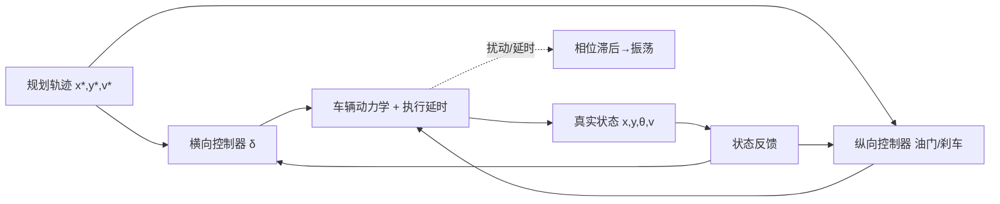

# 六、车辆控制：把轨迹变成方向盘与刹车

## 1. 引言

有一次我们在高速上做变道测试，规划层给了条很优雅的 S 形变道轨迹，曲率连续、jerk 也控制得挺好。可一上线，方向盘就像帕金森一样高频抖动——乘客形容"像在搓衣板上开车"。我把横向误差（lateral error）和方向盘转角（steering angle）同时打在示波器上，发现一个诡异现象：误差明明只有几厘米，方向盘却以两三赫兹的频率来回抽。最后定位到两个根因：一是 **Pure Pursuit（纯追踪）的预瞄距离（look-ahead distance）被设得太短**，车死死盯着脚下那一点，轨迹任何微小扰动都被放大成"急打方向"；二是 **控制指令到轮胎响应有 80ms 的执行延时（actuator delay）**，控制器在"过去的状态"上算出的修正量，用到"现在的车"上已经过时，于是系统进入了相位滞后→超调→再修正的振荡闭环。

这件事让我明白：规划算得再漂亮，落到真实车上还得过"控制"这一关。控制要干的事非常纯粹——**让车实时、稳定、平滑地贴合规划给出的轨迹，把 $(x,y,\theta,v)$ 的误差压到零附近，同时别让乘客吐出来**。本章从车辆动力学讲起，串起横向、纵向到 MPC 的完整控制链路。

## 2. 核心概念

车辆控制（Vehicle Control）把规划轨迹变成执行器指令：方向盘转角 $\delta$、油门/刹车。它天然分两条线：

- **横向控制（lateral control）**：管"走哪条线"，跟踪轨迹的几何形状，典型方法 Pure Pursuit、Stanley、LQR。
- **纵向控制（longitudinal control）**：管"走多快"，跟踪目标车速或与前车的安全距离，典型方法 PID（ACC 自适应巡航）。

理解控制必须先懂车辆动力学。最常用的是**自行车模型（bicycle model）**：把前后轴各浓缩成一个轮子，用轴距 $L$ 描述转向几何。在低速小角度近似下，车辆横向误差动力学是线性系统——这正是 LQR 能闭式求解的基础。

轮胎的关键非线性是**侧偏（slip angle）**：轮胎接地点的速度方向与轮面朝向不一致，产生侧向力；侧向力近似与侧偏角线性正相关（线性区），但超过临界角就饱和——这是高速失控的物理根源。

下面用一张框图串起从轨迹到执行器的链路：



关键参数：控制频率（典型 50~100Hz，高于规划 10Hz）、预瞄距离（2~10m 随速变）、最大方向盘角速度、PID 的 $K_p/K_i/K_d$、LQR 权重 $Q,R$、执行延时（50~100ms）。

## 3. 机制深拆

### 3.1 自行车模型与横向误差动力学

自行车模型运动方程（以车辆速度为 $v$、前轮转角 $\delta$）：

$$\dot x = v\cos\theta,\quad \dot y = v\sin\theta,\quad \dot\theta = \frac{v}{L}\tan\delta$$

把横向误差 $e$（车到参考路径的法向距离）与航向误差 $e_\theta$ 作为状态，在参考路径切线坐标系下线性化，得到经典的横向误差状态空间：

$$\dot e = A\,e + B\,\delta,\qquad e = \begin{bmatrix} e_y \\ \dot e_y \\ e_\theta \end{bmatrix}$$

其中 $A$ 含车速 $v$、路径曲率 $\kappa$，$B$ 把方向盘转角映射到横向加速度。LQR 就是在这个线性时不变（LTI）模型上，解黎卡提方程（Riccati）得到最优反馈增益 $K$，使代价 $J=\int (e^T Q e + \delta^T R \delta)\,dt$ 最小。

### 3.2 三种横向控制器

- **Pure Pursuit**：在参考轨迹上取前方距离 $L_d$ 处的目标点，算一个让车朝该点的圆弧转角 $\delta=\arctan(2L\sin\alpha / L_d)$，$\alpha$ 是车头与目标点夹角。简单鲁棒，但 $L_d$ 短了抖、长了钝。
- **Stanley**：斯坦福沙漠赛车算法，转角 = 航向误差 + 横向误差的反馈项 $\delta = e_\theta + \arctan(k e_y / v)$，对横向误差收敛快。
- **LQR**：基于上述误差动力学统一最优，平滑且可整定权重，工程最常用。

### 3.3 MPC：滚动优化的控制

模型预测控制（MPC, Model Predictive Control）在每一步：用车辆模型向前预测 $N$ 步，解一个带约束（转向/加速度上下限、安全间距）的优化问题，只取第一步执行，下一步重新预测——这就是"滚动（receding horizon）"。它天然能处理多约束、多变量耦合，是高级控制的方向，但实时求解器（qpOASES/OSQP）的算力压力不小。

### 3.4 延时补偿

执行延时 $\tau$ 会让控制量"迟到"。常用补偿：用模型把状态从 $t$ 外推到 $t+\tau$（即"在预测的未来状态上算控制量"），或在 MPC 预测里直接把延时纳入模型。数学上相当于用 $\hat x(t+\tau)$ 替代 $x(t)$ 进入反馈。

## 4. 工程实践

下面给出 LQR 横向控制的状态空间形式与控制伪代码（C 思路亦可映射）：

```python
import numpy as np
from scipy.linalg import solve_continuous_are

def lqr_lateral_gain(v, L, Q, R):
    # 线性化横向误差模型 A,B（简化三状态：横向误差/误差率/航向误差）
    A = np.array([[0, 1, 0],
                  [0, 0, v],
                  [0, 0, 0]])
    B = np.array([[0], [0], [v / L]])
    P = solve_continuous_are(A, B, Q, R)
    K = np.linalg.inv(R) @ B.T @ P
    return K

def lateral_control(K, state, v, delta_prev, dt, delay_tau=0.08):
    # 延时补偿：用模型外推未来状态
    e_y, e_y_dot, e_theta = state
    e_y_pred = e_y + e_y_dot * delay_tau
    e_theta_pred = e_theta
    x = np.array([e_y_pred, e_y_dot, e_theta_pred])
    delta = float(K @ x)          # 前轮转角指令
    # 限幅 + 角速度约束（执行器物理限制）
    delta = np.clip(delta, -0.6, 0.6)
    max_rate = 1.5 * dt
    delta = np.clip(delta, delta_prev - max_rate, delta_prev + max_rate)
    return delta
```

车规落地坑：① 模型在低速时 $v\to 0$ 数值病态，要加最小速度保护；② 延时补偿的 $\tau$ 必须用实车标定，拍脑袋写 80ms 往往偏保守或偏冒进；③ 方向盘角速度/角加速度限幅不能省，否则执行器报故障；④ 控制频率必须严格高于规划频率，否则插值轨迹的曲率突变被放大成抖动。

## 5. 常见坑

1. **预瞄距离固定**：低速太钝、高速太抖，应按 $L_d = k\cdot v$ 随速变。
2. **忽略执行延时**：在过时状态上闭环，相位滞后致振荡，必须延时补偿。
3. **低速模型奇异**：自行车模型 $v\to0$ 时 LQR 增益发散，需设最小速度。
4. **坐标/符号错配**：方向盘左正右负与模型约定反了，车往反方向修。
5. **只控横向不控纵向**：变道时纵向不减速，侧偏角过大轮胎饱和失控。
6. **限幅缺失**：控制量超执行器能力，触发硬件保护导致甩锅。
7. **规划点插值不当**：10Hz 轨迹在 100Hz 控制下线性插值，曲率阶跃。
8. **积分 windup（PID 饱和）**：误差长期存在时积分项爆掉，要抗饱和。
9. **标定参数未随载变**：满载/空载重心变了，LQR 模型参数要重标。
10. **MPC 求解超时**：实时求解器未在周期内收敛，需热启动+迭代上限。
11. **噪声未滤波**：位置/航向噪声直接进反馈，高频抖动，需 Kalman/低通。
12. **忽略路面附着**：湿滑路面同一转角侧向力骤降，开环增益失效。

## 6. 面试要点

1. **Pure Pursuit 预瞄距离怎么选？** 随车速增大，太短抖、太长迟钝，常 $L_d=kv$。
2. **Stanley 与 Pure Pursuit 区别？** Stanley 还用航向误差与速度倒数反馈，收敛更快更平滑。
3. **LQR 横向控制状态怎么定义？** 横向误差、误差变化率、航向误差三状态，解 Riccati 得 K。
4. **为什么高速变道会抖？** 预瞄太短+执行延时导致相位滞后振荡。
5. **MPC 相比 LQR 优势？** 显式处理约束与多步预测，能处理非线性/耦合。
6. **执行延时怎么补偿？** 用模型把状态外推 $\tau$，在预测未来态上算控制量。
7. **控制频率和规划频率为何要匹配？** 控制须更高频，否则轨迹插值致曲率突变抖动。
8. **自行车模型假设前提？** 低速小角度、轮胎线性、忽略侧倾，失效于高速急转。
9. **轮胎侧偏饱和意味着什么？** 超出线性区侧向力不再增，车失去横向前瞻→失控。
10. **PID 在纵向 ACC 里怎么用？** 误差=期望车距-实际车距(或速度差)，输出油门/刹车。
11. **MPC 实时性挑战？** 在线解优化，需高效 QP 求解器+热启动，否则超时降级。
12. **转向角速度限幅为什么重要？** 执行器物理/舒适限制，否则硬件保护或乘客不适。

## 7. 结语

一页纸回顾：车辆控制是"轨迹→执行器"的最后一步，分横向（Pure Pursuit/Stanley/LQR）与纵向（PID/ACC）。底层是自行车模型与轮胎侧偏动力学；LQR 在线性化误差模型 $\dot e=Ae+B\delta$ 上求最优增益；MPC 用滚动优化优雅处理多约束但吃算力；执行延时是实车抖动的头号元凶，必须补偿。三条工程铁律：控制频率高于规划、参数随速/载荷标定、限幅与滤波不可省。

延伸阅读：Rajamani《Vehicle Dynamics and Control》（LQR/动力学经典）、Stanford Stanley 论文、MPC 标准教材 Maciejowski、Apollo 与 Autoware 控制模块源码、qpOASES/OSQP 求解器文档。

本章约 2100 字。
