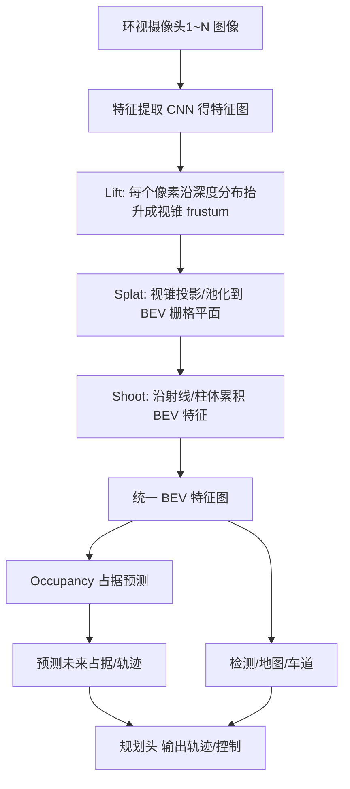

# 七、端到端智驾：从"模块化拼装"到"大模型开车"

## 1. 引言

我们团队曾在一个施工区路段吃过暗亏。那天前方是异形改道——几辆工程车斜着摆成导引线，地上画着临时黄虚线，还停着一台从没在训练集里见过的"吊臂半挂"。我们那套模块化系统（感知检测→预测→规则决策→规划→控制）当场傻眼：目标检测网络把吊臂半挂识别成了"卡车+长杆"两个独立目标，预测模块给不出合理轨迹，决策规则里又没有"施工区斜列引导"这一条，于是车在离改道口三十米处犹豫、减速、再犹豫，最后急停等人工接管。而同场另一台跑端到端（end-to-end）原型车的同事，居然顺着黄虚线和工程车缝隙丝滑地绕了过去——它没"认识"那台怪车，但它从海量人类驾驶数据里学到了"顺着临时标线走"的直觉。

这个故事把两种范式摆在了台面上：传统模块化像严谨的乐高拼装，每步可解释但怕长尾；端到端像老司机的肌肉记忆，能处理没见过的场景，却是个让人心里没底的"黑盒"。本章就拆解端到端智驾——它怎么从多摄像头原始数据，一路"端"到方向盘和油门。

## 2. 核心概念

**模块化（modular）** 流水线：感知（检测/分割/跟踪）→ 预测（轨迹预测）→ 决策（行为/规则）→ 规划（轨迹生成）→ 控制。各模块解耦、可单独调试、符合功能安全（safety case）审计，**缺点是误差逐级累积、接口信息有损、长尾场景难覆盖**。

**端到端（end-to-end）**：输入传感器原始数据（多路摄像头/激光雷达），直接输出规划轨迹甚至控制指令，中间环节由神经网络一体学出。优势是**信息无损、能涌现处理长尾、减少手工规则**；代价是**可解释性差、安全验证难、数据依赖强**。

端到端落地的几块关键拼图：

- **BEV 感知（Bird's-Eye-View）**：把多摄像头透视图像"升"到统一俯视坐标系，让网络在一个空间里看世界。
- **Occupancy 占据网络**：不检测具体物体，而是预测每个 3D 栅格是否被占据，天然解决"长尾物体无法枚举"的难题。
- **端到端规划（UniAD/VAD 等）**：把感知-预测-规划统一进一个可微网络，联合优化。

下面用一张数据流图，展示 LSS（Lift-Splat-Shoot）如何把多路视锥特征投影到 BEV 栅格：



关键参数：BEV 栅格分辨率（0.5m 常见）、占据网络时序长度（未来 2~8s）、训练数据量（百万级 clips）、推理算力（数十~上百 TOPS）。

## 3. 机制深拆

### 3.1 LSS 的视锥→BEV 投影

Lift-Splat-Shoot 三步走，核心是深度分布提升（lift）。对图像特征图上每个像素 $p$，网络预测一个离散深度分布 $w_d(p)$，把它复制成 $D$ 个"深度片"，每个片是 $w_d(p)$ 加权的特征向量，于是每个像素变成一条沿相机射线分布的**视锥（frustum）**。数学上，像素坐标 $p=(u,v)$ 在深度 $d$ 处对应的 3D 点：

$$X = d\cdot K^{-1}[u,v,1]^T$$

其中 $K$ 是相机内参。Splat 步把这些 3D 点通过外参投影到 BEV 平面网格并池化累积；Shoot 步沿 BEV 柱体做特征累积，得到 $(H,W,C)$ 的鸟瞰特征。

### 3.2 Occupancy 占据栅格

占据网络（Occupancy Network）输出每个体素（voxel）被占据的概率 $o\in[0,1]$ 及流速（用于动态预测）：

$$\hat o_{i,t+1} = f_\theta(I_{1..N,t},\, \mathrm{ego}_t)[i]$$

它不关心"那是不是一台吊臂半挂"，只关心"那个格子有没有东西、往哪动"——于是任何形状、任何长尾物体都能被统一表征，彻底绕开"检测类别必须预先枚举"的死穴。

### 3.3 端到端联合优化

以 UniAD 为例，感知、预测、规划共享 BEV 特征，规划头以"未来轨迹"为监督，用模仿学习（imitation learning）最小化预测轨迹与人类专家轨迹的误差：

$$\mathcal L = \sum_{t}\|\hat\tau_t - \tau_t^{\mathrm{expert}}\|^2 + \lambda\,\mathcal L_{\mathrm{perc}} + \lambda'\,\mathcal L_{\mathrm{pred}}$$

信息在统一表征里往返流动，预测错误也会反向改善感知，这是模块化流水线难以做到的。

## 4. 工程实践

下面给出 BEV-LSS 投影与占据预测的 PyTorch 风格伪代码（教学简化版）：

```python
import torch
import torch.nn.functional as F

def lift_splat(feat, depth_dist, intrinsics, extrinsics, bev_size=(200, 200)):
    B, C, H, W = feat.shape
    D = depth_dist.shape[1]
    # Lift: 沿深度复制成视锥 (B,D,H,W,C)
    frustum = feat.unsqueeze(1) * depth_dist.permute(0,2,3,1).unsqueeze(-1)  # 加权
    # 视锥 3D 坐标 (用内参反投影)
    # Splat: 通过外参投到 BEV 网格并 scatter 累积
    points = backproject(frustum, intrinsics)              # (N,3)
    coords = world_to_bev(points, extrinsics, bev_size)    # 体素坐标
    bev = torch.zeros(B, C, *bev_size)
    bev = scatter_add(bev, coords, frustum.flatten(0,2))    # 累积特征
    return bev

def occupancy_head(bev, future_steps=8):
    # 预测未来每步占据概率 + 流速
    occ = torch.sigmoid(conv3d(bev.unsqueeze(2), future_steps))  # (B,T,H,W)
    flow = conv3d(bev.unsqueeze(2), future_steps)                # 流速场
    return occ, flow

# 训练：模仿学习，最小化与专家轨迹差异
loss = F.mse_loss(pred_traj, expert_traj) + 0.1 * occupancy_loss
loss.backward(); optimizer.step()
```

车规落地坑：① 端到端对数据分布极敏感，训练集没有"雪天施工区"测试就翻车；② 推理需几十 TOPS，必须量化/蒸馏才能上车；③ 不可解释导致 ISO 26262 功能安全难举证，常需外接"安全护栏"；④ 闭环稳定性（仿真→实车分布偏移）要靠大规模闭环评测兜底。

## 5. 常见坑

1. **因果混淆**：模型学到"晴天=直行"的虚假相关，阴天就乱来，需去偏数据。
2. **分布偏移（domain gap）**：仿真训练、实车推理，BEV 特征分布变了全盘失效。
3. **长尾缺失**：异形车/施工区没进训练集，黑盒直接失误，需安全护栏兜底。
4. **可解释性赤字**：出事故没法说清"为什么踩刹车"，难做 safety case。
5. **闭环不稳定**：开环训练好、闭环跑飞，因为误差会累积放大。
6. **占据网络假阳/假阴**：远处栅格噪声大，误判障碍物致无故急刹。
7. **多摄像头时间不同步**：前后摄帧差几毫秒，BEV 拼接出现"鬼影错位"。
8. **算力超标**：大模型上车超功耗预算，必须 INT8 量化+蒸馏。
9. **模仿学习盲区**：专家也救不了的极端场景，模型学着"摆烂"。
10. **标定漂移**：相机内外参变了，BEV 投影整体偏，需在线标定。
11. **安全验证无标准**：端到端难用传统形式化验证，靠大规模路测补。
12. **梯度消失/爆炸**：深层联合训练，感知与规划梯度尺度不一难收敛。

## 6. 面试要点

1. **模块化 vs 端到端核心区别？** 模块化信息有损、可解释；端到端信息无损、强长尾但黑盒。
2. **BEV 为什么重要？** 统一俯视坐标系，多摄特征融合、利于规划与占据。
3. **LSS 三步分别做什么？** Lift 抬升视锥、Splat 投到 BEV、Shoot 沿柱累积。
4. **Occupancy 解决什么痛点？** 不必枚举物体类别，统一用占据栅格表征任意形状。
5. **UniAD 思想？** 感知-预测-规划共享 BEV 特征，端到端联合可微优化。
6. **端到端为什么难做功能安全？** 黑盒不可解释，难满足 ISO 26262 可追溯性。
7. **模仿学习局限？** 只学专家分布，专家不会的极端场景学不到/学错。
8. **怎么缓解黑盒风险？** 加安全护栏（规则校验/冗余模块/可解释监督）。
9. **BEV 时间同步为何关键？** 多摄帧差致拼接错位，需硬件/PTP 同步。
10. **占据网络的输出是什么？** 体素占据概率 + 流速场（动态预测）。
11. **端到端训练数据要多大？** 通常百万级驾驶片段，且需覆盖长尾。
12. **VAD 相比 UniAD 区别？** VAD 用矢量化场景表征，更高效、更省算力。

## 7. 结语

一页纸回顾：端到端把"感知-预测-决策-规划"压进一个可微网络，用 BEV（LSS/Transformer）统一空间、用 Occupancy 统一物体表征、用联合优化替代手工规则，擅长长尾与信息无损，但代价是可解释性与安全验证。施工区的"黑盒失误"提醒我们：端到端不是银弹，必须配安全护栏与大规模闭环评测。两种范式并非你死我活——当下最务实的是"端到端为主、规则护栏兜底"的混合架构。

延伸阅读：LSS 论文（Lift, Splat, Shoot）、Occupancy 系列（TESLA Occupancy、OccFormer）、UniAD 与 VAD 论文、模仿学习（DAgger）、地平线/毫末等厂商端到端技术报告、ISO 26262 与预期功能安全 SOTIF（ISO 21448）。

本章约 2100 字。
