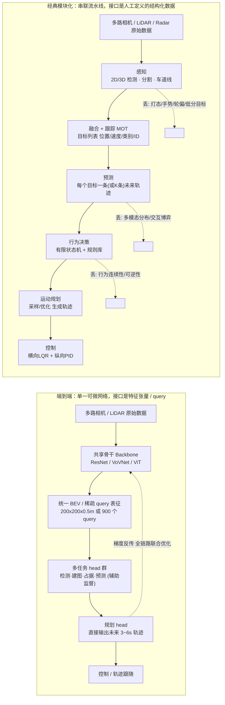
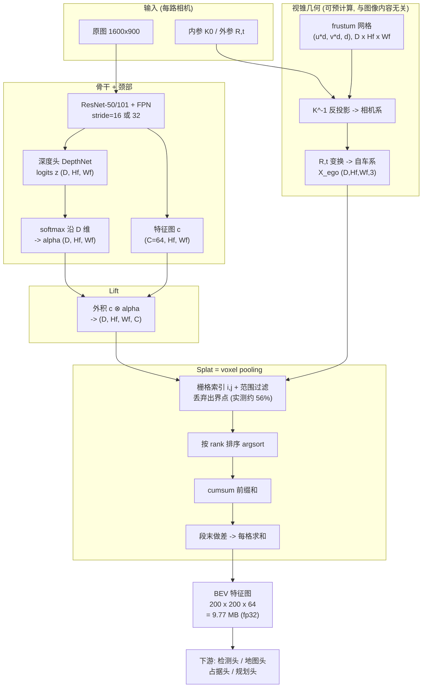
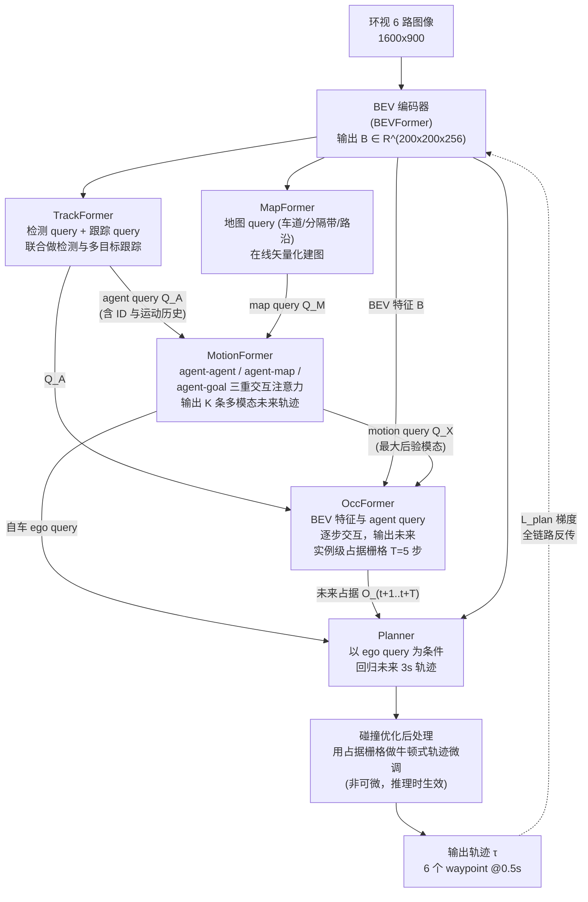
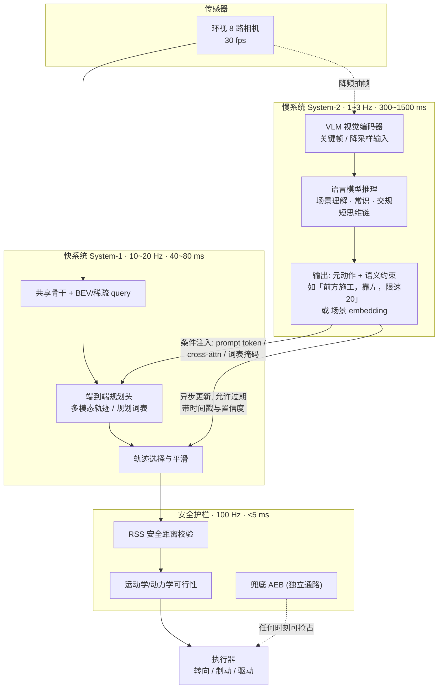

# 七、端到端智驾：从"模块化拼装"到"大模型开车"

## 0. 引言：施工区里，端到端丝滑绕行了三十秒，然后一头扎向那台吊臂车

那天是九月的一个下午，四点二十分，天阴，路面刚下过一场雷阵雨还没干透。我们在城郊一条双向六车道的主干道上做对比测试：一台跑传统模块化栈的 A 车，一台跑端到端原型的 B 车，同一段路，前后相隔两分钟通过。

那段路正在修排水管，施工方把改道摆得极其随性——七八个反光锥桶斜着排成一条不连续的引导线，中间还漏了两个空档；地上用黄漆临时画了一条虚线，压在原来的白色实线上，两组线在四十米开外交叉成一个"X"；最要命的是引导线尽头停着一台**吊臂半挂**：车头是常规的六轮重卡，车斗上却横架着一根伸出去将近四米、末端还吊着配重块的吊臂，臂身涂着黄黑相间的警示斜纹，正好悬在相邻车道上方约两米二的高度。

A 车先进去。副驾屏幕上的目标列表当场分裂了：检测网络给车头打了一个 `truck, 0.91` 的框，又给悬在半空的吊臂单独打了一个 `unknown, 0.43` 的框，两个框在跟踪器里被分配了两个独立 ID，速度都是零，但因为吊臂那个框在 BEV 上投影到了隔壁车道，行为决策模块认定"相邻车道有静止障碍物"，于是既不敢并线，也不敢直行。规则库里没有"施工区斜列锥桶引导"这一条，横向规划器只认原来那条白色实线，于是车在距改道口三十二米处开始犹豫：减速到 18 km/h，方向盘小幅左右摆动，两秒后减到 6 km/h，最后停住，仪表盘弹出"请接管"。安全员踩了油门，人工绕了过去。

B 车两分钟后进来。它没有目标列表，屏幕上只有一层半透明的 BEV 特征热力图和一条粉色的规划轨迹。它**完全没有"识别"那台吊臂车**——事后我们把那一帧的中间特征掏出来看，吊臂区域的响应和一堆背景树冠没什么区别。但它顺着黄虚线的走向、贴着锥桶留出的空档，用一条平滑的 S 形轨迹以 24 km/h 丝滑地绕了过去，整个过程没有一次犹豫。车上四个人当场就笑了，有人说了句"这就是老司机的肌肉记忆"。

笑声只持续了三十秒。绕过施工区、道路重新变宽之后，B 车在一个几乎没有任何特征的直路段上突然向右偏了 0.4 米，右前轮压上了路肩的排水沟盖板，车身猛地一顿，安全员一把方向拽了回来。复盘录像看了十几遍才找到线索：那一段路的右侧路缘石被施工挖开了一段，露出的深色泥土在湿滑路面反光下，和训练数据里"雨天路面"的纹理极为相似——模型大概率把那片泥土当成了可行驶区域的延伸。**它没有做错任何一步推理，因为它根本没有"步"可言。**

白板上那天写了两行字。第一行：**模块化系统的失败是"看得见的失败"——你能指着某个模块说它错了；端到端的失败是"看不见的失败"——你只能指着结果说它错了。** 第二行：**前者的天花板是人工规则的枚举能力，后者的天花板是数据分布的覆盖能力。**

这一章我们把端到端智驾从范式之争拆到 BEV/Occupancy 的数学，再拆到 UniAD/VAD/FSD 的架构，最后拆到车端 254 TOPS 算力预算和 ISO 21448 SOTIF 的验证困境。

---

## 1. 核心概念

### 1.1 三种范式，而不是两种

绝大多数讨论把问题简化成"模块化 vs 端到端"的二元对立，这是不准确的。工业界实际存在**三条**技术路线，第三条才是当前量产的主流：

| 范式 | 英文 | 模块间接口 | 是否端到端可微 | 代表 |
|---|---|---|---|---|
| **经典模块化** | classical modular | 人工定义的结构化数据（目标列表、车道线方程、栅格图） | 否，各模块独立训练/手写 | Apollo 3.x、早期量产 NOA |
| **显式接口可微分** | differentiable modular / explicit-interface E2E | 仍保留感知/预测/规划的**语义化中间输出**，但接口是可微张量（query、BEV 特征），支持梯度回传 | 是，但保留中间监督 | UniAD、VAD、PARA-Drive |
| **隐式端到端（一张网）** | implicit end-to-end / "one network" | 无人类可读中间量，或只保留极少辅助头 | 是，端到端反传 | 特斯拉 FSD v12+、部分 Robotaxi 原型 |

第二类才是过去三年论文与量产共同收敛的位置。它的核心主张是：**"端到端"要的是梯度打通，不是把中间结果全部删掉。** 保留中间监督既能提供训练信号（缓解稀疏奖励），又能保留一部分可解释性用于安全举证——这是一个非常务实的折中。

### 1.2 误差累积：串联系统的方差是怎么被放大的

模块化流水线是一条串联链。设第 $k$ 级模块的输入为 $x_{k-1}$、输出为 $x_k = f_k(x_{k-1}) + \epsilon_k$，其中 $\epsilon_k$ 是该级的建模误差与噪声，$\mathrm{Var}(\epsilon_k) = \sigma_k^2$。对 $f_k$ 在工作点做一阶展开，记雅可比 $J_k = \partial f_k / \partial x_{k-1}$，则末级输出的误差协方差递推为：

$$\Sigma_k = J_k \Sigma_{k-1} J_k^\top + \sigma_k^2 I$$

展开到 $K$ 级：

$$\Sigma_K = \sum_{k=1}^{K} \left(\prod_{j=k+1}^{K} J_j\right)\sigma_k^2 \left(\prod_{j=k+1}^{K} J_j\right)^{\!\top}$$

这个式子说了两件事：

1. **误差是求和的**——每一级都往里加自己的 $\sigma_k^2$，不会有任何一级帮你把前面的错误"改回去"（因为下游模块把上游输出当作真值）。
2. **误差是被放大的**——放大倍数是下游所有雅可比的连乘 $\prod J_j$。规划模块对感知位置误差的敏感度 $\|J_{\text{plan}}\|$ 在近距离切入场景可以轻松超过 1。

**代入一组真实量级**：视觉 3D 检测的平均平移误差（mATE）约 0.55 m（nuScenes 纯视觉 SOTA 量级），跟踪滤波再引入约 0.15 m 的滞后，轨迹预测在 3 s 时域的 minADE 约 0.6~1.2 m，规划器对预测轨迹的跟随误差约 0.2 m。即便假设各级独立、雅可比为 1，均方根合成也有

$$\sqrt{0.55^2 + 0.15^2 + 0.9^2 + 0.2^2} \approx 1.09\ \text{m}$$

而一条标准车道宽 3.5 m，车宽 1.9 m，两侧余量各只有 0.8 m。**1.09 m 的累积误差已经超过了单侧余量。** 这就是为什么模块化系统必须在每一级都加保守裕度（膨胀障碍物、放大安全距离），而保守裕度又直接导致"太怂"的驾驶体验——急刹、不敢并线、路口犹豫。

端到端的主张是：既然误差最终要在轨迹上体现，那就**直接对轨迹求梯度**，让上游自己学会"哪种错误对最终轨迹危害大"。数学上，端到端优化的是

$$\min_\theta \mathbb{E}\big[\ell(\tau_\theta(o), \tau^\ast)\big]$$

而模块化优化的是 $\sum_k \min_{\theta_k}\mathbb{E}[\ell_k(x_k, x_k^\ast)]$——**后者是前者的一个代理（surrogate），而且是没有一致性保证的代理**。检测 mAP 提高 2 个点，规划碰撞率完全可能不降反升，这在实践中反复发生。

### 1.3 信息瓶颈：每一级人为抽象到底丢了什么

比误差累积更隐蔽的是**信息瓶颈（information bottleneck）**。用互信息刻画：设原始观测 $O$，人工中间表征 $Z$，最优驾驶动作 $A^\ast$。由数据处理不等式（data processing inequality），对任意确定性或随机映射 $O \to Z$：

$$I(Z; A^\ast) \leq I(O; A^\ast)$$

等号成立当且仅当 $Z$ 是关于 $A^\ast$ 的**充分统计量（sufficient statistic）**。而人工设计的接口几乎从来不是充分统计量。逐级点名它丢了什么：

| 抽象步骤 | 保留的 | **不可逆丢失的** | 后果举例 |
|---|---|---|---|
| 图像 → 3D 检测框 | 位置、尺寸、航向、类别 | 姿态细节（车轮转角、车头朝向微偏）、转向灯/刹车灯状态、驾驶员手势与视线、车身姿态（是否在压线） | 无法预判"轮子已经打了 5° 的车即将并线" |
| 检测框 → 目标列表 | Top-K 高置信目标 | 置信度 0.2~0.35 之间的"疑似目标"、完整的不确定性分布 | 施工区异形物被门限过滤，下游永远看不到 |
| 语义分割 → 可行驶区域 | 二值/多类掩码 | 表面材质、湿滑程度、坑洼深度、松散砂石 | 分不清"积水" 和"深坑" |
| 车道线 → 多项式方程 | 3~4 个系数 | 标线新旧、虚实置信度、旧线残留、施工临时线 | 双套标线并存时只能二选一 |
| 预测 → 单条最可能轨迹 | 均值轨迹 | 多模态分布、模态间概率、交互式博弈依赖 | "让还是不让"的博弈退化成固定假设 |
| 决策 → 有限状态机 | 离散行为标签 | 行为之间的连续过渡、置信度、可逆性 | 状态抖动（跟车↔并线来回切） |

一个特别值得说的例子：**转向灯**。人类司机识别并线意图，很大程度靠转向灯和车轮偏角。而"3D 检测框"这个接口里根本没有存放转向灯状态的字段——除非你专门加一个 `turn_signal` 属性头，而这又需要专门的标注。**端到端不需要有人想到"应该加转向灯这个字段"**，只要数据里出现过足够多"打灯→并线"的关联，网络自己会用上图像里那几个像素。这就是"信息无损"最实在的含义。

反过来说，信息瓶颈也不是纯负面的：它同时也是**正则化**。丢掉细节意味着模型不容易过拟合到虚假相关（spurious correlation）。端到端最经典的失败模式——学到"看见蓝天就直行"、"看见这个路口的某棵树就减速"——恰恰是因为没有瓶颈约束。这是后面 8.1 节"因果混淆"的根源。

### 1.4 四维对比：可解释性 / 可验证性 / 数据需求 / 算力

| 维度 | 经典模块化 | 显式接口可微分（UniAD/VAD 类） | 隐式端到端（一张网） |
|---|---|---|---|
| **可解释性** | 高。任一时刻可导出目标列表、决策理由、规则触发日志，事故可逐级回放定位 | 中。可导出 BEV 特征可视化、检测/建图/预测中间结果、注意力图；但"为什么选这条轨迹"仍不完全可解释 | 低。只有输入输出；只能靠显著性图（saliency）、反事实扰动（counterfactual probing）事后归因 |
| **可验证性** | 高。可对单模块做单元测试、形式化验证（如规划器的可达集分析）、覆盖率统计 | 中。可对中间头做指标回归，但联合行为仍需闭环仿真验证 | 低。只能做统计性验证：大规模闭环仿真 + 实车里程；无法穷举，只能给置信区间 |
| **数据需求** | 低~中。各模块分别标注，感知 10~50 万帧标注即可起步；规则不需要数据 | 高。需要**时序连续**的多任务标注（检测+跟踪+地图+预测+占据+轨迹），成本是纯检测的 5~10 倍 | 极高。百万级 clip、数万小时视频；且必须覆盖长尾。特斯拉公开口径是从数百万段人类驾驶视频中筛选"优秀驾驶片段" |
| **训练算力** | 低。单模块 8~32 卡 × 数天 | 高。UniAD 官方配置约 8×A100 训练 6 天（分阶段） | 极高。集群级。特斯拉为 FSD 训练建设的算力规模公开宣称达到 10 万卡量级 H100 等效 |
| **车端算力** | 中。多个小模型 + 大量 CPU 规则代码，NPU 占用 30~60 TOPS | 高。单个大模型，80~150 TOPS，且访存密集 | 高~极高。视方案 100~250 TOPS；带 VLM 的方案需要额外的大模型推理资源 |
| **长尾能力** | 差。依赖规则枚举，未枚举即失效 | 中上。占据/BEV 表征天然覆盖未知形状 | 好。能涌现人类式的"绕行直觉"，但失败时无兜底 |
| **迭代方式** | 改代码、改参数、改规则。改动可精确定位 | 改数据 + 改损失权重 + 改结构。回归风险中等 | 纯改数据。**"数据即代码"**，回归风险高：加一批数据可能让另一批场景变差 |
| **功能安全举证** | 可走 ISO 26262 传统路径 | 需要 SOTIF（ISO 21448）+ 传统路径混合 | 传统路径基本失效，只能靠 SOTIF 的统计论证 + 外部安全护栏 |

**一句话总结这张表**：模块化把复杂度放在**代码**里，端到端把复杂度放在**数据**里。代码的复杂度会随功能线性增长且可审计；数据的复杂度随场景组合爆炸增长且不可审计。这不是"谁更好"的问题，是"你的组织更擅长管理哪一种复杂度"的问题。

### 1.5 两条数据流的正面对比



图里最关键的是端到端那条**从规划头回到骨干的虚线**：正是这条梯度通路，让"什么信息该被提取"由最终驾驶目标决定，而不是由某个算法工程师在三年前设计接口时的想象决定。

### 1.6 端到端的四块拼图

后面五节分别深拆这四块（外加一块生成式）：

- **BEV 感知**：把多相机透视图统一到俯视坐标系，解决"六只眼睛各说各话"。→ 第 2 节
- **Occupancy 占据网络**：放弃类别枚举，只回答"这块空间能不能过"。→ 第 3 节
- **端到端规划**：把感知-预测-规划压进一个可微图。→ 第 4 节
- **世界模型 / 扩散策略**：造数据、做仿真、生成多模态轨迹。→ 第 5 节
- **VLM/VLA**：给车装一个能讲道理的慢系统。→ 第 6 节

---

## 2. BEV 感知：把六只眼睛拧成一张俯视图

### 2.1 为什么非要 BEV 不可

先说清楚**不用 BEV 会怎样**。传统多相机方案是"每路相机各自做 2D 检测 → 各自单目 3D 估计 → 在自车系做后融合"。这条路有四个绕不过去的死结：

1. **跨相机目标重复与割裂**。一辆位于前左相机与前视相机重叠视场（FOV overlap）里的车，会被检测两次，得到两个位置略有差异的 3D 框。后融合要靠 IoU 或马氏距离做关联，而两路的单目深度误差都在 ±1.5 m 量级，关联门限设窄了漏关联（一辆车变两辆），设宽了误关联（两辆车并成一辆）。更糟的是**被切开的目标**：一辆横向大巴一半在前视、一半在前左视，两边各看到半个车身，各自估出的车长是 6 m 而不是 12 m。

2. **尺度不一致**。透视图（perspective view）里同一个物理尺寸在不同深度对应完全不同的像素数——远处 20 px、近处 400 px。卷积核的感受野是像素单位的，这意味着**同一个卷积核在处理近处和远处目标时看到的物理范围差 20 倍**。BEV 空间里 1 个格子恒等于 0.5 m，卷积核的物理感受野恒定，这对网络学习"车的物理尺寸先验"是决定性的简化。

3. **难以与地图和规划对接**。高精地图、导航路径、可行驶区域、规划轨迹，全部天然定义在自车俯视平面上。感知输出如果不在这个平面上，就得做一次坐标变换，而这次变换正好是信息瓶颈的重灾区（需要先把特征塌缩成结构化的框才能变换）。BEV 特征图可以**直接与地图栅格 concat**，让网络自己学如何融合。

4. **时序融合无处安放**。要利用历史帧，必须先把历史特征对齐到当前自车系。在透视图里做这件事需要知道每个像素的深度（否则没法做刚体变换）；在 BEV 里只需要一次 2D 仿射变换（自车位姿的平移+旋转），一次 `grid_sample` 就完成。**BEV 是时序融合的天然容器。**

一个数字上的对照：nuScenes 上，同样的骨干网络（ResNet-101），FCOS3D（透视图单目 3D）的 NDS 约 0.42，而 BEVFormer-base 约 0.57——**同样的图像、同样的骨干，只是换了个表征空间，NDS 提升 15 个点**。表征形式确实比网络结构更重要。

### 2.2 LSS：Lift-Splat-Shoot 的完整数学

LSS（Lift, Splat, Shoot，ECCV 2020）是"显式深度分布"这条路线的开山之作，也是 BEVDet/BEVDepth/BEVFusion 的共同基座。它的洞见极其朴素：**单目没有深度，那我就不猜一个深度，我预测整个深度的概率分布，把特征按概率"抹"到所有可能的深度上去。**

#### 2.2.1 Lift：从 2D 特征到视锥点云

设某路相机的骨干输出特征图 $\mathbf{c} \in \mathbb{R}^{C \times H_f \times W_f}$（$H_f = H/s$，$s$ 为 stride，典型 16 或 32）。同时网络对**每个特征像素** $p=(u,v)$ 额外预测一个 $D$ 维的离散深度分布：

$$\boldsymbol{\alpha}(p) = \mathrm{softmax}\big(\mathbf{z}(p)\big) \in \mathbb{R}^{D}, \qquad \sum_{d=1}^{D}\alpha_d(p) = 1,\ \ \alpha_d \geq 0$$

深度 bin 通常等距划分，记 $\mathcal{D} = \{d_1, \dots, d_D\}$。BEVDet 的默认配置是 $[1, 60)$ m、步长 1 m，即 $D = 59$；LSS 原文是 $[4, 45)$ m 步长 1 m，$D = 41$。

**Lift 操作就是一个外积（outer product）**：

$$\mathbf{c}^{\text{frustum}}(p, d) = \alpha_d(p)\cdot \mathbf{c}(p) \ \in \mathbb{R}^{C}$$

写成张量形式：

$$\mathbf{C}^{\text{frustum}} = \mathbf{c} \otimes \boldsymbol{\alpha} \ \in \mathbb{R}^{D \times H_f \times W_f \times C}$$

**这一步的语义非常重要**：网络并没有"决定"这个像素在 12.3 m 处，而是说"它有 40% 的可能在 12 m，30% 在 13 m，10% 在 25 m……"。特征被按这个权重复制到每一层深度片上。如果网络对深度很确定（分布尖锐），大部分能量集中在一个 bin；如果不确定（分布平坦），能量被抹开，在 BEV 上表现为一条沿射线的"拖尾"。**深度分布的熵，就是这个像素深度不确定性的直接度量**——这是 LSS 一个被低估的副产品，可以直接拿来做不确定性估计。

同时，视锥点的三维坐标由内参反投影给出。对深度 $d$：

$$\mathbf{X}_{\text{cam}}(u, v, d) = d \cdot K^{-1}\begin{bmatrix}u \\ v \\ 1\end{bmatrix}$$

注意这里 $K$ 必须是**特征图分辨率下的内参**：若原图内参为 $K_0$，stride 为 $s$，则

$$K = \mathrm{diag}(1/s,\ 1/s,\ 1)\cdot K_0$$

漏掉这一步缩放是 LSS 复现最常见的 bug——BEV 会整体缩放并偏移，但因为网络还能勉强学出来，往往要到精度掉了 5~8 个点才被发现。

再经外参把相机系变换到自车系（ego frame，x 前 y 左 z 上）：

$$\mathbf{X}_{\text{ego}} = R_{c\to e}\,\mathbf{X}_{\text{cam}} + \mathbf{t}_{c\to e}$$

其中 $R_{c\to e}$ 已经包含了光学系（x 右 y 下 z 前）到车体系的固定轴变换：

$$R_{\text{axis}} = \begin{bmatrix} 0 & 0 & 1 \\ -1 & 0 & 0 \\ 0 & -1 & 0\end{bmatrix}$$

#### 2.2.2 Splat：voxel pooling

现在有 $N_{\text{cam}} \times D \times H_f \times W_f$ 个带特征的三维点，要把它们"拍"到 BEV 栅格上。设 BEV 范围 $x \in [x_0, x_1)$、$y \in [y_0, y_1)$，分辨率 $\Delta$，则栅格索引

$$i = \left\lfloor \frac{X_{\text{ego}} - x_0}{\Delta} \right\rfloor,\qquad j = \left\lfloor \frac{Y_{\text{ego}} - y_0}{\Delta} \right\rfloor$$

配上 z 方向的范围过滤（把 pillar 压成一层）。落在同一格的所有特征做**求和池化（sum pooling）**：

$$\mathbf{B}(i,j) = \sum_{\substack{(p,d,n)\ :\ \pi(\mathbf{X}^{n}_{\text{ego}}(p,d)) = (i,j)}} \alpha_d(p)\,\mathbf{c}^{n}(p)$$

为什么是 sum 而不是 max 或 mean？因为 sum 保持了**深度分布的概率语义**：一个格子的特征强度自然正比于"有多少概率质量落在这里"。用 mean 会抹掉这个信息，用 max 会破坏可加性、导致梯度只回传给单个点。

**cumsum trick（LSS 原文的核心工程贡献）**：直接对上百万个点做 scatter-add，在 GPU 上是原子操作（atomicAdd），冲突严重且反向传播需要保存索引。LSS 的做法是：

1. 把所有点按栅格索引 `rank` 排序（`argsort`）；
2. 对排序后的特征做**前缀和** `cumsum`；
3. 找到每一段（同一栅格）的**末尾位置**；
4. 相邻段末尾的前缀和**做差**，即得每段的和。

$$\text{seg\_sum}_k = \text{cumsum}[\text{tail}_k] - \text{cumsum}[\text{tail}_{k-1}]$$

这样把不确定次数的原子加，变成了一次排序 + 一次前缀和 + 一次差分，全部是规则的、并行友好的操作，反向传播也只是前缀和的转置（后缀和）。**代价是数值精度**：float32 下对几十万个数做 cumsum，尾部的相对误差会累积到 $10^{-5}$ 量级——这一点我们在第 7 节的实测里会看到确切数字。

#### 2.2.3 Shoot：其实是规划

很多资料把 Shoot 讲错了。在 LSS 原文里，"Shoot"**不是特征累积**，而是指最后的规划步骤：在 BEV 代价图上"射出"一组预先聚类好的模板轨迹（原文用 K-means 从专家数据里聚出 1000 条模板），对每条轨迹沿途采样代价并求和，用 softmax 得到轨迹分布：

$$P(\tau_k \mid o) = \frac{\exp\big(-\sum_{t}\mathbf{B}_{\text{cost}}(\tau_k(t))\big)}{\sum_{k'}\exp\big(-\sum_{t}\mathbf{B}_{\text{cost}}(\tau_{k'}(t))\big)}$$

这其实已经是"**规划词表（planning vocabulary）**"的雏形，三年后被 VADv2 发扬光大成 4096 条词表。所以严格地说，LSS 本身就是一个端到端规划方法，只不过大家只记住了它的前两步。

#### 2.2.4 LSS 数据流图



图里 `GEO` 那一整个子图有个重要工程性质：**它与图像内容无关，只依赖内外参**。所以只要标定不变，视锥几何和栅格索引可以在初始化时**一次性预计算并缓存**，推理时只查表。这能省掉每帧 10 ms 量级的开销（第 7 节实测 geometry 阶段 10.44 ms）。量产代码里这块通常叫 `frustum_cache` 或 `geometry_lut`。

### 2.3 BEVFormer：用注意力"主动去取"特征

LSS 是**前向投影（forward projection / push）**：从图像出发，把特征推到 BEV。BEVFormer（ECCV 2022）走的是**反向查询（backward projection / pull）**：从 BEV 出发，主动去图像上取特征。

#### 2.3.1 BEV Query

预定义一组可学习的 BEV 查询向量 $Q \in \mathbb{R}^{H\times W\times C}$，$H\times W = 200\times 200$，$C = 256$。每个 query $q_{ij}$ 绑定 BEV 平面上一个真实的物理位置 $(x_{ij}, y_{ij})$。**注意这里的参数量**：$200\times200\times256 = 10.24$ M 个可学习参数，仅 BEV query 一项就 40 MB（fp32）——这是 BEVFormer 显存吃紧的原因之一。

#### 2.3.2 空间交叉注意力（Spatial Cross-Attention）

对每个 BEV query $q_{ij}$，在其对应的柱体上采样 $N_{\text{ref}}$ 个高度（原文 4 个，$z \in \{-5, -3, -1, 1\}$ m 附近），得到 3D 参考点 $(x_{ij}, y_{ij}, z_k)$。把每个参考点用相机投影矩阵 $\mathcal{P}_n$ 投到第 $n$ 路相机的图像平面：

$$\mathbf{p}_{n,k} = \mathcal{P}_n\big([x_{ij}, y_{ij}, z_k, 1]^\top\big)$$

只有落在该相机成像范围内的 $(n,k)$ 对才有效，记有效集合为 $\mathcal{V}_{ij}$（这是**稀疏**的：一个 BEV 位置通常只被 1~2 路相机看到）。然后用**可变形注意力（deformable attention）**在这些投影点周围采样：

$$\mathrm{DeformAttn}(q, \mathbf{p}, F) = \sum_{m=1}^{M} W_m \sum_{k=1}^{K} A_{mqk}\cdot W'_m F\big(\mathbf{p} + \Delta \mathbf{p}_{mqk}\big)$$

其中 $M$ 是注意力头数（8），$K$ 是每头的采样点数（4），$\Delta\mathbf{p}_{mqk} = \text{Linear}(q)$ 是由 query 预测的**采样偏移**，$A_{mqk}$ 是同样由 query 预测并经 softmax 归一的**注意力权重**（$\sum_k A_{mqk}=1$）。$F(\cdot)$ 用双线性插值取值。

空间交叉注意力就是对所有有效相机-高度对求平均：

$$\mathrm{SCA}(q_{ij}, F) = \frac{1}{|\mathcal{V}_{ij}|}\sum_{(n,k)\in\mathcal{V}_{ij}} \mathrm{DeformAttn}\big(q_{ij},\ \mathbf{p}_{n,k},\ F^{n}\big)$$

**为什么用可变形注意力而不是标准全局注意力？** 算笔账：标准注意力的复杂度是 $O(N_q N_k C)$，$N_q = 40000$（BEV 格子数），$N_k = 6\times 116\times 200 \approx 139200$（六路相机的特征像素数，stride 16 下 1600×900 → 100×56，再算多尺度），$C=256$：

$$40000 \times 139200 \times 256 \approx 1.4\times 10^{12}\ \text{次乘加}$$

**1.4 TFLOPs 只是一层注意力**——完全不可行。可变形注意力把 $N_k$ 从 13.9 万降到 $|\mathcal{V}|\times M\times K \approx 2\times 8\times 4 = 64$ 个采样点：

$$40000 \times 64 \times 256 \approx 6.6\times 10^{8}$$

**降了 2000 倍。** 这就是可变形注意力在 BEV 领域一统江湖的原因——它不是精度上的选择，是可行性上的唯一选择。

#### 2.3.3 时序自注意力（Temporal Self-Attention）

历史 BEV 特征 $B_{t-1}$ 是在**上一时刻的自车系**下的。先用自车位姿把它对齐到当前自车系：

$$B'_{t-1} = \mathrm{Warp}\big(B_{t-1},\ T_{t-1\to t}\big),\qquad T_{t-1\to t} = T_t^{-1}T_{t-1} \in SE(2)$$

具体实现就是一次 `grid_sample` 双线性重采样。然后：

$$\mathrm{TSA}(Q, \{Q, B'_{t-1}\}) = \sum_{V \in \{Q,\ B'_{t-1}\}} \mathrm{DeformAttn}(Q,\ \mathbf{p}_{ij},\ V)$$

即：当前 query 同时向"自己"和"对齐后的历史 BEV"取特征。注意这里对历史特征也用了可变形采样，而不是简单相加——**因为对齐只补偿了自车运动，没有补偿目标运动**。一辆以 20 m/s 相对速度接近的车，0.5 s 帧间隔下在 BEV 上移动了 10 m = 20 个格子；可变形注意力的偏移量 $\Delta\mathbf{p}$ 正好可以学出这个位移，从而隐式地做了运动补偿。**这也是 BEVFormer 能直接回归速度的原因。**

标准注意力公式在这里仍然是底座，写完整以便对照：

$$\mathrm{Attention}(Q,K,V) = \mathrm{softmax}\!\left(\frac{QK^\top}{\sqrt{d_k}}\right)V$$

$\sqrt{d_k}$ 的作用：若 $q,k$ 各分量独立、均值 0 方差 1，则 $q^\top k$ 的方差为 $d_k$；不除以 $\sqrt{d_k}$ 时 $d_k = 256$ 会让 logits 的标准差达到 16，softmax 饱和成 one-hot，梯度消失。

### 2.4 BEVDet / BEVDepth：给深度分布上真值

LSS 的深度分布是**完全隐式学出来的**——没有任何直接监督，只靠最终的检测损失反传。这带来一个致命问题：**深度学不准，但检测损失又不怎么惩罚它**。因为网络可以"作弊"：把特征抹到一大片深度上，让 BEV 特征形成拖尾，检测头再从拖尾的形状里反推位置。结果是深度分布的熵极高，BEV 特征极度模糊。

BEVDepth（AAAI 2023）的诊断非常精彩：他们把 BEVDet 学到的深度分布拿出来和 LiDAR 真值比，发现**深度预测的绝对误差中位数超过 5 m**，也就是说这个"深度分布"基本是个装饰品。

解法直接：**用 LiDAR 点云投影到图像，给深度分布加显式监督**。把点云投到图像平面得到稀疏深度图 $d^\ast(u,v)$，做 one-hot 编码后用交叉熵：

$$\mathcal{L}_{\text{depth}} = -\frac{1}{|\Omega|}\sum_{p \in \Omega} \sum_{d=1}^{D} \mathbb{1}[d = \mathrm{bin}(d^\ast(p))]\log \alpha_d(p)$$

$\Omega$ 是有 LiDAR 投影点的像素集合（稀疏，通常只覆盖 3%~8% 的特征像素）。另外 BEVDepth 还加了 **Camera-aware 深度头**：把内参 $(f_x, f_y, c_x, c_y)$ 和外参编码后通过 SE 模块调制特征，因为**同一个物体在不同焦距相机上的成像大小不同，深度先验也不同**——环视鱼眼和前视长焦不能共用一套深度头。

效果：nuScenes 上 NDS 从 BEVDet4D 的约 0.51 提升到 BEVDepth 的约 0.60，**提升 9 个点**，其中 mATE（平均平移误差）改善最显著。这条经验后来成了标配：**任何用 LSS 的方案，只要训练时有 LiDAR，就一定要加深度监督**——哪怕量产车上没有 LiDAR，训练用采集车上有就够了。

BEVDepth 的另一个贡献是**高效 voxel pooling CUDA 算子**：不再用 cumsum trick，而是给每个 BEV 格子分配一个 CUDA 线程块，直接在共享内存里累加，速度比原版快 3 倍以上。

### 2.5 稀疏范式：能不能不要稠密 BEV？

稠密 BEV 有个绕不开的浪费：$200\times200 = 40000$ 个格子里，真正有目标的可能只有几十个。第 7 节的实测里，非零栅格 22398 个（56%），但这里面绝大多数是背景（路面、建筑）。而 nuScenes 一帧平均只有约 60 个标注目标。**为了 60 个目标维护 4 万个格子的特征，计算和显存都花在了背景上。**

稀疏范式的主张：**直接用 query 建模 3D 目标，跳过 BEV 中间表征**。

**PETR（ECCV 2022）**：不做几何投影，而是给图像特征加上**3D 位置编码（3D Position Embedding）**。具体做法是：对每个图像像素，沿其射线取 $D$ 个深度点，用内外参算出这些点的 3D 坐标，展平后过 MLP 得到位置编码，加到图像特征上。这样图像特征就"知道自己在 3D 空间的哪条射线上"，接下来用标准的 DETR 式全局注意力，让 object query 直接和这些"3D 感知的图像特征"交互：

$$Q^{(l+1)} = \mathrm{Attention}\big(Q^{(l)},\ F_{\text{img}} + \mathrm{PE}_{3D},\ F_{\text{img}} + \mathrm{PE}_{3D}\big)$$

优雅之处在于**完全没有显式的几何变换算子**——所有 3D 推理都发生在注意力里。代价是全局注意力开销大，且收敛慢（需要 24 epoch 以上）。

**StreamPETR（ICCV 2023）**：把时序做成**流式（streaming）**。传统时序 BEV 要缓存 $N$ 帧的 BEV 特征（BEVFormer 缓存 3~4 帧，显存 4×40 MB）；StreamPETR 只传递上一帧的 **object query（约 600 个 × 256 维 = 0.6 MB）**，用运动感知的位置编码（Motion-aware Layer Normalization）把历史 query 传播到当前时刻：

$$Q_t^{\text{hist}} = \mathrm{MLN}\big(Q_{t-1},\ \Delta T,\ T_{t-1\to t}\big)$$

**时序信息的载体从"稠密特征图"变成了"稀疏目标 query"**，显存和带宽降了两个数量级，而且天然支持任意长的时序（query 可以一直传下去）。这是稀疏范式最漂亮的地方。

**Sparse4D / Sparse4Dv3（2023~2024）**：用**实例 4D 关键点采样**——每个 3D 目标 query 带一组可学习的关键点（固定点 + 可变形点），投影到多帧多相机多尺度特征上采样并加权融合。v3 加入了时序实例去噪（temporal instance denoising）、质量估计（quality estimation）与解耦注意力，nuScenes 检测榜上做到了 NDS 约 0.72 的量级，超过了当时所有稠密 BEV 方案。

#### BEV 六大范式对比

| 方法 | 年份 | 空间变换方式 | 时序方式 | 深度处理 | BEV/query 规模 | nuScenes NDS（量级） | 车端友好度 |
|---|---|---|---|---|---|---|---|
| **LSS / BEVDet** | 2020/2022 | 前向投影（push），显式深度分布外积 | BEVDet4D：对齐后拼接前一帧 BEV | 隐式学习，无监督 | 稠密 200×200 | 0.42~0.51 | 好（纯卷积 + 一个 pooling 算子） |
| **BEVDepth** | 2022 | 同上 + camera-aware 深度头 | 同 BEVDet4D | **显式 LiDAR 深度监督** | 稠密 200×200 | ~0.60 | 好 |
| **BEVFormer** | 2022 | 反向查询（pull），可变形交叉注意力 | 时序自注意力，缓存 3~4 帧 BEV | 无显式深度，靠注意力隐式解决 | 稠密 200×200 query | ~0.57 | 中（deformable attn 算子在 NPU 上难映射） |
| **PETR / PETRv2** | 2022 | 3D 位置编码 + 全局注意力 | v2：前后帧 3D PE 对齐 | 无显式深度 | 稀疏 900 query | 0.44~0.58 | 中（全局注意力，KV 长度大） |
| **StreamPETR** | 2023 | 3D PE + 全局注意力 | **流式 query 传播（MLN）** | 无显式深度 | 稀疏 ~600 query | ~0.63 | 好（时序显存极小） |
| **Sparse4Dv3** | 2024 | 实例 4D 关键点可变形采样 | 实例级时序传播 + 时序去噪 | 无显式深度（关键点隐式） | 稀疏 900 query | ~0.72 | 中上 |

选型经验：**如果下游要做 Occupancy 和在线建图，稠密 BEV 几乎是必须的**（因为这些任务本身就是稠密的）；如果只做目标检测与跟踪，稀疏范式在精度和效率上都更优。当前量产方案的主流是**混合**：一个稠密 BEV 分支供占据/建图，一个稀疏 query 分支供检测/跟踪，两者共享骨干。

---

## 3. Occupancy 占据网络：放弃"认识它"，只回答"能不能过"

### 3.1 长尾无法枚举，这是一个数学事实

3D 检测的输出契约是 `(类别, 中心, 尺寸, 航向, 速度)`。这个契约隐含一个致命假设：**世界上的障碍物可以被穷举成有限个类别，且每个都能用一个长方体框住**。

两条都不成立。

nuScenes 有 10 个检测类别，Waymo Open Dataset 有 4 个，最全的数据集也不过几十类。而真实道路上会出现什么？从卡车上掉下来的沙发、翻倒的三轮车、被风吹起的防尘网、路中间的一堆建筑垃圾、横躺的电线杆、掉落的集装箱门、逃逸的充气拱门、马路上的一群鹅——这些**都不在任何词表里**。长尾分布的本质是：**尾部事件的种类数随观测时间增长而增长，不收敛。** 你标注 100 万帧，第 100 万零 1 帧仍会出现新东西。

而"长方体框"这个假设同样脆弱。引言里那台吊臂半挂：车身是长方体没问题，但那根伸出 4 米、悬在 2.2 m 高度、横跨到隔壁车道的吊臂怎么办？用一个大框把它整个框进去，会把车头下方本来能过的空间也标成占据（过度保守）；用两个框，跟踪器会当成两个目标（引言里 A 车的失败模式）。还有：施工围挡的 L 形转角、树枝伸到路面上方、桥梁限高结构、隧道的弧形壁面、货车尾部伸出的钢筋——**它们的凸包和实际占据的空间差得非常远**。

Occupancy 的回答简单粗暴：**我不告诉你那是什么，我只告诉你 $[x,y,z]$ 这个小格子里有没有东西。** 这个契约有两个绝妙的性质：

1. **闭集变开集**：任何形状、任何类别的东西都能被体素表达，词表外的物体也能被正确表示为"占据"。
2. **与规划的接口是直接的**：规划器要的就是"哪些空间可以走"，占据栅格就是答案本身，中间不需要任何转换。

特斯拉在 2022 年 AI Day 上把 Occupancy Network 推到了聚光灯下，此后成为行业标配。CVPR 2023 起连续举办 3D Occupancy Prediction Challenge，nuScenes 衍生出 Occ3D-nuScenes、OpenOccupancy 等基准。

### 3.2 表征：占据 + 语义 + 流

现代占据网络的输出是三件套：

**（1）占据概率 / 语义占据**

体素网格 $V \in \mathbb{R}^{X\times Y\times Z}$，每个体素输出 $(N_{\text{cls}}+1)$ 类的分布（$+1$ 是 `free` 空类）：

$$\hat{s}_{xyz} = \mathrm{softmax}\big(f_\theta(I_{1:N}, \mathrm{ego})_{xyz}\big) \in \Delta^{N_{\text{cls}}}$$

Occ3D-nuScenes 的标准配置：范围 $x,y \in [-40, 40)$ m、$z \in [-1, 5.4)$ m，体素 $0.4$ m，得到 $200\times200\times16$ 个体素，17 类（16 语义 + free）。特斯拉公开的配置更细，声称在近场做到亚米级甚至 0.1 m 量级的分辨率。

训练损失通常是**交叉熵 + Lovász-Softmax**（直接优化 IoU 的可微代理）+ **affinity loss**（几何/语义邻域一致性，来自 MonoScene）：

$$\mathcal{L}_{\text{occ}} = \mathcal{L}_{\text{CE}}^{\text{w}} + \lambda_1 \mathcal{L}_{\text{lovasz}} + \lambda_2 \mathcal{L}_{\text{geo}} + \lambda_3 \mathcal{L}_{\text{sem}}$$

加权交叉熵是必需的：`free` 类占体素总数的 85%~95%，不加权的话网络会全预测 free，mIoU 直接归零。

**（2）Occupancy Flow（占据流）**

只有静态占据不够——你需要知道那团东西**往哪动**。每个占据体素额外回归一个 BEV 平面上的位移矢量场：

$$\mathbf{f}_{xy} \in \mathbb{R}^2,\qquad \hat{O}_{t+\Delta t}(\mathbf{u}) = O_t\big(\mathbf{u} - \mathbf{f}(\mathbf{u})\Delta t\big)$$

这是一个**后向 warp（backward warping）**的形式：$t+\Delta t$ 时刻位置 $\mathbf{u}$ 的占据，来自 $t$ 时刻的 $\mathbf{u} - \mathbf{f}\Delta t$。用后向而非前向是因为前向 warp 会产生空洞和重叠。训练时用 LiDAR 场景流或跟踪结果生成真值：

$$\mathcal{L}_{\text{flow}} = \frac{1}{|\mathcal{O}|}\sum_{\mathbf{u} \in \mathcal{O}} \big\|\mathbf{f}(\mathbf{u}) - \mathbf{f}^\ast(\mathbf{u})\big\|_1$$

只在占据体素上算损失（free 区域的流没有意义）。

**（3）未来占据序列**

更进一步，直接预测未来 $T$ 个时刻的占据栅格 $\{\hat{O}_{t+1},\dots,\hat{O}_{t+T}\}$，典型 $T$ 对应未来 2~8 s。这实际上把"预测"这个模块也吸收进来了——**不再预测"某辆车的轨迹"，而是预测"整个空间的演化"**。UniAD 的 occupancy 头就是这么做的。

### 3.3 稀疏化：内存是第一约束

先算一笔账。$200\times200\times16 = 640{,}000$ 个体素。如果每个体素维护一个 64 维特征（fp32）：

$$640000 \times 64 \times 4\ \text{B} = 163.8\ \text{MB}$$

如果中间还要过 3D 卷积，每层激活都是这个量级，一个 6 层的 3D UNet 光激活就是 1 GB 起步，反向传播还要翻倍。而 Orin 的 LPDDR5 总容量常见 32 GB、**带宽只有 204.8 GB/s**——搬运 163.8 MB 的张量一次就要 0.8 ms，一个网络里搬几十次，光访存就吃掉几十毫秒。

四种主流优化：

| 手段 | 做法 | 压缩比（典型） | 代价 |
|---|---|---|---|
| **TPV 三平面** | 用 XY/XZ/YZ 三个 2D 平面替代 3D 体素，查询时三平面特征相加（TPVFormer） | $O(XYZ) \to O(XY+XZ+YZ)$，约 **20~40×** | 三平面无法表达同一 (x,y) 上不同 z 的独立语义（"薄板伪影"） |
| **稀疏体素/稀疏卷积** | 只维护非空体素，用哈希表 + submanifold sparse conv（SparseOcc、VoxFormer 的 stage-2） | 非空率通常 5%~15%，约 **7~20×** | 需要专用稀疏算子；NPU 支持差 |
| **BEV + 高度通道** | 保持 2D BEV 特征图，把 z 折叠进通道维（$C' = C\times Z/k$），最后 reshape 回体素（FlashOcc） | 3D conv → 2D conv，FLOPs 降 **3~8×** | 高度方向的感受野受限 |
| **粗到细两阶段** | 先低分辨率预测占据掩码，只在占据区域细化（VoxFormer、CVPR23 冠军 FB-OCC 的思路） | 计算量降 **3~5×** | 第一阶段漏检不可恢复 |

**FlashOcc 的思路特别值得量产团队关注**：它完全不用 3D 卷积，只在 2D BEV 上做，最后用一个 channel-to-height 的 reshape 把 $(C\cdot Z, H, W)$ 变成 $(C, Z, H, W)$。因为所有算子都是标准 2D 卷积，**在任何车规 NPU 上都能跑满**，这比论文精度高两个点重要得多。

### 3.4 评测指标：mIoU 的坑与 RayIoU 的修正

**mIoU** 是最直接的指标：

$$\mathrm{mIoU} = \frac{1}{N_{\text{cls}}}\sum_{c=1}^{N_{\text{cls}}} \frac{\mathrm{TP}_c}{\mathrm{TP}_c + \mathrm{FP}_c + \mathrm{FN}_c}$$

但它有一个非常隐蔽的缺陷：**它奖励"把物体预测得更厚"**。真值占据是从 LiDAR 点云聚合来的，而 LiDAR 只能打到物体表面，物体内部和背面是**未观测区域**。多数基准把未观测区域标为 `ignore` 或干脆标成占据。于是网络学到一个作弊策略：**把所有表面向内向后都加厚几层体素**，TP 涨得比 FP 快，mIoU 上升——但这在物理上是错的，会让规划器认为可行驶空间比实际更小。

**RayIoU**（SparseOcc, 2024 提出）的修正非常聪明：**不比体素集合，而是模拟 LiDAR 射线**。从若干虚拟传感器原点发射射线，对预测占据网格做体素遍历（voxel traversal / DDA），记录**第一个被击中的占据体素**的距离 $d$ 和类别 $c$；对真值做同样的事得到 $d^\ast, c^\ast$。一条射线判为 TP 当且仅当：

$$|d - d^\ast| < \tau \quad \text{且} \quad c = c^\ast$$

$\tau$ 取 1/2/4 m 三档取平均。这样"加厚"策略完全失效——加厚不改变第一击中点的位置，反而可能因为向前加厚造成 $d < d^\ast$ 而被判错。RayIoU 也天然处理了未观测区域（射线打不到就不计）。

| 指标 | 计算对象 | 抗"加厚"作弊 | 处理未观测区 | 与规划相关性 | 计算成本 |
|---|---|---|---|---|---|
| **IoU（二值占据）** | 体素集合 | 否 | 差（依赖 ignore 掩码） | 中 | 低 |
| **mIoU（语义）** | 逐类体素集合 | **否** | 差 | 中 | 低 |
| **RayIoU** | 射线首次击中点 | **是** | 好（射线不到即不计） | 高 | 中（需要 DDA 遍历） |
| **AbsRel / 深度误差** | 射线深度 | 是 | 好 | 中 | 中 |
| **F-score（点云距离）** | 表面点距离 | 部分 | 中 | 中 | 中 |

CVPR 2023 Occupancy 挑战赛的冠军方案 FB-OCC（前向 LSS + 反向 BEVFormer 双向融合）在该赛道设定下 mIoU 达到约 54%；而 Occ3D-nuScenes 上常见的 BEVFormer 类基线 mIoU 在 23%~27% 量级——**注意不同基准的数字完全不可比**，看到 Occupancy 的 mIoU 数字一定要先问是哪个数据集、哪个类别定义、`ignore` 怎么处理。

### 3.5 Occupancy 与 BEV 检测：互补而非替代

网上常见一种误解："有了 Occupancy 就不需要 3D 检测了"。完全错误。

| 维度 | 3D 检测（BEV det） | Occupancy |
|---|---|---|
| **输出粒度** | 实例级（instance），有 ID | 体素级，**无实例概念** |
| **能否跟踪** | 能。有 ID，可关联，可积累运动历史 | 难。只有流场，无法回答"这一坨和上一帧那一坨是不是同一个" |
| **能否预测意图** | 能。可以说"3 号车打灯要并线" | 只能外推流场，无法表达"意图" |
| **能否交互博弈** | 能。规划器可以对特定目标做博弈假设 | 不能。占据是被动的 |
| **未知物体** | **不能**。词表外即漏检 | **能**。任何形状都表达为占据 |
| **异形几何** | 差。长方体假设失效 | 好。逐体素精确 |
| **悬空/上方结构** | 差。限高架、树枝、吊臂都很别扭 | 好。z 维度天然区分 |
| **稀疏远距目标** | 好。100 m 外仍能输出框 | 差。远处体素分辨率不足、监督稀疏 |
| **输出数据量** | 极小。60 个目标 × 20 字节 ≈ 1.2 KB | 大。640k 体素，压缩后仍数百 KB |
| **规划接口** | 需要转换（框 → 占据/代价） | 直接可用 |

**结论：量产系统两个都要。** 典型架构是共享 BEV 特征后分两个头：检测头负责"我认识的、需要博弈的动态目标"（车、人、两轮车），占据头负责"我不认识的、只需要避开的一切"（施工设施、掉落物、异形结构）。规划器把两者叠加成统一代价图，对检测出的目标做交互式预测，对占据体素做静态避障。

这个组合还有一个安全上的好处：**两条路径的失效模式不相关**。检测头漏了施工车，占据头大概率还是会报那块空间被占——这是典型的**异构冗余（heterogeneous redundancy）**。

---

## 4. 端到端规划：从 UniAD 到 VAD 到"一张网"

### 4.1 UniAD：让 query 成为模块间的唯一接口

UniAD（*Planning-oriented Autonomous Driving*，CVPR 2023 **Best Paper**）是端到端领域的分水岭。它的核心主张写在标题里：**面向规划（planning-oriented）**——所有上游任务的存在意义，都是为了让最终的规划更好，而不是为了自己的指标更高。

它的架构是"多任务串行 query 传递"：每个任务模块接收上游的 query，产出自己的 query，传给下游。**接口是 query 张量，不是人工后处理的结构化结果。**



几个设计细节值得单独说：

**（1）TrackFormer 把检测和跟踪合并了。** 传统做法是"检测 → 匈牙利匹配 → 卡尔曼滤波"，跟踪是不可微的后处理。UniAD 用 MOTR 式的做法：维护一组持久化的 track query，每帧和新的 detect query 一起进 decoder，匹配上的 track query 继续传递，新出现的目标由 detect query 转正，消失的目标 query 退休。**跟踪 ID 的一致性变成了 query 的持久性**，整条链路可微。

**（2）MotionFormer 的三重交互。** 每个 agent 的运动 query 要同时和三样东西交互：其他 agent（博弈）、地图元素（车道约束）、目标点（意图）。写成注意力：

$$Q_X^{(l+1)} = \mathrm{MHCA}\big(\mathrm{MHSA}(Q_X^{(l)}),\ Q_A\big) + \mathrm{MHCA}\big(\mathrm{MHSA}(Q_X^{(l)}),\ Q_M\big) + \mathrm{DeformAttn}\big(Q_X^{(l)},\ \hat{x}^{l-1},\ B\big)$$

第三项特别巧妙：用上一层预测的轨迹端点 $\hat{x}^{l-1}$ 作为参考点，去 BEV 特征上做可变形采样——**预测轨迹自己决定该去哪里取特征**，形成迭代精化。

**（3）Planner 的输入不含高精地图，但含导航指令。** UniAD 的 planner 接收 ego query（来自 MotionFormer，已经"看过"所有 agent 和地图）、BEV 特征、以及一个离散的导航命令（左转/右转/直行）。输出是未来 3 s 的 6 个 waypoint。

**（4）碰撞优化是不可微后处理。** 这是 UniAD 一个常被忽略的实现细节：网络输出轨迹后，还会用 OccFormer 预测的未来占据做一次基于牛顿法的轨迹微调，把轨迹推离占据区域：

$$\tau^\ast = \arg\min_\tau \ \|\tau - \hat\tau\|^2 + \lambda\sum_t \sum_{(x,y)} \hat{O}_{t}(x,y)\cdot \mathbb{1}\big[\|\tau_t - (x,y)\| < d_{\text{safe}}\big]$$

**这本身就是一个"安全护栏"**——即便在最纯粹的端到端论文里，作者也没敢让网络输出直接上车。这一点非常有启发性。

**（5）总损失是多任务加权和：**

$$\mathcal{L} = \lambda_{\text{track}}\mathcal{L}_{\text{track}} + \lambda_{\text{map}}\mathcal{L}_{\text{map}} + \lambda_{\text{motion}}\mathcal{L}_{\text{motion}} + \lambda_{\text{occ}}\mathcal{L}_{\text{occ}} + \lambda_{\text{plan}}\mathcal{L}_{\text{plan}}$$

其中规划损失是模仿学习的 L2 + 碰撞惩罚：

$$\mathcal{L}_{\text{plan}} = \sum_{t=1}^{T}\big\|\hat\tau_t - \tau_t^{\text{expert}}\big\|_2 + \lambda_{\text{col}}\sum_{t}\sum_{i} \max\big(0,\ d_{\text{safe}} - \|\hat\tau_t - b_{i,t}\|\big)$$

**训练必须分阶段**：先训 BEV 编码器 + 检测/跟踪/建图（约 6 epoch），再联合训全部任务（约 20 epoch）。直接端到端从头训会因为上游 query 质量太差而完全不收敛——这是端到端最现实的工程约束之一。UniAD 官方配置约 8×A100 训练 6 天。

**UniAD 的 nuScenes 开环规划结果**（后面 4.5 节会解释这些数字为什么不可全信）：L2 位移误差 1 s / 2 s / 3 s 分别约 0.48 / 0.96 / 1.65 m，平均约 1.03 m；碰撞率 1 s / 2 s / 3 s 约 0.05% / 0.17% / 0.71%，平均约 0.31%。推理速度约 1.8 FPS（A100）——**离车规实时差了一个数量级**，这是它的主要工程短板。

### 4.2 VAD / VADv2：矢量化与规划词表

VAD（*Vectorized Autonomous Driving*，ICCV 2023）针对 UniAD 的两个痛点：太慢、栅格表征太贵。

**核心改动：把所有场景元素矢量化。** 地图不再是栅格掩码，而是一组有序点集（每条车道线 20 个点）；agent 不再是占据栅格，而是矢量化的框 + 多模态轨迹。规划的约束也全部写成矢量形式的可微损失：

- **Ego-Agent 碰撞约束**：对每个 agent 的每条预测轨迹，约束自车轨迹点与之的横向/纵向距离

$$\mathcal{L}_{\text{col}} = \sum_t\sum_i \max\big(0,\ \delta_{\text{lon}} - |\Delta x_{t,i}|\big) + \max\big(0,\ \delta_{\text{lat}} - |\Delta y_{t,i}|\big)$$

- **Ego-Boundary 约束**：自车轨迹点到最近道路边界矢量的距离不小于阈值
- **Ego-Lane 方向约束**：自车航向与所在车道中心线方向的夹角约束

矢量化的好处是**约束可以直接写成解析可微的形式**，不需要在栅格上做 soft 查询。速度收益巨大：VAD-Base 约 4.5 FPS，VAD-Tiny 约 16.8 FPS，相比 UniAD 的 1.8 FPS 快了 2.5~9 倍。开环指标 L2 平均约 0.72 m、碰撞率平均约 0.22%，也优于 UniAD。

**VADv2（2024）的关键升级：概率规划词表（probabilistic planning vocabulary）。**

回归一条连续轨迹有个根本问题：**驾驶决策是多模态的**。前方有障碍物，左绕和右绕都对，L2 回归会给出两者的**平均值**——直接撞上去。这是模仿学习最经典的"模式平均（mode averaging）"病。

VADv2 的解法：把动作空间离散化成 $N = 4096$ 条候选轨迹（从大规模人类驾驶数据中聚类得到），网络输出的是这 4096 条上的**概率分布**：

$$\pi_\theta(\tau_k \mid o) = \frac{\exp\big(f_\theta(o)^\top e_k / T\big)}{\sum_{k'=1}^{N}\exp\big(f_\theta(o)^\top e_{k'} / T\big)}$$

$e_k$ 是第 $k$ 条轨迹的可学习嵌入。训练用**分布匹配**而非点回归：给每条候选轨迹按与专家轨迹的距离赋一个软标签

$$y_k \propto \exp\big(-\|\tau_k - \tau^\ast\|^2 / \sigma^2\big)$$

然后最小化 KL 散度或用逐候选的二元交叉熵。推理时可以取 argmax，也可以采样，还可以**把不满足安全规则的候选直接置零后再归一化**——这是一个天然的、可解释的安全护栏挂载点，比在连续轨迹上做投影优雅得多。

从 LSS 的 1000 条模板，到 VADv2 的 4096 条词表，这个思路兜了一圈又回来了。**"规划 = 在离散动作词表上做分类"** 已经是 2024 年后端到端规划的主流形态（DiffusionDrive、Hydra-MDP 等也都采用了类似的多模态离散化）。

### 4.3 特斯拉 FSD v12：把 30 万行 C++ 换成一张网

2023 年底开始推送、2024 年初大规模放开的 FSD v12，是端到端第一次真正意义上的大规模量产。马斯克的公开说法是：**v12 删除了超过 30 万行的 C++ 控制代码**，替换为神经网络。

技术路线的几个要点（基于公开演示与技术分享整理）：

**（1）输入端极简。** 8 路摄像头视频流（HW3 时代 1280×960 @36 fps，HW4 分辨率翻倍），无激光雷达、无毫米波雷达（2022 年起移除）、无高精地图（只用导航级地图给路径提示）。

**（2）中间表征仍然存在，但不再是硬接口。** 从可视化界面能看到 occupancy、车道拓扑、目标框，但这些是**辅助输出头**，不再是规划的唯一输入。规划头直接从共享特征取。

**（3）训练数据全部来自车队。** 关键不是"多"，而是"筛"。特斯拉的做法是从数百万段人类驾驶片段中，用一套自动化的评分器筛出"优秀驾驶"（平顺、无违规、无急刹、路径合理），只用这部分训练。公开说法是训练片段量级在数百万到千万段。这实际上是一种**离线的行为克隆 + 数据侧的策略改进**——不是学所有司机，是学最好的那批司机。

**（4）影子模式（shadow mode）数据闭环。** 这是特斯拉最大的结构性优势。车上同时跑"当前生产版本"和"候选新版本"，新版本只推理不接管。当两者的输出出现显著分歧（disagreement），或者人类驾驶员的实际操作与模型预测差异大（intervention / takeover），就触发该片段的回传。这形成了一个**近乎免费的、覆盖真实分布的困难样本挖掘器**。

触发器（trigger）的设计是这套系统的精髓，典型触发条件包括：

| 触发器类型 | 触发条件 | 挖掘目标 |
|---|---|---|
| **接管触发** | 人类踩刹车/夺方向盘 | 模型做错的场景 |
| **分歧触发** | 影子模型与生产模型轨迹 L2 > 阈值 | 版本回归风险点 |
| **不确定性触发** | 深度分布熵高 / 多模态分布分散 | 模型不自信的场景 |
| **规则触发** | 感知与地图/规则冲突（如报了不存在的车道） | 感知错误 |
| **稀有性触发** | 用特征嵌入做最近邻检索，距离已有数据太远 | OOD 场景 |
| **专项触发** | 手写规则捕捉特定场景（施工锥桶、救护车、雪天） | 定向补数据 |

**（5）算力。** HW3 是两颗自研 FSD 芯片，单颗约 72 TOPS（INT8），共 144 TOPS，其中一颗做主推理、一颗做冗余校验。HW4（AI4）算力提升数倍。**注意 144 TOPS 要跑 8 路视频的完整端到端**——这解释了为什么特斯拉如此激进地做模型压缩和自研算子。

**（6）代价。** v12 早期版本被广泛报告存在"闯红灯"、"压实线"、"在停车标志前滑行不停"（rolling stop）等问题——这些恰恰是**模仿学习忠实复现了人类不良驾驶习惯**的结果。数据里有多少司机在停车标志前只是减速没停死，模型就学会多少。这是行为克隆的固有属性，只能靠数据筛选和后置规则护栏解决。

### 4.4 训练范式：模仿学习为主，闭环微调为辅

#### 4.4.1 行为克隆及其致命缺陷

最简单的模仿学习是**行为克隆（BC, Behavior Cloning）**：

$$\theta^\ast = \arg\min_\theta \ \mathbb{E}_{(o,a)\sim \mathcal{D}_{\text{expert}}}\big[\ell(\pi_\theta(o), a)\big]$$

它的致命缺陷是**协变量偏移（covariate shift）**：训练时观测来自专家策略 $\pi^\ast$ 诱导的状态分布 $d_{\pi^\ast}$，但部署时观测来自自己策略 $\pi_\theta$ 诱导的分布 $d_{\pi_\theta}$。一旦犯了个小错，就进入了专家从没到过的状态，模型没见过，于是犯更大的错。

经典的误差界（Ross & Bagnell）：设单步模仿误差为 $\epsilon$（即 $\mathbb{E}_{s\sim d_{\pi^\ast}}[\mathbb{1}(\pi_\theta(s)\neq\pi^\ast(s))] \leq \epsilon$），时域长度 $T$，则 BC 的累积代价上界为

$$J(\pi_\theta) - J(\pi^\ast) \leq O(T^2\epsilon)$$

**$T^2$ 而不是 $T$。** 这个平方来自"错误会把你推到更陌生的状态，从而更容易犯错"的正反馈。$T = 60$（3 s @ 20 Hz）时，$T^2 = 3600$——单步 0.1% 的错误率会被放大成 3.6 的累积代价。这就是"开环训练好、闭环跑飞"的理论根源。

**DAgger（Dataset Aggregation）** 是标准解法：让学生策略去跑，在学生访问的状态上查询专家的动作，把 $(s_{\text{student}}, a_{\text{expert}})$ 加入数据集迭代。误差界改善为 $O(T\epsilon)$。但在自动驾驶里 DAgger 极难落地——**你不能让一个半吊子模型上路开，也不能要求人类专家对着一堆离线状态标注"你会怎么开"**。折中方案是在仿真里做 DAgger（CARLA 里可行），或者用"扰动重收集"：在专家数据上加入人为扰动（横向偏移 0.5 m、航向偏 3°），让专家演示如何纠正回来。这是 ChauffeurNet 提出的**合成扰动（synthetic perturbation）**技巧，至今仍是量产端到端的标配数据增广。

#### 4.4.2 强化学习与闭环微调

RL 能直接优化闭环目标，但在自动驾驶上有三座大山：

1. **奖励难设计**。安全、舒适、效率、合规四者冲突。稍有不慎就出现奖励作弊（reward hacking）：为了不碰撞干脆不动。
2. **样本效率**。真实世界不能试错，只能在仿真里训，而仿真到真实的分布差距（sim2real gap）巨大。
3. **安全约束**。探索本身就是危险的。

现实中的做法是**混合式**：

$$\mathcal{L} = \underbrace{\mathcal{L}_{\text{BC}}}_{\text{主，锚定人类行为}} + \lambda_{\text{RL}}\underbrace{\mathcal{L}_{\text{policy-grad}}}_{\text{闭环微调}} + \lambda_{\text{safe}}\underbrace{\mathcal{L}_{\text{safety}}}_{\text{碰撞/越界惩罚}}$$

BC 项起到"信任域"的作用，防止 RL 探索得太离谱（类似 RLHF 里的 KL 惩罚）。近两年也有工作直接借用 LLM 后训练的范式：用 DPO / GRPO 式的偏好优化，把"人类更喜欢哪条轨迹"作为监督信号，绕开显式奖励函数设计。

### 4.5 开环指标虚高：L2 是怎么被"作弊"的

这是端到端领域最重要的一次集体反思，**任何面试都可能问**。

nuScenes 开环规划评测的做法：给定过去若干帧，预测未来 3 s 轨迹，与真值（人类实际开的轨迹）算 L2 距离和碰撞率。UniAD 报 1.03 m 平均 L2，VAD 报 0.72 m，看起来在稳步进步。

2023 年两篇工作把这个体系掀翻了：

**《Rethinking the Open-Loop Evaluation of End-to-End Autonomous Driving in nuScenes》（AD-MLP）**：作者构造了一个**完全不看图像**的 MLP，输入只有自车的历史状态（速度、加速度、历史轨迹、导航命令），输出未来轨迹。结果这个 MLP 的 L2 误差**优于同期几乎所有视觉端到端方法**。

**《Is Ego Status All You Need for Open-Loop End-to-End Autonomous Driving?》（BEV-Planner，CVPR 2024）**：进一步系统性地证明，只要把 ego status 喂进去，模型就会严重依赖它；去掉 ego status 后，各方法性能大幅下降且排名重排。

**根本原因有三条：**

1. **驾驶的时间连续性太强**。3 s 内绝大多数时候就是"匀速直行"。一个简单的常速度外推（constant velocity）基线在 nuScenes 上的 L2 就已经很低了。**指标的大部分被平凡情况占据。**
2. **自车历史状态泄漏了未来**。速度和加速度已经隐含了驾驶员的意图（正在减速 → 未来要停）。模型学会"抄自车历史"就够了，根本不需要看图像。
3. **开环没有反馈**。真值轨迹的每一帧都是"专家在正确状态下的动作"，模型只需要在专家轨迹上做局部拟合，永远不会进入自己犯错后的状态——**协变量偏移被完全掩盖**。

**碰撞率指标同样有问题**：nuScenes 的碰撞率是把预测轨迹与真值框做几何检查，但因为真值轨迹本身不碰撞，且 3 s 内自车位移有限，碰撞率天然极低（0.1%~0.3% 量级），噪声大于信号。而且它没有考虑其他车对自车的反应——**其他车是"录像回放"，不会避让你**。

**结论：开环 L2 只能作为训练时的辅助指标，绝不能作为方案选型依据。** 必须做闭环评测。

### 4.6 闭环评测：三大基准对比

| 基准 | 类型 | 场景来源 | 核心指标 | 其他车是否有反应 | 优势 | 局限 |
|---|---|---|---|---|---|---|
| **nuScenes 开环** | 开环 | 真实数据回放 | L2 位移误差、碰撞率 | **否**（录像回放） | 简单、可复现、数据真实 | 指标虚高、可被 ego status 作弊、无法暴露误差累积 |
| **CARLA Leaderboard v1/v2** | 闭环 | 仿真城镇（Town01-13），程序化生成 | Driving Score = Route Completion × Infraction Penalty | **是**（交通流仿真） | 真闭环、可注入极端场景、可无限试错 | 图像域差距大（渲染 vs 真实）、行为模型偏简单；v2 路线极长（约 10 km），难度陡增 |
| **nuPlan** | 闭环（含非反应式/反应式两档） | **真实采集** 1500 小时、4 城市 | 综合分：进度、舒适、限速、碰撞、可行驶区域合规 | 可选（IDM 反应式交通流） | 真实场景 + 闭环，规模大 | 只提供感知后的抽象场景（不含原始图像），无法评测端到端感知 |
| **Bench2Drive** | 闭环 | CARLA v2 基础上，**220 条短路线 × 44 种交互场景** | 每场景独立成功率 + 多能力维度分解（并道、超车、让行、紧急制动等） | 是 | 场景解耦，能定位"到底哪种能力不行"；避免了长路线"一错全废" | 仍是仿真域 |
| **实车路测** | 闭环，终极 | 真实道路 | MPI（每次接管里程）、MPD（每次脱离里程）、事故率 | 是 | 唯一真实 | 慢、贵、危险、不可复现、长尾覆盖靠运气 |

一个必须知道的数量级：要在统计上证明自动驾驶系统比人类安全，需要多少里程？美国人类驾驶的致命事故率约为每 1 亿英里 1.09 起。RAND 公司的经典分析给出的结论是：要以 95% 置信度证明比人类安全 20%，需要约 **110 亿英里**无致命事故的路测——按 100 辆车 24 小时不间断以 25 mph 行驶计算，需要约 **500 年**。

**这就是纯路测验证路径的破产证明。** 所以行业只能走"仿真为主 + 场景库覆盖 + 实车抽样验证"的路，而这恰恰是 SOTIF 的方法论。

---

## 5. 世界模型与生成式：让车在"梦里"多开一亿公里

### 5.1 为什么需要世界模型

上一节的结论是：闭环验证需要海量场景，实车跑不出来，仿真又有域差距（domain gap）。**世界模型（world model）就是用生成模型直接生成"看起来像真的"的未来观测**，从而在数据层面绕开渲染引擎的域差距。

形式化地，世界模型学习的是给定历史观测和动作，预测未来观测的条件分布：

$$p_\phi\big(o_{t+1:t+H} \mid o_{t-k:t},\ a_{t:t+H-1},\ \text{cond}\big)$$

其中 `cond` 可以是文本描述（"雨夜、施工区"）、布局条件（BEV 布局图、3D 框、地图）、或者驾驶动作序列。

三个用途：

1. **可控数据生成**：给定一个真实片段，把它改成"雨天版本"、"多一辆逆行电动车的版本"、"施工锥桶换个摆法的版本"。这是长尾数据最廉价的来源。
2. **神经仿真器（neural simulator）**：直接在生成的观测上闭环测试策略——策略输出动作，世界模型生成下一帧观测，循环往复。
3. **策略学习的想象空间**：类似 Dreamer 系列，在世界模型的隐空间里做 RL，样本效率提升几个数量级。

### 5.2 GAIA-1 与 DriveDreamer

**GAIA-1（Wayve, 2023）** 是这条路线最有代表性的工作：

- **规模**：约 **90 亿参数**，训练数据约 **4700 小时**英国城市驾驶视频（约 420 万段 25 秒片段）。
- **架构**：三段式。① 图像 tokenizer（把每帧压缩成离散 token，压缩率约 $\times$ 数百）；② **自回归世界模型**（一个 GPT 式 Transformer，在 video token + text token + action token 的联合序列上做 next-token prediction）；③ video diffusion decoder（把 token 序列解码回高保真视频）。
- **能力**：给定几秒真实视频作为 prompt，可以生成数十秒的连贯未来；可以用文本控制（"开始下雨"、"变道到左侧"）；可以用方向盘/油门动作控制，且生成结果对动作有正确响应（**这说明它学到了一定的因果结构，而不只是像素统计**）。
- **涌现现象**：论文展示了模型自发学会了车辆动力学、交通规则（在红灯前停下）、3D 结构一致性——这些都没有被显式监督。

**DriveDreamer（2023）/ DriveDreamer-2 / Vista / GenAD** 等则更强调**结构化条件可控**：以 HDMap + 3D 框序列 + 文本作为条件，用 diffusion 生成多视角一致的环视视频。这类模型的直接价值是**给下游感知模型造训练数据**：你有真值（因为条件就是真值），只需要生成图像。已有工作报告用生成数据做增广能把 3D 检测的 NDS 提升 2~4 个点，在稀有类别（施工车、动物）上提升更明显。

多视角一致性是这里的核心技术难点：六路相机生成的内容必须在重叠区域对得上，否则 BEV 融合会产生鬼影。主流做法是在 diffusion 的 UNet 里加**跨视角注意力（cross-view attention）**，让相邻视角的特征互相看见。

| 方法 | 年份 | 生成形式 | 条件 | 规模 | 主要用途 | 关键限制 |
|---|---|---|---|---|---|---|
| **GAIA-1** | 2023 | 自回归 token + diffusion 解码 | 文本 + 动作 + 视频 prompt | 9B 参数 / 4700 小时 | 神经仿真、可控生成 | 单视角；推理极慢（分钟级/片段） |
| **DriveDreamer** | 2023 | Video diffusion | HDMap + 3D 框 + 文本 | 中等 | 数据增广（带真值） | 时长短（数秒）、长时漂移 |
| **MagicDrive / Panacea** | 2023/24 | 多视角 video diffusion + 跨视角注意力 | BEV 布局 + 相机参数 + 文本 | 中等 | 环视一致的数据增广 | 多视角一致性仍有瑕疵 |
| **Vista / GenAD** | 2024 | 大规模 video diffusion | 动作 / 轨迹 / 文本 | 大 | 高保真长时预测、动作可控 | 算力昂贵 |
| **OccWorld / OccSora** | 2024 | 在 **occupancy 空间**做世界模型 | 历史占据序列 | 中 | 直接预测 3D 占据演化，供规划用 | 分辨率受限 |

**OccWorld 这条支线特别值得注意**：与其在像素空间生成（昂贵且大部分信息与驾驶无关——天空的云怎么飘并不影响开车），不如**直接在 occupancy 空间做世界模型**。输入历史占据序列，预测未来占据 + 自车轨迹。计算量小几个数量级，且输出直接可用于规划。这可能是世界模型上车的现实路径。

### 5.3 扩散策略：用去噪生成多模态轨迹

4.2 节提到模式平均问题。除了离散词表，另一条主流解法是**扩散模型（diffusion model）**。

**前向加噪过程**：对专家轨迹 $\tau_0 \in \mathbb{R}^{T\times 2}$ 逐步加高斯噪声：

$$q(\tau_k \mid \tau_{k-1}) = \mathcal{N}\big(\tau_k;\ \sqrt{1-\beta_k}\,\tau_{k-1},\ \beta_k I\big)$$

令 $\alpha_k = 1-\beta_k$、$\bar\alpha_k = \prod_{i=1}^{k}\alpha_i$，可以一步到位地采样任意时刻：

$$\tau_k = \sqrt{\bar\alpha_k}\,\tau_0 + \sqrt{1-\bar\alpha_k}\,\epsilon,\qquad \epsilon\sim\mathcal{N}(0, I)$$

**训练目标**：网络 $\epsilon_\theta$ 以场景观测 $o$（BEV 特征 / agent query / 地图）为条件，预测被加进去的噪声：

$$\mathcal{L}_{\text{diff}} = \mathbb{E}_{k\sim\mathcal{U}[1,K],\ \tau_0\sim\mathcal{D},\ \epsilon\sim\mathcal{N}(0,I)}\Big[\big\|\epsilon - \epsilon_\theta\big(\sqrt{\bar\alpha_k}\tau_0 + \sqrt{1-\bar\alpha_k}\epsilon,\ k,\ o\big)\big\|^2\Big]$$

**反向去噪（DDPM 采样）**：

$$\tau_{k-1} = \frac{1}{\sqrt{\alpha_k}}\left(\tau_k - \frac{1-\alpha_k}{\sqrt{1-\bar\alpha_k}}\,\epsilon_\theta(\tau_k, k, o)\right) + \sigma_k z,\qquad z\sim\mathcal{N}(0,I)$$

**为什么扩散能解决模式平均？** 因为它建模的是完整的条件分布 $p(\tau\mid o)$ 而不是条件期望 $\mathbb{E}[\tau\mid o]$。从同一个 $o$ 出发、用不同的初始噪声 $\tau_K$ 采样，会落到分布的不同模态上——**左绕和右绕会被分别采出来，而不是被平均成"直着撞上去"**。

**上车的最大障碍是采样步数**。标准 DDPM 需要 $K = 100 \sim 1000$ 步去噪，每步一次网络前向。即使每步只要 3 ms，100 步也是 300 ms——完全不可接受。工程解法：

| 加速手段 | 原理 | 典型步数 | 代价 |
|---|---|---|---|
| **DDIM** | 确定性采样，跳步 | 20~50 | 多样性略降 |
| **一致性模型 / 蒸馏** | 把多步教师蒸馏成少步学生 | 1~4 | 需要额外蒸馏阶段 |
| **截断扩散（truncated diffusion）** | 不从纯噪声开始，从"锚定轨迹 + 小噪声"开始去噪 | **2~3** | 依赖锚定轨迹质量 |
| **Flow Matching / Rectified Flow** | 学习直线概率路径 | 1~4 | 训练范式改变 |

**DiffusionDrive（CVPR 2025）** 用的就是截断扩散：先用一组锚定轨迹（类似规划词表）作为去噪起点，只需 **2 步**去噪即可输出多模态轨迹，在 4090 上跑到约 45 FPS，同时在 NAVSIM 闭环基准上刷新了 SOTA。**这基本解决了扩散策略的实时性问题**，是 2025 年最值得关注的进展之一。

---

## 6. VLM / VLA 上车：给车装一个会讲道理的慢脑

### 6.1 端到端解决不了的那类问题

回到引言。B 车绕过了施工区，但如果场景再复杂一点：

- 路口有交警在打手势指挥，手势含义是"你，靠边停"；
- 施工牌上写着"前方 200 米左道封闭，请提前并线"；
- 一辆救护车鸣笛从后方接近，法规要求让行；
- 前车尾部贴着"实习"标志，应当保持更大跟车距离；
- 地上散落的是塑料袋（可以压过去）还是砖块（必须避让）。

这些的共同特征是：**需要常识与语义推理，而不是几何避障**。塑料袋和砖块在 occupancy 里可能是一模一样的占据体素，但正确动作完全相反——一个可以直接压过去（急打方向反而更危险），另一个必须避让。**几何表征在这里达到了它的信息上限。**

视觉-语言模型（VLM, Vision-Language Model）的价值就在这里：它带来了从互联网规模数据中学到的**世界常识**。它知道塑料袋是轻的、交警手势的含义、"施工"这个词意味着什么。

### 6.2 三层能力

| 层次 | 能力 | 代表工作 | 输出形式 |
|---|---|---|---|
| **理解层** | 场景描述、风险物体识别、可解释性输出 | DriveGPT4、Talk2BEV、Reason2Drive | 自然语言描述 / 风险物体列表 |
| **决策层** | 给出高层驾驶决策与理由（减速/让行/绕行/等待） | DriveVLM、Senna、DriveLM | 元动作 + 决策理由 |
| **动作层（VLA）** | 直接输出轨迹或控制量 | EMMA（Waymo，基于 Gemini）、OpenDriveVLA、各家 VLA | 轨迹点序列（以文本 token 形式输出） |

**VLA（Vision-Language-Action）** 是最激进的形态：把轨迹也当作语言 token 输出。比如把未来 3 s 的 6 个 waypoint 量化成整数，写成 `(12,0) (24,1) (36,3) (48,6) (59,11) (70,17)` 这样的字符串，让模型自回归地生成。Waymo 的 EMMA 就是这么做的——**它把驾驶完全统一成了一个"多模态问答"任务**：输入是图像 + "你应该怎么开？"，输出是轨迹文本，还可以附带思维链解释。

这个设计的优雅之处在于**多任务统一**：检测、建图、规划、问答全部用同一套 token 词表和同一个模型，靠 prompt 区分任务。代价是几何精度——用文本 token 表示坐标，量化误差和 tokenizer 的边界效应都是问题。

### 6.3 快慢系统：延迟才是真正的敌人

VLM 上车最硬的约束不是精度，是**延迟**。

规划控制需要 10~20 Hz（50~100 ms 一帧）。而一个 7B 参数的 VLM，即便在 Orin 上做了 INT4 量化：

- 视觉编码器（ViT-L 级）：约 30~60 ms
- Prefill（图像 token + 指令，约 1000~2000 token）：约 100~300 ms
- Decode（生成 100 个输出 token，含思维链）：**每 token 15~40 ms × 100 = 1500~4000 ms**

**思维链（Chain-of-Thought）的延迟代价是致命的**：它把决策质量的提升换成了输出长度的线性增长。一段 200 token 的推理过程，在车端就是 3~8 秒——车已经开出去 60 米了。

| 方案 | 输出长度 | Orin 上端到端延迟（量级） | 频率 | 可行性 |
|---|---|---|---|---|
| VLM + 完整 CoT | 150~300 token | 3000~8000 ms | 0.15~0.3 Hz | 不可用于实时控制 |
| VLM + 短 CoT（3 步以内） | 30~60 token | 800~1800 ms | 0.5~1.2 Hz | 可用于**慢系统** |
| VLM 只出元动作（分类头） | 1~5 token | 200~400 ms | 2.5~5 Hz | 可用于慢系统 |
| VLM 特征直连（不解码文本） | 0 token（取隐状态） | 150~300 ms | 3~6 Hz | 慢系统主流做法 |
| 端到端规划网络（无 VLM） | — | 40~80 ms | 12~25 Hz | **快系统** |

结论直接推出了**快慢双系统（fast-slow / dual-process）架构**——直接对应 Kahneman 的系统 1 / 系统 2：



**几个关键工程约定**：

1. **慢系统的输出必须允许"过期"**。快系统不能阻塞等待慢系统。慢系统的结果带时间戳和有效期，过期就降级到"无语义约束"模式。
2. **慢系统只能"收紧"不能"放开"**。它可以说"这里要减速"，但不能说"这里可以超速"。这样即使慢系统失效，系统退化到快系统的行为，而不会变得更危险。
3. **注入方式**：最常见的是把慢系统输出编码成若干 token，通过 cross-attention 注入快系统的规划头；或者更简单粗暴——**直接对规划词表做掩码**，把不符合语义约束的候选轨迹概率置零。后者的可解释性和可验证性都更好。
4. **慢系统天然是可解释性的来源**。它输出的自然语言理由，可以直接写进行车日志，这对事故复盘和 SOTIF 论证有实际价值。

**理想 DriveVLM-Dual、小鹏 XBrain、蔚来 NWM、华为 ADS 的相关公开架构描述，本质上都是这个模式。** 差异主要在慢系统的部署位置（车端 vs 云端）、参数量（1B~10B）、和注入粒度。

---

## 7. 工程实践：纯 numpy 复刻 LSS 视锥 → BEV

理论讲完，动手。下面这段代码用**纯 numpy**（不依赖 PyTorch）完整实现 LSS 的 lift → project → splat 流程，并测量各阶段的耗时与内存。完整文件在 `ad_tmp/code/lss_bev_numpy.py`，这里给出核心部分。

### 7.1 代码

```python
# -*- coding: utf-8 -*-
"""简化 LSS：视锥投影 -> BEV 栅格（纯 numpy）"""
import time
import numpy as np

np.random.seed(20260804)

IMG_H, IMG_W = 900, 1600      # nuScenes 原图
STRIDE = 32                   # 骨干下采样 -> 特征图 28 x 50
FEAT_H, FEAT_W = IMG_H // STRIDE, IMG_W // STRIDE
C_FEAT = 64                   # BEV 特征通道数（BEVDet 默认 64）
N_CAM = 6                     # 环视 6 路
XBOUND = (-50.0, 50.0, 0.5)   # BEV: x/y ∈ [-50,50) m, 0.5 m 一格 -> 200x200
YBOUND = (-50.0, 50.0, 0.5)
ZBOUND = (-5.0, 3.0)          # z 只做范围过滤（pillar）
BEV_W = int((XBOUND[1] - XBOUND[0]) / XBOUND[2])
BEV_H = int((YBOUND[1] - YBOUND[0]) / YBOUND[2])
DTYPE = np.float32

# ---------- 0. 内外参 ----------
def make_intrinsics(stride=STRIDE):
    """nuScenes CAM_FRONT 量级内参，按 stride 缩放到特征图坐标系。
       漏掉这一步缩放是 LSS 复现最常见的 bug。"""
    fx = fy = 1266.417
    cx, cy = 816.267, 491.507
    K = np.array([[fx, 0, cx], [0, fy, cy], [0, 0, 1]], dtype=DTYPE)
    S = np.diag([1.0 / stride, 1.0 / stride, 1.0]).astype(DTYPE)
    return (S @ K).astype(DTYPE)

# 相机光学系 (x右,y下,z前) -> 自车系 (x前,y左,z上)
CAM2EGO_AXIS = np.array([[0, 0, 1], [-1, 0, 0], [0, -1, 0]], dtype=DTYPE)

def make_extrinsics():
    cfg = [("CAM_FRONT", 0.0, 1.55, 0.00, 1.50, 2.0),
           ("CAM_FRONT_LEFT", 55.0, 1.45, 0.45, 1.50, 2.0),
           ("CAM_FRONT_RIGHT", -55.0, 1.45, -0.45, 1.50, 2.0),
           ("CAM_BACK_LEFT", 110.0, 1.00, 0.90, 1.55, 4.0),
           ("CAM_BACK_RIGHT", -110.0, 1.00, -0.90, 1.55, 4.0),
           ("CAM_BACK", 180.0, -0.55, 0.00, 1.55, 6.0)]
    Rs, ts = [], []
    for _, yaw, x, y, z, pitch in cfg:
        R = yaw_matrix(yaw) @ pitch_matrix(pitch) @ CAM2EGO_AXIS
        Rs.append(R.astype(DTYPE)); ts.append(np.array([x, y, z], DTYPE))
    return np.stack(Rs), np.stack(ts)

# ---------- 1. frustum：视锥采样网格（与图像内容无关，可缓存） ----------
def create_frustum(d_min, d_max, d_step):
    depths = np.arange(d_min, d_max, d_step, dtype=DTYPE)      # (D,)
    D = depths.shape[0]
    us = np.arange(FEAT_W, dtype=DTYPE) + 0.5                  # 像素中心
    vs = np.arange(FEAT_H, dtype=DTYPE) + 0.5
    vv, uu = np.meshgrid(vs, us, indexing="ij")
    uu = np.broadcast_to(uu, (D, FEAT_H, FEAT_W))
    vv = np.broadcast_to(vv, (D, FEAT_H, FEAT_W))
    dd = depths[:, None, None] * np.ones((1, FEAT_H, FEAT_W), DTYPE)
    return np.stack([uu * dd, vv * dd, dd], -1).astype(DTYPE), depths

def frustum_to_ego(frustum, K, R, t):
    """X_cam = d * K^-1 [u,v,1]^T ;  X_ego = R X_cam + t"""
    return frustum @ np.linalg.inv(K).astype(DTYPE).T @ R.T + t

# ---------- 2. lift：c ⊗ alpha 外积 ----------
def softmax(x, axis=0):
    e = np.exp(x - x.max(axis=axis, keepdims=True))
    return e / e.sum(axis=axis, keepdims=True)

def lift(feat, alpha):
    """feat (C,H,W) ⊗ alpha (D,H,W) -> (D,H,W,C)"""
    return (alpha[..., None] * feat.transpose(1, 2, 0)[None]).astype(DTYPE)

# ---------- 3. splat：voxel pooling 三种实现 ----------
def bev_index(pts_ego):
    x, y, z = pts_ego[..., 0], pts_ego[..., 1], pts_ego[..., 2]
    ix = np.floor((x - XBOUND[0]) / XBOUND[2]).astype(np.int64)
    iy = np.floor((y - YBOUND[0]) / YBOUND[2]).astype(np.int64)
    valid = ((ix >= 0) & (ix < BEV_W) & (iy >= 0) & (iy < BEV_H) &
             (z >= ZBOUND[0]) & (z < ZBOUND[1]))
    return ix * BEV_H + iy, valid

def splat_scatter(flat_idx, feats, n_cell):          # 朴素原子加
    bev = np.zeros((n_cell, feats.shape[1]), DTYPE)
    np.add.at(bev, flat_idx, feats)
    return bev

def splat_bincount(flat_idx, feats, n_cell):         # 逐通道 bincount
    bev = np.empty((n_cell, feats.shape[1]), DTYPE)
    for c in range(feats.shape[1]):
        bev[:, c] = np.bincount(flat_idx, weights=feats[:, c],
                                minlength=n_cell).astype(DTYPE)
    return bev

def splat_cumsum_trick(flat_idx, feats, n_cell):     # LSS 原论文的 cumsum trick
    order = np.argsort(flat_idx, kind="stable")      # 1) 按栅格排序
    idx_s, f_s = flat_idx[order], feats[order]
    csum = np.cumsum(f_s, axis=0)                    # 2) 前缀和
    tail = np.ones(idx_s.shape[0], dtype=bool)       # 3) 每段末尾
    tail[:-1] = idx_s[1:] != idx_s[:-1]
    csum_tail = csum[tail]
    seg = np.empty_like(csum_tail)                   # 4) 段末做差
    seg[0] = csum_tail[0]
    seg[1:] = csum_tail[1:] - csum_tail[:-1]
    bev = np.zeros((n_cell, feats.shape[1]), DTYPE)
    bev[idx_s[tail]] = seg
    return bev

# ---------- 4. 主流程 ----------
def run_pipeline(d_min=1.0, d_max=60.0, d_step=1.0, splat_fn=splat_cumsum_trick):
    K = make_intrinsics(); Rs, ts = make_extrinsics()
    frustum, depths = create_frustum(d_min, d_max, d_step)
    D = depths.shape[0]
    feats, alpha = make_fake_inputs(D)               # 伪特征图 + 伪深度分布

    t0 = time.perf_counter()                         # [1] geometry
    all_pts = np.stack([frustum_to_ego(frustum, K, Rs[i], ts[i])
                        for i in range(N_CAM)])
    t_geom = time.perf_counter() - t0

    t0 = time.perf_counter()                         # [2] lift
    all_lift = np.stack([lift(feats[i], alpha[i]) for i in range(N_CAM)])
    t_lift = time.perf_counter() - t0

    t0 = time.perf_counter()                         # [3] index + filter
    flat, valid = bev_index(all_pts)
    flat_v, feat_v = flat[valid], all_lift[valid]
    t_index = time.perf_counter() - t0

    t0 = time.perf_counter()                         # [4] splat
    bev = splat_fn(flat_v, feat_v, BEV_W * BEV_H)
    t_splat = time.perf_counter() - t0

    bev_map = bev.reshape(BEV_W, BEV_H, C_FEAT)
    occupied = np.count_nonzero(np.abs(bev_map).sum(-1) > 1e-8)
    return bev_map, occupied, (t_geom, t_lift, t_index, t_splat)
```

### 7.2 真实运行输出

```text
==========================================================================
简化 LSS：视锥 -> BEV  (pure numpy)
==========================================================================
输入图像          : 1600 x 900 x 6 路
骨干 stride       : 32  ->  特征图 50 x 28, C=64
深度 bin          : [1.0, 60.0) step 1.0  ->  D=59
BEV 栅格          : 200 x 200 x 0.5m (x/y ∈ [-50, 50) m)
视锥点总数        : 495,600  ( = 6 x 59 x 28 x 50 )
视锥特征张量      :   121.00 MB  (float32)
视锥几何张量      :     5.67 MB  (float32)
--------------------------------------------------------------------------
[1] geometry  反投影+外参变换 :    10.44 ms
[2] lift      c ⊗ alpha 外积  :   114.22 ms
[3] index     栅格索引+范围过滤:    26.79 ms
[4] splat     voxel pooling   :   202.57 ms   [splat_cumsum_trick]
    ---------------------------------------------
    合计                       :   354.01 ms
--------------------------------------------------------------------------
落在 BEV 范围内的视锥点   : 217,782 / 495,600 (43.9%)
被丢弃（出界/超高）的点   : 277,818 (56.1%)
BEV 非零栅格数            : 22,398 / 40,000 (56.0%)
BEV 特征图                : 200x200x64 = 9.77 MB
每个非零栅格平均落点数    : 9.7
--------------------------------------------------------------------------
BEV 非零栅格的距离分布（自车为中心的同心环）:
    0-10 m : 非零   946 /  1264 栅格 =  74.8%
   10-20 m : 非零  3269 /  3760 栅格 =  86.9%
   20-30 m : 非零  5007 /  6280 栅格 =  79.7%
   30-40 m : 非零  5252 /  8804 栅格 =  59.7%
   40-50 m : 非零  5239 / 11320 栅格 =  46.3%
==========================================================================

==========================================================================
BEV 覆盖 ASCII 图（8x8 栅格降采样，'#'=该块有特征, '.'=空, 'E'=自车）
上=车头(+x), 左=车左(+y)；每字符代表 4m x 4m
==========================================================================
   ..#####################..
   .#######################.
   #########################
   #########################
   #########################
   #########################
   #########################
   #########################
   #########################
   #########################
   #########################
   #########################
   ############E############
   #########################
   #########################
   #########################
   #########################
   #########################
   #########################
   #########################
   #########################
   #########################
   #####.#############.#####
   ####.###############.####
   ####.################.###
==========================================================================

==========================================================================
voxel pooling 三种实现对比  (D=59, 6 路相机)
==========================================================================
参与 pooling 的点数: 217,782  特征维度: 64
实现                              耗时(ms)        相对最快   校验
--------------------------------------------------------------------------
splat_scatter                    68.95       1.00x   baseline
splat_bincount                  146.65       2.13x   max|Δ|=5.96e-07
splat_cumsum_trick              202.20       2.93x   max|Δ|=7.48e-05
==========================================================================

==========================================================================
深度 bin 数 D 的影响：显存 / 耗时
==========================================================================
配置                          D         视锥点数     lift显存(MB)   lift(ms)  splat(ms)      非零栅格
--------------------------------------------------------------------------------------------
D=30  [1,60) step2.0       30      252,000           61.5       59.0      101.4    11,872
D=59  [1,60) step1.0       59      495,600          121.0      113.1      204.1    22,398
D=118 [1,60) step0.5      118      991,200          242.0      177.5      458.2    28,263
--------------------------------------------------------------------------------------------
D=30  [1,60) step2.0     相对 D=59: 显存 x0.51, lift 耗时 x0.52, splat 耗时 x0.50, 非零栅格 11,872
D=59  [1,60) step1.0     相对 D=59: 显存 x1.00, lift 耗时 x1.00, splat 耗时 x1.00, 非零栅格 22,398
D=118 [1,60) step0.5     相对 D=59: 显存 x2.00, lift 耗时 x1.57, splat 耗时 x2.24, 非零栅格 28,263
==========================================================================
```

### 7.3 结果解读：五个能直接用于工程决策的观察

**① 56.1% 的视锥点被直接丢弃。** 495,600 个点里只有 217,782 个落在 $[-50,50)^2$ 的 BEV 范围内。丢弃的原因有两类：超出 50 m 半径（六路相机在 59 m 深度上大量点落在角落之外），以及 z 超出 $[-5, 3)$ m 范围（远处向上/向下的射线）。**这意味着有一半以上的 lift 计算是白做的。** 量产优化的直接手段是**在 lift 之前先做几何过滤**——因为视锥几何与图像内容无关，可以离线算出"哪些 (相机, 深度, 像素) 组合永远落在范围外"，直接从计算图里剪掉。这一刀下去，lift 和 splat 的开销都能砍掉约一半。

**② 非零栅格率 56%，且随距离单调下降。** 距离剖面里 10-20 m 是 86.9%，40-50 m 只有 46.3%。这是**射线发散**的必然结果：固定角分辨率下，相邻射线在远处的横向间隔线性增长。$0.5$ m 的 BEV 格子在多远处会出现"射线打不满"？特征图水平 50 列覆盖约 $70°$ 视场，即每列约 $1.4° = 0.0244$ rad，在距离 $r$ 处相邻射线间隔 $0.0244r$。令其等于 0.5 m 得 $r \approx 20.5$ m——**超过 20 m，BEV 栅格就开始出现空洞**，与剖面数据（20-30 m 从 86.9% 掉到 79.7%）吻合。这就是为什么 BEVDepth 之后大家普遍在 splat 后面加几层 BEV 卷积（BEV encoder）：**它的一个隐藏作用是空间插值补洞。**

**③ cumsum trick 在 CPU/numpy 上反而最慢（2.93×）。** 这个结果初看反直觉，但完全合理：cumsum trick 的收益来自**避免 GPU 上的原子操作冲突**，而在单线程 numpy 里根本没有原子冲突这回事，`np.add.at` 直接顺序累加即可；反倒是 `argsort`（21.8 万元素）和对 $(217782, 64)$ 矩阵做 cumsum（1400 万次浮点加 + 55 MB 的中间张量写回）成了纯开销。**教训：算法的优劣强依赖硬件模型，论文里的"高效实现"换个平台可能变成负优化。** BEVDepth 后来放弃 cumsum trick、改写专用 CUDA kernel（每个 BEV 格一个线程块、在共享内存里累加），正是认识到了这一点。

**④ cumsum trick 的数值误差是 `7.48e-05`，比 bincount 的 `5.96e-07` 大两个数量级。** 原因是 float32 的前缀和在 21.8 万个元素上累积了舍入误差，而段末做差时两个大数相减（catastrophic cancellation）又放大了相对误差。在推理里 $7\times10^{-5}$ 无所谓，但如果用它做训练、且下游有 softmax/除法之类的敏感算子，就可能出问题。**工程对策：cumsum 用 float32 累加时应分块（chunked cumsum），或者关键路径用 float64/fp32-with-fp64-accumulate。**

**⑤ D 加倍，显存严格 ×2，但 splat 耗时 ×2.24（超线性），非零栅格只 ×1.26（次线性）。**

这是这段实验最有价值的数字，值得单列一张表：

| 指标 | D=30 | D=59 | D=118 | D=118 相对 D=59 |
|---|---|---|---|---|
| 视锥点数 | 252,000 | 495,600 | 991,200 | ×2.00（严格线性） |
| lift 张量显存 | 61.5 MB | 121.0 MB | 242.0 MB | ×2.00（严格线性） |
| lift 耗时 | 59.0 ms | 113.1 ms | 177.5 ms | ×1.57（**次线性**） |
| splat 耗时 | 101.4 ms | 204.1 ms | 458.2 ms | ×2.24（**超线性**） |
| BEV 非零栅格 | 11,872 | 22,398 | 28,263 | ×1.26（**强次线性**） |

三条不同的斜率各有各的物理原因：

- **lift 次线性（×1.57）**：它是纯 element-wise 的大张量乘法，内存带宽受限。D 变大时张量变大，但访存模式更连续，硬件预取效率反而提高，所以耗时增长慢于数据量。
- **splat 超线性（×2.24）**：`argsort` 的复杂度是 $O(n\log n)$，$n$ 加倍时耗时是 $2\times\frac{\log 2n}{\log n} \approx 2.05\times$；再叠加 55→110 MB 的中间张量超出 L3 缓存导致的 cache miss，就到了 2.24×。
- **非零栅格强次线性（×1.26）**：**这是收益递减的直接证据**。D=59 时相邻深度 bin 间隔 1 m，在 BEV 上跨越 2 个格子；D=118 时间隔 0.5 m，只跨 1 个格子——**再细分下去，多出来的采样点落进同一个格子，不产生任何新的空间覆盖**。用 100% 的算力和显存代价，只换来 26% 的覆盖提升。

**工程结论非常明确：深度 bin 的间隔应当与 BEV 栅格分辨率匹配，$\Delta d \approx \Delta_{\text{BEV}}$（本例 1 m vs 0.5 m 已经接近饱和），再细分是浪费。** 更聪明的做法是**非均匀 bin**：近处密（0.5 m）、远处疏（2~4 m），因为远处的射线本来就打不满栅格。BEVDet 后续版本和多数量产实现用的都是 LID（Linear-Increasing Discretization）划分：

$$d_i = d_{\min} + \frac{(d_{\max}-d_{\min})}{D(D+1)}\cdot i(i+1)$$

这样 bin 宽度随距离线性增长，与深度估计误差 $\propto Z^2$ 的物理规律更匹配（第一章 2.1 节推过这个 $Z^2$ 关系）。

### 7.4 车规 / 实时落地的坑

上面 354 ms 是纯 numpy 单线程的教学实现。真实车端要在 **50 ms 以内**跑完整个感知+规划链路，差了将近一个数量级。下面是把它压下去要面对的全部现实。

#### 7.4.1 算力预算：Orin 254 TOPS 怎么分

NVIDIA DRIVE Orin（Orin-X）的公开规格：**254 TOPS（INT8，含稀疏）**、2048 个 Ampere CUDA 核心、64 个 Tensor Core、12 核 Cortex-A78AE、**LPDDR5 带宽 204.8 GB/s**、TDP 约 60 W。这是当前中国市场最主流的高阶智驾平台（单 Orin 或双 Orin）。

一个典型的单 Orin 端到端方案的算力分配：

| 模块 | 典型算力占用 | 显存占用 | 说明 |
|---|---|---|---|
| 图像预处理 / ISP 后处理 / resize | 5~10 TOPS 等效（多在 VIC/DLA） | 200 MB | 8 路 1920×1080 → 网络输入尺寸 |
| **共享骨干**（ResNet-50 / VoVNet-99，8 路） | **90~130 TOPS** | 1.2~2.5 GB | 占大头。8 路图像并行，batch=8 |
| BEV 变换（LSS voxel pooling 或 deformable attn） | 10~25 TOPS | 400~900 MB | **访存密集而非计算密集**，实际瓶颈在带宽 |
| BEV encoder（若干层 2D conv） | 15~30 TOPS | 300 MB | |
| 检测头 + 跟踪 | 8~15 TOPS | 200 MB | |
| 在线建图头 | 5~12 TOPS | 150 MB | |
| Occupancy 头 | 15~35 TOPS | 500 MB~1.5 GB | 若用 3D conv 会暴涨，FlashOcc 式 2D 实现可压到 15 |
| 预测 + 规划头 | 5~12 TOPS | 150 MB | |
| **合计（感知+规划）** | **约 155~270 TOPS** | 3~6 GB | **单 Orin 已经非常紧张** |
| 冗余安全通路（独立小模型 AEB） | 5~10 TOPS | 100 MB | 必须独占资源，不能被主模型抢占 |
| 泊车 / 环视 / DMS / 座舱 | 20~40 TOPS | 1 GB | 若同域控还要分走一块 |

**几条硬约束：**

1. **标称 TOPS 与实际可用 TOPS 差 2~3 倍**。254 TOPS 是 INT8 稀疏峰值。实际网络的 MAC 利用率（MFU）通常只有 30%~50%，稀疏加速需要 2:4 结构化稀疏且精度有损，多数量产方案不用。**规划时按 80~120 TOPS 有效算力来估算才现实。**
2. **带宽经常比算力先撞墙**。204.8 GB/s，50 ms 一帧意味着单帧最多搬运 10.24 GB。一个中等规模的 BEV 网络，激活张量总量轻松超过 2 GB，加上权重反复加载，很容易吃掉一半带宽。**判断方法：算算术强度（arithmetic intensity）= FLOPs / 访存字节数，低于 Orin 的 ridge point（约 254e12/204.8e9 ≈ 1240 FLOP/Byte，INT8 下更高）就是带宽受限。** LSS 的 voxel pooling 算术强度极低（每个点只做一次加法，却要读 64×4 字节），是典型的带宽受限算子。
3. **必须给冗余通路留资源**。功能安全要求兜底 AEB 与主感知**独立**（不同模型、不同数据通路，理想情况下不同芯片核心）。这部分资源是死的，不能被主模型挤占。

#### 7.4.2 延迟预算：从光子到车轮的 ms 分解

延迟不是"网络推理时间"，是**从物理世界发生变化到执行器响应**的全链路时间（glass-to-wheel）。以 30 fps 相机、20 Hz 规划为例：

| 阶段 | 典型耗时 | 说明与优化手段 |
|---|---|---|
| 曝光 + 传感器读出 | **16~33 ms** | 卷帘快门读出时间 8~25 ms；曝光时间受 LFM 约束不能短于 11 ms。**这一段几乎无法优化，是物理下限** |
| MIPI 传输 + ISP | 5~10 ms | 硬件流水线，可与下一帧曝光重叠 |
| 图像预处理（resize/normalize/pack） | 2~4 ms | 用 VIC/NvMedia 硬件单元，不占 GPU |
| **骨干网络推理（8 路）** | **12~25 ms** | INT8 量化 + TensorRT 图优化 + 算子融合后的典型值 |
| BEV 变换 + BEV encoder | 5~10 ms | 自定义 CUDA kernel；预计算几何查找表 |
| 多任务头（检测/建图/占据） | 5~10 ms | 可与规划头部分并行 |
| 规划头 + 后处理 + 安全校验 | 3~8 ms | 词表打分 / 少步扩散 / 碰撞检查 |
| 跨进程通信 + 序列化 | 2~5 ms | 用共享内存零拷贝（如 CUDA IPC）可压到 <1 ms |
| CAN/以太网发送 + 执行器响应 | **30~100 ms** | 制动系统建压 100~250 ms，转向电机 50~150 ms。**这一段同样是物理下限** |
| **端到端合计** | **80~205 ms** | 中位数约 120~150 ms |

**150 ms 在 100 km/h（27.8 m/s）下等于 4.2 米的位置延迟。** 这就是为什么规划必须做**延迟补偿**：规划器的起点不是"当前位置"，而是"预测的 $t + \tau_{\text{latency}}$ 时刻位置"，用车辆运动学模型外推。忘记做这件事会导致轨迹跟随出现系统性滞后，表现为过弯切内道、变道时反复修正。

另一个容易忽略的是**抖动（jitter）比绝对延迟更危险**。控制器假设固定的采样周期，延迟在 40~120 ms 之间随机跳变会让下游滤波器和 MPC 的时序假设失效，表现为方向盘"抽搐"。工程上要求 P99 延迟与中位数延迟之比小于 1.3，且必须做**帧丢弃策略**：宁可丢一帧用外推，也不要输出一帧迟到 80 ms 的结果。

#### 7.4.3 模型压缩四件套

| 手段 | 做法 | 收益 | 坑 |
|---|---|---|---|
| **INT8 量化** | 权重与激活量化到 8 bit，$q = \mathrm{round}(x/s) + z$ | 算力 ×2~4，显存 ×4，带宽 ×4 | **BEV 网络的量化敏感层很特殊**：深度分布 softmax 前的 logits、voxel pooling 的累加、注意力的 QK 内积，这几处必须保 FP16。逐通道（per-channel）量化几乎是必需的 |
| **结构化剪枝** | 剪整个通道/头，而非零散权重 | 1.3~2× | 非结构化稀疏在 NPU 上拿不到实际加速（除非硬件支持 2:4） |
| **知识蒸馏** | 大模型（教师）的 BEV 特征/logits 指导小模型 | 小模型精度回补 2~5 点 | BEV 特征蒸馏比 logits 蒸馏更有效；要注意特征尺度对齐 |
| **算子融合** | Conv+BN+ReLU 融合、多头 GEMM 合并、attention 融合成单 kernel | 1.2~1.8×（省的是访存不是计算） | 自定义算子（voxel pooling、deformable attn）必须自己写融合 kernel，否则会成为整网瓶颈 |

**量化的一个真实陷阱**：LSS 的深度分布经过 softmax 后，大部分值极小（$10^{-4}$ 量级），少数值接近 1。INT8 的 256 个量化级完全无法表达这个动态范围——量化后小值全部归零，深度分布退化成近似 one-hot，BEV 特征的"软性"完全丢失，mAP 可能掉 5 个点以上。**对策：softmax 输出保持 FP16，或者对深度分布做对数域量化。**

#### 7.4.4 多模型调度与内存带宽

车端不只跑一个模型。典型的并发集合：主感知端到端网络（20 Hz）、冗余 AEB 小网络（30 Hz）、DMS 驾驶员监控（15 Hz）、泊车环视（10 Hz）、可能还有 VLM 慢系统（1~2 Hz）。

调度上的三个真实问题：

1. **抢占与优先级反转**。GPU 上的 CUDA kernel 一旦启动就不可抢占（除非用 MPS/MIG 或时间片调度）。一个 VLM 的大 GEMM 跑 200 ms，会把主感知的 kernel 卡在队列后面。**解法**：把 VLM 拆成小 kernel 分批提交，或者把它放到 DLA/另一颗芯片上，或者用 CUDA Stream 优先级 + 显式同步点。
2. **内存带宽争抢**。204.8 GB/s 是**所有引擎共享**的。VLM 的权重加载（7B INT4 ≈ 3.5 GB，每次推理至少读一遍）会瞬间占满带宽，导致主感知的推理延迟从 40 ms 飙到 90 ms。**这是最隐蔽的耦合**——两个模型代码上完全独立，性能上却强耦合。必须做端到端的联合压测，单模型压测毫无意义。
3. **显存碎片与预分配**。长时间运行后动态分配会产生碎片，导致大张量分配失败。量产做法是**启动时一次性预分配所有工作区（workspace），运行期零分配**，并用内存池复用不重叠生命周期的张量。

### 7.5 安全与验证：黑盒凭什么敢上路

#### 7.5.1 不确定性估计与 OOD 检测

端到端最需要的能力不是"开得好"，而是**"知道自己什么时候不行"**。

不确定性分两类：

- **偶然不确定性（aleatoric）**：数据本身固有的随机性，比如前车到底会不会并线。**增加数据无法消除。** 建模方式是让网络直接输出分布参数（如高斯的 $\mu, \sigma$），用负对数似然训练：

$$\mathcal{L}_{\text{NLL}} = \frac{1}{2}\left(\frac{\|y - \mu_\theta(x)\|^2}{\sigma_\theta(x)^2} + \log\sigma_\theta(x)^2\right)$$

- **认知不确定性（epistemic）**：模型对该输入缺乏知识，即 OOD。**增加数据可以消除。** 这才是我们真正想检出的。

实用的 OOD 检测手段：

| 方法 | 原理 | 车端可行性 | 效果 |
|---|---|---|---|
| **深度分布熵** | LSS 的 $\alpha$ 熵 $H = -\sum_d \alpha_d\log\alpha_d$ | **极好**（免费副产品） | 能检出几何异常（反光、无纹理） |
| **规划词表分布熵/Top-1 margin** | 4096 条候选的概率分布是否分散 | **极好**（免费） | 能检出决策纠结的场景 |
| **多模态轨迹发散度** | 扩散采样 $N$ 条轨迹，算方差 | 好（采样开销） | 直接反映决策不确定性 |
| **深度集成（deep ensemble）** | 训 $M$ 个模型，看输出方差 | 差（算力 ×M） | 效果最好但上不了车 |
| **MC Dropout** | 推理时开 dropout 采样多次 | 中（时间 ×N） | 效果一般 |
| **特征空间距离 / kNN** | 在训练集特征库里找最近邻，距离大即 OOD | 好（可用 PQ 量化的小型索引） | 对场景级 OOD 有效，是数据挖掘触发器的主力 |
| **重建误差 / 世界模型似然** | 用世界模型算观测的似然 | 差（需要额外大模型） | 研究阶段 |

**工程上最实用的组合是前两个 + 最后一个**：熵作为实时的降级触发（熵高 → 降速、增大跟车距离、提示接管），特征 kNN 作为离线的数据挖掘触发器。

#### 7.5.2 规则安全护栏：RSS 与兜底 AEB

**没有任何量产系统敢让端到端网络的输出直接驱动执行器。** 必须有一层独立的、可形式化验证的安全层。

**RSS（Responsibility-Sensitive Safety，Mobileye 提出）** 给出了一套可数学验证的安全距离定义。同向行驶的纵向安全距离：

$$d_{\min} = \left[v_r\rho + \frac{1}{2}a_{\max,\text{accel}}\rho^2 + \frac{\big(v_r + \rho\,a_{\max,\text{accel}}\big)^2}{2a_{\min,\text{brake}}} - \frac{v_f^2}{2a_{\max,\text{brake}}}\right]_+$$

各项的物理含义：$\rho$ 是反应时间（典型 0.5~1.0 s），第一项是反应期内的位移，第二项是反应期内可能的加速（**最坏假设：后车在反应期内还在加速**），第三项是后车以最小保证减速度刹停的距离，第四项减去前车以最大减速度刹停的距离（**最坏假设：前车能刹得比你狠**）。$[\cdot]_+$ 表示取非负部分。

**代入真实数字**：$v_r = 27.8$ m/s（100 km/h），$v_f = 25$ m/s（90 km/h），$\rho = 0.6$ s，$a_{\max,\text{accel}} = 2$ m/s²，$a_{\min,\text{brake}} = 4$ m/s²，$a_{\max,\text{brake}} = 8$ m/s²：

- 反应期位移：$27.8\times0.6 = 16.68$ m
- 反应期加速：$0.5\times2\times0.36 = 0.36$ m
- 后车刹停：$(27.8+1.2)^2/(2\times4) = 841/8 = 105.1$ m
- 前车刹停：$625/16 = 39.1$ m
- $d_{\min} = 16.68 + 0.36 + 105.1 - 39.1 = 83.0$ m

**83 米。** 而实际高速上大多数人跟车距离只有 30~50 m——这说明 RSS 的参数选择直接决定系统是"安全的"还是"能开的"。这也是 RSS 落地的核心争议：**严格执行 RSS 会让车保守到无法在中国式交通流里行驶**。工程上的做法是把 RSS 作为**监控层而非规划层**：不要求规划轨迹始终满足 RSS，而是要求"一旦违反，必须存在一个可执行的安全逃逸动作（fallback maneuver）"。

护栏的分层结构（自上而下优先级递增）：

| 层 | 内容 | 频率 | 实现 | 是否可被端到端覆盖 |
|---|---|---|---|---|
| L0 | 端到端规划输出 | 10~20 Hz | 神经网络 | — |
| L1 | 运动学/动力学可行性检查（曲率、加加速度、附着圆） | 20 Hz | 解析规则 | 否，硬约束 |
| L2 | 语义规则检查（红灯、实线、限速、单行道） | 20 Hz | 规则 + 地图 | 否，硬约束 |
| L3 | RSS 安全距离监控 + 逃逸动作可行性 | 20~50 Hz | 解析规则 | 否 |
| L4 | **独立兜底 AEB** | 50~100 Hz | **独立传感器通路 + 独立小模型 + 独立 MCU** | 否，最后防线 |

L4 的"独立"是关键：它必须用不同的传感器组合（比如毫米波雷达 + 一个轻量视觉 AEB 网络）、不同的算法、跑在不同的计算单元上。如果兜底 AEB 和主感知共用同一个 BEV 特征，那它们的失效模式是**完全相关**的——主感知没看见的东西，兜底也看不见，冗余形同虚设。这一点上，第一章讲多传感器时的"失效模式不相关"原则完全适用。

#### 7.5.3 ISO 21448 SOTIF：学习型系统的验证困境

ISO 26262 处理的是**故障（fault）**导致的风险——某个芯片翻转了一个 bit、某个传感器坏了。它的方法论（FMEA、FTA、ASIL 分解）建立在"系统的预期功能是正确的，只要没坏就安全"这个假设上。

**端到端系统的问题恰恰是：它没坏，但它就是错了。** 这属于 ISO 21448（SOTIF, Safety Of The Intended Functionality）的范畴——**预期功能安全**：功能实现本身的不足（性能局限、误用）导致的风险。

SOTIF 把场景分为四个区域：

| 区域 | 定义 | 端到端系统的挑战 |
|---|---|---|
| **区域 1** | 已知的安全场景 | 大量数据覆盖，没问题 |
| **区域 2** | **已知的不安全场景** | 已识别的失效模式（如逆光、施工区）。可以定向补数据 + 加护栏 |
| **区域 3** | **未知的不安全场景** | **核心难题。** 你不知道它们存在，所以既不能补数据也不能加规则 |
| **区域 4** | 未知的安全场景 | 无害 |

SOTIF 的目标是**把区域 2 和 3 缩小到可接受的残余风险**。方法论上要求：
1. 识别并评估已知危害场景（区域 2）→ 通过场景库、专家分析、事故数据库；
2. 通过验证与确认活动，把区域 3 转化为区域 2（发现未知）→ 通过大规模路测、影子模式、仿真 fuzzing；
3. 论证剩余的区域 3 风险足够小 → **这是统计论证，不是逻辑论证**。

**这里就是端到端与传统功能安全最尖锐的冲突**：ISO 26262 要求可追溯性（每一条需求 → 每一行代码 → 每一个测试用例），而神经网络的"需求"分散在几百万个权重里，无法追溯到任何单一参数。行业当前的应对是：

- **把 ASIL 等级下放到护栏层**。神经网络本身按 QM（质量管理）或 ASIL-B 处理，把 ASIL-D 的要求全部放在 L1~L4 护栏上——护栏是规则代码，可以正常做 26262 认证。这是当前最主流的架构选择，也解释了"为什么端到端方案里规则代码不减反增"。
- **用统计置信区间替代穷举证明**。给出"在 X 万公里、Y 个场景族的验证下，危害事件率的置信上界为 Z"这样的论证。
- **持续验证（continuous validation）**。承认一次性验证不可能完备，改为在整个产品生命周期内持续收集数据、持续回归。这直接导向下一节的数据闭环。

#### 7.5.4 数据闭环飞轮

端到端的"代码"是数据，那么"编译-测试-发布"流程也必须围绕数据重建。

```mermaid
flowchart LR
    subgraph CAR["车端 (量产车队, 10万~百万辆)"]
        T1["触发器 Trigger<br/>接管/分歧/高熵/规则冲突/稀有性"]
        T2["片段缓存 Ring Buffer<br/>触发前后各 10~30s"]
        T3["脱敏 + 压缩 + 优先级打分"]
    end
    subgraph CLOUD["云端"]
        C1["回传与入库<br/>按带宽/成本配额限流"]
        C2["场景挖掘 Mining<br/>多模态检索 (CLIP-like 嵌入)<br/>「找出所有雨夜施工区」"]
        C3["自动标注 Auto-labeling<br/>离线大模型 + 4D 重建<br/>可用未来帧信息作弊"]
        C4["人工标注 / 审核<br/>只处理自动标注的低置信样本"]
        C5["数据集版本管理<br/>配比调整 · 去重 · 长尾过采样"]
        C6["训练 Training<br/>集群 · 分阶段 · 混合精度"]
        C7["离线评测 Offline Eval<br/>开环指标 + 场景级分解"]
        C8["闭环仿真 Closed-loop Sim<br/>nuPlan / Bench2Drive / 世界模型"]
        C9["回归测试 Regression Suite<br/>数千个固定场景，防止旧能力退化"]
    end
    subgraph REL["发布"]
        R1["影子模式 Shadow Mode<br/>只推理不接管，收集分歧"]
        R2["灰度发布 Canary<br/>1% -> 5% -> 20% -> 全量"]
        R3["OTA 全量"]
    end

    T1 --> T2 --> T3 --> C1 --> C2 --> C3 --> C4 --> C5 --> C6
    C6 --> C7 --> C8 --> C9 --> R1 --> R2 --> R3
    R1 -.->|"新增分歧样本"| T1
    R3 -.->|"新版本上车，产生新触发"| T1
    C9 -.->|"回归失败：定位失败场景族<br/>反向补数据"| C2
```



飞轮里每一环都有它的工程难点，逐个点名：

| 环节 | 核心难点 | 真实约束与做法 |
|---|---|---|
| **触发器设计** | 触发太松 → 数据洪水；太紧 → 漏掉关键场景 | 单车每天回传预算通常只有几十 MB~几 GB。必须在车端做优先级打分，只回传 Top-K。触发器本身要能 OTA 更新 |
| **回传带宽与成本** | 百万辆车 × 每天 100 MB = 100 TB/天 | 车端先抽帧、降分辨率、只传关键片段；用 Wi-Fi 而非蜂窝；按场景稀有度动态配额 |
| **隐私合规** | 人脸、车牌、位置轨迹 | 车端脱敏（人脸/车牌马赛克），地理数据合规存储；中国市场还需符合数据出境相关规定 |
| **场景挖掘** | "找出所有雨夜有交警指挥的场景"怎么搜？ | 用 CLIP 式的图文对齐模型给每个片段生成嵌入，建向量索引，支持自然语言检索。这是 VLM 在数据侧最成熟的落地 |
| **自动标注** | 人工标 3D 框约 5~15 元/帧，百万帧就是千万级成本 | 离线可以"作弊"：用**未来帧信息**（后向平滑）、超大模型、多传感器（采集车带 LiDAR）、4D 重建（NeRF/3DGS 重建整段场景再一次性标注）。人工只审核低置信样本，成本降 90%+ |
| **数据配比** | 长尾样本过采样多少倍？ | 经验做法是按"场景族"分桶，每桶设最小样本数下限；过采样倍数一般不超过 20×，再高会过拟合 |
| **回归测试** | 加一批施工区数据，结果高速跟车变差了 | 必须有数千个固定场景的回归套件，每次训练后全跑一遍，出报告对比。**这是端到端最缺的基础设施，也是最重要的** |
| **灰度发布** | 新版本在长尾上更差怎么办？ | 分批放量 + 实时监控关键指标（接管率 MPI、急刹频次、路线完成率），一旦劣化立即回滚 |

**"数据即代码"带来的最大心智转变**：模块化时代，修一个 bug 是改几行代码，影响范围可控可推理；端到端时代，修一个 bug 是加一批数据重训，**影响范围不可预测**——你可能修好了施工区，同时弄坏了环岛。所以回归测试套件的价值在端到端范式下被极大放大，它是唯一能防止"按下葫芦浮起瓢"的机制。

---

## 8. 常见坑：现象 → 原因 → 对策

### 8.1 因果混淆（causal confusion）：越多信息反而越差

**现象**：把自车历史速度、历史轨迹喂给模型后，开环 L2 大幅下降（看起来变好了），但实车闭环表现反而变差——尤其表现为"该刹车时不刹车"：前方有静止障碍物，模型依然匀速前进。

**原因**：模型学到了一个捷径（shortcut）——**"预测未来轨迹 = 延续历史轨迹"**。因为在训练数据里，"专家在刹车"这个事实已经通过"历史速度在下降"泄漏给了模型，模型不需要看图像就能预测出"接下来还在减速"。这就是经典的**因果混淆**：模型学到的是 $a_t \leftarrow a_{t-1}$ 这个相关性，而不是 $a_t \leftarrow \text{障碍物}$ 这个因果性。部署时，第一次刹车的决策必须由图像触发，而模型从来没学过这件事。

**对策**：
1. **随机丢弃 ego status**（dropout 整个自车状态输入，概率 0.5），强迫模型从图像里找信息；
2. 只喂**当前速度**，不喂历史加速度和历史轨迹；
3. 训练时对自车历史加噪声，降低其信噪比；
4. 用**闭环指标**（而非开环 L2）做方案选型；
5. 做**反事实测试**：把图像换成另一个场景、保持 ego status 不变，看输出变化多大——变化小说明模型没在看图像。

### 8.2 模式平均（mode averaging）：绕障时直接撞上去

**现象**：前方有障碍物，左绕右绕都可以。模型输出的轨迹却笔直穿过障碍物中心。仿真里表现为"在分叉口犹豫"、"绕障时贴着障碍物边缘走"。

**原因**：L2 回归损失优化的是条件期望 $\mathbb{E}[\tau\mid o]$。如果真实分布是双峰（左绕 50%、右绕 50%），条件期望恰好落在两峰中间——也就是障碍物上。这不是模型没学好，**这是 L2 损失的数学必然**。

**对策**：
1. **多模态输出**：K 条轨迹 + 每条的概率，用 winner-take-all（只对最接近专家的那条算回归损失）训练；
2. **规划词表 + 分类损失**（VADv2 式），彻底避免连续回归；
3. **扩散策略**，建模完整分布；
4. **混合密度网络（MDN）**，输出高斯混合的参数。

### 8.3 开环指标虚高：L2 好看，闭环跑飞

**现象**：论文/内部实验里 L2 从 1.03 降到 0.72，兴高采烈上车，实车接管率毫无改善甚至变差。

**原因**：见 4.5 节。开环评测无反馈、被 ego status 主导、平凡场景占绝大多数权重。L2 提升 30% 可能全部来自"直行场景预测得更准"，而接管全部发生在路口和长尾。

**对策**：
1. 建立**分场景的指标分解**：把测试集按场景族（直行/路口左转/环岛/并道/施工/夜雨）切开，分别看指标。总均值没有意义；
2. 引入闭环基准（nuPlan / Bench2Drive）；
3. 关注**尾部指标**：不看均值 L2，看 P95/P99 L2 和最大误差；
4. 在开环评测里**去掉 ego status** 做一次消融，看排名是否变化。

### 8.4 多相机时间不同步：BEV 上的"鬼影"

**现象**：BEV 特征图上，跨相机重叠区域的目标出现"双影"或拉伸；检测框在相邻帧之间横向跳动；速度估计噪声大。

**原因**：六路相机若非硬件同步触发，帧间时间差可达 10~30 ms。以 30 m/s 相对速度计算，20 ms = **0.6 m 的位置偏差**，正好是一个 BEV 格子的 1.2 倍。前视看到的车在格子 A，前左视看到的同一辆车在格子 B，splat 之后就是两团特征。

**对策**：
1. **硬件同步触发**：所有相机由同一个信号源触发，误差控制在微秒级；
2. 用**曝光中心时刻**而非帧起始时刻作为时间戳（第一章 2.5 节）；
3. 若无法硬同步，在几何变换时用 IMU 位姿把每路相机的视锥点**逐相机补偿**到统一参考时刻；
4. 时序融合时严格按时间戳做位姿插值，不要假设等间隔。

### 8.5 标定漂移：BEV 整体偏移

**现象**：系统运行几个月后精度缓慢下降；满载或急刹时 BEV 目标位置整体前后偏移；洗车/轻微碰撞后突然变差。

**原因**：外参（尤其是 pitch）漂移。第一章推过：$\Delta Z = Z^2\delta/h$，$h=1.5$ m 时 0.5° 的 pitch 误差在 50 m 处就是 14.5 m 的深度误差。对 LSS 来说，pitch 漂移会让整个视锥绕 y 轴旋转，BEV 特征整体前后平移。

**对策**：
1. **在线自标定**：用车道线平行性约束 roll/yaw、用消失点约束 pitch、用地平面拟合约束高度；
2. **标定不确定性入网**：把内外参编码成特征输入网络（BEVDepth 的 camera-aware 设计），让网络对标定变化有一定鲁棒性；
3. 训练时做**外参扰动增广**（pitch/yaw/roll 各 ±0.5°，平移 ±5 cm）；
4. 监控指标：若在线标定的估计值持续偏离出厂值超过阈值，报故障要求 4S 店重标。

### 8.6 深度分布退化：BEV 特征"雾化"

**现象**：可视化 BEV 特征图，发现目标不是紧凑的一团，而是沿相机射线方向拖出很长的尾巴；检测 mATE 居高不下。

**原因**：深度分布熵过高。没有 LiDAR 监督时，网络倾向于"把特征抹到所有深度"以规避风险（因为抹开的损失比猜错的损失小）。见 2.4 节。

**对策**：
1. **加 LiDAR 深度监督**（最有效，NDS 可提 9 个点）；
2. 加**熵正则**惩罚过平的分布：$\mathcal{L}_{\text{ent}} = \lambda\sum_p H(\alpha(p))$；
3. 用 camera-aware 深度头，把内参编码进去；
4. 若完全没有 LiDAR，可以用自监督（相邻帧光度一致性）或用离线大模型生成伪深度标签。

### 8.7 Occupancy 远处假阳/假阴：无故急刹

**现象**：40 m 外偶发出现一小团占据体素，规划器判定前方有障碍物，触发减速甚至急刹。或者反过来，远处真实障碍物的占据置信度不足，漏掉。

**原因**：三重叠加。① 远处 BEV 栅格采样不足（7.3 节实测 40-50 m 非零率只有 46.3%），特征稀疏；② 训练时的真值也稀疏（LiDAR 远处点少），监督信号弱；③ 单帧噪声无时序平滑。

**对策**：
1. **距离相关的置信度阈值**：近处 0.3，远处提到 0.6；
2. **时序一致性检查**：连续 N 帧（如 3/5 帧）都占据才认可，用贝叶斯占据滤波（log-odds 累积）：$l_t = l_{t-1} + \log\frac{p}{1-p} - l_0$；
3. **最小连通域**：孤立的 1~2 个体素直接滤掉，要求连通体积超过阈值；
4. **与检测头交叉验证**：占据报了但检测没报、且区域很小 → 降权；
5. 规划侧做**分级响应**：远处占据只降速不急刹，近处才允许重刹。

### 8.8 分布偏移与仿真域差距

**现象**：CARLA 里 Driving Score 90 分，实车一塌糊涂。或者：北京数据训练的模型，到重庆山城立交全废。

**原因**：① 图像域差距（渲染 vs 真实的纹理、光照、噪声分布）；② 行为域差距（仿真里的 NPC 太守规矩）；③ 地理域差距（道路结构、标线规范、驾驶文化）。第三点在中国尤其严重：加塞、电动车逆行、路口无保护左转的博弈强度，与欧美数据完全不同。

**对策**：
1. **域随机化（domain randomization）**：训练时大幅随机化光照、天气、纹理、相机参数；
2. **生成式数据增广**：用世界模型把已有数据改成目标域风格（5.2 节）；
3. **在中间表征层做迁移**：BEV 特征比原始图像的域差距小得多，所以"仿真训规划、真实训感知"的分离训练是可行的；
4. **分城市微调 + 分城市验证集**；
5. 承认仿真只用于"排除明显错误"，最终验证必须实车。

### 8.9 长尾缺失与黑盒失误

**现象**：引言里 B 车压排水沟盖板的那一幕。模型对某个从未见过的场景给出了自信但完全错误的输出，且事前没有任何预警。

**原因**：神经网络在 OOD 输入上的输出是**未定义行为**，而 softmax 又倾向于给出高置信度（神经网络的过度自信是普遍现象）。**"不知道自己不知道"是端到端最危险的属性。**

**对策**：
1. **OOD 检测 + 降级策略**（7.5.1 节）：检出即降速、扩大安全距离、请求接管；
2. **规则护栏兜底**（7.5.2 节）：这是最后一道也是最有效的一道；
3. **数据闭环定向补充**：靠稀有性触发器把这类场景挖出来；
4. **异构冗余**：检测头 + 占据头 + 雷达通路，三条路径的失效模式尽量不相关；
5. 心态上：**端到端不是用来消灭规则的，是用来减少规则的**。

### 8.10 联合训练不收敛 / 梯度打架

**现象**：多任务联合训练时，检测损失下降、规划损失不动；或者某个任务的损失突然发散；或者调了损失权重后此消彼长。

**原因**：① 各任务损失的量级差几个数量级（分类损失 $O(1)$，L2 位移损失 $O(1)$，占据 CE 损失 $O(0.1)$，深度 CE 损失 $O(10)$）；② 梯度方向冲突（提高检测精度的梯度方向可能损害规划）；③ 上游 query 质量差时，下游任务的梯度是纯噪声。

**对策**：
1. **分阶段训练**（UniAD 的做法，最实用）：先训感知，冻结或降低学习率后再联合训；
2. **梯度裁剪 + 损失归一化**：把各损失归一到相同量级；
3. **不确定性加权**（Kendall 的多任务学习）：$\mathcal{L} = \sum_i \frac{1}{2\sigma_i^2}\mathcal{L}_i + \log\sigma_i$，让网络自己学权重；
4. **梯度手术（PCGrad）**：检测到梯度冲突时把冲突分量投影掉；
5. **规划梯度不回传到感知的早期阶段**（stop-gradient），只在后期解冻。

### 8.11 量化后精度断崖

**现象**：FP32 下 NDS 0.60，INT8 量化后掉到 0.52，PTQ 各种校准方法都救不回来。

**原因**：BEV 网络有几处极端敏感的量化点。最典型的就是 7.4.3 节说的深度分布 softmax 输出（动态范围跨 4 个数量级）。其次是 voxel pooling 的累加（一个格子累加 10+ 个值，INT8 累加器溢出或精度损失）、注意力的 QK 内积（$\sqrt{d_k}$ 缩放前数值很大）。

**对策**：
1. **混合精度**：敏感层保 FP16，其余 INT8。识别方法是逐层做敏感度分析（逐层量化，看指标掉多少）；
2. **QAT（量化感知训练）**：把量化误差写进训练图，用 STE（直通估计器）反传。通常能把 PTQ 的 8 个点损失压到 1~2 个点；
3. **逐通道量化**：BEV 特征各通道的动态范围差异大，per-tensor 量化必然损失严重；
4. **累加器用 INT32**：voxel pooling 的中间累加绝不能用 INT8。

### 8.12 延迟抖动导致控制振荡

**现象**：车辆在直道上方向盘轻微左右摆动（"画龙"）；变道时轨迹跟随出现超调。

**原因**：感知-规划链路延迟在 40~120 ms 之间抖动，而横向控制器（LQR/MPC）假设固定采样周期。延迟变化等效于控制回路里的时变纯滞后，会显著降低相位裕度，严重时引发极限环振荡。

**对策**：
1. **固定输出周期**：宁可用外推补齐也不要变周期。设计成"到点就发，没算完就用上一帧外推"；
2. **显式延迟补偿**：规划起点用运动学模型外推到 $t+\tau$；
3. **测量并上报实际延迟**：把每帧的实际端到端延迟作为一个信号传给控制器，让 MPC 用真实的滞后时间；
4. 监控 P99/P50 延迟比，超过 1.3 就要优化调度。

### 8.13 时序特征的"惯性"过强：静止目标突然消失

**现象**：时序 BEV 方案下，一辆刚驶入视野的车要 2~3 帧才被检出；反过来，一辆被完全遮挡的车在遮挡后还"存在"了 1 秒钟才消失（幽灵目标）。

**原因**：时序融合（无论是 BEV 特征拼接还是 query 传播）本质上是一个低通滤波器。它提高了稳定性，代价是**响应延迟**。而且历史特征在训练中往往权重很高（因为大部分时候历史是对的），网络会过度依赖它。

**对策**：
1. **时序 dropout**：训练时随机丢掉历史特征（概率 0.15~0.3），强迫网络具备单帧检测能力；
2. **限制时序窗口**：BEVFormer 只用 3~4 帧，不是不能更长，而是更长会让惯性问题恶化；
3. **对新出现区域降低历史权重**：用可见性掩码（visibility mask）标记哪些 BEV 区域在上一帧不可见；
4. **遮挡感知的 query 退休策略**：track query 连续 N 帧未匹配即强制退休，不要无限保留。

### 8.14 数据回归：修好一个场景，弄坏另一个

**现象**：为了解决施工区问题补了 5 万个片段重训，施工区通过率从 60% 涨到 90%，但高速跟车的急刹频次上升了 40%。

**原因**：① 新数据改变了整体分布，模型在旧场景上的表现被"挤压"；② 施工区数据里普遍车速低、刹车多，模型学到了"更保守"的全局倾向；③ 灾难性遗忘（catastrophic forgetting），尤其在微调而非全量重训时。

**对策**：
1. **必须有回归测试套件**（数千个固定场景），每次训练后全跑，出 diff 报告。这是端到端团队最重要的基础设施；
2. **控制数据配比**：新增数据占比不超过某个上限（如 10%），或按场景族维持固定配比；
3. **场景条件化**：给模型输入一个场景类型 token（高速/城区/施工），让它区分对待，避免全局倾向被污染；
4. **全量重训而非增量微调**（贵但安全）；
5. **发布前必须灰度**：1% → 5% → 20% → 全量，每一档监控关键指标。

---

## 9. 面试要点

**1. 模块化和端到端的本质区别是什么？只答"可解释性"够不够？**

不够。本质区别有三层：① **优化目标**——模块化优化的是各级代理指标之和，端到端直接优化最终驾驶目标，前者是后者没有一致性保证的代理（检测 mAP 涨 2 点，规划碰撞率可能不降反升）；② **信息流**——模块化的接口是人工定义的低维抽象，由数据处理不等式 $I(Z;A^\ast)\le I(O;A^\ast)$ 知信息只会丢不会增，端到端的接口是高维特征张量，信息损失由训练目标决定而非人工设计；③ **复杂度的载体**——模块化把复杂度放在代码里（可审计、线性增长），端到端放在数据里（不可审计、组合爆炸）。可解释性只是第三点的副作用。

**2. 推导一下误差累积，说明为什么模块化"天然更保守"。**

串联系统 $x_k = f_k(x_{k-1})+\epsilon_k$，一阶展开后 $\Sigma_k = J_k\Sigma_{k-1}J_k^\top + \sigma_k^2 I$，展开得 $\Sigma_K = \sum_k(\prod_{j>k}J_j)\sigma_k^2(\prod_{j>k}J_j)^\top$——误差既求和又被下游雅可比连乘放大。代入真实量级：检测 0.55 m + 跟踪 0.15 m + 预测 0.9 m + 规划 0.2 m，RMS 合成约 1.09 m，而车道单侧余量只有 0.8 m。因为末端误差不可控，每一级只能加保守裕度（膨胀障碍物、放大安全距离），层层加码的结果就是"太怂"。

**3. LSS 的 lift 到底 lift 了什么？为什么用离散深度分布而不是回归一个深度值？**

lift 是把 2D 特征"抬升"成 3D 视锥点云：对每个特征像素预测 $D$ 维深度分布 $\alpha\in\mathbb{R}^D$（softmax 归一），与特征 $c\in\mathbb{R}^C$ 做外积得到 $(D,H,W,C)$ 的视锥特征。用分布而非单值有三个理由：① **单目深度本质上是不确定的**，分布是对不确定性的诚实表达，且熵可以直接当不确定性度量；② **保持可微与可加性**——硬选一个深度是不可导的 argmax，而分布加权是光滑的，梯度能回传；③ **允许一个像素贡献到多个 BEV 格子**，避免了硬分配导致的稀疏与不连续。

**4. cumsum trick 是什么？它一定更快吗？**

把 scatter-add 换成"排序 → 前缀和 → 段末做差"，避免 GPU 原子操作冲突，且反向传播是规则的后缀和。**不一定更快**——它的收益完全来自规避原子冲突，在单线程 CPU/numpy 上没有冲突可规避，`argsort` 和大张量 cumsum 反而成为纯开销。本章实测：numpy 下 cumsum trick 比 `np.add.at` 慢 2.93 倍，而且 float32 累积误差大两个数量级（7.5e-5 vs 6.0e-7）。BEVDepth 后来放弃它、改写专用 CUDA kernel（每个 BEV 格一个线程块、共享内存累加），正是这个道理。

**5. BEVFormer 为什么必须用可变形注意力？算笔账。**

标准全局注意力复杂度 $O(N_qN_kC)$。$N_q = 200\times200 = 4\times10^4$，$N_k \approx 1.4\times10^5$（6 路多尺度特征像素），$C=256$，单层就是 $1.4\times10^{12}$ 次乘加 = 1.4 TFLOPs，完全不可行。可变形注意力把 $N_k$ 降到"每个 query 只采 $|\mathcal{V}|\times M\times K \approx 64$ 个点"，降到 $6.6\times10^8$，**降了约 2000 倍**。所以这不是精度选择，是可行性的唯一解。

**6. BEVFormer 的时序自注意力，为什么对齐历史 BEV 之后还要用可变形采样，直接相加不行吗？**

因为位姿对齐只补偿了**自车运动**，没有补偿**目标运动**。一辆 20 m/s 相对速度的车，0.5 s 帧间隔在 BEV 上位移 10 m = 20 个格子。直接相加会把两个时刻的同一目标叠在不同位置，产生拖影。可变形注意力的采样偏移 $\Delta\mathbf{p}$ 由 query 预测，正好可以学出这个位移，隐式完成运动补偿——这也是它能直接回归速度的原因。

**7. BEVDepth 相比 BEVDet 的核心改进是什么？为什么提升那么大？**

核心是**用 LiDAR 点云给深度分布加显式监督**（投影得到稀疏深度真值，做逐 bin 交叉熵），外加 camera-aware 深度头（把内外参编码进去调制特征）。提升大是因为 BEVDet 的深度分布**完全没有监督**，实测深度误差中位数超过 5 m，基本是个装饰品；网络靠"把特征抹开成拖尾、让检测头从拖尾形状反推"来作弊。加了监督后 nuScenes NDS 从约 0.51 提到约 0.60，mATE 改善最显著。工程推论：**训练时只要采集车有 LiDAR，就一定要加深度监督，哪怕量产车上没有 LiDAR。**

**8. 稠密 BEV 和稀疏 query 范式怎么选？**

看下游任务。稠密 BEV 的优势是**下游稠密任务天然适配**（occupancy、在线建图、可行驶区域），劣势是为了几十个目标维护 4 万个格子，绝大部分算力花在背景上，且时序缓存昂贵（BEVFormer 每帧 40 MB）。稀疏范式（PETR/StreamPETR/Sparse4D）用几百个 query 直接建模 3D 目标，时序只需传递 query（0.6 MB，省两个数量级），Sparse4Dv3 的 nuScenes NDS 已到 0.72 量级。**实践中通常混合**：共享骨干后，稠密分支供占据/建图，稀疏分支供检测/跟踪。

**9. Occupancy 相比 3D 检测解决了什么？它能替代检测吗？**

解决两个数学上无解的问题：① **长尾类别无法枚举**——尾部事件种类随观测时间增长而不收敛，检测的闭集词表必然漏；② **长方体假设失效**——吊臂、树枝、L 形围挡的凸包与实际占据差得远。**不能替代检测**：占据是体素级的，没有实例概念，因此无法跟踪 ID、无法积累运动历史、无法表达"意图"、无法做交互式博弈；而且远处体素采样不足、监督稀疏。量产必须两个都要，且两者失效模式不相关，构成异构冗余。

**10. mIoU 评价 Occupancy 有什么问题？RayIoU 怎么修正？**

mIoU 奖励"把物体预测得更厚"：真值来自 LiDAR 表面点聚合，物体内部/背面是未观测区域；网络把表面向内向后加厚几层，TP 涨得比 FP 快，mIoU 上升，但物理上是错的，会让规划器低估可行驶空间。RayIoU 改为**模拟 LiDAR 射线做体素遍历，只比较"第一个被击中的占据体素"的距离和类别**，$|d-d^\ast|<\tau$ 且类别一致才算 TP。加厚不改变首次击中点，作弊失效；且射线打不到的区域自然不计，天然处理未观测区。

**11. UniAD 为什么被称为"面向规划"？它的 query 传递具体传了什么？**

因为它的核心主张是所有上游任务的存在意义都是让规划更好，而不是让自己的指标更高，所以损失权重、模块取舍全部围绕规划性能设计。query 传递链：BEV 特征 → TrackFormer 产出 agent query（含 ID 与运动历史，检测跟踪合一，跟踪 ID 一致性变成 query 的持久性，从而可微）→ MapFormer 产出 map query → MotionFormer 用 agent/map/goal 三重交互注意力产出多模态运动 query → OccFormer 用 agent query 与 BEV 交互产出实例级未来占据 → Planner 以 ego query 为条件回归 3 s 轨迹。**关键是接口是 query 张量而非人工后处理的结构化结果**，所以梯度能从规划一路回传到骨干。

**12. UniAD 的 planner 输出后还做了什么？这说明了什么？**

做了一次**基于占据栅格的牛顿式碰撞优化后处理**（不可微，只在推理时生效），把轨迹推离预测占据区域。这说明**即便是最纯粹的端到端论文，作者也不敢让网络输出直接上车**——安全护栏不是工程妥协，是端到端范式的内在需求。

**13. VADv2 的规划词表解决了什么？为什么不直接回归轨迹？**

解决**模式平均**。L2 回归优化的是条件期望 $\mathbb{E}[\tau|o]$，当真实分布是双峰（左绕/右绕各 50%）时，期望恰好落在两峰中间——障碍物上。VADv2 把动作空间离散成 4096 条候选轨迹（人类数据聚类得到），输出候选上的概率分布 $\pi_\theta(\tau_k|o)=\mathrm{softmax}(f_\theta(o)^\top e_k/T)$，训练用软标签 $y_k\propto\exp(-\|\tau_k-\tau^\ast\|^2/\sigma^2)$ 做分布匹配。额外好处：**安全护栏可以直接对候选做掩码置零后重归一化**，比在连续空间做投影优雅且可验证。

**14. 为什么 nuScenes 的开环 L2 指标不可信？举一个反例。**

三条原因：① 3 s 内绝大多数是匀速直行，指标被平凡情况主导，常速度外推基线就已经很低；② **自车历史状态泄漏未来**——速度和加速度隐含了驾驶员意图，模型学会"抄自车历史"就够了，不用看图像；③ **开环无反馈**，模型永远待在专家轨迹上，协变量偏移被完全掩盖。反例：AD-MLP 用一个**完全不看图像**、只吃自车历史状态的 MLP，L2 就优于同期几乎所有视觉端到端方法；BEV-Planner 进一步证明去掉 ego status 后各方法性能大幅下降且排名重排。

**15. 行为克隆的误差界是多少？为什么是平方？DAgger 为什么在自动驾驶难落地？**

BC 的累积代价上界是 $O(T^2\epsilon)$。平方来自协变量偏移的正反馈：训练分布是 $d_{\pi^\ast}$，部署分布是 $d_{\pi_\theta}$，犯一个小错就进入专家没到过的状态，模型没见过于是犯更大的错。$T=60$（3 s@20 Hz）时 $T^2=3600$，单步 0.1% 错误率被放大成 3.6 的累积代价。DAgger 通过"在学生访问的状态上查询专家动作"把界改善到 $O(T\epsilon)$，但自动驾驶里既不能让半吊子模型上路，也很难让人类对着离线状态标注"你会怎么开"。折中是仿真里做 DAgger，或用 ChauffeurNet 式的**合成扰动**（给专家轨迹加横向偏移 0.5 m、航向偏 3°，让专家演示如何纠正回来）——这至今是量产端到端的标配增广。

**16. 扩散策略的训练目标和采样公式是什么？上车最大障碍是什么？**

训练：$\mathcal{L}=\mathbb{E}_{k,\tau_0,\epsilon}\|\epsilon-\epsilon_\theta(\sqrt{\bar\alpha_k}\tau_0+\sqrt{1-\bar\alpha_k}\epsilon,\ k,\ o)\|^2$，即预测被加进去的噪声。采样：$\tau_{k-1}=\frac{1}{\sqrt{\alpha_k}}(\tau_k-\frac{1-\alpha_k}{\sqrt{1-\bar\alpha_k}}\epsilon_\theta)+\sigma_kz$。它能解决模式平均是因为建模的是完整条件分布 $p(\tau|o)$ 而非条件期望。**最大障碍是采样步数**：标准 DDPM 需要 100~1000 步，每步一次前向，300 ms 起步，不可接受。解法是 DDIM 跳步（20~50 步）、一致性蒸馏（1~4 步）、**截断扩散**（从锚定轨迹加小噪声开始，2~3 步，DiffusionDrive 在 4090 上做到约 45 FPS）、Flow Matching。

**17. VLM 上车最大的问题是什么？快慢系统怎么设计？**

**延迟**，不是精度。7B VLM 在 Orin INT4 下，视觉编码 30~60 ms + prefill 100~300 ms + decode 每 token 15~40 ms；一段 200 token 的思维链就是 3~8 秒，车已经开出 60 米。所以必须快慢分离：快系统 10~20 Hz（40~80 ms）出轨迹，慢系统 1~3 Hz 出语义约束。三条工程约定：① 慢系统输出**允许过期**，带时间戳与有效期，快系统绝不阻塞等待；② 慢系统**只能收紧不能放开**（可以说"这里要减速"，不能说"可以超速"），保证失效时退化到快系统而非更危险；③ 注入方式优先用**规划词表掩码**而非隐式 cross-attention，可解释可验证。

**18. 端到端为什么难做 ISO 26262？行业怎么绕？**

ISO 26262 处理的是**故障**导致的风险，方法论建立在"预期功能是正确的，只要不坏就安全"的假设上，并要求可追溯性（需求→代码→测试用例）。端到端的问题是**它没坏但它就是错了**，这属于 ISO 21448 SOTIF 的范畴；而且神经网络的"需求"分散在几百万个权重里，无法追溯到任何单一参数。行业的绕法是**把 ASIL 等级下放到护栏层**：神经网络按 QM 或 ASIL-B 处理，把 ASIL-D 要求全部放到 L1（运动学检查）~L4（独立兜底 AEB）的规则代码上，护栏是确定性代码可以正常认证。这也解释了为什么端到端方案里规则代码往往不减反增。

**19. 为什么纯路测无法证明自动驾驶的安全性？给个数量级。**

美国人类驾驶致命事故率约每 1 亿英里 1.09 起。RAND 的经典分析：要以 95% 置信度证明比人类安全 20%，需约 **110 亿英里**无致命事故路测；按 100 辆车 24 小时不间断以 25 mph 行驶算，需要约 **500 年**。所以只能走"仿真为主 + 场景库覆盖 + 实车抽样"的路，把区域 3（未知的不安全场景）通过影子模式、fuzzing、稀有性挖掘持续转化为区域 2，再用统计置信区间论证残余风险。

**20. RSS 是什么？算一个真实数字，并说明它为什么难直接用作规划约束。**

RSS 给出可形式化验证的安全距离：$d_{\min}=[v_r\rho+\frac12 a_{\text{accel}}\rho^2+\frac{(v_r+\rho a_{\text{accel}})^2}{2a_{\min,\text{brake}}}-\frac{v_f^2}{2a_{\max,\text{brake}}}]_+$。代入 $v_r=27.8$、$v_f=25$ m/s、$\rho=0.6$ s、$a_{\text{accel}}=2$、$a_{\min,\text{brake}}=4$、$a_{\max,\text{brake}}=8$ m/s²，得 $16.68+0.36+105.1-39.1=83.0$ m。而实际高速跟车距离普遍 30~50 m——**严格执行 RSS 会保守到无法在真实车流里行驶**。所以工程上把它当**监控层**而非规划层：不要求轨迹始终满足 RSS，只要求"一旦违反，必须存在可执行的安全逃逸动作"。

**21. 深度 bin 数 D 是不是越大越好？用数据说明。**

不是，收益严重递减。本章实测（6 路相机、特征图 28×50、BEV 200×200×0.5 m）：D 从 59 加到 118，视锥点数和显存严格 ×2.00，splat 耗时 ×2.24（argsort 的 $O(n\log n)$ + 缓存失效），但**BEV 非零栅格只 ×1.26**。原因是 D=59 时 bin 间隔 1 m 已跨 2 个 BEV 格，再细分的采样点落进同一格，不产生新覆盖。**工程准则：$\Delta d$ 与 BEV 分辨率 $\Delta_{\text{BEV}}$ 匹配即可。** 更优做法是非均匀 LID 划分 $d_i=d_{\min}+\frac{d_{\max}-d_{\min}}{D(D+1)}i(i+1)$，bin 宽随距离线性增长，匹配深度误差 $\propto Z^2$ 的物理规律。

**22. 讲一个 BEV 网络量化的具体陷阱。**

LSS 的深度分布经 softmax 后动态范围跨 4 个数量级（大部分 $10^{-4}$，少数接近 1）。INT8 只有 256 个量化级，量化后小值全部归零，深度分布退化成近似 one-hot，BEV 特征的"软性"完全丢失，mAP 可能掉 5 个点以上。对策：softmax 输出保持 FP16，或对深度分布做对数域量化。类似的敏感点还有 voxel pooling 的累加（累加器必须 INT32，否则溢出）和注意力的 QK 内积（$\sqrt{d_k}$ 缩放前数值大）。通用做法是逐层敏感度分析 + 混合精度 + per-channel 量化 + QAT。

**23. 什么是因果混淆？怎么检测和缓解？**

模型学到相关性而非因果性的捷径。最典型的是把自车历史速度/轨迹喂进去后，模型学到"未来轨迹 = 延续历史轨迹"——因为"专家在刹车"已经通过"历史速度在下降"泄漏了，模型不用看图像就能预测。结果开环 L2 大降、闭环"该刹不刹"。**检测方法：反事实测试**——换掉图像、保持 ego status 不变，看输出变化多大；变化小说明模型没在看图像。**缓解**：随机 dropout 整个 ego status（p=0.5）、只喂当前速度不喂历史、对历史加噪、用闭环指标选型。

**24. 数据闭环里，自动标注凭什么能比车端准？**

因为离线可以"合法作弊"：① **用未来帧信息**做后向平滑（车端只能因果推理，离线可以看到目标后来去了哪，反推当前状态）；② **用超大模型**，不受延迟和算力约束；③ **用采集车的额外传感器**（LiDAR、高精 GNSS/INS），给纯视觉量产车生成真值；④ **4D 重建**（NeRF/3DGS 把整段场景重建出来，一次标注对齐所有帧）。人工只审核低置信样本，成本可降 90% 以上。这是端到端数据规模化的前提——人工标 3D 框约 5~15 元/帧，百万帧就是千万级成本，纯人工不可能撑起百万 clip 的训练集。

**25. 如果让你从零设计一套端到端量产方案，你的第一优先级是什么？**

**回归测试套件和数据闭环基础设施，而不是模型。** 因为端到端的"代码"是数据，而数据变更的影响范围不可预测——补 5 万个施工区片段可能让高速跟车急刹频次涨 40%。没有数千场景的固定回归套件，团队会陷入"按下葫芦浮起瓢"的死循环，每次发版都是赌博。模型架构一年换三次，但回归套件和数据管线是能复用五年的资产。第二优先级才是安全护栏（因为它决定了你敢不敢放模型上路），第三才是模型本身。

---

## 10. 结语

### 10.1 一页纸速查表

**范式与取舍**

| 项 | 要点 |
|---|---|
| 三种范式 | 经典模块化 / 显式接口可微分（UniAD、VAD）/ 隐式一张网（FSD v12）。第二类是当前收敛点 |
| 误差累积 | $\Sigma_K=\sum_k(\prod_{j>k}J_j)\sigma_k^2(\prod_{j>k}J_j)^\top$；真实量级 RMS 约 1.09 m > 车道单侧余量 0.8 m |
| 信息瓶颈 | $I(Z;A^\ast)\le I(O;A^\ast)$；框接口丢掉转向灯、轮偏、驾驶员视线、低分疑似目标 |
| 复杂度载体 | 模块化在代码（可审计、线性）；端到端在数据（不可审计、组合爆炸） |

**BEV 感知**

| 项 | 要点 |
|---|---|
| 为什么 BEV | 跨相机去重与拼接、物理尺度一致、直接对接地图与规划、时序融合只需 2D 仿射 |
| LSS lift | $\mathbf{C}^{\text{fr}}=\mathbf{c}\otimes\boldsymbol\alpha$，$\alpha=\mathrm{softmax}$，$\mathbf{X}_{\text{cam}}=dK^{-1}[u,v,1]^\top$；$K$ 必须按 stride 缩放 |
| LSS splat | sum pooling 保持概率语义；cumsum trick = 排序+前缀和+段末做差（GPU 才划算） |
| BEVFormer | BEV query 40000 个 + 空间交叉注意力（3D 参考点投影 + deformable）+ 时序自注意力（$SE(2)$ 对齐后再 deformable 采样补目标运动） |
| 为何 deformable | 全局注意力 1.4 TFLOPs/层，deformable 降约 2000 倍，是可行性而非精度选择 |
| BEVDepth | LiDAR 深度监督 + camera-aware 深度头，NDS 约 0.51 → 0.60 |
| 稀疏范式 | PETR（3D PE + 全局 attn）→ StreamPETR（query 流式传播，时序显存降两个数量级）→ Sparse4Dv3（NDS 约 0.72） |

**Occupancy**

| 项 | 要点 |
|---|---|
| 为什么 | 长尾种类不收敛（闭集词表必漏）+ 长方体假设失效（吊臂、L 形围挡） |
| 输出三件套 | 语义占据 + occupancy flow（后向 warp）+ 未来占据序列 |
| 典型规格 | Occ3D-nuScenes：200×200×16、0.4 m、17 类；640k 体素 ×64 维 fp32 = 163.8 MB |
| 稀疏化 | TPV 三平面（20~40×）/ 稀疏卷积（7~20×）/ **FlashOcc 通道折叠**（纯 2D，NPU 友好）/ 粗到细 |
| 指标 | mIoU 奖励"加厚"作弊；**RayIoU** 比首次击中点，$|d-d^\ast|<\tau$ 且类别一致 |
| 与检测关系 | 互补不可替代。占据无实例、无 ID、无意图；检测无法处理未知与异形。异构冗余 |

**端到端规划**

| 项 | 要点 |
|---|---|
| UniAD | CVPR 2023 Best Paper。query 串行：BEV→Track→Map→Motion→Occ→Plan；L2 均值约 1.03 m、碰撞率约 0.31%、约 1.8 FPS；输出后还有不可微碰撞优化 |
| VAD/VADv2 | 矢量化替代栅格，VAD-Base 约 4.5 FPS、VAD-Tiny 约 16.8 FPS，L2 约 0.72 m；VADv2 用 **4096 条规划词表 + 分类**解决模式平均 |
| FSD v12 | 删除 30 万行 C++；8 路纯视觉、无地图；HW3 双芯共 144 TOPS；影子模式数据闭环；副作用是学到人类不良习惯（rolling stop） |
| BC 误差界 | $O(T^2\epsilon)$；DAgger 改善到 $O(T\epsilon)$ 但难落地；工程用合成扰动增广 |
| **开环虚高** | AD-MLP 不看图像就打败视觉方法；BEV-Planner 证明去掉 ego status 排名重排。**L2 只能当辅助指标** |
| 闭环基准 | CARLA（域差距大）/ nuPlan（真实场景但无原图）/ Bench2Drive（44 场景解耦）/ 实车（110 亿英里≈500 年） |

**生成式与 VLM**

| 项 | 要点 |
|---|---|
| GAIA-1 | 9B 参数、4700 小时视频；tokenizer + 自回归世界模型 + diffusion 解码；文本/动作可控 |
| 数据增广 | DriveDreamer/MagicDrive：以 HDMap+3D 框为条件生成，**条件即真值**；跨视角注意力保证多视角一致 |
| OccWorld | 在 occupancy 空间做世界模型，比像素空间小几个数量级，可能是上车路径 |
| 扩散 | $\tau_k=\sqrt{\bar\alpha_k}\tau_0+\sqrt{1-\bar\alpha_k}\epsilon$；建模分布而非期望；截断扩散 2 步（DiffusionDrive 约 45 FPS） |
| VLM 延迟 | 7B+CoT 在 Orin 上 3~8 s，不可实时。快慢系统：慢 1~3 Hz 出语义约束，快 10~20 Hz 出轨迹 |
| 三条约定 | 慢系统输出可过期、只能收紧不能放开、优先用规划词表掩码注入 |

**工程落地（本章实测 + 量产量级）**

| 项 | 数字 |
|---|---|
| 本章 LSS 实测（D=59，纯 numpy） | 视锥点 495,600；lift 张量 121 MB；geometry 10.44 / lift 114.22 / index 26.79 / splat 202.57 ms |
| 出界丢弃率 | **56.1%**——lift 前先做几何过滤可省一半算力 |
| BEV 非零栅格 | 22,398 / 40,000 = 56.0%；10-20 m 86.9%，40-50 m 46.3%（射线发散，>20.5 m 开始出空洞） |
| splat 三实现 | `np.add.at` 68.95 ms < bincount 146.65 ms < cumsum trick 202.20 ms（**CPU 上 trick 反而最慢**） |
| 数值误差 | cumsum trick 7.48e-05 vs bincount 5.96e-07 |
| D 敏感性 | D 59→118：显存 ×2.00、splat ×2.24、**非零栅格仅 ×1.26** |
| Orin 算力 | 254 TOPS(INT8 稀疏)，实际按 80~120 TOPS 估；LPDDR5 **204.8 GB/s** 常先于算力撞墙 |
| 延迟预算 | 曝光读出 16~33 + 骨干 12~25 + BEV 5~10 + 头 5~10 + 规划 3~8 + 执行器 30~100 = **80~205 ms**；150 ms @100 km/h = 4.2 m |
| 抖动要求 | P99/P50 < 1.3；宁可丢帧外推也不要变周期 |
| 量化陷阱 | 深度分布 softmax 动态范围跨 4 个数量级，INT8 必崩，保 FP16 |

**安全与验证**

| 项 | 要点 |
|---|---|
| 不确定性 | 偶然（数据固有，加数据无用）vs 认知（OOD，加数据有用）。车端最实用：深度分布熵 + 规划词表熵 + 特征 kNN |
| 护栏五层 | L0 端到端输出 → L1 运动学可行性 → L2 语义规则 → L3 RSS 监控 → **L4 独立兜底 AEB（独立传感器/模型/MCU）** |
| RSS 数字 | 100 vs 90 km/h、$\rho=0.6$ s 下 $d_{\min}=83.0$ m；严格执行会保守到无法行驶，故作监控层 |
| SOTIF 四区 | 区域 3（未知的不安全）是核心难题；靠影子模式/fuzzing/稀有性挖掘持续转化为区域 2 |
| 认证策略 | 网络按 QM/ASIL-B，ASIL-D 要求下放到护栏规则代码 |
| 数据飞轮 | 触发器 → 回传 → 挖掘 → 自动标注 → 配比 → 训练 → 离线评测 → 闭环仿真 → **回归套件** → 影子 → 灰度 → OTA |

**14 个坑速记**：因果混淆 · 模式平均 · 开环虚高 · 相机不同步 · 标定漂移 · 深度分布退化 · 占据远处假阳假阴 · 域差距 · 长尾黑盒失误 · 联合训练梯度打架 · 量化断崖 · 延迟抖动振荡 · 时序惯性过强 · 数据回归。

### 10.2 三句话的判断

**第一句：端到端解决的是"信息损失与目标不一致"，不是"让车更聪明"。** 它把优化目标从一堆代理指标改成了驾驶本身，代价是把可审计的代码复杂度换成了不可审计的数据复杂度。这是一笔有明确得失的交易，不是免费午餐。

**第二句：所有严肃的端到端方案都带规则护栏，包括 UniAD 自己。** 端到端不是用来消灭规则的，是用来减少规则的。规则从"决定怎么开"退到"决定不许怎么开"——从主角变成裁判。裁判不能少，只能更专业。

**第三句：端到端团队的核心资产不是模型，是数据闭环与回归测试套件。** 模型架构一年换三次，从 LSS 到 BEVFormer 到 Sparse4D 到扩散策略；但触发器、自动标注管线、场景库、回归套件是能复用五年的东西。**谁能把"改数据"这件事做得像"改代码"一样可控可回归，谁就赢了这一局。**

回到引言那个下午。B 车绕过施工区的三十秒和压上排水沟的那一下，是同一个模型、同一套权重、同一种能力的两面：**它能处理没被枚举的场景，也能在没有任何征兆的情况下错得离谱。** 承认这两面同时为真，然后为第二面准备好兜底——这就是当下最务实的工程立场。

### 10.3 延伸阅读

**BEV 感知**
- Philion & Fidler, *Lift, Splat, Shoot: Encoding Images from Arbitrary Camera Rigs by Implicitly Unprojecting to 3D*, ECCV 2020
- Li et al., *BEVFormer: Learning Bird's-Eye-View Representation from Multi-Camera Images via Spatiotemporal Transformers*, ECCV 2022
- Huang et al., *BEVDet / BEVDet4D*, 2021–2022
- Li et al., *BEVDepth: Acquisition of Reliable Depth for Multi-view 3D Object Detection*, AAAI 2023
- Zhu et al., *Deformable DETR*, ICLR 2021（可变形注意力原始出处）
- Liu et al., *PETR / PETRv2*；Wang et al., *StreamPETR*, ICCV 2023；Lin et al., *Sparse4D v1/v2/v3*

**Occupancy**
- Tesla AI Day 2022（Occupancy Network 首次系统披露）
- Huang et al., *TPVFormer: Tri-Perspective View for Vision-Based 3D Semantic Occupancy Prediction*, CVPR 2023
- Tian et al., *Occ3D: A Large-Scale 3D Occupancy Prediction Benchmark*, NeurIPS 2023
- Liu et al., *SparseOcc*（RayIoU 提出）, 2024；Yu et al., *FlashOcc*, 2023
- CVPR 2023 3D Occupancy Prediction Challenge 技术报告（FB-OCC 等）

**端到端规划**
- Hu et al., *Planning-oriented Autonomous Driving (UniAD)*, CVPR 2023 **Best Paper**
- Jiang et al., *VAD: Vectorized Scene Representation for Efficient Autonomous Driving*, ICCV 2023；*VADv2*, 2024
- Bansal et al., *ChauffeurNet: Learning to Drive by Imitating the Best and Synthesizing the Worst*, RSS 2019（合成扰动）
- Zhai et al., *Rethinking the Open-Loop Evaluation of End-to-End Autonomous Driving in nuScenes (AD-MLP)*, 2023
- Li et al., *Is Ego Status All You Need for Open-Loop End-to-End Autonomous Driving? (BEV-Planner)*, CVPR 2024
- Liao et al., *DiffusionDrive: Truncated Diffusion Model for End-to-End Autonomous Driving*, CVPR 2025

**世界模型与生成式**
- Hu et al., *GAIA-1: A Generative World Model for Autonomous Driving*（Wayve）, 2023
- Wang et al., *DriveDreamer*, 2023；*MagicDrive*, 2023；*Vista*, 2024
- Zheng et al., *OccWorld: Learning a 3D Occupancy World Model for Autonomous Driving*, ECCV 2024
- Ho et al., *Denoising Diffusion Probabilistic Models*, NeurIPS 2020；Song et al., *DDIM*, ICLR 2021

**VLM / VLA**
- Tian et al., *DriveVLM: The Convergence of Autonomous Driving and Large Vision-Language Models*, CoRL 2024
- Hwang et al., *EMMA: End-to-End Multimodal Model for Autonomous Driving*（Waymo）, 2024
- Sima et al., *DriveLM: Driving with Graph Visual Question Answering*, ECCV 2024
- Kahneman, *Thinking, Fast and Slow*（快慢系统的思想来源）

**评测与安全**
- Caesar et al., *nuScenes*, CVPR 2020；*nuPlan: A closed-loop ML-based planning benchmark*, 2021
- Jia et al., *Bench2Drive: Towards Multi-Ability Benchmarking of Closed-Loop End-To-End Autonomous Driving*, NeurIPS 2024
- Dosovitskiy et al., *CARLA: An Open Urban Driving Simulator*, CoRL 2017
- Shalev-Shwartz et al., *On a Formal Model of Safe and Scalable Self-driving Cars (RSS)*, Mobileye, 2017
- Kalra & Paddock, *Driving to Safety: How Many Miles of Driving Would It Take...*, RAND Corporation, 2016
- ISO 26262（功能安全）、**ISO 21448 SOTIF**（预期功能安全）、UN R157（ALKS 法规）

**理论基础**
- Ross & Bagnell, *Efficient Reductions for Imitation Learning*, AISTATS 2010；*DAgger*, AISTATS 2011
- de Haan et al., *Causal Confusion in Imitation Learning*, NeurIPS 2019
- Kendall et al., *Multi-Task Learning Using Uncertainty to Weigh Losses*, CVPR 2018
- Tishby & Zaslavsky, *Deep Learning and the Information Bottleneck Principle*, ITW 2015

**本章配套代码**：`ad_tmp/code/lss_bev_numpy.py`（纯 numpy 实现 LSS 视锥→BEV 全流程，含三种 voxel pooling 实现对比与深度 bin 敏感性扫描），运行输出见 `ad_tmp/code/lss_out.txt`。

---

本章约 27000 字。
