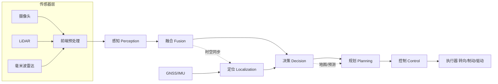

# 八、系统架构与中间件：让所有模块跑在车端

## 1. 引言

有一次我们做多传感器融合标定复测，发现一个离谱现象：同一时刻，摄像头说"前方五十米有车"，激光雷达（LiDAR）却说"前方五十二米有车"，毫米波雷达又说"四十九米"。三个传感器"看到的"竟然不在一条线上，融合模块只能取个折中，结果目标的纵向位置在不停地"0.5 米、1 米、0.3 米"地抖。排查了一整天才找到根因——**三个传感器的时间戳没有统一对齐**：摄像头是 30Hz 自由运行、LiDAR 是 10Hz 旋转、雷达又是另一套时钟，彼此之间有几十毫秒的偏差，而车在以 80km/h 前进，40ms 就意味着 0.9 米的位移差。融合时没做时间同步（time synchronization），直接拿"各自最近一帧"硬拼，自然错位。

这件事把我从"算法 correctness"拉到"系统 correctness"：再好的感知模型，如果数据在不同模块的时钟里各说各话，出来的就是垃圾。本章聊智能驾驶在车端的"地基"——E/E 架构、计算平台、中间件、时间同步、实时性与冗余安全。

## 2. 核心概念

智能驾驶系统架构回答：**这么多算法模块（感知、定位、预测、决策、规划、控制）和硬件（摄像头、LiDAR、雷达、域控、执行器），怎么有机地组织、通信、调度，还能在故障时保命**。

演进主线是车载 E/E（电气/电子）架构：

- **分布式 ECU**：早期每个功能一个单片机（ECU），一根 CAN 上挂几十个，算力碎片化、布线爆炸，已无法支撑智驾。
- **域控制器（Domain Controller）**：按功能域（智驾域、座舱域、底盘域…）集中，智驾域扛主要算力。
- **中央计算平台（Central Computing）**：进一步融合，一颗/一对大算力 SoC 统管感知-规划-控制，配区控制器（zonal）做 IO 收敛。

计算平台看三个指标：**算力（TOPS，每秒万亿次运算）、功耗（W）、成本**。NVIDIA Orin 约 254 TOPS、Thor 上千 TOPS；地平线征程（Journey）系列走高能效比；算力拉满必然功耗爆炸，要按"任务调度+功耗预算"权衡。

中间件（middleware）是模块间通信与调度的"神经系统"。主流：ROS2（机器人生态、DDS 底层）、百度 Cyber RT（面向车规的实时调度）、以及直接基于 **DDS（Data Distribution Service，数据分发服务）** 的发布-订阅（pub-sub）。QoS（服务质量）决定通信的可靠、实时、历史策略。

下面用一张拓扑图展示"感知→融合→定位→决策→规划→控制"在车端的部署关系：



关键参数：通信延迟（DDS 亚毫秒~毫秒级）、时间同步精度（PTP/gPTP 纳秒~微秒级）、调度周期（感知 30~100ms、控制 10ms）、ASIL 等级（D 最高）。

## 3. 机制深拆

### 3.1 发布-订阅与 QoS

DDS 用发布-订阅解耦生产消费：模块只声明"我发什么话题、我订阅什么话题"，由底层总线匹配。QoS 策略包括：

- **可靠性（Reliability）**：RELIABLE（丢包重传，保数据）vs BEST_EFFORT（尽最大努力，低延迟）。
- **历史（History）**：KEEP_LAST N（缓存最近 N 帧，防订阅者慢被冲掉）。
- **截止（Deadline）/ 存活（Liveliness）**：检测模块是否"假死"。

记发布者第 $k$ 帧消息 $m_k$ 带时间戳 $t_k$，订阅者在时刻 $t$ 收到，端到端延迟 $\Delta=t-t_k$ 须小于模块周期，否则触发"数据陈旧（stale）"丢弃。

### 3.2 时间同步 PTP/gPTP

要让"摄像头第 100 帧"和"LiDAR 第 33 圈"说的是同一瞬间，需统一时钟。PTP（Precision Time Protocol，IEEE 1588）通过主时钟（grandmaster）下发时间，从时钟测链路延时并校正；车载常用 **gPTP（广义 PTP，802.1AS）** 基于以太网，精度可达微秒乃至亚微秒。这样所有传感器帧都打上同一时间基准的硬件时间戳，融合时按时间戳插值对齐：

$$x_{\mathrm{align}} = x_A(t) + \frac{t - t_A}{t_B - t_A}\left(x_B(t)-x_A(t)\right)$$

### 3.3 确定性调度与实时性

车规要求**确定性（determinism）**：关键任务必须在截止期（deadline）前完成。RTOS（实时操作系统）或 Linux + PREEMPT_RT 提供优先级抢占调度，把控制环设为最高优先级，保证 10ms 周期内必然算完。调度模型可写成单调速率（RMS）：周期越短优先级越高。

### 3.4 冗余与功能安全

功能安全（ISO 26262）按 ASIL（A~D）分级，智驾核心常要求 **ASIL D**。常用 **ASIL D 分解**：把一项 D 级需求拆成两个互为冗余的较低等级（如 ASIL B + ASIL B），任一失效仍有备份。**双电源、双计算、双执行链路**是 L3+ 的硬门槛。

## 4. 工程实践

下面给出基于 DDS/ROS2 风格的发布-订阅与 QoS 伪代码（Python 思路，映射 C++ 同理）：

```python
import time

class SensorFuser:
    def __init__(self):
        self.qos = QoSProfile(
            reliability=RELIABLE,        # 数据不丢
            history=KEEP_LAST, depth=10, # 缓存最近10帧
            deadline=0.05                # 50ms 内必须到
        )
        self.subs = {
            'cam': subscribe('/camera/objects', self.qos),
            'lidar': subscribe('/lidar/objects', self.qos),
            'radar': subscribe('/radar/objects', self.qos),
        }
        self.pub = advertise('/fused/objects', self.qos)

    def fuse(self, t_now):
        # 按统一时间戳对齐再融合（时间同步前提）
        cam = self.subs['cam'].latest_at(t_now)
        lidar = self.subs['lidar'].latest_at(t_now)
        radar = self.subs['radar'].latest_at(t_now)
        fused = align_and_fuse(cam, lidar, radar, t_now)
        self.pub.publish(fused, stamp=t_now)

# 时间同步：所有节点以 gPTP 主时钟为基准打硬件时间戳
def on_sensor_frame(raw, hw_timestamp):
    publish(raw, stamp=hw_timestamp)   # 用硬件时间戳，而非接收时刻
```

车规落地坑：① 用接收时刻当时间戳是致命错误，必须硬件时间戳 + gPTP；② BEST_EFFORT 丢了关键帧会融合断裂，安全相关要 RELIABLE；③ 缓存 depth 太小订阅者慢被冲掉，太大占内存；④ 非实时 Linux 下控制线程被调度抢占会超周期，需 RT 内核或绑核；⑤ 冗余链路要物理独立（独立电源/总线），否则共因失效。

## 5. 常见坑

1. **用接收时刻当时间戳**：引入几十毫秒偏差，融合错位（本文开头的事故）。
2. **时间不同步**：摄像头/LiDAR/雷达时钟不一致，目标"抖动"误检。
3. **QoS 选错**：安全链路用 BEST_EFFORT 丢帧，融合断片。
4. **非实时调度**：控制线程被抢占超周期，车控抖动或失效。
5. **单点故障无冗余**：计算平台/电源坏一个就全瘫，不满足 ASIL D。
6. **缓存深度不合理**：太小丢历史、太大延迟高，需按周期调。
7. **跨域通信带宽爆**：原始点云全量广播，以太网拥塞丢包。
8. **坐标/时间双重不同步**：既没对齐空间又没对齐时间，双重错位。
9. **日志/调试拖慢实时**：线上开大量打印，抢占控制算力。
10. **忽略温度与功耗**：满算力跑高温降频，周期漂移。
11. **模块周期不匹配**：感知 100ms、控制 10ms，插值引入滞后。
12. **冗余链路共因**：双计算共用一个电源，电源挂双双挂。

## 6. 面试要点

1. **分布式 ECU 到中央计算演进动机？** 算力集中、降布线、便于 OTA 与统一调度。
2. **TOPS 与功耗怎么权衡？** 算力越高功耗越大，按任务调度+功耗预算取舍。
3. **ROS2 与 Cyber RT 区别？** ROS2 通用机器人、DDS 底层；Cyber RT 车规实时调度更强。
4. **DDS 发布-订阅优势？** 解耦、QoS 可控、实时可靠，适合多模块通信。
5. **为什么需要时间同步？** 多传感器帧须对齐同一时刻，否则融合错位。
6. **PTP/gPTP 作用与精度？** 统一时钟，车载 gPTP 可达微秒级。
7. **QoS 的 Reliability 怎么选？** 安全相关 RELIABLE，低延迟流可 BEST_EFFORT。
8. **ASIL D 分解是什么？** 把 D 级需求拆成两个冗余低等级，互为备份。
9. **为什么需要 RTOS？** 保证关键任务在截止期内确定性完成。
10. **冗余设计要点？** 双电源/双计算/双执行，且物理独立防共因失效。
11. **时间戳用硬件还是软件？** 必须硬件时间戳，软件接收时刻含抖动。
12. **SOTIF 与 ISO 26262 关系？** 26262 管随机硬件故障，SOTIF(21448) 管性能局限/场景。

## 7. 结语

一页纸回顾：智驾系统架构是算法的"地基"——E/E 从分布式 ECU 走向中央计算平台；算力（TOPS）与功耗（W）必须权衡；中间件（ROS2/Cyber RT/DDS）用发布-订阅 + QoS 把模块连起来；**时间同步（gPTP）是融合正确性的前提**，没有它多传感器就是各说各话；实时调度（RTOS/PREEMPT_RT）保证控制周期确定性；冗余与 ASIL D 分解是 L3+ 保命底线。那个"50/52/49 米"的融合抖动，本质上不是算法问题，是系统问题——这也是架构工程师存在的价值。

延伸阅读：AUTOSAR（CP/AP）标准、IEEE 1588 / 802.1AS（gPTP）规范、ROS2 与 DDS（RTI Connext）文档、百度 Apollo Cyber RT 源码、ISO 26262 / ISO 21448(SOTIF)、NVIDIA DRIVE 与地平线征程平台白皮书。

本章约 2150 字。
