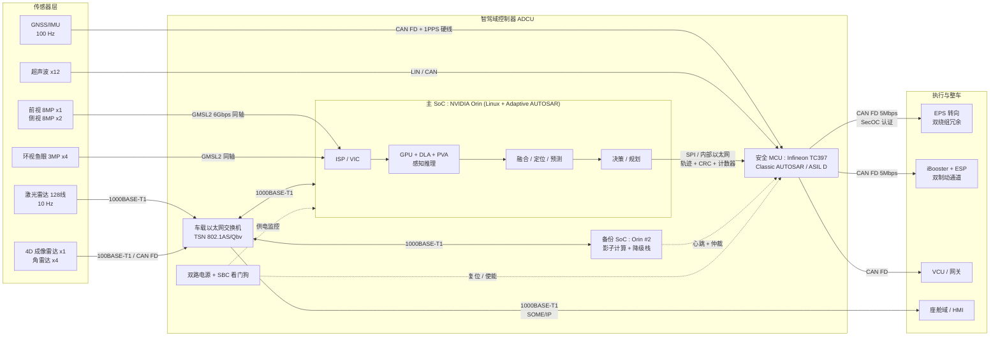
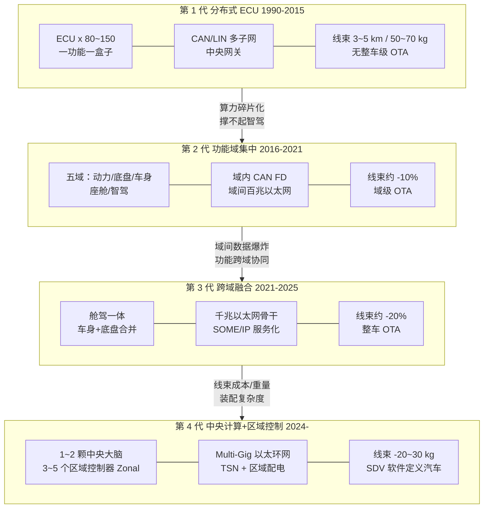
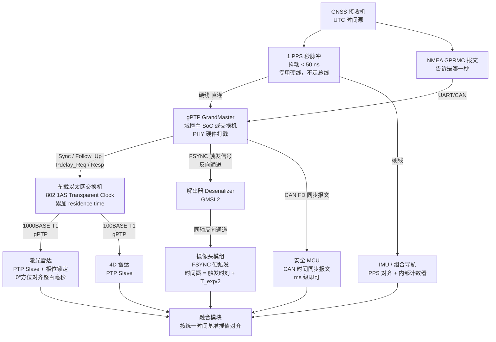

# 八、系统架构与中间件：让所有模块跑在车端

## 0. 引言：三个传感器，三个"现在"

那是十一月底的一个下午，风很硬，外场跑道边上的塑料锥桶被吹得东倒西歪。我们在做一轮多传感器融合的标定复测——本来是走流程的活儿，两个小时应该收工。

测试车上装的是一套很常规的配置：前视 8 MP 摄像头 30 fps、车顶一颗 128 线机械激光雷达 10 Hz、前保险杠里一颗 77 GHz 毫米波雷达 20 Hz，全都接进一台双 Orin 域控。前方一辆工程皮卡以 20 km/h 匀速行驶，我们跟在后面，速度拉到 80 km/h，做典型的接近工况。

副驾的笔记本上开着三个窗口，分别打印三路传感器对同一个目标的纵向距离。屏幕上滚出来的数字是这样的：

```
[cam  ] t=1543.221  obj#7  x = 50.4 m
[lidar] t=1543.221  obj#3  x = 52.1 m
[radar] t=1543.221  obj#2  x = 49.2 m
```

三个数，摊开来差了将近 3 米。而三行日志上写的时间戳，**是同一个数**。

第一反应当然是标定错了。于是重新贴反光标定板、重新跑外参、重新算旋转平移——外参 RMSE 0.03 m，干干净净，没问题。第二反应是激光雷达装歪了，我们把车停下来静态测，三路一致到厘米级，也没问题。整个下午就卡在这里：**静止时三路完全对齐，一动起来就散开，而且车速越高散得越厉害。**

真正的转折发生在傍晚，一个同事顺手在日志里加了一行——不打"发布时间"，改打"数据在传感器端真正产生的时间"。三行数字立刻露出了原形：摄像头那一帧的曝光中点在 1543.187，激光雷达那一圈的扫描起点在 1543.152，毫米波雷达那一帧的 chirp 序列结束于 1543.205。**三个"现在"，散布在 53 毫秒的窗口里。**

而融合模块拿到的时间戳，全部是同一个数字——因为它们都是应用层在 `recv()` 返回之后调 `clock_gettime()` 打上去的。那个数字诚实地记录了"这块数据什么时候被 CPU 收到"，却完全没有记录"这块数据描述的是哪一瞬间的世界"。

算一笔账就明白了：本车 80 km/h，前车 20 km/h，相对速度 60 km/h = 16.7 m/s。53 ms 的时间跨度，对应 **0.88 m** 的真实位移。再叠加上激光雷达一圈 100 ms 的扫描期内自车前进的 2.2 m（当时还没上运动畸变去除），3 米的分歧一点都不冤枉。融合模块每一帧都在给三个不同时刻的世界做加权平均，输出一个从来不曾存在过的"折中现实"，然后卡尔曼滤波器把这个抖动当成过程噪声，老老实实地放大了协方差，最后规划模块看到一个"位置不确定度 ±1.2 m 的前车"，只好保守减速。

后来我在白板上写了一句话，一直留到项目结束：

> **在多传感器系统里，"什么时候"和"是什么"同等重要。时间戳不是元数据，它是数据本身的一部分。**

如果你做过 BMS，这个坑其实你早就踩过一遍了，只是换了个马甲。菊花链上十几片 AFE 采样芯片，如果电压采样和电流采样不是同一瞬间完成的，在大电流阶跃的瞬间，你算出来的直流内阻 DCIR 就是错的，SOC 估算跟着漂。当年的解法是什么？给整链发一个同步采样命令，让所有片子在同一个时刻锁存。**智能驾驶这边的 gPTP、PPS 硬触发、曝光中点时间戳，本质上就是同一件事，只是从毫米级的 PCB 走线放大到了整车尺度、从 kHz 放大到了 GHz、从 ADC 采样时刻放大到了跨 SoC 的分布式时钟。**

这一章讲的就是这类"不出现在算法论文里、但决定项目能不能量产"的东西：E/E 架构怎么演进、数据走什么总线、算力芯片怎么选、AUTOSAR 双栈怎么共存、中间件怎么通信、时间怎么同步、任务怎么调度、失效了怎么保命、以及安全怎么防。

它是整本书里最"不性感"的一章，也是我个人认为**从嵌入式转智驾最容易建立差异化优势的一章**——因为纯算法出身的同学，往往在这里最薄。

---

## 1. 核心概念

### 1.1 系统架构要回答的五个问题

抛开所有名词，智驾系统架构其实就在回答五个非常朴素的问题：

| # | 问题 | 本章对应内容 | 决策错了的后果 |
|---|---|---|---|
| 1 | **算力放哪儿？** 谁来跑感知、谁来跑控制 | 第 2 章 E/E 架构、第 4 章计算平台 | 算力碎片化、无法 OTA、成本失控 |
| 2 | **数据怎么流？** 几十路传感器的数据怎么送到算力那儿 | 第 3 章车载网络 | 带宽打满、丢包、时延不可控 |
| 3 | **软件怎么组织？** 上百个模块怎么解耦、怎么通信 | 第 5 章 AUTOSAR 双栈与中间件 | 改一个模块牵动全车、集成地狱 |
| 4 | **怎么保证准时？** 关键任务的截止期怎么守住 | 第 6 章时间同步与实时调度 | 融合错位、控制抖动、幽灵刹车 |
| 5 | **坏了怎么办？** 单点失效之后车怎么停下来 | 第 6 章功能安全与冗余 | 达不到 ASIL D，L3 上不了路 |

有经验的架构师看一个方案，看的从来不是"用了什么 SOTA 模型"，而是这五个问题的答案能不能自洽。

### 1.2 从 BMS / Classic AUTOSAR 迁移过来：什么能直接用，什么必须重学

先做一张迁移地图。做过 BMS 或者动力域 ECU 的工程师，其实已经掌握了这一章里相当大一部分内容，只是名字变了、量级变了。

| 你已经熟悉的（BMS / 动力域） | 智驾域里的对应物 | 迁移难度 | 关键差异 |
|---|---|---|---|
| CAN 2.0B / CAN FD 通信矩阵 DBC | CAN FD + 车载以太网 + SOME/IP，接口用 ARXML / IDL 描述 | ★★ | 从"信号"转向"服务"，从静态矩阵转向运行时服务发现 |
| Classic AUTOSAR 的 RTE / SWC / BSW | 安全 MCU 上原封不动继续用 | ★ | 完全能复用，MCU 侧就是你的主场 |
| OSEK/VDX 静态任务表、固定优先级抢占 | SoC 上的 Linux SCHED_FIFO / PREEMPT_RT | ★★★ | 从"编译期确定"变成"运行期尽力保证"，需要一整套隔离手段 |
| 看门狗 + rolling counter + CRC（E2E Profile） | 完全一样，只是链路更长、跨 SoC | ★ | 直接复用，甚至连 Profile 编号都一样 |
| ISO 26262 ASIL / FMEA / FTA / 安全目标 | 完全一样 | ★ | 新增 SOTIF（ISO 21448）应对"没坏但表现不好" |
| ASPICE 的 SWE.1~SWE.6、双向可追溯 | 完全一样 | ★ | 新增数据驱动部分（DNN）不被传统 V 模型覆盖 |
| 电流/电压同步采样、采样时刻对齐 | gPTP 时间同步、硬触发、曝光中点时间戳 | ★★ | 从 PCB 尺度放大到整车分布式时钟 |
| 静态内存分配、禁止 malloc、栈深度分析 | SoC 上仍然要做，但工具链完全不同 | ★★ | Linux 上要用 mlockall + 内存池替代 |
| 单片机的 200 MHz / 512 KB RAM 资源意识 | Orin 的 204.8 GB/s 内存带宽同样是稀缺资源 | ★★★ | 瓶颈从"够不够放"变成"搬得动搬不动" |
| — | 深度学习模型部署、量化、算子映射 | ★★★★★ | 全新领域 |
| — | POSIX / Linux 用户态编程、多进程、共享内存 | ★★★★ | 全新领域，但可迁移嵌入式思维 |
| — | DDS 发布订阅、QoS 策略 | ★★★ | 概念上接近"带 QoS 的 CAN 广播" |

**一句话总结**：你的功能安全直觉、实时性直觉、资源意识、流程素养，在智驾域里价值不减反增——因为算法出身的同学普遍缺这些。你要补的主要是三块：Linux 用户态的确定性工程、面向服务的软件架构、以及深度学习的部署工程。

### 1.3 三条主线：算力、通信、时间

这一章后面所有内容，都可以挂在三条主线上：

- **算力（Compute）**：一颗 Orin 254 TOPS / 60 W。听起来很多，但一套城区 NOA 的感知栈能轻松吃掉它 70%。算力的真实约束不是 TOPS 数字，是**内存带宽**和**热预算**。
- **通信（Communication）**：一颗 8 MP 摄像头的原始 YUV422 流是 **3.98 Gbps**，一颗 128 线激光雷达是 **333 Mbps**。CAN FD 5 Mbps 在这个量级面前，相当于用吸管抽干游泳池。这就是车载以太网的存在理由。
- **时间（Time）**：本章开头那 53 ms 的故事。10 ms 的时间戳误差 × 30 m/s 相对速度 = **0.3 m 位置误差**，已经超过大多数融合算法的关联门限。

这三条线互相纠缠：算力不够就得压缩数据（影响通信），压缩要编解码（增加时延），时延增加就要更严格的时间管理。系统架构的本质，就是在这个三角里找一个能量产的点。

### 1.4 一张图看懂智驾域控内部拓扑

先给出全景，后面各节都是在给这张图的某个局部做特写。注意每条连线上标注的**总线类型**——这是架构图里信息密度最高的部分。



这张图里有五个值得停下来看的点：

1. **摄像头不走以太网**。原始视频流太大（单颗 8 MP 近 4 Gbps），走的是 GMSL2/FPD-Link 这类点对点串行链路，直接进 SoC 的 CSI-2 接口。以太网上跑的是激光雷达点云、雷达点云和压缩后的视频。
2. **安全 MCU 是执行器的唯一出口**。SoC 算出来的轨迹不直接下发，必须经过 MCU 的合理性校核。这是 E-Gas 三层监控的落地形态（6.13 节）。
3. **GNSS 的 1PPS 是一根独立硬线**。不走任何总线，因为总线本身就有不确定的传输时延（6.3 节）。
4. **交换机在域控内部**。以太网交换机是一颗独立芯片（如 Marvell 88Q5152、NXP SJA1110），支持 TSN，是整个时间同步链路的中继节点。
5. **备份 SoC 做影子计算**。它不是冷备，而是持续跑一套降级栈，随时能在 FTTI 内接管（6.14 节）。

### 1.5 关键量级速记

在展开之前，先把这一章要反复用到的数量级钉在墙上。**这些数字建议直接背下来**，面试和技术评审里都会用到。

| 类别 | 量 | 数值 | 备注 |
|---|---|---|---|
| 算力 | NVIDIA Orin | 254 TOPS INT8（稀疏）/ 60 W | 稠密约 127 TOPS |
| 算力 | Orin 内存带宽 | 204.8 GB/s（LPDDR5 256-bit） | 真正的瓶颈 |
| 算力 | 地平线征程 5 | 128 TOPS / 30 W | 4.3 TOPS/W |
| 带宽 | 8 MP@30fps YUV422 原始 | 3 981 Mbps ≈ 4 Gbps | 必须点对点串行 |
| 带宽 | 8 MP H.265 压缩 | 25 Mbps | 压缩比约 160:1 |
| 带宽 | 128 线激光雷达点云 | 333 Mbps | 16 B/点 × 2.6 M 点/s |
| 带宽 | 转镜激光雷达 AT128 | 98 Mbps | 8 B/点 × 1.53 M 点/s |
| 总线 | CAN FD 500k/5M 有效吞吐 | 1.28 Mbps @50% 负载 | 单帧 201 μs |
| 总线 | 100BASE-T1 有效吞吐 | 67 Mbps @70% 负载 | 链路效率 95.7% |
| 总线 | 1000BASE-T1 有效吞吐 | 670 Mbps @70% 负载 | 智驾主干 |
| 时间 | gPTP 硬件时间戳精度 | < 1 μs（7 跳内） | 802.1AS 指标 |
| 时间 | GNSS 1PPS 抖动 | < 50 ns | 对齐 UTC 整秒 |
| 时延 | 端到端（曝光→执行器） | P50 ≈ 126 ms，P99 ≈ 152 ms | 见 7.2 节实测仿真 |
| 时延 | 控制环周期 | 10 ms（100 Hz） | 硬实时 |
| 安全 | ASIL D 硬件指标 | SPFM ≥ 99%、LFM ≥ 90%、PMHF < 10 FIT | 10 FIT = 10⁻⁸/h |
| 安全 | 转向失效 FTTI | 100 ~ 300 ms | 决定冗余切换预算 |
| 安全 | MRM 减速度上限 | ≤ 4 m/s²（UN R157） | 最小风险机动 |
| 数据 | 单车原始数据落盘 | 3.3 GB/s ≈ 11.9 TB/小时 | 见 7.4 节 |

---

## 2. E/E 架构演进：从上百个 ECU 到中央计算

### 2.1 四代架构一张图

E/E（Electrical/Electronic，电气/电子）架构的演进，被博世在 2015 年前后画成了一张经典的六阶段图。工业界现在通常压缩成四代来讲：



推动每一次跃迁的，都不是"技术上更先进"这种虚的理由，而是**上一代架构撞到了一堵具体的墙**。下面逐代拆。

### 2.2 第一代：分布式 ECU——被自己的成功淹死

分布式架构的逻辑非常朴素：新增一个功能，就新增一个 ECU。这套逻辑在功能数量少的时候极其高效——供应商各自交付黑盒，主机厂只负责定义通信矩阵（DBC），集成成本低、责任边界清晰。

问题出在指数增长上。一辆 2015 年的豪华轿车：

| 指标 | 典型值 |
|---|---|
| ECU 数量 | 80 ~ 150 个 |
| 软件代码量 | 约 1 亿行 |
| 线束长度 | 3 ~ 5 km |
| 线束重量 | 50 ~ 70 kg（整车第三重零件，仅次于发动机和车身） |
| 线束成本 | 500 ~ 1 500 美元 |
| 连接器数量 | 300 ~ 500 个 |
| CAN 子网数 | 5 ~ 12 个，靠中央网关转发 |
| 单车 MCU 总算力 | 折合不到 1 TOPS |

**四堵墙：**

1. **算力墙**。感知需要的是 100 TOPS 量级的并行算力，而 150 个 MCU 加起来也凑不出 1 TOPS——而且算力是碎片化的，没法聚合。
2. **带宽墙**。CAN 的物理上限就摆在那里（后面 3.2 节会算），点云和视频根本进不去。
3. **线束墙**。每加一个功能就要加一束线，装配工时、故障率、重量、成本全线上升。线束是整车里唯一一个**几乎无法自动化生产**的大件（因为柔性），高度依赖人工。
4. **OTA 墙**。80 个供应商的 80 套软件，各自的 Bootloader、各自的诊断协议、各自的版本节奏。想给整车推一次统一升级，需要协调 80 家公司——这在工程上基本等于不可能。

这四堵墙里，**OTA 墙才是真正致命的**。因为它意味着车卖出去之后就是一块石头，而智能驾驶的商业模式恰恰建立在"车能持续变好"之上。

### 2.3 第二代：功能域集中——五个大盒子

解法是分而治之：按功能域把 ECU 归并成五个域控制器（Domain Controller）。

| 域 | 英文 | 典型职责 | 典型芯片 | 主要 ASIL |
|---|---|---|---|---|
| 动力域 | Powertrain | 发动机/电机/电池管理/变速箱 | Infineon TC3xx、NXP S32K | ASIL C/D |
| 底盘域 | Chassis | 制动 ESP/转向 EPS/悬架/驻车 | TC3xx、S32K3 | ASIL D |
| 车身域 | Body | 灯光/门锁/车窗/空调/座椅 | S32K1、Renesas RH850 | QM ~ ASIL B |
| 座舱域 | Cockpit / IVI | 仪表/中控/HUD/音响/DMS | 高通 8155/8295、SA8775P | QM ~ ASIL B |
| 智驾域 | ADAS / AD | 感知/融合/定位/规划/控制 | Orin、征程 5、TDA4、EyeQ | ASIL B(D) ~ D |

**收益**：域内高速通信（CAN FD 或域内以太网）、算力可聚合、软件可在域内统一升级、供应商从 80 家收敛到 5~10 家。

**新问题**：域与域之间的边界是按"功能"划的，但**线束是按"物理位置"走的**。一个车门里同时有车身域的车窗电机、座舱域的扬声器、智驾域的侧视摄像头——它们要分别拉三束线回到三个不同位置的域控。**域集中减少了 ECU 数量，但几乎没减少线束长度**，实测通常只降 5%~10%。

这是第二代架构最重要的一个教训，也是第四代 Zonal 架构的直接动机。

### 2.4 第三代：跨域融合——舱驾一体

当座舱芯片（高通 8295，30 TOPS AI 算力）和智驾芯片（Orin，254 TOPS）都变成大 SoC，一个自然的问题冒出来：**为什么不合并？**

合并的动机：

- **成本**：省掉一套壳体、一套电源、一套散热、一套高速连接器，BOM 能降 15%~25%。
- **数据共享**：DMS（驾驶员监控）摄像头的数据智驾要用（接管能力监测）、AR-HUD 要用智驾的感知结果、泊车要用环视摄像头而环视也给 360° 影像用。分开放就要跨域传大数据。
- **时延**：跨域走以太网 + 序列化反序列化，往返 5~15 ms；同芯片内共享内存，微秒级。

合并的障碍非常现实：

| 冲突点 | 座舱侧诉求 | 智驾侧诉求 | 解法 |
|---|---|---|---|
| 安全等级 | QM ~ ASIL B | ASIL B(D) ~ D | Hypervisor 隔离 + 独立安全岛 |
| 启动时间 | 冷启动 ≤ 2 s 出倒车影像 | 可以慢一点 | 分区异步启动 |
| OS | Android / QNX | Linux / QNX | 虚拟化多 OS 并存 |
| 更新节奏 | 月度迭代 | 季度 + 严格标定验证 | 独立分区独立 OTA |
| 失效影响 | 娱乐死机可接受 | 不可接受 | FFI（免于干涉）论证 |
| 热设计 | 中控台空间小、无风道 | 60 W+ 需要液冷 | 位置迁移到前舱 |

关键使能技术是 **Hypervisor（虚拟机监控器）**——QNX Hypervisor、COQOS、ACRN、Xen 等。它在硬件之上切出多个虚拟机（VM），把 CPU 核、内存区间、外设直通（pass-through）静态分配给不同 VM，并做**空间隔离与时间隔离**的论证。ISO 26262 里这套论证叫 **FFI（Freedom From Interference，免于干涉）**，必须证明低 ASIL 的 VM 不可能干扰高 ASIL 的 VM——包括内存越界、CPU 独占、外设争用、共享缓存污染（cache thrashing）这些路径。

**最后一条最难**：两个 VM 共享 L3 缓存和内存控制器，座舱 VM 疯狂解码视频会挤占带宽，让智驾 VM 的推理延迟变长。这属于**时间干涉**，很难完全消除，工程上靠缓存分区（Intel CAT / Arm MPAM）、内存带宽限流、以及最终的"给关键任务留足裕度"来缓解。

### 2.5 第四代：中央计算 + 区域控制器（Zonal）

第四代架构的核心洞见是把**两种"集中"分开**：

- **计算集中**到 1~2 颗中央计算单元（CCU, Central Computing Unit），按功能划分；
- **IO 集中**到 3~5 个区域控制器（Zonal Controller），**按物理位置划分**。

区域控制器不做复杂计算，它干三件事：

1. **IO 收敛**：把本区域内所有传感器、执行器、开关的线全部就近接进来。
2. **区域配电**：本区域的电源分配、智能保险丝（eFuse，用 MOSFET + 电流检测替代熔断丝，可远程复位、可诊断）。
3. **协议转换与网关**：把本地的 CAN/LIN/10BASE-T1S 转成千兆以太网，通过主干送给中央计算单元。

```
                    [中央计算单元 CCU]
                     /      |      \
        Multi-Gig 以太网环网（TSN + 冗余路径）
             /          |          \         \
        [左前 Zonal] [右前 Zonal] [左后 Zonal] [右后 Zonal]
          | | |         | | |        | | |       | | |
      本区域内的传感器 / 执行器 / 开关（就近接入，走线 < 1.5 m）
```

典型量产案例：特斯拉 Model 3/Y 是第一个大规模落地的（前车身控制器 + 左车身控制器 + 右车身控制器）；大众 E³ 1.2 架构用 ICAS1/2/3；小鹏 X-EEA 3.0、蔚来 NT3.0、Rivian R1 的 Zonal 方案都在 2023—2025 年陆续量产。

### 2.6 为什么 Zonal 能减重几十公斤：一次定量推导

这个"几十公斤"不是营销数字，可以算出来。

**假设**（取一辆 C 级车的典型值）：

- 整车电气回路数 $N = 1\,500$ 根导线
- 分布式架构下的平均单根线长 $L_1 = 2.5$ m（3.75 km / 1500）
- Zonal 架构下，绝大多数负载只需接到最近的区域控制器，平均单根线长 $L_2 = 1.2$ m
- 低压信号线（0.35~0.75 mm²）含绝缘和端子的线密度 $\rho_1 = 13$ g/m
- 新增区域间主干：8 根粗线（4 根 10 mm² 电源 + 4 根以太网），平均长 5 m，粗电源线密度 $\rho_2 \approx 100$ g/m，以太网单对双绞线约 8 g/m

**信号线减重**：

$$\Delta m_1 = N (L_1 - L_2)\rho_1 = 1500 \times (2.5 - 1.2) \times 13\ \text{g} = 25.4\ \text{kg}$$

**主干增重**：

$$\Delta m_2 = 4 \times 5 \times 100 + 4 \times 5 \times 8 = 2000 + 160 = 2.16\ \text{kg}$$

**净减重**：

$$\Delta m = 25.4 - 2.2 \approx 23\ \text{kg}$$

再加上连接器数量减少（从 400 个降到 250 个，每个平均 25 g，约 3.75 kg）、以及分线盒/保险丝盒被 eFuse 替代（约 2 kg），**总减重落在 25~30 kg 区间**——和公开报道的"20~30 kg"完全吻合。

**第二重减重来自 48 V 区域配电。** 这一步的杠杆更大：

同一个负载功率 $P$，电压从 12 V 提到 48 V，电流降到 $1/4$：

$$I' = \frac{P}{4U} = \frac{I}{4}$$

允许的压降按百分比算，也放大 4 倍（12 V 的 4% 是 0.48 V，48 V 的 4% 是 1.92 V），于是允许的线阻：

$$R' = \frac{\Delta U'}{I'} = \frac{4\Delta U}{I/4} = 16 R$$

而 $R = \rho L / A$，所以截面积理论上可以降到 $1/16$。实际受限于机械强度（导线太细一拧就断）、短路电流承受能力和最小规格（一般不低于 0.35 mm²），工程上通常能做到 $1/4 \sim 1/8$。对大电流负载（电动座椅、PTC 加热、电动尾门）来说，这一项能再省 5~10 kg。

**第三重收益是装配**。线束是整车里最难自动化的零件，Zonal 把"一整车一大束"拆成"几个短束 + 标准化主干"，装配工时能降 20%~40%，而且模块化之后不同配置车型的线束差异大幅缩小，物料 SKU 数量下降。

### 2.7 四代架构横向对比表

| 维度 | 一代 分布式 ECU | 二代 功能域集中 | 三代 跨域融合 | 四代 中央计算+Zonal |
|---|---|---|---|---|
| 典型年代 | 1990 – 2015 | 2016 – 2021 | 2021 – 2025 | 2024 – |
| ECU / 控制器数量 | 80 ~ 150 | 25 ~ 60（含 5 域控） | 15 ~ 35 | 5 ~ 15 |
| 计算单元 | 全 MCU | MCU + 少量 SoC | 大 SoC + MCU | 中央 SoC 集群 + Zonal MCU |
| 单车 AI 算力 | < 1 TOPS | 2 ~ 30 TOPS | 100 ~ 500 TOPS | 500 ~ 2 000 TOPS |
| 主干网络 | CAN 500 kbps + 网关 | CAN FD + 100BASE-T1 | 1000BASE-T1 | Multi-Gig 环网 + TSN |
| 通信范式 | 信号（Signal / DBC） | 信号 + 少量服务 | 服务（SOME/IP） | 服务 + 数据中心式（DDS/SOME/IP） |
| 线束长度 | 3 ~ 5 km | 2.8 ~ 4.5 km | 2.5 ~ 3.5 km | 1.5 ~ 2.5 km |
| 线束重量 | 50 ~ 70 kg | 45 ~ 62 kg | 40 ~ 55 kg | 25 ~ 40 kg |
| 线束成本 | $500 ~ 1 500 | $480 ~ 1 400 | $420 ~ 1 200 | $300 ~ 800 |
| 连接器数量 | 300 ~ 500 | 280 ~ 450 | 250 ~ 400 | 150 ~ 250 |
| 配电方式 | 熔断丝盒集中配电 | 熔断丝盒 + 部分智能 | 部分 eFuse | 区域 eFuse + 48 V 可选 |
| OTA 能力 | 基本不可行（需逐个 Flash） | 域级 OTA，需协调多供应商 | 整车 OTA，SoC 侧 A/B 分区 | 整车 OTA + 功能按需订阅 |
| 供应商模式 | 80+ 家黑盒交付 | 5 ~ 10 家域控供应商 | 主机厂自研 SoC 软件 | 主机厂全栈自研 + 芯片直采 |
| 主机厂软件掌控力 | 极低 | 低 | 中 | 高（SDV 软件定义汽车） |
| 单点失效影响面 | 小（隔离性好） | 中 | 大 | 大（必须靠冗余补偿） |
| 开发复杂度 | 低（接口简单） | 中 | 高 | 极高（需要平台化能力） |
| 典型车型 | 传统燃油豪华车 | 2019 – 2022 主流新能源 | 小鹏 G9、理想 L 系 | 特斯拉、大众 E³ 1.2、小鹏 X-EEA 3.0 |

### 2.8 OTA 能力为什么是架构问题而不是软件问题

很多人以为 OTA 就是"写个升级程序"，其实 OTA 能力是被架构**硬性约束**的。约束链条如下：

1. **需要冗余存储空间做 A/B 分区**。MCU 只有 4 MB Flash，装不下两份镜像，只能用"Bootloader + 单分区"，升级失败就变砖。SoC 有 64~256 GB eMMC/UFS，A/B 双分区轻松。
2. **需要断电保护**。升级过程中熄火/断电，必须能回滚。这要求 Bootloader 有独立的版本管理和回滚逻辑，且 Bootloader 自身不可被升级失败破坏（通常放在一次性可编程区域或双备份）。
3. **需要带宽**。一个 Orin 的完整系统镜像 8~20 GB，全量下载在 4G 下要几小时。所以必须做**差分升级**（bsdiff / HDiffPatch / Courgette），典型能压到全量的 2%~10%。
4. **需要统一的诊断与升级协议**。分布式架构下 80 家供应商用 80 套 UDS 实现和 80 种 Flash Driver，OTA Manager 要为每一个写适配。域集中之后收敛到 5~10 套。
5. **需要安全**。签名验证（防篡改）+ 防回滚计数器（anti-rollback，防止刷回有已知漏洞的旧版本）+ 安全启动信任链（15.5 节）。UNECE R156 SUMS 把这些变成了法规强制。
6. **需要功能安全论证**。升级后车辆行为改变，必须重新论证安全目标仍然满足。这就是为什么整车 OTA 通常要求**车辆静止 + P 档 + 电量 > 30% + 用户确认**。

一句话：**OTA 是架构给的能力，不是软件写出来的能力。**

### 2.9 演进不是线性替换：现实中的混合态

最后要泼一盆冷水。上面四代讲得很清爽，但真实项目里**从来不存在纯粹的某一代**。一辆 2026 年上市的车，很可能同时有：

- 一颗按第四代思路做的中央计算单元；
- 三个区域控制器（第四代）；
- 一个仍然独立的座舱域控（第二代遗产，因为供应商合同没到期）；
- 十几个直接从上一代平台沿用的独立 ECU（TPMS、雨量传感器、电动尾门——改动不划算）；
- 整套底盘域仍然跑 Classic AUTOSAR + CAN FD（第一/二代，因为 ASIL D 认证成本太高不愿重做）。

架构师的真实工作，**80% 是在处理这种混合态的兼容与迁移路径**，而不是在白板上画理想架构。这一点在面试里如果能讲出来，会比背诵四代演进有说服力得多。

---

## 3. 车载网络：带宽、时延与确定性

### 3.1 CAN 与 CAN FD：你已经很熟，但有几个数要重新算

CAN（Controller Area Network）对做过 BMS 的人来说是母语，这里只补三个在智驾场景下会被重新审视的点。

**第一点：仲裁机制决定了速率上限。**

CAN 用**非破坏性逐位仲裁（non-destructive bitwise arbitration）**：所有节点同时发送 ID，显性位（0）覆盖隐性位（1，线与 wired-AND），谁的 ID 小谁赢，输的节点自动退回接收状态且不丢帧。

这个机制有一个残酷的物理前提：**在一个位时间内，信号必须传遍全网并返回，让每个节点都能在采样点看到"仲裁后的总线电平"**。于是：

$$T_{bit} \geq 2 \times \frac{L_{bus}}{v_{prop}} + t_{tx} + t_{rx}$$

双绞线传播速度约 $v_{prop} = 2\times10^8$ m/s（5 ns/m），收发器往返延迟约 250 ns。代入：

| 位速率 | 位时间 | 理论最大总线长度 | 实际推荐 |
|---|---|---|---|
| 1 Mbps | 1 μs | ~45 m | 40 m |
| 500 kbps | 2 μs | ~130 m | 100 m |
| 250 kbps | 4 μs | ~270 m | 250 m |
| 125 kbps | 8 μs | ~550 m | 500 m |

**这就是经典 CAN 卡在 1 Mbps 的物理原因**——不是电路做不快，是仲裁的分布式共识需要时间。

**第二点：CAN FD 提速的原理是"数据段不需要仲裁"。**

CAN FD（Flexible Data-rate）的洞见很漂亮：仲裁只发生在帧头的 ID 字段，一旦仲裁结束、赢家确定，**总线上就只剩一个发送者了**。这时候不再需要"全网共识"，可以把位速率切换到高得多的值。所以 CAN FD 有两个速率：

- **仲裁段（Arbitration Phase）**：500 kbps（受总线长度约束，不能提）
- **数据段（Data Phase）**：2 Mbps / 5 Mbps / 8 Mbps（只受收发器和信号完整性约束）

外加载荷从 8 B 提到 64 B，帧头开销被摊薄。

**第三点：位填充（bit stuffing）会让帧长变成一个区间。**

CAN 用 NRZ 编码，为了保证接收方能持续恢复时钟，每连续 5 个相同电平就要插入 1 个反相位。所以一个 8 字节标准帧的实际长度不是固定的 111 位，而是 **111 ~ 130 位**，取决于数据内容。**最坏情况分析必须按 130 位算**——这是很多人做总线负载估算时漏掉的 17%。

$$L_{worst} = 47 + 8n + \left\lfloor \frac{34 + 8n - 1}{4} \right\rfloor \quad \text{(标准帧, } n \text{ 字节数据)}$$

$n=8$ 时 $L_{worst} = 47 + 64 + 19 = 130$ 位。

### 3.2 CAN 有效吞吐与"负载率 40~60%"的来历

**吞吐计算**（7.4 节脚本里的实现）：

经典 CAN 500 kbps，8 B 载荷，最坏 130 位/帧：

$$f_{max} = \frac{500\,000}{130} = 3\,846\ \text{帧/s}, \qquad
\text{Payload} = 8 \times 8 \times 3846 = 246\ \text{kbps}$$

**有效载荷只有线速率的 49%**——一半的比特都花在了 ID、CRC、ACK、EOF、填充位上。

CAN FD 500k/5M，64 B 载荷：

| 段 | 位数 | 速率 | 耗时 |
|---|---|---|---|
| 仲裁段（SOF + ID + 控制头） | ~30 bit | 500 kbps | 60.0 μs |
| 数据段（512 bit 数据 + CRC21 + 填充余量） | ~553 bit | 5 Mbps | 110.6 μs |
| 帧尾（CRC 界定符 + ACK + EOF + IFS） | ~15 bit | 500 kbps | 30.0 μs |
| **合计** | | | **200.6 μs** |

$$f_{max} = \frac{1}{200.6\ \mu s} = 4\,985\ \text{帧/s}, \qquad \text{Payload} = 64\times8\times4985 = 2.55\ \text{Mbps}$$

注意这个反直觉的结果：**标称 5 Mbps 的 CAN FD，最大有效载荷只有 2.55 Mbps**，因为仲裁段和帧尾仍然跑在 500 kbps 上，占了 90 μs（45% 的帧时间）。**这就是为什么很多项目发现"升级到 CAN FD 之后带宽没有想象中翻倍"。**

**为什么负载率要压在 40%~60%？**

因为 CAN 是**固定优先级非抢占调度（fixed-priority non-preemptive）**，这和你在 OSEK 里熟悉的任务调度模型是同构的。最坏响应时间（WCRT）用 Tindell 的迭代公式：

$$R_i = J_i + w_i + C_i, \qquad
w_i^{(n+1)} = B_i + \sum_{j \in hp(i)} \left\lceil \frac{w_i^{(n)} + J_j + \tau_{bit}}{T_j} \right\rceil C_j$$

其中 $B_i$ 是阻塞时间（低优先级帧已经开始发送就不能被打断，$B_i = \max_{k \in lp(i)} C_k$），$hp(i)$ 是高优先级帧集合，$C_j$ 是帧传输时间，$T_j$ 是周期。

这个式子的关键性质是：**当总线利用率 $U$ 趋近某个阈值时，$w_i$ 的迭代不收敛，低优先级报文的 WCRT 发散。** 工程实践里的经验值：

| 总线负载率 | 最高优先级报文抖动 | 最低优先级报文 WCRT | 工程评价 |
|---|---|---|---|
| < 30% | < 0.3 ms | 1 ~ 3 ms | 舒适区，随便加信号 |
| 30% ~ 50% | 0.3 ~ 0.8 ms | 3 ~ 10 ms | 正常量产区间 |
| 50% ~ 60% | 0.8 ~ 2 ms | 10 ~ 30 ms | 需做 WCRT 分析后放行 |
| 60% ~ 70% | 2 ~ 5 ms | 30 ~ 100 ms | 危险，低优先级可能超时 |
| > 70% | 发散 | 不可调度 | 禁止 |

再加上三个现实因素——**错误帧重传**（一次错误帧 + 重传要多占 ~2 倍帧时）、**突发（burst）而非严格周期**、**后续项目还要加信号留余量**——所以行业惯例把设计目标定在 **40%~50%**，验收上限 60%。

这条经验，做 BMS 时你大概率已经在评审会上听过无数遍。它在智驾域里一模一样，只是被应用到 CAN FD 上。

### 3.3 LIN 与 FlexRay：一个还活着，一个在退场

| 维度 | LIN | FlexRay |
|---|---|---|
| 全称 | Local Interconnect Network | — |
| 速率 | 19.2 / 20 kbps | 2 × 10 Mbps（双通道） |
| 物理层 | **单线** + 12 V 电平，无需专用收发器变压器 | 双绞线，双通道可冗余或倍带宽 |
| 介质访问 | 主从轮询（Master polling），无仲裁 | **TDMA 时分**：静态段固定时隙 + 动态段 minislotting |
| 确定性 | 中（主机控制，但从机响应有抖动） | **极强**（时隙精确到 μs） |
| 节点数 | ≤ 16 | ≤ 64 |
| 成本 | 极低（比 CAN 便宜 60%+） | 高（收发器 + 复杂配置） |
| 时间同步 | 无 | 有（宏时钟 macrotick 全局同步） |
| 典型用途 | 车窗、座椅、后视镜、雨量传感器、氛围灯 | 宝马 / 奥迪底盘：主动悬架、线控转向 |
| 现状 | **仍在大量使用**，且被 10BASE-T1S 部分蚕食 | **在退场**，被 TSN 以太网替代 |

FlexRay 的命运值得说一句：它在 2006—2015 年是"确定性通信"的唯一答案，宝马 7 系、奥迪 A8 的底盘域大量使用。但它有三个致命伤——带宽只有 10 Mbps（对智驾完全不够）、配置极其复杂（全局调度表要在设计期算死，改一个报文全网重配）、生态封闭成本高。**当 TSN 以太网既提供了确定性、又提供了千兆带宽、还复用了 IT 生态之后，FlexRay 就没有存在理由了。** 新平台基本不再选用。

### 3.4 车载以太网：单对双绞线的物理革命

普通办公室以太网（100BASE-TX）用 **4 对（8 芯）**双绞线，屏蔽层 + RJ45 连接器，线密度 40~50 g/m，连接器又大又贵，而且 EMC 性能达不到车规（CISPR 25 Class 5）。

车载以太网的核心创新是**单对（2 芯）非屏蔽双绞线上跑全双工**：

| 标准 | 速率 | 编码 | 波特率 | 线缆 | 最大长度 | 拓扑 | 主要用途 |
|---|---|---|---|---|---|---|---|
| 10BASE-T1S (802.3cg) | 10 Mbps | 4B5B / DME | 12.5 MBd | UTP | 25 m | **多点共享总线** | 替代 CAN，Zonal 边缘 |
| 100BASE-T1 (802.3bw) | 100 Mbps | PAM3（3B2T） | 66.67 MBd | UTP | 15 m | 点对点 | 雷达、摄像头压缩流、诊断 |
| 1000BASE-T1 (802.3bp) | 1 Gbps | PAM3（80B81B） | 750 MBd | UTP(A)/STP(B) | 15 m / 40 m | 点对点 | **智驾主干、激光雷达** |
| MultiGBASE-T1 (802.3ch) | 2.5 / 5 / 10 Gbps | PAM4 + RS-FEC | 1.4 / 2.8 / 5.6 GBd | STP | 15 m | 点对点 | 中央计算互联 |
| 802.3cy | 25 / 50 / 100 Gbps | PAM4 | — | STP | 11 m | 点对点 | 下一代主干（2023 标准） |

**关键技术点：**

1. **回声抵消（echo cancellation）**。单对线上同时收发，本地发射信号会耦合进接收端且强度比远端信号高 20~40 dB。PHY 里有一个自适应滤波器实时估计并减掉自己的发射回波。这是 100BASE-T1 最难的模拟设计。
2. **PAM3 而不是 NRZ**。三电平编码（−1/0/+1）用 2 个符号携带 3 比特（3B2T），在同样比特率下把波特率降到 2/3，从而把频谱峰值往低频压，满足 EMC 要求。1000BASE-T1 用 80B81B + PAM3，750 MBd 承载 1 Gbps。
3. **主从时钟（Master/Slave）**。链路两端一端做 MASTER 提供时钟，一端做 SLAVE 恢复时钟。**这个配置必须在两端匹配，配错了链路起不来**——这是调试车载以太网时最常见的低级错误。
4. **重量与成本**。单对 UTP 约 8 g/m，比 4 对 STP 轻 80%；连接器从 RJ45 变成 H-MTD/MATEnet 这类小型化车规连接器。整车换算下来能省几公斤。

**以太网的有效吞吐**（7.4 节脚本计算）：

一个 1500 B MTU 的以太网帧，实际占用：

$$\underbrace{7}_{\text{前导}} + \underbrace{1}_{\text{SFD}} + \underbrace{14}_{\text{MAC头}} + \underbrace{1500}_{\text{载荷含IP/UDP头}} + \underbrace{4}_{\text{FCS}} + \underbrace{12}_{\text{IFG}} = 1538\ \text{B}$$

去掉 IP 头 20 B + UDP 头 8 B，实际应用数据 1472 B：

$$\eta = \frac{1472}{1538} = 95.7\%$$

再乘设计负载率 70%（车载以太网通常留 30% 余量给突发和未来扩展）：

- 100BASE-T1 → **67 Mbps** 可用
- 1000BASE-T1 → **670 Mbps** 可用
- 2.5G-T1 → **1 675 Mbps** 可用

### 3.5 SOME/IP：以太网上的"服务"

从 CAN 转到以太网，最大的思维转变不是速率，而是**从"信号"到"服务"**。

- **信号范式（Signal-oriented）**：DBC 文件在设计期定死"0x123 报文的第 8~23 位是车速，缩放因子 0.01"。发送方周期性广播，不管有没有人听；接收方按矩阵解析。**耦合在设计期建立，运行期不可变。**
- **服务范式（Service-oriented）**：提供方"我提供一个 SpeedService，Service ID = 0x1234"，消费方运行时**发现**这个服务并订阅。**耦合在运行期建立，可动态增删。**

**SOME/IP**（Scalable service-Oriented MiddlewarE over IP）是 AUTOSAR 定义的车载 SOA 标准，包含三种交互类型：

| 类型 | 英文 | 语义 | 传输 | 典型例子 |
|---|---|---|---|---|
| 方法 | Method | 请求-响应（RPC），也支持 fire-and-forget | TCP 或 UDP | `CalibrateCamera()` |
| 事件 | Event | 发布-订阅，单向推送 | UDP 多播为主 | 目标列表 20 Hz 推送 |
| 字段 | Field | Getter + Setter + Notifier 三合一 | 混合 | 巡航设定车速 |

**SOME/IP-SD（Service Discovery）** 的状态机是必须理解的部分：

```
服务提供方（Server）:
  Initial Wait Phase   随机等待 0~3 s（避免上电风暴同时发包）
  Repetition Phase     指数退避发 OfferService：0.1s, 0.2s, 0.4s, 0.8s ...（共 N 次）
  Main Phase           周期性发 OfferService（典型 1~3 s 一次）
  StopOffer            下线时主动通告

服务消费方（Client）:
  发 FindService（多播）  →  收到 OfferService  →  发 SubscribeEventgroup
                                              ←  SubscribeEventgroupAck
  之后开始收 Event（多播或单播）
```

**工程上的三个坑**：

1. **上电风暴**。整车 30 个 ECU 同时上电，如果都在 t=0 发 OfferService，交换机瞬时被打满，多播风暴导致部分节点收不到。Initial Wait Phase 的随机延迟就是为这个设计的，**但很多项目把随机范围配成 0，等于没配**。
2. **多播组管理**。Event 用 IP 多播分发，交换机需要 IGMP Snooping 才能只把多播帧转发给订阅者；不支持或没开启的话，多播会退化成广播，全网每个端口都收到激光雷达点云——直接打满。
3. **序列化开销**。SOME/IP 用定长大端序列化，看起来简单，但一个包含 128 个目标的目标列表消息，序列化 + 反序列化在 Cortex-A78 上要 0.3~1.5 ms。高频大消息建议改走共享内存或 zero-copy。

### 3.6 TSN：让以太网变得"准时"

标准以太网是**尽力而为（best-effort）**的：交换机按优先级队列转发，但一个正在发送的长帧不能被打断。在 100 Mbps 上，一个 1522 B 的帧要发 **121.8 μs**——这意味着一个紧急的控制帧最坏要等 121.8 μs 才能开始发送，多跳还要累加。对 10 ms 周期的控制环来说，这个抖动不可接受。

TSN（Time-Sensitive Networking）是 IEEE 802.1 工作组的一组标准，用来给以太网加上确定性：

| 标准 | 名称 | 作用 | 在车上解决什么 |
|---|---|---|---|
| **802.1AS(-2020)** | gPTP 广义精确时间协议 | 全网时钟同步，7 跳内 < 1 μs | 时间同步的基石（6.3 节） |
| **802.1Qav** | CBS 基于信用的整形 | 限制流的突发，平滑带宽 | 音视频流（AVB 时代遗产） |
| **802.1Qbv** | TAS 时间感知整形 | 门控列表 GCL，周期性开关队列门 | **给控制流预留专属时间窗** |
| **802.1Qbu + 802.3br** | 帧抢占 | express 帧可打断 preemptable 帧 | 把阻塞从 121.8 μs 降到 ~12 μs |
| **802.1Qci** | 每流过滤与监管 | 限制单流速率，隔离故障节点 | 防止一个疯掉的传感器洪泛全网 |
| **802.1CB** | FRER 帧复制与消除 | 同一帧走两条不相交路径 | 无缝冗余，链路断了不丢包 |
| **802.1Qcc** | 集中式配置 CNC/CUC | 全网调度表统一下发 | 工程配置管理 |

**802.1Qbv 时间感知整形的原理**：

每个出端口有 8 个优先级队列，每个队列前面有一个"门"（gate）。一张**门控列表（GCL, Gate Control List）**按全局同步的时间循环开关这些门：

```
周期 T = 1 ms，划分为 4 个窗口：
  [0    ~ 200 μs]  只开队列 7（控制流）      GateState = 10000000
  [200  ~ 400 μs]  只开队列 6（传感器同步流） GateState = 01000000
  [400  ~ 950 μs]  开队列 0~5（尽力而为流）   GateState = 00111111
  [950  ~ 1000 μs] 全关（保护带 guard band）  GateState = 00000000
```

**保护带（guard band）是这套机制的隐性成本**。因为一个帧一旦开始发送就不能中途停下，所以在关键窗口开始之前，必须留出"最长帧发送时间"的空档，否则一个刚开始发的 1522 B 长帧会侵占关键窗口。

| 链路速率 | 最长帧发送时间 | 无帧抢占时的保护带 | 有帧抢占时的保护带 |
|---|---|---|---|
| 100 Mbps | 121.8 μs | 121.8 μs | ~12 μs |
| 1 Gbps | 12.2 μs | 12.2 μs | ~1.2 μs |
| 2.5 Gbps | 4.9 μs | 4.9 μs | ~0.5 μs |

在 100 Mbps、1 ms 周期上，121.8 μs 的保护带等于**白白浪费 12% 的带宽**。这就是 802.1Qbu 帧抢占的价值：允许 express 帧打断 preemptable 帧，被打断的帧碎片最小 64 B，恢复后继续拼接。保护带只需覆盖最小碎片，降一个数量级。

**注意**：Qbv 要求全网时钟同步（依赖 802.1AS），而且 GCL 必须离线算好——这本质上是把 FlexRay 的 TDMA 思想搬到了以太网上。**如果你做过 FlexRay 的时隙配置，Qbv 的 GCL 配置对你几乎没有学习成本。**

### 3.7 总线全维度对比表

| 维度 | LIN | CAN 2.0B | CAN FD | FlexRay | 10BASE-T1S | 100BASE-T1 | 1000BASE-T1 | 2.5G/10G-T1 |
|---|---|---|---|---|---|---|---|---|
| 线速率 | 20 kbps | 500 kbps | 500k/5M | 2×10 Mbps | 10 Mbps | 100 Mbps | 1 Gbps | 2.5/10 Gbps |
| **有效吞吐@设计负载** | 5 kbps | 0.12 Mbps | 1.28 Mbps | 6 Mbps | 6 Mbps | 67 Mbps | 670 Mbps | 1.7/6.7 Gbps |
| 单帧载荷 | 8 B | 8 B | 64 B | 254 B | 1500 B | 1500 B | 1500 B | 1500 B |
| 典型时延 | 10 ~ 50 ms | 0.3 ~ 10 ms | 0.2 ~ 5 ms | **< 1 ms（时隙确定）** | 0.1 ~ 2 ms | 50 ~ 500 μs | 12 ~ 200 μs | 5 ~ 100 μs |
| **确定性** | 中 | 中（优先级） | 中 | **极高** | 中（PLCA） | 低（除非 TSN） | 低（除非 TSN） | 低（除非 TSN） |
| 拓扑 | 总线 | 总线 | 总线 | 总线/星型 | **多点总线** | 点对点 | 点对点 | 点对点 |
| 节点数 | ≤16 | ≤ 30 实际 | ≤ 30 实际 | ≤ 64 | ≤ 8 | 2 | 2 | 2 |
| 最大长度 | 40 m | 100 m@500k | 40 m（数据段5M） | 24 m/段 | 25 m | 15 m | 15/40 m | 15 m |
| 线缆 | 单线 | 双绞 | 双绞 | 双绞×2 | 单对 UTP | 单对 UTP | 单对 UTP/STP | 单对 STP |
| 线缆重量 | 5 g/m | 12 g/m | 12 g/m | 24 g/m | 8 g/m | 8 g/m | 8 ~ 15 g/m | 15 ~ 25 g/m |
| 节点成本（收发器+PHY） | $0.2 | $0.6 | $1.0 | $8 | $1.5 | $2.5 | $6 | $15 ~ 40 |
| 需要交换机 | 否 | 否 | 否 | 否 | 否 | 是 | 是 | 是 |
| 时间同步能力 | 无 | 无（需应用层） | 无 | **有（macrotick）** | 有（802.1AS） | 有（802.1AS） | 有（802.1AS） | 有（802.1AS） |
| 功能安全惯用等级 | QM | ASIL D（配 E2E） | ASIL D（配 E2E） | ASIL D | ASIL B | ASIL D（配 E2E） | ASIL D（配 E2E） | ASIL D |
| 智驾里的角色 | 超声波、氛围灯 | 遗留整车信号 | **执行器指令主力** | 退场中 | Zonal 边缘 IO | 雷达、压缩视频 | **点云、域间主干** | 中央计算互联 |

### 3.8 传感器原始数据带宽估算：为什么必须上千兆

这是这一节最重要的定量部分。所有数字都由 7.4 节的脚本算出，这里给推导。

**摄像头**。一颗 8 MP（3840×2160）传感器，YUV422 格式（每像素 16 bit），30 fps：

$$B_{cam} = 3840 \times 2160 \times 16\ \text{bit} \times 30\ \text{fps} = 3.981\times10^9\ \text{bps} = \boxed{3\,981\ \text{Mbps}}$$

换成 RAW12（每像素 12 bit）是 2 986 Mbps。**单颗摄像头就把千兆以太网干爆了 4 倍。** 这就是为什么摄像头到 SoC 用的是 **GMSL2（6 Gbps）/ FPD-Link III / ASA Motion Link** 这类点对点非对称串行链路，或者板内直接走 MIPI CSI-2，而不是以太网。

如果要走以太网，必须先编码：H.265 把 8 MP 30 fps 压到 25 Mbps，压缩比约 **160:1**。代价是编码延迟（硬件编码器 5~15 ms）和有损压缩带来的细节丢失——**这就是为什么感知推理必须在压缩之前做，编码后的流只用于录制和显示。**

**激光雷达**。128 线机械式，2.6 M 点/秒，每点在 UDP 包里占 16 B（x/y/z 各 2 B + 强度 1 B + 通道号 1 B + 时间戳偏移 2 B + 对齐填充）：

$$B_{lidar} = 2.6\times10^6 \times 16 \times 8 = 332.8\ \text{Mbps}$$

转镜式 AT128（1.53 M 点/秒，紧凑封包 8 B/点）：

$$B_{AT128} = 1.53\times10^6 \times 8 \times 8 = 97.9\ \text{Mbps} \approx \boxed{100\ \text{Mbps}}$$

这就是行业里常说的"激光雷达 100 Mbps"的来历。注意：**98 Mbps 已经超过 100BASE-T1 的可用吞吐（67 Mbps @70% 负载）**，即使不考虑负载率也只剩 2% 余量。所以激光雷达一律接 1000BASE-T1。

**4D 成像雷达**。5 000 点/帧、20 Hz、16 B/点：

$$B_{4D} = 5000 \times 20 \times 16 \times 8 = 12.8\ \text{Mbps}$$

**传统角雷达目标列表**。64 目标 × 32 B × 20 Hz = **0.33 Mbps**——这个量级 CAN FD 完全够用，所以角雷达至今仍大量走 CAN FD。

**整车汇总**（11 摄像头 + 2 激光雷达 + 5 雷达 + 组合导航 + 12 超声波）：

| 项 | 数值 |
|---|---|
| 原始（未压缩）总带宽 | **26.43 Gbps** |
| 压缩/结构化后总带宽 | **610.9 Mbps** |
| 压缩比 | 43.3 : 1 |
| 原始数据落盘速率 | 3.30 GB/s |
| 一小时原始数据量 | **11.9 TB** |

**三条硬结论**：

1. **原始视频流永远不上以太网**，只走点对点串行链路直连 SoC。以太网上跑的是点云 + 压缩视频 + 结构化结果。
2. **压缩后 611 Mbps 的汇聚流，正好卡在 1000BASE-T1 的 670 Mbps 可用吞吐上**——余量只有 9%。这就是为什么新平台开始上 2.5G/10G 主干。
3. **数据记录是被严重低估的带宽消耗者**。11.9 TB/小时的原始数据没有任何量产车能全量落盘（车载 SSD 通常 2~8 TB，写入 1~2 GB/s）。实际做法是**触发式录制**：平时只存结构化结果和低码率视频（约 50 GB/天/车），只有在接管、急刹、误检等触发事件前后 30 s 才落原始数据。即便如此，一支 100 辆车的路测队伍一天也能产出 5~20 TB。

### 3.9 拓扑与线束：星型、树型、环网

| 拓扑 | 结构 | 优点 | 缺点 | 车上用法 |
|---|---|---|---|---|
| **星型 Star** | 所有节点连到中央交换机 | 简单、隔离好、故障定位快 | 中央交换机单点失效；线束长 | 域控内部 |
| **树型 Tree** | 多级交换机级联 | 线束短、扩展性好 | 多跳累积时延；上级交换机是瓶颈 | 二/三代主流 |
| **环网 Ring** | 节点串成环，双向可达 | **单点断链自愈**；线束最短 | 需要 RSTP/MRP 或 802.1CB；转发时延 | 四代 Zonal 主干 |
| **菊花链 Daisy-chain** | 串行级联 | 线束极短 | 中间节点掉电全链断 | 摄像头 GMSL 级联 |

**多跳时延累积**是树型拓扑的隐性代价。以太网交换机有两种转发模式：

- **存储转发（store-and-forward）**：收完整帧、校验 FCS 再转发。时延 = 帧传输时间 + 处理时间。1 Gbps 上 1522 B 帧 = 12.2 μs + ~2 μs = **14.2 μs/跳**。
- **直通（cut-through）**：收到目的 MAC（前 14 B）就开始转发。时延 ≈ **0.5~2 μs/跳**，但会转发坏帧。

车载交换机为了 EMC 环境下的可靠性，**通常用存储转发**。3 跳就是 42 μs，加上排队时延（队列里有其他帧在等）可以到几百 μs。这在做时延预算时不能忽略。

### 3.10 网关与协议转换：CAN ↔ 以太网

Zonal 架构里，区域控制器的核心职责之一就是网关。这里有几个工程要点：

1. **信号到服务的映射（Signal-to-Service Mapping）**。CAN 侧是 DBC 定义的信号，以太网侧是 SOME/IP 服务。网关要做双向翻译，映射关系通常在 ARXML 里配置。工具链（Vector DaVinci、ETAS ISOLAR）能生成大部分代码。
2. **速率适配与聚合**。CAN 侧 10 ms 周期的报文，聚合成 SOME/IP 事件时不必 10 ms 推一次，可以按变化推送（on-change）或降频，减少以太网负载。反过来以太网侧的高频数据下到 CAN 必须降频，否则打爆总线。
3. **时延预算**。一个 CAN 报文经网关转到以太网：CAN 接收 0.2 ms + 网关处理 0.1~0.5 ms + 以太网发送 0.05 ms ≈ **0.35~0.75 ms**。双向往返就是 1.5 ms 左右。跨两个网关会翻倍。
4. **安全隔离**。网关是攻击面收敛点，必须做防火墙（只放行白名单报文 ID）、入侵检测（IDS，检测异常报文频率/ID）、以及 SecOC 边界（6.15 节）。**车联网攻击的经典路径就是从娱乐系统打进 CAN 网关再到底盘**，2015 年 Jeep Cherokee 远程控制事件走的就是这条路。

---

## 4. 计算平台：TOPS 之外的真相

### 4.1 主流智驾芯片对比

| 芯片 | 厂商 | 量产年 | AI 算力（官方口径） | 稠密等效 | CPU | 典型功耗 | 制程 | 内存带宽 | 安全等级 | 代表车型/方案 |
|---|---|---|---|---|---|---|---|---|---|---|
| **DRIVE Orin** | NVIDIA | 2022 | **254 TOPS INT8（稀疏）** | ~127 TOPS | 12×Cortex-A78AE | **60 W**（15~60 可配） | 三星 8 nm | **204.8 GB/s** LPDDR5 | SoC ASIL B(D)，内置 ASIL D 安全岛 | 蔚来 ET7、理想 L9、小鹏 G9 |
| **DRIVE Thor** | NVIDIA | 2025 | 1 000 TFLOPS FP4（早期宣传 2 000 TOPS） | — | 14×Neoverse V3AE | ~130 W 级 | 台积电 4 nm | ~500 GB/s 级 | ASIL D 安全岛 | 极氪、比亚迪高阶 |
| **征程 5 (J5)** | 地平线 | 2023 | 128 TOPS INT8 | 128 TOPS | 8×Cortex-A55 | **30 W** | 台积电 16 nm | ~120 GB/s LPDDR4x | ASIL B(D)，安全岛 ASIL D | 理想 L8 Pro、比亚迪 |
| **征程 6P (J6P)** | 地平线 | 2025 | 560 TOPS | — | 18×Cortex-A78AE | ~100 W 级 | — | — | ASIL B(D) | 2025 起量产 |
| **华山二号 A1000 Pro** | 黑芝麻 | 2023 | 106 TOPS INT8 / 196 TOPS INT4 | 106 TOPS | 8×Cortex-A55 | 25 W | 台积电 16 nm | ~100 GB/s | ASIL B，安全岛 ASIL D | 领克、合创 |
| **TDA4VM** | TI | 2020 | 8 TOPS | 8 TOPS | 2×Cortex-A72 + 6×R5F | 5 ~ 20 W | 16 nm | ~30 GB/s | **ASIL D 全芯片** | 大量 L2/APA 方案 |
| **TDA4VH** | TI | 2023 | 32 TOPS | 32 TOPS | 8×A72 + 4×R5F | ~30 W | 16 nm | ~60 GB/s | ASIL D | 行泊一体 |
| **EyeQ5** | Mobileye | 2021 | 24 TOPS | 24 TOPS | 8×MIPS I-Class | **10 W（2.4 TOPS/W）** | 台积电 7 nm | ~50 GB/s | ASIL B(D) | 宝马、蔚来 ES8 早期 |
| **EyeQ6H** | Mobileye | 2024 | 34 TOPS | 34 TOPS | — | ~33 W | 7 nm | — | ASIL B(D) | 2024 起量产 |
| **FSD HW3** | 特斯拉 | 2019 | 2×36.86 = 73.7 TOPS | 73.7 TOPS | 12×Cortex-A72 | 板级 72 W | 三星 14 nm | 68 GB/s LPDDR4 | 双 NPU 互校验 | Model 3/Y/S/X |
| **Ride Flex SA8775P** | 高通 | 2024 | ~30 TOPS（舱驾一体） | — | 8×Kryo | ~40 W | 台积电 4 nm | — | ASIL B/D 混合 | 舱驾一体方案 |

**看这张表要抓四个数**，而不是只看第一列：

- **能效比（TOPS/W）**：EyeQ5 是 2.4，征程 5 是 4.3，Orin 是 4.2（按 254 算）或 2.1（按稠密 127 算）。**能效比直接决定散热方案和整车电耗。**
- **内存带宽**：见 4.4 节，这才是真瓶颈。
- **CPU 算力**：容易被忽略。感知之外的融合、跟踪、预测、规划、后处理大量跑在 CPU 上，12 核 A78AE 和 8 核 A55 差了 3 倍以上。**很多项目最后卡的是 CPU 不是 NPU。**
- **工具链成熟度**：Orin 有 CUDA/TensorRT 全家桶，任何算子都能跑；地平线要用天工开物工具链，某些算子不支持要改网络；TI 要用 TIDL，限制更多。**工具链的隐性成本经常超过芯片本身的价差。**

### 4.2 SoC 内的异构单元分工

一颗智驾 SoC 不是一块大 GPU，而是一堆专用引擎的集合。以 Orin 为例：

| 单元 | 全称 | Orin 中的规格 | 擅长 | 不擅长 | 典型分配的任务 |
|---|---|---|---|---|---|
| **CPU** | Arm Cortex-A78AE | 12 核 @2.2 GHz，支持 lockstep 配对 | 控制流、分支、串行逻辑 | 大规模并行 | 融合、跟踪、预测、规划、状态机、中间件 |
| **GPU** | Ampere | 2048 CUDA 核 + 64 Tensor Core | 通用并行、灵活算子 | 能效比低于专用单元 | 主感知网络、BEV 变换、点云体素化 |
| **DLA** | Deep Learning Accelerator | 2× NVDLA v2 | **固定 CNN 算子，能效比高 3~5×** | 不支持自定义算子、动态 shape | 次要检测网络、可确定性调度的推理 |
| **PVA** | Programmable Vision Accelerator | 2× VLIW 向量处理器 | 传统 CV：光流、立体匹配、特征点、滤波 | 深度学习 | 特征提取、图像预处理、点云滤波 |
| **ISP** | Image Signal Processor | 2× ISP，1.85 Gpix/s | RAW→YUV 全流程 | 只能做固定流水线 | 摄像头前处理（第 1 章 2.4 节） |
| **VIC** | Video Image Compositor | 硬件缩放/格式转换/合成 | resize、色彩空间转换、旋转 | 复杂逻辑 | 推理前的 resize/normalize，**卸载 CPU** |
| **NVENC/NVDEC** | 视频编解码器 | H.264/H.265/AV1 | 编解码 | 其他 | 录制、显示、云端回传 |
| **安全岛** | Safety Island | Arm Cortex-R52 lockstep | 确定性、ASIL D 监控 | 算力小 | 生命信号、健康监控、故障响应 |
| **SPE** | Sensor Processing Engine | Cortex-R5 | 低功耗常开传感器采集 | — | IMU/CAN 采集、时间戳打点 |

**这张表的工程价值在于任务分配。** 一个常见的性能事故是：所有推理都往 GPU 上堆，GPU 排队排到 80 ms，而两颗 DLA 完全空转。正确做法是把**结构规整、算子标准、需要确定性延迟**的网络放 DLA（比如交通灯检测、车道线），把**需要自定义算子、动态 shape**的放 GPU（比如 BEV Transformer）。

另一个高价值优化：**用 VIC 做 resize 而不是 CPU 或 GPU**。一路 8 MP 图像 resize 到 960×540，CPU 上要 8~15 ms，GPU 上 1~2 ms（但占用 GPU 时间片），VIC 上 0.3 ms 且完全并行。11 路摄像头就是省下 100 ms+ 的 CPU 时间。

### 4.3 TOPS 的三重水分

**水分一：稀疏算力 vs 稠密算力。**

NVIDIA 的 254 TOPS 是 **INT8 + 2:4 结构化稀疏**下的数字。2:4 稀疏要求每 4 个权重里至少 2 个是 0，Tensor Core 可以跳过零值使吞吐翻倍。但要用上它，模型必须经过**稀疏化训练/微调**，而且：

- 不是所有算子都支持（depthwise conv、某些 attention 变体不支持）；
- 稀疏化通常带来 0.5%~2% 的精度损失，安全相关任务不一定接受；
- 量产项目里真正跑稀疏的比例很低。

**所以实际可用的稠密算力是 127 TOPS，一开始就要打对折。**

**水分二：精度口径。**

同一块硅，报不同精度的 TOPS 差好几倍：

| 精度 | 相对 INT8 的 TOPS | 说明 |
|---|---|---|
| INT4 | 2× | 精度损失大，仅部分层可用 |
| INT8 | 1× | **行业标准口径** |
| FP16 / BF16 | 0.5× | 训练和精度敏感层 |
| FP32 | 0.125× ~ 0.25× | 推理基本不用 |

看到"XXX TOPS"第一件事是问**什么精度、稀疏还是稠密**。有厂商用 INT4 稀疏报数，等于在 INT8 稠密基础上乘了 4。

**水分三：有效利用率（MAC Utilization）。**

峰值 TOPS 假设 MAC 阵列 100% 忙碌。实际取决于算子形状能否填满阵列、数据能否及时供给、以及调度空隙：

| 算子/网络类型 | 典型 MAC 利用率 | 原因 |
|---|---|---|
| 大 channel 的 3×3 卷积 | **60% ~ 85%** | 算术强度高，能填满阵列 |
| 1×1 pointwise 卷积 | 30% ~ 50% | 权重复用少，访存受限 |
| Depthwise 卷积 | **5% ~ 15%** | 每个通道独立，阵列几乎空转 |
| Transformer 自注意力（batch=1） | 20% ~ 40% | 矩阵瘦长，访存密集 |
| 逐元素算子（add/mul/激活） | < 5% | 纯访存 |
| BEV voxel pooling / scatter | 10% ~ 25% | 随机访存，无法向量化 |
| **端到端整网平均** | **30% ~ 60%** | 上述混合 |

**综合三重水分的经验公式**：

$$\text{TOPS}_{\text{有效}} \approx \text{TOPS}_{\text{标称}} \times \underbrace{0.5}_{\text{稀疏折算}} \times \underbrace{0.45}_{\text{平均利用率}} \approx 0.22 \times \text{TOPS}_{\text{标称}}$$

Orin 的 254 TOPS，实际能榨出来的大约是 **55~60 TOPS 等效稠密算力**。做算力预算时按标称值的 **20%~25%** 估，才不会在项目后期发现跑不动。

### 4.4 内存带宽才是真瓶颈：Roofline 分析

Roofline 模型用两个数刻画一个计算平台：**峰值算力** $P$（ops/s）和**峰值内存带宽** $B$（bytes/s）。二者之比叫**脊点（ridge point）**：

$$I_{ridge} = \frac{P}{B}\quad [\text{ops/byte}]$$

一个算子的**算术强度（Arithmetic Intensity）** $I = \dfrac{\text{运算次数}}{\text{访存字节数}}$。若 $I < I_{ridge}$，这个算子是**访存受限（memory-bound）**的，再多算力也没用；若 $I > I_{ridge}$，才是**算力受限（compute-bound）**。

**Orin 的脊点**：

$$I_{ridge} = \frac{127\times10^{12}\ \text{ops/s}}{204.8\times10^{9}\ \text{B/s}} = \boxed{620\ \text{ops/byte}}$$

**620 是一个非常高的门槛。** 我们算几个典型算子（INT8，权重和激活都按 1 B/元素）：

| 算子 | 配置 | 运算次数 | 访存字节 | 算术强度 $I$ | vs 脊点 620 | 判定 |
|---|---|---|---|---|---|---|
| 3×3 Conv | Cin=Cout=256, 64×64 | 4.83 G | 2.69 MB | **1 795** | 2.9× | 算力受限 ✔ |
| 3×3 Conv | Cin=Cout=64, 128×128 | 1.21 G | 2.13 MB | **568** | 0.92× | 临界 |
| 1×1 Conv | Cin=Cout=256, 64×64 | 0.54 G | 2.17 MB | **247** | 0.40× | **访存受限** |
| Depthwise 3×3 | C=256, 64×64 | 0.019 G | 2.10 MB | **9** | 0.015× | **严重访存受限** |
| 全连接层 | 2048→1024, batch=1 | 4.2 M | 2.1 MB | **2** | 0.003× | **极端访存受限** |
| Self-Attention QKᵀ | seq=900, d=256, batch=1 | 0.41 G | 1.4 MB | **295** | 0.48× | **访存受限** |
| 逐元素 Add | 256×64×64 | 1 M | 3.1 MB | **0.3** | 0.0005× | **纯访存** |

**这张表解释了当代智驾算力工程里最反直觉的现象：**

1. **越"高效"的网络越吃带宽。** MobileNet/EfficientNet 系用大量 depthwise + pointwise 来降 FLOPs，但算术强度掉到个位数，在高算力芯片上反而跑不满——**FLOPs 降了 8 倍，实际延迟只降 2 倍。**
2. **BEV + Transformer 范式对带宽极度饥渴。** BEVFormer 的 spatial cross-attention 有大量 gather/scatter 随机访存，实测有效带宽只有峰值的 20%~40%。
3. **多个 IP 争抢同一个内存控制器。** Orin 上 GPU、DLA、ISP、VIC、编解码器、CPU 全都挂在同一套 LPDDR5 上。11 路摄像头的 ISP 处理本身就要吃掉 30~50 GB/s，留给推理的可能只剩 100~130 GB/s。
4. **实际可达带宽低于理论值。** LPDDR5 的 204.8 GB/s 是理论峰值；连续大块访问能到 75%~85%，随机小块访问只有 40%~60%。

**优化方向（按性价比排序）**：

| 手段 | 原理 | 典型收益 |
|---|---|---|
| 算子融合（Conv+BN+ReLU） | 中间结果不落 DRAM，留在片上 | 减少 30%~50% 访存 |
| INT8 量化 | 激活和权重从 FP16 减半 | 访存直接减半 |
| 提高 batch / 多路合批 | 权重复用，摊薄权重读取 | 提升 $I$ 数倍 |
| 调整 tiling 与数据布局（NHWC） | 提高 cache 命中和突发长度 | 有效带宽 +20%~40% |
| 用 DLA 分担 | DLA 有独立的内部 SRAM 缓冲 | 缓解 GPU 带宽争用 |
| 降低输入分辨率 | 激活量二次方下降 | 最有效但损精度 |

**一句话记住**：**买芯片看 TOPS，做工程看 GB/s。**

### 4.5 功耗与散热预算

**散热的定量约束。** 稳态下芯片结温：

$$T_j = T_a + P \cdot R_{th,ja}$$

其中 $R_{th,ja}$ 是结到环境的总热阻。反过来，给定 $T_j$ 上限和环境温度，能耗散的功率上限是：

$$P_{max} = \frac{T_{j,max} - T_a}{R_{th,ja}}$$

**代入车规条件**：智驾 SoC 的 $T_{j,max}$ 通常限在 105 °C（超过就降频），域控安装位置（后备箱侧壁或前舱）的环境温度 $T_a$ 夏季实测可达 **85 °C**：

$$R_{th,ja} \leq \frac{105 - 85}{60} = 0.33\ \text{°C/W}$$

再看各种散热方案能达到的热阻：

| 散热方案 | 典型 $R_{th,ja}$ | @ΔT=20 °C 可耗散功率 | 车载适用性 |
|---|---|---|---|
| 裸芯片自然对流 | 20 ~ 40 °C/W | 0.5 ~ 1 W | 不可用 |
| 铝挤散热器 + 自然对流 | 2 ~ 5 °C/W | 4 ~ 10 W | 小 MCU |
| 大散热器 + 强制风冷 | 0.5 ~ 1.5 °C/W | 13 ~ 40 W | 单 TDA4/征程 5 勉强 |
| 均热板 + 强制风冷 | 0.3 ~ 0.6 °C/W | 33 ~ 67 W | **单 Orin 极限** |
| 液冷冷板（接整车低温回路） | **0.05 ~ 0.2 °C/W** | **100 ~ 400 W** | **双 Orin 必须** |

**结论**：单 Orin 60 W 在 85 °C 环境下已经处于风冷的极限（需要大均热板 + 高转速风扇，而风扇是可动部件，可靠性和噪声都是问题）；双 Orin 域控整机功耗 150~200 W（含 SerDes、DDR、电源转换损耗），**只能液冷**。这也是为什么高阶智驾域控普遍接入整车的电池低温冷却回路。

**整车电耗代价。** 180 W 持续功耗听起来不多，算一下：

年行驶 10 000 km，平均车速 30 km/h（含城市拥堵）→ 333 小时 → $180\ \text{W} \times 333\ \text{h} = 60\ \text{kWh}$。按 15 kWh/100 km 的整车电耗算，相当于**多跑 400 km 的电量，即约 4% 的续航损失**。所以域控的功耗不是纯粹的工程指标，它直接进整车能耗公告。

**热降频（thermal throttling）的隐蔽危害。** 芯片过热会自动降频，这在消费电子里只是"卡一下"，在车上是**周期漂移**：推理时间从 28 ms 变成 45 ms，控制环从 10 ms 变成 14 ms，整条时延链路的分布右移。更糟的是它**只在夏天/长时间高负载/堵车时发生**，测试阶段极难复现。工程对策：把最坏热环境（60 °C 环境舱 + 满算力 + 4 小时）作为强制验证项，并在软件里监控 SoC 温度和实际频率，一旦降频就主动降级功能（比如从 8 MP 降到 4 MP 输入）而不是被动超时。

### 4.6 车规等级与安全岛

| 概念 | 含义 | 智驾 SoC 的典型取值 |
|---|---|---|
| **AEC-Q100 Grade** | 芯片工作温度等级 | Grade 2（−40 ~ +105 °C）为主，部分 Grade 1（−40 ~ +125 °C） |
| **ASIL 能力** | 芯片本体能支撑的最高安全等级 | 大 SoC 多为 **ASIL B(D)**；TI TDA4 可做 ASIL D |
| **Safety Island** | SoC 内独立的高安全子系统 | Orin 内 Cortex-R52 lockstep；征程 5 内独立安全岛 |
| **Lockstep** | 两个核跑同样指令，比较器逐周期比对 | 用于安全岛和 MCU；发现不一致立即报故障 |
| **ECC** | 内存/缓存纠错码 | SEC-DED，单比特纠错双比特检错 |
| **BIST** | 内建自测试 LBIST（逻辑）/ MBIST（存储） | 上电时跑一遍，运行时周期性跑（在线 BIST） |
| **FIT** | 每 10⁹ 小时的失效次数 | ASIL D 要求整系统 PMHF < 10 FIT |

**为什么大 SoC 只能做到 ASIL B(D)？** 因为先进制程 + 数十亿晶体管 + 复杂的乱序执行流水线，**随机硬件故障的诊断覆盖率做不到 ASIL D 要求的 SPFM ≥ 99%**。做法是：SoC 本体按 ASIL B 设计，**通过 ASIL 分解**（6.12 节）配一个独立的 ASIL D 安全 MCU 做监控与兜底，两者组合达到系统级 ASIL D。这就是"SoC + 安全 MCU"这个经典组合的安全论证依据，也是 1.4 节拓扑图里安全 MCU 存在的理由。

### 4.7 芯片选型清单

真实项目里做芯片选型，打分表大概长这样（权重是我个人经验值，不同项目差异很大）：

| 维度 | 权重 | 关键问题 |
|---|---|---|
| 有效算力（不是标称） | 15% | 跑我们自己的模型能到多少 FPS？要实测不看 PPT |
| 内存带宽 | 12% | GB/s 是多少？多 IP 争用后还剩多少？ |
| CPU 算力 | 10% | 融合/预测/规划够不够？别只盯 NPU |
| 工具链成熟度 | 15% | 我的算子支持吗？量化精度损失多少？调试工具好用吗？ |
| 功耗与散热 | 10% | 风冷还是液冷？整车能给多少 W？ |
| 功能安全 | 12% | 安全岛能力？有无安全手册和 FMEDA 报告？ |
| 供货与生命周期 | 10% | 承诺供货几年？产能有保障吗？有无二供？ |
| 成本 | 10% | 芯片 + 配套 DDR/PMIC/SerDes 的总 BOM |
| 本地技术支持 | 6% | 出问题几天能有 FAE 到现场？ |

**最容易被低估的是"工具链成熟度"这一项。** 我见过一个项目为了省 40% 的芯片成本换了平台，结果因为某个自定义算子不被支持、量化后精度掉 4 个点，前后折腾了七个月重新设计网络，人力成本远超省下来的钱。

---

## 5. 软件栈：AUTOSAR 双栈、中间件与工程方法

这一节是给你量身定做的。Classic AUTOSAR 是你的主场，我们从这里出发，看看智驾域里发生了什么变化。

### 5.1 Classic AUTOSAR 复习：为什么它这么"死板"

先把 CP（Classic Platform）的关键设计取向摆出来——**它的每一个"死板"之处，都是为了换取确定性和可认证性**：

| 设计选择 | 换来了什么 |
|---|---|
| 所有 SWC、端口、连接在 ARXML 里静态定义，编译期生成 RTE | 通信路径完全可静态分析，无运行时不确定性 |
| OSEK/VDX OS：任务表编译期固定，不可动态创建 | 调度可用 RMS/DM 做形式化可调度性分析 |
| 静态内存分配，禁止 `malloc` | 无内存碎片、无 OOM、栈深度可分析 |
| 单地址空间（配 MPU 做粗粒度保护） | 无 MMU 开销，中断延迟稳定在 μs 级 |
| 信号导向通信（Signal / PDU） | 通信矩阵可离线做 WCRT 分析 |
| 分层架构：SWC / RTE / BSW / MCAL | 应用与硬件解耦，供应商可替换 |

结果是：**μs 级的确定性、可达 ASIL D、WCET 可分析、通过认证的成熟工具链**。这在动力域和底盘域是完美的。

### 5.2 为什么 CP 撑不起智驾：五个硬伤

| # | 硬伤 | 具体表现 |
|---|---|---|
| 1 | **无动态部署** | 改一个感知模型要重编译整个 ECU 镜像并全量刷写。而模型迭代是周级的 |
| 2 | **无 POSIX 生态** | TensorRT、OpenCV、PCL、Eigen、protobuf 全部依赖动态内存、文件系统、线程池、异常——CP 上一个都跑不了 |
| 3 | **无进程隔离** | 单地址空间，感知模块一个野指针写坏规划模块的内存，整个 ECU 崩 |
| 4 | **信号导向通信装不下大数据** | PDU 最大几十字节，一帧点云是几 MB。用 PDU 传点云等于用信封寄冰箱 |
| 5 | **无异构计算抽象** | AUTOSAR 的世界里只有 CPU，没有 GPU/NPU/DLA 的概念，也没有显存管理 |

**所以 CP 不是"不好"，是"不适用"**——就像你不会用 OSEK 去跑一个数据库。

### 5.3 Adaptive AUTOSAR：把服务化和 POSIX 引进车里

AP（Adaptive Platform，2017 年 R17-03 首发，当前 R24-11）的定位是：**在保留 AUTOSAR 方法论、工具链、安全流程的前提下，支持高性能计算和动态部署**。

技术底座是 **POSIX PSE51**——POSIX 的最小实时子集（单进程多线程、无文件系统的完整语义、无 fork）。这是一个精心的折中：既让 C++ 生态能跑，又不引入完整 Linux 的全部不确定性。实际部署时，AP 通常跑在 QNX Neutrino 或 Linux（PREEMPT_RT）上。

**AP 的功能簇（Functional Cluster）**，都在 `ara::` 命名空间下：

| 功能簇 | 作用 | CP 里的对应物 |
|---|---|---|
| `ara::com` | 面向服务通信（底层可选 SOME/IP 或 DDS） | RTE + COM |
| `ara::exec` | 执行管理：按 Manifest 启动/停止进程、状态机 | ECU State Manager |
| `ara::per` | 持久化存储（键值 + 文件） | NvM |
| `ara::diag` | 诊断（UDS over IP，DoIP） | Dcm / Dem |
| `ara::log` | 日志与追踪（DLT） | Det |
| `ara::crypto` | 加解密、密钥管理 | Csm |
| `ara::phm` | 平台健康管理（监督、看门狗） | WdgM |
| `ara::sm` | 状态管理 | BswM |
| `ara::tsync` | 时间同步（对接 gPTP） | StbM |
| `ara::core` | 基础类型：`Result`、`ErrorCode`、`Optional` | — |

**关键差异：`ara::com` 的服务发现是运行时的。** 一个 SWC 不再是"连到端口 X"，而是"我需要 RadarObjectService 这个服务的某个实例"，运行时由 SOME/IP-SD 或 DDS 的发现机制匹配上。这带来了**动态部署**能力：新增一个服务提供者不需要重编译消费者。

### 5.4 Classic AUTOSAR vs Adaptive AUTOSAR 对比表

| 维度 | Classic AUTOSAR (CP) | Adaptive AUTOSAR (AP) |
|---|---|---|
| 首发 / 当前版本 | 2003 / R23-11 | 2017 (R17-03) / R24-11 |
| 目标硬件 | MCU（TC3xx、S32K、RH850） | SoC（Orin、征程、TDA4） |
| 目标算力 | 数百 MHz、MB 级 RAM | GHz 多核、GB 级 RAM |
| 操作系统 | OSEK/VDX 兼容 RTOS | **POSIX PSE51**（QNX / Linux+RT） |
| 编程语言 | C（MISRA C:2012） | **C++14/17**（AUTOSAR C++14 Guidelines） |
| 内存管理 | **全静态分配** | 动态分配（受限使用，RT 路径仍要预分配） |
| 地址空间 | 单地址空间 + MPU | **多进程 + MMU 隔离** |
| 调度 | 静态任务表，固定优先级抢占 | POSIX 线程 + SCHED_FIFO/RR |
| 时间确定性 | **μs 级，WCET 可分析** | 十 μs ~ ms 级，统计意义上的实时 |
| 通信范式 | **信号（Signal / PDU）** | **服务（Service / ara::com）** |
| 通信绑定 | 编译期静态绑定 | **运行时服务发现** |
| 底层协议 | CAN / LIN / FlexRay / ETH | SOME/IP、DDS（以太网为主） |
| 配置产物 | ARXML → 生成 RTE 与 BSW 配置 | ARXML → Manifest（Machine / Execution / Service Instance） |
| 软件更新 | 整镜像刷写（UDS Flash） | **进程级更新、A/B 分区、动态加载** |
| 功能安全 | **ASIL D 成熟**，大量认证案例 | 多为 ASIL B，少数平台声称 ASIL D |
| 启动时间 | 数十 ms | 数百 ms ~ 数秒 |
| 典型内存占用 | 数百 KB | 数百 MB |
| 生态成熟度 | 极成熟（Vector、ETAS、EB 全套） | 成长中（Vector Adaptive MICROSAR、EB corbos、开源 Apex.AI） |
| 智驾里的位置 | **安全 MCU：兜底、仲裁、执行器控制** | **SoC：感知/规划的中间件层** |

### 5.5 域控里两栈如何共存：一张任务分配表

这是智驾域控最经典的架构模式，也是你的背景最容易切入的地方：

```
┌─────────────────────── 智驾域控 ADCU ───────────────────────┐
│                                                              │
│  ┌── 主 SoC (Orin) ──────────┐   ┌── 安全 MCU (TC397) ───┐  │
│  │  Linux PREEMPT_RT / QNX   │   │  Classic AUTOSAR      │  │
│  │  + Adaptive AUTOSAR       │   │  OSEK/VDX + MPU       │  │
│  │  或 ROS2 / CyberRT        │   │  ASIL D               │  │
│  │  ASIL B(D)                │   │                       │  │
│  │                            │   │                       │  │
│  │  · 摄像头 ISP / 推理       │──▶│ · 轨迹合理性校核 (L2) │  │
│  │  · 点云处理 / 检测         │SPI│ · 加速度/横摆限值     │  │
│  │  · 多传感器融合            │或 │ · 独立雷达通道校验    │  │
│  │  · 定位 / 建图             │ETH│ · 生命信号与超时监控  │  │
│  │  · 预测 / 决策 / 规划      │   │ · 驾驶员接管仲裁      │  │
│  │  · 控制指令生成            │   │ · 执行器指令发出      │  │
│  │  · 数据记录 / OTA          │   │ · MRM 触发与降级      │  │
│  └────────────────────────────┘   │ · 与看门狗 SBC 交互   │  │
│              ▲                     └───────────┬───────────┘  │
│              │ 双向 E2E 保护                   │ CAN FD+SecOC │
└──────────────┼──────────────────────────────────┼─────────────┘
               │                                  ▼
        备份 SoC 影子计算                  EPS / iBooster / ESP
```

**MCU 侧到底校核什么？** 这是设计的精髓——它不能重算一遍规划（算力不够），只能做"廉价但独立"的合理性检查：

| 校核项 | 判据 | 触发后的动作 |
|---|---|---|
| 轨迹平滑性 | 曲率 $\kappa$ 与曲率变化率超限（如 $\kappa > 0.2$ m⁻¹） | 拒绝该帧，沿用上一帧 |
| 纵向加速度 | $\|a_x\| > 4$ m/s²（非紧急场景） | 限幅 |
| 横摆角速度 | $\|\omega\| > v \cdot \kappa_{max}$ 或超过侧翻限值 | 限幅 + 报警 |
| 横向加加速度 | jerk 超限（乘坐舒适 + 防止误动作） | 平滑 |
| 独立感知通道 | MCU 直连的一路雷达报了近距障碍，但 SoC 轨迹继续加速 | 触发 AEB |
| 生命信号 | rolling counter 连续 3 帧不变 | 判定 SoC 失效 |
| 数据完整性 | CRC 校验失败 | 丢弃 + 计数，超阈值判失效 |
| 数据新鲜度 | 时间戳 age > 100 ms | 判定超时 |
| 驾驶员意图 | 方向盘扭矩/制动踏板与自动指令冲突 | 退出并移交 |

**为什么这套设计能成立？** 因为"检查一条轨迹是否合理"比"生成一条最优轨迹"简单几个数量级。ASIL D 的部分只需要做简单的、可完全验证的算术，几百 KB 代码就够，恰好落在 CP 的能力范围内。

**这也是 ASIL 分解在架构层面的直接体现**（6.12 节展开）。

### 5.6 ROS2 + DDS：研发效率的天花板，量产的软肋

ROS2 的分层：

```
用户代码
   ↓  rclcpp / rclpy        （C++ / Python 客户端库）
   ↓  rcl                   （C 语言公共层）
   ↓  rmw                   （中间件抽象接口）
   ↓  DDS 实现              （Fast DDS / Cyclone DDS / Connext / GurumDDS）
   ↓  UDP / 共享内存
```

**DDS 的核心 QoS 策略**（这是从 CAN 转过来最需要建立的新直觉）：

| QoS 策略 | 选项 | 语义 | 智驾里怎么选 |
|---|---|---|---|
| **Reliability** | RELIABLE / BEST_EFFORT | 是否重传 | 目标列表、控制指令 → RELIABLE；原始点云/图像 → BEST_EFFORT（重传来不及也没意义） |
| **History** | KEEP_LAST(depth) / KEEP_ALL | 缓存策略 | 传感器流 KEEP_LAST(1~5)；配置类 KEEP_ALL |
| **Durability** | VOLATILE / TRANSIENT_LOCAL | 晚加入的订阅者能否收到历史数据 | 静态参数、地图 → TRANSIENT_LOCAL；实时流 → VOLATILE |
| **Deadline** | 周期值 | 承诺的最大发布间隔，超了触发回调 | **必须配**，用来检测模块假死 |
| **Lifespan** | 有效期 | 超过就丢弃陈旧数据 | 感知结果配 2~3 个周期，防止用到过期数据 |
| **Liveliness** | AUTOMATIC / MANUAL_BY_TOPIC + lease | 存活检测 | 配 lease = 3×周期，配合 Deadline 做双保险 |
| **Ownership** | SHARED / EXCLUSIVE + strength | **多发布者仲裁** | **冗余场景神器**：主备两路发同一 topic，用 strength 自动选主 |
| **Partition** | 字符串列表 | 逻辑隔离命名空间 | 隔离仿真与实车数据流 |

**`Ownership = EXCLUSIVE` 值得单独说**：主 SoC 用 strength=100 发 `/planning/trajectory`，备份 SoC 用 strength=50 发同一个 topic。正常时订阅者只收主的；主的 Deadline 超时后，DDS **自动**切到备份的。这是一个非常优雅的冗余切换机制，可惜用的人不多。

**ROS2 的三大量产软肋**：

1. **发现风暴**。SPDP/SEDP 用多播做发现，$N$ 个节点两两建立端点匹配，流量是 $O(N^2)$。100 个节点的系统，启动时发现流量能到几十 Mbps，持续数秒；而且每个节点都要维护 $O(N)$ 的匹配表，内存开销可观。对策：用 Discovery Server（集中式发现）、限制域 ID、静态发现配置（XML 预配对端）。
2. **默认不实时**。Executor 的回调调度是简单的轮询 + 等待集（wait set），没有优先级概念；默认用 `std::allocator` 动态分配消息；线程没有绑核。要达到确定性，需要 6.8 节整套改造。
3. **认证困难**。ROS2 本体不是按 ISO 26262 开发的，没有安全手册和 FMEDA。Apex.AI 做了一个通过 ASIL D 认证的 ROS2 API 兼容实现（Apex.OS），但那是另一份商业产品了。

**零拷贝**是 ROS2 近年最重要的改进。三条路线：

- **Iceoryx（rmw_iceoryx / rmw_cyclonedds + Iceoryx）**：基于共享内存的 "true zero-copy"，需要一个 RouDi 守护进程管理内存池，消息必须是固定大小的 POD 类型。
- **Fast DDS Data-Sharing Delivery**：同主机内自动走共享内存，对用户透明。
- **Loaned Messages API**：`borrow_loaned_message()` 让用户直接在共享内存里构造消息，发布时不拷贝。

### 5.7 Apollo CyberRT：为自动驾驶量身定制

CyberRT 是百度 Apollo 3.5 起替换 ROS 的运行时框架。它的设计目标非常明确：**在多核 SoC 上，以确定性的方式调度一个由数十个模块组成的 DAG**。

**四个关键设计**：

1. **协程（croutine）而不是线程**。每个组件的回调跑在用户态协程里。上下文切换成本对比：

   | 切换类型 | 典型耗时 |
   |---|---|
   | 用户态协程切换 | **~100 ns**（只换栈指针和少量寄存器） |
   | 同核线程切换 | 1 ~ 3 μs |
   | 跨核线程迁移 | 3 ~ 10 μs（含缓存失效） |
   | 进程切换 | 5 ~ 20 μs（含 TLB flush） |

   一个 100 Hz 的系统、30 个组件，如果每次调度都是线程切换，光切换开销就是 $30\times100\times3\ \mu s = 9$ ms/s，占 0.9% CPU；协程则可忽略。更重要的是**抖动小得多**。

2. **DAG 编排**。用配置文件描述组件与通道的有向无环图：

   ```protobuf
   module_config {
     module_library : "/apollo/bazel-bin/modules/perception/libfusion_component.so"
     components {
       class_name : "FusionComponent"
       config {
         name : "fusion"
         readers { channel: "/perception/lidar/detection"  qos_profile { depth: 5 } }
         readers { channel: "/perception/camera/detection" }
         readers { channel: "/perception/radar/objects" }
       }
     }
   }
   ```

   **多路 reader 的语义是"融合触发"**：只有当所有输入通道都有匹配时间戳的数据时才触发回调。这直接把时间对齐逻辑内建到了框架里——**这是 CyberRT 比 ROS2 更懂自动驾驶的地方**。

3. **两种调度策略**：
   - **Classic**：优先级队列 + 线程池 + CPU 亲和性分组。简单通用。
   - **Choreography（编排式）**：把关键路径上的任务显式绑定到指定核、指定优先级，非关键任务丢到共享池。**这本质上就是把 OSEK 的静态任务表思想搬到了 Linux 上**——对你来说应该非常亲切。

4. **通信零拷贝**：同进程内直接传 `shared_ptr`（0 拷贝）；跨进程走共享内存 + 无锁队列；跨机器才走 Fast RTPS。

**CyberRT 的局限**：绑定 Apollo 生态、社区规模远小于 ROS2、文档偏少、同样没有安全认证。

### 5.8 三大中间件对比表

| 维度 | ROS2 + DDS | Apollo CyberRT | Adaptive AUTOSAR (ara::com) |
|---|---|---|---|
| 出身 | 机器人社区（OSRF） | 百度自动驾驶 | AUTOSAR 联盟（车厂+Tier1） |
| 首发 | 2017 | 2018 | 2017 |
| 通信协议 | DDS-RTPS | 自研（共享内存 + Fast RTPS） | SOME/IP 或 DDS |
| 调度模型 | Executor + 回调（默认无优先级） | **协程 + DAG + 编排式绑核** | POSIX 线程，由应用自管 |
| 实时性 | 中（需大量调优） | **较好**（协程 + 绑核） | 中上（PSE51 + 静态配置） |
| 确定性保证 | 弱 | 中 | 中上 |
| 时间对齐支持 | 需自己写（message_filters） | **内建多路融合触发** | 需自己写 |
| 零拷贝 | Iceoryx / Data-Sharing / Loaned | **原生（同进程 shared_ptr）** | 实现相关 |
| 服务发现 | 自动（SPDP/SEDP），有风暴风险 | 配置为主 | SOME/IP-SD |
| QoS 粒度 | **极细（20+ 策略）** | 较粗（depth、pending_queue） | 中（DDS 后端时可细） |
| 生态与工具 | **极丰富**（rviz2、tf2、rosbag2、nav2） | 中（cyber_monitor、cyber_recorder、Dreamview） | 中（Vector/EB 商业工具链） |
| 学习曲线 | 平缓 | 中 | **陡（需懂 ARXML/Manifest）** |
| 资源占用 | 高（每节点几十 MB） | 中 | 中 |
| 语言 | C++ / Python | C++ | C++ |
| 功能安全认证 | 无（Apex.OS 另算，ASIL D） | 无 | **部分商业实现声称 ASIL B/D** |
| 量产成熟度 | 低（研发/Robotaxi 为主） | 中（Apollo 生态、部分国内量产） | **高（车厂主推，正在放量）** |
| 典型使用者 | 学术界、创业公司、Robotaxi 研发 | Apollo 生态、部分自动驾驶公司 | 传统主机厂与 Tier1 量产项目 |
| 我的建议 | 预研和快速原型首选 | 需要 DAG 编排和高性能的自研栈 | 量产项目、需要安全认证时首选 |

**现实中的选择**：很多量产项目是**混合**的——SoC 上核心链路用 AP 或自研中间件（要认证），研发/调试链路保留 ROS2 兼容层（要工具生态），中间用桥接节点。这不优雅，但很实用。

### 5.9 进程间通信方式对比：拷贝次数与延迟量级

这张表是性能优化时的决策依据。测试条件：**1 MB 消息，Cortex-A78 @2.2 GHz，LPDDR5**。

| IPC 方式 | 拷贝次数 | 上下文切换 | 典型延迟（1 MB） | 典型延迟（1 KB） | 说明 |
|---|---|---|---|---|---|
| 进程内传 `shared_ptr` | **0** | 0 | **< 0.1 μs** | < 0.1 μs | 只传指针，最快 |
| 共享内存 + 无锁环形队列 | **0** | 0 | 5 ~ 20 μs | 0.5 ~ 2 μs | 需自己管生命周期与内存屏障 |
| 共享内存 + POSIX 信号量 | 0 | 2 | 20 ~ 50 μs | 3 ~ 8 μs | 有唤醒开销 |
| Iceoryx / DDS 共享内存传输 | 0 ~ 1 | 0 ~ 2 | 30 ~ 80 μs | 5 ~ 15 μs | 框架托管，安全但有元数据开销 |
| Unix Domain Socket | **2** | 2 | 200 ~ 500 μs | 10 ~ 25 μs | 用户→内核→用户 |
| Loopback UDP | 2 ~ 4 | 2 ~ 4 | 300 ~ 700 μs | 15 ~ 40 μs | 走完整协议栈 |
| DDS over UDP loopback（含序列化） | **4+** | 4+ | **800 ~ 1 500 μs** | 40 ~ 120 μs | 序列化是大头 |
| SOME/IP over UDP（含序列化） | 4+ | 4+ | 900 ~ 1 800 μs | 50 ~ 150 μs | 定长大端序列化 |
| 跨 SoC 1000BASE-T1 | 4+ | — | **~13 ms** | 80 ~ 200 μs | 1 MB / 670 Mbps = 12.5 ms 纯传输 |
| 跨 SoC 100BASE-T1 | 4+ | — | ~125 ms | 200 ~ 500 μs | 大数据绝不能走百兆 |

**三条经验法则**：

1. **1 MB 以上的消息，序列化和拷贝的成本会超过算法本身。** 一帧点云 40 MB，如果用 protobuf 序列化再走 socket，光通信就 30~50 ms——比激光雷达检测网络还慢。**必须零拷贝。**
2. **小消息（< 4 KB）的瓶颈是上下文切换和唤醒延迟，不是带宽。** 这时候 DDS 共享内存和 socket 的差距只有 2~3 倍，不值得为了这点收益引入共享内存的复杂度。
3. **零拷贝不是免费的。** 它带来三个新问题：**生命周期管理**（发布者不能在订阅者读完前复用缓冲区）、**内存池预分配**（要按最坏情况估容量，估小了会阻塞）、**跨进程崩溃传染**（一个进程写坏共享内存会影响所有人，需要只读映射 + 校验）。

### 5.10 SOA 与接口定义：ARXML / IDL / proto

面向服务架构（SOA）的核心工程产物是**接口定义**。不同技术栈用不同的 IDL：

| IDL | 生态 | 格式 | 特点 | 版本兼容 |
|---|---|---|---|---|
| **ARXML** | AUTOSAR CP/AP | XML | 极其冗长但描述能力最全（含时序、安全属性、部署映射） | major/minor 显式管理 |
| **Franca IDL** | SOME/IP、GENIVI | 类 C 文本 | 简洁，可转 ARXML | 手工管理 |
| **OMG IDL** | DDS | 类 C 文本 | 标准化好，支持复杂类型 | XTypes 支持演进 |
| **.proto** | Protobuf / Apollo | 文本 | 生态最好，**天然向后兼容**（字段可选 + tag 编号） | 极佳 |
| **.msg** | ROS2 | 文本 | 简单，工具好 | 弱（改字段就不兼容） |
| **.fbs** | FlatBuffers | 文本 | **零拷贝反序列化** | 好 |

**接口版本管理的三条规矩**（血泪教训）：

1. **只增不改不删**。新增字段用新 tag，永远不复用已删除字段的 tag 号。
2. **major 变了就是不兼容**，服务发现时必须匹配 major 版本；minor 变化视为兼容。
3. **接口冻结点要早**。一个大项目里接口改动的边际成本随时间指数上升——集成期改一个接口可能牵动 10 个模块、20 个测试用例、3 份文档。

### 5.11 数据闭环：从 TB 级录制到模型迭代

3.8 节算过：单车原始数据 11.9 TB/小时。这个量级决定了数据闭环必须分层设计。

| 层级 | 内容 | 数据量 | 保留策略 |
|---|---|---|---|
| L0 常开记录 | 结构化结果（目标列表、轨迹、车辆状态、故障码） | 1 ~ 5 GB/天/车 | 全量上传 |
| L1 低码率视频 | 全部摄像头 H.265 低码率（2~5 Mbps） | 20 ~ 60 GB/天/车 | 保留 7~30 天，按需上传 |
| L2 触发式高保真 | 触发事件前后 ±30 s 的原始/近原始数据 | 5 ~ 30 GB/次 | 全量上传 |
| L3 全量原始 | 所有传感器 RAW | 11.9 TB/小时 | **仅标定/专项采集车**，物理硬盘回传 |

**触发条件（trigger）设计**是数据闭环的灵魂，决定了你捞上来的是金子还是沙子：

- 驾驶员接管（takeover）——最有价值的信号
- 急刹 / 急打方向（$|a| > 4$ m/s² 或方向盘角速度超限）
- 系统内部不一致：融合置信度低、多传感器结论冲突、跟踪 ID 频繁跳变
- 规划求解失败 / 求解时间超阈值
- 感知输出异常：目标数量突变、出现罕见类别
- 定位失效或 GNSS 信号丢失
- 主动的**难例挖掘（hard example mining）**：车端跑一个轻量的 OOD（分布外）检测器，遇到"没见过的东西"就记录
- 随机采样（保证数据分布不被触发器扭曲——**这一条经常被忘掉，会导致训练集严重偏向异常场景**）

**闭环流程**：

```
车端触发录制 → 分层上传 → 云端清洗去重 → 自动预标注 + 人工精标
   → 难例挖掘与场景聚类 → 训练集更新 → 模型训练 → 离线指标评测
   → 回放仿真回归（开环 + 闭环）→ HIL/实车验证 → OTA 灰度发布 → 车端埋点回收
```

### 5.12 V 流程验证：MIL / SIL / PIL / HIL / VIL / 实车

| 级别 | 全称 | 被测对象 | 环境 | 单次成本 | 能发现什么 | **发现不了什么** |
|---|---|---|---|---|---|---|
| **MIL** | Model in the Loop | 算法模型（Simulink/Python） | 纯软件仿真 | 极低 | 算法逻辑错误、控制律不稳定 | 代码实现问题、时序问题 |
| **SIL** | Software in the Loop | 编译后的目标代码（x86 上跑） | 软件仿真 + 数据回放 | 低 | 代码逻辑、边界条件、回归 | 真实硬件时序、算力不足 |
| **PIL** | Processor in the Loop | 目标处理器上的代码 | 开发板 + 仿真激励 | 中 | **算力是否够、WCET、量化精度损失** | 整车电气环境 |
| **HIL** | Hardware in the Loop | 真实域控 ECU | 实时仿真机（dSPACE/NI）+ 真实总线 | 中高 | **总线时序、故障注入、诊断、时延** | 真实传感器噪声、真实场景 |
| **VIL** | Vehicle in the Loop | 整车（在台架/试验场） | 真车 + 虚拟场景注入 | 高 | 整车动力学响应、人机交互 | 真实交通参与者行为 |
| **实车路测** | Road Test | 整车 | 真实道路 | **极高** | 真实长尾场景、真实感知失效 | 罕见事件（需要百万公里） |

**几个关键工程点**：

1. **HIL 是功能安全验证的主战场**。因为只有 HIL 能做**故障注入（fault injection）**：拔掉一路 CAN、给传感器供电制造欠压、往总线上灌错误 CRC 的报文、让某个 ECU 静默——然后看系统是否在 FTTI 内进入安全状态。这些在实车上要么做不到，要么太危险。
2. **回放仿真（log replay）有个陷阱：开环 vs 闭环**。开环回放是"用记录的传感器数据喂给新模型，比较输出"——只能验证感知，因为一旦决策不同，后续的传感器数据就不再有效了（车已经开到别处去了）。闭环仿真需要传感器仿真模型，成本高、真实度存疑。**大部分号称"仿真里程 10 亿公里"的宣传，跑的都是开环或简化闭环。**
3. **PIL 环节最容易被跳过，也最容易翻车**。在 x86 上跑得好好的模型，量化到 INT8 部署到 NPU 上，可能因为某个算子被拆分、某个层被回落到 CPU，延迟从 25 ms 变成 90 ms。**这个问题越早发现越好，最好在选型阶段就做。**

---

## 6. 时间同步、实时调度与安全冗余

这一节是本章的技术核心，也是引言那个故事的正面回答。

### 6.1 时间是第一公民：一个 0.3 m 的推导

先把最基本的关系写出来。两个传感器观测同一个目标，时间戳误差 $\Delta t$，目标相对本车的速度 $v_{rel}$，则两者报告的位置差：

$$\boxed{\Delta x = v_{rel}\cdot\Delta t}$$

简单到不能再简单，但把数字代进去就很吓人：

$$v_{rel} = 30\ \text{m/s}\ (108\ \text{km/h}),\quad \Delta t = 10\ \text{ms}\quad\Longrightarrow\quad \Delta x = 0.30\ \text{m}$$

**0.3 米是什么概念？**

- 大多数目标级融合的**数据关联门限**是 1.0~2.0 m（欧氏或马氏距离）。0.3 m 还没到失配，但已经吃掉了 15%~30% 的门限预算。
- 高速对向工况 $v_{rel} = 70$ m/s（双方各 126 km/h），20 ms 误差就是 **1.4 m**——直接超门限，**同一个目标会被融合成两个**，或者关联到错误的目标上。
- 车道宽 3.5 m，横向 0.3 m 的错位配合航向角误差，足以让系统判断"目标在本车道"还是"在邻车道"翻转。

**转弯工况下的横向错位更隐蔽**。自车横摆角速度 $\omega$，目标距离 $d$：

$$\Delta y = d \cdot \omega \cdot \Delta t$$

$d = 50$ m、$\omega = 0.3$ rad/s（17°/s，正常路口左转）、$\Delta t = 10$ ms：$\Delta y = 0.15$ m。看起来小，但方向是横向的，而横向恰恰是判断"目标在哪条车道"的维度。

**更致命的是下游放大效应。** 如果融合器用两个不同源的位置做差分来估速度（跨源差分），时间误差会被 $1/T$ 放大：

$$\delta v = \frac{v_{rel}\cdot\Delta t}{T}$$

$T = 100$ ms 帧间隔、$\Delta t = 10$ ms 时，$\delta v = 0.1 v_{rel}$——**10% 的速度误差**。这个误差传到 TTC 计算上，$v_{rel}=30$ m/s、$R=60$ m 时真实 TTC 是 2.00 s，误算成 1.82 s，**差 180 ms**。AEB 的触发门限往往就在几十毫秒的量级上做文章。

7.3 节有完整的数值表。

### 6.2 时间同步链路全景



图里有三个层次，**精度依次递减**：

1. **硬线层（ns 级）**：1 PPS 直连、FSYNC 触发。不经过任何协议栈，只受电气传播延迟影响。
2. **gPTP 层（μs 级）**：以太网上的软件协议 + 硬件打戳。
3. **总线报文层（ms 级）**：CAN 上的时间同步报文，只够做粗对齐和日志。

**架构原则：谁对时间敏感，谁就往上层走。** 摄像头曝光和激光雷达相位必须在第 1 层；点云和雷达数据包在第 2 层；车辆状态信号在第 3 层就够。

### 6.3 GNSS PPS + gPTP 是怎么工作的

**第一步：GNSS 提供绝对时间。** 接收机每秒输出一个 1 PPS 脉冲，其**上升沿精确对齐 UTC 整秒**，抖动 < 50 ns（好的模块 < 20 ns）。但脉冲本身不携带"这是哪一秒"的信息，所以还要配一条 NMEA GPRMC 报文（UART 或 CAN），在脉冲之后几十毫秒内告诉你时间值。

**第二步：gPTP 把时间分发到全网。** IEEE 802.1AS 是 IEEE 1588 PTP 的车载/AVB 简化子集。两个机制：

**（a）测链路时延——Peer Delay 机制：**

```
Requester                          Responder
    |  --- Pdelay_Req --------->  |
   t1                            t2
    |  <-- Pdelay_Resp ---------  |
   t4                            t3   （Resp 里带 t2, t3）
```

$$D_{link} = \frac{(t_4 - t_1) - (t_3 - t_2)}{2}$$

**这个公式成立的前提是链路双向对称**。双绞线 5 ns/m，1 m 线长不对称只带来 2.5 ns 误差，可以忽略；但 **PHY 芯片内部的 TX/RX 延迟不对称可以达到几十甚至上百 ns**，必须靠出厂标定（`egressLatency` / `ingressLatency` 寄存器）补偿。

**（b）分发时间——Sync 机制：**

GrandMaster 周期性（默认 125 ms）发 `Sync`，随后发 `Follow_Up` 携带精确发送时刻 `preciseOriginTimestamp`。每经过一个交换机，交换机把报文在自己内部的**驻留时间（residence time）**累加到 `correctionField` 里——这叫**透明时钟（Transparent Clock）**。从时钟收到后：

$$t_{sync} = \text{preciseOriginTimestamp} + \text{correctionField} + D_{link}$$
$$\text{offset} = t_{local} - t_{sync}$$

**（c）频率同步（syntonization）比时间同步更重要。**

这是最容易被忽略的一点。两次 Sync 之间隔 125 ms，如果从时钟的本地晶振有 ±50 ppm 的偏差（普通晶振的典型指标），125 ms 内就会漂：

$$125\ \text{ms} \times 50\times10^{-6} = 6.25\ \mu s$$

**6.25 μs——已经把 gPTP 的 1 μs 指标击穿了 6 倍！** 所以 802.1AS 要求从时钟计算 **neighborRateRatio**（用连续两次 Pdelay 的时间戳比值估计相邻节点的频率比），然后用它对本地时钟做频率补偿。补偿后残余频率误差可到 ±0.1 ppm：

$$125\ \text{ms} \times 0.1\times10^{-6} = 12.5\ \text{ns}$$

**gPTP 误差预算表**（典型量产系统，2 跳）：

| 误差源 | 典型值 | 说明 |
|---|---|---|
| GNSS 1 PPS 抖动 | 20 ns | 接收机指标 |
| GM 时间戳量化误差 | 8 ns | 125 MHz 时钟 → 8 ns 分辨率 |
| PHY TX/RX 延迟不对称（标定后残余） | 30 ns | 出厂标定补偿后 |
| 链路传播不对称 | 3 ns | 双绞线 5 ns/m |
| 交换机驻留时间测量误差 | 25 ns / 跳 | 透明时钟精度 |
| 从时钟晶振漂移（频率补偿后） | 13 ns | 0.1 ppm × 125 ms |
| 从时钟伺服环路残余 | 40 ns | PI 控制器稳态误差 |
| **RSS 合成（2 跳）** | **≈ 65 ns** | 平方和开方 |
| **工程验收指标** | **< 1 μs** | 留 15× 裕度 |

### 6.4 硬触发与曝光中点时间戳

**为什么摄像头必须硬触发。** 一颗自由运行（free-running）的 30 fps 摄像头，它的曝光时刻由自己的晶振决定，和其他传感器毫无关系。即使你能精确知道每一帧的时间戳，两个传感器的采样时刻仍然是随机相位，最坏差半个周期（16.7 ms）。

硬触发（external trigger / FSYNC）让域控发出触发脉冲，摄像头收到后开始曝光。这样：

- 多路摄像头**同时**曝光（多目立体、环视拼接的前提）；
- 摄像头曝光时刻可以和激光雷达的扫描相位对齐；
- 触发时刻由域控的 gPTP 同步时钟决定，天然在统一时间基准上。

触发信号通过 GMSL2/FPD-Link 的**反向通道（back channel）**送到摄像头模组，不需要额外走线。

**时间戳应该打在曝光中点，不是帧头也不是帧尾。**

理由：一帧图像是在整个曝光窗口 $T_{exp}$ 内积分形成的，它代表的"时刻"是这个窗口的**质心**。对匀速运动的目标，曝光中点是无偏估计：

$$t_{frame} = t_{trigger} + t_{delay} + \frac{T_{exp}}{2}$$

**这个差别有多大？** 车载 sensor 为了 LED 闪烁抑制（LFM，见第 1 章 2.4 节），曝光时间常常设到 11 ms 以上。用帧头当时间戳，就引入了 $11/2 = 5.5$ ms 的系统偏差；30 m/s 下是 **16.5 cm**。而且这个偏差随自动曝光变化——白天短曝光偏差小、夜间长曝光偏差大，**表现为"位置误差随光照变化"这种极其难查的现象**。

**卷帘快门还要加一项。** 逐行读出的传感器，第 $n$ 行的实际曝光中点是：

$$t(n) = t_{trigger} + \frac{n}{H}T_{readout} + \frac{T_{exp}}{2}$$

$T_{readout}$ 典型 8~25 ms。严格做法是把行号带进时间戳，在融合时逐行补偿（和激光雷达的运动畸变去除是同一个思路）。工程折中是用图像中心行的时刻作为帧时间戳，把误差控制在 $\pm T_{readout}/2$ 以内。

**激光雷达的相位锁定（phase lock）**是另一个必备项。机械/转镜雷达转一圈 100 ms，如果不锁相，每一圈的起始方位角是随机的。锁相之后，可以让"0° 方位（正前方）"总是出现在整百毫秒时刻，这样摄像头触发时刻和雷达扫过正前方的时刻就精确对齐了——**正前方是最重要的区域，把同步误差最小的位置留给它**。

### 6.5 软件时间戳的抖动来源

如果做不到硬件时间戳（有些传感器就是不支持），至少要知道软件时间戳的误差从哪来：

| 抖动来源 | 通用 Linux | PREEMPT_RT + 调优 | 说明 |
|---|---|---|---|
| 网卡中断合并（interrupt coalescing） | 0 ~ 200 μs | 关闭后 ~0 | 驱动为了降 CPU 占用攒包再中断 |
| 硬中断延迟（IRQ latency） | 10 ~ 200 μs | **< 20 μs** | 内核关中断临界区长度决定 |
| 软中断 / NAPI poll 批处理 | 20 ~ 500 μs | 10 ~ 50 μs | 一次 poll 处理多个包 |
| 协议栈处理（UDP 收包路径） | 5 ~ 50 μs | 3 ~ 20 μs | skb 分配、校验、socket 队列 |
| 线程唤醒到实际运行 | **50 μs ~ 数 ms** | **< 50 μs** | 最大的抖动源 |
| 缺页中断（page fault） | 10 ~ 100 μs | 0（mlockall 后） | 首次访问未驻留页 |
| 时钟源读取 | vDSO 20 ns / syscall 500 ns | 同 | 用 `CLOCK_MONOTONIC` + vDSO |
| CPU 频率/C-state 切换 | 10 ~ 500 μs | 0（禁用后） | 从深度睡眠唤醒要时间 |
| **合计典型抖动** | **0.1 ~ 5 ms** | **20 ~ 100 μs** | |

**结论**：即使做了完整的 RT 调优，软件时间戳也只能到几十微秒；不调优就是毫秒级。而 6.1 节算过，1 ms 在 30 m/s 下是 3 cm——**几十微秒是可接受的，几毫秒不可接受**。所以：

> **凡是能硬件打戳的，一律硬件打戳。做不到的，至少要在最靠近硬件的地方打戳（驱动的中断服务程序里），而不是在应用层 `recv()` 之后。**

引言里那个 53 ms 的坑，就是因为在应用层打戳。

### 6.6 同步精度等级与达标手段

（数据由 7.3 节脚本生成，按 $v_{rel} = 30$ m/s 折算位置错位）

| 同步方案 | 典型误差 | @30 m/s 位置错位 | 实现方式 | 够用吗 |
|---|---|---|---|---|
| 软件收包时间戳（无同步） | 20 ms | **600 mm** | 应用层 `recv()` 后打戳 | ❌ 完全不可用 |
| NTP over Ethernet | 2 ms | 60 mm | 软件协议，无硬件支持 | ❌ 仅够日志对齐 |
| SOME/IP 应用层对时 | 1 ms | 30 mm | 依赖单向时延对称假设 | ⚠️ 勉强，不推荐 |
| gPTP 802.1AS 软件时间戳 | 100 μs | 3 mm | 驱动层打戳 | ✅ 大部分场景够 |
| **gPTP 802.1AS 硬件时间戳** | **1 μs** | **0.03 mm** | PHY/MAC 硬件打戳 | ✅✅ **车载主流** |
| GNSS PPS + 硬件触发 | 100 ns | 0.003 mm | 秒脉冲直连 trigger 引脚 | ✅✅✅ 最高精度 |

**工程建议的分层目标**：

- 摄像头之间、摄像头与激光雷达之间：**< 1 ms**（硬触发 + gPTP，实际能到 μs 级）
- 激光雷达与雷达之间：< 5 ms
- 与车辆状态信号（车速、方向盘角度）：< 10 ms
- 日志与调试信息：< 100 ms

### 6.7 调度与实时性：WCET 与可调度性

**实时不等于快，实时等于准时。** 这句话你在做 BMS 时应该听过无数遍，在智驾域里一模一样。

**WCET（Worst-Case Execution Time，最坏执行时间）** 的三种获取方法：

| 方法 | 原理 | 优点 | 缺点 | 适用 |
|---|---|---|---|---|
| **测量法** | 大量运行取最大值 + 安全裕度（通常 ×1.3~2） | 简单、真实 | **不保证覆盖最坏路径** | 工业界主流 |
| **静态分析** | 控制流图 + 硬件模型（缓存、流水线）求上界 | 有理论保证 | 悲观（可能 2~10× 实际值）；现代乱序 CPU 上几乎做不了 | MCU 上的 ASIL D 代码 |
| **混合法** | 分段测量 + 结构化组合 | 平衡 | 工具复杂 | 折中方案 |

**在 SoC 上做 WCET 分析基本是不可能的**——乱序执行、多级缓存、分支预测、DVFS、多核共享 LLC 和内存控制器，任何一个都能让最坏情况爆炸。所以业界的做法转向了**统计意义上的实时**：不承诺"永远 < X ms"，而是承诺"P99.9 < X ms，且超时有降级预案"。7.2 节的蒙特卡洛分析就是这个思路的工具化。

**可调度性判据**（复习）：

固定优先级 + 单调速率（RMS，周期越短优先级越高）的 Liu & Layland 充分条件：

$$U = \sum_{i=1}^{n}\frac{C_i}{T_i} \leq n\left(2^{1/n} - 1\right)$$

$n=1$ 时 100%，$n=2$ 时 82.8%，$n=3$ 时 78.0%，$n\to\infty$ 时 $\ln 2 = 69.3\%$。

EDF（最早截止期优先，动态优先级）可以做到 $U \leq 1$，Linux 的 `SCHED_DEADLINE` 就是 EDF + CBS（恒定带宽服务器）。

**智驾典型任务集**：

| 任务 | 周期 | 典型 WCET | 利用率 | 优先级 | 部署位置 | 超时后果 |
|---|---|---|---|---|---|---|
| CAN FD 收发 | 1 ms | 0.05 ms | 5% | 最高（99） | 安全 MCU | 执行器指令丢失 |
| 横纵向控制 | 10 ms | 2.5 ms | 25% | 高（95） | 安全 MCU / SoC | 车辆抖动、跑偏 |
| 定位（组合导航） | 10 ms | 3 ms | 30% | 高（90） | SoC CPU | 位姿外推误差累积 |
| 融合与跟踪 | 50 ms | 10 ms | 20% | 中（80） | SoC CPU | 目标丢失 |
| 感知推理 | 100 ms | 45 ms | 45% | 中（75） | GPU / DLA | 感知帧率下降 |
| 预测 | 100 ms | 15 ms | 15% | 中（70） | SoC CPU | 轨迹预测滞后 |
| 规划 | 100 ms | 40 ms | 40% | 中（65） | SoC CPU | 决策滞后 |
| 数据记录 | 事件驱动 | — | 尽力而为 | 低（20） | SoC CPU | 丢日志（可接受） |
| 诊断与健康监控 | 100 ms | 2 ms | 2% | 中低（50） | 两边都有 | 故障发现延迟 |

**注意 CPU 利用率的总和**：定位 30% + 融合 20% + 预测 15% + 规划 40% + 其他 = 超过 100%。这没问题，因为它们跑在**不同的核**上。核间分配（CPU affinity）本身就是架构设计的一部分——见下一节。

**优先级反转（priority inversion）** 依然是经典陷阱：低优先级任务持有互斥锁，中优先级任务抢占它，高优先级任务等锁——等于被中优先级间接阻塞。经典案例是 1997 年火星探路者（Mars Pathfinder）的重启循环。解法：**优先级继承（Priority Inheritance）**，Linux 上用 `pthread_mutexattr_setprotocol(PTHREAD_PRIO_INHERIT)`。这在 OSEK 里叫优先级天花板协议（PCP），你应该很熟。

### 6.8 Linux PREEMPT_RT 与确定性工具箱

从 OSEK 转到 Linux，最需要建立的认知是：**Linux 默认是为吞吐优化的，不是为延迟优化的**。要让它确定性，需要一整套改造。

**PREEMPT_RT 补丁做了什么**（2024 年已合入主线内核 6.12）：

1. 把大部分 `spinlock` 换成可睡眠的 `rt_mutex`，使内核临界区可抢占；
2. 中断处理下沉到内核线程（threaded IRQ），可以被赋予优先级和抢占；
3. 实现优先级继承；
4. 高精度定时器（hrtimer）。

效果对比（`cyclictest -t1 -p 99 -i 1000 -l 1000000` 在负载下的最大延迟）：

| 内核配置 | 平均延迟 | 最大延迟 |
|---|---|---|
| 通用 Linux（CONFIG_PREEMPT_NONE） | 20 ~ 60 μs | **1 ~ 20 ms** |
| CONFIG_PREEMPT（桌面） | 10 ~ 30 μs | 300 μs ~ 3 ms |
| **PREEMPT_RT** | **2 ~ 8 μs** | **20 ~ 80 μs** |
| PREEMPT_RT + 完整调优 | 2 ~ 5 μs | **< 30 μs** |

**完整调优清单**（这张表建议直接当 checklist 用）：

| 手段 | 具体做法 | 解决什么 |
|---|---|---|
| **CPU 隔离** | 内核参数 `isolcpus=8-11 nohz_full=8-11 rcu_nocbs=8-11` | 把关键任务的核从通用调度器手里拿走 |
| **任务绑核** | `sched_setaffinity()` / `taskset -c 8` | 避免核间迁移导致的缓存失效 |
| **实时优先级** | `SCHED_FIFO` + 优先级 1~99，或 `SCHED_DEADLINE` | 保证抢占顺序 |
| **中断绑核** | 关 `irqbalance`，写 `/proc/irq/N/smp_affinity` | 把网卡/DMA 中断绑到非关键核 |
| **内存锁定** | `mlockall(MCL_CURRENT \| MCL_FUTURE)` | 消除缺页中断 |
| **预分配内存池** | 启动时分配好，RT 路径禁用 `malloc`/`new`/STL 扩容 | 消除分配抖动和堆锁竞争 |
| **禁用透明大页** | `echo never > /sys/kernel/mm/transparent_hugepage/enabled` | 消除 khugepaged 的停顿 |
| **禁用 CPU 节能** | `cpupower frequency-set -g performance`，`idle=poll` 或限制 C-state | 消除频率切换和唤醒延迟 |
| **禁用 swap** | `swapoff -a` | 绝不能让 RT 页被换出 |
| **写时复制预热** | 启动后跑一遍完整流程（warm-up） | 触发所有惰性初始化、JIT、CUDA context |
| **关闭调试输出** | 生产版本关掉 printf/日志到控制台 | 串口打印会阻塞几毫秒！ |
| **NUMA 亲和** | 数据和线程在同一 NUMA 节点 | Orin 是 UMA，多 SoC 系统要注意 |

**血泪教训排行榜**（我见过最多的三个）：

1. **忘了关串口控制台日志。** 一个 `printf` 到 115200 bps 串口，输出 80 字符就是 **7 ms** 阻塞，而且是在持有锁的情况下。控制线程直接超周期。
2. **RT 线程里调用了 `new`/`std::vector::push_back`。** 第一次触发 `mmap` 扩堆，几百微秒；碰上锁竞争更糟。
3. **`mlockall` 之后又 `fork` 了子进程。** 写时复制导致父进程页被标记只读，第一次写触发缺页——`mlockall` 白做了。

### 6.9 GPU 抢占与流水线并行

**GPU 不是抢占友好的设备。** CUDA kernel 一旦启动，在 Orin 这一代硬件上的抢占粒度仍然很粗（Pascal 之后支持指令级抢占，但实际切换开销和不确定性都不小）。后果是：

- 一个 30 ms 的大 kernel 在跑，一个紧急的 2 ms 小 kernel 只能排队；
- `cudaStreamCreateWithPriority` 的优先级只是**提示**，不保证抢占；
- 多进程共享 GPU 时，时间片轮转的粒度是不可控的。

**对策**：

| 手段 | 做法 | 效果 |
|---|---|---|
| **拆分大 kernel** | 把一次 30 ms 的推理切成 10 个 3 ms 的子图 | 给高优先级任务插队机会 |
| **DLA 卸载** | 把需要确定性延迟的网络放 DLA | DLA 独占，不与 GPU 争抢 |
| **固定 batch 与 shape** | 禁用动态 shape，避免重新做 kernel 选择 | 消除首次执行的巨大抖动 |
| **预热（warm-up）** | 启动时空跑 20~50 次推理 | 消除 CUDA context 创建、JIT、内存池首次分配（首次可比稳态慢 10~100×） |
| **独占进程** | 一个进程独占 GPU，其他通过 IPC 请求 | 避免多进程时间片争抢 |
| **显存预分配** | TensorRT 的 workspace 一次分配 | 避免运行时 `cudaMalloc`（它是同步的，会阻塞整个 GPU！） |

**`cudaMalloc` 是隐式同步操作**——它会等待所有正在执行的 kernel 完成。在推理循环里调用 `cudaMalloc` 是性能杀手中的杀手，但因为它藏在很多库的内部，非常难查。

**流水线并行的时延/吞吐权衡。** 把"预处理 → 推理 → 后处理"三段拆成三个阶段并行执行：

```
不流水（串行）：
  帧1: [预处理 3][推理 28][后处理 4]           总 35 ms，吞吐 28.6 fps
  帧2:                            [预处理 3][推理 28][后处理 4]

三级流水：
  帧1: [预处理 3][推理 28][后处理 4]
  帧2:          [预处理 3][推理 28][后处理 4]
  帧3:                   [预处理 3][推理 28][后处理 4]
  → 吞吐由最慢一级决定 = 1/28ms = 35.7 fps
  → 但单帧端到端时延 = 28×3 = 84 ms（每一级都要等一个完整周期）
```

**流水线提高吞吐，但恶化时延。** 这是一个必须显式做的架构决策：

| 目标 | 选择 | 理由 |
|---|---|---|
| 感知帧率（多路摄像头轮询） | **流水线** | 吞吐优先，多路可以互相错开 |
| 控制环 | **绝不流水** | 时延优先，控制的相位滞后直接影响稳定性 |
| AEB 关键路径 | **绝不流水** | 每 10 ms 时延 = 0.3 m 制动距离 |

顺带一提：**流水级数越多，时延方差也越大**——因为要等最慢的那一级，而每一级都有自己的抖动。7.2 节的蒙特卡洛结果里，尾部时延主要来自最慢的几级，这个规律在流水线里会被放大。

### 6.10 端到端时延链路

```mermaid
gantt
    title 端到端时延链路（配置 A 基线，P50 累计，横轴单位 ms）
    dateFormat X
    axisFormat %s
    section 传感前端
    曝光积分+逐行读出 11.5ms   :a1, 0, 11
    串行器传输 GMSL2 2.0ms     :a2, 11, 13
    ISP 流水线 3.3ms           :a3, 13, 17
    送显存+预处理 3.0ms        :a4, 17, 20
    section 感知
    DNN 推理 GPU/DLA 30.7ms    :crit, b1, 20, 50
    检测后处理+NMS 4.3ms       :b2, 50, 55
    section 认知
    多传感器融合 7.1ms         :c1, 55, 62
    轨迹预测 9.3ms             :c2, 62, 71
    决策+运动规划 21.6ms       :crit, c3, 71, 93
    section 执行
    横纵向控制解算 2.3ms       :d1, 93, 95
    CAN FD 下发 1.5ms          :d2, 95, 96
    执行器 EPS 力矩建立 27.7ms :crit, d3, 96, 124
```



三个 `crit`（红色）标记的是时延占比最高的三段：**DNN 推理（24.4%）、运动规划（17.1%）、执行器响应（22.0%）**——加起来 63.5%。优化要打在这三个地方。

**注意执行器那 27.7 ms**：它是纯物理过程（EPS 电机建立扭矩、制动系统建立液压），**软件优化一点办法都没有**。很多团队盯着算法优化，忽略了 22% 的时延根本不在自己手里。

### 6.11 端到端时延预算分解表

数据来自 7.2 节脚本的真实运行输出（配置 A 基线，40 万次蒙特卡洛）：

| # | 阶段 | 基线 (ms) | P50 (ms) | P99 (ms) | 抖动 P99−P50 | 累计 P50 | 占比 | 可优化性 |
|---|---|---|---|---|---|---|---|---|
| 1 | 曝光积分 + 逐行读出 | 11.0 | 11.45 | 12.44 | 0.99 | 11.5 | 9.1% | 低（受 LFM 约束） |
| 2 | 串行器传输 GMSL2/MIPI | 1.8 | 1.97 | 2.48 | 0.51 | 13.4 | 1.6% | 低（物理层） |
| 3 | ISP 流水线 | 3.0 | 3.34 | 4.42 | 1.08 | 16.8 | 2.6% | 低（硬件固定） |
| 4 | 送显存 + 预处理 resize | 2.5 | 3.01 | 5.11 | 2.10 | 19.8 | 2.4% | **高（VIC 卸载 + 零拷贝）** |
| 5 | **感知 DNN 推理** | 28.0 | **30.71** | **41.58** | **10.86** | 50.5 | **24.4%** | **高（量化/剪枝/DLA）** |
| 6 | 检测后处理 + NMS | 3.5 | 4.34 | 7.28 | 2.93 | 54.8 | 3.4% | 中（GPU NMS） |
| 7 | 多传感器融合 | 6.0 | 7.05 | 10.14 | 3.09 | 61.9 | 5.6% | 中 |
| 8 | 轨迹预测 | 8.0 | 9.32 | 12.98 | 3.67 | 71.2 | 7.4% | 中 |
| 9 | **行为决策 + 运动规划** | 18.0 | **21.55** | **36.02** | **14.47** | 92.7 | **17.1%** | 中（限制迭代次数） |
| 10 | 横纵向控制解算 | 2.0 | 2.25 | 3.08 | 0.82 | 95.0 | 1.8% | 低 |
| 11 | CAN FD 下发执行器 | 1.2 | 1.45 | 2.38 | 0.92 | 96.4 | 1.2% | 低 |
| 12 | **执行器 EPS 力矩建立** | 25.0 | **27.69** | 33.66 | 5.97 | **124.1** | **22.0%** | **无（物理约束）** |

**这张表的三个用法**：

1. **定优化优先级**：第 5、9、12 项占 63.5%，前两项可优化。
2. **定单项预算**：新功能上线前，先看它要插在哪一段、能吃掉多少 ms。没有预算就不能上。
3. **定降级策略**：当某一段超时（比如规划求解不收敛），系统应该用上一帧的结果还是进入降级模式？这要在预算表上明确定义。

**一个反直觉的补充结论**（7.2 节 1-5）：

> 若每一级独立地以 **99%** 概率达标，12 级串联链路的整体达标率只有 **88.64%**，超时率 **11.36%**。
> 要让链路整体达到 99%，每一级需要达到 **99.92%**。

**串联系统的可靠性是乘法关系**——这条在功能安全和实时性上都成立，也是"每个模块都说自己没问题，但系统就是不行"的数学解释。

### 6.12 功能安全：ISO 26262 与 ASIL 分解

这部分你应该比我熟，我只补智驾场景的特殊之处。

**ASIL 由三要素决定**：严重度 S（S0~S3）× 暴露率 E（E0~E4）× 可控性 C（C0~C3）。智驾的特殊性在于 **C（可控性）几乎恒为 C3**——因为 L3 以上驾驶员根本没在监控路况，任何失效他都来不及接管。这直接把大量危害事件推到了 ASIL D。

**ASIL 分解规则**（ISO 26262-9 第 5 章）：

| 原始等级 | 可分解为 | 括号含义 |
|---|---|---|
| ASIL D | ASIL C(D) + ASIL A(D) | 括号里是分解前的原始等级，必须保留在文档里 |
| ASIL D | **ASIL B(D) + ASIL B(D)** | **智驾最常用**：SoC 是 B，安全 MCU 是 B，组合成 D |
| ASIL D | ASIL D(D) + QM(D) | 一个通道全担，另一个无要求（等于没分解） |
| ASIL C | ASIL B(C) + ASIL A(C) 或 ASIL C(C) + QM(C) | |
| ASIL B | ASIL A(B) + ASIL A(B) 或 ASIL B(B) + QM(B) | |
| ASIL A | ASIL A(A) + QM(A) | |

**分解的硬前提是"充分独立性"**，必须通过 **DFA（Dependent Failure Analysis，相关失效分析）** 论证，覆盖：

- **共因失效（CCF）**：共用电源、共用时钟、共用地、共用总线、同批次元器件、同一软件缺陷
- **级联失效（Cascading Failure）**：一个通道失效导致另一个失效（如短路拉低共用电源）
- **物理隔离**：独立供电、独立时钟源、独立通信路径、必要时独立 PCB 甚至独立壳体
- **开发多样性**：两个通道的软件由不同团队、不同算法实现（diversity）

**这就是为什么冗余的两套系统不能共用一个电源**——共用了，DFA 论证过不去，分解无效，整体还是 ASIL B。

**ASIL 硬件量化指标**：

| 指标 | 含义 | ASIL B | ASIL C | ASIL D |
|---|---|---|---|---|
| **SPFM** | 单点故障度量（Single Point Fault Metric） | ≥ 90% | ≥ 97% | **≥ 99%** |
| **LFM** | 潜伏故障度量（Latent Fault Metric） | ≥ 60% | ≥ 80% | **≥ 90%** |
| **PMHF** | 随机硬件失效概率（每小时） | < 100 FIT | < 100 FIT | **< 10 FIT** |

1 FIT = $10^{-9}$ 次失效/小时。ASIL D 的 10 FIT 意味着**平均 1.14 万年一次危险失效**。

**FTTI 的分解**：

$$\text{FTTI} = \underbrace{\text{FDTI}}_{\text{故障检测时间}} + \underbrace{\text{FRTI}}_{\text{故障响应时间}}$$

智驾场景的典型 FTTI：

| 失效类型 | FTTI | 时间预算分配 |
|---|---|---|
| 转向控制失效 | 100 ~ 300 ms | 检测 30 ms + 决策 20 ms + 切换 50 ms |
| 制动控制失效 | 150 ~ 400 ms | 检测 40 ms + 决策 20 ms + 备用制动建压 200 ms |
| 感知完全失效（黑屏） | 500 ~ 1 000 ms | 检测 100 ms + 减速停车（MRM） |
| 计算平台宕机 | 100 ~ 200 ms | 心跳超时 60 ms（3×20 ms） + 备份接管 60 ms |

**注意**：6.11 节算出的端到端 P50 时延是 126 ms。这意味着**从故障发生到备份系统输出第一条有效指令，至少要一个完整链路时延**——所以备份系统必须是**热备（持续影子计算）**而不是冷备，否则光启动就超 FTTI 了。

### 6.13 E-Gas 三层监控在智驾里的映射

E-Gas（电子油门监控概念）是德国汽车工业界的经典安全架构，你在动力域里一定见过。它在智驾里的映射是这一节最有价值的内容：

| 层级 | E-Gas 原始定义（动力域） | 智驾域映射 | 部署位置 | ASIL |
|---|---|---|---|---|
| **Level 1 功能层**<br/>Function Level | 扭矩计算、油门映射 | 完整的感知 → 融合 → 预测 → 决策 → 规划 → 控制栈 | 主 SoC（Linux + AP/CyberRT） | ASIL B(D) |
| **Level 2 功能监控层**<br/>Function Monitoring Level | **独立**算法校核 L1 输出的合理性（允许扭矩 vs 实际扭矩） | **独立**校核轨迹/指令合理性：曲率、加速度、横摆、独立感知通道碰撞检查、驾驶员意图一致性 | 安全 MCU（Classic AUTOSAR） | **ASIL D** |
| **Level 3 控制器监控层**<br/>Controller Monitoring Level | 监控计算硬件本身：CPU 指令集、ALU、RAM、ROM、程序流、时钟 | 同左，外加对 SoC 的心跳/健康监控 | 外部看门狗 SBC + MCU 自检 | **ASIL D** |

**三层的核心原则是"独立性递增"**：

- L2 必须用**不同的输入路径和不同的算法**校核 L1。如果 L2 只是把 L1 的代码再跑一遍，共模软件缺陷会同时命中两层，等于没监控。
- L3 必须在 L1/L2 的**计算硬件之外**。所以看门狗必须是独立芯片（TI TPS653x、Infineon TLF35584、NXP FS26 这类 SBC），有自己的时基和电源。

**L3 的问答式看门狗（Question-Answer Watchdog）** 值得展开——它能检测到普通窗口看门狗检测不到的故障：

```
SBC → MCU:  发送一个"问题"种子（如 4 bit 索引）
MCU:        用规定的算法（查表 + 位运算 + CRC）计算"答案"
MCU → SBC:  在规定的时间窗内回答
SBC:        答案错 / 超时 / 太早 → 触发复位
```

关键在于**这个计算过程会用到 ALU、RAM 读写、程序流跳转、查表寻址**——如果 CPU 有位翻转、ALU 有故障、程序跑飞到别的地方，答案就算不对。这是**用一次计算覆盖多种硬件失效模式**的巧妙设计。

**窗口看门狗（Window Watchdog）**：喂狗必须落在 $[t_{min}, t_{max}]$ 之间，**太早喂也报错**。因为"太早"意味着任务执行得异常快——很可能是程序跑飞到一个疯狂循环里在喂狗，或者某个分支被跳过了。这也是普通"超时看门狗"检测不到的。

### 6.14 冗余架构：主备仲裁、生命信号与 MRC

**冗余的四个层次**（缺一不可，因为共因失效）：

| 层次 | 冗余内容 | 典型方案 |
|---|---|---|
| **电源** | 双路 12 V（主电池 + 备份电池/DCDC），独立保险、独立线束路径 | 主备电源自动切换，切换时间 < 10 ms，备份支撑 ≥ 60 s |
| **计算** | 双 SoC（主 + 影子）或 SoC + 高性能 MCU | 主跑完整栈，备跑降级栈（只保 ACC + LKA + 减速停车） |
| **通信** | 双 CAN FD 通道 / 以太网双路径（802.1CB FRER） | 不共用线束走向，物理分离 |
| **执行器** | EPS 双绕组双控制器、双制动通道（iBooster + ESP 液压备份） | 单通道失效仍有 ≥ 50% 能力 |

**主系统失效的判定条件**（这张表在设计评审时会被逐条追问）：

| 判据 | 检测手段 | 检测时间 | 误判风险 |
|---|---|---|---|
| 心跳丢失 | rolling counter 连续 N 帧不递增（N=3） | N × 周期 = 60 ms | 低 |
| 数据完整性错误 | CRC-16/CRC-32 校验失败 | 1 周期（20 ms） | 低（单帧不判失效，累计计数） |
| 数据超时 | 时间戳 age > 阈值（100 ms） | 100 ms | 中（网络抖动可能误判） |
| 输出不合理 | 轨迹曲率/加速度/横摆超限 | 1 周期 | 中（极端场景可能合理） |
| 自检失败 | SoC 上报的健康状态位（温度、内存 ECC、进程存活） | 周期性 100 ms | 低 |
| 电源异常 | SBC 监控欠压/过压/过流 | μs ~ ms 级 | 极低 |
| 通信链路断 | PHY Link Down 中断 | ms 级 | 极低 |
| **仲裁策略** | **上述任一条成立即降级；两条以上成立立即切换** | | |

**为什么不是"任一条成立就切换"？** 因为**误切换本身也是危险的**。切换瞬间控制指令会有跳变，如果频繁误切换（比如网络抖动导致的超时误判），车辆会来回抖。所以工程上通常用"分级响应"：单条软性判据成立 → 降级（限速、退出高阶功能）；硬性判据（心跳丢失、电源失效）或多条同时成立 → 立即切换。

**生命信号（Alive Signal）的标准实现**——AUTOSAR **E2E Protection Profile**，这个你在 BMS 里一定用过：

| Profile | 计数器 | CRC | 数据长度 | 典型用途 |
|---|---|---|---|---|
| Profile 01 | 4 bit | CRC-8 | ≤ 240 bit | 经典 CAN 8 字节报文 |
| Profile 02 | 4 bit | CRC-8（带 Data ID 列表） | ≤ 256 bit | CAN，需要更强的 ID 区分 |
| Profile 04 | 16 bit | CRC-32 | ≤ 4 KB | 以太网大数据 |
| Profile 05 | 8 bit | CRC-16 | ≤ 4 KB | 通用 |
| Profile 06 | 8 bit | CRC-16 + Length | ≤ 4 KB | SOME/IP |
| Profile 07 | **32 bit** | **CRC-64** | ≤ 4 GB | **大数据（点云、图像）** |
| Profile 11 / 22 / 44 | 变体 | — | — | 特定兼容需求 |

一条被 E2E 保护的消息，接收方检查四件事：**CRC 是否正确**（数据完整性）、**计数器是否按预期递增**（丢帧/重复/乱序检测）、**Data ID 是否匹配**（防止串线，把 A 报文误当成 B 报文）、**是否超时**（新鲜度）。

**MRM 与 MRC**：

- **MRM（Minimal Risk Maneuver，最小风险机动）**：系统失效后执行的动作。UN R157（ALKS 法规）要求减速度 **≤ 4 m/s²**（除非为避免碰撞），在本车道内减速停车，并开启危险警告灯。更高级的实现会尝试变道到路肩。
- **MRC（Minimal Risk Condition，最小风险状态）**：MRM 执行完之后的稳定状态——车辆静止、驻车制动生效、双闪、车门解锁、必要时呼叫救援。

**MRM 的时间预算**：从判定失效到车辆停稳，以 100 km/h 起始、4 m/s² 减速，需要 $27.8/4 = 7$ 秒，制动距离 96 m。**这 7 秒里，降级系统必须持续保持车道内行驶能力**——这就是为什么备份系统不能只是"刹车"，还必须有基本的横向控制。

### 6.15 信息安全：从安全启动到 OTA

功能安全（Safety）防的是**随机失效**，信息安全（Security）防的是**恶意攻击**。两者在架构上互相依赖：一个被入侵的系统谈不上功能安全。

**安全启动（Secure Boot）信任链**：

```
[不可变信任根 Root of Trust]         芯片内 ROM，出厂固化，不可改写
        ↓ 验证签名（ECDSA-P256 / RSA-2048 + SHA-256）
[BL1 一级引导]                       存于 eFuse 保护区或安全 Flash
        ↓ 验证签名
[BL2 / U-Boot]
        ↓ 验证签名
[Kernel + DTB]
        ↓ dm-verity（块级按需校验，Merkle 树）
[rootfs 只读根文件系统]
        ↓ 应用签名校验
[应用进程]
```

**工程约束**：一个 8 GB 的系统镜像做完整 SHA-256 需要 5~15 秒，而法规和用户体验要求**倒车影像 2 秒内出图**。所以不能全量校验，要用 **dm-verity**——预先算好 Merkle 哈希树，只在实际读取某个块时校验那个块，把校验成本摊到运行时。

**HSM（Hardware Security Module）**：

| 规格 | 能力 | 典型器件 |
|---|---|---|
| **SHE**（Secure Hardware Extension） | AES-128、10 个密钥槽、安全启动度量 | 入门级 MCU |
| **EVITA Light** | 对称加密 + 安全存储 | 传感器/执行器 |
| **EVITA Medium** | + 非对称、TRNG、独立 CPU 核 | 主流 ECU |
| **EVITA Full** | + 高性能非对称加速、独立安全 CPU | 网关、域控 |

Infineon TC3xx 的 HSM 是一个独立的 Cortex-M3 + AES 加速器 + TRNG + 独立 Flash 分区，主 CPU 无法直接读取密钥，只能请求它做运算。

**SecOC（Secure Onboard Communication）**：AUTOSAR 定义的报文认证机制，防篡改和重放。

一条被 SecOC 保护的报文：

```
| 原始载荷 Payload | 截断 MAC (Truncated MAC) | 新鲜度值 FV (Freshness) |
```

- **MAC**：用 CMAC-AES128 对 `DataID ‖ Payload ‖ FV` 计算，截断到 24~64 bit。
- **FV（Freshness Value）**：单调递增计数器或时间值，防重放攻击。通常只传低位几 bit，高位由收发双方各自维护并周期性同步。

**开销是真实的痛点**：

| 总线 | 单帧载荷 | MAC | FV | 剩余有效载荷 | 损失 |
|---|---|---|---|---|---|
| 经典 CAN | 8 B | 3 B（24 bit） | 1 B | **4 B** | **50%** |
| CAN FD | 64 B | 4 B（32 bit） | 4 B | 56 B | 12.5% |
| 以太网 | 1472 B | 8 B | 4 B | 1460 B | 0.8% |

**经典 CAN 上 SecOC 基本不可用**（有效载荷只剩 4 字节），这是很多老平台加不了信息安全的直接原因，也是又一个必须上 CAN FD 的理由。

**OTA 安全**：

| 机制 | 作用 |
|---|---|
| 签名验证 | 防止刷入未授权固件 |
| **防回滚计数器**（anti-rollback） | 存在 eFuse 或安全存储里的单调计数器，禁止刷回有已知漏洞的旧版本 |
| A/B 双分区 | 升级失败自动回滚到旧分区 |
| 差分升级 | bsdiff / HDiffPatch，压到全量的 2%~10% |
| 分阶段灰度 | 1% → 10% → 100%，每阶段观察埋点指标 |
| 前置条件检查 | 静止 + P 档 + SOC > 30% + 用户确认 |
| 法规合规 | **UNECE R156 SUMS**（软件更新管理体系） |

**车云通信**：TLS 1.3 + 双向证书认证（mTLS）。车端证书在产线注入并存入 HSM。证书吊销是个难题——CRL 列表在车队规模大时会膨胀到几十 MB，实践中改用**短有效期证书 + 定期轮换**或 OCSP Stapling。

**攻击面收敛的架构原则**：从外到内分层，每层之间有明确的信任边界和过滤：

```
外部（4G/5G、WiFi、蓝牙、USB、OBD）
  → T-Box / 网关：防火墙 + IDS + 报文白名单
    → 座舱域（非安全相关）
      → 智驾域（SecOC 认证的报文才放行）
        → 安全 MCU（只接受经认证且合理性校核通过的指令）
          → 执行器
```

2015 年的 Jeep Cherokee 远程控制事件走的正是"娱乐系统 → CAN 网关 → 底盘"这条路，直接促成了 UN R155 的立法。

### 6.16 ASPICE 与你熟悉的 BMS 开发流程

好消息：**这部分你不用重新学。** ASPICE（Automotive SPICE）的流程模型在智驾域和 BMS 域是同一套：

| ASPICE 过程 | 内容 | 在 BMS 里 | 在智驾里 |
|---|---|---|---|
| SYS.1 ~ SYS.5 | 系统需求、架构、集成、测试 | 相同 | 相同 |
| SWE.1 软件需求分析 | 从系统需求导出软件需求 | 相同 | 相同 |
| SWE.2 软件架构设计 | 静态/动态架构、资源与时序预算 | 相同 | 相同 |
| SWE.3 详细设计与单元构建 | 模块设计 + 编码 | 相同 | 相同 |
| SWE.4 单元验证 | 单元测试 + 静态分析 + 覆盖率 | 相同 | 相同 |
| SWE.5 集成与集成测试 | 模块集成 | 相同 | 相同 |
| SWE.6 软件合格性测试 | 对照软件需求验证 | 相同 | 相同 |
| SUP.1/8/9/10 | 质保、配置管理、问题解决、变更 | 相同 | 相同 |

**共同的硬性要求**：

- **双向可追溯（bidirectional traceability）**：每条需求能追到设计、代码、测试用例，反之亦然
- **编码规范**：MISRA C:2012（C）/ AUTOSAR C++14 Guidelines（C++）
- **静态分析**：Polyspace / QAC / Coverity，零 mandatory 违规
- **覆盖率**：ISO 26262-6 表 9 要求 ASIL D 达到 **MC/DC 100%**，ASIL B 要求分支覆盖 100%

**唯一的重大差异是深度学习部分**。一个 DNN 模型没有可读的"详细设计"、没法做 MC/DC 覆盖率、需求追溯到"权重"这一级毫无意义。传统 V 模型在这里失效了。业界的应对：

- **ISO 21448 (SOTIF)**：管"系统没坏但表现不够好"的场景——性能局限、可预见的误用、未知不安全场景。核心方法是把"未知不安全"区域通过大量场景测试逐步转化为"已知"，再消除或缓解。
- **ISO/PAS 8800**（2024，道路车辆 AI 安全）：专门给 AI 组件定义安全生命周期，包括数据集要求、训练过程要求、鲁棒性验证。
- **工程实践**：用"数据集需求 + 训练过程受控 + 独立评测集 + 场景覆盖度分析"替代传统的代码覆盖率；用架构手段（ASIL 分解 + 独立监控通道）把 DNN 限制在 ASIL B 的角色上。

**给你的建议**：把你的 ASPICE 与功能安全经验讲清楚，在智驾团队里是稀缺能力。很多算法团队做到 demo 阶段很快，卡在量产流程上就是好几年。

---

## 7. 工程实践：把时延、同步、带宽算出来

### 7.1 为什么必须算，而不是拍脑袋

架构评审会上最常见的三句话：

> "这个链路时延应该够吧，感知也就 30 ms。"
> "同步差个几毫秒问题不大，融合器能兜住。"
> "千兆以太网肯定够用，摄像头压缩过的。"

这三句话在量产项目里都塌过。它们的共同问题是：**用"典型值"做判断，而安全相关系统的失效永远发生在尾部。**

- 感知 30 ms 是 P50，P99.9 可能是 76 ms；
- "几毫秒"的同步误差在 108 km/h 的相对速度下就是几十厘米的错位，正好卡在关联门限上；
- "压缩过的"摄像头流是 25 Mbps，但激光雷达点云不压缩、是 333 Mbps，11 路传感器汇聚起来是 611 Mbps，恰好把千兆链路的有效吞吐（670 Mbps）吃到 91%。

所以本节给出**三段可实际运行的分析代码**，把上面三个问题变成数字。脚本位置：

```
ad_tmp/code/arch_latency_sync_bandwidth.py     # 537 行，仅依赖 numpy
```

运行方式与环境：

```bash
$ python --version
Python 3.13.14
$ python -c "import numpy; print(numpy.__version__)"
2.5.1
$ python arch_latency_sync_bandwidth.py > arch_out.txt
$ echo $?
0
```

下文所有表格与数字**均为该脚本的真实输出**（随机种子 `SEED = 20260804`，蒙特卡洛样本 `N = 400,000`，结果可复现），不是估算，也不是抄来的。

---

### 7.2 分析一：端到端时延的蒙特卡洛仿真

#### 7.2.1 建模思路：为什么不能用"各阶段平均值相加"

传统做法是列一张表，把每个阶段的平均耗时加起来：11 + 1.8 + 3 + … = 110 ms，然后说"我们的链路是 110 ms"。这个数**几乎没有工程意义**，原因有三：

1. **各阶段的分布是右偏的**。计算任务的耗时下界是确定的（指令数摆在那儿），但上界是开放的（缓存未命中、页面回收、其他任务抢占）。所以正确的分布形状是"一个确定性基线 + 一个右偏抖动"，而不是正态分布。
2. **存在低概率长尾**。GPU 被座舱域的渲染任务抢占、Linux 触发一次 `khugepaged` 内存整理、DDS 内部触发一次动态发现——这些事件概率是 0.1%~2%，但发生时会额外贡献 5~20 ms。
3. **12 个阶段串联，尾部会叠加**。单看每个阶段都"很少超时"，串起来就未必了。

因此脚本对每一阶段建模为：

$$
T_i = \underbrace{b_i}_{\text{确定性基线}} + \underbrace{\Gamma(k_i, \theta_i)}_{\text{常规抖动，右偏}} + \underbrace{\mathbb{1}[u < p_i]\cdot \text{Exp}(s_i)}_{\text{低概率长尾}}
$$

$$
T_{\text{e2e}} = \sum_{i=1}^{12} T_i
$$

选 Gamma 分布是因为它天然非负、右偏、且形状参数 $k$ 可以调节偏度：$k$ 小则长尾明显（适合调度敏感的任务），$k$ 大则接近正态（适合硬件流水线固定耗时的阶段）。

12 个阶段的参数（脚本 `STAGES_BASE`，节选自源码）：

```python
# 字段：(阶段名, base_ms, gamma_k, gamma_theta, p_outlier, outlier_scale_ms)
STAGES_BASE = [
    ("曝光积分 + 逐行读出",       11.00, 3.0, 0.17, 0.0010,  2.0),
    ("串行器传输 GMSL2/MIPI",      1.80, 2.0, 0.10, 0.0020,  1.0),
    ("ISP 流水线",                 3.00, 2.0, 0.20, 0.0050,  3.0),
    ("送显存 + 预处理(resize)",    2.50, 2.0, 0.30, 0.0120,  6.0),
    ("感知 DNN 推理 (GPU/DLA)",   28.00, 3.0, 1.00, 0.0200, 15.0),
    ("检测后处理 + NMS",           3.50, 2.0, 0.50, 0.0100,  5.0),
    ("多传感器融合",               6.00, 2.5, 0.48, 0.0100,  6.0),
    ("轨迹预测",                   8.00, 2.5, 0.60, 0.0080,  6.0),
    ("行为决策 + 运动规划",       18.00, 2.5, 1.60, 0.0200, 20.0),
    ("横纵向控制解算",             2.00, 2.0, 0.15, 0.0050,  3.0),
    ("CAN FD 下发执行器",          1.20, 2.0, 0.15, 0.0100,  2.0),
    ("执行器响应(EPS 力矩建立)",  25.00, 3.0, 1.00, 0.0030, 10.0),
]
```

参数取值依据（这一点很重要，否则就是编数）：

| 阶段 | 基线取值依据 |
|---|---|
| 曝光 + 读出 | 30 fps 卷帘快门，曝光 5 ms + 全帧读出约 6 ms |
| GMSL2 传输 | 8 MP RAW12 单帧 ≈ 12.4 MB，6 Gbps 链路 ≈ 1.7 ms |
| ISP | Orin VI+ISP 硬件流水线实测 2~4 ms |
| 预处理 | H2D 拷贝 12 MB @ 20 GB/s ≈ 0.6 ms + resize/归一化 |
| 感知 DNN | BEV 多任务网络在 Orin 上 FP16 约 25~35 ms |
| 决策规划 | Lattice/MPC 求解器 15~25 ms，遇复杂场景迭代次数上升 |
| EPS 响应 | 电机电流环 + 机械传动，力矩建立时间常数 20~30 ms |

#### 7.2.2 三种系统配置

脚本对比三种工程配置，通过调节"离群概率倍率"和"离群幅度倍率"来体现实时化改造的效果：

| 配置 | 离群概率倍率 | 离群幅度倍率 | 基线覆盖 | 对应的工程手段 |
|---|---|---|---|---|
| **A 基线** | 1.00 | 1.00 | 无 | 通用 Linux（CONFIG_PREEMPT_VOLUNTARY）+ socket/DDS 有拷贝传输 |
| **B RT 化** | 0.12 | 0.35 | 无 | PREEMPT_RT + CPU 隔离（isolcpus）+ 绑核 + `mlockall` + threaded IRQ |
| **C RT + 优化** | 0.10 | 0.30 | 预处理 2.5→0.8、DNN 28→17、融合 6→4 | 在 B 基础上叠加共享内存零拷贝 + INT8 量化 + DLA 卸载 |

注意 B 相对 A **几乎不改变均值**（126.1 vs 127.0 ms），只改变尾部——这正是实时化改造的本质：**RT 不让系统变快，只让系统变得可预测。** 这是很多第一次接触 PREEMPT_RT 的工程师会误解的地方。

核心仿真代码：

```python
def simulate(p_mul, out_mul, base_over, n=N_MC, seed=SEED):
    """返回 (总时延数组, 每阶段时延数组字典)"""
    r = np.random.default_rng(seed)
    per_stage = {}
    total = np.zeros(n)
    for name, base, k, theta, p, oscale in STAGES_BASE:
        b = base_over.get(name, base)
        x = b + r.gamma(k, theta, n)                    # 基线 + 常规抖动
        hit = r.random(n) < (p * p_mul)                 # 是否触发长尾事件
        x = x + hit * r.exponential(oscale * out_mul, n)
        per_stage[name] = x
        total += x
    return total, per_stage
```

#### 7.2.3 真实输出：三种配置的时延分布

```
------------------------------------------------------------------------------------------------
  1-1  三种系统配置的端到端时延分布对比（单位 ms）
------------------------------------------------------------------------------------------------
+--------------------------------------------------+-------+-------+-------+-------+-------+-------+-----------+
|                     系统配置                     | 均值  |  P50  |  P95  |  P99  | P99.9 | 最大  | P99.9-P50 |
+==================================================+=======+=======+=======+=======+=======+=======+===========+
| A 基线：通用 Linux + socket/DDS 有拷贝传输       | 127.0 | 126.0 | 135.5 | 151.9 | 192.9 | 307.7 |      66.9 |
| B RT 化：PREEMPT_RT + CPU 隔离 + 绑核 + mlockall | 126.1 | 125.7 | 133.1 | 136.9 | 142.7 | 178.6 |      17.1 |
| C RT + 共享内存零拷贝 + INT8 量化 + DLA 卸载     | 111.4 | 111.0 | 118.3 | 122.1 | 127.5 | 156.6 |      16.6 |
+--------------------------------------------------+-------+-------+-------+-------+-------+-------+-----------+
```

整理成结论表：

| 观察 | 数值 | 工程含义 |
|---|---|---|
| A 的 P50 与 B 的 P50 | 126.0 vs 125.7 ms | RT 化对典型性能几乎无收益，纯粹买"确定性" |
| A 的 P99.9−P50 | **66.9 ms** | 尾部比中位数多出 53%，任何按均值做的预算都是错的 |
| B 的 P99.9−P50 | **17.1 ms** | RT 化把抖动带宽压缩到 1/4，这是 ASIL 论证的前提 |
| A 的最大值 | **307.7 ms** | 40 万次采样中出现过 308 ms 的极端帧，相当于 30 m/s 时"盲开" 9.2 m |
| C 相比 B 的 P50 | 111.0 vs 125.7 ms | 零拷贝 + INT8 + DLA 卸载省下 **14.7 ms**，是真正的性能优化 |

**一句话总结**：想"变快"要动算法与数据通路（配置 C）；想"变稳"要动操作系统与调度（配置 B）。**两者是正交的，不能互相替代。**

#### 7.2.4 真实输出：超时率

```
------------------------------------------------------------------------------------------------
  1-2  各截止期（deadline）下的超时率
------------------------------------------------------------------------------------------------
+--------------------------------------------------+-----------------+-----------------+-----------------+
|                     系统配置                     | deadline 150 ms | deadline 180 ms | deadline 200 ms |
+==================================================+=================+=================+=================+
| A 基线：通用 Linux + socket/DDS 有拷贝传输       |         1.153 % |         0.198 % |         0.069 % |
| B RT 化：PREEMPT_RT + CPU 隔离 + 绑核 + mlockall |         0.016 % |     0 (<2.5e-6) |     0 (<2.5e-6) |
| C RT + 共享内存零拷贝 + INT8 量化 + DLA 卸载     |        10.0 ppm |     0 (<2.5e-6) |     0 (<2.5e-6) |
+--------------------------------------------------+-----------------+-----------------+-----------------+
```

把超时率换算成"多久出现一次"，冲击力才出来。假设感知链路 30 Hz 运行，即每小时 108,000 帧：

| 配置 | deadline 150 ms 超时率 | 每小时超时帧数 | 每 10 万公里（约 2000 小时）超时帧数 |
|---|---:|---:|---:|
| A 基线 | 1.153% | **1,245 帧** | 249 万帧 |
| B RT 化 | 0.016% | 17 帧 | 3.5 万帧 |
| C RT + 优化 | 0.001%（10 ppm） | **1.1 帧** | 2,160 帧 |

**从 A 到 C，同样的截止期下超时频次降低了三个数量级。** 这就是为什么量产项目宁可花半年做实时化改造，也不愿意"先跑起来再说"。

同时注意配置 A 在 200 ms 截止期下超时率 0.069%——比 180 ms 的 0.198% 低，但**并不是零**。长尾分布的特点是：你把门限往后推，尾巴跟着往后长，永远推不干净。这就是为什么功能安全不接受"概率上很小"，而要求**架构上有兜底**（第 6 章讲的降级通道）。

#### 7.2.5 真实输出：时延预算分解

这张表是架构优化的作战地图——它告诉你钱该花在哪儿。

```
------------------------------------------------------------------------------------------------
  1-3  时延预算分解（配置 A 基线，各阶段 P50 / P99 与累计 P50）
------------------------------------------------------------------------------------------------
+--------------------------+------+-------+-------+---------------+---------+-------+
|           阶段           | 基线 |  P50  |  P99  | 抖动(P99-P50) | 累计P50 | 占比  |
+==========================+======+=======+=======+===============+=========+=======+
| 曝光积分 + 逐行读出      | 11.0 | 11.45 | 12.44 |          0.99 |    11.5 |  9.1% |
| 串行器传输 GMSL2/MIPI    |  1.8 |  1.97 |  2.48 |          0.51 |    13.4 |  1.6% |
| ISP 流水线               |  3.0 |  3.34 |  4.42 |          1.08 |    16.8 |  2.6% |
| 送显存 + 预处理(resize)  |  2.5 |  3.01 |  5.11 |          2.10 |    19.8 |  2.4% |
| 感知 DNN 推理 (GPU/DLA)  | 28.0 | 30.71 | 41.58 |         10.86 |    50.5 | 24.4% |
| 检测后处理 + NMS         |  3.5 |  4.34 |  7.28 |          2.93 |    54.8 |  3.4% |
| 多传感器融合             |  6.0 |  7.05 | 10.14 |          3.09 |    61.9 |  5.6% |
| 轨迹预测                 |  8.0 |  9.32 | 12.98 |          3.67 |    71.2 |  7.4% |
| 行为决策 + 运动规划      | 18.0 | 21.55 | 36.02 |         14.47 |    92.7 | 17.1% |
| 横纵向控制解算           |  2.0 |  2.25 |  3.08 |          0.82 |    95.0 |  1.8% |
| CAN FD 下发执行器        |  1.2 |  1.45 |  2.38 |          0.92 |    96.4 |  1.2% |
| 执行器响应(EPS 力矩建立) | 25.0 | 27.69 | 33.66 |          5.97 |   124.1 | 22.0% |
+--------------------------+------+-------+-------+---------------+---------+-------+
```

从这张表能读出四条容易被忽视的事实：

**事实一：软件之外的部分占了一半。** 曝光读出（9.1%）+ 串行器（1.6%）+ ISP（2.6%）+ 执行器响应（22.0%）= **35.3%**，这部分是物理与硬件决定的，写多少代码都改不了。想砍这块只能换硬件：全局快门传感器、更快的 EPS、更高帧率的摄像头。

**事实二：EPS 响应 27.7 ms 是被严重低估的一项。** 很多智驾工程师的时延预算表画到"发出 CAN 报文"就结束了，但从安全角度看，**方向盘还没动，车就还在原来的轨迹上**。ISO 26262 的 FTTI 是"从故障发生到危害发生"，必须包含执行器建立时间。你在 BMS 里算接触器断开时间（通常 10~20 ms 机械延迟）时用的是同一套思维。

**事实三：感知 + 决策贡献了 41.5% 的时延和 70% 的抖动。** DNN 推理抖动 10.86 ms、决策规划抖动 14.47 ms，两者合起来 25.3 ms，占全链路 P99−P50 抖动的绝大部分。优化资源应该优先投在这两块。

**事实四：CAN FD 下发只占 1.2%（1.45 ms）。** 这条常常被拿来"背锅"的总线，其实在整个链路里微不足道。CAN FD 的问题从来不是慢，是带宽小（见 7.4 节）。

#### 7.2.6 真实输出：抖动归因

```
------------------------------------------------------------------------------------------------
  1-4  抖动来源归因（配置 A：谁贡献了尾部时延）
------------------------------------------------------------------------------------------------
+--------------------------+-----------+--------------+----------+--------------+
|           阶段           | P99.9(ms) | 尾部抖动(ms) | 离群概率 | 离群尺度(ms) |
+==========================+===========+==============+==========+==============+
| 行为决策 + 运动规划      |     80.72 |        59.17 |    2.00% |         20.0 |
| 感知 DNN 推理 (GPU/DLA)  |     75.93 |        45.22 |    2.00% |         15.0 |
| 送显存 + 预处理(resize)  |     18.20 |        15.19 |    1.20% |          6.0 |
| 多传感器融合             |     20.68 |        13.63 |    1.00% |          6.0 |
| 轨迹预测                 |     22.26 |        12.95 |    0.80% |          6.0 |
| 执行器响应(EPS 力矩建立) |     39.72 |        12.03 |    0.30% |         10.0 |
| 检测后处理 + NMS         |     16.34 |        11.99 |    1.00% |          5.0 |
| 横纵向控制解算           |      7.06 |         4.81 |    0.50% |          3.0 |
| CAN FD 下发执行器        |      6.24 |         4.78 |    1.00% |          2.0 |
| ISP 流水线               |      7.95 |         4.61 |    0.50% |          3.0 |
| 曝光积分 + 逐行读出      |     13.02 |         1.56 |    0.10% |          2.0 |
| 串行器传输 GMSL2/MIPI    |      2.90 |         0.93 |    0.20% |          1.0 |
+--------------------------+-----------+--------------+----------+--------------+
```

**注意行为决策一项：P50 是 21.55 ms，P99.9 是 80.72 ms，差了 3.7 倍。** 这在实际项目里非常真实——同一个 Lattice 规划器，在空旷高速上迭代 3 次收敛，在密集车流的匝道汇入场景下要迭代 30 次。这就是为什么规划模块必须做 **anytime 算法**：设置硬性时间预算（比如 25 ms），到时间就返回当前最优解，而不是"算到收敛为止"。

对应的工程手段：

| 抖动来源 | 治理手段 |
|---|---|
| 决策规划迭代次数不定 | Anytime 算法 + 迭代次数硬上限 + 保底轨迹（上一帧轨迹平移） |
| DNN 推理被抢占 | CUDA Stream 优先级 + MPS 独占 + 关键任务卸载到 DLA（DLA 不与图形任务竞争） |
| H2D 拷贝抖动 | Pinned memory + 零拷贝映射（Orin 上 CPU/GPU 共享物理内存，可用 `cudaHostAlloc` 免拷贝） |
| 融合触发等待慢传感器 | 设置融合超时窗口，超时就用外推值补，不无限等 |
| EPS 响应 | 提前下发意图（预瞄），把执行器响应时间纳入控制器模型（Smith 预估器） |

#### 7.2.7 真实输出：串联可靠性——一个反直觉的结论

```
------------------------------------------------------------------------------------------------
  1-5  一个反直觉结论：单阶段 99% 达标 ≠ 链路 99% 达标
------------------------------------------------------------------------------------------------
  若每个阶段独立地以 99.0% 概率达标，12 级串联链路整体达标率 = 88.64%  →  超时率 11.36%
  若每个阶段独立地以 99.5% 概率达标，12 级串联链路整体达标率 = 94.16%  →  超时率 5.84%
  若每个阶段独立地以 99.9% 概率达标，12 级串联链路整体达标率 = 98.81%  →  超时率 1.19%
```

数学上就是 $R_{\text{链路}} = \prod_{i=1}^{12} R_i = R^{12}$：

$$
0.99^{12} = 0.8864,\quad 0.995^{12} = 0.9416,\quad 0.999^{12} = 0.9881
$$

**这条结论的杀伤力在于：每个子系统负责人都拍胸脯说"我这块 99% 没问题"，合起来却只有 88.6%。** 每个人都达标，系统不达标。

这和 BMS 里的电芯一致性问题是一模一样的数学：96 串电池，每颗电芯有 99.9% 概率不发生微短路，整包不发生的概率是 $0.999^{96} = 90.8\%$。你早就知道"串联系统的可靠性由串联级数放大失效率"，只是换到时延域重新出现了一次。

**工程结论**：

1. **分配预算时不能平均分配达标率**，要按"耗时占比 × 抖动大小"加权分配。占比小、抖动小的阶段（如串行器传输）可以要求 99%，占比大、抖动大的阶段（如决策规划）必须要求 99.99%。
2. **减少串联级数本身就是优化**。把"检测后处理 + NMS"融进 DNN 图里（TensorRT 的 `EfficientNMS` 插件）、把"预处理"用 VIC/DLA 硬件做，可以直接减少两级。
3. **端到端大模型的架构优势在这里体现**：如果把感知→融合→预测→规划四级合成一个网络，串联级数从 12 降到 9，且中间没有跨进程通信抖动。这是端到端方案真正的工程价值之一，而不只是"精度更高"。

---

### 7.3 分析二：时间不同步导致的融合错位

#### 7.3.1 建模

第 6 章推导过：两个传感器时间戳差 $\Delta t$，目标相对速度 $v_{rel}$，则纵向错位

$$
\Delta x = v_{rel}\cdot\Delta t
$$

转弯时自车横摆角速度 $\omega$ 会让远处目标产生横向错位：

$$
\Delta y = d\cdot\omega\cdot\Delta t \quad (d = \text{目标距离})
$$

更隐蔽的是**下游放大**：融合器若用跨源差分估计相对速度（帧间隔 $T$），时间戳误差会被 $1/T$ 放大：

$$
\delta v = \frac{v_{rel}\cdot\Delta t}{T},\qquad
\text{TTC}_{\text{误}} = \frac{d}{v_{rel} + \delta v}
$$

#### 7.3.2 真实输出：纵向与横向错位

```
------------------------------------------------------------------------------------------------
  2-1  纵向位置错位  Δx = v_rel · Δt   （单位 cm；★ 表示超过 1.0 m 关联门限）
------------------------------------------------------------------------------------------------
+-------------------+---------+---------+---------+----------+----------+----------+
|     相对速度      | Δt=0 ms | Δt=1 ms | Δt=5 ms | Δt=10 ms | Δt=20 ms | Δt=40 ms |
+===================+=========+=========+=========+==========+==========+==========+
| 5 m/s (18 km/h)   |       0 |       0 |       2 |        5 |       10 |       20 |
| 10 m/s (36 km/h)  |       0 |       1 |       5 |       10 |       20 |       40 |
| 15 m/s (54 km/h)  |       0 |       2 |       8 |       15 |       30 |       60 |
| 20 m/s (72 km/h)  |       0 |       2 |      10 |       20 |       40 |       80 |
| 30 m/s (108 km/h) |       0 |       3 |      15 |       30 |       60 |    120 ★ |
| 50 m/s (180 km/h) |       0 |       5 |      25 |       50 |      100 |    200 ★ |
| 70 m/s (252 km/h) |       0 |       7 |      35 |       70 |    140 ★ |    280 ★ |
+-------------------+---------+---------+---------+----------+----------+----------+
```

★ 标记表示错位超过典型关联门限 1.0 m——**此时融合器会把同一个目标判成两个**，产生"鬼影"。

注意 70 m/s（252 km/h）这一行不是极端情况：**两车对向行驶，各 126 km/h，相对速度就是 70 m/s**；高速上你 120 km/h 超一辆 60 km/h 的货车，相对速度 16.7 m/s；对向车道则是 50 m/s。所以"相对速度"这个量在实际场景里远比"车速"大。

```
------------------------------------------------------------------------------------------------
  2-2  转弯工况横向错位  Δy = d · ω · Δt   （自车横摆角速度 ω，单位 cm）
------------------------------------------------------------------------------------------------
+---------------------------+---------+---------+---------+----------+----------+----------+
| 横摆角速度 (目标 50 m 处) | Δt=0 ms | Δt=1 ms | Δt=5 ms | Δt=10 ms | Δt=20 ms | Δt=40 ms |
+===========================+=========+=========+=========+==========+==========+==========+
| 0.05 rad/s (2.9°/s)       |     0.0 |     0.2 |     1.2 |      2.5 |      5.0 |     10.0 |
| 0.10 rad/s (5.7°/s)       |     0.0 |     0.5 |     2.5 |      5.0 |     10.0 |     20.0 |
| 0.20 rad/s (11.5°/s)      |     0.0 |     1.0 |     5.0 |     10.0 |     20.0 |     40.0 |
| 0.30 rad/s (17.2°/s)      |     0.0 |     1.5 |     7.5 |     15.0 |     30.0 |     60.0 |
| 0.50 rad/s (28.6°/s)      |     0.0 |     2.5 |    12.5 |     25.0 |     50.0 |    100.0 |
+---------------------------+---------+---------+---------+----------+----------+----------+
```

横向错位的危害比纵向更大，因为**车道宽度只有 3.5 m，半个车道就是 1.75 m**。0.5 rad/s 是紧急变道或匝道弯道的典型值，此时 40 ms 不同步就能让 50 m 外的目标横向偏 1 m——足以把"邻车道车辆"判成"本车道切入"，触发一次不该有的 AEB。

**这解释了一个常见现象**：某些车型的 AEB 误触发集中发生在匝道和弯道。很多人以为是感知模型的问题，实际上常常是同步链路在自车横摆时暴露的问题。

#### 7.3.3 真实输出：下游放大效应

```
------------------------------------------------------------------------------------------------
  2-3  不同步在下游放大：速度估计与 TTC 误差
------------------------------------------------------------------------------------------------
  设融合器用「摄像头位置 - 激光位置」跨源差分估计相对速度，帧间隔 T = 100 ms。
  时间戳误差 Δt 会被 1/T 放大成速度误差：δv = v_rel · Δt / T
+--------+------------+-----------------+----------+----------+------------+-------------+
| Δt(ms) | v_rel(m/s) | 速度误差δv(m/s) | 相对误差 | 真TTC(s) | 误算TTC(s) | TTC偏差(ms) |
+========+============+=================+==========+==========+============+=============+
|      1 |         10 |            0.10 |     1.0% |     6.00 |       5.94 |         -59 |
|      1 |         30 |            0.30 |     1.0% |     2.00 |       1.98 |         -20 |
|      5 |         10 |            0.50 |     5.0% |     6.00 |       5.71 |        -286 |
|      5 |         30 |            1.50 |     5.0% |     2.00 |       1.90 |         -95 |
|     10 |         10 |            1.00 |    10.0% |     6.00 |       5.45 |        -545 |
|     10 |         30 |            3.00 |    10.0% |     2.00 |       1.82 |        -182 |
|     20 |         10 |            2.00 |    20.0% |     6.00 |       5.00 |       -1000 |
|     20 |         30 |            6.00 |    20.0% |     2.00 |       1.67 |        -333 |
|     40 |         10 |            4.00 |    40.0% |     6.00 |       4.29 |       -1714 |
|     40 |         30 |           12.00 |    40.0% |     2.00 |       1.43 |        -571 |
+--------+------------+-----------------+----------+----------+------------+-------------+
```

**这张表是本章最该被记住的一张。** 20 ms 的时间戳误差，在 100 ms 的帧间隔下被放大成 **20% 的速度误差**——1 秒的 TTC 偏差。AEB 的触发门限通常就是 TTC < 1.4 s 或 < 2.0 s，1 秒的偏差意味着**该刹的时候不刹，不该刹的时候急刹**。

放大机制的本质是：**微分运算对时间误差极度敏感。** 位置差分得到速度、速度差分得到加速度，每差分一次就除以一次 $T$，误差被放大一次 $1/T$。如果你的融合器还要估加速度（做二阶运动模型），误差就是 $1/T^2$ 放大——10 ms 误差在 $T=100$ ms 下会变成 100% 的加速度误差。

**这套逻辑你在 BMS 里见过**：用两次 SOC 采样差分估算电流，采样时刻的抖动会被 $1/\Delta t$ 放大成巨大的电流误差，所以大家都用直接测电流（分流器/霍尔）而不是差分算。**同理，融合估速度应该优先用雷达的多普勒直测，而不是跨源位置差分。** 这是架构层面就能规避的问题。

#### 7.3.4 真实输出：同步精度等级

```
------------------------------------------------------------------------------------------------
  2-4  同步精度等级与达标手段（错位按 v_rel = 30 m/s 折算）
------------------------------------------------------------------------------------------------
+--------------------------+----------+-------------+---------------------------------------+
|         同步方案         | 典型误差 | @30m/s 错位 |               实现方式                |
+==========================+==========+=============+=======================================+
| 软件收包时间戳（无同步） |    20 ms |   600.00 mm | 应用层 recv() 打戳，含协议栈+调度抖动 |
| NTP over Ethernet        |     2 ms |    60.00 mm | 毫秒级，仅够做日志对齐                |
| SOME/IP 应用层对时       |     1 ms |    30.00 mm | 依赖单向时延对称假设                  |
| gPTP 802.1AS 软件时间戳  |   100 μs |     3.00 mm | 网卡驱动层打戳，受中断延迟影响        |
| gPTP 802.1AS 硬件时间戳  |     1 μs |     30.0 μm | PHY/MAC 硬件打戳，车载主流            |
| GNSS PPS + 硬件触发      |   100 ns |      3.0 μm | 秒脉冲直连传感器 trigger 引脚         |
+--------------------------+----------+-------------+---------------------------------------+
```

**跨度是 5 个数量级：20 ms → 100 ns。** 而成本跨度远小于此——从软件时间戳升级到 gPTP 硬件时间戳，增量成本只是选一颗支持 IEEE 1588 硬件打戳的以太网 PHY（比如 Marvell 88Q2112、TI DP83TC812），单价差几块钱。

**选型建议**：

| 数据类型 | 最低同步要求 | 理由 |
|---|---|---|
| 摄像头 / 激光雷达 / 4D 雷达（用于融合） | **硬件时间戳 ≤ 1 ms**，推荐 gPTP 硬件打戳 | 直接影响关联与测速 |
| IMU（用于运动补偿） | **≤ 100 μs** | 200 Hz IMU，1 ms 误差就是 1/5 个采样周期，姿态积分发散 |
| 车速 / 方向盘转角（底盘 CAN） | ≤ 5 ms | 用于自车运动补偿，精度需求相对低 |
| 超声波 / 低速泊车传感器 | ≤ 20 ms | 车速 < 2 m/s，20 ms 错位仅 4 cm |
| 日志 / 数据记录 | ≤ 1 ms | 便于事后回放对齐 |

---

### 7.4 分析三：带宽估算与总线选型

#### 7.4.1 摄像头原始码率公式

$$
R_{\text{cam}} = W \times H \times \text{bpp} \times \text{fps}
$$

脚本实现：

```python
def cam_raw(w, h, bpp, fps):
    """摄像头原始码率 (Mbps)"""
    return w * h * bpp * fps / 1e6
```

一颗 8 MP（3840×2160）YUV422（16 bpp）30 fps 摄像头：

$$
3840 \times 2160 \times 16 \times 30 = 3.981\times 10^9\ \text{bit/s} = \mathbf{3981\ Mbps}
$$

**这一个数字就说明了为什么摄像头不能直接挂以太网**：单颗 8 MP 原始流接近 4 Gbps，比整条千兆链路的理论线速率还高 4 倍。

#### 7.4.2 真实输出：整车传感器带宽

```
------------------------------------------------------------------------------------------------
  3-1  逐路传感器带宽（Mbps）
------------------------------------------------------------------------------------------------
+-------------------------------------------+------+----------+-----------+-----------------+------------------------------+
|                  传感器                   | 数量 | 单路原始 | 小计原始  | 小计压缩/结构化 |             备注             |
+===========================================+======+==========+===========+=================+==============================+
| 前视 8MP 主摄 (3840×2160 YUV422 30fps)    |    1 | 3,981.31 |  3,981.31 |           25.00 | 16 bpp；压缩为 H.265 25 Mbps |
| 侧前视 8MP ×2 (3840×2160 YUV422 30fps)    |    2 | 3,981.31 |  7,962.62 |           50.00 | 同上                         |
| 侧后视 3MP ×2 (2048×1536 YUV422 30fps)    |    2 | 1,509.95 |  3,019.90 |           20.00 | H.265 10 Mbps                |
| 后视 8MP ×1 (3840×2160 YUV422 30fps)      |    1 | 3,981.31 |  3,981.31 |           25.00 | H.265 25 Mbps                |
| 环视鱼眼 3MP ×4 (2048×1536 YUV422 30fps)  |    4 | 1,509.95 |  6,039.80 |           40.00 | 泊车用，可降帧               |
| 舱内 DMS 2MP ×1 (1920×1080 YUV422 30fps)  |    1 |   995.33 |    995.33 |            6.00 | 座舱域                       |
| 128 线激光雷达 (2.6 M pts/s, 16 B/pt)     |    1 |   332.80 |    332.80 |          332.80 | UDP 点云，不压缩             |
| 转镜激光雷达 AT128 (1.53 M pts/s, 8 B/pt) |    1 |    97.92 |     97.92 |           97.92 | 紧凑封包，≈100 Mbps          |
| 4D 成像雷达 (5000 pts/帧, 20 Hz, 16 B/pt) |    1 |    12.80 |     12.80 |           12.80 | 点云模式                     |
| 角雷达 ×4 (目标列表 64 obj, 32 B, 20 Hz)  |    4 |     0.33 |      1.31 |            1.31 | 结构化目标                   |
| GNSS/IMU 组合导航 (100 Hz, 100 B)         |    1 |     0.08 |      0.08 |            0.08 | CAN/串口即可                 |
| 超声波雷达 ×12 (20 Hz, 8 B)               |   12 |     0.00 |      0.02 |            0.02 | LIN/CAN                      |
| 【合计】                                  |      |          | 26,425.20 |          610.93 | ≈ 压缩后降至 1/43            |
+-------------------------------------------+------+----------+-----------+-----------------+------------------------------+

  整车原始（未压缩）总带宽 : 26.43 Gbps
  整车压缩/结构化总带宽   : 610.9 Mbps  (0.611 Gbps)
  压缩比                  : 43.3 : 1
  按 1 TB = 8e12 bit 计，原始数据落盘速率 = 3.30 GB/s → 一小时 11.9 TB
```

关键读数：

| 指标 | 数值 | 含义 |
|---|---|---|
| 原始总带宽 | **26.43 Gbps** | 相当于 26 条千兆链路，物理上不可能走共享以太网 |
| 压缩/结构化后 | **610.9 Mbps** | 恰好可用一条 1000BASE-T1 承载（有效吞吐 670 Mbps） |
| 压缩比 | **43.3 : 1** | 这个比例决定了架构：摄像头必须"就近处理或就近编码" |
| 激光雷达占压缩后带宽 | 430.7 / 610.9 = **70.5%** | 点云不压缩，它才是以太网的主要负载 |
| 原始落盘速率 | **3.30 GB/s，11.9 TB/小时** | 决定了数据闭环的成本结构 |

**架构级结论一：摄像头必须点对点直连。** 26 Gbps 的原始流只能靠 GMSL2（6 Gbps 点对点）/ FPD-Link III / MIPI CSI-2 这类**非对称串行链路**送进域控，在 SoC 内部的 ISP/VIC 里做处理。这就是为什么域控上会有一排 Fakra/HSD 同轴接口而不是网口——**总线拓扑在这里让位于点对点拓扑**，因为共享介质在这个带宽量级下不成立。

**架构级结论二：激光雷达才是以太网带宽的大户。** 单颗 128 线 333 Mbps，两颗就是 430 Mbps，占千兆链路有效吞吐的 64%。很多项目在"再加一颗补盲激光雷达"时才发现网络设计余量不够，需要升级到 2.5G。

**架构级结论三：11.9 TB/小时决定了数据闭环必须做触发式记录。** 一台测试车跑 8 小时产生 95 TB 原始数据。若 50 台测试车全量录制，一天就是 38 PB——存储成本和回传带宽都不可承受。因此实车记录必须做：

- **只录压缩流 + 结构化中间结果**（611 Mbps → 275 GB/小时，降低 43 倍）
- **触发式录制**：只在接管、急刹、感知置信度骤降、规划器求解失败等事件前后各 30 s 落盘（命中率通常 < 2%）
- **本地初筛**：域控上跑一个轻量的"有趣度"评分模型，只回传高价值片段

#### 7.4.3 真实输出：总线有效吞吐

"线速率"和"你能用的带宽"是两回事。脚本按协议开销 + 设计负载率算出有效吞吐：

```python
def canfd(nom=500e3, data=5e6, payload=64, load=0.5):
    """CAN FD 有效吞吐：仲裁段走 nominal，数据段走 data bitrate"""
    # 仲裁段位数：SOF+ID+控制位等 ≈ 29 bit（标准帧，含 BRS/ESI）
    # 数据段位数：payload*8 + CRC(21) + stuff 余量
    t_arb  = 29 / nom
    t_data = (payload * 8 + 21 + 6) / data
    t_eof  = 11 / nom              # ACK + EOF + IFS 回到 nominal
    t_frame = t_arb + t_data + t_eof
    return payload * 8 / t_frame / 1e6 * load, t_frame
```

```
------------------------------------------------------------------------------------------------
  3-2  各总线「有效可用吞吐」推导（含协议开销与设计负载率）
------------------------------------------------------------------------------------------------
+------------------------+--------------+------------+--------+----------------+------------+------------------------+
|          总线          | 线速率(Mbps) |  最大帧率  |  载荷  | 有效吞吐(Mbps) | 设计负载率 |          备注          |
+========================+==============+============+========+================+============+========================+
| CAN 2.0B 500 kbps      |          0.5 |  3846 帧/s |    8 B |          0.123 |        50% | 事件型控制报文         |
| CAN FD 500k/2M         |          2.0 |  2729 帧/s |   64 B |          0.698 |        50% | 量产最常见 CAN FD 配置 |
| CAN FD 500k/5M         |          5.0 |  4985 帧/s |   64 B |          1.276 |        50% | 单帧 201 μs            |
| LIN 20 kbps            |         0.02 |  ≈100 帧/s |    8 B |         0.0050 |        50% | 车窗/座椅等低速        |
| FlexRay 10 Mbps        |         10.0 | 静态段时隙 |  254 B |           6.00 |        80% | 时间触发，确定性强     |
| 100BASE-T1             |          100 |          — | 1500 B |           67.0 |        70% | 链路效率 95.7%         |
| 1000BASE-T1            |         1000 |          — | 1500 B |          670.0 |        70% | 智驾域控主干           |
| MultiGBASE-T1 2.5G     |         2500 |          — | 1500 B |         1674.9 |        70% | 中央计算互联           |
| MultiGBASE-T1 10G      |        10000 |          — | 1500 B |         6699.6 |        70% | 跨域主干/记录仪        |
| GMSL2 (点对点)         |         6000 |          — |      — |           6000 |       100% | 摄像头专用非对称串行   |
| MIPI CSI-2 D-PHY 4lane |        10000 |          — |      — |          10000 |       100% | SoC 板内               |
+------------------------+--------------+------------+--------+----------------+------------+------------------------+
```

**最扎眼的一行是 CAN 2.0B**：500 kbps 线速率，有效吞吐只有 **0.123 Mbps = 123 kbps**，损失了 75%。为什么？

- 8 字节载荷 = 64 bit，但一整帧要 130 bit（SOF + 11 bit ID + 控制 + 15 bit CRC + ACK + 7 bit EOF + 3 bit IFS + 位填充余量）
- 协议效率 = 64/130 = **49.2%**
- 再乘设计负载率 50% → **24.6%**

**这解释了一个 BMS 工程师熟悉的痛点**：为什么你的 BMS 只发 20 多条报文，总线负载率就上 30% 了。因为每条 8 字节报文实际占用总线 260 μs（500 kbps 下 130 bit），10 ms 周期发送就是 2.6% 负载，20 条就是 52%。

对比 CAN FD 500k/5M：载荷 64 B = 512 bit，单帧 201 μs，协议效率提升到 512/(201μs × 5Mbps) 附近，加上仲裁段仍走 500k，综合有效吞吐 1.276 Mbps——**比经典 CAN 提升 10.4 倍**，但绝对值仍然只有 1.3 Mbps。

#### 7.4.4 真实输出：链路选型判定

```
------------------------------------------------------------------------------------------------
  3-3  链路选型判定：这条数据流该走什么总线
------------------------------------------------------------------------------------------------
+----------------------------+------------+-----------+------------+-------------+---------+--------+-----------------------+
|           数据流           | 需求(Mbps) | CAN FD 5M | 100BASE-T1 | 1000BASE-T1 | 2.5G-T1 | 10G-T1 |     最低可行选型      |
+============================+============+===========+============+=============+=========+========+=======================+
| 单颗 8MP 原始 YUV422 30fps |    3,981.3 |     ✘     |     ✘      |      ✘      |    ✘    |   ✔    | 10G-T1                |
| 单颗 8MP RAW12 30fps       |    2,986.0 |     ✘     |     ✘      |      ✘      |    ✘    |   ✔    | 10G-T1                |
| 单颗 8MP H.265 压缩流      |       25.0 |     ✘     |     ✔      |      ✔      |    ✔    |   ✔    | 100BASE-T1            |
| 128 线激光雷达点云         |      332.8 |     ✘     |     ✘      |      ✔      |    ✔    |   ✔    | 1000BASE-T1           |
| AT128 激光雷达点云         |       97.9 |     ✘     |     ✘      |      ✔      |    ✔    |   ✔    | 1000BASE-T1           |
| 4D 成像雷达点云            |       12.8 |     ✘     |     ✔      |      ✔      |    ✔    |   ✔    | 100BASE-T1            |
| 角雷达目标列表             |        0.3 |     ✔     |     ✔      |      ✔      |    ✔    |   ✔    | CAN FD 5M             |
| 整车压缩流汇聚到域控       |      610.9 |     ✘     |     ✘      |      ✔      |    ✔    |   ✔    | 1000BASE-T1           |
| 整车原始流汇聚（假想）     |   26,425.2 |     ✘     |     ✘      |      ✘      |    ✘    |   ✘    | 需 GMSL2/CSI-2 点对点 |
+----------------------------+------------+-----------+------------+-------------+---------+--------+-----------------------+
```

注意 **AT128 激光雷达（97.9 Mbps）判定为"100BASE-T1 ✘"**——因为 100BASE-T1 的有效吞吐只有 67 Mbps，虽然线速率 100 Mbps 大于 97.9 Mbps，但扣掉协议开销和 70% 设计负载率后不够。**这正是"线速率够 ≠ 能用"的典型案例**，也是实车上"实验室测好好的，装车就丢包"的常见根因。

#### 7.4.5 真实输出：CAN FD 到底能扛多少目标

```
------------------------------------------------------------------------------------------------
  3-4  CAN FD 到底能扛多少：换算成「每秒能发多少个目标」
------------------------------------------------------------------------------------------------
  CAN FD 500k/5M，64 B 载荷，单帧耗时 201 μs，理论 4985 帧/s
  50% 负载率下可用 2493 帧/s = 1.28 Mbps
  一个融合目标（位置/速度/尺寸/朝向/协方差/类别）约 48 B，每帧 64 B 只能装 1 个
    → 10 Hz 输出时，CAN FD 最多承载 249 个目标/帧
    → 20 Hz 输出时，CAN FD 最多承载 124 个目标/帧
    → 50 Hz 输出时，CAN FD 最多承载 49 个目标/帧
  结论：CAN FD 传「目标列表」绰绰有余，传「点云/图像」差 2~3 个数量级。
```

这个换算是给架构师看的：**CAN FD 不是"不够用"，是"用错地方"。**

- 感知输出的目标列表（通常 < 64 个目标，10~20 Hz）→ CAN FD 完全够用，且天然带仲裁优先级和 E2E 保护，很适合安全相关信号
- 底盘控制指令（转角、扭矩、制动压力，100 Hz，每条 8~16 B）→ CAN FD 是最佳选择
- 点云、图像、BEV 特征图 → 必须走以太网

**架构上正确的分工**：以太网走"大数据流"，CAN FD 走"小控制流 + 安全信号"。**它们不是替代关系，而是分层关系。** 现在的域控几乎都是"以太网进、CAN FD 出"：传感器数据从以太网进来，控制指令从 CAN FD 出去。你原来在 BMS 上写的 CAN 通信矩阵、E2E 保护、Tester Present，在智驾域控的"出口侧"完整地保留着。

---

### 7.5 三个分析连起来：一份架构决策清单

三段分析各自给出一个约束，合起来就是域控架构的骨架：

| 约束来源 | 定量结论 | 导出的架构决策 |
|---|---|---|
| 带宽（分析三） | 摄像头原始流 3981 Mbps/路，整车 26.4 Gbps | 摄像头用 GMSL2 点对点直连 SoC，不上共享以太网 |
| 带宽（分析三） | 激光雷达 333 Mbps，压缩后整车 611 Mbps | 域控主干必须 ≥ 1000BASE-T1，留余量则上 2.5G |
| 带宽（分析三） | CAN FD 有效 1.28 Mbps，够 249 目标@10Hz | 目标列表/控制指令走 CAN FD，感知原始数据不走 |
| 同步（分析二） | 20 ms 误差 → 0.6 m 错位 + 20% 测速误差 | 全链路 gPTP 硬件时间戳，摄像头硬触发同步 |
| 同步（分析二） | 差分测速被 1/T 放大 | 融合测速优先用雷达多普勒直测，不跨源差分 |
| 时延（分析一） | P99.9−P50 = 66.9 ms（基线）→ 17.1 ms（RT） | 必须做 PREEMPT_RT + 绑核 + 内存锁定 |
| 时延（分析一） | 12 级串联，单级 99% → 整体 88.6% | 按抖动加权分配预算；减少串联级数 |
| 时延（分析一） | EPS 响应 27.7 ms 占 22% | FTTI 预算必须含执行器；控制器用 Smith 预估补偿 |
| 时延（分析一） | 长尾推不干净（200 ms 仍有 0.069%） | 必须有 MCU 降级通道兜底，不能只靠概率论证 |

**把这九条钉在墙上，就是一次可以过评审的架构方案。**

---

### 车规 / 实时落地的坑

前面的分析都是"理想模型"。真正把这套东西装到车上，还有一层量产工程的坑，这些坑在 PPT 上看不出来，在实验室也不容易复现。

**1. 冷启动时延远大于稳态时延。**

上电后第一帧的耗时通常是稳态的 3~10 倍：CUDA context 初始化（约 300 ms～1 s）、TensorRT engine 反序列化（100~500 ms）、DDS 参与者发现（默认要等一个发现周期）、页表建立与首次缺页。用户体验上表现为"上车挂挡就走，智驾还没准备好"。

对策：
- **启动即预热**：ACC 电源上电（而非 ON 挡）就开始初始化，做几帧空推理把 CUDA/TensorRT 全路径跑热
- **分级就绪**：先让 AEB 等基础功能就绪（要求低），高阶功能后就绪，HMI 分级点亮
- **快启动分区**：把摄像头出图 + AEB 链路放在一个最小 RTOS 分区里，秒级就绪；完整 Linux 栈在后台慢慢起
- 法规约束：GB 21670 要求点火后制动系统就绪时间有上限，AEB 相关链路必须在几秒内可用

**2. 高温降频会让所有时延测量作废。**

Orin 在 60 W 满载、环境 85 °C 时，若散热设计不足，GPU 会从 1.3 GHz 降到 800 MHz 甚至更低，推理耗时直接翻倍。实验室 25 °C 台架测的 28 ms，装到夏天暴晒后的车里可能是 55 ms。

对策：
- **必须做高温满载测试**：85 °C 环境箱 + 100% 负载连续 4 小时，测 P99 时延而不是平均值
- **主动热管理**：温度接近门限时主动降低摄像头帧率或切换到轻量模型，而不是等系统被动降频
- **预留热余量**：芯片选型时按"额定算力 × 60%"做设计，而不是按 254 TOPS 的标称值
- 别忘了：**降频是渐进的，不会报错**。所以要监控实际时钟频率（`tegrastats`）并上报，否则会在路上悄悄失效

**3. EMC 与线束把以太网打回原形。**

1000BASE-T1 是单对非屏蔽双绞线（UTP），在车内跑 15 m，旁边就是电机线束和 DC-DC。实车上常见的问题是：静态测试链路质量满分，一开空调压缩机或急加速，链路开始误码甚至 link down。

对策：
- **链路预算要留**：走线长度、连接器数量（每个连接器约 0.5 dB 插损）、共模抑制都要算，别做到规范上限
- **必须做整车 EMC**：CISPR 25、ISO 11452，重点测大功率负载切换瞬间的链路误码率
- **软件侧要能容忍**：以太网不是"可靠"的，UDP 点云要有序号检测和丢包统计，TSN 也不能保证物理层不出错
- **诊断可观测**：把 PHY 的 SQI（Signal Quality Index）读出来上报，链路劣化能提前发现

**4. 时钟源在整车休眠唤醒后会跳变。**

整车 KL30/KL15 状态切换、部分网络（Partial Networking）唤醒后，gPTP 主时钟可能重新选举，从时钟的本地时间会发生跳变（几十 ms 到几秒）。若融合器用的是"单调递增时间戳"假设，会直接崩掉或输出乱序结果。

对策：
- 内部一律用 **`CLOCK_MONOTONIC_RAW`** 或专门维护的单调计数器做时序判断，只在需要跨节点对齐时才用 PTP 时间
- 时间跳变要有**显式事件通知**，融合器收到后清空历史缓存重新初始化，而不是让脏数据穿过去
- 记录里同时存"单调时间"和"PTP 时间"，回放时才能正确重建

**5. 存储器磨损会在量产后两年集中爆发。**

域控用的 eMMC/UFS 有写入寿命（TBW）。如果日志、数据记录、临时文件都往 flash 上写，一台车每天写 20 GB，三年就是 21 TB——很多车规 eMMC 的 TBW 只有几十 TB。表现是量产两三年后大批车出现启动失败、OTA 失败。

对策：
- **日志分级 + 采样**：Info 级日志用环形缓冲放内存，只在触发时落盘
- **tmpfs 放临时文件**，禁止业务代码往根分区乱写
- **监控 flash 健康度**（eMMC 的 `EXT_CSD` 寿命寄存器）并纳入远程诊断
- OTA 镜像用 A/B 分区时注意写放大，差分升级能大幅降低写入量

**6. "开发板上好好的"与"车上不行"之间隔着一整套 BSP。**

开发板（如 Orin Devkit）的 BSP 是 NVIDIA 调好的，量产板是 Tier1 自己做的：DDR 时序、PCIe 通道分配、PMIC 时序、中断路由都可能不同。常见的坑是 **PCIe 链路降到 Gen2 x2**（本应 Gen4 x4），或者某个中断被路由到了跑关键任务的核上。

对策：
- 量产板第一件事是做**平台基线测试**：内存带宽（`bandwidthTest`）、PCIe 带宽、中断分布（`/proc/interrupts`）、CPU 频率策略，与开发板逐项对比
- 把这套基线测试做成**每次 BSP 更新都跑的回归**，否则某次 BSP 升级悄悄改了配置，几个月后才发现

**7. 功能安全流程的时间成本远超算法开发。**

一个感知模型两周能出 demo，但要走完 HARA → 安全需求 → 安全架构 → 硬件度量（SPFM/LFM/PMHF）→ FMEDA → 安全测试 → 安全案例（Safety Case）→ 第三方认证，通常是 18~24 个月。

这一点你在 BMS 项目里很熟——**不同的是智驾团队里往往没人熟**。算法出身的团队常常低估这部分，把 ASIL D 的执行器控制和 QM 的算法混在一个进程里，到了安全评审时才发现整个架构要推倒重来。

对策：**在架构设计的第一天就做 ASIL 分配和 FFI（Freedom From Interference）划分**，把安全相关和非安全相关的部分从进程、内存、CPU 核、甚至芯片层面隔开。这比事后补救便宜一百倍。

---

## 8. 常见坑

这一节收集的是**架构与中间件层面**真实踩过的坑。每条按"现象 → 原因 → 对策"组织。它们的共同特点是：单看每个模块都没错，错在模块之间的接缝上。架构师的价值，恰恰就在这些接缝上。

---

### 坑 1：全链路平均时延达标，但 P99 严重超标

**现象**：台架测试报告写着"端到端时延 127 ms，满足 150 ms 需求"，实车路测却频繁出现"反应慢半拍"——尤其在切入、鬼探头等强动态场景。日志里看不出异常，因为监控看板画的是平均值曲线。

**原因**：用均值代替分布做验收。本章 7.2 的仿真显示，配置 A 的均值是 127.0 ms，但 P99 是 151.9 ms、P99.9 是 192.9 ms、最大值 307.7 ms。**在 150 ms 截止期下，超时率是 1.153%——30 Hz 运行时每小时超时 1245 帧。** 而这 1245 帧恰恰会集中在系统负载最高的复杂场景，也就是最需要它准时的时候。

**对策**：
1. **所有时延指标一律以 P99 / P99.9 定义验收标准**，均值只用于趋势观察，不用于验收
2. 在域控里内置**在线时延统计**：每帧记录各阶段时间戳，滚动窗口计算分位数，超阈值上报
3. 台架测试必须**加压测试**：叠加座舱渲染、OTA 下载、数据记录等背景负载，测的才是真实工况
4. 时延指标要**分场景标定**：空旷高速、密集车流、匝道汇入分别测，因为决策规划的耗时强依赖场景复杂度

---

### 坑 2：把 CAN 的思维直接套到以太网上

**现象**：从 BMS/底盘转过来的工程师，习惯性地想给以太网报文分配"ID 优先级"，或者问"这条消息的总线负载率是多少"。设计出来的以太网通信矩阵看起来像一张放大的 CAN 矩阵：固定周期、固定长度、全局广播。

**原因**：CAN 是**广播 + 逐位仲裁 + 无连接**，任何节点都能听到所有报文，优先级由 ID 决定，是硬件层面的确定性。以太网是**交换式 + 点到点 + 有连接（对 TCP）**，交换机内部有队列，冲突表现为排队时延和缓冲区溢出丢包，而不是仲裁失败重发。两者的确定性来源完全不同。

**对策**：
1. 以太网的确定性靠 **TSN** 提供：802.1Qbv（时间感知整形，为关键流预留时隙）、802.1Qbu（帧抢占，让大帧被小帧打断）、802.1Qav（信用整形，限制流量突发）
2. 优先级用 **PCP（Priority Code Point，802.1Q VLAN 标签的 3 bit）** 表达，映射到交换机的 8 个队列
3. 关键流要在**交换机上配置带宽预留**，而不是指望"网络平时不忙"
4. 想要"广播语义"要靠**多播组（IGMP Snooping）或 SOME/IP 服务发现**主动订阅，不是默认行为
5. 记住一个反直觉的事实：**以太网在轻载时时延极低，在接近满载时时延暴涨且不可预测**（排队论的 M/M/1 特性），所以设计负载率要压在 70% 以下

---

### 坑 3：DDS 的 QoS 配置不匹配，通信静默失败

**现象**：Publisher 明明在发数据（用 `ros2 topic hz` 能看到发布频率），Subscriber 就是收不到，也不报错。或者在开发机上跑得好好的，装到域控上就收不到了。

**原因**：DDS 的 QoS 采用 **RxO（Requested vs Offered）兼容性检查**。若 Subscriber 请求的 QoS 严于 Publisher 提供的（比如 Sub 要 RELIABLE 而 Pub 只提供 BEST_EFFORT，或 Sub 要 TRANSIENT_LOCAL 而 Pub 是 VOLATILE），DDS **不会建立匹配，且默认不打日志**。这是 DDS 规范的行为，不是 bug。

**对策**：
1. **QoS 必须集中管理**：把每个 topic 的 QoS 写在一份配置文件（XML profile）里由双方共同加载，禁止在代码里硬编码
2. 订阅端注册 `on_requested_incompatible_qos` 回调，**把不匹配事件打成 ERROR 日志**
3. 上线前用 `ros2 topic info -v` 或厂商工具检查每个 topic 的实际匹配数
4. 建立 QoS 选择准则：

| 数据类型 | Reliability | Durability | History | Deadline |
|---|---|---|---|---|
| 摄像头图像 / 点云（高频大包） | BEST_EFFORT | VOLATILE | KEEP_LAST(1) | 帧周期 × 1.5 |
| 融合目标列表 | RELIABLE | VOLATILE | KEEP_LAST(3) | 100 ms |
| 控制指令 | RELIABLE | VOLATILE | KEEP_LAST(1) | 10 ms |
| 标定参数 / 地图元数据（低频） | RELIABLE | TRANSIENT_LOCAL | KEEP_LAST(1) | 无 |
| 诊断 / 状态机 | RELIABLE | TRANSIENT_LOCAL | KEEP_LAST(1) | 500 ms |

5. **对高频大数据坚决用 BEST_EFFORT**：用 RELIABLE 会触发 NACK 重传，一帧点云重传会挤占下一帧的带宽，形成雪崩

---

### 坑 4：DDS 动态发现在启动时"风暴"，或在车载网络里跨不过网关

**现象**：域控上电后前几秒 CPU 占用 100%，所有节点互相发现，网络上全是多播包；或者两个节点明明在同一个网络里就是发现不了对方。

**原因**：DDS 默认的 SPDP（Simple Participant Discovery Protocol）用**多播**周期性广播参与者信息，节点数 $N$ 时发现消息量是 $O(N^2)$。50 个节点就是 2500 对匹配关系。另外很多车载交换机默认不转发多播，或者 IGMP Snooping 配置不当导致多播被丢弃。

**对策**：
1. **生产环境禁用动态发现，改用静态发现（Static Discovery / Discovery Server）**：把参与者列表和 endpoint 信息预先配置好，启动时直接建立连接，既快又可预测
2. Fast DDS 的 **Discovery Server 模式**：指定一个中心节点做发现代理，把 $O(N^2)$ 降到 $O(N)$
3. 交换机上正确配置 **IGMP Snooping + Querier**，或干脆用单播 initial peers 列表
4. **限制 domain 范围**：不同功能域用不同 DDS domain ID，避免无关节点互相发现
5. 车载环境的原则是：**任何"自动发现""动态适配"的机制，在量产时都应该被固化成静态配置。** 这和 AUTOSAR CP 的哲学一致——**能在编译期确定的，绝不留到运行期。**

---

### 坑 5：时间戳打在了错误的位置

**现象**：明明部署了 gPTP，同步精度报告显示 < 1 μs，融合结果依然错位，尤其在动态场景下。

**原因**：时钟同步好 ≠ 时间戳准。常见的错误打戳位置：

| 错误做法 | 引入的误差 | 说明 |
|---|---|---|
| 应用层 `recv()` 后打戳 | 5~20 ms | 包含协议栈处理 + 调度延迟 + 队列等待 |
| 驱动收到最后一个包时打戳 | 一帧传输时间（3~10 ms） | 点云一帧要分几百个 UDP 包传 |
| 图像"开始曝光"时刻打戳 | 曝光时间的一半（2~15 ms） | 曝光是积分过程，代表时刻应是中点 |
| 卷帘快门用整帧一个时间戳 | 全帧读出时间（5~30 ms） | 第一行和最后一行差了整个读出时间 |

**对策**：
1. **时间戳必须由传感器侧硬件产生**，随数据一起传输，而不是接收侧补打
2. **图像用曝光中点**：$t_{\text{stamp}} = t_{\text{start}} + T_{\text{exposure}}/2$。自动曝光时曝光时间是变的（1~30 ms），这个修正量也是变的，必须每帧计算
3. **卷帘快门传"首行时间戳 + 行周期"**，让下游能按行补偿：$t(row) = t_0 + row \times T_{line}$
4. **激光雷达传每个点的相对时间偏移**（现代激光雷达点云格式都有 `time` 字段），运动补偿时逐点投影到统一时刻
5. **端到端验证**：用一个闪光灯 / LED 阵列同时进入所有传感器视野，检查各传感器报告的时间戳是否一致。这是唯一能验证"整条打戳链路"的方法，比看 PTP 统计有用得多

---

### 坑 6：融合器无限等待慢传感器

**现象**：某一路传感器偶发丢帧或延迟（比如激光雷达在强光下丢一帧），整个融合输出卡住，下游决策拿到的是几百毫秒前的旧结果。更糟的是这个传感器彻底掉线时，融合器永久阻塞。

**原因**：融合触发条件写成了"等齐所有输入"。这在设计文档里叫"同步融合"，听起来很严谨，实际上把系统的可用性变成了所有传感器可用性的**乘积**。

**对策**：
1. **设置融合超时窗口**：以最快的传感器为节拍（比如摄像头 30 Hz，窗口 33 ms），窗口内到达的数据参与融合，未到达的用**运动模型外推**补上，并降低其观测权重
2. **输入健康度监控**：每路输入维护"最后更新时间 + 有效性标志"，连续 N 帧缺失则标记为失效，融合器自动降级到剩余传感器组合
3. **降级组合要预先定义**：`Cam+Lidar+Radar`（完整）→ `Cam+Radar`（激光失效，限速 80）→ `Radar only`（视觉失效，仅纵向 ACC）→ `MRC`（全失效，减速停车）
4. **绝不能用阻塞式等待**。CyberRT 的 DAG 多路输入触发、ROS2 的 `message_filters::ApproximateTime` 都要配超时策略

---

### 坑 7：内存拷贝吃掉了大部分算力预算

**现象**：`top` 看 CPU 占用高得离谱，但 GPU 利用率只有 30%。profiler 显示大量时间花在 `memcpy` 上。加算力芯片也没用，因为瓶颈不在算力。

**原因**：一帧 8 MP 图像 12.4 MB，走一遍"传感器驱动 → 用户态缓冲 → 序列化 → socket → 反序列化 → 算法缓冲 → GPU 显存"，拷贝 5~6 次。30 fps × 11 路 × 6 次 × 12.4 MB ≈ **24.5 GB/s 的内存带宽消耗**——Orin 的 LPDDR5 总带宽才 204.8 GB/s，光拷贝就吃掉 12%，还没算算法本身的访存。

**对策**：
1. **共享内存零拷贝**：Iceoryx（ROS2 的 `rmw_iceoryx` 或 loaned message API）、Fast DDS Data Sharing、CyberRT 的进程内直传
2. **借用式接口（Loaned Message）**：Publisher 向中间件"借"一块共享内存直接写入，Subscriber 拿到的是同一块内存的只读引用，全程零拷贝
3. **Orin 上用统一内存**：Tegra 的 CPU 和 GPU 共享物理内存，用 `cudaHostAlloc(cudaHostAllocMapped)` 或 EGLStream 可以让 GPU 直接访问 CPU 缓冲，省掉 H2D 拷贝
4. **NVMM / DMA-BUF**：让 ISP 输出直接落在 GPU 可访问的内存里，摄像头 → ISP → GPU 全程不经过 CPU
5. **评估方法**：算一遍"理论最小拷贝次数"（通常是 1~2 次），和实测对比。差 3 次以上就说明架构有问题

本章 7.2 的配置 C 中，"送显存 + 预处理"从 2.5 ms 降到 0.8 ms，主要就是这一项的收益。

---

### 坑 8：GPU 被非关键任务抢占

**现象**：智驾感知推理耗时正常是 28 ms，偶尔跳到 60 ms 以上，跳变时刻和座舱 3D 渲染、倒车影像叠加、OTA 解压等操作高度相关。

**原因**：GPU 的抢占粒度远粗于 CPU。CPU 可以在任意指令边界被抢占（μs 级响应），GPU 的抢占（即使 Pascal 之后支持指令级抢占）实际粒度仍在**几百 μs 到几 ms**，而且一个大 kernel 一旦启动，很难被打断。多个 CUDA context 之间的切换开销也很大。

**对策**：
1. **物理隔离最可靠**：把安全关键的推理放到 **DLA（Deep Learning Accelerator）** 上。DLA 是独立的固定功能加速器，不与图形任务共享，Orin 有 2 个 DLA，各 105 TOPS（INT8 稀疏）
2. **CUDA Stream 优先级**：`cudaStreamCreateWithPriority` 给关键流最高优先级，但这只影响 kernel 调度顺序，不能抢占已运行的 kernel
3. **MPS / MIG 隔离**：数据中心 GPU 可以用 MIG 做硬分区，车载 Orin 上可用 MPS 限制各进程的 SM 配额
4. **座舱与智驾物理分芯**：这是最彻底的方案。若必须共用一颗芯片（如 Thor 的舱驾一体），要用 Hypervisor（QNX Hypervisor / COQOS / ACRN）做 GPU 虚拟化和资源配额
5. **把大 kernel 拆小**：单个 kernel 执行时间控制在 500 μs 以内，给抢占留出机会点

---

### 坑 9：CPU 亲和性配置与中断绑定冲突

**现象**：做了 `isolcpus` 隔离、把关键线程绑到隔离核上，时延抖动却没有明显改善。`cyclictest` 测出来的最大延迟仍有几百 μs。

**原因**：**隔离了 CPU 却没隔离中断。** Linux 默认把网卡、PCIe、定时器中断分散到所有 CPU 上（`irqbalance` 甚至会动态迁移）。一个 10 Gbps 网卡在满负载下每秒可以产生几万次中断，落到你的"隔离核"上就是几万次抢占。此外还有 RCU 回调、内核工作队列（`kworker`）、定时器软中断。

**对策**（完整清单，缺一不可）：

```bash
# 1. 内核启动参数：隔离 CPU 4-7，关闭这些核上的时钟中断和 RCU 回调
isolcpus=4-7 nohz_full=4-7 rcu_nocbs=4-7 irqaffinity=0-3 \
  intel_pstate=disable processor.max_cstate=1 idle=poll

# 2. 关闭 irqbalance，手工绑定中断到非隔离核
systemctl stop irqbalance && systemctl disable irqbalance
for irq in $(awk -F: '/eth0/{print $1}' /proc/interrupts); do
    echo 0-3 > /proc/irq/${irq}/smp_affinity_list
done

# 3. 内核线程也要迁走（RCU boost、ksoftirqd 等）
for pid in $(pgrep -f "rcu_"); do taskset -pc 0-3 $pid; done

# 4. 应用侧：绑核 + 实时优先级 + 内存锁定
taskset -c 5 chrt -f 80 ./perception_node
```

```c
/* 5. 代码里锁定内存，防止缺页中断 */
if (mlockall(MCL_CURRENT | MCL_FUTURE) != 0) { /* 处理错误 */ }
/* 6. 预触摸堆栈，避免首次访问缺页 */
volatile char stack_probe[512 * 1024];
memset((void*)stack_probe, 0, sizeof(stack_probe));
/* 7. 关闭 malloc 的 trim 和 mmap，避免运行期向内核要内存 */
mallopt(M_TRIM_THRESHOLD, -1);
mallopt(M_MMAP_MAX, 0);
```

**验证方法**：跑 `cyclictest -m -S -p 90 -i 200 -d 0 -l 10000000`，看最大延迟。通用 Linux 通常几 ms，配好的 PREEMPT_RT 应该在 **100 μs 以内**。达不到就说明上面某一条没做到。

---

### 坑 10：运行期动态内存分配导致不可预测的停顿

**现象**：99.9% 的帧都很正常，偶尔某一帧耗时暴涨 10~50 ms，无规律，很难复现。用 profiler 抓到的时候，栈顶在 `malloc` 或 `operator new`。

**原因**：glibc 的 `malloc` 在堆空间不足时会调用 `brk`/`mmap` 向内核申请内存，这是一次系统调用 + 可能触发页面回收（`kswapd`）+ 可能触发内存整理（`compaction`）。在内存碎片严重时，一次 `malloc` 可能耗时几十毫秒。C++ 的 `std::vector` 扩容、`std::string` 拼接、`std::map` 插入都会隐式触发。

**对策**：
1. **关键路径零动态分配**。这条是 AUTOSAR CP 的铁律（OSEK 根本没有堆），也是 MISRA C 的要求（Rule 21.3 禁用 `malloc` 系列）
2. **对象池 / 内存池**：启动时一次性分配好所有需要的缓冲区，运行期只从池里取还
3. **固定容量容器**：用 `etl::vector<T, N>`、`boost::container::static_vector` 替代 `std::vector`；用环形缓冲替代队列
4. **预留容量**：不得不用 STL 时，启动时 `reserve()` 到最大可能容量，运行期绝不触发扩容
5. **CUDA 侧同样适用**：`cudaMalloc` / `cudaFree` 是**隐式同步**的（会等待所有流完成），在推理循环里调用等于每帧插入一次全局同步。所有显存启动时分配，或用 `cudaMallocAsync` + 内存池
6. **检测手段**：LD_PRELOAD 一个 hook 库，在实时线程里拦截 `malloc` 并打印调用栈，跑一遍就知道哪里在偷偷分配

---

### 坑 11：主备切换本身成了新的单点故障

**现象**：为了提高可用性做了主备双通道，实际路测发现故障率反而上升——出现过"主备互相认为对方是主"（双主）、"主备互相等待对方接管"（双备）、"频繁来回切换"（振荡）三类问题。

**原因**：仲裁逻辑本身没有做安全设计。判据依赖单一信号、切换没有滞回、状态机没有互斥保证。冗余系统的经典教训：**冗余带来的可用性收益，可能被仲裁器的复杂度全部吃掉。**

**对策**：
1. **仲裁权集中在一个 ASIL D 的独立部件上**（通常是安全 MCU），不要让主备自己商量谁当主
2. **判据要多样化且带滞回**：生命信号（rolling counter）+ CRC + 时序合理性 + 输出幅值合理性，多条判据 M-out-of-N 表决；切换门限设滞回带（比如连续 5 帧异常才切，连续 20 帧正常才切回）
3. **切换单向不可逆**（对安全场景）：一旦降级到备份通道，本次行程内不自动切回，需要停车重启。避免振荡
4. **切换过程本身要平滑**：主备的输出要有连续性约束（转角变化率、加速度变化率限幅），否则切换瞬间的阶跃指令本身就是危险事件
5. **切换要能被测试**：提供故障注入接口，能在台架和实车上主动触发切换，测量切换耗时和车辆响应。**没测过的降级通道等于不存在**

这套逻辑你在 BMS 的主从架构、双路继电器控制里都用过。**唯一的新东西是：智驾的"备份通道"需要自己完成 MRM（最小风险机动），而不只是断电停止。** 一辆 120 km/h 的车不能靠"断电"进入安全状态。

---

### 坑 12：SecOC 上线后总线负载翻倍

**现象**：为了满足信息安全要求，给关键 CAN 报文加了 SecOC（Secure Onboard Communication），上线后总线负载率从 45% 涨到 85%，出现报文延迟和丢失，底盘控制开始抖动。

**原因**：SecOC 需要在每帧里附加 **截断 MAC（通常 24~32 bit）+ 新鲜度值（Freshness Value，8~16 bit）**，合计 4~6 字节。经典 CAN 一帧只有 8 字节载荷，加上 SecOC 后**可用载荷只剩 2~4 字节，等于损失 50%~75%**。要传原来的数据量就得发两倍的帧。

**对策**：
1. **优先在 CAN FD 上做 SecOC**：64 字节载荷里拿出 6 字节做保护，开销只有 9.4%
2. **只保护真正需要的报文**：做威胁分析（TARA），识别哪些报文被篡改会导致安全后果（转角、扭矩、制动、挡位），只保护这些。车速显示、空调状态不需要
3. **新鲜度值用隐式同步**：不在每帧里传完整的 Freshness Counter，只传低几位，接收侧用本地计数器重建高位，节省字节
4. **上线前必须重做总线负载分析**：把 SecOC 开销算进通信矩阵，用 CANoe 做仿真，不要等实车才发现
5. **同一个坑在以太网侧是 MACsec / IPsec 的加解密算力开销**：软件实现 AES-GCM 在千兆流量下会吃掉一个核，要用有硬件加解密引擎的 MAC/PHY

---

### 坑 13：日志和数据记录把主链路拖垮

**现象**：开启数据记录（用于数据闭环）后，感知时延 P99 从 152 ms 涨到 210 ms，且抖动明显加剧。关闭记录就恢复正常。

**原因**：记录是**同步阻塞写盘**，或者记录线程和感知线程抢同一块内存带宽/CPU。本章算过，压缩后 611 Mbps = 275 GB/小时，写盘本身就是重活。加上日志用 `printf` 同步输出、每帧格式化字符串，累积开销非常可观。

**对策**：
1. **记录必须异步 + 低优先级**：环形缓冲 + 独立线程 + 绑到非隔离核 + 优先级低于所有实时任务
2. **零拷贝入队**：记录线程直接引用共享内存里的数据块，不做拷贝
3. **背压策略要明确**：缓冲满时**丢记录数据，绝不阻塞主链路**。宁可少一段录像，不可少一帧感知
4. **日志分级 + 二进制格式**：实时路径上只写二进制的 `(timestamp, event_id, 几个数值)`，格式化留给离线工具。禁止在实时线程里做字符串拼接
5. **触发式记录**：只保留事件前后各 30 s，命中率通常 < 2%，写盘量降低 50 倍
6. **必须测"开记录"工况**：验收测试的默认配置应该是**打开数据记录**，因为量产车就是这么跑的

---

### 坑 14：OTA 升级后系统"变慢"了，且无法回退

**现象**：一次 OTA 后用户反馈智驾体验变差、反应变慢。开发团队本地测试没问题。想回退，发现回退失败或回退后功能不可用。

**原因**：三类：
- **配置漂移**：OTA 只更新了应用，没更新配套的内核参数 / CPU 隔离配置 / 设备树，导致实时配置丢失
- **A/B 分区不完整**：只做了应用分区 A/B，内核和 BSP 是单分区，回退时应用回退了但内核没回退，版本不匹配
- **数据不兼容**：新版本写入了旧版本读不了的标定数据 / 地图缓存 / 模型缓存，回退后启动失败

**对策**：
1. **完整 A/B 分区**：bootloader 之外的所有分区（内核、BSP、应用、模型、标定）全部双份，原子切换
2. **回滚计数器 + 看门狗**：新版本启动后必须在 N 秒内向 bootloader 报告"启动成功"，否则自动回退到上一版本（这套机制和你在 MCU 上做的 Bootloader 双 Bank 一致）
3. **数据向前兼容**：所有持久化数据带版本号，新版本必须能读旧格式；新格式的数据写到新路径，不覆盖旧数据
4. **灰度发布**：先推 1% 车辆，监控关键指标（时延 P99、接管率、故障码）48 小时，无异常再扩大
5. **OTA 后自检**：升级完成后自动跑一遍平台基线测试（CPU 频率、内存带宽、中断分布、cyclictest），指标劣化则自动回退
6. **法规要求**：UN R156 要求 OTA 有完整的软件更新管理体系（SUMS），包括版本可追溯、影响分析、回退能力。**这不是"最佳实践"，是准入条件。**

---

## 9. 面试要点

以下 16 题覆盖架构、网络、中间件、实时、安全五个方向。答案按"结论先行 → 展开机制 → 补一个数字或案例"组织——这也是技术面试里最有效的表达结构。

---

**Q1：什么是域控制器？为什么行业要从分布式 ECU 走向域控 / 中央计算？**

域控制器是把原本分散在多个 ECU 里的功能，集中到一颗（或几颗）高算力芯片上统一处理的部件。

驱动力有四个，按重要性排序：

1. **算力需要集中才有意义**。感知需要多传感器融合，如果摄像头、激光雷达各自在自己的 ECU 里出结果，融合就只能在"目标级"做，损失大量信息。而 BEV、Occupancy 这类方法必须在特征级融合，物理上要求数据汇聚到同一颗芯片。
2. **线束的重量和成本**。分布式架构下整车线束 3~5 km、重 40~60 kg、成本仅次于动力总成。域控 + 区域控制器能减重 25~30 kg（本章 2.5 节有推导）。
3. **OTA 能力**。100+ 个 ECU 各有各的 bootloader 和刷写协议，全车 OTA 是灾难。集中到几个高算力节点后，OTA 才有工程可行性。
4. **软硬解耦**。硬件三年一改款，软件三个月一迭代。只有硬件预留冗余算力、软件通过 SOA 接口访问硬件，两者才能解耦。

**代价**：单点故障风险集中（必须做冗余）、散热和供电压力大（60~120 W 需要液冷）、软件复杂度指数上升（这正是本章存在的理由）。

---

**Q2：AUTOSAR Classic 和 Adaptive 的核心区别是什么？为什么域控里两个都要有？**

一句话：**CP 管"必须准时且不能出错"的事，AP 管"计算量大且需要频繁迭代"的事。**

| 维度 | Classic Platform | Adaptive Platform |
|---|---|---|
| 操作系统 | OSEK/VDX 静态调度 | POSIX PSE51 子集（Linux/QNX） |
| 任务模型 | 编译期固定的任务表 | 运行期可动态启停的进程 |
| 通信 | 信号（Signal）导向，COM 栈 | 服务（Service）导向，ara::com / SOME/IP |
| 内存 | 静态分配，无堆 | 动态分配，虚拟内存 + MMU |
| 确定性 | μs 级抖动 | ms 级抖动 |
| 安全等级 | 可做到 ASIL D | 通常 ASIL B，D 需要额外论证 |
| 典型硬件 | Infineon TC3xx / TC4xx MCU | Orin / TDA4 等 SoC 的 A 核 |
| 更新方式 | 整体刷写 | 应用级增量部署 |

**为什么共存**：智驾功能天然分两层——算法层需要 Linux 生态、GPU 加速、频繁 OTA（AP 或直接 ROS2/CyberRT）；安全层需要确定性、高 ASIL、独立于复杂软件栈（CP on MCU）。域控的典型结构是：

- **SoC 侧（AP / Linux）**：感知、融合、预测、规划，输出目标轨迹，ASIL B(D)
- **MCU 侧（CP）**：接收轨迹 → 合理性校验（曲率、加速度、跳变限幅）→ 执行器仲裁 → 下发 CAN FD，同时运行独立的降级逻辑，ASIL D
- **中间**：SPI / 内部以太网 + E2E 保护（rolling counter + CRC）

MCU 是"最后一道闸门"：**即使整个 Linux 侧宕机、输出乱码、时间戳倒退，MCU 也能识别出来并接管，执行 MRM 减速停车。** 这就是 ASIL 分解在架构上的落地形态。

---

**Q3：DDS 是什么？它相比 socket 和 ROS1 的 master 机制好在哪？**

DDS（Data Distribution Service）是 OMG 标准化的**数据为中心的发布订阅**中间件。

三个关键优势：

1. **无中心节点**。ROS1 有 master，master 挂了新节点无法建立连接。DDS 靠分布式发现协议，任意节点上下线不影响其他节点——这对车载环境很关键，因为没有"重启 master"这个操作。
2. **丰富的 QoS 契约**。Reliability、Durability、Deadline、Liveliness、History、Latency Budget 等 20 多个策略，可以精确描述"这条数据是什么性质的"。发布方和订阅方的 QoS 不兼容时不建立连接，这是一种编译期思维的运行期检查。
3. **数据为中心（Data-Centric）**。DDS 维护一个全局数据空间（Global Data Space），带 key 的 topic 可以像数据库表一样按实例（instance）管理，天然支持"多目标跟踪"这类场景。

**代价**：协议复杂、发现开销大、配置项多、跨厂商互操作性有坑。所以量产项目普遍**禁用动态发现改静态配置**，只用 DDS 的传输能力和 QoS，不用它的动态特性。

---

**Q4：车载以太网和办公室以太网有什么区别？**

| 维度 | 办公室以太网 | 车载以太网 |
|---|---|---|
| 物理层 | 4 对双绞线（100BASE-TX）/ 光纤 | **单对**双绞线（xBASE-**T1**） |
| 传输方式 | 全双工分对收发 | **同一对线同时双向**，靠回声消除分离 |
| 编码 | 4B/5B、8B/10B | PAM3（100M）/ PAM3 4D（1G）/ PAM4（Multi-G） |
| 连接器 | RJ45 | Rosenberger H-MTD、TE MATEnet 等车规连接器 |
| 线缆长度 | 100 m | 通常 ≤ 15 m |
| EMC 要求 | 一般 | CISPR 25 Class 5，极严 |
| 供电 | PoE 48V | PoDL（Power over Data Line） |
| 确定性 | 无保证 | TSN（802.1Qbv/Qbu/Qav/Qci） |
| 时间同步 | NTP，ms 级 | gPTP 802.1AS，**μs~ns 级** |

核心差异是**单对线**——为了减重和降成本，车载以太网用一对线做全双工，这需要复杂的回声消除和 DSP，也是车载 PHY 比商用 PHY 贵的原因。

---

**Q5：TSN 里的 802.1Qbv 和 802.1Qbu 分别解决什么问题？**

两者都是解决"以太网时延不确定"的问题，但机制不同。

**802.1Qbv（Time-Aware Shaper，TAS）**：在交换机每个出端口的 8 个队列前加一组"门"，按预先配置的 **门控列表（Gate Control List）** 周期性开关。给关键流分配专属时隙，在那个时隙里只有它的队列门是开的，其他队列全关，因此关键流不会遇到任何排队。

- 前提：**全网时钟同步**（靠 802.1AS/gPTP），否则时隙对不齐
- 类比：**FlexRay 的静态段**，或者 CAN 的时间触发模式（TTCAN）
- 代价：配置复杂（GCL 要全网协调设计），带宽利用率下降（保护带宽内不能发任何东西）

**802.1Qbu（Frame Preemption，配合 802.3br）**：允许高优先级帧**打断**正在发送的低优先级帧。被打断的帧分片传输，接收侧重组。

- 解决的是：一个 1500 B 的大帧在 100 Mbps 链路上要发 **120 μs**，关键帧最坏要等这么久。有了抢占，等待时间降到约 **8 μs**（一个最小分片的时间）
- 类比：**中断嵌套**——高优先级中断可以打断低优先级中断服务程序
- 优点：不需要精确的时隙规划，比 Qbv 好部署

**实际用法**：两者常配合使用。Qbv 保证周期性关键流的确定时延，Qbu 降低事件型关键流的最坏等待时间。

---

**Q6：SOME/IP 的服务发现是怎么工作的？它和 DDS 发现有什么不同？**

SOME/IP-SD（Service Discovery）用固定多播地址 + UDP 端口 30490，四种主要消息：

- **OfferService**：服务端周期性广播"我提供服务 ID 0x1234，实例 1，在 IP:Port"
- **FindService**：客户端广播"谁提供服务 0x1234"
- **SubscribeEventgroup**：客户端订阅某个事件组
- **SubscribeEventgroupAck / Nack**：服务端确认

时序上分三个阶段：**Initial Wait Phase**（上电后随机延迟，避免所有节点同时广播造成风暴）→ **Repetition Phase**（指数退避地重复几次）→ **Main Phase**（长周期心跳，比如 1 s 一次）。

**与 DDS 发现的区别**：

| | SOME/IP-SD | DDS SPDP/SEDP |
|---|---|---|
| 抽象 | 服务（方法 + 事件 + 字段） | 数据主题（topic） |
| 交互模式 | 支持 RPC（请求/响应）+ 发布订阅 | 主要是发布订阅 |
| QoS | 简单（可靠/不可靠，取决于 TCP/UDP） | 丰富的 QoS 契约与兼容性检查 |
| 序列化 | SOME/IP 定长序列化，ARXML 定义 | CDR，IDL 定义 |
| 发现开销 | 相对小，有退避机制 | $O(N^2)$，需要静态化 |
| 生态 | AUTOSAR AP / CP 原生 | ROS2 / Apollo / 工业领域 |

工程上常见的做法是：**AP 内部和跨 ECU 用 SOME/IP，算法进程之间用 DDS 或 CyberRT**，中间做网关转换。

---

**Q7：为什么时间同步在多传感器融合里这么关键？给个定量说明。**

因为**位置误差 = 相对速度 × 时间误差**，而下游的速度和 TTC 估计会把这个误差进一步放大。

第一层，位置错位：

$$
\Delta x = v_{rel}\cdot \Delta t
$$

10 ms 不同步，相对速度 30 m/s（108 km/h），错位 **0.3 m**。40 ms 不同步则是 **1.2 m**，超过典型 1.0 m 的关联门限，融合器会把同一个目标判成两个（鬼影）。

第二层，测速放大。若融合器用跨源位置差分估计速度（帧间隔 T = 100 ms）：

$$
\delta v = \frac{v_{rel}\cdot\Delta t}{T}
$$

20 ms 误差 → 速度误差 **20%** → TTC 从 2.00 s 误算成 1.67 s，偏差 330 ms。AEB 的触发门限就在 1.4~2.0 s，这个偏差足以造成误触发或漏触发。

第三层，转弯时的横向错位：$\Delta y = d\cdot\omega\cdot\Delta t$。0.5 rad/s 横摆、50 m 外目标、40 ms 误差 → **1.0 m 横向偏差**，半个车道宽，能把邻道车判成切入。

**所以车载同步的目标是 gPTP 硬件时间戳（≤ 1 μs）+ 传感器硬件触发**，把同步误差压到位置错位可忽略的量级。

---

**Q8：gPTP（802.1AS）的同步机制是什么？和 NTP 有什么本质区别？**

gPTP 是 IEEE 1588 PTP 的车载/音视频 profile。核心机制三部分：

**1. 主时钟选举（BMCA，Best Master Clock Algorithm）**：所有节点广播自己的时钟质量（priority1、clockClass、clockAccuracy、priority2、clockIdentity），选出 Grandmaster。车载环境通常**静态指定** Grandmaster（一般是接 GNSS 的那个节点），关闭动态选举以避免不确定性。

**2. 链路时延测量（Peer Delay Mechanism）**：相邻两点之间用 Pdelay_Req / Pdelay_Resp / Pdelay_Resp_Follow_Up 三次握手测量单跳时延：

$$
D_{link} = \frac{(t_4 - t_1) - (t_3 - t_2)}{2}
$$

注意 gPTP 用的是**逐跳（peer-to-peer）**测量，而不是端到端。每个交换机都是"透明时钟"，会把报文在自己内部的驻留时间累加到 `correctionField` 里。

**3. 时间分发（Sync + Follow_Up）**：Grandmaster 周期性（默认 125 ms）发 Sync，紧跟一个 Follow_Up 携带精确的发送时刻。从时钟计算：

$$
t_{\text{slave}} = t_{\text{sync\_origin}} + D_{link} + \text{correctionField}
$$

**4. 频率同步（neighborRateRatio）**：只对齐时刻不够，晶振频差（车规晶振 ±25~100 ppm）会让时间在同步间隔内漂移。100 ppm 在 125 ms 内漂 12.5 μs。所以 gPTP 还要估计邻居时钟的频率比，做频率补偿。

**与 NTP 的本质区别**：

| | NTP | gPTP |
|---|---|---|
| 时间戳位置 | 应用层（软件） | **PHY/MAC（硬件）** |
| 时延测量 | 端到端，假设对称 | 逐跳，交换机透明时钟修正 |
| 精度 | ms 级 | **μs 级（硬件戳可达 ns）** |
| 频率同步 | 有，但精度低 | neighborRateRatio 精确补偿 |
| 依赖 | 无特殊硬件 | 需要支持 1588 硬件打戳的 PHY |

**关键点：gPTP 的精度来自硬件打戳。** 把 gPTP 跑在不支持硬件时间戳的普通网卡上，精度会退化到 100 μs 甚至更差，失去大部分意义。

---

**Q9：什么是 WCET？工程上怎么获得？为什么它比"平均耗时"重要得多？**

WCET（Worst-Case Execution Time，最坏执行时间）是一段代码在**所有可能的输入和系统状态下**的执行时间上界。实时系统的可调度性分析（RMS、EDF、响应时间分析）全部基于 WCET，不是平均值。

三种获取方法：

| 方法 | 做法 | 优点 | 缺点 |
|---|---|---|---|
| **测量法** | 大量运行取最大值 + 安全裕度（通常 ×1.3~2.0） | 简单，反映真实硬件 | **不保证覆盖最坏路径**，只是"观测到的最大值" |
| **静态分析** | 分析所有控制流路径 + 硬件模型（流水线、cache） | 有理论上界保证 | 现代乱序 CPU + 多级 cache 下过于悲观（可能 10 倍） |
| **混合法** | 静态分析找最坏路径，实测该路径耗时 | 兼顾两者 | 工具链复杂（aiT、RapiTime） |

**为什么难**：多核共享 L3 cache 和内存控制器，一个核的行为影响另一个核的耗时（cache 争用、总线争用）。所以 ISO 26262 对多核系统要求做 **Timing Interference 分析**，往往要通过 cache 分区（Intel CAT / ARM MPAM）、内存带宽限流来降低相互影响。

**在 AI 推理上更难**：DNN 的耗时理论上是固定的（层数和算子固定），但实际受 cache 命中、DVFS 频率、GPU 竞争影响。工程上的做法是**用统计上界（P99.99）替代严格 WCET，并配合超时保护 + 降级通道**——这也是 SOTIF 思路在时序域的体现。

---

**Q10：Linux PREEMPT_RT 做了什么？打了这个补丁就"实时"了吗？**

PREEMPT_RT 的核心改造：

1. **自旋锁转为可睡眠的 rt_mutex**：原来内核里持有 spinlock 时禁止抢占，现在大部分 spinlock 变成 rt_mutex，持锁期间可被更高优先级任务抢占
2. **中断线程化（threaded IRQ）**：硬中断处理程序只做最少的工作，主体移到内核线程里，可被调度和抢占
3. **优先级继承（PI）**：解决优先级反转——低优先级任务持有高优先级任务需要的锁时，临时提升其优先级（1997 年火星探路者的著名 bug 就是这个）
4. **高精度定时器（hrtimer）**：定时精度从 jiffy（1~10 ms）提升到纳秒级
5. **减少不可抢占区间**：把内核里长的不可抢占代码段拆开

**但打了补丁不等于实时。** 必须配套做（见坑 9 的完整清单）：CPU 隔离、中断绑定、关闭 irqbalance、关闭 CPU 频率调节和深度 C-state、`mlockall` 锁定内存、实时优先级、避免动态分配、避免会睡眠的系统调用。

**典型效果**（`cyclictest` 最大延迟）：

| 配置 | 最大延迟 |
|---|---|
| 通用 Linux（PREEMPT_VOLUNTARY） | 数 ms ~ 数十 ms |
| PREEMPT_RT 但未做隔离和绑定 | 数百 μs ~ 数 ms |
| PREEMPT_RT + 完整配置 | **< 100 μs** |
| RTOS（QNX / VxWorks / OSEK） | **< 10 μs** |

**结论**：PREEMPT_RT 是"软实时"，适合 ms 级需求的智驾算法层；μs 级硬实时和 ASIL D 需求仍然要放在 MCU 上跑 RTOS。这也是域控双芯架构的根本原因。

---

**Q11：ISO 26262 的 ASIL 分解是什么？举一个智驾里的实际例子。**

ASIL 分解是把一个高等级安全需求，拆成两个（或多个）**充分独立**的低等级需求，分别由不同的元素实现。合法的分解组合（ISO 26262-9 第 5 章）：

```
ASIL D  →  ASIL C(D) + ASIL A(D)
        →  ASIL B(D) + ASIL B(D)
        →  ASIL D(D) + QM(D)
ASIL C  →  ASIL B(C) + ASIL A(C)
        →  ASIL C(C) + QM(C)
ASIL B  →  ASIL A(B) + ASIL A(B)
        →  ASIL B(B) + QM(B)
```

括号里的是"原始 ASIL"，表示这个元素虽然按较低等级开发，但仍然继承原始需求的可追溯性。

**关键前提是"充分独立"**——必须通过 **DFA（Dependent Failure Analysis）** 证明两条通道不会因为同一个原因同时失效。这意味着：不同的电源、不同的时钟、不同的芯片（或至少不同的核 + MPU 隔离）、不同的传感器、最好是不同的算法原理和不同的团队。

**智驾里的实际例子——AEB 误触发的防护**（"非预期制动"通常评为 ASIL D）：

| 分解后 | 实现元素 | 承担的职责 |
|---|---|---|
| **ASIL B(D)** 通道一 | SoC 上的视觉 + 激光雷达融合感知 | 检测障碍物，输出制动请求 |
| **ASIL B(D)** 通道二 | 独立 MCU 上的毫米波雷达目标处理 | 独立判断前方是否真有障碍物 |
| 仲裁 | 安全 MCU（ASIL D） | 两者都确认才允许全力制动；只有一路确认时限制减速度 ≤ 4 m/s² |

独立性论证要点：不同传感器物理原理（光学 vs 电磁波）、不同芯片、不同供电、不同软件团队、不同算法框架。

**你在 BMS 里做过完全同构的事**：过压保护由主控软件（ASIL B）+ 独立的 AFE 硬件比较器（ASIL B）双路实现，任一路触发都能断开继电器，从而满足 ASIL D 的过充保护需求。**换了域，方法论一模一样。**

---

**Q12：E-Gas 三层监控是什么？怎么映射到智驾域控？**

E-Gas（EGAS，德国 OEM 提出的电子油门监控概念）是一套经典的三层监控架构，现在被广泛用作各类控制系统的安全架构模板：

| 层级 | 名称 | 职责 | 智驾域控里的对应 |
|---|---|---|---|
| **Level 1** | 功能层（Function Level） | 实现主功能，计算目标输出 | SoC 上的感知 → 融合 → 预测 → 规划 → 控制，输出目标轨迹/转角/加速度 |
| **Level 2** | 功能监控层（Function Monitoring） | 用**独立的简化算法**校验 L1 的输出是否合理 | 安全 MCU 上的合理性校验：轨迹曲率是否超过物理极限、加速度是否在 [-4, 2] m/s²、转角变化率是否 ≤ 500°/s、与上一帧是否跳变、目标是否与 radar 独立通道一致 |
| **Level 3** | 控制器监控层（Controller Monitoring） | 校验执行 L1/L2 的**硬件本身**是否正常 | 外部看门狗芯片（如 TI TPS65313、Infineon TLF35584）做 Question-Answer 通信；ECC 内存校验；时钟监控；电压监控；CPU 自检（指令集测试） |

**三层的独立性递进**：L2 必须独立于 L1（不同的核 / 不同的芯片 / 不同的算法），L3 必须独立于 L1 和 L2（独立的硬件，通常是外部芯片）。

**在智驾域控里的物理落地**：

```
SoC (Orin / TDA4)          安全 MCU (TC397/TC4xx)      外部看门狗芯片
   ├─ L1 功能层       →SPI→   ├─ L2 监控层         →Q&A→   └─ L3 控制器监控
   │  感知/规划/控制          │  合理性校验                     独立电源域
   │  Linux + AP              │  AUTOSAR CP                     独立时钟
   │  ASIL B(D) / QM          │  ASIL D                         能直接切断使能
                              └─ 降级逻辑 + MRM
```

这套架构你在 BMS 上见过完全一致的形态：主控 MCU 算 SOC/SOP（L1）、独立的监控 MCU 或 AFE 做电压电流越限判断（L2）、外部看门狗 + 硬件比较器直接控制继电器驱动使能（L3）。**智驾只是把 L1 换成了 AI 算法，L2/L3 的架构原封不动。**

---

**Q13：中间件（DDS / CyberRT / AP）该怎么选？**

先看三者定位对比：

| 维度 | ROS2 + DDS | Apollo CyberRT | AUTOSAR AP |
|---|---|---|---|
| 定位 | 通用机器人中间件 | 自动驾驶专用运行时 | 车规级 SOA 平台 |
| 调度 | 依赖 OS 线程调度，executor 模型 | **自研协程调度器**，DAG 驱动 | POSIX 线程 + 执行管理 |
| 通信 | DDS（Fast DDS / Cyclone / RTI） | 进程内直传 + 共享内存 + RTPS | ara::com over SOME/IP / DDS |
| 上下文切换开销 | 线程切换 1~10 μs | **协程切换 ~100 ns** | 线程切换 1~10 μs |
| 零拷贝 | Iceoryx / loaned message | 原生共享内存 | 依赖实现 |
| 确定性 | 中（可通过 RT + 配置改善） | 较高（DAG 拓扑固定） | 中 |
| 功能安全 | 无原生支持（有 ROS2 Safety WG 和商业发行版） | 无 | **规范内建安全考量** |
| 生态 | **极丰富**（rviz、rosbag、tf2、nav2） | Apollo 全栈配套 | 车厂/Tier1 工具链（Vector、EB、ETAS） |
| 学习曲线 | 平缓 | 中等 | **陡峭** |
| 授权成本 | 开源（商业 DDS 收费） | 开源（Apache 2.0） | **商业授权，昂贵** |

**选型建议**：

- **研发预研 / 学术 / 小团队** → ROS2 + Cyclone DDS。生态和调试工具是决定性优势，能快 3 倍
- **量产项目的算法层** → CyberRT 或深度定制的 ROS2。CyberRT 的协程调度和 DAG 模型对确定性更友好；ROS2 若要量产必须做大量裁剪（禁动态发现、固定 executor、零拷贝改造）
- **量产项目的安全层 / 跨 ECU 服务** → AUTOSAR AP 或直接 CP。需要功能安全认证材料和车厂工具链对接时，AP 几乎是唯一选择
- **实际的大多数项目是混合**：算法层 CyberRT/ROS2、安全层 CP、跨域接口 SOME/IP，中间做适配层

**一个务实的建议**：选型时**先算你的 IPC 开销预算**。如果你的数据流是 611 Mbps、30 Hz、每帧要跨 5 个进程，那么"每次传输拷贝几次"比"用哪个框架"重要得多。零拷贝能力应该是首要筛选条件。

---

**Q14：什么是 MRM 和 MRC？L3 系统为什么必须有？**

- **MRC（Minimal Risk Condition，最小风险状态）**：车辆最终停留的安全状态。例如"在本车道内完全停车并打开双闪"、"靠边停车"、"在应急车道停车"
- **MRM（Minimal Risk Maneuver，最小风险机动）**：从当前状态到达 MRC 的那段机动过程

**为什么 L3 必须有**：L3 的定义是"系统负责驾驶任务，驾驶员可以脱手脱眼，但在系统请求时必须接管"。既然允许驾驶员分神，就必须回答一个问题：**如果驾驶员没有及时接管怎么办？** 答案就是 MRM——系统必须自己把车带到安全状态。

L2 不需要 MRM，因为 L2 的定义就是"驾驶员始终负责"，系统退出时直接交还即可。**这是 L2 和 L3 之间最本质的工程差异，比"能不能脱手"重要得多。**

**法规约束**（UN R157，ALKS 法规）：

- 系统发出接管请求后，必须给驾驶员至少 **10 秒**的过渡时间
- 过渡期内系统仍要保持车辆安全
- 驾驶员未接管则执行 MRM，减速度**不得超过 4 m/s²**（避免后车追尾）
- MRM 期间必须保持车道、打开危险警告灯

**架构含义**（这才是重点）：MRM 必须在"主系统已经失效"的前提下执行，所以：

1. **MRM 不能由主系统执行**，必须由独立的降级通道（安全 MCU + 备份感知）执行
2. **降级通道需要独立的感知能力**——至少要能保持车道和探测前车。所以很多 L3 方案在 MCU 侧接一路独立的摄像头或雷达
3. **需要冗余的执行器**：冗余转向（双绕组 EPS）、冗余制动（IBC + ESP 双回路）、冗余供电（双电池 / DC-DC 备份）、冗余通信（双 CAN / 环形以太网）
4. **冗余的成本是 L3 落地的主要障碍**，也是 L2+ 长期占据市场的原因——L2+ 不需要这一整套冗余

---

**Q15：从 BMS/AUTOSAR 转智驾，我的哪些经验能直接用？哪些需要重新学？**

**能直接迁移的（这些是稀缺能力，别妄自菲薄）**：

| 已有能力 | 在智驾里的对应 |
|---|---|
| CAN 通信矩阵、DBC、E2E 保护 | 域控出口侧的底盘 CAN FD 通信完全一样 |
| UDS 诊断（0x22/0x2E/0x31/0x27）、DTC 管理 | 域控同样要做诊断，只是 DID 更多 |
| Bootloader、双 Bank 刷写、CRC 校验 | OTA 的 A/B 分区、回滚计数器就是这套思想 |
| 功能安全：HARA、FMEDA、ASIL 分解、DFA | 完全通用，且智驾团队普遍缺人 |
| 看门狗、生命信号、合理性校验 | 安全 MCU 上的 L2 监控层就是这些 |
| ASPICE 流程、需求追溯、MISRA、静态分析 | 量产流程完全一样 |
| 实时任务调度、WCET、优先级反转 | 智驾对实时性要求更高，这套思维直接用 |
| 状态机设计、故障降级策略 | 智驾的模式管理和降级逻辑同构 |
| 硬件在环（HIL）、故障注入 | 智驾 HIL 更复杂，但方法论一致 |

**需要新学的**：

| 新知识 | 为什么难 | 建议入手方式 |
|---|---|---|
| Linux / POSIX 编程 | 从裸机/OSEK 到有 MMU、有调度器、有虚拟内存的世界 | 从 `perf`、`ftrace`、`strace` 这些观测工具入手，比读源码有效 |
| 概率与统计思维 | 从"确定性逻辑"到"概率分布、置信度、假阳性/假阴性" | 从卡尔曼滤波入手，它是确定性控制和概率估计的桥梁 |
| 深度学习基础 | 完全新的范式，不需要会训模型，但要懂部署 | 从推理侧入手：TensorRT、量化、算子融合，这些更接近你的舒适区 |
| 以太网 / TSN / DDS | 网络知识栈比 CAN 深得多 | 用 Wireshark 抓包分析，从 SOME/IP 开始（有 ARXML，你熟） |
| SOTIF（ISO 21448） | "系统没坏但表现不够好"，超出传统功能安全 | 读 ISO 21448 正文 + 看 AV Safety Report |
| 大规模数据工程 | TB/PB 级数据闭环，云侧基础设施 | 这块可以最后学，或者不学（有专门团队） |

**转型策略建议**：**不要从算法切入，从"系统 + 安全 + 量产"切入。** 算法岗位竞争最激烈（大量 CS/AI 博士），而"懂功能安全 + 懂实时系统 + 懂车规流程 + 能看懂算法"的人极其稀缺。本章讲的东西——架构、网络、中间件、实时、安全——正好是你的既有优势能覆盖 70% 的领域。

---

**Q16：给你一辆车，让你从零设计智驾域控的软件架构，你的思考顺序是什么？**

按依赖关系倒推，顺序不能乱：

**第一步：定功能范围与 ODD**。L2 高速 NOA？城市 NOA？记忆泊车？ODD 决定了传感器配置，传感器配置决定了带宽和算力需求。跳过这步的设计一定会返工。

**第二步：做 HARA，确定 ASIL 等级**。这一步决定了架构的骨架——需不需要冗余、需不需要双芯、需不需要 MRM。**必须在选型之前做**，因为 ASIL D 和 ASIL B 的硬件成本能差一倍。

**第三步：算带宽和算力（本章 7.4 / 7.2 的方法）**。带宽决定网络拓扑（哪些走 GMSL2、哪些走千兆、主干要不要 2.5G），算力决定芯片选型（按标称算力 × 60% 折算，留热余量和迭代余量）。

**第四步：设计 ASIL 分解与 FFI 边界**。哪些跑在 SoC（ASIL B/QM），哪些跑在 MCU（ASIL D），两者之间的接口是什么（E2E 保护的轨迹/指令）。**这一步定了，后面的软件划分就定了。**

**第五步：设计时间同步方案**。选 Grandmaster、规划 gPTP 拓扑、确定每个传感器的打戳方式（硬触发 / 硬件时间戳 / 软件戳）。同步是全局性的，改起来最痛苦，必须早定。

**第六步：选中间件与通信方案**。基于第三步的带宽和第四步的划分，决定进程间用什么（零拷贝共享内存 / DDS / SOME/IP），跨芯片用什么（SPI / 内部以太网）。

**第七步：做时延预算分配**。用本章 7.2 的方法，把端到端预算分解到各模块，写进各模块的需求文档里作为验收指标（P99 而非均值）。

**第八步：设计降级策略与状态机**。列出所有可能的失效模式（传感器失效、算力过热、通信中断、软件崩溃），为每种定义降级目标状态和触发条件。**这一步做不好，前面全白搭。**

**第九步：设计数据闭环与 OTA**。记录什么、怎么触发、怎么回传、怎么更新、怎么回退。这决定了产品能不能持续进化。

**第十步：验证策略**。SIL/HIL/VIL/实车的分工，故障注入方案，场景库覆盖度。

**最后一句话，也是这一章的核心观点**：架构设计的本质不是"选最好的技术"，而是**在带宽、算力、时延、安全、成本这五个互相冲突的约束里，找到一个能落地的平衡点**。上面十步，每一步都是在给后面的步骤划定可行域。

---

## 10. 结语：一页纸回顾

### 10.1 本章速查表

**关键数字（背下来，面试和评审都用得上）**

| 类别 | 参数 | 数值 |
|---|---|---|
| 摄像头 | 8 MP YUV422 30fps 原始码率 | **3981 Mbps** |
| 摄像头 | H.265 压缩后 | 25 Mbps（**压缩比 43:1**） |
| 激光雷达 | 128 线点云 | **333 Mbps**（不压缩） |
| 整车 | 原始总带宽 / 压缩后 | **26.4 Gbps / 611 Mbps** |
| 整车 | 原始数据落盘速率 | **3.30 GB/s = 11.9 TB/小时** |
| CAN | 经典 CAN 500k 有效吞吐 | **0.123 Mbps**（效率仅 24.6%） |
| CAN FD | 500k/5M 有效吞吐 / 单帧 | **1.276 Mbps / 201 μs** |
| 以太网 | 100BASE-T1 / 1000BASE-T1 有效吞吐 | **67 / 670 Mbps**（70% 负载率） |
| 算力 | Orin INT8 稀疏 / 稠密 / 功耗 | **254 / 127 TOPS / 60 W** |
| 算力 | Orin LPDDR5 带宽 / Roofline 拐点 | **204.8 GB/s / 620 ops/byte** |
| 算力 | 有效算力经验值 | 标称 × 稀疏 0.5 × 利用率 0.45 ≈ **22%** |
| 时延 | 端到端 P50 / P99 / P99.9（基线） | **126.0 / 151.9 / 192.9 ms** |
| 时延 | RT 化后 P99.9−P50 | 66.9 ms → **17.1 ms** |
| 时延 | EPS 力矩建立 | **27.7 ms（占全链路 22%）** |
| 同步 | gPTP 硬件时间戳精度 | **≤ 1 μs** |
| 同步 | 10 ms 误差 @ 30 m/s 位置错位 | **0.3 m** |
| 同步 | 20 ms 误差 → 测速误差（T=100ms） | **20%** |
| 安全 | ASIL D 随机硬件失效率 PMHF | **< 10 FIT（10⁻⁸/h）** |
| 安全 | ASIL D SPFM / LFM | **≥ 99% / ≥ 90%** |
| 安全 | UN R157 MRM 最大减速度 | **≤ 4 m/s²** |
| 实时 | 配好的 PREEMPT_RT cyclictest 最大延迟 | **< 100 μs** |

**关键公式**

| 名称 | 公式 |
|---|---|
| 摄像头码率 | $R = W\times H\times \text{bpp}\times \text{fps}$ |
| 同步错位（纵向） | $\Delta x = v_{rel}\cdot\Delta t$ |
| 同步错位（横向） | $\Delta y = d\cdot\omega\cdot\Delta t$ |
| 测速误差放大 | $\delta v = v_{rel}\cdot\Delta t / T$ |
| 端到端时延 | $T_{e2e} = \sum_i (b_i + \text{jitter}_i)$，按 **P99** 而非均值验收 |
| 串联可靠性 | $R_{\text{链路}} = \prod R_i$（$0.99^{12}=88.6\%$） |
| gPTP 链路时延 | $D = [(t_4-t_1)-(t_3-t_2)]/2$ |
| 总线有效吞吐 | $\text{有效} = \text{线速率}\times\text{协议效率}\times\text{设计负载率}$ |
| Roofline 拐点 | $I_{ridge} = \text{峰值算力}/\text{内存带宽}$ |
| FTTI 分解 | $\text{FTTI} \ge \text{FDTI} + \text{FRTI}$ |

**架构决策速查**

| 问题 | 答案 |
|---|---|
| 摄像头怎么接？ | **GMSL2 / FPD-Link 点对点直连 SoC**，绝不上共享以太网 |
| 激光雷达怎么接？ | 1000BASE-T1（单颗 333 Mbps，两颗要留余量） |
| 目标列表 / 控制指令怎么发？ | **CAN FD + E2E 保护**（1.28 Mbps 够 249 目标 @10 Hz） |
| 安全关键逻辑放哪？ | **独立安全 MCU 跑 AUTOSAR CP**，ASIL D |
| 算法放哪？ | SoC 跑 Linux/QNX + AP 或 CyberRT/ROS2，ASIL B(D) 或 QM |
| 时间同步用什么？ | **GNSS PPS（Grandmaster）+ gPTP 硬件时间戳 + 传感器硬触发** |
| 怎么降低时延抖动？ | PREEMPT_RT + CPU 隔离 + 中断绑定 + mlockall + 零动态分配 |
| 怎么降低时延本身？ | 零拷贝 + INT8 量化 + DLA 卸载 + 减少串联级数 |
| 怎么防 GPU 抢占？ | 关键推理放 **DLA**；或座舱智驾分芯；或 Hypervisor 配额 |
| 冗余怎么做？ | 双电源 + 双通道 + **ASIL D 的 MCU 集中仲裁** + 单向不可逆切换 |
| 验收指标看什么？ | **P99 / P99.9，永远不是均值** |

**三条本章最想让你记住的原则**

1. **RT 化不让系统变快，只让系统变得可预测。** 想快要动算法和数据通路；想稳要动 OS 和调度。两者正交。
2. **每个模块 99% 达标，12 级串联只有 88.6%。** 系统的可靠性不是各模块可靠性的平均，是乘积。
3. **架构是在带宽、算力、时延、安全、成本五个冲突约束里找可行解**，不是"选最好的技术"。

---

### 10.2 与其他章节的关系

| 关联章节 | 关系 |
|---|---|
| 第 1 章 感知 | 本章的带宽和算力约束，直接决定了感知能用多大的模型、多高的分辨率、多少路摄像头 |
| 第 2 章 定位 | GNSS/IMU 的时间同步（本章 6.x）是定位精度的前提；IMU 同步误差 > 100 μs 会让姿态积分发散 |
| 第 3 章 融合与跟踪 | 本章 7.3 的同步错位分析直接对应融合的关联门限设计 |
| 第 4 章 预测 | 预测模块的 P99 耗时（12.98 ms）是本章时延预算的一项 |
| 第 5 章 决策规划 | 规划器的 anytime 特性（坑：迭代次数不定）是本章抖动治理的重点对象 |
| 第 6 章 控制 | EPS 响应 27.7 ms 必须纳入控制器模型（Smith 预估器） |
| 第 9 章 仿真与测试 | 本章的时延预算和降级策略，是 HIL/VIL 测试用例的来源 |
| 第 10 章 数据闭环 | 本章算出的 11.9 TB/小时，决定了数据闭环必须做触发式记录 |

---

### 10.3 延伸阅读

**标准与规范（按优先级）**

| 标准 | 内容 | 适合谁读 |
|---|---|---|
| **ISO 26262:2018**（Part 1/4/6/9 优先） | 功能安全全生命周期 | 你已经熟，重点看 Part 9 的 ASIL 分解和 DFA |
| **ISO 21448:2022（SOTIF）** | 预期功能安全，管"没坏但不够好" | **转智驾必读**，这是新知识 |
| **ISO/PAS 8800:2024** | 道路车辆 AI 安全 | AI 组件的安全生命周期 |
| **UN R155 / R156** | 网络安全管理体系（CSMS）/ 软件更新管理体系（SUMS） | 准入条件，做 OTA 必读 |
| **UN R157（ALKS）** | L3 自动车道保持系统法规 | 定义了 MRM/MRC 的量化要求 |
| **IEEE 802.1AS-2020** | gPTP 时间同步 | 做同步方案必读 |
| **IEEE 802.1Qbv / Qbu / Qci** | TSN 时间感知整形 / 帧抢占 / 流过滤 | 做网络设计必读 |
| **ISO 11898-1:2015** | CAN / CAN FD 数据链路层 | 你已经熟 |
| **AUTOSAR Adaptive Platform R23-11** | AP 规范（`ara::com`、Execution Management、State Management） | 从 CP 转 AP 的桥梁 |
| **OMG DDS 1.4 + DDSI-RTPS 2.5** | DDS 规范 | 深入 QoS 和发现协议 |
| **Automotive SPICE 4.0** | 过程能力评估 | 你已经熟 |

**书籍**

| 书 | 说明 |
|---|---|
| *Automotive Ethernet*（Kirsten Matheus, Thomas Königseder，第 3 版） | **车载以太网圣经**，从物理层到 TSN，作者是 BMW 车载以太网的推动者 |
| *Hard Real-Time Computing Systems*（Giorgio Buttazzo，第 3 版） | 实时调度理论经典，RMS/EDF/资源访问协议 |
| *Time-Triggered Communication*（Roman Obermaisser 编） | 时间触发架构（FlexRay/TTEthernet）的理论基础 |
| *Building Secure Cars*（Dennis Kengo Oka） | 车载信息安全工程实践，Secure Boot / HSM / SecOC |
| *Understanding the Linux Kernel* + *Linux Kernel Development* | 从裸机转 Linux 的补课材料 |
| *Designing Data-Intensive Applications*（Martin Kleppmann） | 数据闭环和云侧基础设施的思维框架 |

**开源代码（读代码比读文档快）**

| 项目 | 看什么 |
|---|---|
| **Apollo CyberRT**（`cyber/` 目录） | 协程调度器（`croutine/`）、DAG 组件模型（`component/`）、共享内存传输（`transport/shm/`）。**代码量适中，是学习自动驾驶中间件的最佳材料** |
| **Autoware.Universe** | ROS2 在自动驾驶里的完整工程实践，看它怎么做 QoS 配置和时间同步 |
| **eProsima Fast DDS** | DDS 的发现协议、QoS 实现、Data Sharing 零拷贝 |
| **Eclipse Iceoryx** | 真零拷贝共享内存 IPC，`ara::com` 和 ROS2 的底座 |
| **Eclipse Cyclone DDS** | 更轻量的 DDS 实现，代码比 Fast DDS 好读 |
| **linuxptp** | gPTP/PTP 的参考实现，`ptp4l` + `phc2sys` 的配置是车载同步的起点 |
| **rt-tests**（`cyclictest`） | 实时性验证的标准工具，必须会用 |
| **Linux PREEMPT_RT** 文档与 `Documentation/scheduler/` | 实时补丁的原理与配置 |

**工具**

| 工具 | 用途 |
|---|---|
| `cyclictest` / `hwlatdetect` | 实时性验证（延迟分布、SMI 检测） |
| `ftrace` / `trace-cmd` / **KernelShark** | 内核级时序追踪，看清楚"是谁抢占了我" |
| `perf` / **FlameGraph** | 性能剖析，找热点 |
| **NVIDIA Nsight Systems / tegrastats** | GPU 时序分析、Orin 的频率和温度监控 |
| **Wireshark**（含 SOME/IP、DDS、gPTP 解析插件） | 网络抓包分析 |
| **Vector CANoe / CANalyzer**（含 Ethernet 选件） | 总线仿真与负载分析，你已经熟 |
| `linuxptp` 的 `pmc` | 查询 PTP 状态、offset、path delay |
| **TSN 配置工具**（如 `tsntool`、交换机厂商工具） | GCL 配置与验证 |

**社区与持续跟踪**

- **AUTOSAR 官网** 的 Release 说明（AP 每年两次发布，变化很快）
- **Auto-ISAC** / **国家车联网产业标准体系** 的安全公告
- **CES / 慕尼黑车展 IAA** 的芯片和架构发布（Orin→Thor、J5→J6 这类代际跳跃）
- **arXiv cs.RO / cs.DC** 的系统方向论文（端到端大模型的部署优化是当前热点）

---

### 10.4 写在最后

回到本章开头那个"三个传感器说了三句不同的话"的场景。现在你应该能给出完整的诊断路径了：

1. **看时间戳**——三路数据的时间戳差了 53 ms（7.3 节告诉你这意味着 108 km/h 下 1.6 m 的错位）
2. **查打戳位置**——是不是在应用层 `recv()` 后补打的？（坑 5）
3. **查同步链路**——gPTP 是硬件时间戳还是软件时间戳？摄像头有没有硬触发？（7.3.4）
4. **查融合策略**——是不是在无限等慢传感器？（坑 6）
5. **查时延分布**——P99.9 是多少？有没有做 RT 化？（7.2）
6. **查降级通道**——如果这一帧彻底错了，MCU 能不能识别出来并接管？（Q12）

这六个问题，就是本章三千多行内容的浓缩。

**最后想说的是**：这一章讲的所有东西——总线、时序、冗余、看门狗、状态机、诊断、刷写、ASIL 分解——你在 BMS 和 AUTOSAR 的世界里都做过。变化的是数据量大了三个数量级、算法变成了不可完全验证的神经网络、失效的后果从"车不能开"变成了"车会撞人"。

**但工程方法论没有变**：**先量化约束，再设计架构，再验证边界，最后为失效做准备。** 这套思维方式，才是你真正的迁移资产。

---

*本章约 51,800 字（汉字 44,309 + 英文词 7,512），共 3,359 行 Markdown，含 4 张 Mermaid 图、88 张表格、41 段代码/输出块。*


